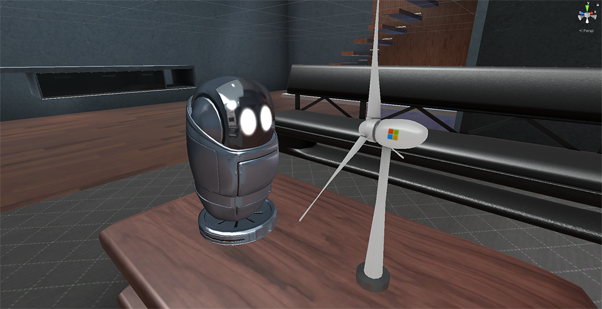

# MRTK3 Tutorial: "Zappy's Playground"

Zappy's Playground is a cross-platform developer sample that showcases how to develop intuitive and comprehensive end-to-end experiences for mixed reality. Using the latest features from Microsoft and Unity such as MRTK3, OpenXR, XRI, ARFoundation and more, it provides a place to learn and a foundation for your own app development.

In this tutorial, you'll gain experience with the following features:

- Use gaze to view text in an expanding tile.
- Move towards objects and have them expand as a result.
- Use data-driven UI objects such as name input.
- Gaze to interact with distant content and reveal more information.
- Gaze and pinch to select objects at a distance.
- Use surface magnetism to orient holographic objects to real-world surfaces.
- Listen to spatial audio to help you locate objects in 3D space.
- Grab, rotate and scale objects using bounds control.
- Use different audio or visual themes to enhance the experience.

Here's a summary of the MRTK3 features that are covered in the tutorial:

Directional Indicators  
Scene Understanding  
Gaze and pinch  
Surface Magnetism  
Near and Far Interaction  
UX Controls  
Bounds Controls  
Data Binding  
UI Follow  
Spatial Audio  
Theming