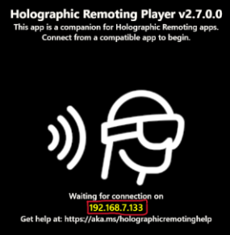
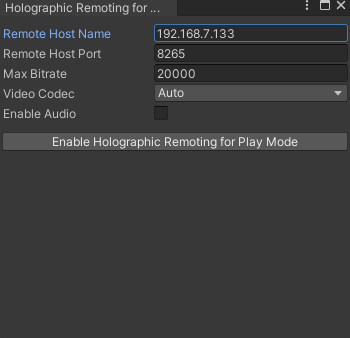

# Preview and debug your app using Holographic Remoting and Play mode

This article explains the following use case for Holographic Remoting: 

- **You want to preview and debug your app during the development process**: You can run your app locally in the Unity editor on your PC in Play Mode and stream the experience to your HoloLens. This provides a way to quickly debug your app without building and deploying a full project. We call this type of app a _Holographic Remoting Play Mode Preview app_. Inputs from the HoloLens--gaze, gesture, voice, and spatial mapping--are sent to the PC, where content is rendered in a virtual immersive view. The rendered frames are then sent to the HoloLens. 

To learn more about Holographic Remoting, see [Holographic Remoting Overview](../native/holographic-remoting-overview.md)

Note that you can also use Holographic Remoting if [you want the resources of a PC to power your app](use-pc-resources.md) instead of relying on the HoloLens on-board resources.

## Set up Holographic Remoting

To use Holographic Remoting, you need to install the [Holographic Remoting Player](../native/holographic-remoting-player.md) app from the Microsoft Store on your HoloLens (in this article, we'll refer to it simply as "the Player"). As explained below, after you download and run the app, you'll see the version number and IP address to connect to. **You'll need v2.4 or later in order to work with the OpenXR plugin**.

Holographic Remoting requires a fast PC and Wi-Fi connection. You can find more details in the Holographic Remoting Player article linked above.

# [Unity 2020 + OpenXR](#tab/openxr)

The following steps assume that you have already set up your project to use OpenXR (in other words, you've imported the required packages and chosen settings for the OpenXR plug-in). If you haven't yet done this, see our articles describing how to set up a new OpenXR project [with MRTK](/windows/mixed-reality/develop/unity/new-openxr-project-with-mrtk) or [without it](/windows/mixed-reality/develop/unity/new-openxr-project-without-mrtk).

1. On your HoloLens 2, go to the **Microsoft Store** and install the [Player](https://www.microsoft.com/store/p/holographic-remoting-player/9nblggh4sv40)**.
1. On your HoloLens 2, launch and play the Player. Note that on the Start menu, the tile for the Player says **Holographic Remoting**. After launching the Player, make sure to press the "Play" button which appears in the middle of the Player's interface. 
1. In Unity, on the menu bar, select **Mixed Reality** > **Remoting** > **Holographic remoting for play mode**.

    

1. In the **Holographic Remoting for Play Mode** window, in the **Remote Host Name** box, enter the IP address of your HoloLens 2.

    > [!TIP]
    > The IP address of your HoloLens 2 can be found on the first screen of the Player after you click "Play" to start it.

    

1. Change other settings as needed.
1. Click the **Enable Holographic Remoting for Play Mode** button.

    

1. Select the Play button to enter Play Mode, and then view the app in your HoloLens 2.

    > [!TIP]
    > To debug C# scripts in play mode, [attach Visual Studio to Unity](/visualstudio/gamedev/unity/get-started/using-visual-studio-tools-for-unity?pivots=windows).

# [Unity 2019/2020 + Windows XR Plugin](#tab/winxr)

1. On your HoloLens 2, go to the **Microsoft Store** and install the [Player](https://www.microsoft.com/store/p/holographic-remoting-player/9nblggh4sv40)** app.
1. On your HoloLens 2, start the Player. Note that on the Start menu, the tile for the Player says **Holographic Remoting**.
1. In Unity, go to the **Edit** menu and select **Project Settings**.
1. Select **XR Plug-in Management**.
1. Ensure the **PC, Mac & Linux Standalone** tab is selected, find **Windows Mixed Reality** in the list, and check its checkbox.
1. Next, go to the **Window** menu, expand the **XR** submenu, and select **Windows XR Plugin Remoting**.
1. Set **Emulation Mode** to **Remote to Device**.
1. For **Remote Machine**, enter the IP address of your HoloLens 2.
1. To connect, do one of the following:
   - To manually connect, uncheck **Connect on Play**, and select **Connect**. You should see **Connection Status** change to **Connected** and see the screen go blank in the HoloLens 2.
   - To automatically connect, check **Connect on Play**. The editor will attempt to connect once Play Mode is started.
1. Select the **Play** button to start Play Mode and experience the app on your HoloLens 2. To debug C# scripts in Play mode, [attach Visual Studio to Unity](/visualstudio/gamedev/unity/get-started/using-visual-studio-tools-for-unity?pivots=windows).

# [Legacy WSA](#tab/wsa)

1. On your HoloLens, go to the **Microsoft Store** and install the [Player](https://www.microsoft.com/store/p/holographic-remoting-player/9nblggh4sv40)** app.
1. On your HoloLens, start the Player. Note that on the Start menu, the tile for the Player says **Holographic Remoting**.
1. In Unity, go to the **Window** menu, expand the **XR** submenu, and select **Holographic Emulation** (marked as deprecated in Unity 2019).
1. Set **Emulation Mode** to **Remote to Device**.
1. Set **Device Version** according to if you're using a first generation HoloLens or a HoloLens 2.
1. For **Remote Machine**, enter the IP address of your HoloLens.
1. Select **Connect**. You should see **Connection Status** change to **Connected** and see the screen go blank in the HoloLens.
1. Select the Play button to start Play Mode and experience the app on your HoloLens. To debug C# scripts in play mode, [attach Visual Studio to Unity](/visualstudio/gamedev/unity/get-started/using-visual-studio-tools-for-unity?pivots=windows).

> [!TIP]
> For best results, make sure your app properly sets the [../focus point](focus-point-in-unity.md). This helps Holographic Remoting to best adapt your scene to the latency of your wireless connection.

## See Also
* [Holographic Remoting Player](../native/holographic-remoting-player.md)
* [Tutorial: Getting started with PC Holographic Remoting](/learn/modules/pc-holographic-remoting-tutorials/)
* [Tutorial: Creating a Holographic Remoting PC application](/learn/modules/pc-holographic-remoting-tutorials/4-create-holographic-remoting-pc-application)