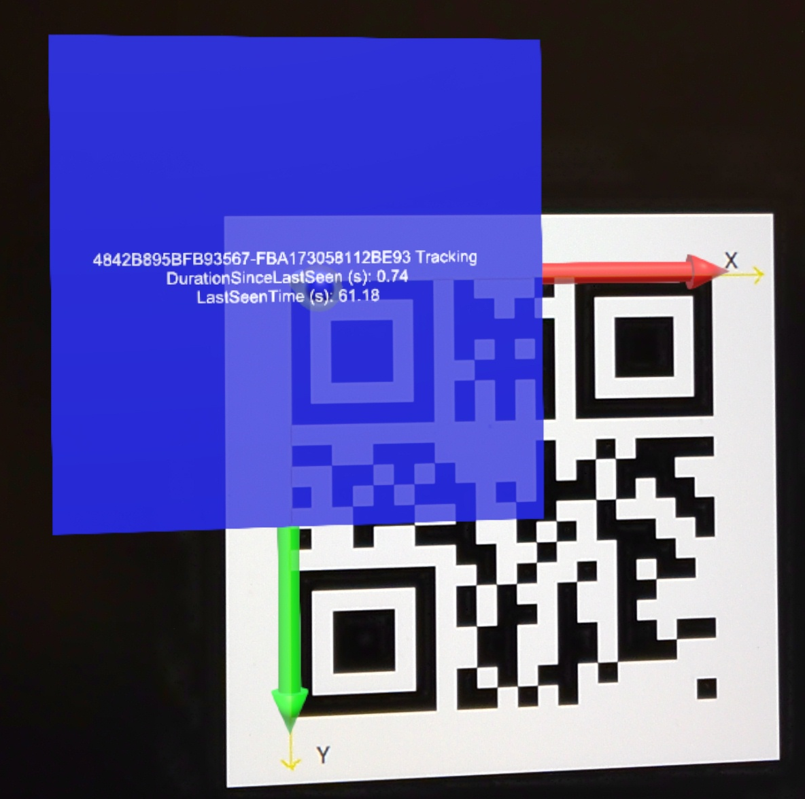
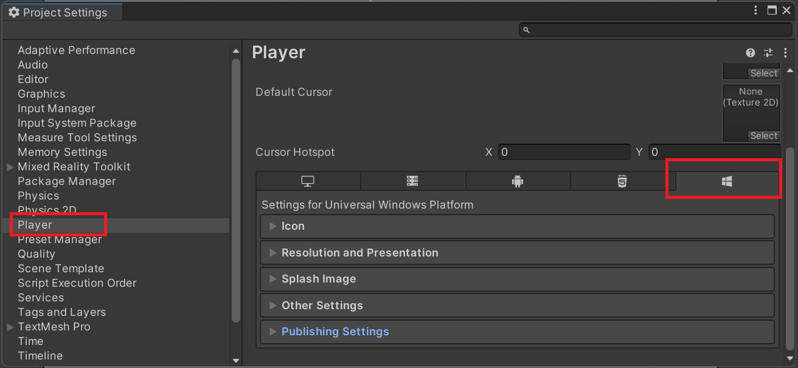
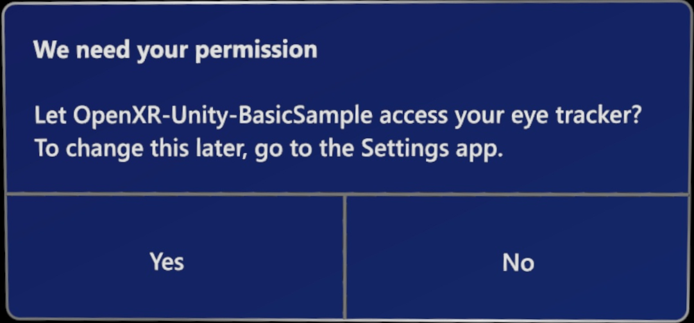
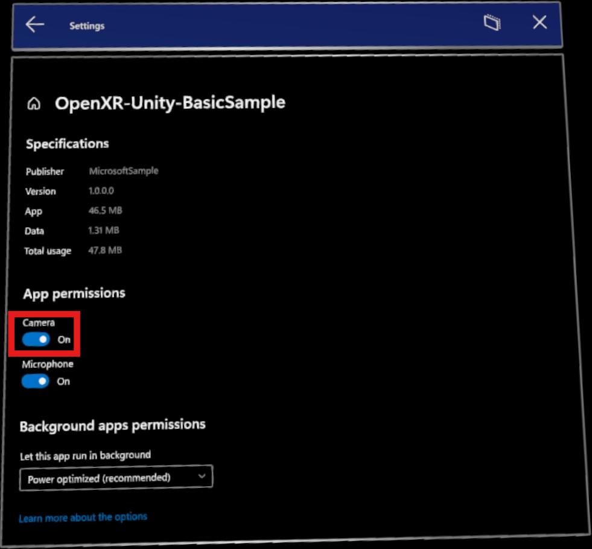
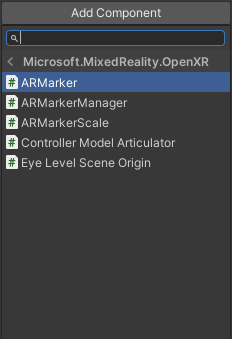
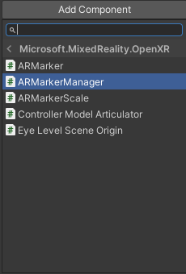
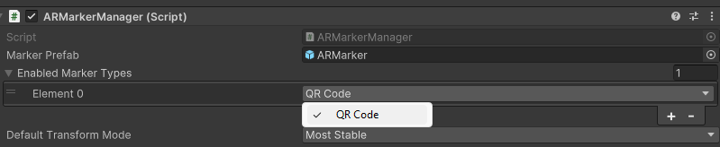
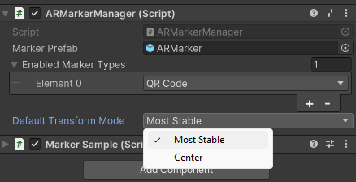
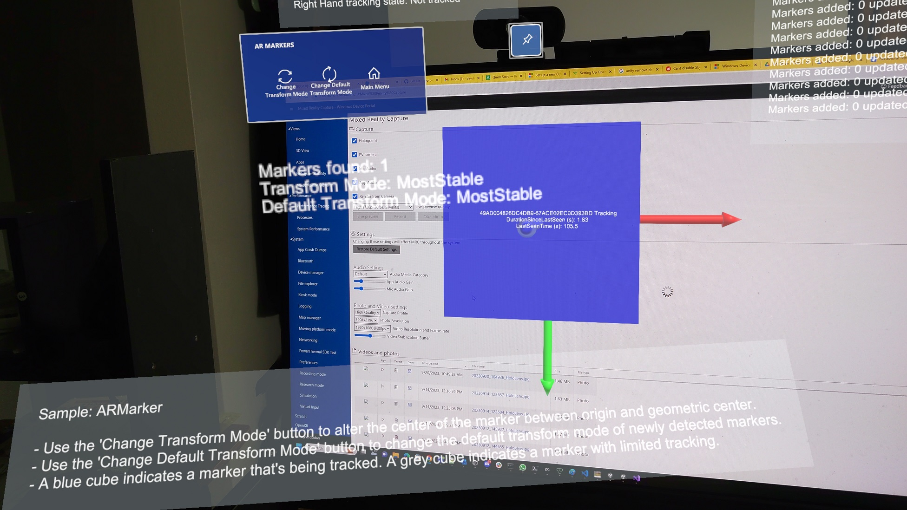
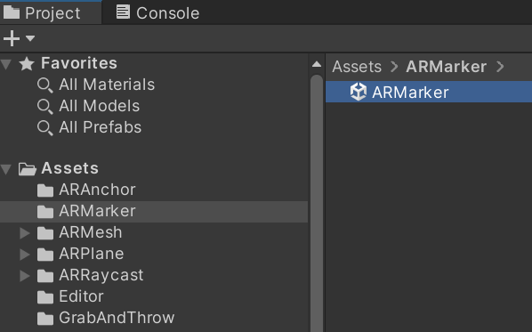

# QR codes in Unity

HoloLens 2 headsets can track and detect QR codes that can be used to provide holograms and other AR features. This article guides you through everything you need to know to start using QR codes in your Unity app, including:

* Adding QR code detection to your Unity app.
* Understanding important concepts and Unity components you need to use.
* Provides tutorials that cover common QR code usage.
* Introduces the [AR Marker sample scenario](https://github.com/microsoft/OpenXR-Unity-MixedReality-Samples/tree/main/SampleScenarios/Scenarios/MarkerSample/Scripts) that demonstrates of a QR code-enabled scene and example scripts.

Before continuing with this article, we recommend going through the [QR codes overview](../advanced-concepts/qr-code-tracking-overview.md).



## Configuring your Unity project and app

Your Unity project and app must be set up and configured properly to enable QR code functionality, which requires:

* OpenXR for Windows Mixed Reality version 113.2403.5001 or later.
  > [!NOTE]
  > This comes with the OS and can be updated through Windows Store. Please be aware that users may have earlier versions installed, and their devices will be unable to work with AR markers such as QR codes until updating to version 113.2403.5001 or later.
* A project compatible with a supported version of Unity:
  * Unity 2022.3 LTS (Recommended)
  * Unity 2021.3 LTS
* The Mixed Reality OpenXR Plugin.
* Webcam capabilities enabled for your Unity project.
* Camera permissions granted to your app.

The following sections guide you through how to configure your Unity project and app to enable QR code detection.

### Getting the Mixed Reality OpenXR Plugin

The [Mixed Reality OpenXR Plugin](https://assetstore.unity.com/packages/add-ons/mixed-reality-openxr-plugin-275111#releases) package contains [C# APIs](/dotnet/api/microsoft.mixedreality.openxr) you can use to access QR code functionality.

To import the package:

1. [Download](https://www.microsoft.com/download/details.aspx?id=102778) and run the Mixed Reality Feature Tool.
1. Install the Mixed Reality OpenXR Plugin as indicated:
  

The Mixed Reality Feature Tool also simplifies package management and can be used to find, update, and add the Mixed Reality features your app requires. See [Welcome to the Mixed Reality Feature Tool](./mixed-reality-openxr-plugin.md) for detailed instructions on how to use the tool.

### Enabling WebCam capabilities

To detect and track QR codes, your Unity project needs to have **WebCam** capabilities enabled.

To enable **WebCam** capabilities:

1. Open your Unity project.
1. Click **Edit** in the Unity editor’s app menu.
1. Go to **Project Settings > Player** and select the **UWP** tab as shown:

1. Enable **WebCam** in the **Capabilities** list.
  
1. Exit **Project Settings**.

**WebCam** capabilities are now enabled for your Unity app. However, your app must still be granted permissions to access the device camera.

### Granting your app camera access permissions

If your app has **WebCam** capabilities enabled, the permissions dialog prompts users to grant your app access to the device camera.



This dialog is shown to users only once, typically when entering a scene containing an [`ARMarkerManager`](/dotnet/api/microsoft.mixedreality.openxr.armarkermanager) with QR code marker support [enabled](#adding-armarkermanager-to-a-scene). If camera access is denied, users can go to **Settings > Apps** and enable it through the app's **Advanced Options**.



### Building QR code detection into a scene

QR code detection must be built into every scene you want to use QR codes in, which requires:

* A [`GameObject`](https://docs.unity3d.com/Manual/Hierarchy.html) with [`ARMarkerManager`](/dotnet/api/microsoft.mixedreality.openxr.armarkermanager) attached. [`ARMarkerManager`](/dotnet/api/microsoft.mixedreality.openxr.armarkermanager) is solely responsible for creating, updating, and removing every `GameObject` for detected QR codes.
* A prefab with [`ARMarker`](/dotnet/api/microsoft.mixedreality.openxr.armarker) attached.
* [`ARMarkerManager`](/dotnet/api/microsoft.mixedreality.openxr.armarkermanager) configured to use the prefab when creating a `GameObject` when a QR code is detected.

### Creating a prefab for QR codes

To use QR codes in your scene, you need to create a prefab for QR codes. [`ARMarkerManager`](/dotnet/api/microsoft.mixedreality.openxr.armarkermanager) uses this prefab to create a `GameObject` from whenever a QR code is detected.

To make a prefab for QR codes:

1. [Create a new prefab](https://docs.unity3d.com/Manual/CreatingPrefabs.html) for your project.
1. Add the [`ARMarker`](/dotnet/api/microsoft.mixedreality.openxr.armarker)component to the prefab, located under **Script > Microsoft.MixedReality.OpenXR > ARMarker**.<br/>
  

You now have a basic prefab to work with. You likely want your app to visually represent QR codes that are detected in the environment. The next section walks you through how to add a visual representation for QR codes.

### Adding Visuals

In the previous section, adding [`ARMarker`](/dotnet/api/microsoft.mixedreality.openxr.armarker)to the prefab also automatically added the [`ARMarkerScale`](/dotnet/api/microsoft.mixedreality.openxr.armarkerscale) component. This component is used to match the scale of a QR code's visual representation to its physical counterpart.

To do so:

1. Add an empty `GameObject` to the prefab you created in the previous section. It will represent all visual *marker content*.
1. Add a child 3D `GameObject`, such as a `Quad`, to the marker content `GameObject`.
  
1. In the prefab's [`ARMarkerScale`](/dotnet/api/microsoft.mixedreality.openxr.armarkerscale) component, set [**Marker Scale Transform**](/dotnet/api/microsoft.mixedreality.openxr.armarkerscale.markerscaletransform) to the marker content `GameObject`. Setting this field ensures the 3D `GameObject` you chose is scaled correctly to match real-world QR codes.

## Adding `ARMarkerManager` to a scene

[`ARMarkerManager`](/dotnet/api/microsoft.mixedreality.openxr.armarkermanager) is solely responsible for creating, updating, and removing every `GameObject` for detected QR codes.

To add [`ARMarkerManager`](/dotnet/api/microsoft.mixedreality.openxr.armarkermanager) to your scene:

1. Place a [`GameObject`](https://docs.unity3d.com/Manual/Hierarchy.html) into your scene.
1. Add the [`ARMarkerManager`](/dotnet/api/microsoft.mixedreality.openxr.armarkermanager) component to the `GameObject`, located under **Script > Microsoft.MixedReality.OpenXR > ARMarkerManager**.<br/>
  
1. Set the [`ARMarkerManager`](/dotnet/api/microsoft.mixedreality.openxr.armarkermanager) **Marker Prefab** field to the prefab you created in the previous section.
  
1. Expand **Enabled Marker Types**, then choose an element and set it to **QR Code**.
  

## Keeping track of QR code changes

[`ARMarkerManager`](/dotnet/api/microsoft.mixedreality.openxr.armarkermanager) contains the [`markersChanged`](/dotnet/api/microsoft.mixedreality.openxr.armarkermanager.markerschanged) event, which provides [`ARMarkersChangedEventArgs`](/dotnet/api/microsoft.mixedreality.openxr.armarkerschangedeventargs) to subscribers. Use these event arguments to track which QR codes are added or removed from detection or updated pose data.

The following code demonstrates subscribing to the [`ARMarkerManager.markersChanged`](/dotnet/api/microsoft.mixedreality.openxr.armarkermanager.markerschanged) event, using its event arguments to iterate through the [`ARMarker`](/dotnet/api/microsoft.mixedreality.openxr.armarker) objects [`ARMarkerManager`](/dotnet/api/microsoft.mixedreality.openxr.armarkermanager) is handling and writing to Debug whether they are added, removed, or updated.

```csharp
using System;
using Microsoft.MixedReality.OpenXR;

// ...

private void Awake()
{
    m_arMarkerManager = GetComponent<ARMarkerManager>();
    m_arMarkerManager.markersChanged += OnQRCodesChanged;
}

void OnQRCodesChanged(ARMarkersChangedEventArgs args)
{
    foreach (ARMarker qrCode in args.added)
        Debug.Log($"QR code with the ID {qrCode.trackableId} added.");

    foreach (ARMarker qrCode in args.removed)
        Debug.Log($"QR code with the ID {qrCode.trackableId} removed.");

    foreach (ARMarker qrCode in args.updated)
    {
        Debug.Log($"QR code with the ID {qrCode.trackableId} updated.");
        Debug.Log($"Pos:{qrCode.transform.position} Rot:{qrCode.transform.rotation} Size:{qrCode.size}");
    }
}
```

## Getting the time a QR code was last detected

Use the [`ARMarker.lastSeenTime`](/dotnet/api/microsoft.mixedreality.openxr.armarker.lastseentime) property to determine when the device last tracked a detected QR code and the amount of time, if any, tracking is lost. Time is measured in the number of seconds since Unity started your application and is analogous to [`UnityEngine.Time.realtimeSinceStartup`](https://docs.unity3d.com/2022.3/Documentation/ScriptReference/Time-realtimeSinceStartup.html).

## Using a QR code's trackable ID

QR codes are [trackables](https://docs.unity3d.com/Packages/com.unity.xr.arfoundation@5.1/manual/architecture/managers.html#trackables-and-trackable-managers), which are anything an AR device can detect and track in a physical environment. Trackables derive from the type [`ARTrackable<TSessionRelativeDataTTrackable>`](https://docs.unity3d.com/Packages/com.unity.xr.arfoundation@6.0/api/UnityEngine.XR.ARFoundation.ARTrackable-2.html) that provides an ID, tracking state, pose, and other data.

The trackable ID for a QR code can be passed into [`ARMarkerManager`](/dotnet/api/microsoft.mixedreality.openxr.armarkermanager) methods to get the QR code’s properties, raw byte data, and string representation, and to set the transform mode for the QR code. These methods allow you to retrieve data for a QR code without having to hold on to an [`ARMarker`](/dotnet/api/microsoft.mixedreality.openxr.armarker) object reference.

You can pass a QR code's ID into the following [`ARMarkerManager`](/dotnet/api/microsoft.mixedreality.openxr.armarkermanager) methods:

* [`GetDecodedString(UnityEngine.XR.ARSubsystems.TrackableId trackableId)`](/dotnet/api/microsoft.mixedreality.openxr.armarkermanager.getdecodedstring)
* [`GetMarker(UnityEngine.XR.ARSubsystems.TrackableId trackableId)`](/dotnet/api/microsoft.mixedreality.openxr.armarkermanager.getmarker)
* [`GetQRCodeProperties(UnityEngine.XR.ARSubsystems.TrackableId)`](/dotnet/api/microsoft.mixedreality.openxr.armarkermanager.getqrcodeproperties)
* [`GetRawData(UnityEngine.XR.ARSubsystems.TrackableId, Unity.Collections.Allocator)`](/dotnet/api/microsoft.mixedreality.openxr.armarkermanager.getrawdata)
* [`SetTransformMode(UnityEngine.XR.ARSubsystems.TrackableId, Microsoft.MixedReality.OpenXR.TransformMode)`](/dotnet/api/microsoft.mixedreality.openxr.armarkermanager.settransformmode)

> [!NOTE]
> For the `GetRawData` method parameter `allocator`, passing [`Unity.Collections.Allocator.Temp`](https://docs.unity3d.com/2021.3/Documentation/ScriptReference/Unity.Collections.Allocator.Temp.html) is sufficient for most scenarios.

## Following the tracking state of a QR code

Because an [`ARMarker`](/dotnet/api/microsoft.mixedreality.openxr.armarker) is trackable, it inherits the `trackingState` property and is set to one of three [`UnityEngine.XR.ARSubsystems.TrackingState`](https://docs.unity3d.com/Packages/com.unity.xr.arfoundation@5.1/api/UnityEngine.XR.ARSubsystems.TrackingState.html):

* `Limited`: Indicates that the QR code is being tracked but limited information is available or is of poor quality.
* `Tracking`: Specifies that the QR code is being fully tracked.
* `None`: Indicates that the QR code isn't being tracked.

To monitor tracking state for a QR code, subscribe to the [`ARMarkerManager.markersChanged`](/dotnet/api/microsoft.mixedreality.openxr.armarkermanager.markerschanged) and iterate through the [`ARMarker`](/dotnet/api/microsoft.mixedreality.openxr.armarker) marker collections provided in the event arguments passed to your event handler.

The following code demonstrates using the [`ARMarkerManager.markersChanged`](/dotnet/api/microsoft.mixedreality.openxr.armarkermanager.markerschanged) event to iterate through [`ARMarker`](/dotnet/api/microsoft.mixedreality.openxr.armarker) objects for newly detected QR codes and writing their trackable ID to the Debug window.

```csharp
using System;
using Microsoft.MixedReality.OpenXR;

// ...

private void Awake()
{
    m_arMarkerManager = GetComponent<ARMarkerManager>();
    m_arMarkerManager.markersChanged += OnQRCodesChanged;
}

void OnQRCodesChanged(ARMarkersChangedEventArgs args)
{
    foreach (ARMarker qrCode in args.added)
    {
       if (qrCode.trackingState == UnityEngine.XR.ARSubsystems.TrackingState.Tracking)
           Debug.Log($"Fully tracked QR code with the ID {qrCode.trackableId} was added.");
    }
}
```

## Getting a QR code's version and QR code type

To get the version and type of a detected QR code:

1. Call [`ARMarker.GetQRCodeProperties()`](/dotnet/api/microsoft.mixedreality.openxr.armarker.getqrcodeproperties), which returns a [`QRCodeProperties`](/dotnet/api/microsoft.mixedreality.openxr.qrcodeproperties) instance.
1. Access the field [`/dotnet/api/microsoft.mixedreality.openxr.qrcodeproperties.type`] in the return value to get the QR code's type. The value is either [`QRCodeType.QRCode`](/dotnet/api/microsoft.mixedreality.openxr.qrcodetype) or [`QRCodeType.MicroQRCode`](/dotnet/api/microsoft.mixedreality.openxr.qrcodetype).
1. Access the return value's [`QRCodeProperties.version`](/dotnet/api/microsoft.mixedreality.openxr.qrcodeproperties.version) field to get the QR code's version. The value ranges from 1 to 40 if the type is [`QRCodeType.QRCode`](/dotnet/api/microsoft.mixedreality.openxr.qrcodetype), and from 1 to 4 if the type is [`QRCodeType.MicroQRCode`](/dotnet/api/microsoft.mixedreality.openxr.qrcodetype).

As an alternative, pass an [`ARMarker`](/dotnet/api/microsoft.mixedreality.openxr.armarker) object's trackable ID to [`ARMarkerManager.GetQRCodeProperties(TrackableId)`](/dotnet/api/microsoft.mixedreality.openxr.armarkermanager.getqrcodeproperties) to get a QR code's type and version.

  > [!WARNING]
  > QR codes are the only marker type currently supported though support for other marker types may be added in future releases. If `markerType` is not [`ARMarkerType.QRCode`](/dotnet/api/microsoft.mixedreality.openxr.armarkertype), calling [`GetQRCodeProperties(TrackableId)`](/dotnet/api/microsoft.mixedreality.openxr.armarkermanager.getqrcodeproperties) throws [`System.InvalidOperationException`](/dotnet/fundamentals/runtime-libraries/system-invalidoperationexception). Consider wrapping calls to [`GetQRCodeProperties(TrackableId)`](/dotnet/api/microsoft.mixedreality.openxr.armarkermanager.getqrcodeproperties) in try-catch blocks if this could cause issues in your app later on.

## Reading QR data

The [`ARMarker`](/dotnet/api/microsoft.mixedreality.openxr.armarker) component is attached to every `GameObject` that [`ARMarkerManager`](/dotnet/api/microsoft.mixedreality.openxr.armarkermanager) creates. [`ARMarker`](/dotnet/api/microsoft.mixedreality.openxr.armarker) provides two methods that return QR code data:

* [`GetDecodedString()`](/dotnet/api/microsoft.mixedreality.openxr.armarker.getdecodedstring): This method gets the QR code's string representation, such as a URL.

* [`GetRawData(Unity.Collections.Allocator allocator)`](/dotnet/api/microsoft.mixedreality.openxr.armarker.getrawdata): This method returns QR code content as a byte array, allowing fine-grain tuning on how the array is allocated. Use this method in hot paths and other situations where performance is critical.

The following code demonstrates basic usage of [`GetDecodedString()`](/dotnet/api/microsoft.mixedreality.openxr.armarker.getdecodedstring) and [`GetRawData(Unity.Collections.Allocator allocator)`](/dotnet/api/microsoft.mixedreality.openxr.armarker.getrawdata):

```csharp
using System;
using Microsoft.MixedReality.OpenXR;

// ...

void OnQRCodesChanged(ARMarkersChangedEventArgs args)
{
    foreach (ARMarker qrCode in args.added)
    {
        var text = qrCode.GetDecodedString();
        Debug.Log($"QR code text: {text}");

        var bytes = qrCode.GetRawData(Unity.Collections.Allocator.Temp);
        Debug.Log($"QR code bytes: {bytes.Length}");
        bytes.Dispose();
    }
}
```

### Obtaining QR code size, position, rotation, and center

An [`ARMarker`](/dotnet/api/microsoft.mixedreality.openxr.armarker) object provides the size, position, rotation, and center of the QR code that it represents.

To obtain the QR code's size in meters, use the property [`ARMarker.size`](/dotnet/api/microsoft.mixedreality.openxr.armarker.size).

Use the `ARMarker.transform` property to obtain the rotation and world space position of the QR code's transform, and [`ARMarker.center`](/dotnet/api/microsoft.mixedreality.openxr.armarker.center) to QR code's 2D coordinates relative to the QR code's transform. The transform itself is centered according to whether [`ARMarker.transformMode`](/dotnet/api/microsoft.mixedreality.openxr.armarker.transformmode) (the *transform mode*) is set to [`TransformMode.MostStable`](/dotnet/api/microsoft.mixedreality.openxr.transformmode) (*most stable*, the QR code's top-left) or [`TransformMode.Center`](/dotnet/api/microsoft.mixedreality.openxr.transformmode) (*center*, the QR code's geometric center).

Use the [`ARMarkerManager.defaultTransformMode`](/dotnet/api/microsoft.mixedreality.openxr.armarkermanager.defaulttransformmode) field to set the transform mode [`ARMarkerManager`](/dotnet/api/microsoft.mixedreality.openxr.armarkermanager) creates new [`ARMarker`](/dotnet/api/microsoft.mixedreality.openxr.armarker) objects with. The field is initialized with the `Default Transform Mode` field is set to in the Unity Inspector as shown:



As an alternative to using `ARMarker.transformMode`, pass an [`ARMarker`](/dotnet/api/microsoft.mixedreality.openxr.armarker) object's trackable ID to [`ARMarkerManager.SetTransformMode(TrackableId, TransformMode)`](/dotnet/api/microsoft.mixedreality.openxr.armarkermanager.settransformmode) to set its transform mode.

The following code demonstrates getting a new QR code's size and center, the position and rotation of its transform, and updated transform position after changing the transform mode.

```csharp
using System;
using Microsoft.MixedReality.OpenXR;

// ...

void OnMarkersChanged(ARMarkersChangedEventArgs args)
{
    Debug.Log($"Default transform mode is {ARMarkerManager.Instance.defaultTransformMode}./n");

    if (e.added.Count > 0)
    {
        ARMarker qrCode = args.added[0];

        Debug.Log($"Position: {qrCode.transform.position}");
        Debug.Log($"Rotation: {qrCode.transform.rotation}");
        Debug.Log($"Center: {qrCode.center}");

        if (qrCode.transformMode == TransformMode.Center)
            qrCode.transformMode = TransformMode.MostStable;
        else
            qrCode.transformMode = TransformMode.Center;

        Debug.Log($"QR code's transform mode is now set to {qrCode.transformMode}. /n");
        Debug.Log($"New position: {qrCode.transform.position}");
    }
}
```

## AR marker sample scenario

The sample provided with the OpenXR Plugin package contains a QR code-enabled scene that provides an example of how [`ARMarkerManager`](/dotnet/api/microsoft.mixedreality.openxr.armarkermanager) and [`ARMarker`](/dotnet/api/microsoft.mixedreality.openxr.armarker) can be used.



The scene is located in **Assets > ARMarker** as shown:


You can find the C# scripts used in the scene in the [OpenXR Unity Mixed Reality Samples repo](https://github.com/microsoft/OpenXR-Unity-MixedReality-Samples/tree/main) on GitHub:
[/OpenXR-Unity-MixedReality-Samples/tree/main/SampleScenarios/Scenarios/MarkerSample/Scripts](https://github.com/microsoft/OpenXR-Unity-MixedReality-Samples/tree/main/SampleScenarios/Scenarios/MarkerSample/Scripts)

## See also

* [Mixed Reality OpenXR Plugin API Reference](/dotnet/api/microsoft.mixedreality.openxr)
* [QR codes overview](../advanced-concepts/qr-code-tracking-overview.md)
