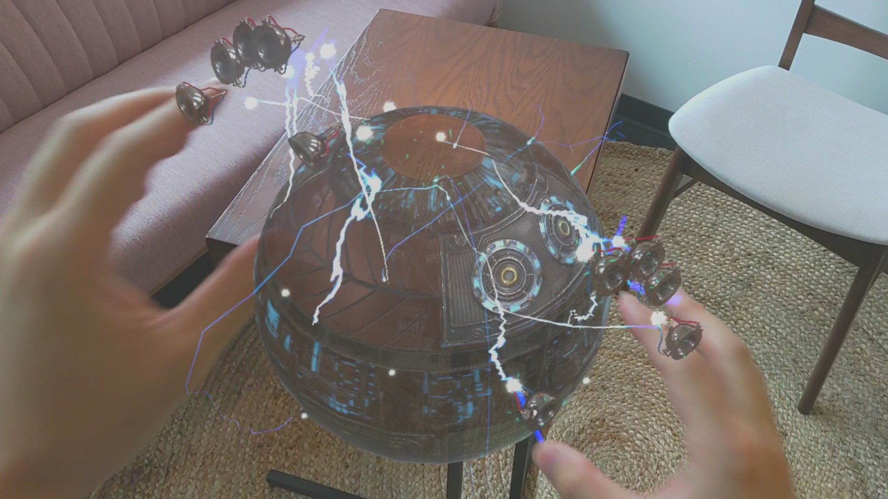

# Surfaces

>[!NOTE]
>This article discusses an exploratory sample we’ve created in the [Mixed Reality Design Labs](https://github.com/Microsoft/MRDesignLabs_Unity), a place where we share our learnings about and suggestions for mixed reality app development. Our design-related articles and code will evolve as we make new discoveries.

[Surfaces](https://github.com/microsoft/MRDL_Unity_Surfaces)  is an open-source sample app from Microsoft's Mixed Reality Design Labs. It explores how we can create a tactile sensation with visual, audio, and fully articulated hand-tracking.

## Download app from Microsoft Store in HoloLens 2
If you have HoloLens 2 device, you can directly download and install the app in your device.

## Demo video 

> [!VIDEO https://www.microsoft.com/en-us/videoplayer/embed/RE4IhWQ]

Recorded with HoloLens 2 using Mixed Reality Capture

## About the app

Surfaces demonstrates how to use Mixed Reality Toolkit(MRTK)'s input system and building blocks to create an app experience for HoloLens 2. In this project, you can find the examples of:

- Use MRTK's [Input System](/windows/mixed-reality/mrtk-unity/features/input/overview), specifically hand / joint tracking.
- Use MRTK's [Standard Shader](/windows/mixed-reality/mrtk-unity/features/rendering/mrtk-standard-shader) for performant graphics.

You can use this project's components to create your own mixed reality app experiences.

## MR Dev Days 2020 - Learnings from the MR Surfaces App

[Learnings from the MR Surfaces App](/shows/Mixed-Reality/Learnings-from-the-MR-Surfaces-App)

Lars Simkins, Senior designer behind the MRDL Surfaces app talks about the app's design story and technical highlights.

## Project repository on GitHub

[https://github.com/microsoft/MRDL_Unity_Surfaces](https://github.com/microsoft/MRDL_Unity_Surfaces)

## About the author

<table style="border-collapse:collapse" padding-left="0px">
<tr>
<td style="border-style: none" width="60px"></td>
<td style="border-style: none"><a href="http://dongyoonpark.com" target="_blank"><b>Yoon Park</b></a> UX Designer @Microsoft</td>
</tr>
</table>

## See also

* [MRTK Examples Hub](/windows/mixed-reality/mrtk-unity/features/example-scenes/example-hub) - [(Download from Microsoft Store in HoloLens 2)](https://www.microsoft.com/en-us/p/mrtk-examples-hub/9mv8c39l2sj4)
* [Surfaces](sampleapp-surfaces.md) - [(Download from Microsoft Store in HoloLens 2)](https://www.microsoft.com/en-us/p/surfaces/9nvkpv3sk3x0)
* [Periodic Table of the Elements 2.0](https://medium.com/@dongyoonpark/bringing-the-periodic-table-of-the-elements-app-to-hololens-2-with-mrtk-v2-a6e3d8362158)
* [Galaxy Explorer 2.0](galaxy-explorer-update.md)