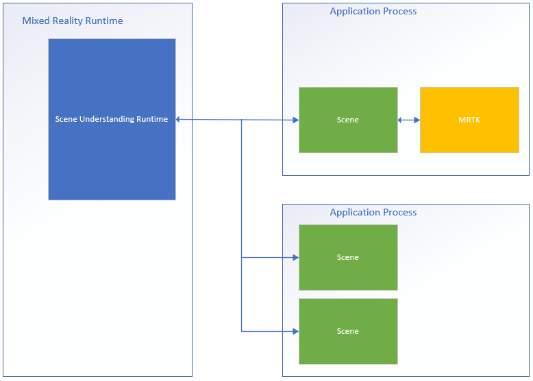

# Scene understanding SDK overview

Scene understanding transforms the unstructured environment sensor data that your Mixed Reality device captures and converts it into a powerful abstract representation. The SDK acts as the communication layer between your application and the Scene Understanding runtime. It's aimed to mimic existing standard constructs, such as 3D scene graphs for 3D representations, and 2D rectangles and panels for 2D applications. While the constructs Scene Understanding mimics will map to concrete frameworks, in general SceneUnderstanding is framework agnostic allowing for interoperability between varied frameworks that interact with it. As Scene Understanding evolves the role of the SDK is to ensure new representations and capabilities continue to be exposed within a unified framework. In this document, we will first introduce high-level concepts that will help you get familiar with the development environment/usage and then provide more detailed documentation for specific classes and constructs.

## Where do I get the SDK?

The SceneUnderstanding SDK is downloadable via the [Mixed Reality Feature Tool](../unity/welcome-to-mr-feature-tool.md).
<!--Unity Note-->
**Note:** the latest release depends on preview packages and you'll need to enable pre-release packages to see it.

For version 0.5.2022-rc and later, Scene Understanding supports language projections for C# and C++ allowing applications to develop applications for Win32 or UWP platforms. As of this version, SceneUnderstanding supports unity in-editor support barring the SceneObserver, which is used solely for communicating with HoloLens2. 
<!-- Unity Note: Since C++ is mentioned, it's not strictly Unity. Not sure about the C#. -->
SceneUnderstanding requires Windows SDK version 18362 or higher. 

## Conceptual Overview

### The Scene

Your mixed reality device is constantly integrating information about what it sees in your environment. Scene Understanding funnels all of these data sources and produces one single cohesive abstraction. Scene Understanding generates Scenes, which are a composition of [SceneObjects](scene-understanding-SDK.md#sceneobjects) that represent an instance of a single thing, (for example, a wall/ceiling/floor.) Scene Objects themselves are a composition of [SceneComponents, which represent more granular pieces that make up this SceneObject. Examples of components are quads and meshes, but in the future could represent bounding boxes, collision meshes, metadata etc.

The process of converting the raw sensor data into a Scene is a potentially expensive operation that could take seconds for medium spaces (~10x10m) to minutes for large spaces (~50x50m) and therefore it is not something that is being computed by the device without application request. Instead, Scene generation is triggered by your application on demand. The SceneObserver class has static methods that can Compute or Deserialize a scene, which you can then enumerate/interact with. The "Compute" action is executed on-demand and executes on the CPU but in a separate process (the Mixed Reality Driver). However, while we do compute in another process the resulting Scene data is stored and maintained in your application in the Scene object. 

Below is a diagram that illustrates this process flow and shows examples of two applications interfacing with the Scene Understanding runtime. 



On the left-hand side is a diagram of the mixed reality runtime, which is always on and running in its own process. This runtime is responsible for performing device tracking, spatial mapping, and other operations that Scene Understanding uses to understand and reason about the world around you. On the right side of the diagram, we show two theoretical applications that make use of Scene Understanding. The first application interfaces with MRTK<!--Unity Note-->, which uses the Scene Understanding SDK internally, the second app computes and uses two separate scene instances. All three Scenes in this diagram generate distinct instances of the scenes, the driver isn't tracking global state that is shared between applications and Scene Objects in one scene aren't found in another. Scene Understanding does provide a mechanism to track over time, but this is done using the SDK. Tracking code is already running in the SDK in your app's process.

Because each Scene stores its data in your application's memory space, you can assume that all functions of the Scene object or its internal data are always executed in your application's process.

### Layout

To work with Scene Understanding, it may be valuable to know and understand how the runtime represents components logically and physically. The Scene represents data with a specific layout that was chosen to be simple while maintaining an underlying structure that is pliable to meet future requirements without needing major revisions. The Scene does this by storing all Components (building blocks for all Scene Objects) in a flat list and defining hierarchy and composition through references where specific components reference others.

Below we present an example of a structure in both its flat and logical form.

<table>
<tr><th>Logical Layout</th><th>Physical Layout</th></tr>
<tr>
<td>
<ul>
  Scene
  <ul>
  <li>SceneObject_1
    <ul>
      <li>SceneMesh_1</li>
      <li>SceneQuad_1</li>
      <li>SceneQuad_2</li>
    </ul>
  </li>
  <li>SceneObject_2
    <ul>
      <li>SceneQuad_1</li>
      <li>SceneQuad_3</li>
      </li></ul>
  </li>
  <li>SceneObject_3
    <ul>
      <li>SceneMesh_3</li>
    </ul>
  </ul>
</ul>
</td>
<td>
<ul>
  <li>SceneObject_1</li>
  <li>SceneObject_2</li>
  <li>SceneObject_3</li>
  <li>SceneQuad_1</li>
  <li>SceneQuad_2</li>
  <li>SceneQuad_3</li>
  <li>SceneMesh_1</li>
  <li>SceneMesh_2</li>
</ul>
</td>
</tr>
</table>

This illustration highlights the difference between the physical and logical layout of the Scene. On the left, we see the hierarchical layout of the data that your application sees when enumerating the scene. On the right, we see that the scene is comprised of 12 distinct components that are accessible individually if necessary. When processing a new scene, we expect applications to walk this hierarchy logically, however when tracking between scene updates, some applications may only be interested in targeting specific components that are shared between two scenes.

## API overview

The following section provides a high-level overview of the constructs in Scene Understanding. Reading this section will give you an  understanding of how scenes are represented, and what the various components do/are used for. The next section will provide concrete code examples and additional details that are glossed over in this overview.

All of the types described below reside in the `Microsoft.MixedReality.SceneUnderstanding` namespace.

### SceneComponents

Now that you understand the logical layout of scenes, we can present the concept of SceneComponents and how they're used to compose hierarchy. SceneComponents are the most granular decompositions in SceneUnderstanding representing a single core thing, for example, a mesh or a quad or a bounding box. SceneComponents are things that can update independently and can be referenced by other SceneComponents, hence they have a single global property, a unique ID, that allow for this type of tracking/referencing mechanism. IDs are used for the logical composition of scene hierarchy as well as object persistence (the act of updating one scene relative to another).

If you're treating every newly computed scene as being distinct, and simply enumerating all data within it, then IDs are largely transparent to you. However, if you're planning to track components over several updates, you'll use the IDs to index and find SceneComponents between Scene objects.

### SceneObjects

A SceneObject is a SceneComponent that represents an instance of a "thing" for example, a wall, a floor, a ceiling, etc.... expressed by their Kind property. SceneObjects are geometric, and therefore have functions and properties that represent their location in space, however they don't contain any geometric or logical structure. Instead, SceneObjects reference other SceneComponents, specifically SceneQuads, and SceneMeshes, which provide the varied representations that are supported by the system. When a new scene is computed, your application will most likely enumerate the Scene's SceneObjects to process what it's interested in.

SceneObjects can have any one of the following:

<table>
<tr>
<th>SceneObjectKind</th> <th>Description</th>
</tr>
<tr><td>Background</td><td>The SceneObject is known to be <b>not</b> one of the other recognized kinds of scene object. This class shouldn't be confused with Unknown where Background is known not to be wall/floor/ceiling etc.... while unknown isn't yet categorized.</b></td></tr>
<tr><td>Wall</td><td>A physical wall. Walls are assumed to be immovable environmental structures.</td></tr>
<tr><td>Floor</td><td>Floors are any surfaces on which one can walk. Note: stairs aren't floors. Also note, that floors assume any walkable surface and therefore there's no explicit assumption of a singular floor. Multi-level structures, ramps etc.... should all classify as floor.</td></tr>
<tr><td>Ceiling</td><td>The upper surface of a room.</td></tr>
<tr><td>Platform</td><td>A large flat surface on which you could place holograms. These tend to represent tables, countertops, and other large horizontal surfaces.</td></tr>
<tr><td>World</td><td>A reserved label for geometric data that is agnostic to labeling. The mesh generated by setting the EnableWorldMesh update flag would be classified as world.</td></tr>
<tr><td>Unknown</td><td>This scene object has yet to be classified and assigned a kind. This shouldn't be confused with Background, as this object could be anything, the system has just not come up with a strong enough classification for it yet.</td></tr>
</tr>
</table>

### SceneMesh

A SceneMesh is a SceneComponent that approximates the geometry of arbitrary geometric objects using a triangle list. SceneMeshes are used in several different contexts; they can represent components of the watertight cell structure or as the WorldMesh, which represents the unbounded spatial mapping mesh associated with the Scene. The index and vertex data provided with each mesh uses the same familiar layout as the [vertex and index buffers](/windows/win32/direct3d9/rendering-from-vertex-and-index-buffers) that are used for rendering triangle meshes in all modern rendering APIs. In Scene Understanding, meshes use 32-bit indices and may need to be broken up into chunks for certain rendering engines.

#### Winding Order and Coordinate Systems

All meshes produced by Scene Understanding are expected to return meshes in a Right-Handed coordinate system using clockwise winding order. 

Note: OS builds prior to .191105 may have a known bug where "World" meshes were returning in Counter-Clockwise winding order, which has subsequently been fixed.

### SceneQuad

A SceneQuad is a SceneComponent that represents 2d surfaces that occupy the 3D world. SceneQuads can be used similarly to ARKit ARPlaneAnchor or ARCore Planes but they offer more high-level functionality as 2d canvases to be used by flat apps, or augmented UX. 2D specific APIs are provided for quads that make placement and layout simple to use, and developing (with the exception of rendering) with quads should feel more akin to working with 2d canvases than 3d meshes.

#### SceneQuad shape

SceneQuads define a bounded rectangular surface in 2d. However, SceneQuads are representing surfaces with arbitrary and potentially complex shapes (e.g. a donut shaped table.) To represent the complex shape of the surface of a quad you may use the GetSurfaceMask API to render the shape of the surface onto an image buffer you provide. If the SceneObject that has the quad also has a mesh, the mesh triangles should be equivalent to this rendered image, they both represent real geometry of the surface, either in 2d or 3d coordinates.

## Scene understanding SDK details and reference

> [!NOTE] 
> <!--Unity Note-->When using MRTK, please note you will be interacting with MRTK's [`WindowsSceneUnderstandingObserver`](xref:Microsoft.MixedReality.Toolkit.WindowsSceneUnderstanding.Experimental.WindowsSceneUnderstandingObserver) and thus may skip this section under most circumstances. Please refer to the [MRTK Scene Understanding docs](/windows/mixed-reality/mrtk-unity/features/spatial-awareness/scene-understanding) for more information.

The following section will help get you familiar with the basics of SceneUnderstanding. This section should provide you with the basics, at which point you should have enough context to browse through the sample applications to see how SceneUnderstanding is used holistically.

### Initialization

The first step to working with SceneUnderstanding is for your application to gain reference to a Scene object. This can be done in one of two ways, a Scene can either be computed by the driver, or an existing Scene that was computed in the past can be de-serialized. The latter is useful for working with SceneUnderstanding during development, where applications and experiences can be prototyped quickly without a mixed reality device.

Scenes are computed using a SceneObserver. Before creating a Scene, your application should query your device to ensure that it supports SceneUnderstanding, as well as to request user access for information that SceneUnderstanding needs.
<!--Unity Note-->
```cs
if (!SceneObserver.IsSupported())
{
    // Handle the error
}

// This call should grant the access we need.
await SceneObserver.RequestAccessAsync();
```

If RequestAccessAsync() is not called, computing a new Scene will fail. Next we will compute a new scene that's rooted around the Mixed Reality headset and has a 10-meter radius.

```cs
// Create Query settings for the scene update
SceneQuerySettings querySettings;

querySettings.EnableSceneObjectQuads = true;                                       // Requests that the scene updates quads.
querySettings.EnableSceneObjectMeshes = true;                                      // Requests that the scene updates watertight mesh data.
querySettings.EnableOnlyObservedSceneObjects = false;                              // Do not explicitly turn off quad inference.
querySettings.EnableWorldMesh = true;                                              // Requests a static version of the spatial mapping mesh.
querySettings.RequestedMeshLevelOfDetail = SceneMeshLevelOfDetail.Fine;            // Requests the finest LOD of the static spatial mapping mesh.

// Initialize a new Scene
Scene myScene = SceneObserver.ComputeAsync(querySettings, 10.0f).GetAwaiter().GetResult();
```

### Initialization from Data (also known as. the PC Path)

While Scenes can be computed for direct consumption, they can also be computed in serialized form for later use. This has proven to be useful for development as it allows developers to work in and test Scene Understanding without the need for a device. The act of serializing a scene is nearly identical to computing it, the data is returned to your application instead of being deserialized locally by the SDK. You may then deserialize it yourself or save it for future use.

```cs
// Create Query settings for the scene update
SceneQuerySettings querySettings;

// Compute a scene but serialized as a byte array
SceneBuffer newSceneBuffer = SceneObserver.ComputeSerializedAsync(querySettings, 10.0f).GetAwaiter().GetResult();

// If we want to use it immediately we can de-serialize the scene ourselves
byte[] newSceneData = new byte[newSceneBuffer.Size];
newSceneBuffer.GetData(newSceneData);
Scene mySceneDeSerialized = Scene.Deserialize(newSceneData);

// Save newSceneData for later
```

### SceneObject Enumeration

Now that your application has a scene, your application will be looking at and interacting with SceneObjects. This is done by accessing the **SceneObjects** property:

```cs
SceneObject firstFloor = null;

// Find the first floor object
foreach (var sceneObject in myScene.SceneObjects)
{
    if (sceneObject.Kind == SceneObjectKind.Floor)
    {
        firstFloor = sceneObject;
        break;
    }
}
```

### Component update and refinding components

There's another function that retrieves components in the Scene called ***FindComponent***. This function is useful when updating tracking objects and finding them in later scenes. The following code will compute a new scene relative to a previous scene and then find the floor in the new scene.

```cs
// Compute a new scene, and tell the system that we want to compute relative to the previous scene
Scene myNextScene = SceneObserver.ComputeAsync(querySettings, 10.0f, myScene).GetAwaiter().GetResult();

// Use the Id for the floor we found last time, and find it again
firstFloor = (SceneObject)myNextScene.FindComponent(firstFloor.Id);

if (firstFloor != null)
{
    // We found it again, we can now update the transforms of all objects we attached to this floor transform
}
```

## Accessing Meshes and Quads from Scene Objects

Once SceneObjects have been found your application will most likely want to access the data that is contained in the quads/meshes that it is composed of. This data is accessed with the ***Quads*** and ***Meshes*** properties. The following code will enumerate all quads and meshes of our floor object.

```cs

// Get the transform for the SceneObject
System.Numerics.Matrix4x4 objectToSceneOrigin = firstFloor.GetLocationAsMatrix();

// Enumerate quads
foreach (var quad in firstFloor.Quads)
{
    // Process quads
}

// Enumerate meshes
foreach (var mesh in firstFloor.Meshes)
{
    // Process meshes
}
```

Notice that it's the SceneObject that has the transform that is relative to the Scene origin. This is because the SceneObject represents an instance of a "thing" and is locatable in space, the quads, and meshes represent geometry that is transformed relative to their parent. It's possible for separate SceneObjects to reference the same SceneMesh/SceneQuad SceneComponents, and it's also possible that a SceneObject has more than one SceneMesh/SceneQuad.

### Dealing with Transforms

Scene Understanding has made a deliberate attempt to align with traditional 3D scene representations when dealing with transforms. Each Scene is therefore confined to a single coordinate system much like most common 3D environmental representations. SceneObjects each provide their location relative to that coordinate system. If your application is dealing with Scenes that stretch the limit of what a single origin provides it can anchor SceneObjects to SpatialAnchors, or generate several scenes and merge them together, but for simplicity we assume that watertight scenes exist in their own origin that's localized by one NodeId defined by Scene.OriginSpatialGraphNodeId.
<!--Unity Note-->
The following Unity code, for example, shows how to use Windows Perception and Unity APIs to align coordinate systems together. See [SpatialCoordinateSystem](/uwp/api/windows.perception.spatial.spatialcoordinatesystem) and [SpatialGraphInteropPreview](/uwp/api/windows.perception.spatial.preview.spatialgraphinteroppreview) for details on the Windows Perception APIs, and [Mixed Reality native objects in Unity](/windows/mixed-reality/unity-xrdevice-advanced) for details on obtaining a SpatialCoordinateSystem that corresponds to Unity's world origin.

```cs
private System.Numerics.Matrix4x4? GetSceneToUnityTransformAsMatrix4x4(SceneUnderstanding.Scene scene)
{
    System.Numerics.Matrix4x4? sceneToUnityTransform = System.Numerics.Matrix4x4.Identity;

    
    Windows.Perception.Spatial.SpatialCoordinateSystem sceneCoordinateSystem = Microsoft.Windows.Perception.Spatial.Preview.SpatialGraphInteropPreview.CreateCoordinateSystemForNode(scene.OriginSpatialGraphNodeId);
    Windows.Perception.Spatial.SpatialCoordinateSystem unityCoordinateSystem = Microsoft.Windows.Perception.Spatial.SpatialCoordinateSystem.FromNativePtr(UnityEngine.XR.WindowsMR.WindowsMREnvironment.OriginSpatialCoordinateSystem);

    sceneToUnityTransform = sceneCoordinateSystem.TryGetTransformTo(unityCoordinateSystem);

    if (sceneToUnityTransform != null)
    {
        sceneToUnityTransform = ConvertRightHandedMatrix4x4ToLeftHanded(sceneToUnityTransform.Value);
    }
    else
    {
        return null;
    }
            
    return sceneToUnityTransform;
}
```

Each `SceneObject` has a transform, which is then applied to that object. In Unity we convert to right handed coordinates and assign local transforms as so:

```cs
private System.Numerics.Matrix4x4 ConvertRightHandedMatrix4x4ToLeftHanded(System.Numerics.Matrix4x4 matrix)
{
    matrix.M13 = -matrix.M13;
    matrix.M23 = -matrix.M23;
    matrix.M43 = -matrix.M43;

    matrix.M31 = -matrix.M31;
    matrix.M32 = -matrix.M32;
    matrix.M34 = -matrix.M34;

    return matrix;
}

 private void SetUnityTransformFromMatrix4x4(Transform targetTransform, System.Numerics.Matrix4x4 matrix, bool updateLocalTransformOnly = false)
 {
    if(targetTransform == null)
    {
        return;
    }

    Vector3 unityTranslation;
    Quaternion unityQuat;
    Vector3 unityScale;

    System.Numerics.Vector3 vector3;
    System.Numerics.Quaternion quaternion;
    System.Numerics.Vector3 scale;

    System.Numerics.Matrix4x4.Decompose(matrix, out scale, out quaternion, out vector3);

    unityTranslation = new Vector3(vector3.X, vector3.Y, vector3.Z);
    unityQuat        = new Quaternion(quaternion.X, quaternion.Y, quaternion.Z, quaternion.W);
    unityScale       = new Vector3(scale.X, scale.Y, scale.Z);

    if(updateLocalTransformOnly)
    {
        targetTransform.localPosition = unityTranslation;
        targetTransform.localRotation = unityQuat;
    }
    else
    {
        targetTransform.SetPositionAndRotation(unityTranslation, unityQuat);
    }
}

// Assume we have an SU object called suObject and a unity equivalent unityObject

System.Numerics.Matrix4x4 converted4x4LocationMatrix = ConvertRightHandedMatrix4x4ToLeftHanded(suObject.GetLocationAsMatrix());
SetUnityTransformFromMatrix4x4(unityObject.transform, converted4x4LocationMatrix, true);
        
```

### Quad

Quads were designed to help 2D placement scenarios and should be thought of as extensions to 2D canvas UX elements. While Quads are components of SceneObjects and can be rendered in 3D, the Quad APIs themselves assume Quads are 2D structures. They offer information such as extent, shape, and provide APIs for placement.

Quads have rectangular extents, but they represent arbitrarily shaped 2D surfaces. To enable placement on these 2D surfaces that interact with the 3D environment quads offer utilities to make this interaction possible. Currently Scene Understanding provides two such functions, **FindCentermostPlacement** and **GetSurfaceMask**. FindCentermostPlacement is a high-level API that locates a position on the quad where an object can be placed and will try to find the best location for your object guaranteeing that the bounding box you provide will stay on the underlying surface.

> [!NOTE]
> The coordinates of the output are relative to the quad in "quad space" with the top left corner being (x = 0, y = 0), just as it would be with other windows Rect types. Be sure to take this into account when working with the origins of your own objects. 

The following example shows how to find the centermost placeable location and anchor a hologram to the quad.

```cs
// This code assumes you already have a "Root" object that attaches the Scene's Origin.

// Find the first quad
foreach (var sceneObject in myScene.SceneObjects)
{
    // Find a wall
    if (sceneObject.Kind == SceneObjectKind.Wall)
    {
        // Get the quad
        var quads = sceneObject.Quads;
        if (quads.Count > 0)
        {
            // Find a good location for a 1mx1m object  
            System.Numerics.Vector2 location;
            if (quads[0].FindCentermostPlacement(new System.Numerics.Vector2(1.0f, 1.0f), out location))
            {
                // We found one, anchor something to the transform
                // Step 1: Create a new game object for the quad itself as a child of the scene root
                // Step 2: Set the local transform from quads[0].Position and quads[0].Orientation
                // Step 3: Create your hologram and set it as a child of the quad's game object
                // Step 4: Set the hologram's local transform to a translation (location.x, location.y, 0)
            }
        }
    }
}
```

Steps 1-4 are highly dependent on your particular framework/implementation, but the themes should be similar. It's important to note that the Quad simply represents a bounded 2D plane that is localized in space. By having your engine/framework know where the quad is and rooting your objects relative to the quad, your holograms will be located correctly with respect to the real world. 

<!-- 
// TODO: Add sample link when released
For more detailed information please see our samples on quads which show specific implementations.
-->

### Mesh

Meshes represent geometric representations of objects or environments. Much like [spatial mapping](../../design/spatial-mapping.md), mesh index and vertex data provided with each spatial surface mesh uses the same familiar layout as the vertex and index buffers that are used for rendering triangle meshes in all modern rendering APIs. Vertex positions are provided in the coordinate system of the `Scene`. The specific APIs used to reference this data are as follows:

```cs
void GetTriangleIndices(int[] indices);
void GetVertices(System.Numerics.Vector3[] vertices);
```

The following code provides an example of generating a triangle list from the mesh structure:

```cs
uint[] indices = new uint[mesh.TriangleIndexCount];
System.Numerics.Vector3[] positions = new System.Numerics.Vector3[mesh.VertexCount];

mesh.GetTriangleIndices(indices);
mesh.GetVertexPositions(positions);
```

The index/vertex buffers must be >= the index/vertex counts, but otherwise can be arbitrarily sized allowing for efficient memory reuse.

### ColliderMesh

Scene objects provide access to mesh and collider mesh data via the Meshes and ColliderMeshes properties. These meshes will always match, meaning that the i'th index of the Meshes property represents the same geometry as the i'th index of the ColliderMeshes property. If the runtime/object supports collider meshes, you are guaranteed to get the lowest polygon, highest order approximation and it's good practice to use ColliderMeshes wherever your application would use colliders. If the system does not support colliders the Mesh object returned in ColliderMeshes will be the same object as the mesh reducing memory constraints.

## Developing with scene understanding

At this point, you should understand the core building blocks of the scene understanding runtime and SDK. The bulk of the power and complexity lies in access patterns, interaction with 3D frameworks, and tools that can be written on top of these APIs to do more advanced tasks like spatial planning, room analysis, navigation, physics, and so on. We hope to capture these in samples that should hopefully guide you in the proper direction to make your scenarios shine. If there are samples or scenarios we aren't addressing, let us know and we'll try to document/prototype what you need.

### Where can I get sample code?
<!--Unity Note-->
Scene Understanding sample code for Unity can be found on our [Unity Sample Page](https://github.com/sceneunderstanding-microsoft/unitysample) page. This application will allow you to communicate with your device and render the various scene objects, or, it will allow you to load a serialized scene on your PC and allow you to experience Scene Understanding without a device.

### Where can I get sample scenes?

If you have a HoloLens2, you can save any scene you've captured by saving the output of ComputeSerializedAsync to file and deserializing it at your own convenience. 

If you don't have a HoloLens2 device but want to play with Scene Understanding, you'll need to download a pre-captured scene. The Scene Understanding sample currently ships with serialized scenes that can be downloaded and used at your own convenience. You can find them here:

[Scene Understanding Sample Scenes](https://github.com/microsoft/MixedReality-SceneUnderstanding-Samples)

## See also

* [Spatial mapping](../../design/spatial-mapping.md)
* [Scene understanding](../../design/scene-understanding.md)
* [Unity Sample](https://github.com/microsoft/MixedReality-SceneUnderstanding-Samples)
