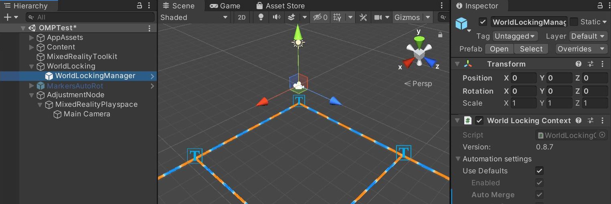

# World locking and spatial anchors in Unity

Getting your holograms to stay in place, move with you, or in some cases position themselves relative to other holograms is a big part of creating Mixed Reality applications. This article will take you through our recommended solution using World Locking Tools, but we'll also cover manually setting up spatial anchors in your Unity projects. Before we jump into any code, it's important to understand how Unity handles coordinate space and anchors in its own engine.

## Explaining coordinate space and anchors

For perspective on the problem that World Locking Tools solves, let's take a look at how Unity implements its own global coordinate space and spatial anchors. Unity's *coordinate space* provides a stable frame of reference, where holographic objects are fixed in relation to one another. While objects in this space behave consistently in relation to each other, consistency with the physical world isn't guaranteed or provided. This inconsistency with the real-world becomes a problem when your users are moving around during the mixed reality experience.

Unity's *spatial anchors* can maintain a hologram's position in the physical world when the user is mobile, but at the sacrifice of self-consistency within the virtual world. Different anchors are constantly moving in relation to one another, but are also moving through the global coordinate space. In this scenario, simple tasks like layout become difficult and physics simulation problematic.

### What comes with World Locking Tools

World Locking Tools keeps an internal supply of of spatial anchors it spreads throughout the virtual scene as the user moves around. The tools analyze the coordinates of the camera and those spatial anchors every frame. Instead of changing the coordinates of everything in the world to compensate for the changed coordinates of the user's head, the tools just fix the head's coordinates instead.

What this means for you as a developer: rather than having an anchor drag a hologram through Unity space to keep it fixed in physical space, the entire Unity world space is locked to physical space. If a hologram is motionless in Unity space, it will remain motionless relative to the physical world around it. More importantly, it will also remain fixed relative to the virtual features around it.

Obviously, it's more complicated under the hood than that. For example, spatial anchors move independently and don't always agree with each other. The underlying FrozenWorld engine arbitrates those disagreements and comes up with the most perceptually correct camera correction in every frame.

## Choosing your world locking approach

* **Our recommendation** is to use World Locking Tools for all your hologram positioning needs. World Locking Tools provides a stable coordinate system and adjustable camera that minimizes the visible inconsistencies between virtual and real world markers. Put another way, it world-locks the entire scene with a shared pool of anchors, rather than locking each group of objects with the group's own individual anchor.
* **For manual control**, you have a choice between ARAnchorManager and WorldAnchor:
    * Use the **ARAnchorManager** for Unity 2019/2020 projects using either OpenXR or the Windows XR Plugin 
    * Use **WorldAnchor** for older Unity versions or Legacy WSA projects

## Setting up world locking 

[!INCLUDE]

## Persistent world locking

Spatial anchors save holograms in real-world space between application sessions. Once saved in the HoloLens' anchor store, they can be found and loaded in different sessions and are an ideal fallback when there's no internet connectivity.

> [!IMPORTANT]
> Local anchors are stored on device, while Azure Spatial Anchors are stored in the cloud. If you're looking to use Azure cloud services to store your anchors, we have a document that can walk you through integrating [Azure Spatial Anchors](../mixed-reality-cloud-services.md#azure-spatial-anchors). Note that you can have local and Azure anchors in the same project without conflict.

[!INCLUDE]

## Sharing coordinate spaces 

If you want to share a world locked coordinate space, check out our comprehensive [shared experience documentation](shared-experiences-in-unity.md).

## Next Development Checkpoint

If you're following the Unity development checkpoint journey we've laid out, you're in the midst of exploring the Mixed Reality core building blocks. From here, you can continue to the next building block:

> [!div class="nextstepaction"]
> [Spatial mapping](spatial-mapping-in-unity.md)

Or jump to Mixed Reality platform capabilities and APIs:

> [!div class="nextstepaction"]
> [Shared experiences](shared-experiences-in-unity.md)

You can always go back to the [Unity development checkpoints](unity-development-overview.md#2-core-building-blocks) at any time.

## See Also
* [World Locking Tools introduction](https://microsoft.github.io/MixedReality-WorldLockingTools-Unity/DocGen/Documentation/IntroFAQ.html)
* [Quickstart guides](https://microsoft.github.io/MixedReality-WorldLockingTools-Unity/DocGen/Documentation/HowTos/QuickStart.html)
* [Tutorials](https://microsoft.github.io/MixedReality-WorldLockingTools-Samples/Tutorial/01_Minimal/01_Minimal.html)
* [Samples](https://microsoft.github.io/MixedReality-WorldLockingTools-Unity/DocGen/Documentation/HowTos/SampleApplications.html)
* [Spatial anchor persistence](../../design/coordinate-systems.md#spatial-anchor-persistence)
* <a href="/azure/spatial-anchors" target="_blank">Azure Spatial Anchors</a>
* <a href="/dotnet/api/Microsoft.Azure.SpatialAnchors" target="_blank">Azure Spatial Anchors SDK for Unity</a>
* [Experience scales](../../design/coordinate-systems.md#mixed-reality-experience-scales)
* [Spatial stage](../../design/coordinate-systems.md#stage-frame-of-reference)
* [Tracking loss in Unity](tracking-loss-in-unity.md)
* [Spatial anchors](../../design/spatial-anchors.md)
* [Shared experiences in Unity](shared-experiences-in-unity.md)