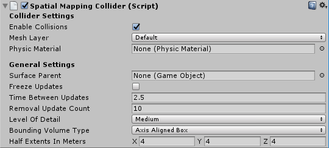

# Spatial mapping in Unity

[spatial mapping](../../design/spatial-mapping.md) lets you retrieve triangle meshes that represent the surfaces in the world around a HoloLens device. You can use surface data for placement, occlusion, and room analysis to give your Unity projects an extra dose of immersion.

Unity includes full support for spatial mapping, which is exposed to developers in the following ways:

1. Spatial mapping components available in the MixedRealityToolkit, which provide a convenient and rapid path for getting started with spatial mapping
2. Lower-level spatial mapping APIs, which provide full control and enable more sophisticated application-specific customization

To use spatial mapping in your app, the spatialPerception capability needs to be set in your AppxManifest.

## Device support

<table>
    <colgroup>
    <col width="25%" />
    <col width="25%" />
    <col width="25%" />
    <col width="25%" />
    </colgroup>
    <tr>
        <td><strong>Feature</strong></td>
        <td><a href="/hololens/hololens1-hardware"><strong>HoloLens (first gen)</strong></a></td>
        <td><a href="https://docs.microsoft.com/hololens/hololens2-hardware"><strong>HoloLens 2</strong></td>
        <td><a href="../../discover/immersive-headset-hardware-details.md"><strong>Immersive headsets</strong></a></td>
    </tr>
     <tr>
        <td>Spatial mapping</td>
        <td>✔️</td>
        <td>✔️</td>
        <td>❌</td>
    </tr>
</table>

## Setting the SpatialPerception capability

In order for an app to consume spatial mapping data, the SpatialPerception capability must be enabled.

How to enable the SpatialPerception capability:

1. In the Unity Editor, open the **"Player Settings"** pane (Edit > Project Settings > Player)
2. Select on the **"Windows Store"** tab
3. Expand **"Publishing Settings"** and check the **"SpatialPerception"** capability in the **"Capabilities"** list

> [!NOTE]
> If you have already exported your Unity project to a Visual Studio solution, you will need to either export to a new folder or manually [set this capability in the AppxManifest in Visual Studio](../native/spatial-mapping-in-directx.md#set-up-your-app-to-use-the-spatialperception-capability).

Spatial mapping also requires a MaxVersionTested of at least 10.0.10586.0:

1. In Visual Studio, right-click on **Package.appxmanifest** in the Solution Explorer and select **View Code**
2. Find the line specifying **TargetDeviceFamily** and change **MaxVersionTested="10.0.10240.0"** to **MaxVersionTested="10.0.10586.0"**
3. **Save** the Package.appxmanifest.

## Getting started with Unity's built-in spatial mapping components

Unity offers two components for easily adding spatial mapping to your app, **Spatial Mapping Renderer** and **Spatial Mapping Collider**.

### Spatial Mapping Renderer

The Spatial Mapping Renderer allows for visualization of the spatial mapping mesh.


### Spatial Mapping Collider

The Spatial Mapping Collider allows for holographic content (or character) interaction, such as physics, with the spatial mapping mesh.



### Using the built-in spatial mapping components

You may add both components to your app if you'd like to both visualize and interact with physical surfaces.

To use these two components in your Unity app:

1. Select a GameObject at the center of the area in which you'd like to detect spatial surface meshes.
2. In the Inspector window, **Add Component** > **XR** > **Spatial Mapping Collider** or **Spatial Mapping Renderer**.

You can find more details on how to use these components at the <a href="https://docs.unity3d.com/Manual/SpatialMappingComponents.html" target="_blank">Unity documentation site</a>.

### Going beyond the built-in spatial mapping components

These components make it drag-and-drop easy to get started with Spatial Mapping.  When you want to go further, there are two main paths to explore:

* To do your own lower-level mesh processing, see the section below about the low-level Spatial Mapping script API.
* To do higher-level mesh analysis, see the section below about the SpatialUnderstanding library in <a href="https://github.com/Microsoft/MixedRealityToolkit-Unity/tree/htk_release/Assets/HoloToolkit/SpatialUnderstanding" target="_blank">MixedRealityToolkit</a>.

## Using the low-level Unity Spatial Mapping API

If you need more control than the Spatial Mapping Renderer and Spatial Mapping Collider components offer, use the low-level Spatial Mapping APIs.

**Namespace:** *UnityEngine.XR.WSA*<br>
**Types**: *SurfaceObserver*, *SurfaceChange*, *SurfaceData*, *SurfaceId*

We've outlined the suggested flow for an application that uses the spatial mapping APIs in the sections below.

### Set up the SurfaceObserver(s)

Instantiate one SurfaceObserver object for each application-defined region of space that you need spatial mapping data for.

```cs
SurfaceObserver surfaceObserver;

 void Start () {
     surfaceObserver = new SurfaceObserver();
 }
```

Specify the region of space that each SurfaceObserver object will provide data for by calling either SetVolumeAsSphere, SetVolumeAsAxisAlignedBox, SetVolumeAsOrientedBox, or SetVolumeAsFrustum. You can redefine the region of space in the future by simply calling one of these methods again.

```cs
void Start () {
    ...
     surfaceObserver.SetVolumeAsAxisAlignedBox(Vector3.zero, new Vector3(3, 3, 3));
}
```

When you call SurfaceObserver.Update(), you must provide a handler for each spatial surface in the SurfaceObserver's region of space that the spatial mapping system has new information for. The handler receives, for one spatial surface:

```cs
private void OnSurfaceChanged(SurfaceId surfaceId, SurfaceChange changeType, Bounds bounds, System.DateTime updateTime)
 {
    //see Handling Surface Changes
 }
```

### Handling Surface Changes

There are several main cases to handle - added and updated, which can use the same code path, and removed.

* In the added and updated cases, we add or get the GameObject representing this mesh from the dictionary, create a SurfaceData struct with the necessary components, then call RequestMeshDataAsync to populate the GameObject with the mesh data and position in the scene.
* In the removed case, we remove the GameObject representing this mesh from the dictionary and destroy it.

```cs
System.Collections.Generic.Dictionary<SurfaceId, GameObject> spatialMeshObjects = 
    new System.Collections.Generic.Dictionary<SurfaceId, GameObject>();

   private void OnSurfaceChanged(SurfaceId surfaceId, SurfaceChange changeType, Bounds bounds, System.DateTime updateTime)
   {
       switch (changeType)
       {
           case SurfaceChange.Added:
           case SurfaceChange.Updated:
               if (!spatialMeshObjects.ContainsKey(surfaceId))
               {
                   spatialMeshObjects[surfaceId] = new GameObject("spatial-mapping-" + surfaceId);
                   spatialMeshObjects[surfaceId].transform.parent = this.transform;
                   spatialMeshObjects[surfaceId].AddComponent<MeshRenderer>();
               }
               GameObject target = spatialMeshObjects[surfaceId];
               SurfaceData sd = new SurfaceData(
                   //the surface id returned from the system
                   surfaceId,
                   //the mesh filter that is populated with the spatial mapping data for this mesh
                   target.GetComponent<MeshFilter>() ?? target.AddComponent<MeshFilter>(),
                   //the world anchor used to position the spatial mapping mesh in the world
                   target.GetComponent<WorldAnchor>() ?? target.AddComponent<WorldAnchor>(),
                   //the mesh collider that is populated with collider data for this mesh, if true is passed to bakeMeshes below
                   target.GetComponent<MeshCollider>() ?? target.AddComponent<MeshCollider>(),
                   //triangles per cubic meter requested for this mesh
                   1000,
                   //bakeMeshes - if true, the mesh collider is populated, if false, the mesh collider is empty.
                   true
                   );

               SurfaceObserver.RequestMeshAsync(sd, OnDataReady);
               break;
           case SurfaceChange.Removed:
               var obj = spatialMeshObjects[surfaceId];
               spatialMeshObjects.Remove(surfaceId);
               if (obj != null)
               {
                   GameObject.Destroy(obj);
               }
               break;
           default:
               break;
       }
   }
```

### Handling Data Ready

The OnDataReady handler receives a SurfaceData object. The WorldAnchor, MeshFilter, and (optionally) MeshCollider objects it contains reflect the latest state of the associated spatial surface. Optionally, analyze and/or [process](../../design/spatial-mapping.md#mesh-processing) the mesh data by accessing the Mesh member of the MeshFilter object. Render the spatial surface with the latest mesh and (optionally) use it for physics collisions and raycasts. It's important to confirm that the contents of the SurfaceData aren't null.

### Start processing on updates

SurfaceObserver.Update() should be called on a delay, not every frame.

```cs
void Start () {
    ...
     StartCoroutine(UpdateLoop());
}

 IEnumerator UpdateLoop()
    {
        var wait = new WaitForSeconds(2.5f);
        while(true)
        {
            surfaceObserver.Update(OnSurfaceChanged);
            yield return wait;
        }
    }
```

## Higher-level mesh analysis: SpatialUnderstanding

The <a href="https://github.com/Microsoft/MixedRealityToolkit-Unity" target="_blank">MixedRealityToolkit</a> is a collection of utility code for holographic development built on Unity's holographic APIs.

### Spatial Understanding

When placing holograms in the physical world, it's often desirable to go beyond spatial mapping’s mesh and surface planes. When placement is done procedurally, a higher level of environmental understanding is desirable. This usually requires making decisions about what is floor, ceiling, and walls. You also have the ability to optimize against a set of placement constraints to determine the most best physical locations for holographic objects.

During development of Young Conker and Fragments, Asobo Studios faced this problem head on by developing a room solver. Each of these games had game-specific needs, but they shared core spatial understanding technology. The HoloToolkit.SpatialUnderstanding library encapsulates this technology, allowing you to quickly find empty spaces on the walls, place objects on the ceiling, identify placed for character to sit, and a myriad of other spatial understanding queries.

All of the source code is included, allowing you to customize it to your needs and share your improvements with the community. The code for the C++ solver has been wrapped into a UWP dll and exposed to Unity with a drop in prefab contained within the MixedRealityToolkit.

### Understanding Modules

There are three primary interfaces exposed by the module: topology for simple surface and spatial queries, shape for object detection, and the object placement solver for constraint-based placement of object sets. Each of these is described below. In addition to the three primary module interfaces, a ray casting interface can be used to retrieve tagged surface types and a custom watertight playspace mesh can be copied out.

### Ray Casting

After the room scan is completed, labels are internally generated for surfaces like the floor, ceiling, and walls. The “PlayspaceRaycast” function takes a ray and returns if the ray collides with a known surface and if so, information about that surface in the form of a “RaycastResult”.

```cpp
struct RaycastResult
{
    enum SurfaceTypes
    {
        Invalid,    // No intersection
        Other,
        Floor,
        FloorLike,  // Not part of the floor topology, 
                    //  but close to the floor and looks like the floor
        Platform,   // Horizontal platform between the ground and 
                    //  the ceiling
        Ceiling,
        WallExternal,
        WallLike,   // Not part of the external wall surface, 
                    //  but vertical surface that looks like a 
                    //  wall structure
    };
    SurfaceTypes SurfaceType;
    float SurfaceArea;  // Zero if unknown 
                        //  (i.e. if not part of the topology analysis)
    DirectX::XMFLOAT3 IntersectPoint;
    DirectX::XMFLOAT3 IntersectNormal;
};
```

Internally, the raycast is computed against the computed 8-cm cubed voxel representation of the playspace. Each voxel contains a set of surface elements with processed topology data (aka surfels). The surfels contained within the intersected voxel cell is compared and the best match used to look up the topology information. This topology data contains the labeling returned in the form of the “SurfaceTypes” enum, as well as the surface area of the intersected surface.

In the Unity sample, the cursor casts a ray each frame. First, against Unity’s colliders. Second, against the understanding module’s world representation. And finally, again UI elements. In this application, UI gets priority, next the understanding result, and lastly, Unity’s colliders. The SurfaceType is reported as text next to the cursor.

<br>
*Surface type is labeled next to the cursor*

### Topology Queries

Within the DLL, the topology manager handles labeling of the environment. As mentioned above, much of the data is stored within surfels, contained within a voxel volume. In addition, the “PlaySpaceInfos” structure is used to store information about the playspace, including the world alignment (more details on this below), floor, and ceiling height. Heuristics are used for determining floor, ceiling, and walls. For example, the largest and lowest horizontal surface with greater than 1-m2 surface area is considered the floor.

> [!NOTE]
> The camera path during the scanning process is also used in this process.

A subset of the queries exposed by the Topology manager are exposed out through the dll. The exposed topology queries are as follows.

```cpp
QueryTopology_FindPositionsOnWalls
QueryTopology_FindLargePositionsOnWalls
QueryTopology_FindLargestWall
QueryTopology_FindPositionsOnFloor
QueryTopology_FindLargestPositionsOnFloor
QueryTopology_FindPositionsSittable
```

Each of the queries has a set of parameters, specific to the query type. In the following example, the user specifies the minimum height & width of the desired volume, minimum placement height above the floor, and the minimum amount of clearance in front of the volume. All measurements are in meters.

```cpp
EXTERN_C __declspec(dllexport) int QueryTopology_FindPositionsOnWalls(
    _In_ float minHeightOfWallSpace,
    _In_ float minWidthOfWallSpace,
    _In_ float minHeightAboveFloor,
    _In_ float minFacingClearance,
    _In_ int locationCount,
    _Inout_ Dll_Interface::TopologyResult* locationData)
```

Each of these queries takes a pre-allocated array of “TopologyResult” structures. The “locationCount” parameter specifies the length of the passed in array. The return value reports the number of returned locations. This number is never greater than the passed in “locationCount” parameter.

The “TopologyResult” contains the center position of the returned volume, the facing direction (i.e. normal), and the dimensions of the found space.

```cpp
struct TopologyResult 
{ 
    DirectX::XMFLOAT3 position; 
    DirectX::XMFLOAT3 normal; 
    float width; 
    float length;
};
```

> [!NOTE]
> In the Unity sample, each of these queries is linked up to a button in the virtual UI panel. The sample hard codes the parameters for each of these queries to reasonable values. See SpaceVisualizer.cs in the sample code for more examples.

### Shape Queries

In the dll, the shape analyzer (“ShapeAnalyzer_W”) uses the topology analyzer to match against custom shapes defined by the user. The Unity sample defines a set of shapes and exposes the results out through the in-app query menu, within the shape tab. The intention is that the user can define their own object shape queries and make use of those, as needed by their application.

The shape analysis works on horizontal surfaces only. A couch, for example, is defined by the flat seat surface and the flat top of the couch back. The shape query looks for two surfaces of a specific size, height, and aspect range, with the two surfaces aligned and connected. Using the APIs terminology, the couch seat and back top are shape components and the alignment requirements are shape component constraints.

An example query defined in the Unity sample (ShapeDefinition.cs), for “sittable” objects is as follows.

```cs
shapeComponents = new List<ShapeComponent>()
{
    new ShapeComponent(
        new List<ShapeComponentConstraint>()
        {
            ShapeComponentConstraint.Create_SurfaceHeight_Between(0.2f, 0.6f),
            ShapeComponentConstraint.Create_SurfaceCount_Min(1),
            ShapeComponentConstraint.Create_SurfaceArea_Min(0.035f),
        }
    ),
};
AddShape("Sittable", shapeComponents);
```

Each shape query is defined by a set of shape components, each with a set of component constraints and a set of shape constraints which listing dependencies between the components. This example includes three constraints in a single component definition and no shape constraints between components (as there's only one component).

In contrast, the couch shape has two shape components and four shape constraints. Components are identified by their index in the user’s component list (0 and 1 in this example).

```cs
shapeConstraints = new List<ShapeConstraint>()
{
    ShapeConstraint.Create_RectanglesSameLength(0, 1, 0.6f),
    ShapeConstraint.Create_RectanglesParallel(0, 1),
    ShapeConstraint.Create_RectanglesAligned(0, 1, 0.3f),
    ShapeConstraint.Create_AtBackOf(1, 0),
};
```

Wrapper functions are provided in the Unity module for easy creation of custom shape definitions. The full list of component and shape constraints can be found in “SpatialUnderstandingDll.cs” within the “ShapeComponentConstraint” and the “ShapeConstraint” structures.

<br>
*Rectangle shape is found on this surface*

### Object Placement Solver

The object placement solver can be used to identify ideal locations in the physical room to place your objects. The solver will find the best fit location given the object rules and constraints. In addition, object queries persist until the object is removed with “Solver_RemoveObject” or “Solver_RemoveAllObjects” calls, allowing constrained multi-object placement. Objects placement queries consist of three parts: placement type with parameters, a list of rules, and a list of constraints. To run a query, use the following API.

```cpp
public static int Solver_PlaceObject(
            [In] string objectName,
            [In] IntPtr placementDefinition,        // ObjectPlacementDefinition
            [In] int placementRuleCount,
            [In] IntPtr placementRules,             // ObjectPlacementRule
            [In] int constraintCount,
            [In] IntPtr placementConstraints,       // ObjectPlacementConstraint
            [Out] IntPtr placementResult)
```

This function takes an object name, placement definition, and a list of rules and constraints. The C# wrappers provides construction helper functions to make rule and constraint construction easy. The placement definition contains the query type – that is, one of the following.

```cpp
public enum PlacementType
            {
                Place_OnFloor,
                Place_OnWall,
                Place_OnCeiling,
                Place_OnShape,
                Place_OnEdge,
                Place_OnFloorAndCeiling,
                Place_RandomInAir,
                Place_InMidAir,
                Place_UnderFurnitureEdge,
            };
```

Each of the placement types has a set of parameters unique to the type. The “ObjectPlacementDefinition” structure contains a set of static helper functions for creating these definitions. For example, to find a place to put an object on the floor, you can use the following function. public static ObjectPlacementDefinition Create_OnFloor(Vector3 halfDims) In addition to the placement type, you can provide a set of rules and constraints. Rules cannot be violated. Possible placement locations that satisfy the type and rules are then optimized against the set of constraints in order to select the optimal placement location. Each of the rules and constraints can be created by the provided static creation functions. An example rule and constraint construction function is provided below.

```cs
public static ObjectPlacementRule Create_AwayFromPosition(
    Vector3 position, float minDistance)
public static ObjectPlacementConstraint Create_NearPoint(
    Vector3 position, float minDistance = 0.0f, float maxDistance = 0.0f)
```

The below object placement query is looking for a place to put a half meter cube on the edge of a surface, away from other previously place objects and near the center of the room.

```cs
List<ObjectPlacementRule> rules = 
    new List<ObjectPlacementRule>() {
        ObjectPlacementRule.Create_AwayFromOtherObjects(1.0f),
    };

List<ObjectPlacementConstraint> constraints = 
    new List<ObjectPlacementConstraint> {
        ObjectPlacementConstraint.Create_NearCenter(),
    };

Solver_PlaceObject(
    “MyCustomObject”,
    new ObjectPlacementDefinition.Create_OnEdge(
        new Vector3(0.25f, 0.25f, 0.25f), 
        new Vector3(0.25f, 0.25f, 0.25f)),
    rules.Count,
    UnderstandingDLL.PinObject(rules.ToArray()),
    constraints.Count,
    UnderstandingDLL.PinObject(constraints.ToArray()),
    UnderstandingDLL.GetStaticObjectPlacementResultPtr());
```

If successful, a “ObjectPlacementResult” structure containing the placement position, dimensions, and orientation is returned. In addition, the placement is added to the dll’s internal list of placed objects. Subsequent placement queries will take this object into account. The “LevelSolver.cs” file in the Unity sample contains more example queries.

<br>
*Figure 3: The blue boxes how the result from three place on floor queries with away from camera position rules*

When solving for placement location of multiple objects required for a level or application scenario, first solve indispensable and large objects in order to maximizing the probability that a space can be found. Placement order is important. If object placements cannot be found, try less constrained configurations. Having a set of fallback configurations is critical to supporting functionality across many room configurations.

### Room Scanning Process

While the spatial mapping solution provided by the HoloLens is designed to be generic enough to meet the needs of the entire gamut of problem spaces, the spatial understanding module was built to support the needs of two specific games. Its solution is structured around a specific process and set of assumptions, summarized below.

```
Fixed size playspace – The user specifies the maximum playspace size in the init call.

One-time scan process – 
    The process requires a discrete scanning phase where the user walks around,
    defining the playspace. 
    Query functions will not function until after the scan has been finalized.
```

User driven playspace “painting” – During the scanning phase, the user moves and looks around the plays pace, effectively painting the areas, which should be included. The generated mesh is important to provide user feedback during this phase. Indoors home or office setup – The query functions are designed around flat surfaces and walls at right angles. This is a soft limitation. However, during the scanning phase, a primary axis analysis is completed to optimize the mesh tessellation along major and minor axis. The included SpatialUnderstanding.cs file manages the scanning phase process. It calls the following functions.

```
SpatialUnderstanding_Init – Called once at the start.

GeneratePlayspace_InitScan – Indicates that the scan phase should begin.

GeneratePlayspace_UpdateScan_DynamicScan – 
    Called each frame to update the scanning process. The camera position and 
    orientation is passed in and is used for the playspace painting process, 
    described above.

GeneratePlayspace_RequestFinish – 
    Called to finalize the playspace. This will use the areas “painted” during 
    the scan phase to define and lock the playspace. The application can query 
    statistics during the scanning phase as well as query the custom mesh for 
    providing user feedback.

Import_UnderstandingMesh – 
    During scanning, the “SpatialUnderstandingCustomMesh” behavior provided by 
    the module and placed on the understanding prefab will periodically query the 
    custom mesh generated by the process. In addition, this is done once more 
    after scanning has been finalized.
```

The scanning flow, driven by the “SpatialUnderstanding” behavior calls InitScan, then UpdateScan each frame. When the statistics query reports reasonable coverage, the user is allowed to airtap to call RequestFinish to indicate the end of the scanning phase. UpdateScan continues to be called until its return value indicates that the dll has completed processing.

### Understanding Mesh

The understanding dll internally stores the playspace as a grid of 8 cm sized voxel cubes. During the initial part of scanning, a primary component analysis is completed to determine the axes of the room. Internally, it stores its voxel space aligned to these axes. A mesh is generated approximately every second by extracting the isosurface from the voxel volume.

<br>
*Generated mesh produced from the voxel volume*

## Troubleshooting

* Ensure you have set the [SpatialPerception](#setting-the-spatialperception-capability) capability
* When tracking is lost, the next OnSurfaceChanged event will remove all meshes.

## Spatial Mapping in Mixed Reality Toolkit

For more information on using Spatial Mapping with Mixed Reality Toolkit v2, see the <a href="/windows/mixed-reality/mrtk-unity/features/spatial-awareness/spatial-awareness-getting-started" target="_blank">Spatial Awareness section</a> of the MRTK docs.

## Next Development Checkpoint

If you're following the Unity development journey we've laid out, you're in the midst of exploring the MRTK core building blocks. From here, you can continue to the next building block:

> [!div class="nextstepaction"]
> [Text](text-in-unity.md)

Or jump to Mixed Reality platform capabilities and APIs:

> [!div class="nextstepaction"]
> [Shared experiences](shared-experiences-in-unity.md)

You can always go back to the [Unity development checkpoints](unity-development-overview.md#2-core-building-blocks) at any time.

## See also

* [Coordinate systems](../../design/coordinate-systems.md)
* [Coordinate systems in Unity](coordinate-systems-in-unity.md)
* <a href="https://github.com/Microsoft/MixedRealityToolkit-Unity" target="_blank">MixedRealityToolkit</a>
* <a href="https://docs.unity3d.com/ScriptReference/MeshFilter.html" target="_blank">UnityEngine.MeshFilter</a>
* <a href="https://docs.unity3d.com/ScriptReference/MeshCollider.html" target="_blank">UnityEngine.MeshCollider</a>
* <a href="https://docs.unity3d.com/ScriptReference/Bounds.html" target="_blank">UnityEngine.Bounds</a>
