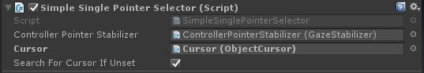

# HoloLens (1st gen) Input 210: Gaze

>[!NOTE]
>The Mixed Reality Academy tutorials were designed with HoloLens (1st gen) and Mixed Reality Immersive Headsets in mind.  As such, we feel it is important to leave these tutorials in place for developers who are still looking for guidance in developing for those devices.  These tutorials will **_not_** be updated with the latest toolsets or interactions being used for HoloLens 2.  They will be maintained to continue working on the supported devices. [A new series of tutorials](./mr-learning-base-01.md) has been posted for HoloLens 2.

[Gaze](../../../design/gaze-and-commit.md) is the first form of input and reveals the user's intent and awareness. MR Input 210 (aka Project Explorer) is a deep dive into gaze-related concepts for Windows Mixed Reality. We will be adding contextual awareness to our cursor and holograms, taking full advantage of what your app knows about the user's gaze.

>[!VIDEO https://www.youtube.com/embed/yKAttGduVp0]

We have a friendly astronaut here to help you learn gaze concepts. In [MR Basics 101](../../../develop/unity/tutorials/holograms-101.md), we had a simple cursor that just followed your gaze. Today we're moving a step beyond the simple cursor:

* We're making the cursor and our holograms gaze-aware: both will change based on where the user is looking - or where the user is *not* looking. This makes them context-aware.
* We will add feedback to our cursor and holograms to give the user more context on what is being targeted. This feedback can be audio and visual.
* We'll show you targeting techniques to help users hit smaller targets.
* We'll show you how to draw the user's attention to your holograms with a directional indicator.
* We'll teach you techniques to take your holograms with the user as she moves around in your world.

>[!IMPORTANT]
>The videos embedded in each of the chapters below were recorded using an older version of Unity and the Mixed Reality Toolkit. While the step-by-step instructions are accurate and current, you may see scripts and visuals in the corresponding videos that are out-of-date. The videos remain included for posterity and because the concepts covered still apply.

## Device support

<table>
<tr>
<th>Course</th><th style="width:150px"> <a href="/hololens/hololens1-hardware">HoloLens</a></th><th style="width:150px"> <a href="../../../discover/immersive-headset-hardware-details.md">Immersive headsets</a></th>
</tr><tr>
<td>MR Input 210: Gaze</td><td style="text-align: center;"> ✔️</td><td style="text-align: center;"> ✔️</td>
</tr>
</table>

## Before you start

### Prerequisites

* A Windows 10 PC configured with the correct [tools installed](../../../develop/install-the-tools.md).
* Some basic C# programming ability.
* You should have completed [MR Basics 101](../../../develop/unity/tutorials/holograms-101.md).
* A HoloLens device [configured for development](../../../develop/platform-capabilities-and-apis/using-visual-studio.md#enabling-developer-mode).

### Project files

* Download the [files](https://github.com/Microsoft/HolographicAcademy/archive/Holograms-210-Gaze.zip) required by the project. Requires Unity 2017.2 or later.
* Un-archive the files to your desktop or other easy to reach location.

>[!NOTE]
>If you want to look through the source code before downloading, it's [available on GitHub](https://github.com/Microsoft/HolographicAcademy/tree/Holograms-210-Gaze).

### Errata and Notes

* In Visual Studio, "Just My Code" needs to be disabled (unchecked) under Tools->Options->Debugging in order to hit breakpoints in your code.

## Chapter 1 - Unity Setup

>[!VIDEO https://www.youtube.com/embed/_Ccn6riQ6vU]

### Objectives

* Optimize Unity for HoloLens development.
* Import assets and setup the scene.
* View the astronaut in the HoloLens.

### Instructions

1. Start Unity.
2. Select **New Project**.
3. Name the project **ModelExplorer**.
4. Enter location as the **Gaze** folder you previously un-archived.
5. Make sure the project is set to **3D**.
6. Click **Create Project**.

### Unity settings for HoloLens

We need to let Unity know that the app we are trying to export should create an [immersive view](../../../design/app-views.md) instead of a 2D view. We do that by adding HoloLens as a virtual reality device.

1. Go to **Edit > Project Settings > Player**.
2. In the **Inspector Panel** for Player Settings, select the **Windows Store** icon.
3. Expand the **XR Settings** group.
4. In the **Rendering** section, check the **Virtual Reality Supported** checkbox to add a new **Virtual Reality SDKs** list.
5. Verify that **Windows Mixed Reality** appears in the list. If not, select the **+** button at the bottom of the list and choose **Windows Holographic**.

Next, we need to set our scripting backend to .NET.

1. Go to **Edit > Project Settings > Player** (you may still have this up from the previous step).
2. In the **Inspector Panel** for Player Settings, select the **Windows Store** icon.
3. In the **Other Settings** Configuration section, make sure that **Scripting Backend** is set to **.NET**

Finally, we'll update our quality settings to achieve a fast performance on HoloLens.

1. Go to **Edit > Project Settings > Quality**.
2. Click on downward pointing arrow in the **Default** row under the Windows Store icon.
3. Select **Very Low** for **Windows Store Apps**.

### Import project assets

1. Right click the **Assets** folder in the **Project** panel.
2. Click on **Import Package > Custom Package**.
3. Navigate to the project files you downloaded and click on **ModelExplorer.unitypackage**.
4. Click **Open**.
5. After the package loads, click on the **Import** button.

### Setup the scene

1. In the Hierarchy, delete the **Main Camera**.
2. In the **HoloToolkit** folder, open the **Input** folder, then open the **Prefabs** folder.
3. Drag and drop the **MixedRealityCameraParent** prefab from the **Prefabs** folder into the **Hierarchy**.
4. Right-click the **Directional Light** in the Hierarchy and select **Delete**.
5. In the **Holograms** folder, drag and drop the following assets into the root of the **Hierarchy**:
    * **AstroMan**
    * **Lights**
    * **SpaceAudioSource**
    * **SpaceBackground**
6. Start **Play Mode** ▶ to view the astronaut.
7. Click **Play Mode** ▶ again to **Stop**.
8. In the **Holograms** folder, find the **Fitbox** asset and drag it to the root of the **Hierarchy**.
9. Select the **Fitbox** in the **Hierarchy** panel.
10. Drag the **AstroMan** collection from the **Hierarchy** to the **Hologram Collection** property of the Fitbox in the **Inspector** panel.

### Save the project

1. Save the new scene: **File > Save Scene As**.
2. Click **New Folder** and name the folder **Scenes**.
3. Name the file “**ModelExplorer**” and save it in the **Scenes** folder.

### Build the project

1. In Unity, select **File > Build Settings**.
2. Click **Add Open Scenes** to add the scene.
3. Select **Universal Windows Platform** in the **Platform** list and click **Switch Platform**.
4. If you're specifically developing for HoloLens, set **Target device** to **HoloLens**. Otherwise, leave it on **Any device**.
5. Ensure **Build Type** is set to **D3D** and **SDK** is set to **Latest installed** (which should be SDK 16299 or newer).
6. Click **Build**.
7. Create a **New Folder** named "App".
8. Single click the **App** folder.
9. Press **Select Folder**.

When Unity is done, a File Explorer window will appear.

1. Open the **App** folder.
2. Open the **ModelExplorer Visual Studio Solution**.

If deploying to HoloLens:

1. Using the top toolbar in Visual Studio, change the target from Debug to **Release** and from ARM to **x86**.
2. Click on the drop down arrow next to the Local Machine button, and select **Remote Machine**.
3. Enter **your HoloLens device IP address** and set Authentication Mode to **Universal (Unencrypted Protocol)**. Click **Select**. If you do not know your device IP address, look in **Settings > Network & Internet > Advanced Options**.
4. In the top menu bar, click **Debug -> Start Without debugging** or press **Ctrl + F5**. If this is the first time deploying to your device, you will need to [pair it with Visual Studio](../../../develop/platform-capabilities-and-apis/using-visual-studio.md#pairing-your-device).
5. When the app has deployed, dismiss the **Fitbox** with a **select gesture**.

If deploying to an immersive headset:

1. Using the top toolbar in Visual Studio, change the target from Debug to **Release** and from ARM to **x64**.
2. Make sure the deployment target is set to **Local Machine**.
3. In the top menu bar, click **Debug -> Start Without debugging** or press **Ctrl + F5**.
4. When the app has deployed, dismiss the **Fitbox** by pulling the trigger on a motion controller.

## Chapter 2 - Cursor and target feedback

>[!VIDEO https://www.youtube.com/embed/S24u0V_T7ZI]

### Objectives

* Cursor visual design and behavior.
* Gaze-based cursor feedback.
* Gaze-based hologram feedback.

We're going to base our work on some cursor design principles, namely:

* The cursor is always present.
* Don't let the cursor get too small or big.
* Avoid obstructing content.

### Instructions

1. In the **HoloToolkit\Input\Prefabs** folder, find the **InputManager** asset.
2. Drag and drop the **InputManager** onto the **Hierarchy**.
3. In the **HoloToolkit\Input\Prefabs** folder, find the **Cursor** asset.
4. Drag and drop the **Cursor** onto the **Hierarchy**.
5. Select the **InputManager** object in the **Hierarchy**.
6. Drag the **Cursor** object from the **Hierarchy** into the InputManager's **SimpleSinglePointerSelector**'s **Cursor** field, at the bottom of the **Inspector**.



### Build and Deploy

1. Rebuild the app from **File > Build Settings**.
2. Open the **App folder**.
3. Open the **ModelExplorer Visual Studio Solution**.
4. Click **Debug -> Start Without debugging** or press **Ctrl + F5**.
5. Observe how the cursor is drawn, and how it changes appearance if it is touching a hologram.

### Instructions

1. In the **Hierarchy** panel, expand the **AstroMan**->**GEO_G**->**Back_Center** object.
2. Double click on **Interactible.cs** to open it in Visual Studio.
3. Uncomment the lines in the **IFocusable.OnFocusEnter()** and **IFocusable.OnFocusExit()** callbacks in **Interactible.cs**. These are called by the Mixed Reality Toolkit's InputManager when focus (either by gaze or by controller pointing) enters and exits the specific GameObject's collider.

```cs
/* TODO: DEVELOPER CODING EXERCISE 2.d */

void IFocusable.OnFocusEnter()
{
    for (int i = 0; i < defaultMaterials.Length; i++)
    {
        // 2.d: Uncomment the below line to highlight the material when gaze enters.
        defaultMaterials[i].EnableKeyword("_ENVIRONMENT_COLORING");
    }
}

void IFocusable.OnFocusExit()
{
    for (int i = 0; i < defaultMaterials.Length; i++)
    {
        // 2.d: Uncomment the below line to remove highlight on material when gaze exits.
        defaultMaterials[i].DisableKeyword("_ENVIRONMENT_COLORING");
    }
}
```

>[!NOTE]
>We use `EnableKeyword` and `DisableKeyword` above. In order to make use of these in your own app with the Toolkit's Standard shader, you'll need to follow the [Unity guidelines for accessing materials via script](https://docs.unity3d.com/Manual/MaterialsAccessingViaScript.html). In this case, we've already included the [three variants of highlighted material](https://github.com/Microsoft/HolographicAcademy/tree/Holograms-210-Gaze/Completed/ModelExplorer/Assets/Resources/Models/AstroMan/Materials) needed in the Resources folder (look for the three materials with highlight in the name).

### Build and Deploy

1. As before, build the project and deploy to the HoloLens.
2. Observe what happens when the gaze is aimed at an object and when it's not.

## Chapter 3 - Targeting Techniques

>[!VIDEO https://www.youtube.com/embed/TFnuLva4VJ0]

### Objectives

* Make it easier to target holograms.
* Stabilize natural head movements.

### Instructions

1. In the **Hierarchy** panel, select the **InputManager** object.
2. In the **Inspector** panel, find the **Gaze Stabilizer** script. Click it to open in Visual Studio, if you want to take a look.
    * This script iterates over samples of Raycast data and helps stabilize the user's gaze for precision targeting.
3. In the **Inspector**, you can edit the **Stored Stability Samples** value. This value represents the number of samples that the stabilizer iterates on to calculate the stabilized value.

## Chapter 4 - Directional indicator

>[!VIDEO https://www.youtube.com/embed/htVbJCMlj64]

### Objectives

* Add a directional indicator on the cursor to help find holograms.

### Instructions

We're going to use the **DirectionIndicator.cs** file which will:

1. Show the directional indicator if the user is not gazing at the holograms.
2. Hide the directional indicator if the user is gazing at the holograms.
3. Update the directional indicator to point to the holograms.

Let's get started.

1. Click on the **AstroMan** object in the **Hierarchy** panel and **click the arrow** to expand it.
2. In the **Hierarchy** panel, select the **DirectionalIndicator** object under **AstroMan**.
3. In the **Inspector** panel, click the **Add Component** button.
4. In the menu, type in the search box **Direction Indicator**. Select the search result.
5. In the **Hierarchy** panel, drag and drop the **Cursor** object onto the **Cursor** property in the **Inspector**.
6. In the **Project** panel, in the **Holograms** folder, drag and drop the **DirectionalIndicator** asset onto the **Directional Indicator** property in the **Inspector**.
7. Build and deploy the app.
8. Watch how the directional indicator object helps you find the astronaut.

## Chapter 5 - Billboarding

>[!VIDEO https://www.youtube.com/embed/qFiLr_LUACE]

### Objectives

* Use billboarding to have holograms always face towards you.

We will be using the **Billboard.cs** file to keep a GameObject oriented such that it is facing the user at all times.

1. In the **Hierarchy** panel, select the **AstroMan** object.
2. In the **Inspector** panel, click the **Add Component** button.
3. In the menu, type in the search box **Billboard**. Select the search result.
4. In the **Inspector** set the **Pivot Axis** to **Y**.
5. Try it! Build and deploy the app as before.
6. See how the Billboard object faces you no matter how you change the viewpoint.
7. Delete the script from the **AstroMan** for now.

## Chapter 6 - Tag-Along

>[!VIDEO https://www.youtube.com/embed/Ct8ORZAX5JU]

### Objectives

* Use Tag-Along to have our holograms follow us around the room.

As we work on this issue, we'll be guided by the following design constraints:

* Content should always be a glance away.
* Content should not be in the way.
* Head-locking content is uncomfortable.

The solution used here is to use a "tag-along" approach.

A tag-along object never fully leaves the user's view. You can think of the a tag-along as being an object attached to the user's head by rubber bands. As the user moves, the content will stay within an easy glance by sliding towards the edge of the view without completely leaving. When the user gazes towards the tag-along object, it comes more fully into view.

We're going to use the **SimpleTagalong.cs** file which will:

1. Determine if the Tag-Along object is within the camera bounds.
2. If not within the view frustum, position the Tag-Along to partially within the view frustum.
3. Otherwise, position the Tag-Along to a default distance from the user.

To do this, we first must change the **Interactible.cs** script to call the **TagalongAction**.

1. Edit **Interactible.cs** by completing coding exercise 6.a (uncommenting lines 84 to 87).

```cs
/* TODO: DEVELOPER CODING EXERCISE 6.a */
// 6.a: Uncomment the lines below to perform a Tagalong action.
if (interactibleAction != null)
{
    interactibleAction.PerformAction();
}
```

The **InteractibleAction.cs** script, paired with **Interactible.cs** performs custom actions when you tap on holograms. In this case, we'll use one specifically for tag-along.

* In the **Scripts** folder click on **TagalongAction.cs** asset to open in Visual Studio.
* Complete the coding exercise or change it to this:
  * At the top of the **Hierarchy**, in the search bar type **ChestButton_Center** and select the result.
  * In the **Inspector** panel, click the **Add Component** button.
  * In the menu, type in the search box **Tagalong Action**. Select the search result.
  * In **Holograms** folder find the **Tagalong** asset.
  * Select the **ChestButton_Center** object in the **Hierarchy**. Drag and drop the **TagAlong** object from the **Project** panel onto the **Inspector** into the **Object To Tagalong** property.
  * Drag the **Tagalong Action** object from the **Inspector** into the **Interactible Action** field on the **Interactible** script.
* Double click the **TagalongAction** script to open it in Visual Studio.


We need to add the following:

* Add functionality to the PerformAction function in the TagalongAction script (inherited from InteractibleAction).
* Add billboarding to the gazed-upon object, and set the pivot axis to XY.
* Then add simple Tag-Along to the object.

Here's our solution, from **TagalongAction.cs**:

```cs
// Copyright (c) Microsoft Corporation. All rights reserved.
// Licensed under the MIT License. See LICENSE in the project root for license information.

using HoloToolkit.Unity;
using UnityEngine;

public class TagalongAction : InteractibleAction
{
    [SerializeField]
    [Tooltip("Drag the Tagalong prefab asset you want to display.")]
    private GameObject objectToTagalong;

    private void Awake()
    {
        if (objectToTagalong != null)
        {
            objectToTagalong = Instantiate(objectToTagalong);
            objectToTagalong.SetActive(false);

            /* TODO: DEVELOPER CODING EXERCISE 6.b */

            // 6.b: AddComponent Billboard to objectToTagAlong,
            // so it's always facing the user as they move.
            Billboard billboard = objectToTagalong.AddComponent<Billboard>();

            // 6.b: AddComponent SimpleTagalong to objectToTagAlong,
            // so it's always following the user as they move.
            objectToTagalong.AddComponent<SimpleTagalong>();

            // 6.b: Set any public properties you wish to experiment with.
            billboard.PivotAxis = PivotAxis.XY; // Already the default, but provided in case you want to edit
        }
    }

    public override void PerformAction()
    {
        // Recommend having only one tagalong.
        if (objectToTagalong == null || objectToTagalong.activeSelf)
        {
            return;
        }

        objectToTagalong.SetActive(true);
    }
}
```

* Try it! Build and deploy the app.
* Watch how the content follows the center of the gaze point, but not continuously and without blocking it.