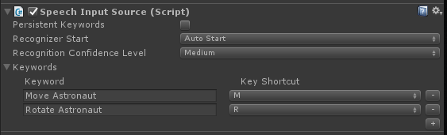

# HoloLens (1st gen) Input 211: Gesture

>[!NOTE]
>The Mixed Reality Academy tutorials were designed with HoloLens (1st gen) and Mixed Reality Immersive Headsets in mind.  As such, we feel it is important to leave these tutorials in place for developers who are still looking for guidance in developing for those devices.  These tutorials will **_not_** be updated with the latest toolsets or interactions being used for HoloLens 2.  They will be maintained to continue working on the supported devices. [A new series of tutorials](./mr-learning-base-01.md) has been posted for HoloLens 2.

[Gestures](../../../design/gaze-and-commit.md#composite-gestures) turn user intention into action. With gestures, users can interact with holograms. In this course, we'll learn how to track the user's hands, respond to user input, and give feedback to the user based on hand state and location.

>[!VIDEO https://www.youtube.com/embed/c9zlpfFeEtc]

In [MR Basics 101](../../../develop/unity/tutorials/holograms-101.md), we used a simple air-tap gesture to interact with our holograms. Now, we'll move beyond the air-tap gesture and explore new concepts to:

* Detect when the user's hand is being tracked and provide feedback to the user.
* Use a navigation gesture to rotate our holograms.
* Provide feedback when the user's hand is about to go out of view.
* Use manipulation events to allow users to move holograms with their hands.

In this course, we'll revisit the Unity project **Model Explorer**, which we built in [MR Input 210](holograms-210.md). Our astronaut friend is back to assist us in our exploration of these new gesture concepts.

>[!IMPORTANT]
>The videos embedded in each of the chapters below were recorded using an older version of Unity and the Mixed Reality Toolkit. While the step-by-step instructions are accurate and current, you may see scripts and visuals in the corresponding videos that are out-of-date. The videos remain included for posterity and because the concepts covered still apply.

## Device support

<table>
<tr>
<th>Course</th><th style="width:150px"> <a href="/hololens/hololens1-hardware">HoloLens</a></th><th style="width:150px"> <a href="../../../discover/immersive-headset-hardware-details.md">Immersive headsets</a></th>
</tr><tr>
<td>MR Input 211: Gesture</td><td style="text-align: center;"> ✔️</td><td style="text-align: center;"> ✔️</td>
</tr>
</table>

## Before you start

### Prerequisites

* A Windows 10 PC configured with the correct [tools installed](../../../develop/install-the-tools.md).
* Some basic C# programming ability.
* You should have completed [MR Basics 101](../../../develop/unity/tutorials/holograms-101.md).
* You should have completed [MR Input 210](holograms-210.md).
* A HoloLens device [configured for development](../../../develop/platform-capabilities-and-apis/using-visual-studio.md#enabling-developer-mode).

### Project files

* Download the [files](https://github.com/Microsoft/HolographicAcademy/archive/Holograms-211-Gesture.zip) required by the project. Requires Unity 2017.2 or later.
* Un-archive the files to your desktop or other easy to reach location.

>[!NOTE]
>If you want to look through the source code before downloading, it's [available on GitHub](https://github.com/Microsoft/HolographicAcademy/tree/Holograms-211-Gesture).

### Errata and Notes

* "Enable Just My Code" needs to be disabled (*unchecked*) in Visual Studio under Tools->Options->Debugging in order to hit breakpoints in your code.

## Chapter 0 - Unity Setup

### Instructions

1. Start Unity.
2. Select **Open**.
3. Navigate to the **Gesture** folder you previously un-archived.
4. Find and select the **Starting**/**Model Explorer** folder.
5. Click the **Select Folder** button.
6. In the **Project** panel, expand the **Scenes** folder.
7. Double-click **ModelExplorer** scene to load it in Unity.

### Building

1. In Unity, select **File > Build Settings**.
2. If **Scenes/ModelExplorer** is not listed in **Scenes In Build**, click **Add Open Scenes** to add the scene.
3. If you're specifically developing for HoloLens, set **Target device** to **HoloLens**. Otherwise, leave it on **Any device**.
4. Ensure **Build Type** is set to **D3D** and **SDK** is set to **Latest installed** (which should be SDK 16299 or newer).
5. Click **Build**.
6. Create a **New Folder** named "App".
7. Single click the **App** folder.
8. Press **Select Folder** and Unity will start building the project for Visual Studio.

When Unity is done, a File Explorer window will appear.

1. Open the **App** folder.
2. Open the **ModelExplorer Visual Studio Solution**.

If deploying to HoloLens:

1. Using the top toolbar in Visual Studio, change the target from Debug to **Release** and from ARM to **x86**.
2. Click on the drop down arrow next to the Local Machine button, and select **Remote Machine**.
3. Enter **your HoloLens device IP address** and set Authentication Mode to **Universal (Unencrypted Protocol)**. Click **Select**. If you do not know your device IP address, look in **Settings > Network & Internet > Advanced Options**.
4. In the top menu bar, click **Debug -> Start Without debugging** or press **Ctrl + F5**. If this is the first time deploying to your device, you will need to [pair it with Visual Studio](../../../develop/platform-capabilities-and-apis/using-visual-studio.md#pairing-your-device).
5. When the app has deployed, dismiss the **Fitbox** with a **select gesture**.

If deploying to an immersive headset:

1. Using the top toolbar in Visual Studio, change the target from Debug to **Release** and from ARM to **x64**.
2. Make sure the deployment target is set to **Local Machine**.
3. In the top menu bar, click **Debug -> Start Without debugging** or press **Ctrl + F5**.
4. When the app has deployed, dismiss the **Fitbox** by pulling the trigger on a motion controller.

>[!NOTE]
>You might notice some red errors in the Visual Studio Errors panel. It is safe to ignore them. Switch to the Output panel to view actual build progress. Errors in the Output panel will require you to make a fix (most often they are caused by a mistake in a script).

## Chapter 1 - Hand detected feedback

>[!VIDEO https://www.youtube.com/embed/D1FcIyuFTZQ]

### Objectives

* Subscribe to hand tracking events.
* Use cursor feedback to show users when a hand is being tracked.

>[!NOTE]
>On HoloLens 2 , hands detected fires whenever hands are visible (not just when a finger is pointing up).

### Instructions

* In the **Hierarchy** panel, expand the **InputManager** object.
* Look for and select the **GesturesInput** object.

The **InteractionInputSource.cs** script performs these steps:

1. Subscribes to the InteractionSourceDetected and InteractionSourceLost events.
2. Sets the HandDetected state.
3. Unsubscribes from the InteractionSourceDetected and InteractionSourceLost events.

Next, we'll upgrade our cursor from [MR Input 210](holograms-210.md) into one that shows feedback depending on the user's actions.

1. In the **Hierarchy** panel, select the **Cursor** object and delete it.
2. In the **Project** panel, search for **CursorWithFeedback** and drag it into the **Hierarchy** panel.
3. Click on **InputManager** in the **Hierarchy** panel, then drag the **CursorWithFeedback** object from the **Hierarchy** into the InputManager's **SimpleSinglePointerSelector**'s **Cursor** field, at the bottom of the **Inspector**.
4. Click on the **CursorWithFeedback** in the **Hierarchy**.
5. In the **Inspector** panel, expand **Cursor State Data** on the **Object Cursor** script.

The **Cursor State Data** works like this:

* Any **Observe** state means that no hand is detected and the user is simply looking around.
* Any **Interact** state means that a hand or controller is detected.
* Any **Hover** state means the user is looking at a hologram.

### Build and Deploy

* In Unity, use **File > Build Settings** to rebuild the application.
* Open the **App** folder.
* If it's not already open, open the **ModelExplorer Visual Studio Solution**.
  * (If you already built/deployed this project in Visual Studio during set-up, then you can open that instance of VS and click 'Reload All' when prompted).
* In Visual Studio, click **Debug -> Start Without debugging** or press **Ctrl + F5**.
* After the application deploys to the HoloLens, dismiss the fitbox using the air-tap gesture.
* Move your hand into view and point your index finger to the sky to start hand tracking.
* Move your hand left, right, up and down.
* Watch how the cursor changes when your hand is detected and then lost from view.
* If you're on an immersive headset, you'll have to connect and disconnect your controller. This feedback becomes less interesting on an immersive device, as a connected controller will always be "available".

## Chapter 2 - Navigation

>[!VIDEO https://www.youtube.com/embed/sm-kxtKksSo]

### Objectives

* Use Navigation gesture events to rotate the astronaut.

### Instructions

To use Navigation gestures in our app, we are going to edit **GestureAction.cs** to rotate objects when the Navigation gesture occurs. Additionally, we'll add feedback to the cursor to display when Navigation is available.

1. In the **Hierarchy** panel, expand **CursorWithFeedback**.
2. In the **Holograms** folder, find the **ScrollFeedback** asset.
3. Drag and drop the **ScrollFeedback** prefab onto the **CursorWithFeedback** GameObject in the **Hierarchy**.
4. Click on **CursorWithFeedback**.
5. In the **Inspector** panel, click the **Add Component** button.
6. In the menu, type in the search box **CursorFeedback**. Select the search result.
7. Drag and drop the **ScrollFeedback** object from the **Hierarchy** onto the **Scroll Detected Game Object** property in the **Cursor Feedback** component in the **Inspector**.
8. In the **Hierarchy** panel, select the **AstroMan** object.
9. In the **Inspector** panel, click the **Add Component** button.
10. In the menu, type in the search box **Gesture Action**. Select the search result.

Next, open **GestureAction.cs** in Visual Studio. In coding exercise 2.c, edit the script to do the following:

1. **Rotate the AstroMan** object whenever a Navigation gesture is performed.
2. Calculate the **rotationFactor** to control the amount of rotation applied to the object.
3. **Rotate the object** around the y-axis when the user moves their hand left or right.

Complete coding exercises 2.c in the script, or replace the code with the completed solution below:

```cs
using HoloToolkit.Unity.InputModule;
using UnityEngine;

/// <summary>
/// GestureAction performs custom actions based on
/// which gesture is being performed.
/// </summary>
public class GestureAction : MonoBehaviour, INavigationHandler, IManipulationHandler, ISpeechHandler
{
    [Tooltip("Rotation max speed controls amount of rotation.")]
    [SerializeField]
    private float RotationSensitivity = 10.0f;

    private bool isNavigationEnabled = true;
    public bool IsNavigationEnabled
    {
        get { return isNavigationEnabled; }
        set { isNavigationEnabled = value; }
    }

    private Vector3 manipulationOriginalPosition = Vector3.zero;

    void INavigationHandler.OnNavigationStarted(NavigationEventData eventData)
    {
        InputManager.Instance.PushModalInputHandler(gameObject);
    }

    void INavigationHandler.OnNavigationUpdated(NavigationEventData eventData)
    {
        if (isNavigationEnabled)
        {
            /* TODO: DEVELOPER CODING EXERCISE 2.c */

            // 2.c: Calculate a float rotationFactor based on eventData's NormalizedOffset.x multiplied by RotationSensitivity.
            // This will help control the amount of rotation.
            float rotationFactor = eventData.NormalizedOffset.x * RotationSensitivity;

            // 2.c: transform.Rotate around the Y axis using rotationFactor.
            transform.Rotate(new Vector3(0, -1 * rotationFactor, 0));
        }
    }

    void INavigationHandler.OnNavigationCompleted(NavigationEventData eventData)
    {
        InputManager.Instance.PopModalInputHandler();
    }

    void INavigationHandler.OnNavigationCanceled(NavigationEventData eventData)
    {
        InputManager.Instance.PopModalInputHandler();
    }

    void IManipulationHandler.OnManipulationStarted(ManipulationEventData eventData)
    {
        if (!isNavigationEnabled)
        {
            InputManager.Instance.PushModalInputHandler(gameObject);

            manipulationOriginalPosition = transform.position;
        }
    }

    void IManipulationHandler.OnManipulationUpdated(ManipulationEventData eventData)
    {
        if (!isNavigationEnabled)
        {
            /* TODO: DEVELOPER CODING EXERCISE 4.a */

            // 4.a: Make this transform's position be the manipulationOriginalPosition + eventData.CumulativeDelta
        }
    }

    void IManipulationHandler.OnManipulationCompleted(ManipulationEventData eventData)
    {
        InputManager.Instance.PopModalInputHandler();
    }

    void IManipulationHandler.OnManipulationCanceled(ManipulationEventData eventData)
    {
        InputManager.Instance.PopModalInputHandler();
    }

    void ISpeechHandler.OnSpeechKeywordRecognized(SpeechEventData eventData)
    {
        if (eventData.RecognizedText.Equals("Move Astronaut"))
        {
            isNavigationEnabled = false;
        }
        else if (eventData.RecognizedText.Equals("Rotate Astronaut"))
        {
            isNavigationEnabled = true;
        }
        else
        {
            return;
        }

        eventData.Use();
    }
}
```

You'll notice that the other navigation events are already filled in with some info. We push the GameObject onto the Toolkit's InputSystem's modal stack, so the user doesn't have to maintain focus on the Astronaut once rotation has begun. Correspondingly, we pop the GameObject off the stack once the gesture is completed.

### Build and Deploy

1. Rebuild the application in Unity and then build and deploy from Visual Studio to run it in the HoloLens.
2. Gaze at the astronaut, two arrows should appear on either side of the cursor. This new visual indicates that the astronaut can be rotated.
3. Place your hand in the ready position (index finger pointed towards the sky) so the HoloLens will start tracking your hand.
4. To rotate the astronaut, lower your index finger to a pinch position, and then move your hand left or right to trigger the NavigationX gesture.

## Chapter 3 - Hand Guidance

>[!VIDEO https://www.youtube.com/embed/ULzlVw4e14I]

### Objectives

* Use **hand guidance score** to help predict when hand tracking will be lost.
* Provide **feedback on the cursor** to show when the user's hand nears the camera's edge of view.

### Instructions

1. In the **Hierarchy** panel, select the **CursorWithFeedback** object.
2. In the **Inspector** panel, click the **Add Component** button.
3. In the menu, type in the search box **Hand Guidance**. Select the search result.
4. In the **Project** panel **Holograms** folder, find the **HandGuidanceFeedback** asset.
5. Drag and drop the **HandGuidanceFeedback** asset onto the **Hand Guidance Indicator** property in the **Inspector** panel.

### Build and Deploy

* Rebuild the application in Unity and then build and deploy from Visual Studio to experience the app on HoloLens.
* Bring your hand into view and raise your index finger to get tracked.
* Start rotating the astronaut with the Navigation gesture (pinch your index finger and thumb together).
* Move your hand far left, right, up, and down.
* As your hand nears the edge of the gesture frame, an arrow should appear next to the cursor to warn you that hand tracking will be lost. The arrow indicates which direction to move your hand in order to prevent tracking from being lost.

## Chapter 4 - Manipulation

>[!VIDEO https://www.youtube.com/embed/f3m8MvU60-I]

### Objectives

* Use Manipulation events to move the astronaut with your hands.
* Provide feedback on the cursor to let the user know when Manipulation can be used.

### Instructions

GestureManager.cs and AstronautManager.cs will allow us to do the following:

1. Use the speech keyword "**Move Astronaut**" to enable **Manipulation** gestures and "**Rotate Astronaut**" to disable them.
2. Switch to responding to the **Manipulation Gesture Recognizer**.

Let's get started.

1. In the **Hierarchy** panel, create a new empty GameObject. Name it "**AstronautManager**".
2. In the **Inspector** panel, click the **Add Component** button.
3. In the menu, type in the search box **Astronaut Manager**. Select the search result.
4. In the **Inspector** panel, click the **Add Component** button.
5. In the menu, type in the search box **Speech Input Source**. Select the search result.

We'll now add the speech commands required to control the interaction state of the astronaut.

1. Expand the **Keywords** section in the **Inspector**.
2. Click the **+** on the right hand side to add a new keyword.
3. Type the Keyword as **Move Astronaut**. Feel free to add a Key Shortcut if desired.
4. Click the **+** on the right hand side to add a new keyword.
5. Type the Keyword as **Rotate Astronaut**. Feel free to add a Key Shortcut if desired.
6. The corresponding handler code can be found in **GestureAction.cs**, in the **ISpeechHandler.OnSpeechKeywordRecognized** handler.



Next, we'll setup the manipulation feedback on the cursor.

1. In the **Project** panel **Holograms** folder, find the **PathingFeedback** asset.
2. Drag and drop the **PathingFeedback** prefab onto the **CursorWithFeedback** object in the **Hierarchy**.
3. In the **Hierarchy** panel, click on **CursorWithFeedback**.
4. Drag and drop the **PathingFeedback** object from the **Hierarchy** onto the **Pathing Detected Game Object** property in the **Cursor Feedback** component in the **Inspector**.

Now we need to add code to **GestureAction.cs** to enable the following:

1. Add code to the **IManipulationHandler.OnManipulationUpdated** function, which will move the astronaut when a **Manipulation** gesture is detected.
2. Calculate the **movement vector** to determine where the astronaut should be moved to based on hand position.
3. **Move** the astronaut to the new position.

Complete coding exercise 4.a in **GestureAction.cs**, or use our completed solution below:

```cs
using HoloToolkit.Unity.InputModule;
using UnityEngine;

/// <summary>
/// GestureAction performs custom actions based on
/// which gesture is being performed.
/// </summary>
public class GestureAction : MonoBehaviour, INavigationHandler, IManipulationHandler, ISpeechHandler
{
    [Tooltip("Rotation max speed controls amount of rotation.")]
    [SerializeField]
    private float RotationSensitivity = 10.0f;

    private bool isNavigationEnabled = true;
    public bool IsNavigationEnabled
    {
        get { return isNavigationEnabled; }
        set { isNavigationEnabled = value; }
    }

    private Vector3 manipulationOriginalPosition = Vector3.zero;

    void INavigationHandler.OnNavigationStarted(NavigationEventData eventData)
    {
        InputManager.Instance.PushModalInputHandler(gameObject);
    }

    void INavigationHandler.OnNavigationUpdated(NavigationEventData eventData)
    {
        if (isNavigationEnabled)
        {
            /* TODO: DEVELOPER CODING EXERCISE 2.c */

            // 2.c: Calculate a float rotationFactor based on eventData's NormalizedOffset.x multiplied by RotationSensitivity.
            // This will help control the amount of rotation.
            float rotationFactor = eventData.NormalizedOffset.x * RotationSensitivity;

            // 2.c: transform.Rotate around the Y axis using rotationFactor.
            transform.Rotate(new Vector3(0, -1 * rotationFactor, 0));
        }
    }

    void INavigationHandler.OnNavigationCompleted(NavigationEventData eventData)
    {
        InputManager.Instance.PopModalInputHandler();
    }

    void INavigationHandler.OnNavigationCanceled(NavigationEventData eventData)
    {
        InputManager.Instance.PopModalInputHandler();
    }

    void IManipulationHandler.OnManipulationStarted(ManipulationEventData eventData)
    {
        if (!isNavigationEnabled)
        {
            InputManager.Instance.PushModalInputHandler(gameObject);

            manipulationOriginalPosition = transform.position;
        }
    }

    void IManipulationHandler.OnManipulationUpdated(ManipulationEventData eventData)
    {
        if (!isNavigationEnabled)
        {
            /* TODO: DEVELOPER CODING EXERCISE 4.a */

            // 4.a: Make this transform's position be the manipulationOriginalPosition + eventData.CumulativeDelta
            transform.position = manipulationOriginalPosition + eventData.CumulativeDelta;
        }
    }

    void IManipulationHandler.OnManipulationCompleted(ManipulationEventData eventData)
    {
        InputManager.Instance.PopModalInputHandler();
    }

    void IManipulationHandler.OnManipulationCanceled(ManipulationEventData eventData)
    {
        InputManager.Instance.PopModalInputHandler();
    }

    void ISpeechHandler.OnSpeechKeywordRecognized(SpeechEventData eventData)
    {
        if (eventData.RecognizedText.Equals("Move Astronaut"))
        {
            isNavigationEnabled = false;
        }
        else if (eventData.RecognizedText.Equals("Rotate Astronaut"))
        {
            isNavigationEnabled = true;
        }
        else
        {
            return;
        }

        eventData.Use();
    }
}
```

### Build and Deploy

* Rebuild in Unity and then build and deploy from Visual Studio to run the app in HoloLens.
* Move your hand in front of the HoloLens and raise your index finger so that it can be tracked.
* Focus the cursor over the astronaut.
* Say 'Move Astronaut' to move the astronaut with a Manipulation gesture.
* Four arrows should appear around the cursor to indicate that the program will now respond to Manipulation events.
* Lower your index finger down to your thumb, and keep them pinched together.
* As you move your hand around, the astronaut will move too (this is Manipulation).
* Raise your index finger to stop manipulating the astronaut.
* Note: If you do not say 'Move Astronaut' before moving your hand, then the Navigation gesture will be used instead.
* Say 'Rotate Astronaut' to return to the rotatable state.

## Chapter 5 - Model expansion

>[!VIDEO https://www.youtube.com/embed/dA11P4P0VO8]

### Objectives

* Expand the Astronaut model into multiple, smaller pieces that the user can interact with.
* Move each piece individually using Navigation and Manipulation gestures.

### Instructions

In this section, we will accomplish the following tasks:

1. Add a new keyword "**Expand Model**" to expand the astronaut model.
2. Add a new Keyword "**Reset Model**" to return the model to its original form.

We'll do this by adding two more keywords to the Speech Input Source from the previous chapter. We'll also demonstrate another way to handle recognition events.

1. Click back on **AstronautManager** in the **Inspector** and expand the **Keywords** section in the **Inspector**.
2. Click the **+** on the right hand side to add a new keyword.
3. Type the Keyword as **Expand Model**. Feel free to add a Key Shortcut if desired.
4. Click the **+** on the right hand side to add a new keyword.
5. Type the Keyword as **Reset Model**. Feel free to add a Key Shortcut if desired.
6. In the **Inspector** panel, click the **Add Component** button.
7. In the menu, type in the search box **Speech Input Handler**. Select the search result.
8. Check **Is Global Listener**, since we want these commands to work regardless of the GameObject we're focusing.
9. Click the **+** button and select **Expand Model** from the Keyword dropdown.
10. Click the **+** under Response, and drag the **AstronautManager** from the **Hierarchy** into the **None (Object)** field.
11. Now, click the **No Function** dropdown, select **AstronautManager**, then **ExpandModelCommand**.
12. Click the Speech Input Handler's **+** button and select **Reset Model** from the Keyword dropdown.
13. Click the **+** under Response, and drag the **AstronautManager** from the **Hierarchy** into the **None (Object)** field.
14. Now, click the **No Function** dropdown, select **AstronautManager**, then **ResetModelCommand**.


### Build and Deploy

* Try it! Build and deploy the app to the HoloLens.
* Say **Expand Model** to see the expanded astronaut model.
* Use **Navigation** to rotate individual pieces of the astronaut suit.
* Say **Move Astronaut** and then use **Manipulation** to move individual pieces of the astronaut suit.
* Say **Rotate Astronaut** to rotate the pieces again.
* Say **Reset Model** to return the astronaut to its original form.

## The End

Congratulations! You have now completed **MR Input 211: Gesture**.

* You know how to detect and respond to hand tracking, navigation and manipulation events.
* You understand the difference between Navigation and Manipulation gestures.
* You know how to change the cursor to provide visual feedback for when a hand is detected, when a hand is about to be lost, and for when an object supports different interactions (Navigation vs Manipulation).