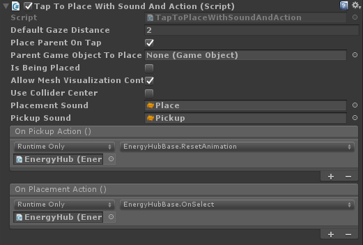
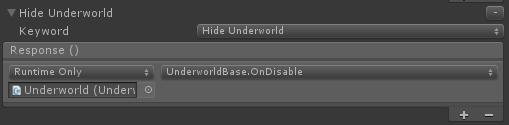

# HoloLens (1st gen) Spatial 220: Spatial sound

>[!IMPORTANT]
>The Mixed Reality Academy tutorials were designed with HoloLens (1st gen), Unity 2017, and Mixed Reality Immersive Headsets in mind.  As such, we feel it is important to leave these tutorials in place for developers who are still looking for guidance in developing for those devices. These tutorials will **_not_** be updated with the latest toolsets or interactions being used for HoloLens 2 and may not be compatible with newer versions of Unity.  They will be maintained to continue working on the supported devices. [A new series of tutorials](mrlearning-base.md) has been posted for HoloLens 2.

[Spatial sound](../../../design/spatial-sound.md) breathes life into holograms and gives them presence in our world. Holograms are composed of both light and sound, and if you happen to lose sight of your holograms, spatial sound can help you find them. Spatial sound is not like the typical sound that you would hear on the radio, it is sound that is positioned in 3D space. With spatial sound, you can make holograms sound like they're behind you, next to you, or even on your head! In this course, you will:

* Configure your development environment to use Microsoft Spatial Sound.
* Use Spatial Sound to enhance interactions.
* Use Spatial Sound in conjunction with [Spatial Mapping](../../../design/spatial-mapping.md).
* Understand sound design and mixing best practices.
* Use sound to enhance special effects and bring the user into the Mixed Reality world.

## Device support

<table>
<tr>
<th>Course</th><th style="width:150px"> <a href="/hololens/hololens1-hardware">HoloLens</a></th><th style="width:150px"> <a href="../../../discover/immersive-headset-hardware-details.md">Immersive headsets</a></th>
</tr><tr>
<td>MR Spatial 220: Spatial sound</td><td style="text-align: center;"> ✔️</td><td style="text-align: center;"> ✔️</td>
</tr>
</table>

## Before you start

### Prerequisites

* A Windows 10 PC configured with the correct [tools installed](../../../develop/install-the-tools.md).
* Some basic C# programming ability.
* You should have completed [MR Basics 101](../../../develop/unity/tutorials/holograms-101.md).
* A HoloLens device [configured for development](../../../develop/advanced-concepts/using-visual-studio.md#enabling-developer-mode).

### Project files

* Download the [files](https://github.com/Microsoft/HolographicAcademy/archive/Holograms-220-SpatialSound.zip) required by the project. Requires Unity 2017.2 or later.
  * If you still need Unity 5.6 support, please use [this release](https://github.com/Microsoft/HolographicAcademy/archive/v1.5.6-220.zip). This release may no longer be up-to-date.
  * If you still need Unity 5.5 support, please use [this release](https://github.com/Microsoft/HolographicAcademy/archive/v1.5.5-220.zip). This release may no longer be up-to-date.
  * If you still need Unity 5.4 support, please use [this release](https://github.com/Microsoft/HolographicAcademy/archive/v1.5.4-220.zip). This release may no longer be up-to-date.
* Un-archive the files to your desktop or other easy to reach location.

>[!NOTE]
>If you want to look through the source code before downloading, it's [available on GitHub](https://github.com/Microsoft/HolographicAcademy/tree/Holograms-220-SpatialSound).

### Errata and Notes

* "Enable Just My Code" needs to be disabled (*unchecked*) in Visual Studio under Tools->Options->Debugging in order to hit breakpoints in your code.

## Chapter 1 - Unity Setup

### Objectives

* Change Unity's sound configuration to use Microsoft Spatial Sound.
* Add 3D sound to an object in Unity.

### Instructions

* Start Unity.
* Select **Open**.
* Navigate to your Desktop and find the folder you previously un-archived.
* Click on the **Starting\Decibel** folder and then press the **Select Folder** button.
* Wait for the project to load in Unity.
* In the **Project** panel, open **Scenes\Decibel.unity**.
* In the **Hierarchy** panel, expand **HologramCollection** and select **P0LY**.
* In the Inspector, expand **AudioSource** and notice that there is no **Spatialize** check box.

By default, Unity does not load a spatializer plugin. The following steps will enable Spatial Sound in the project.

* In Unity's top menu, go to **Edit > Project Settings > Audio**.
* Find the **Spatializer Plugin** dropdown, and select **MS HRTF Spatializer**.
* In the **Hierarchy** panel, select **HologramCollection > P0LY**.
* In the **Inspector** panel, find the **Audio Source** component.
* Check the **Spatialize** checkbox.
* Drag the **Spatial Blend** slider all the way to **3D**, or enter **1** in the edit box.

We will now build the project in Unity and configure the solution in Visual Studio.

1. In Unity, select **File > Build Settings**.
2. Click **Add Open Scenes** to add the scene.
3. Select **Universal Windows Platform** in the **Platform** list and click **Switch Platform**.
4. If you're specifically developing for HoloLens, set **Target device** to **HoloLens**. Otherwise, leave it on **Any device**.
5. Ensure **Build Type** is set to **D3D** and **SDK** is set to **Latest installed** (which should be SDK 16299 or newer).
6. Click **Build**.
7. Create a **New Folder** named "App".
8. Single click the **App** folder.
9. Press **Select Folder**.

When Unity is done, a File Explorer window will appear.

1. Open the **App** folder.
2. Open the **Decibel Visual Studio Solution**.

If deploying to HoloLens:

1. Using the top toolbar in Visual Studio, change the target from Debug to **Release** and from ARM to **x86**.
2. Click on the drop down arrow next to the Local Machine button, and select **Remote Machine**.
3. Enter **your HoloLens device IP address** and set Authentication Mode to **Universal (Unencrypted Protocol)**. Click **Select**. If you do not know your device IP address, look in **Settings > Network & Internet > Advanced Options**.
4. In the top menu bar, click **Debug -> Start Without debugging** or press **Ctrl + F5**. If this is the first time deploying to your device, you will need to [pair it with Visual Studio](../../../develop/advanced-concepts/using-visual-studio.md#pairing-your-device).

If deploying to an immersive headset:

1. Using the top toolbar in Visual Studio, change the target from Debug to **Release** and from ARM to **x64**.
2. Make sure the deployment target is set to **Local Machine**.
3. In the top menu bar, click **Debug -> Start Without debugging** or press **Ctrl + F5**.

## Chapter 2 - Spatial Sound and Interaction

### Objectives

* Enhance hologram realism using sound.
* Direct the user's gaze using sound.
* Provide gesture feedback using sound.

### Part 1 - Enhancing Realism

#### Key Concepts

* Spatialize hologram sounds.
* Sound sources should be placed at an appropriate location on the hologram.

The appropriate location for the sound is going to depend on the hologram. For example, if the hologram is of a human, the sound source should be located near the mouth and not the feet.

#### Instructions

The following instructions will attach a spatialized sound to a hologram.

* In the **Hierarchy** panel, expand **HologramCollection** and select **P0LY**.
* In the **Inspector** panel, in the **AudioSource**, click the circle next to **AudioClip** and select **PolyHover** from the pop-up.
* Click the circle next to **Output** and select **SoundEffects** from the pop-up.

Project Decibel uses a Unity **AudioMixer** component to enable adjusting sound levels for groups of sounds. By grouping sounds this way, the overall volume can be adjusted while maintaining the relative volume of each sound.

* In the **AudioSource**, expand **3D Sound Settings**.
* Set **Doppler Level** to **0**.

Setting Doppler level to zero disables changes in pitch caused by motion (either of the hologram or the user). A classic example of Doppler is a fast-moving car. As the car approaches a stationary listener, the pitch of the engine rises. When it passes the listener, the pitch lowers with distance.

### Part 2 - Directing the User's Gaze

#### Key Concepts

* Use sound to call attention to important holograms.
* The ears help direct where the eyes should look.
* The brain has some learned expectations.

One example of learned expectations is that birds are generally above the heads of humans. If a user hears a bird sound, their initial reaction is to look up. Placing a bird below the user can lead to them facing the correct direction of the sound, but being unable to find the hologram based on the expectation of needing to look up.

#### Instructions

The following instructions enable P0LY to hide behind you, so that you can use sound to locate the hologram.

* In the **Hierarchy** panel, select **Managers**.
* In the **Inspector** panel, find **Speech Input Handler**.
* In **Speech Input Handler**, expand **Go Hide**.
* Change **No Function** to **PolyActions.GoHide**.

### Part 3 - Gesture Feedback

#### Key Concepts

* Provide the user with positive gesture confirmation using sound
* Do not overwhelm the user - overly loud sounds get in the way
* Subtle sounds work best - do not overshadow the experience

#### Instructions

* In the **Hierarchy** panel, expand **HologramCollection**.
* Expand **EnergyHub** and select **Base**.
* In the **Inspector** panel, click **Add Component** and add **Gesture Sound Handler**.
* In **Gesture Sound Handler**, click the circle next to **Navigation Started Clip** and **Navigation Updated Clip** and select **RotateClick** from the pop-up for both.
* Double click on "GestureSoundHandler" to load in Visual Studio.

Gesture Sound Handler performs the following tasks:

* Create and configure an **AudioSource**.
* Place the **AudioSource** at the location of the appropriate **GameObject**.
* Plays the **AudioClip** associated with the gesture.

#### Build and Deploy

1. In Unity, select **File > Build Settings**.
2. Click **Build**.
3. Single click the **App** folder.
4. Press **Select Folder**.

Check that the Toolbar says "Release", "x86" or "x64", and "Remote Device". If not, this is the coding instance of Visual Studio. You may need to re-open the solution from the App folder.

* If prompted, reload the project files.
* As before, deploy from Visual Studio.

After the application is deployed:

* Observe how the sound changes as you move around P0LY.
* Say *"Go Hide"* to make P0LY move to a location behind you. Find it by the sound.
* Gaze at the base of the Energy Hub. Tap and drag left or right to rotate the hologram and notice how the clicking sound confirms the gesture.

Note: There is a text panel that will tag-along with you. This will contain the available voice commands that you can use throughout this course.

## Chapter 3 - Spatial Sound and Spatial Mapping

### Objectives

* Confirm interaction between holograms and the real world using sound.
* Occlude sound using the physical world.

### Part 1 - Physical World Interaction

#### Key Concepts

* Physical objects generally make a sound when encountering a surface or another object.
* Sounds should be context appropriate within the experience.

For example, setting a cup on a table should make a quieter sound than dropping a boulder on a piece of metal.

#### Instructions

* In the **Hierarchy** panel, expand **HologramCollection**.
* Expand **EnergyHub**, select **Base**.
* In the **Inspector** panel, click **Add Component** and add **Tap To Place With Sound and Action**.
* In **Tap To Place With Sound and Action**:
  * Check **Place Parent On Tap**.
  * Set **Placement Sound** to **Place**.
  * Set **Pickup Sound** to **Pickup**.
  * Press the + in the bottom right under both **On Pickup Action** and **On Placement Action**. Drag EnergyHub from the scene into the **None (Object)** fields.
    * Under **On Pickup Action**, click on **No Function** -> **EnergyHubBase** -> **ResetAnimation**.
    * Under **On Placement Action**, click on **No Function** -> **EnergyHubBase** -> **OnSelect**.

### Part 2 - Sound Occlusion

#### Key Concepts

* Sound, like light, can be occluded.

A classic example is a concert hall. When a listener is standing outside of the hall and the door is closed, the music sounds muffled. There is also typically a reduction in volume. When the door is opened, the full spectrum of the sound is heard at the actual volume. High frequency sounds are generally absorbed more than low frequencies.

#### Instructions

* In the **Hierarchy** panel, expand **HologramCollection** and select **P0LY**.
* In the **Inspector** panel, click **Add Component** and add **Audio Emitter**.

The Audio Emitter class provides the following features:

* Restores any changes to the volume of the **AudioSource**.
* Performs a **Physics.RaycastNonAlloc** from the user's position in the direction of the **GameObject** to which the **AudioEmitter** is attached.

The RaycastNonAlloc method is used as a performance optimization to limit allocations as well as the number of results returned.

* For each **IAudioInfluencer** encountered, calls the **ApplyEffect** method.
* For each previous **IAudioInfluencer** that is no longer encountered, call the **RemoveEffect** method.

Note that AudioEmitter updates on human time scales, as opposed to on a per frame basis. This is done because humans generally do not move fast enough for the effect to need to be updated more frequently than every quarter or half of a second. Holograms that teleport rapidly from one location to another can break the illusion.

* In the **Hierarchy** panel, expand **HologramCollection**.
* Expand **EnergyHub** and select **BlobOutside**.
* In the **Inspector** panel, click **Add Component** and add **Audio Occluder**.
* In **Audio Occluder**, set **Cutoff Frequency** to **1500**.

This setting limits the AudioSource frequencies to 1500 Hz and below.

* Set **Volume Pass Through** to **0.9**.

This setting reduces the volume of the AudioSource to 90% of it's current level.

Audio Occluder implements IAudioInfluencer to:

* Apply an occlusion effect using an **AudioLowPassFilter** which gets attached to the **AudioSource** managed buy the **AudioEmitter**.
* Applies volume attenuation to the AudioSource.
* Disables the effect by setting a neutral cutoff frequency and disabling the filter.

The frequency used as neutral is 22 kHz (22000 Hz). This frequency was chosen due to it being above the nominal maximum frequency that can be heard by the human ear, this making no discernable impact to the sound.

* In the **Hierarchy** panel, select **SpatialMapping**.
* In the **Inspector** panel, click **Add Component** and add **Audio Occluder**.
* In **Audio Occluder**, set **Cutoff Frequency** to **750**.

When multiple occluders are in the path between the user and the **AudioEmitter**, the lowest frequency is applied to the filter.

* Set **Volume Pass Through** to **0.75**.

When multiple occluders are in the path between the user and the **AudioEmitter**, the volume pass through is applied additively.

* In the **Hierarchy** panel, select **Managers**.
* In the **Inspector** panel, expand **Speech Input Handler**.
* In **Speech Input Handler**, expand **Go Charge**.
* Change **No Function** to **PolyActions.GoCharge**.

* Expand **Come Here**.
* Change **No Function** to **PolyActions.ComeBack**.

#### Build and Deploy

* As before, build the project in Unity and deploy in Visual Studio.

After the application is deployed:

* Say *"Go Charge"* to have P0LY enter the Energy Hub.

Note the change in the sound. It should sound muffled and a little quieter. If you are able to position yourself with a wall or other object between you and the Energy Hub, you should notice a further muffling of the sound due to the occlusion by the real world.

* Say *"Come Here"* to have P0LY leave the Energy Hub and position itself in front of you.

Note that the sound occlusion is removed once P0LY exits the Energy Hub. If you are still hearing occlusion, P0LY may be occluded by the real world. Try moving to ensure you have a clear line of sight to P0LY.

### Part 3 - Room Models

#### Key Concepts

* The size of the space provides subliminal queues that contribute to sound localization.
* Room models are set per-**AudioSource**.
* The [MixedRealityToolkit for Unity](https://github.com/Microsoft/MixedRealityToolkit-Unity) provides code for setting the room model.
* For Mixed Reality experiences, select the room model that best fits the real world space.

If you are creating a Virtual Reality scenario, select the room model that best fits the virtual environment.

## Chapter 4 - Sound Design

### Objectives

* Understand considerations for effective sound design.
* Learn mixing techniques and guidelines.

### Part 1 - Sound and Experience Design

This section discusses key sound and experience design considerations and guidelines.

#### Normalize all sounds

This avoids the need for special case code to adjust volume levels per sound, which can be time consuming and limits the ability to easily update sound files.

#### Design for an untethered experience

HoloLens is a fully contained, untethered holographic computer. Your users can and will use your experiences while moving. Be sure to test your audio mix by walking around.

#### Emit sound from logical locations on your holograms

In the real world, a dog does not bark from its tail and a human's voice does not come from his/her feet. Avoid having your sounds emit from unexpected portions of your holograms.

For small holograms, it is reasonable to have sound emit from the center of the geometry.

#### Familiar sounds are most localizable

The human voice and music are very easy to localize. If someone calls your name, you are able to very accurately determine from what direction the voice came and from how far away. Short, unfamiliar sounds are harder to localize.

#### Be cognizant of user expectations

Life experience plays a part in our ability to identify the location of a sound. This is one reason why the human voice is particularly easy to localize. It is important to be aware of your user's learned expectations when placing your sounds.

For example, when someone hears a bird song they generally look up, as birds tend to be above the line of sight (flying or in a tree). It is not uncommon for a user to turn in the correct direction of a sound, but look in the wrong vertical direction and become confused or frustrated when they are unable to find the hologram.

#### Avoid hidden emitters

In the real world, if we hear a sound, we can generally identify the object that is emitting the sound. This should also hold true in your experiences. It can be very disconcerting for users to hear a sound, know from where the sound originates and be unable to see an object.

There are some exceptions to this guideline. For example, ambient sounds such as crickets in a field need not be visible. Life experience gives us familiarity with the source of these sounds without the need to see it.

### Part 2 - Sound Mixing

#### Target your mix for 70% volume on the HoloLens

Mixed Reality experiences allow holograms to be seen in the real world. They should also allow real world sounds to be heard. A 70% volume target enables the user to hear the world around them along with the sound of your experience.

#### HoloLens at 100% volume should drown out external sounds

A volume level of 100% is akin to a Virtual Reality experience. Visually, the user is transported to a different world. The same should hold true audibly.

#### Use the Unity AudioMixer to adjust categories of sounds

When designing your mix, it is often helpful to create sound categories and have the ability to increase or decrease their volume as a unit. This retains the relative levels of each sound while enabling quick and easy changes to the overall mix. Common categories include; sound effects, ambience, voice overs and background music.

#### Mix sounds based on the user's gaze

It can often be useful to change the sound mix in your experience based on where a user is (or is not) looking. One common use for this technique are to reduce the volume level for holograms that are outside of the Holographic Frame to make it easier for the user to focus on the information in front of them. Another use is to increase the volume of a sound to draw the user's attention to an important event.

#### Building your mix

When building your mix, it is recommended to start with your experience's background audio and add layers based on importance. Often, this results in each layer being louder than the previous.

Imagining your mix as an inverted funnel, with the least important (and generally quietest sounds) at the bottom, it is recommended to structure your mix similar to the following diagram.

Voice overs are an interesting scenario. Based on the experience you are creating you may wish to have a stereo (not localized) sound or to spatialize your voice overs. Two Microsoft published experiences illustrate excellent examples of each scenario.

[HoloTour](https://www.microsoft.com/store/p/holotour/9nblggh5pj87) uses a stereo voice over. When the narrator is describing the location being viewed, the sound is consistent and does not vary based on the user's position. This enables the narrator to describe the scene without taking away from the spatialized sounds of the environment.

[Fragments](https://www.microsoft.com/store/p/fragments/9nblggh5ggm8) utilizes a spatialized voice over in the form of a detective. The detective's voice is used to help bring the user's attention to an important clue as if an actual human was in the room. This enables an even greater sense of immersion into the experience of solving the mystery.

### Part 3 -Performance

#### CPU usage

When using Spatial Sound, 10 - 12 emitters will consume approximately 12% of the CPU.

#### Stream long audio files

Audio data can be large, especially at common sample rates (44.1 and 48 kHz). A general rule is that audio files longer than 5 - 10 seconds should be streamed to reduce application memory usage.

In Unity, you can mark an audio file for streaming in the file's import settings.

## Chapter 5 - Special Effects

### Objectives

* Add depth to "Magic Windows".
* Bring the user into the virtual world.

### Magic Windows

#### Key Concepts

* Creating views into a hidden world, is visually compelling.
* Enhance realism by adding audio effects when a hologram or the user is near the hidden world.

#### Instructions

* In the **Hierarchy** panel, expand **HologramCollection** and select **Underworld**.
* Expand **Underworld** and select **VoiceSource**.
* In the **Inspector** panel, click **Add Component** and add **User Voice Effect**.

An **AudioSource** component will be added to **VoiceSource**.

* In **AudioSource**, set **Output** to **UserVoice (Mixer)**.
* Check the **Spatialize** checkbox.
* Drag the **Spatial Blend** slider all the way to **3D**, or enter **1** in the edit box.
* Expand **3D Sound Settings**.
* Set **Doppler Level** to **0**.
* In **User Voice Effect**, set **Parent Object** to the **Underworld** from the scene.
* Set **Max Distance** to **1**.

Setting **Max Distance** tells **User Voice Effect** how close the user must be to the parent object before the effect is enabled.

* In **User Voice Effect**, expand **Chorus Parameters**.
* Set **Depth** to **0.1**.
* Set **Tap 1 Volume**, **Tap 2 Volume** and **Tap 3 Volume** to **0.8**.
* Set **Original Sound Volume** to **0.5**.

The previous settings configure the parameters of the Unity **AudioChorusFilter** used to add richness to the user's voice.

* In **User Voice Effect**, expand **Echo Parameters**.
* Set **Delay** to **300**
* Set **Decay Ratio** to **0.2**.
* Set **Original Sound Volume** to **0**.

The previous settings configure the parameters of the Unity **AudioEchoFilter** used to cause the user's voice to echo.

The User Voice Effect script is responsible for:

* Measuring the distance between the user and the **GameObject** to which the script is attached.
* Determining whether or not the user is facing the **GameObject**.

The user must be facing the GameObject, regardless of distance, for the effect to be enabled.

* Applying and configuring an **AudioChorusFilter** and an **AudioEchoFilter** to the **AudioSource**.
* Disabling the effect by disabling the filters.

User Voice Effect uses the Mic Stream Selector component, from the [MixedRealityToolkit for Unity](https://github.com/Microsoft/MixedRealityToolkit-Unity), to select the high quality voice stream and route it into Unity's audio system.

* In the **Hierarchy** panel, select **Managers**.
* In the **Inspector** panel, expand **Speech Input Handler**.
* In **Speech Input Handler**, expand **Show Underworld**.
* Change **No Function** to **UnderworldBase.OnEnable**.

* Expand **Hide Underworld**.
* Change **No Function** to **UnderworldBase.OnDisable**.

#### Build and Deploy

* As before, build the project in Unity and deploy in Visual Studio.

After the application is deployed:

* Face a surface (wall, floor, table) and say *"Show Underworld"*.

The underworld will be shown and all other holograms will be hidden. If you do not see the underworld, ensure that you are facing a real-world surface.

* Approach within 1 meter of the underworld hologram and start talking.

There are now audio effects applied to your voice!

* Turn away from the underworld and notice how the effect is no longer applied.
* Say *"Hide Underworld"* to hide the underworld.

The underworld will be hidden and the previously hidden holograms will reappear.

## The End

Congratulations! You have now completed **MR Spatial 220: Spatial sound**.

Listen to the world and bring your experiences to life with sound!