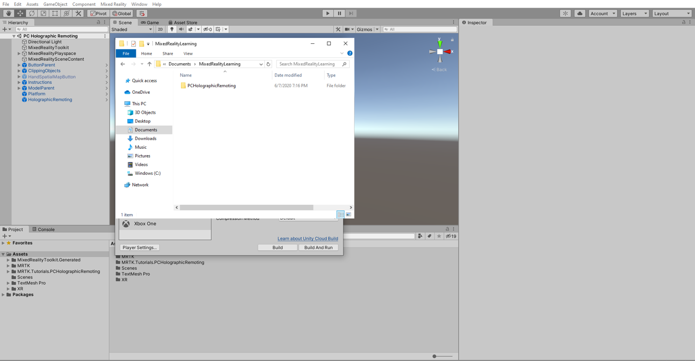
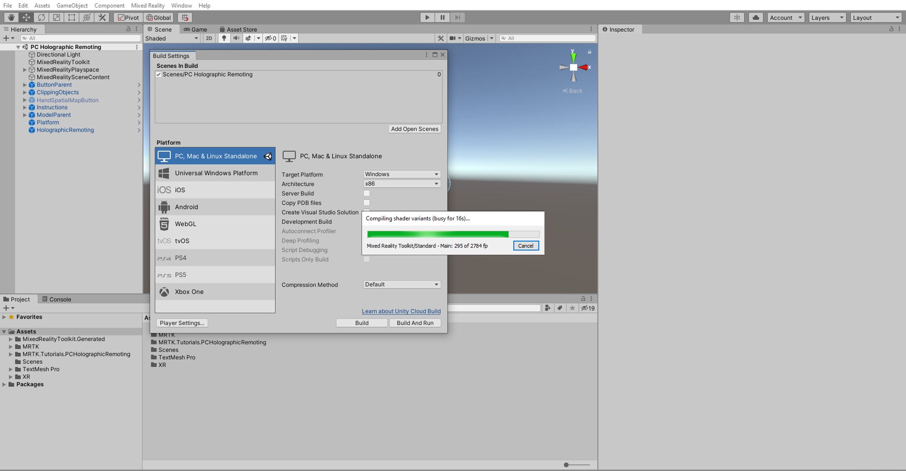
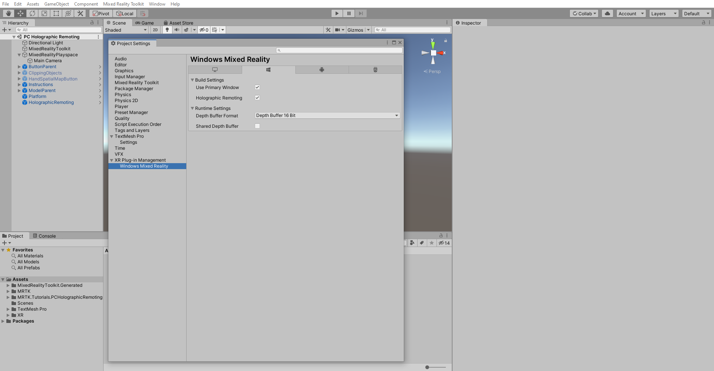
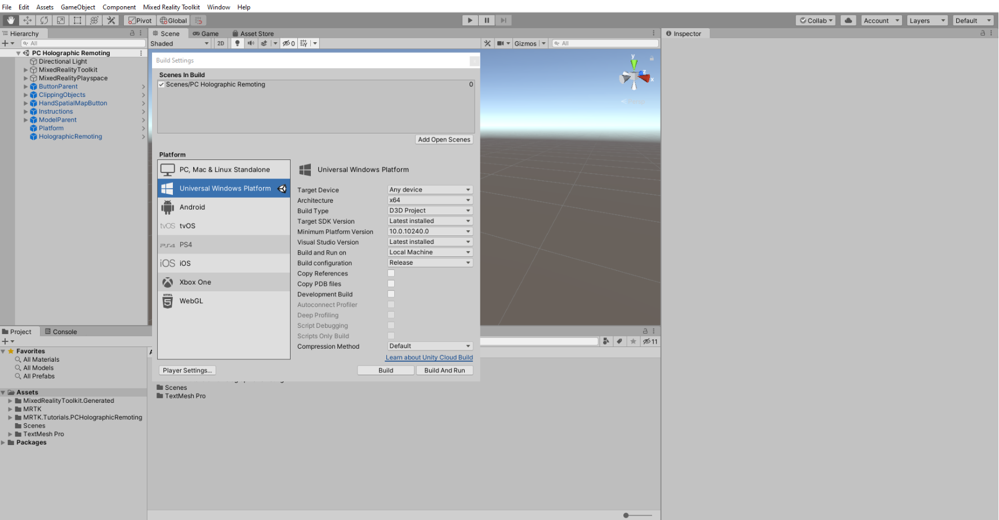
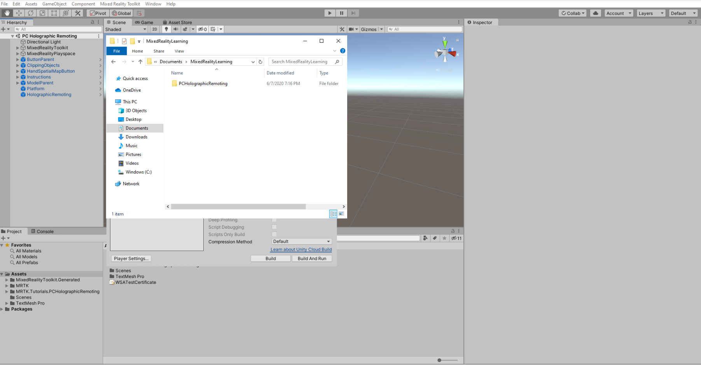
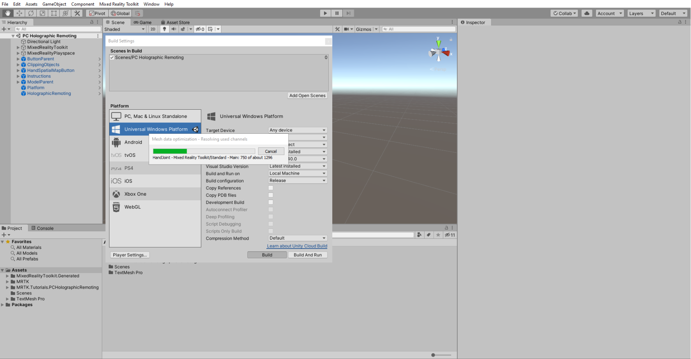
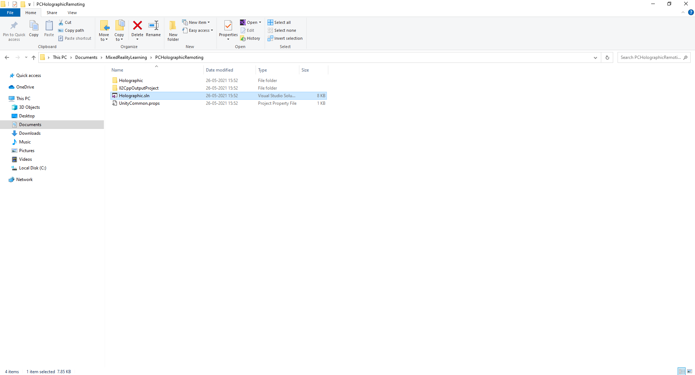
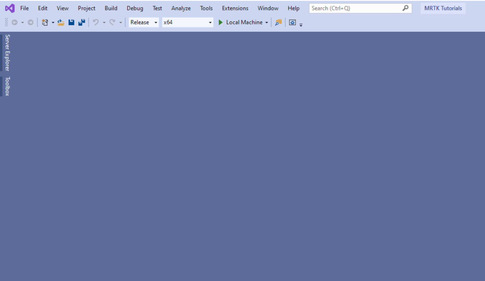

# [Unity 2020 + OpenXR](#tab/openxr)

### 1. Switching Build Platform

In the Unity menu, select File > Build Settings to open the Build Settings window.

In the Build Settings window, select **PC, Mac & Linux Standalone** Platform and click the **Switch Platform** button to change the Build Platform:

When Unity has finished switching the platform, click the x icon to close the Build Settings window.

### 2. Set the project settings

In the Unity menu, select **Edit** > **Project Settings** > **XR Plug-in Management** ensure that you are in Windows Standalone tab and check the **OpenXR** and **Windows Mixed Reality feature set** checkbox.

In Project Settings window, select **OpenXR** and ensure that you are in Windows Standalone tab and change the **Depth submission mode** from None to **Depth 16 Bit**.

In interaction profiles tab add **Eye Gaze Interaction Profile** and **Microsoft Hand Interaction Profile** by clicking on the + symbol.

Under **Open XR feature groups** > **All features** > check the **Holographic App Remoting** checkbox.

next select the **Windows Mixed Reality**  check box and under Windows Mixed Reality group select the  **Holographic App Remoting** checkbox.

### 3. Build the Unity Project

In the Unity menu, select File > Build Settings to open the Build Settings window.

In the Build Settings window, click the ***Add Open Scenes*** button to add your current scene to the Scenes. In the Build list, then click the **Build** button:

choose a suitable location to store your build, for example, Documents\MixedRealityLearning. Create a new folder and give it a suitable name, for example, PCHolographicRemoting. Then click the ***Select Folder*** button to start the build process:

Wait for Unity to finish the build process.

double click on the Executable file to open the Application in your PC.

> [!NOTE]
> Due to some known issues in Holographic Remoting for PC app Built as UWP we are Building the PC App as Windows Standalone for OpenXR.

# [Legacy WSA](#tab/wsa)

### 1. Set the player settings

In the **XR Settings** section, select the **WSA Holographic Remoting Supported** checkbox and enable the Holographic Remoting.

### 2. Build the Unity Project

In the Unity menu, select File > Build Settings to open the Build Settings window.

In the Build Settings window, click the ***Add Open Scenes*** button to add your current scene to the Scenes. In the Build list, then click the ***Build button*** to open the Build Universal Windows Platform window:

In the Build Universal Windows Platform window, choose a suitable location to store your build, for example, Documents\MixedRealityLearning. Create a new folder and give it a suitable name, for example, PCHolographicRemoting. Then click the ***Select Folder*** button to start the build process:

Wait for Unity to finish the build process.

### 3. Build and deploy the application

When the build process is completed, Unity will prompt Windows File Explorer to open the location you stored the build. Navigate inside the folder, and double-click the .sln file to open it in Visual Studio:

> [!NOTE]
> If Visual Studio asks you to install new components, take a moment to ensure that all prerequisite components are installed as specified in the Install the Tools documentation.

Configure Visual Studio for PC by selecting the Release configuration, the x64 architecture, and Local Machine as target:

Click the button that says ***Local Machine***. It starts to build and deploy the application on to your PC. The application will be installed in your PC by default.
