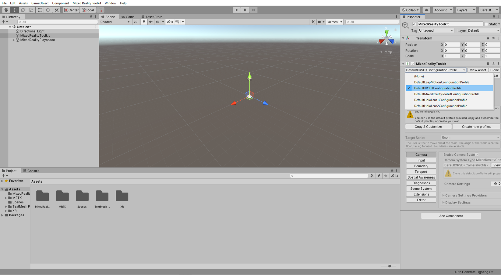
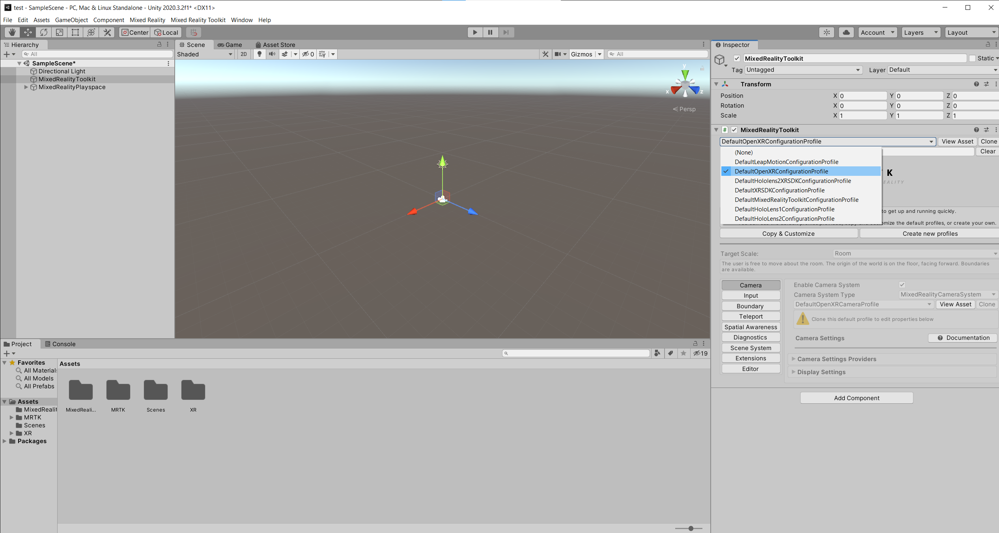

# [Unity 2019/2020 + Windows XR Plugin](#tab/winxr)

With the **MixedRealityToolkit** object still selected in the Hierarchy window, set the **MixedRealityToolkit** configuration profile to **DefaultXRSDKConfigurationProfile**:

# [Unity 2020 + OpenXR](#tab/openxr)
With the **MixedRealityToolkit** object still selected in the Hierarchy window, set the **MixedRealityToolkit** configuration profile to **DefaultOpenXRConfigurationProfile**:

# [Legacy WSA](#tab/wsa)

With the **MixedRealityToolkit** object still selected in the Hierarchy window, in the Inspector window, verify that the **MixedRealityToolkit** configuration profile is set to **DefaultMixedRealityToolkitConfigurationProfile**:

