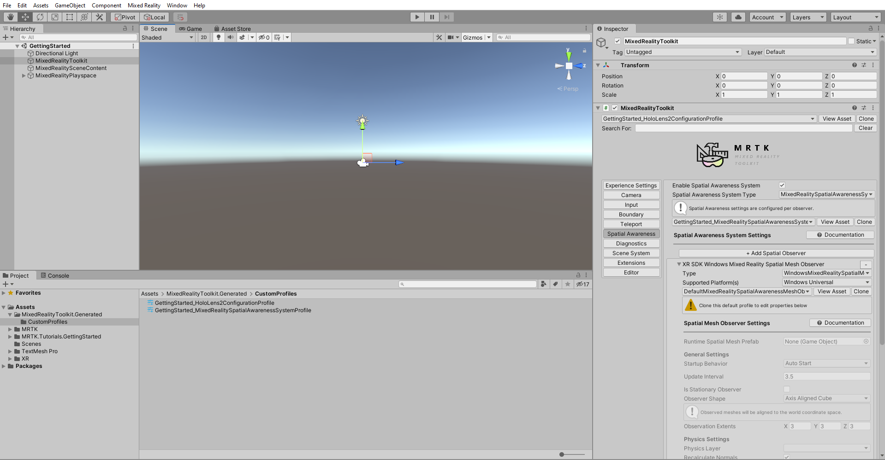
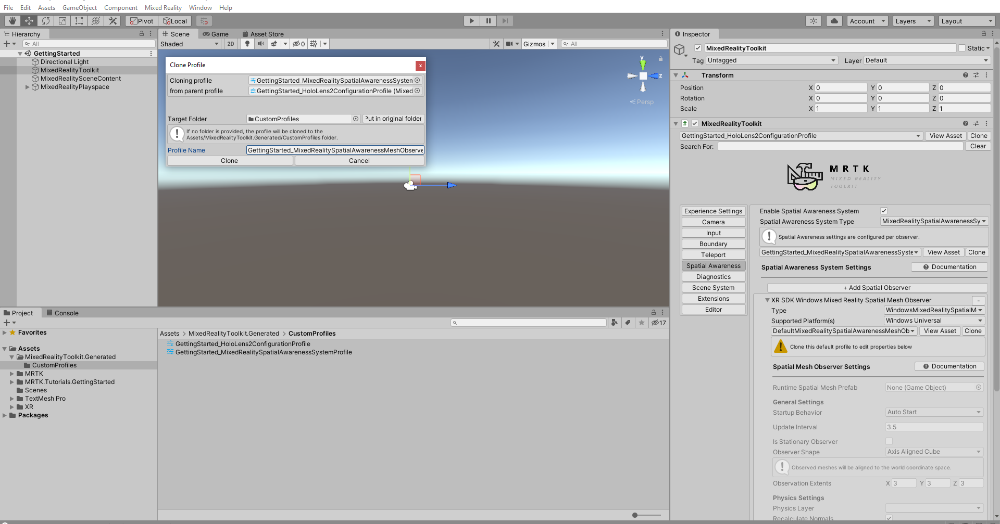
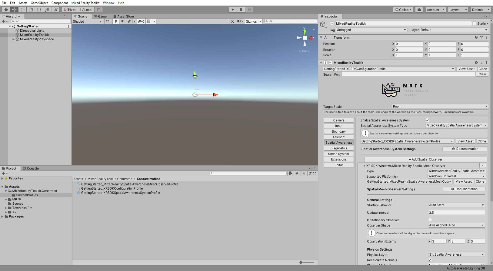

# [Unity 2020 + OpenXR](#tab/openxr)

### 4. Clone the default Spatial Awareness Mesh Observer Profile

With the **Spatial Awareness** tab still selected, expand the **XR SDK Windows Mixed Reality Spatial Mesh Observer** section, then click the **Clone** button to open the Clone Profile window:

In the Clone Profile window, enter a suitable **Profile Name**, for example, _GettingStarted_MixedRealitySpatialAwarenessMeshObserverProfile_, then click the **Clone** button to create an editable copy of the **DefaultMixedRealitySpatialAwarenessMeshObserverProfile**:

The newly created Spatial Awareness Mesh Observer Profile is now automatically assigned to your Spatial Awareness System Profile:

# [Unity 2019/2020 + Windows XR Plugin](#tab/winxr)

### 4. Clone the default Spatial Awareness Mesh Observer Profile

With the **Spatial Awareness** tab still selected, expand the **XR SDK Windows Mixed Reality Spatial Mesh Observer** section, then click the **Clone** button to open the Clone Profile window:

> [!NOTE]
> above screenshot is from **Unity 2020** If you are using **Unity 2019**, there will be two tabs, one for Legacy XR and one for XRSDK, ensure that you are in XRSDK tab and clone the **XR SDK Windows Mixed Reality Spatial Mesh Observer**.

In the Clone Profile window, enter a suitable **Profile Name**, for example, _GettingStarted_MixedRealitySpatialAwarenessMeshObserverProfile_, then click the **Clone** button to create an editable copy of the **DefaultMixedRealitySpatialAwarenessMeshObserverProfile**:

The newly created Spatial Awareness Mesh Observer Profile is now automatically assigned to your Spatial Awareness System Profile:

# [Legacy WSA](#tab/wsa)

### 4. Clone the default Spatial Awareness Mesh Observer Profile

With the **Spatial Awareness** tab still selected, ensure that you are in **Legacy XR** tab and expand the **Windows Mixed Reality Spatial Mesh Observer** section, then click the **Clone** button to open the Clone Profile window:

In the Clone Profile window, enter a suitable **Profile Name**, for example, _GettingStarted_MixedRealitySpatialAwarenessMeshObserverProfile_, then click the **Clone** button to create an editable copy of the **DefaultMixedRealitySpatialAwarenessMeshObserverProfile**:

The newly created Spatial Awareness Mesh Observer Profile is now automatically assigned to your Spatial Awareness System Profile:

### 5. Change the visibility of the spatial awareness mesh

In the **Spatial Mesh Observer Settings**, change the **Display Option** to **Occlusion** to make the spatial mapping mesh invisible while still functional:

> [!NOTE]
> Although the spatial mapping mesh is not visible, it is still present and functional. For example, any holograms behind the spatial mapping mesh, such as a hologram behind a physical wall, will not be visible.

You just learned how to modify a setting in the MRTK profile. As you can see, to customize the MRTK settings, you first need to create copies of the default profiles. Because the default profiles are not editable, you will always have them as references if you want to revert to the default settings. To learn more about MRTK profiles and their architecture, you can refer to the [MRTK profile configuration guide](/windows/mixed-reality/mrtk-unity/configuration/mixed-reality-configuration-guide) in the [MRTK Documentation Portal](/windows/mixed-reality/mrtk-unity).

