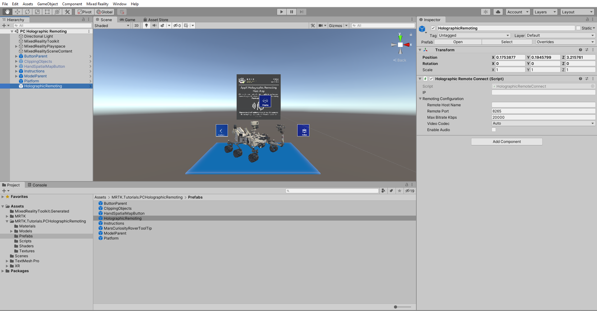
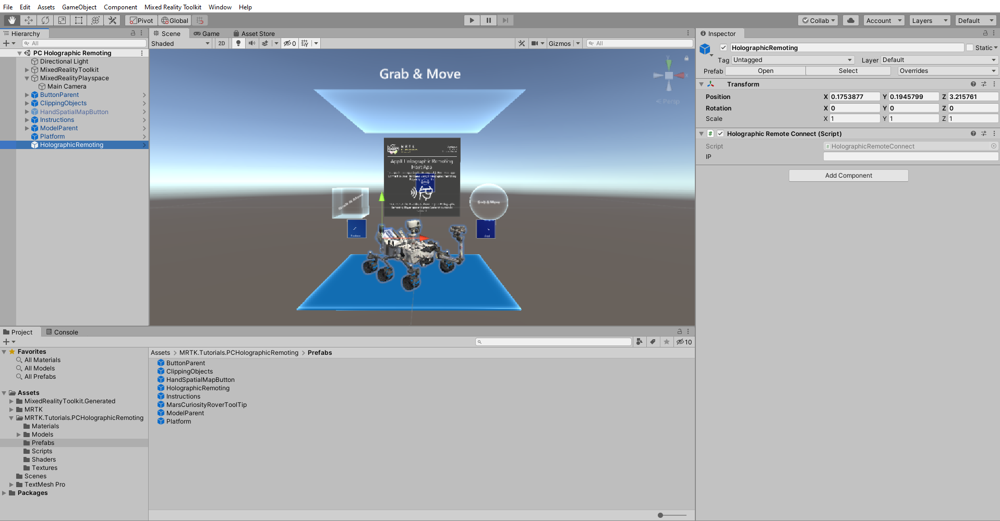

# [Unity 2020 + OpenXR](#tab/openxr)

## Configuring your scene for Holographic Remoting

In this section, you will configure your project to stream your Mixed Reality experience to your HoloLens 2 device from your PC in real-time over a Wi-Fi connection.

In the Project window, navigate to the **Assets** > **MRTK.Tutorials.PCHolograhicRemoting** > **Prefabs** folder, and click and drag **HolographicRemoting** prefab into your scene.

# [Legacy WSA](#tab/wsa)

## Configuring your scene for Holographic Remoting

In this section, you will configure your project to stream your Mixed Reality experience to your HoloLens 2 device from your PC in real-time over a Wi-Fi connection.

In the Project window, navigate to the **Assets** > **MRTK.Tutorials.PCHolograhicRemoting** > **Prefabs** folder, and click and drag **HolographicRemoting** prefab into your scene.

