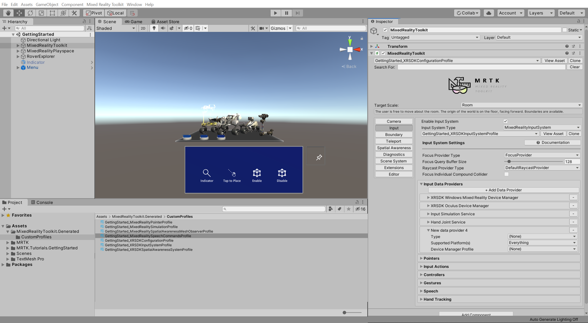
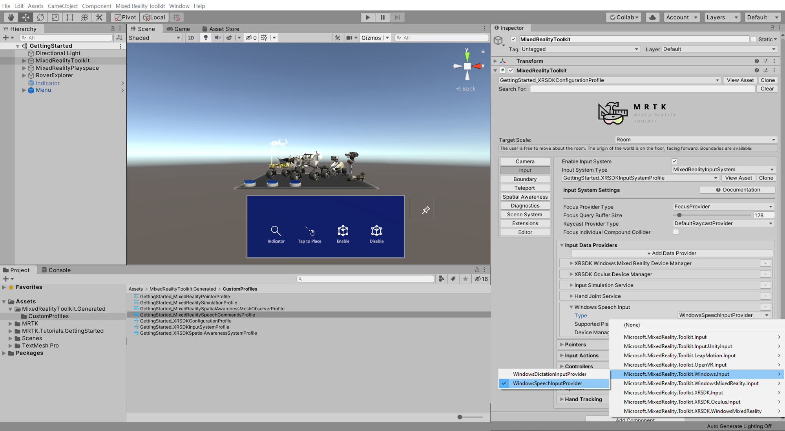

# [Unity 2019/2020 + Windows XR Plugin](#tab/winxr)

## Ensuring Microphone capability and adding Speech Input data provider

In the Unity menu, select Mixed Reality Toolkit > Utilities > **Configure Unity Project** to open the **MRTK Project Configurator** window, then in the **UWP Capabilities** section, verify that **Enable Microphone Capability** is greyed out:

> [!NOTE]
> The Microphone capability should have been enabled during the [Apply the MRTK Project Configurator settings](../mr-learning-base-02.md#selecting-mrtk-and-project-settings) instructions when you configured the Unity project at the beginning of this tutorial series. However, if it is not enabled, make sure you enable it now.

In the Hierarchy window, select the MixedRealityToolkit object, then in the Inspector window, navigate to the Input tab:

* Expand the **Input Data Providers** , click the **+ Add Data Provider** button to add a new Data Provider

Assign **Microsoft.MixedReality.ToolKit.Windows.Input** > **WindowsSpeechInputProvider** to the **Type** field of the new Data Provider.

# [Legacy WSA](#tab/wsa)

## Ensuring the Microphone capability is enabled

In the Unity menu, select Mixed Reality Toolkit > Utilities > **Configure Unity Project** to open the **MRTK Project Configurator** window, then in the **UWP Capabilities** section, verify that **Enable Microphone Capability** is greyed out:

> [!NOTE]
> The Microphone capability should have been enabled during the [Apply the MRTK Project Configurator settings](../mr-learning-base-02.md#creating-and-configuring-the-scene) instructions when you configured the Unity project at the beginning of this tutorial series. However, if it is not enabled, make sure you enable it now.
