# [Unity 2020 + OpenXR](#tab/openxr)

Once **MixedRealityFeatureTool** is opened, click on **Start** to get started with Mixed Reality Feature Tool.

The first step is to point the Mixed Reality Feature Tool to your **Project path** using the **ellipsis** button, click on the Three dots ellipsis button next to the Project path and browse to your project folder in the explorer for example _D:\MixedRealityLearning\MRTK Tutorials_.

When you have located your project's folder, click the Open button to return to the Mixed Reality Feature Tool. Then click on **Discover Features**.

> [!NOTE]
> The dialog that's displayed when browsing for the Unity project folder contains '_' as the file name. There must be a value for the file name to enable the folder to be selected.

> [!Important]
> The Mixed Reality Feature Tool performs validation to ensure that it has been directed to a Unity project folder. The folder must contain Assets, Packages and Project Settings folders.

Features are grouped by category to make things easier to find, click on **Mixed Reality Toolkit** dropdown to find packages relating to the Mixed Reality Toolkit and click on **Platform Support** dropdown to find packages relating various supporting platforms.

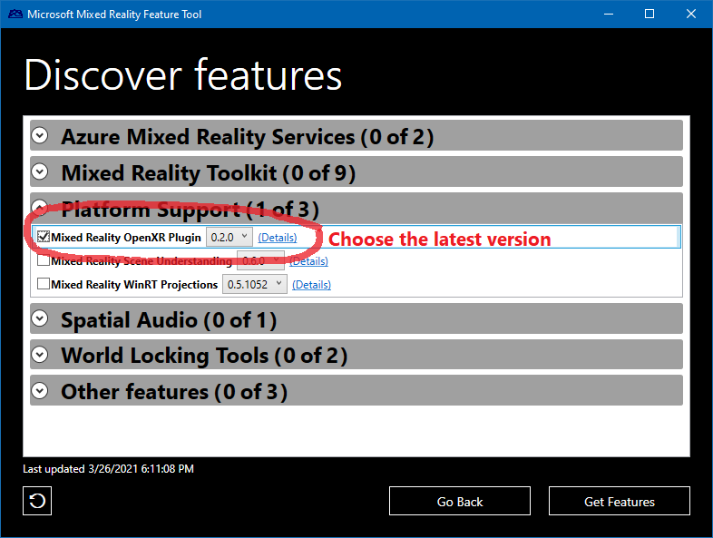

check the **Mixed Reality Toolkit Foundation** and click on the dropdown next to it to select **MRTK 2.7.0**, also check the **Mixed Reality OpenXR Plugin** and click on the dropdown next to it to select most recent version available, then click on **Get features** button to download the selected packages.

Next click on the **Validate** button to validate the selected package, you will get a popup with message **No validation issues were detected** click on **OK** to close the popup and click on **Import** button.

Click on **Approve** Button to add the **Mixed Reality Toolkit** into the project.

## Configuring the Unity project

After Unity has finished importing the package from the previous section, a warning message appears to restart the unity editor to enable to backends for new plugin system, click on **Yes**

Once the Unity restarts MRTK Project Configurator window should appear. If it doesn't, you can manually open it by going to **Mixed Reality** > **Toolkit** > **Utilities** > **Configure Project for MRTK**:

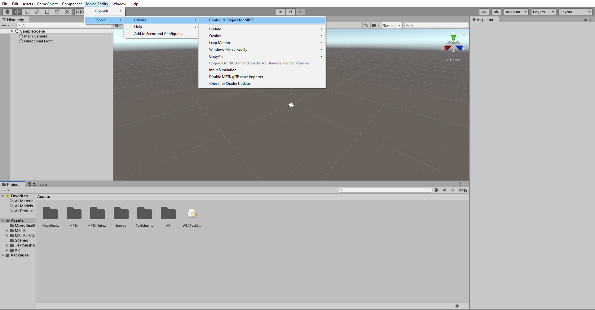

Click on **Unity OpenXR Plugin** to Enable XR Plugin Management and add its required packages into your project.

This will import required unity packages for XR Plugin Management, once done click on **Show XR Plug-In Management Settings** in MRTK project Configurator.

This opens **Project Settings window**. In the Project Settings window under **XR Plug-in Management** Ensure that you are in Universal Windows Platform settings (Windows logo tab). Also Ensure **Initialize XR on Startup** is checked, then click **OpenXR** checkbox and **Microsoft HoloLens feature set** checkbox to enable them.

Once you check OpenXR checkbox, MRTK Project Configurator window will show updated message with **Apply Settings** button. Click **Apply Settings** button. 

To validate OpenXR configuration, click **OpenXR** under **XR Plug-in Management** and check these items:
* Depth Submission Mode: **Depth 16 Bit**
* Interaction Profiles: **Microsoft Hand Interaction Profile**

> [!TIP]
> Reducing the Depth Format to 16-bit is optional but may help improve graphics performance in your project. To learn more about this topic, you can refer to the <a href="/windows/mixed-reality/mrtk-unity/performance/perf-getting-started#single-pass-instanced-rendering" target="_blank">Depth buffer sharing (HoloLens)</a> section of MRTK's Performance documentation.

In the **MRTK Project Configurator** window, click on **Next**, then click the **Apply** button to apply the settings. (You can manually open it by going to **Mixed Reality** > **Toolkit** > **Utilities** > **Configure Project for MRTK**)

Once you click on Apply, Unity will try to restart for the input system to take into effect, click on **Apply** to restart the Unity editor

Once the Unity restarts open MRTK Project Configurator from the unity menu and Click on **Next** then click on **Done** finish the Unity project configuration for OpenXR.

### Configure additional project settings

In the Unity menu, select **Edit** > **Project Settings...** to open the Project Settings window:

In the Project Settings window, select **XR Plug-in Management** > **OpenXR**, then use the **Depth Submission Mode** dropdown to select **Depth 16-bit**:

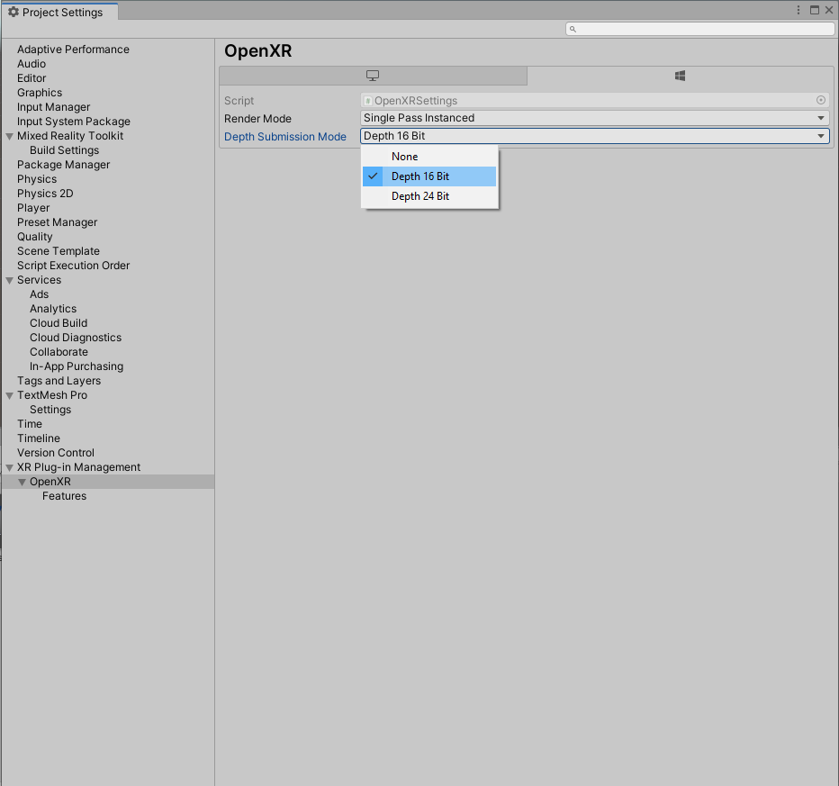

In the Project Settings window, select **Player** > **Publishing Settings**, then in the **Package name** field, enter a suitable name, for example, _MRTKTutorials-GettingStarted_:

> [!NOTE]
> The 'Package name' is the unique identifier for the app. You should change this identifier before deploying the app to avoid overwriting previously installed apps.

> [!TIP]
> The 'Product Name' is the name displayed in the HoloLens Start menu. To make the app easier to locate during development, add an underscore in front of the name to sort it to the top.

# [Unity 2019/2020 + Windows XR Plugin](#tab/winxr)

Once **MixedRealityFeatureTool** is opened, click on **Start** to get started with Mixed Reality Feature Tool.

The first step is to point the Mixed Reality Feature Tool to your **Project path** using the **ellipsis** button, click on the Three dots ellipsis button next to the Project path and browse to your project folder in the explorer for example _D:\MixedRealityLearning\MRTK Tutorials_.

When you have located your project's folder, click the Open button to return to the Mixed Reality Feature Tool. Then click on **Discover Features**.

> [!NOTE]
> The dialog that's displayed when browsing for the Unity project folder contains '_' as the file name. There must be a value for the file name to enable the folder to be selected.

> [!Important]
> The Mixed Reality Feature Tool performs validation to ensure that it has been directed to a Unity project folder. The folder must contain Assets, Packages and Project Settings folders.

Features are grouped by category to make things easier to find, click on **Mixed Reality Toolkit** dropdown to find packages relating to the Mixed Reality Toolkit.

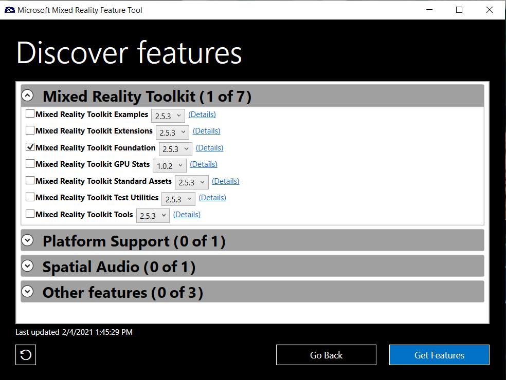

Check the box for **Mixed Reality Toolkit Foundation**, and click on the dropdown next to it to select **MRTK 2.7.0**, then click on **Get features** button to download the selected packages.

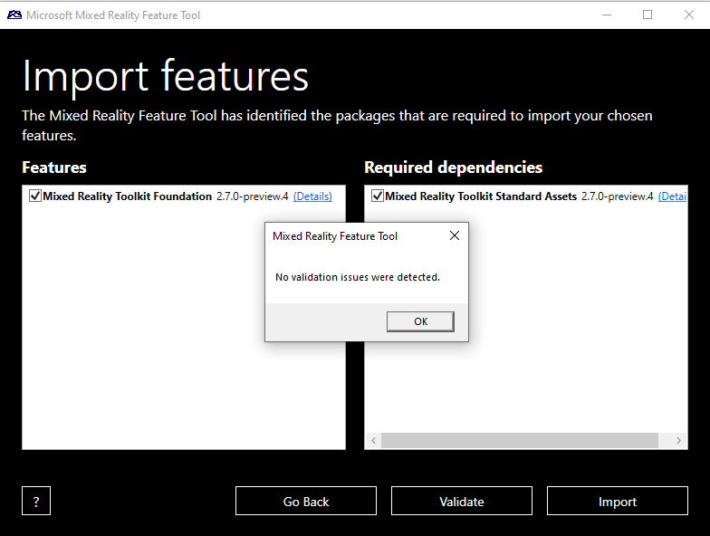

Next click on the **Validate** button to validate the selected package, you will get a popup with message **No validation issues were detected** click on **OK** to close the popup and click on **Import** button.

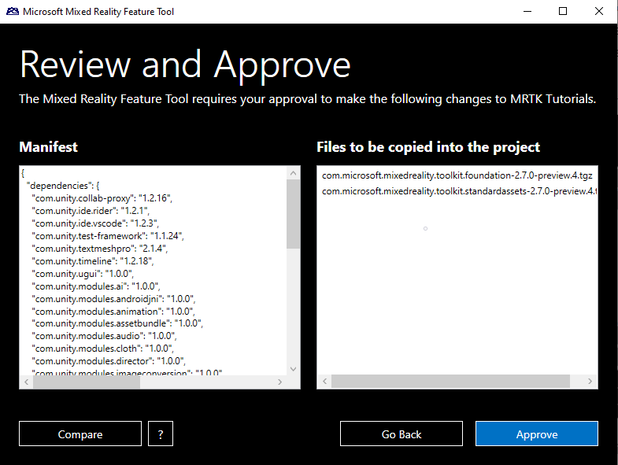

Click on **Approve** Button to add the **Mixed Reality Toolkit** into the project.

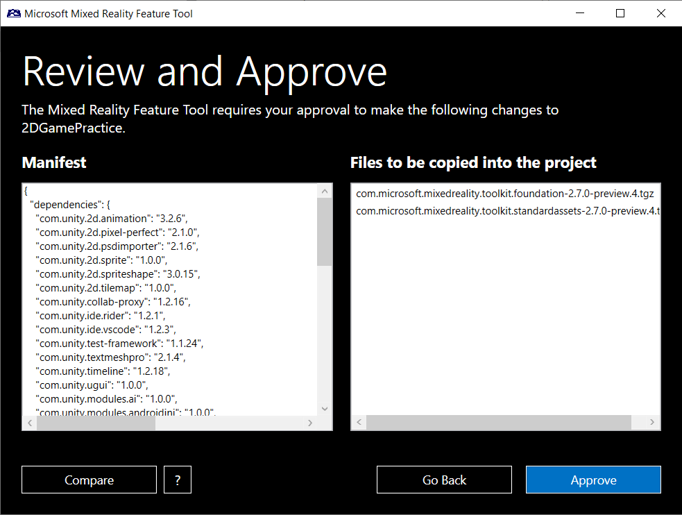

## Configuring the Unity project

After Unity has finished importing the package from the previous section, the MRTK Project Configurator window should appear. If it doesn't, you can manually open it by going to **Mixed Reality** > **Toolkit** > **Utilities** > **Configure Project for MRTK**:

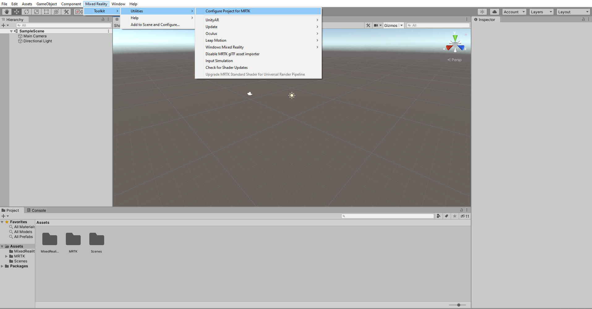

Click on **Built-in Unity Plugin(non-OpenXR)** to Enable XR Plugin Management and add its required packages into your project.

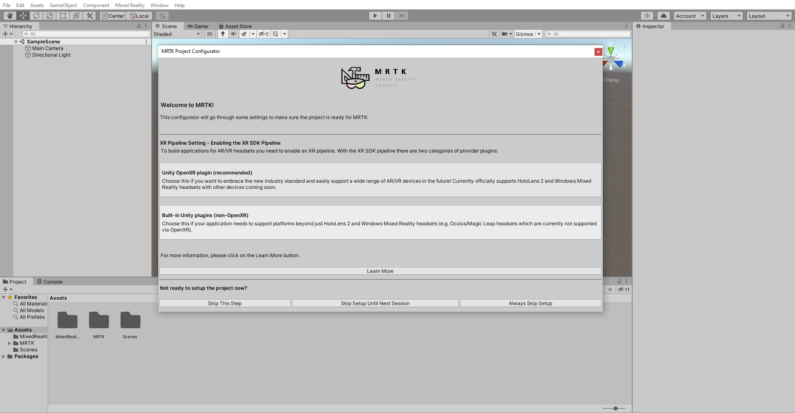

> [!NOTE]
> The above screenshot is from Unity 2020, if you using Unity 2019 please select **XR SDK/XR Management**

This will import required unity packages for XR Plugin Management, once done click on **Show Settings** in MRTK project Configurator.

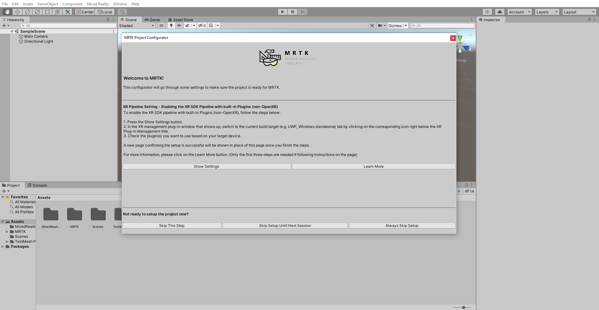

This opens **Project Settings window**, In the Project Settings window under **XR Plug-in Management** Ensure that you are in Universal Windows Platform settings also Ensure **Initialize XR on Startup** is checked, and check **Windows Mixed Reality** checkbox.

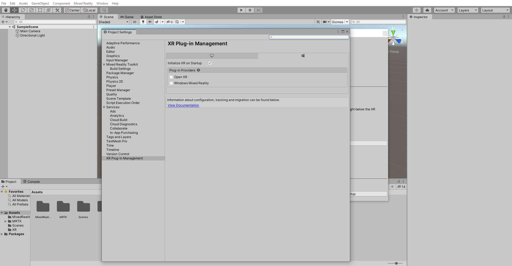

After Unity has finished importing the Windows Mixed Reality SDK, the MRTK Project Configurator window should appear again. If it doesn't, use the Unity menu to open it.

In the MRTK Project Configurator window, click on **next** then use the Audio spatializer dropdown to select the **MS HRTF Spatializer**, then click the **Apply** button to apply the setting:

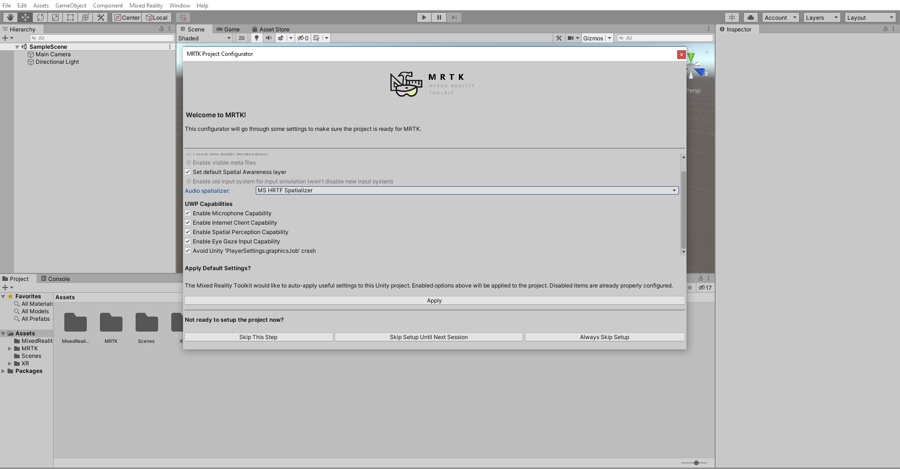

> [!TIP]
> Applying the MRTK Default Settings is optional but strongly recommended as it will help configure some recommended Unity settings:

> * Set Single Pass Instanced rendering path: Improves graphics performance by executing the render pipeline for both eyes in the same draw call. To learn more about this topic, you can refer to the [Single-Pass Instanced rendering](/windows/mixed-reality/mrtk-unity/performance/perf-getting-started#single-pass-instanced-rendering) section of MRTK's [Performance](/windows/mixed-reality/mrtk-unity/performance/perf-getting-started#single-pass-instanced-rendering) documentation.
> * Set default Spatial Awareness layer: Creates a Unity Layer named Spatial Awareness and configures MRTK to use this layer for the spatial awareness mesh. To learn more about Unity Layers, you can refer to Unity's <a href="https://docs.unity3d.com/Manual/Layers.html" target="_blank">Customizing Your Workspace</a> documentation.

> [!TIP]
> Setting the Audio spatializer property is optional but may improve the audio experience in your project. If you set it to MS HRTF Spatializer, this spatializer plugin will be used when Unity's AudioSource.spatialize property is enabled. To learn more about this topic, you can refer to the  <a href="//windows/mixed-reality/develop/unity/tutorials/unity-spatial-audio-ch1" target="_blank"> Spatial audio tutorials</a>.

Click on **Next** then click on **Done** in the MRTK Project Configurator window to finish the Unity project configuration for XRSDK.

### Configure additional project settings

In the Unity menu, select **Edit** > **Project Settings...** to open the Project Settings window:

In the Project Settings window, select **XR Plug-in Management** > **Windows Mixed Reality** > **Runtime Settings**, then use the **Depth Buffer Format** dropdown to select **16-bit depth**:

> [!TIP]
> Reducing the Depth Format to 16-bit is optional but my help improve graphics performance in your project. To learn more about this topic, you can refer to the <a href="/windows/mixed-reality/mrtk-unity/performance/perf-getting-started#single-pass-instanced-rendering" target="_blank">Depth buffer sharing (HoloLens)</a> section of MRTK's Performance documentation.

In the Project Settings window, select **Player** > **Publishing Settings**, then in the **Package name** field, enter a suitable name, for example, _MRTKTutorials-GettingStarted_:

> [!NOTE]
> The 'Package name' is the unique identifier for the app. You should change this identifier before deploying the app to avoid overwriting previously installed apps.

> [!TIP]
> The 'Product Name' is the name displayed in the HoloLens Start menu. To make the app easier to locate during development, add an underscore in front of the name to sort it to the top.

# [Legacy WSA](#tab/wsa)

Once **MixedRealityFeatureTool** is opened, click on **Start** to get started with Mixed Reality Feature Tool.

The first step is to point the Mixed Reality Feature Tool to your **Project path** using the **ellipsis** button, click on the Three dots ellipsis button next to the Project path and browse to your project folder in the explorer for example _D:\MixedRealityLearning\MRTK Tutorials_.

When you have located your project's folder, click the Open button to return to the Mixed Reality Feature Tool. Then click on **Discover Features**.

> [!NOTE]
> The dialog that's displayed when browsing for the Unity project folder contains '_' as the file name. There must be a value for the file name to enable the folder to be selected.

> [!Important]
> The Mixed Reality Feature Tool performs validation to ensure that it has been directed to a Unity project folder. The folder must contain Assets, Packages and Project Settings folders.

Features are grouped by category to make things easier to find, click on **Mixed Reality Toolkit** dropdown to find packages relating to the Mixed Reality Toolkit.

check the **Mixed Reality Toolkit Foundation**, and click on the dropdown next to it to select **MRTK 2.7.0**, then click on **Get features** button to download the selected packages.

Next click on the **Validate** button to validate the selected package, you will get a popup with message **No validation issues were detected** click on **OK** to close the popup and click on **Import** button.

Click on **Approve** Button to add the **Mixed Reality Toolkit** into the project.

## Configuring the Unity project

After Unity has finished importing the package from the previous section, the MRTK Project Configurator window should appear. If it doesn't, you can manually open it by going to **Mixed Reality** > **Toolkit** > **Utilities** > **Configure Project for MRTK**:

Click on **Legacy XR** to enable Legacy XR and to add its required packages  into your project.

Click on next button to enable XR pipeline settings for Legacy XR.

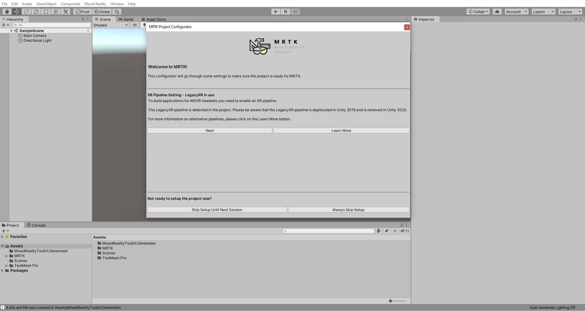

In the MRTK Project Configurator window, ensure all options are checked and also use the **Audio spatializer** dropdown to select the **MS HRTF Spatializer**, then click the **Apply** button to apply the setting:

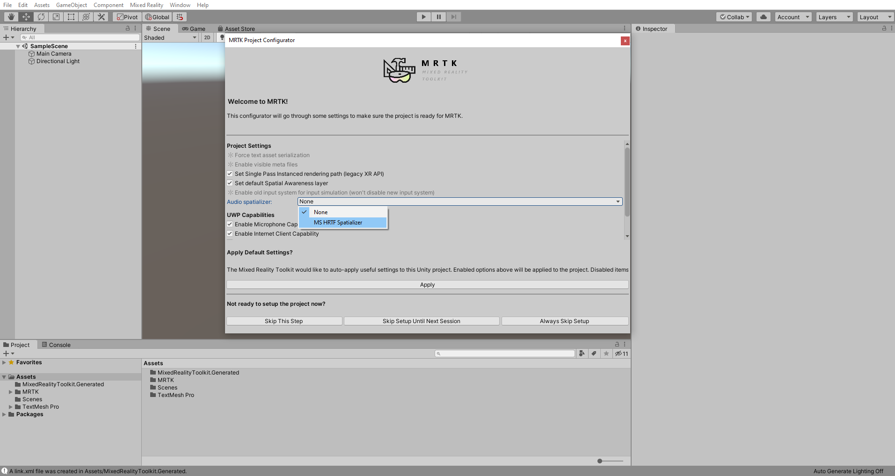

> [!TIP]
> Applying the MRTK Default Settings is optional but strongly recommended as it will help configure some recommended Unity settings:

> * Set Single Pass Instanced rendering path: Improves graphics performance by executing the render pipeline for both eyes in the same draw call. To learn more about this topic, you can refer to the [Single-Pass Instanced rendering](/windows/mixed-reality/mrtk-unity/performance/perf-getting-started#single-pass-instanced-rendering) section of MRTK's [Performance](/windows/mixed-reality/mrtk-unity/performance/perf-getting-started#single-pass-instanced-rendering) documentation.
> * Set default Spatial Awareness layer: Creates a Unity Layer named Spatial Awareness and configures MRTK to use this layer for the spatial awareness mesh. To learn more about Unity Layers, you can refer to Unity's <a href="https://docs.unity3d.com/Manual/Layers.html" target="_blank">Customizing Your Workspace</a> documentation.

> [!TIP]
> Setting the Audio spatializer property is optional but may improve the audio experience in your project. If you set it to MS HRTF Spatializer, this spatializer plugin will be used when Unity's AudioSource.spatialize property is enabled. To learn more about this topic, you can refer to the  <a href="//windows/mixed-reality/develop/unity/tutorials/unity-spatial-audio-ch1" target="_blank"> Spatial audio tutorials</a>.

Click on **Next** then click on**Done** button in MRTK Project Configurator window to finish the Unity project configuration for Legacy XR.

### Configure additional project settings

In the Unity menu, select **Edit** > **Project Settings...** to open the Project Settings window:

In the Project Settings window, select **Player** > **XR Settings**, then use the **Depth Format** dropdown to select **16-bit depth**:

> [!TIP]
> Reducing the Depth Format to 16-bit is optional but my help improve graphics performance in your project. To learn more about this topic, you can refer to the <a href="/windows/mixed-reality/mrtk-unity/performance/perf-getting-started#single-pass-instanced-rendering" target="_blank">Depth buffer sharing (HoloLens)</a> section of MRTK's Performance documentation.

In the Project Settings window, select **Player** > **Publishing Settings**, then in the **Package name** field, enter a suitable name, for example, _MRTKTutorials-GettingStarted_:

> [!NOTE]
> The 'Package name' is the unique identifier for the app. You should change this identifier before deploying the app to avoid overwriting previously installed apps.

> [!TIP]
> The 'Product Name' is the name displayed in the HoloLens Start menu. To make the app easier to locate during development, add an underscore in front of the name to sort it to the top.