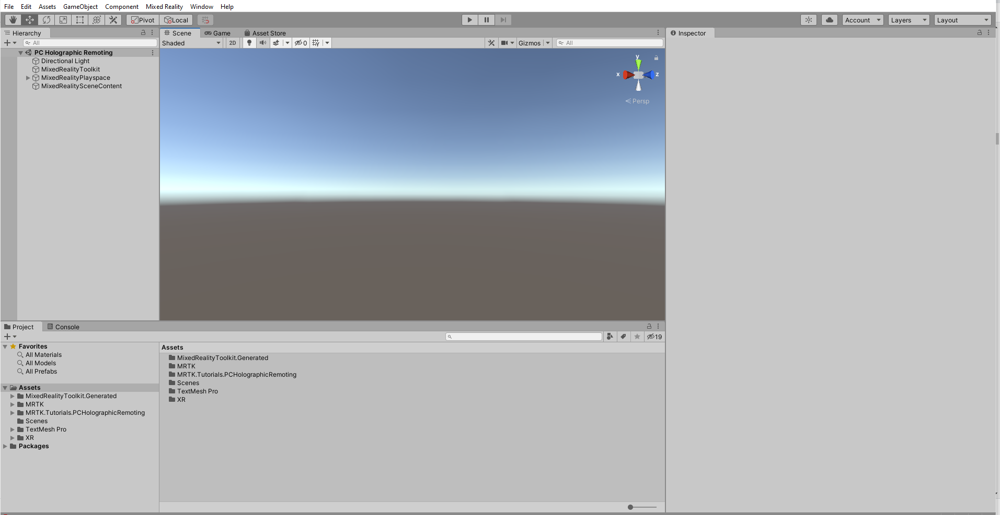

# [Unity 2020 + OpenXR](#tab/openxr)

Download and **import** the [MRTK.Tutorials.PCHolographicRemoting.unitypackage](https://github.com/microsoft/MixedRealityLearning/releases/download/pc-holographic-remoting-v2.4.1/MRTK.Tutorials.PCHolographicRemoting.OpenXR.unitypackage).

> [!TIP]
> For a reminder on how to import a Unity custom package, you can refer to the [Importing the Mixed Reality Toolkit](/learn/paths/beginner-hololens-2-tutorials/#importing-the-tutorial-assets) instructions.

After importing the tutorial assets, your Project window should look similar to this:

# [Legacy WSA](#tab/wsa)

Download and **import** the [MRTK.Tutorials.PCHolographicRemoting.unitypackage](https://github.com/microsoft/MixedRealityLearning/releases/download/pc-holographic-remoting-v2.4.1/MRTK.Tutorials.PCHolographicRemoting.LegacyWSA.unitypackage).

> [!TIP]
> For a reminder on how to import a Unity custom package, you can refer to the [Importing the Mixed Reality Toolkit](/learn/paths/beginner-hololens-2-tutorials/#importing-the-tutorial-assets) instructions.

After importing the tutorial assets, your Project window should look similar to this:

