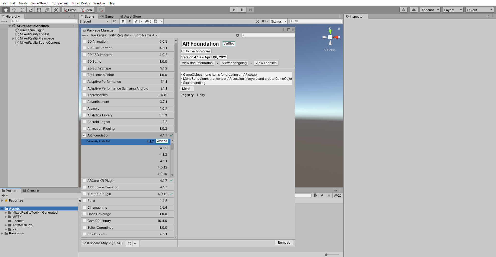
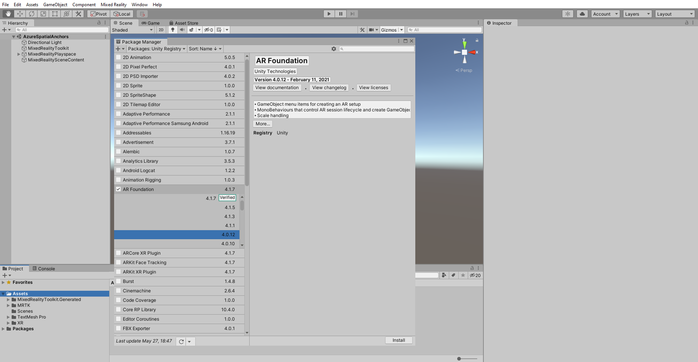
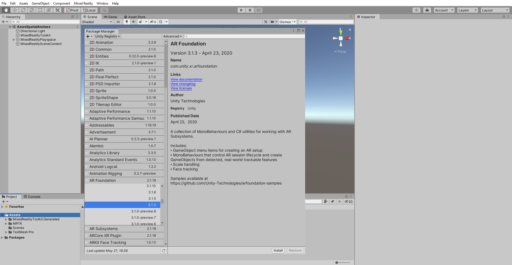
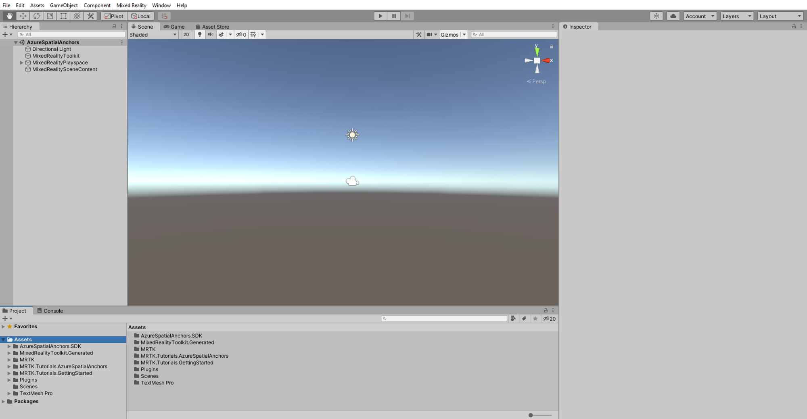

# [Unity 2020 + OpenXR](#tab/openxr)

In the Unity menu, select **Window** > **Package Manager** to open the Package Manager window, then verify that **AR Foundation** > **4.1.7** version is installed.

## Importing the tutorial assets

Add AzurespatialAnchors SDK V2.10 to your project, to add the packages please follow this [tutorial](/azure/spatial-anchors/how-tos/setup-unity-project?tabs=UPMPackage)

Download and **import** the following Unity custom packages **in the order they are listed**:

* [MRTK.HoloLens2.Unity.Tutorials.Assets.GettingStarted.2.4.0.unitypackage](https://github.com/microsoft/MixedRealityLearning/releases/download/getting-started-v2.4.0/MRTK.HoloLens2.Unity.Tutorials.Assets.GettingStarted.2.4.0.unitypackage)
* [MRTK.HoloLens2.Unity.Tutorials.Assets.AzureSpatialAnchors.XRplugginManagement.2.5.3.unitypackage](https://github.com/microsoft/MixedRealityLearning/releases/download/azure-spatial-anchors-v2.5.3.1/MRTK.HoloLens2.Unity.Tutorials.Assets.AzureSpatialAnchors.XRplugginManagement.2.5.3.unitypackage)

After you have imported the tutorial assets your Project window should look similar to this:

> [!TIP]
> For a reminder on how to import a Unity custom package, you can refer to the [Importing the tutorial assets](../mr-learning-base-04.md#importing-the-tutorial-assets) instructions.

# [Unity 2020 + Windows XR Plugin](#tab/winxr)

In the Unity menu, select **Window** > **Package Manager** to open the Package Manager window, then select **AR Foundation > 4.0.12** version and click the **Install** button to install the package:

## Importing the tutorial assets

Add AzurespatialAnchors SDK V2.10 to your project, to add the packages please follow this [tutorial](/azure/spatial-anchors/how-tos/setup-unity-project?tabs=UPMPackage)

Download and **import** the following Unity custom packages **in the order they are listed**:

* [MRTK.HoloLens2.Unity.Tutorials.Assets.GettingStarted.2.4.0.unitypackage](https://github.com/microsoft/MixedRealityLearning/releases/download/getting-started-v2.4.0/MRTK.HoloLens2.Unity.Tutorials.Assets.GettingStarted.2.4.0.unitypackage)
* [MRTK.HoloLens2.Unity.Tutorials.Assets.AzureSpatialAnchors.XRplugginManagement.2.5.3.unitypackage](https://github.com/microsoft/MixedRealityLearning/releases/download/azure-spatial-anchors-v2.5.3.1/MRTK.HoloLens2.Unity.Tutorials.Assets.AzureSpatialAnchors.XRplugginManagement.2.5.3.unitypackage)

After you have imported the tutorial assets your Project window should look similar to this:

> [!TIP]
> For a reminder on how to import a Unity custom package, you can refer to the [Importing the tutorial assets](../mr-learning-base-04.md#importing-the-tutorial-assets) instructions.

# [Legacy WSA](#tab/wsa)

In the Unity menu, select **Window** > **Package Manager** to open the Package Manager window, then select **AR Foundation > 3.1.3** version and click the **Install** button to install the package:

## Importing the tutorial assets

Add AzurespatialAnchors SDK V2.7.2 to your project, to add the packages please follow this [tutorial](/azure/spatial-anchors/how-tos/setup-unity-project?tabs=UPMPackage)

Download and **import** the following Unity custom packages **in the order they are listed**:

* [MRTK.HoloLens2.Unity.Tutorials.Assets.GettingStarted.2.4.0.unitypackage](https://github.com/microsoft/MixedRealityLearning/releases/download/getting-started-v2.4.0/MRTK.HoloLens2.Unity.Tutorials.Assets.GettingStarted.2.4.0.unitypackage)
* [MRTK.HoloLens2.Unity.Tutorials.Assets.AzureSpatialAnchors.LegacyWSA.2.5.3.unitypackage](https://github.com/microsoft/MixedRealityLearning/releases/download/azure-spatial-anchors-v2.5.3.1/MRTK.HoloLens2.Unity.Tutorials.Assets.AzureSpatialAnchors.LegacyWSA.2.5.3.unitypackage)

After you have imported the tutorial assets your Project window should look similar to this:

> [!NOTE]
> If you see any CS0618 warnings regarding 'WorldAnchor.SetNativeSpatialAnchorPtr(IntPtr)' is obsolete, you can ignore these warnings.

> [!TIP]
> For a reminder on how to import a Unity custom package, you can refer to the [Importing the tutorial assets](../mr-learning-base-04.md#importing-the-tutorial-assets) instructions.
