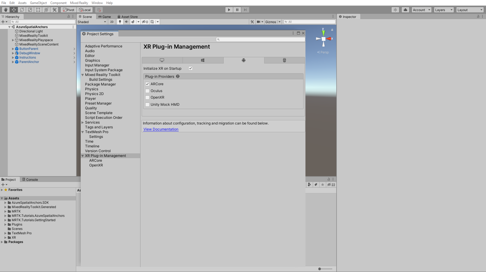
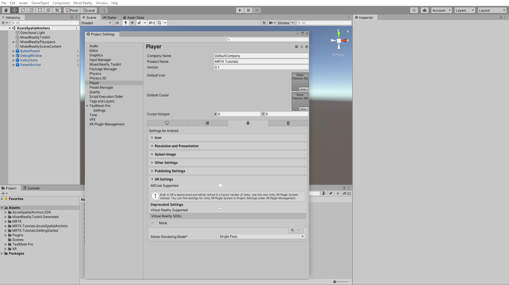

# [Unity 2020 + Windows XR Plugin](#tab/winxr)

In the Unity menu, select **Edit** > **Project Settings...** > **XR Plug-in management**, check the ARcore checkbox.

Close the Player Settings window and open the Build Settings window again.

# [Unity 2020 + OpenXR](#tab/openxr)

> [!NOTE]
> Android/IOS Build for OpenXR is not supported at this time.

# [Legacy WSA](#tab/wsa)

In the Unity menu, select **Edit** > **Project Settings...** >**Player**> **XR Setting**, make sure you are in **Android** platform and check the **Virtual Reality Supported** checkbox then click the + icon, and select None:

Close the Player Settings window and open the Build Settings window again.