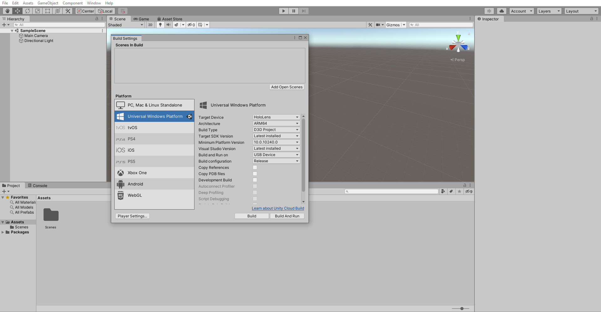
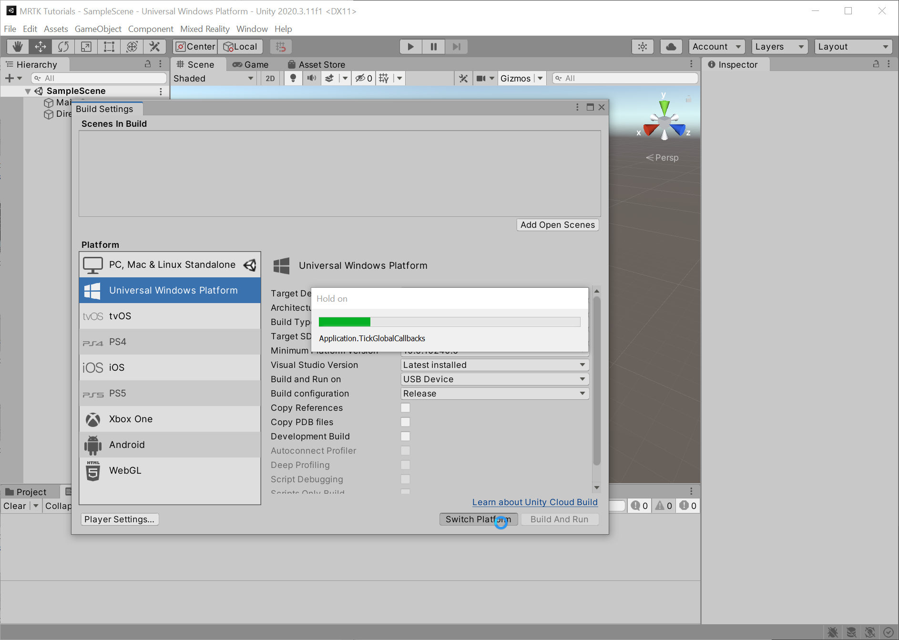
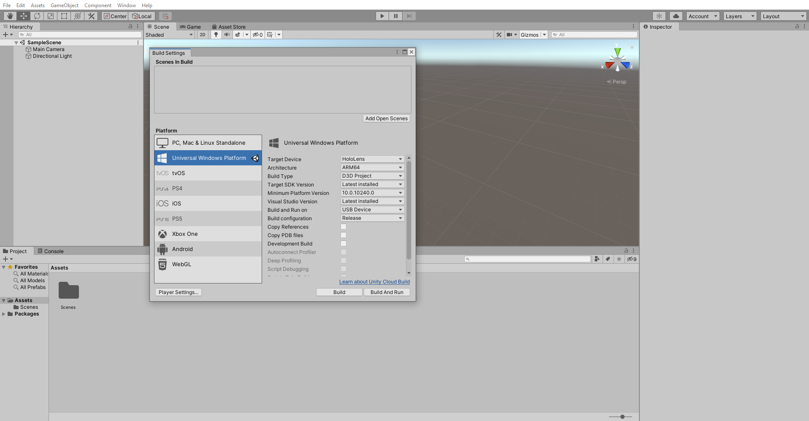

# [Unity 2019/2020 + Windows XR Plugin](#tab/winxr)

In the Unity menu, select **File** > **Build Settings...** to open the Build Settings window:

In the Build Settings window, select **Universal Windows Platform** and click the **Switch Platform** button:

Wait for Unity to finish switching the platform:

When Unity has finished switching the platform, click the **x** icon to close the Build Settings window:

# [Unity 2020 + OpenXR](#tab/openxr)

In the Unity menu, select **File** > **Build Settings...** to open the Build Settings window:

In the Build Settings window, select **Universal Windows Platform** and:

1. Set **Target device** to **HoloLens**
2. Set **Architecture** to **ARM 64**
3. Set **Build Type** to **D3D Project**
4. Set **Target SDK Version** to **Latest Installed**
5. Set **Minimum Platform Version** to **10.0.1024.0**
6. Set **Visual Studio Version** to **Latest installed**
7. Set **Build and Run on** to **USB Device**
8. Set **Build configuration** to **Release** because there are known performance issues with Debug
9. Click the Switch Platform button

Wait for Unity to finish switching the platform:

When Unity has finished switching the platform, click the  **x** icon to close the Build Settings window:

# [Legacy WSA](#tab/wsa)

In the Unity menu, select **File** > **Build Settings...** to open the Build Settings window:

In the Build Settings window, select **Universal Windows Platform** and click the **Switch Platform** button:

Wait for Unity to finish switching the platform:

When Unity has finished switching the platform, click the red **x** icon to close the Build Settings window:

