# HoloLens (1st gen) and Azure 302b: Custom vision

<br>

>[!NOTE]
>The Mixed Reality Academy tutorials were designed with HoloLens (1st gen) and Mixed Reality Immersive Headsets in mind.  As such, we feel it is important to leave these tutorials in place for developers who are still looking for guidance in developing for those devices.  These tutorials will **_not_** be updated with the latest toolsets or interactions being used for HoloLens 2.  They will be maintained to continue working on the supported devices. There will be a new series of tutorials that will be posted in the future that will demonstrate how to develop for HoloLens 2.  This notice will be updated with a link to those tutorials when they are posted.

<br>


In this course, you will learn how to recognize custom visual content within a provided image, using Azure Custom Vision capabilities in a mixed reality application.

This service will allow you to train a machine learning model using object images. You will then use the trained model to recognize similar objects, as provided by the camera capture of Microsoft HoloLens or a camera connected to your PC for immersive (VR) headsets.

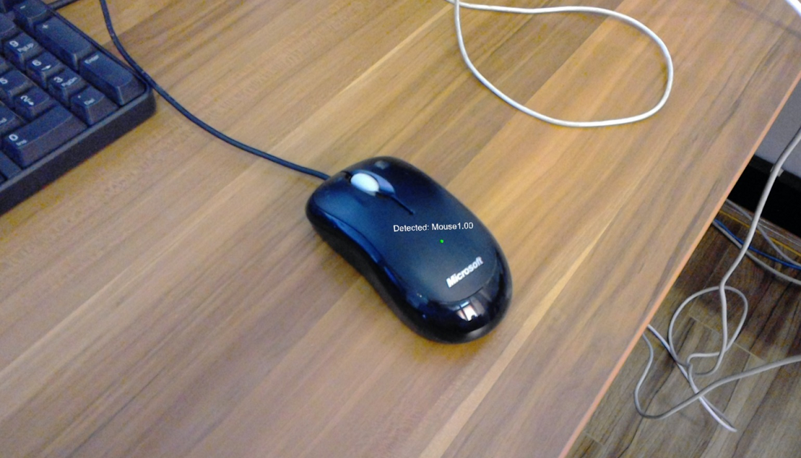

Azure Custom Vision is a Microsoft Cognitive Service which allows developers to build custom image classifiers. These classifiers can then be used with new images to recognize, or classify, objects within that new image. The Service provides a simple, easy to use, online portal to streamline the process. For more information, visit the [Azure Custom Vision Service page](/azure/cognitive-services/custom-vision-service/home).

Upon completion of this course, you will have a mixed reality application which will be able to work in two modes:

-   **Analysis Mode**: setting up the Custom Vision Service manually by uploading images, creating tags, and training the Service to recognize different objects (in this case mouse and keyboard). You will then create a HoloLens app that will capture images using the camera, and try to recognize those objects in the real world.

-   **Training Mode**: you will implement code that will enable a "Training Mode" in your app. The training mode will allow you to capture images using the HoloLens' camera, upload the captured images to the Service, and train the custom vision model.

This course will teach you how to get the results from the Custom Vision Service into a Unity-based sample application. It will be up to you to apply these concepts to a custom application you might be building.

## Device support

<table>
<tr>
<th>Course</th><th style="width:150px"> <a href="/hololens/hololens1-hardware">HoloLens</a></th><th style="width:150px"> <a href="/windows/mixed-reality/enthusiast-guide/immersive-headset-hardware-details">Immersive headsets</a></th>
</tr><tr>
<td> MR and Azure 302b: Custom vision</td><td style="text-align: center;"> ✔️</td><td style="text-align: center;"> ✔️</td>
</tr>
</table>

> [!NOTE]
> While this course primarily focuses on HoloLens, you can also apply what you learn in this course to Windows Mixed Reality immersive (VR) headsets. Because immersive (VR) headsets do not have accessible cameras, you will need an external camera connected to your PC. As you follow along with the course, you will see notes on any changes you might need to employ to support immersive (VR) headsets.

## Prerequisites

> [!NOTE]
> This tutorial is designed for developers who have basic experience with Unity and C#. Please also be aware that the prerequisites and written instructions within this document represent what has been tested and verified at the time of writing (July 2018). You are free to use the latest software, as listed within the [install the tools](../../install-the-tools.md) article, though it should not be assumed that the information in this course will perfectly match what you will find in newer software than what is listed below.

We recommend the following hardware and software for this course:

- A development PC, [compatible with Windows Mixed Reality](https://support.microsoft.com/help/4039260/windows-10-mixed-reality-pc-hardware-guidelines) for immersive (VR) headset development
- [Windows 10 Fall Creators Update (or later) with Developer mode enabled](../../install-the-tools.md#installation-checklist)
- [The latest Windows 10 SDK](../../install-the-tools.md#installation-checklist)
- [Unity 2017.4](../../install-the-tools.md#installation-checklist)
- [Visual Studio 2017](../../install-the-tools.md#installation-checklist)
- A [Windows Mixed Reality immersive (VR) headset](/windows/mixed-reality/enthusiast-guide/immersive-headset-hardware-details) or [Microsoft HoloLens](/hololens/hololens1-hardware) with Developer mode enabled
- A camera connected to your PC (for immersive headset development)
- Internet access for Azure setup and Custom Vision API retrieval
- A series of at least five (5) images (ten (10) recommended) for each object that you would like the Custom Vision Service to recognize. If you wish, you can use [the images already provided with this course (a computer mouse and a keyboard) ](https://github.com/Microsoft/HolographicAcademy/raw/Azure-MixedReality-Labs/Azure%20Mixed%20Reality%20Labs/MR%20and%20Azure%20302b%20-%20Custom%20vision/ComputerVision_Images.zip).

## Before you start

1.	To avoid encountering issues building this project, it is strongly suggested that you create the project mentioned in this tutorial in a root or near-root folder (long folder paths can cause issues at build-time).
2.	Set up and test your HoloLens. If you need support setting up your HoloLens, [make sure to visit the HoloLens setup article](/hololens/hololens-setup). 
3.	It is a good idea to perform Calibration and Sensor Tuning when beginning developing a new HoloLens app (sometimes it can help to perform those tasks for each user). 

For help on Calibration, please follow this [link to the HoloLens Calibration article](/hololens/hololens-calibration#hololens-2).

For help on Sensor Tuning, please follow this [link to the HoloLens Sensor Tuning article](/hololens/hololens-updates).

## Chapter 1 - The Custom Vision Service Portal

To use the *Custom Vision Service* in Azure, you will need to configure an instance of the Service to be made available to your application.

1.  First, [navigate to the *Custom Vision Service* main page](https://azure.microsoft.com/services/cognitive-services/custom-vision-service/).

2.  Click on the **Get Started** button.

    

3.  Sign in to the *Custom Vision Service* Portal.

    

    > [!NOTE]
    > If you do not already have an Azure account, you will need to create one. If you are following this tutorial in a classroom or lab situation, ask your instructor or one of the proctors for help setting up your new account.

4.  Once you are logged in for the first time, you will be prompted with the *Terms of Service* panel. Click on the checkbox to agree to the terms. Then click on **I agree**.

    

5.  Having agreed to the Terms, you will be navigated to the *Projects* section of the Portal. Click on **New Project**.

    

6.  A tab will appear on the right-hand side, which will prompt you to specify some fields for the project.

    1.  Insert a *Name* for your project.

    2.  Insert a *Description* for your project (*optional*).

    3.  Choose a *Resource Group* or create a new one. A resource group provides a way to monitor, control access, provision and manage billing for a collection of Azure assets. It is recommended to keep all the Azure Services associated with a single project (e.g. such as these courses) under a common resource group).

    4. Set the *Project Types* to **Classification**
    
    5. Set the *Domains* as **General**.

        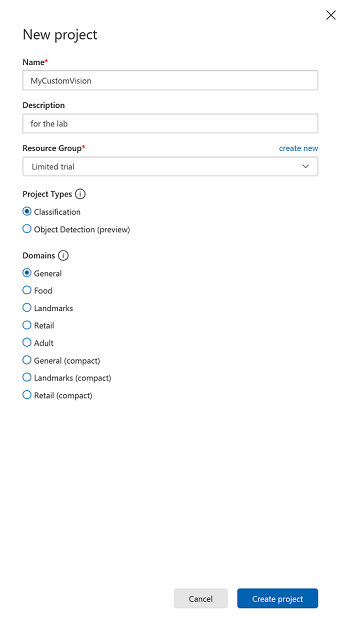

        > If you wish to read more about Azure Resource Groups, please [visit the resource group article](/azure/azure-resource-manager/resource-group-portal).

7.  Once you are finished, click on **Create project**, you will be redirected to the Custom Vision Service, project page.

## Chapter 2 - Training your Custom Vision project

Once in the Custom Vision portal, your primary objective is to train your project to recognize specific objects in images. You need at least five (5) images, though ten (10) is preferred, for each object that you would like your application to recognize. [You can use the images provided with this course (a computer mouse and a keyboard)](https://github.com/Microsoft/HolographicAcademy/raw/Azure-MixedReality-Labs/Azure%20Mixed%20Reality%20Labs/MR%20and%20Azure%20302b%20-%20Custom%20vision/ComputerVision_Images.zip). 

To train your Custom Vision Service project:

1.  Click on the **+** button next to **Tags.**

    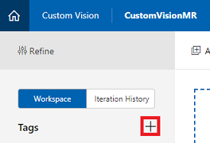

2.  Add the **name** of the object you would like to recognize. Click on **Save**.

    

3.  You will notice your **Tag** has been added (you may need to reload your page for it to appear). Click the checkbox alongside your new tag, if it is not already checked.

    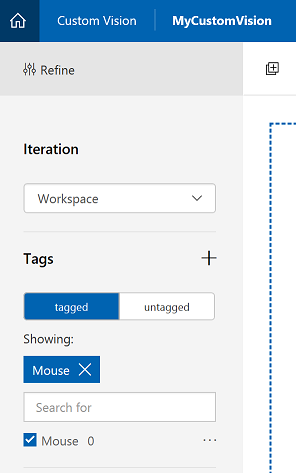

4.  Click on **Add Images** in the center of the page.

    

5.  Click on **Browse local files**, and search, then select, the images you would like to upload, with the minimum being five (5). Remember all of these images should contain the object which you are training.

    > [!NOTE]
    >  You can select several images at a time, to upload.

6.  Once you can see the images in the tab, select the appropriate tag in the **My Tags** box.

    

7.  Click on **Upload files**. The files will begin uploading. Once you have confirmation of the upload, click **Done**.

    

8.  Repeat the same process to create a new **Tag** named **Keyboard** and upload the appropriate photos for it. Make sure to **uncheck** *Mouse* once you have created the new tags, so to show the *Add images* window.

9.  Once you have both Tags set up, click on **Train**, and the first training iteration will start building.

    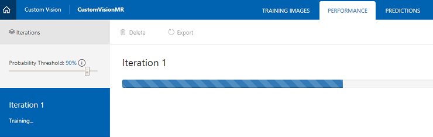

10. Once it's built, you'll be able to see two buttons called **Make default** and **Prediction URL**. Click on **Make default** first, then click on **Prediction URL**.

    

    > [!NOTE] 
    > The endpoint URL which is provided from this, is set to whichever *Iteration* has been marked as default. As such, if you later make a new *Iteration* and update it as default, you will not need to change your code.

11. Once you have clicked on *Prediction URL*, open *Notepad*, and copy and paste the **URL** and the **Prediction-Key**, so that you can retrieve it when you need it later in the code.

    

12. Click on the **Cog** at the top right of the screen.

    

13. Copy the **Training Key** and paste it into a *Notepad*, for later use.

    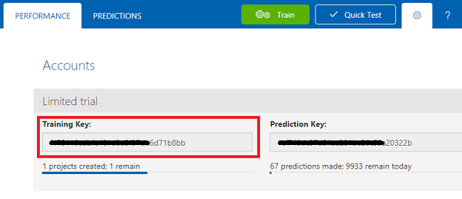

14. Also copy your **Project Id**, and also paste it into your *Notepad* file, for later use.

    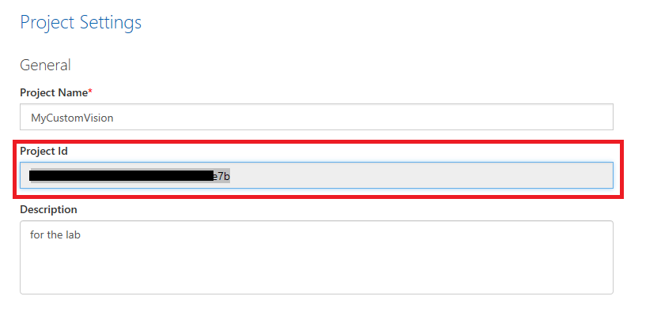

## Chapter 3 - Set up the Unity project

The following is a typical set up for developing with mixed reality, and as such, is a good template for other projects.

1.  Open *Unity* and click **New**.

    

2.  You will now need to provide a Unity project name. Insert **AzureCustomVision.** Make sure the project template is set to **3D**. Set the **Location** to somewhere appropriate for you (remember, closer to root directories is better). Then, click **Create project**.

    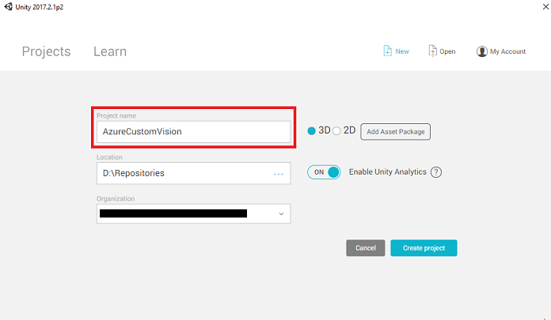

3.  With Unity open, it is worth checking the default **Script Editor** is set to **Visual Studio**. Go to **Edit* > *Preferences** and then from the new window, navigate to **External Tools**. Change **External Script Editor** to **Visual Studio 2017**. Close the **Preferences** window.

    

4.  Next, go to **File > Build Settings** and select **Universal Windows Platform**, then click on the **Switch Platform** button to apply your selection.

    

5.  While still in **File > Build Settings** and make sure that:

    1.  **Target Device** is set to **HoloLens**

        > For the immersive headsets, set **Target Device** to *Any Device*.
        
    2.  **Build Type** is set to **D3D**
    3.  **SDK** is set to **Latest installed**
    4.  **Visual Studio Version** is set to **Latest installed**
    5.  **Build and Run** is set to **Local Machine**
    6.  Save the scene and add it to the build. 

        1. Do this by selecting **Add Open Scenes**. A save window will appear.

            

        2. Create a new folder for this, and any future, scene, then select the **New folder** button, to create a new folder, name it **Scenes**.

            

        3. Open your newly created **Scenes** folder, and then in the *File name:* text field, type **CustomVisionScene**, then click on **Save**.

            

            > Be aware, you must save your Unity scenes within the *Assets* folder, as they must be associated with the Unity project. Creating the scenes folder (and other similar folders) is a typical way of structuring a Unity project.
            
    7.  The remaining settings, in *Build Settings*, should be left as default for now.

        

6.  In the *Build Settings* window, click on the **Player Settings** button, this will open the related panel in the space where the *Inspector* is located.

7. In this panel, a few settings need to be verified:

    1.  In the **Other Settings** tab:

        1.  **Scripting Runtime Version** should be **Experimental (.NET 4.6 Equivalent)**, which will trigger a need to restart the Editor.

        2. **Scripting Backend** should be **.NET**

        3. **API Compatibility Level** should be **.NET 4.6**

        

    2.  Within the **Publishing Settings** tab, under **Capabilities**, check:

        1. **InternetClient**

        2.  **Webcam**

        3. **Microphone**

        

    3.  Further down the panel, in **XR Settings** (found below **Publish Settings**), tick **Virtual Reality Supported**, make sure the **Windows Mixed Reality SDK** is added.

    

8.  Back in *Build Settings* *Unity C\# Projects* is no longer greyed out; tick the checkbox next to this.

9.  Close the Build Settings window.

10.  Save your Scene and project (**FILE > SAVE SCENE / FILE > SAVE PROJECT**).


## Chapter 4 - Importing the Newtonsoft DLL in Unity

> [!IMPORTANT]
> If you wish to skip the *Unity Set up* component of this course, and continue straight into code, feel free to download this [Azure-MR-302b.unitypackage](https://github.com/Microsoft/HolographicAcademy/raw/Azure-MixedReality-Labs/Azure%20Mixed%20Reality%20Labs/MR%20and%20Azure%20302b%20-%20Custom%20vision/Azure-MR-302b.unitypackage), import it into your project as a [**Custom Package**](https://docs.unity3d.com/Manual/AssetPackages.html), and then continue from [Chapter 6](#chapter-6---create-the-customvisionanalyser-class).

This course requires the use of the **Newtonsoft** library, which you can add as a DLL to your assets. The package containing [this library can be downloaded from this Link](https://github.com/Microsoft/HolographicAcademy/raw/Azure-MixedReality-Labs/Azure%20Mixed%20Reality%20Labs/MR%20and%20Azure%20302b%20-%20Custom%20vision/NewtonsoftDLL.unitypackage).
To import the Newtonsoft library into your project, use the Unity Package which came with this course.

1.  Add the *.unitypackage* to Unity by using the **Assets* > *Import* *Package* > *Custom* *Package** menu option.

2.  In the **Import Unity Package** box that pops up, ensure everything under (and including) **Plugins** is selected.

    

3.  Click the **Import** button to add the items to your project.

4.  Go to the **Newtonsoft** folder under **Plugins** in the project view and select the *Newtonsoft.Json plugin*.

    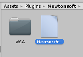

5.  With the *Newtonsoft.Json plugin* selected, ensure that **Any Platform** is **unchecked**, then ensure that **WSAPlayer** is also **unchecked**, then click **Apply**. This is just to confirm that the files are configured correctly.

    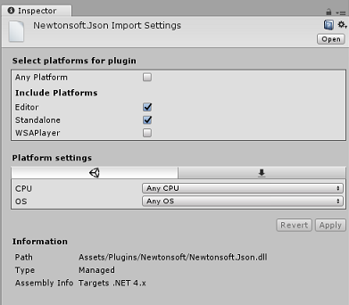

    > [!NOTE]
    > Marking these plugins configures them to only be used in the Unity Editor. There are a different set of them in the WSA folder which will be used after the project is exported from Unity.

6.  Next, you need to open the **WSA** folder, within the **Newtonsoft** folder. You will see a copy of the same file you just configured. Select the file, and then in the inspector, ensure that
    -   **Any Platform** is **unchecked** 
    -   **only** **WSAPlayer** is **checked**
    -   **Dont process** is **checked**

    

## Chapter 5 - Camera setup

1.  In the Hierarchy Panel, select the *Main Camera*.

2.  Once selected, you will be able to see all the components of the *Main Camera* in the *Inspector Panel*.

    1.  The *camera* object must be named **Main Camera** (note the spelling!)

    2.  The Main Camera **Tag** must be set to **MainCamera** (note the spelling!)

    3.  Make sure the **Transform Position** is set to **0, 0, 0**

    4.  Set **Clear Flags** to **Solid Color** (ignore this for immersive headset).

    5.  Set the **Background** Color of the camera Component to **Black, Alpha 0 (Hex Code: #00000000)** (ignore this for immersive headset).

    


## Chapter 6 - Create the CustomVisionAnalyser class.

At this point you are ready to write some code.

You will begin with the *CustomVisionAnalyser* class.

> [!NOTE]
> The calls to the **Custom Vision Service** made in the code shown below are made using the **Custom Vision REST API**. Through using this, you will see how to implement and make use of this API (useful for understanding how to implement something similar on your own). Be aware, that Microsoft offers a **Custom Vision Service SDK** that can also be used to make calls to the Service. For more information visit the [Custom Vision Service SDK](https://github.com/Microsoft/Cognitive-CustomVision-Windows/) article.

This class is responsible for:

-   Loading the latest image captured as an array of bytes.

-   Sending the byte array to your Azure *Custom Vision Service* instance for analysis.

-   Receiving the response as a JSON string.

-   Deserializing the response and passing the resulting *Prediction* to the *SceneOrganiser* class, which will take care of how the response should be displayed.

To create this class:

1.  Right-click in the *Asset Folder* located in the *Project Panel*, then click **Create > Folder**. Call the folder **Scripts**.

    

2.  Double-click on the folder just created, to open it.

3.  Right-click inside the folder, then click **Create** > **C\# Script**. Name the script *CustomVisionAnalyser*.

4.  Double-click on the new *CustomVisionAnalyser* script to open it with **Visual Studio**.

5.  Update the namespaces at the top of your file to match the following:

    ```csharp
    using System.Collections;
    using System.IO;
    using UnityEngine;
    using UnityEngine.Networking;
    using Newtonsoft.Json;
    ```

6.  In the *CustomVisionAnalyser* class, add the following variables:

    ```csharp
        /// <summary>
        /// Unique instance of this class
        /// </summary>
        public static CustomVisionAnalyser Instance;

        /// <summary>
        /// Insert your Prediction Key here
        /// </summary>
        private string predictionKey = "- Insert your key here -";

        /// <summary>
        /// Insert your prediction endpoint here
        /// </summary>
        private string predictionEndpoint = "Insert your prediction endpoint here";

        /// <summary>
        /// Byte array of the image to submit for analysis
        /// </summary>
        [HideInInspector] public byte[] imageBytes;
    ```

    > [!NOTE]
    > Make sure you insert your **Prediction Key** into the **predictionKey** variable and your **Prediction Endpoint** into the **predictionEndpoint** variable. You copied these to *Notepad* earlier in the course.

7.  Code for **Awake()** now needs to be added to initialize the Instance variable:

    ```csharp
        /// <summary>
        /// Initialises this class
        /// </summary>
        private void Awake()
        {
            // Allows this instance to behave like a singleton
            Instance = this;
        }
    ```

8.  Delete the methods **Start()** and **Update()**.

9.  Next, add the coroutine (with the static **GetImageAsByteArray()** method below it), which will obtain the results of the analysis of the image captured by the *ImageCapture* class.

    > [!NOTE]
    > In the **AnalyseImageCapture** coroutine, there is a call to the *SceneOrganiser* class that you are yet to create. Therefore, **leave those lines commented for now**.

    ```csharp    
        /// <summary>
        /// Call the Computer Vision Service to submit the image.
        /// </summary>
        public IEnumerator AnalyseLastImageCaptured(string imagePath)
        {
            WWWForm webForm = new WWWForm();
            using (UnityWebRequest unityWebRequest = UnityWebRequest.Post(predictionEndpoint, webForm))
            {
                // Gets a byte array out of the saved image
                imageBytes = GetImageAsByteArray(imagePath);

                unityWebRequest.SetRequestHeader("Content-Type", "application/octet-stream");
                unityWebRequest.SetRequestHeader("Prediction-Key", predictionKey);

                // The upload handler will help uploading the byte array with the request
                unityWebRequest.uploadHandler = new UploadHandlerRaw(imageBytes);
                unityWebRequest.uploadHandler.contentType = "application/octet-stream";

                // The download handler will help receiving the analysis from Azure
                unityWebRequest.downloadHandler = new DownloadHandlerBuffer();

                // Send the request
                yield return unityWebRequest.SendWebRequest();

                string jsonResponse = unityWebRequest.downloadHandler.text;

                // The response will be in JSON format, therefore it needs to be deserialized    
    
                // The following lines refers to a class that you will build in later Chapters
                // Wait until then to uncomment these lines

                //AnalysisObject analysisObject = new AnalysisObject();
                //analysisObject = JsonConvert.DeserializeObject<AnalysisObject>(jsonResponse);
                //SceneOrganiser.Instance.SetTagsToLastLabel(analysisObject);
            }
        }

        /// <summary>
        /// Returns the contents of the specified image file as a byte array.
        /// </summary>
        static byte[] GetImageAsByteArray(string imageFilePath)
        {
            FileStream fileStream = new FileStream(imageFilePath, FileMode.Open, FileAccess.Read);

            BinaryReader binaryReader = new BinaryReader(fileStream);

            return binaryReader.ReadBytes((int)fileStream.Length);
        }
    ```

10.  Be sure to save your changes in **Visual Studio** before returning to **Unity**.

## Chapter 7 - Create the CustomVisionObjects class

The class you will create now is the *CustomVisionObjects* class.

This script contains a number of objects used by other classes to serialize and deserialize the calls made to the *Custom Vision Service*.

> [!WARNING]
> It is important that you take note of the endpoint that the Custom Vision Service provides you, as the below JSON structure has been set up to work with [*Custom Vision Prediction v2.0*](https://southcentralus.dev.cognitive.microsoft.com/docs/services/450e4ba4d72542e889d93fd7b8e960de/operations/5a6264bc40d86a0ef8b2c290). If you have a different version, you may need to update the below structure.

To create this class:

1.  Right-click inside the **Scripts** folder, then click **Create** > **C\# Script**. Call the script *CustomVisionObjects*.

2.  Double-click on the new **CustomVisionObjects** script to open it with **Visual Studio**.

3.  Add the following namespaces to the top of the file:

    ```csharp
    using System;
    using System.Collections.Generic;
    using UnityEngine;
    using UnityEngine.Networking;
    ```

4.  Delete the **Start()** and **Update()** methods inside the *CustomVisionObjects* class; this class should now be empty.

5.  Add the following classes **outside** the *CustomVisionObjects* class. These objects are used by the *Newtonsoft* library to serialize and deserialize the response data:

    ```csharp
    // The objects contained in this script represent the deserialized version
    // of the objects used by this application 

    /// <summary>
    /// Web request object for image data
    /// </summary>
    class MultipartObject : IMultipartFormSection
    {
        public string sectionName { get; set; }

        public byte[] sectionData { get; set; }

        public string fileName { get; set; }

        public string contentType { get; set; }
    }

    /// <summary>
    /// JSON of all Tags existing within the project
    /// contains the list of Tags
    /// </summary> 
    public class Tags_RootObject
    {
        public List<TagOfProject> Tags { get; set; }
        public int TotalTaggedImages { get; set; }
        public int TotalUntaggedImages { get; set; }
    }

    public class TagOfProject
    {
        public string Id { get; set; }
        public string Name { get; set; }
        public string Description { get; set; }
        public int ImageCount { get; set; }
    }

    /// <summary>
    /// JSON of Tag to associate to an image
    /// Contains a list of hosting the tags,
    /// since multiple tags can be associated with one image
    /// </summary> 
    public class Tag_RootObject
    {
        public List<Tag> Tags { get; set; }
    }

    public class Tag
    {
        public string ImageId { get; set; }
        public string TagId { get; set; }
    }

    /// <summary>
    /// JSON of Images submitted
    /// Contains objects that host detailed information about one or more images
    /// </summary> 
    public class ImageRootObject
    {
        public bool IsBatchSuccessful { get; set; }
        public List<SubmittedImage> Images { get; set; }
    }

    public class SubmittedImage
    {
        public string SourceUrl { get; set; }
        public string Status { get; set; }
        public ImageObject Image { get; set; }
    }

    public class ImageObject
    {
        public string Id { get; set; }
        public DateTime Created { get; set; }
        public int Width { get; set; }
        public int Height { get; set; }
        public string ImageUri { get; set; }
        public string ThumbnailUri { get; set; }
    }

    /// <summary>
    /// JSON of Service Iteration
    /// </summary> 
    public class Iteration
    {
        public string Id { get; set; }
        public string Name { get; set; }
        public bool IsDefault { get; set; }
        public string Status { get; set; }
        public string Created { get; set; }
        public string LastModified { get; set; }
        public string TrainedAt { get; set; }
        public string ProjectId { get; set; }
        public bool Exportable { get; set; }
        public string DomainId { get; set; }
    }

    /// <summary>
    /// Predictions received by the Service after submitting an image for analysis
    /// </summary> 
    [Serializable]
    public class AnalysisObject
    {
        public List<Prediction> Predictions { get; set; }
    }

    [Serializable]
    public class Prediction
    {
        public string TagName { get; set; }
        public double Probability { get; set; }
    }
    ```

## Chapter 8 - Create the VoiceRecognizer class

This class will recognize the voice input from the user.

To create this class:

1.  Right-click inside the **Scripts** folder, then click **Create** > **C\# Script**. Call the script *VoiceRecognizer*.

2.  Double-click on the new **VoiceRecognizer** script to open it with **Visual Studio**.

3.  Add the following namespaces above the *VoiceRecognizer* class:

    ```csharp
    using System;
    using System.Collections.Generic;
    using System.Linq;
    using UnityEngine;
    using UnityEngine.Windows.Speech;
    ```

4.  Then add the following variables inside the *VoiceRecognizer* class, above the *Start()* method:

    ```csharp
        /// <summary>
        /// Allows this class to behave like a singleton
        /// </summary>
        public static VoiceRecognizer Instance;

        /// <summary>
        /// Recognizer class for voice recognition
        /// </summary>
        internal KeywordRecognizer keywordRecognizer;

        /// <summary>
        /// List of Keywords registered
        /// </summary>
        private Dictionary<string, Action> _keywords = new Dictionary<string, Action>();
    ```

5.  Add the **Awake()** and **Start()** methods, the latter of which will set up the user *keywords* to be recognized when associating a tag to an image:

    ```csharp
        /// <summary>
        /// Called on initialization
        /// </summary>
        private void Awake()
        {
            Instance = this;
        }

        /// <summary>
        /// Runs at initialization right after Awake method
        /// </summary>
        void Start ()
        {

            Array tagsArray = Enum.GetValues(typeof(CustomVisionTrainer.Tags));

            foreach (object tagWord in tagsArray)
            {
                _keywords.Add(tagWord.ToString(), () =>
                {
                    // When a word is recognized, the following line will be called
                    CustomVisionTrainer.Instance.VerifyTag(tagWord.ToString());
                });
            }

            _keywords.Add("Discard", () =>
            {
                // When a word is recognized, the following line will be called
                // The user does not want to submit the image
                // therefore ignore and discard the process
                ImageCapture.Instance.ResetImageCapture();
                keywordRecognizer.Stop();
            });

            //Create the keyword recognizer 
            keywordRecognizer = new KeywordRecognizer(_keywords.Keys.ToArray());

            // Register for the OnPhraseRecognized event 
            keywordRecognizer.OnPhraseRecognized += KeywordRecognizer_OnPhraseRecognized;
        }
    ```

6.  Delete the **Update()** method.

7.  Add the following handler, which is called whenever voice input is recognized:

    ```csharp    
        /// <summary>
        /// Handler called when a word is recognized
        /// </summary>
        private void KeywordRecognizer_OnPhraseRecognized(PhraseRecognizedEventArgs args)
        {
            Action keywordAction;
            // if the keyword recognized is in our dictionary, call that Action.
            if (_keywords.TryGetValue(args.text, out keywordAction))
            {
                keywordAction.Invoke();
            }
        }
    ```

8.  Be sure to save your changes in **Visual Studio** before returning to **Unity**.

> [!NOTE]
> Do not worry about code which might appear to have an error, as you will provide further classes soon, which will fix these.

## Chapter 9 - Create the CustomVisionTrainer class

This class will chain a series of web calls to train the *Custom Vision Service*. Each call will be explained in detail right above the code.

To create this class:

1.  Right-click inside the **Scripts** folder, then click **Create** > **C\# Script**. Call the script *CustomVisionTrainer*.

2.  Double-click on the new *CustomVisionTrainer* script to open it with **Visual Studio**.

3.  Add the following namespaces above the *CustomVisionTrainer* class:

    ```csharp
    using Newtonsoft.Json;
    using System.Collections;
    using System.Collections.Generic;
    using System.IO;
    using System.Text;
    using UnityEngine;
    using UnityEngine.Networking;
    ```

4.  Then add the following variables inside the *CustomVisionTrainer* class, above the **Start()** method. 

    > [!NOTE]
    > The training URL used here is provided within the *Custom Vision Training 1.2* documentation, and has a structure of: 
    > https://southcentralus.api.cognitive.microsoft.com/customvision/v1.2/Training/projects/{projectId}/  
    > For more information, visit the [*Custom Vision Training v1.2 reference API*](https://southcentralus.dev.cognitive.microsoft.com/docs/services/f2d62aa3b93843d79e948fe87fa89554/operations/5a3044ee08fa5e06b890f11f).

    > [!WARNING]
    > It is important that you take note of the endpoint that the Custom Vision Service provides you for the training mode, as the JSON structure used (within the **CustomVisionObjects** class) has been set up to work with [*Custom Vision Training v1.2*](https://southcentralus.dev.cognitive.microsoft.com/docs/services/f2d62aa3b93843d79e948fe87fa89554/operations/5a3044ee08fa5e06b890f11f). If you have a different version, you may need to update the *Objects* structure.

    ```csharp
        /// <summary>
        /// Allows this class to behave like a singleton
        /// </summary>
        public static CustomVisionTrainer Instance;

        /// <summary>
        /// Custom Vision Service URL root
        /// </summary>
        private string url = "https://southcentralus.api.cognitive.microsoft.com/customvision/v1.2/Training/projects/";

        /// <summary>
        /// Insert your prediction key here
        /// </summary>
        private string trainingKey = "- Insert your key here -";

        /// <summary>
        /// Insert your Project Id here
        /// </summary>
        private string projectId = "- Insert your Project Id here -";

        /// <summary>
        /// Byte array of the image to submit for analysis
        /// </summary>
        internal byte[] imageBytes;

        /// <summary>
        /// The Tags accepted
        /// </summary>
        internal enum Tags {Mouse, Keyboard}

        /// <summary>
        /// The UI displaying the training Chapters
        /// </summary>
        private TextMesh trainingUI_TextMesh;
    ```

    > [!IMPORTANT]
    > Ensure that you add your **Service Key** (Training Key) value and **Project Id** value, which you noted down previous; these are the values you [collected from the portal earlier in the course (Chapter 2, step 10 onwards)](#chapter-2---training-your-custom-vision-project).

5.  Add the following **Start()** and **Awake()** methods. Those methods are called on initialization and contain the call to set up the UI:

    ```csharp
        /// <summary>
        /// Called on initialization
        /// </summary>
        private void Awake()
        {
            Instance = this;
        }

        /// <summary>
        /// Runs at initialization right after Awake method
        /// </summary>
        private void Start()
        { 
            trainingUI_TextMesh = SceneOrganiser.Instance.CreateTrainingUI("TrainingUI", 0.04f, 0, 4, false);
        }
    ```

6.  Delete the **Update()** method. This class will not need it.

7.  Add the **RequestTagSelection()** method. This method is the first to be called when an image has been captured and stored in the device and is now ready to be submitted to the *Custom Vision Service*, to train it. This method displays, in the training UI, a set of keywords the user can use to tag the image that has been captured. It also alerts the *VoiceRecognizer* class to begin listening to the user for voice input.

    ```csharp
        internal void RequestTagSelection()
        {
            trainingUI_TextMesh.gameObject.SetActive(true);
            trainingUI_TextMesh.text = $" \nUse voice command \nto choose between the following tags: \nMouse\nKeyboard \nor say Discard";

            VoiceRecognizer.Instance.keywordRecognizer.Start();
        }
    ```

8.  Add the **VerifyTag()** method. This method will receive the voice input recognized by the **VoiceRecognizer** class and verify its validity, and then begin the training process.

    ```csharp
        /// <summary>
        /// Verify voice input against stored tags.
        /// If positive, it will begin the Service training process.
        /// </summary>
        internal void VerifyTag(string spokenTag)
        {
            if (spokenTag == Tags.Mouse.ToString() || spokenTag == Tags.Keyboard.ToString())
            {
                trainingUI_TextMesh.text = $"Tag chosen: {spokenTag}";
                VoiceRecognizer.Instance.keywordRecognizer.Stop();
                StartCoroutine(SubmitImageForTraining(ImageCapture.Instance.filePath, spokenTag));
            }
        }
    ```

9.  Add the **SubmitImageForTraining()** method. This method will begin the Custom Vision Service training process. The first step is to retrieve the **Tag Id** from the Service which is associated with the validated speech input from the user. The **Tag Id** will then be uploaded along with the image.

    ```csharp
        /// <summary>
        /// Call the Custom Vision Service to submit the image.
        /// </summary>
        public IEnumerator SubmitImageForTraining(string imagePath, string tag)
        {
            yield return new WaitForSeconds(2);
            trainingUI_TextMesh.text = $"Submitting Image \nwith tag: {tag} \nto Custom Vision Service";
            string imageId = string.Empty;
            string tagId = string.Empty;

            // Retrieving the Tag Id relative to the voice input
            string getTagIdEndpoint = string.Format("{0}{1}/tags", url, projectId);
            using (UnityWebRequest www = UnityWebRequest.Get(getTagIdEndpoint))
            {
                www.SetRequestHeader("Training-Key", trainingKey);
                www.downloadHandler = new DownloadHandlerBuffer();
                yield return www.SendWebRequest();
                string jsonResponse = www.downloadHandler.text;

                Tags_RootObject tagRootObject = JsonConvert.DeserializeObject<Tags_RootObject>(jsonResponse);

                foreach (TagOfProject tOP in tagRootObject.Tags)
                {
                    if (tOP.Name == tag)
                    {
                        tagId = tOP.Id;
                    }             
                }
            }

            // Creating the image object to send for training
            List<IMultipartFormSection> multipartList = new List<IMultipartFormSection>();
            MultipartObject multipartObject = new MultipartObject();
            multipartObject.contentType = "application/octet-stream";
            multipartObject.fileName = "";
            multipartObject.sectionData = GetImageAsByteArray(imagePath);
            multipartList.Add(multipartObject);

            string createImageFromDataEndpoint = string.Format("{0}{1}/images?tagIds={2}", url, projectId, tagId);

            using (UnityWebRequest www = UnityWebRequest.Post(createImageFromDataEndpoint, multipartList))
            {
                // Gets a byte array out of the saved image
                imageBytes = GetImageAsByteArray(imagePath);           

                //unityWebRequest.SetRequestHeader("Content-Type", "application/octet-stream");
                www.SetRequestHeader("Training-Key", trainingKey);

                // The upload handler will help uploading the byte array with the request
                www.uploadHandler = new UploadHandlerRaw(imageBytes);

                // The download handler will help receiving the analysis from Azure
                www.downloadHandler = new DownloadHandlerBuffer();

                // Send the request
                yield return www.SendWebRequest();

                string jsonResponse = www.downloadHandler.text;

                ImageRootObject m = JsonConvert.DeserializeObject<ImageRootObject>(jsonResponse);
                imageId = m.Images[0].Image.Id;
            }
            trainingUI_TextMesh.text = "Image uploaded";
            StartCoroutine(TrainCustomVisionProject());
        }
    ```

10. Add the **TrainCustomVisionProject()** method. Once the image has been submitted and tagged, this method will be called. It will create a new Iteration that will be trained with all the previous images submitted to the Service plus the image just uploaded. Once the training has been completed, this method will call a method to set the newly created **Iteration** as **Default**, so that the endpoint you are using for analysis is the latest trained iteration.

    ```csharp
        /// <summary>
        /// Call the Custom Vision Service to train the Service.
        /// It will generate a new Iteration in the Service
        /// </summary>
        public IEnumerator TrainCustomVisionProject()
        {
            yield return new WaitForSeconds(2);

            trainingUI_TextMesh.text = "Training Custom Vision Service";

            WWWForm webForm = new WWWForm();

            string trainProjectEndpoint = string.Format("{0}{1}/train", url, projectId);

            using (UnityWebRequest www = UnityWebRequest.Post(trainProjectEndpoint, webForm))
            {
                www.SetRequestHeader("Training-Key", trainingKey);
                www.downloadHandler = new DownloadHandlerBuffer();
                yield return www.SendWebRequest();
                string jsonResponse = www.downloadHandler.text;
                Debug.Log($"Training - JSON Response: {jsonResponse}");

                // A new iteration that has just been created and trained
                Iteration iteration = new Iteration();
                iteration = JsonConvert.DeserializeObject<Iteration>(jsonResponse);

                if (www.isDone)
                {
                    trainingUI_TextMesh.text = "Custom Vision Trained";

                    // Since the Service has a limited number of iterations available,
                    // we need to set the last trained iteration as default
                    // and delete all the iterations you dont need anymore
                    StartCoroutine(SetDefaultIteration(iteration)); 
                }
            }
        }
    ```

11. Add the **SetDefaultIteration()** method. This method will set the previously created and trained iteration as *Default*. Once completed, this method will have to delete the previous iteration existing in the Service. At the time of writing this course, there is a limit of a maximum ten (10) iterations allowed to exist at the same time in the Service.

    ```csharp
        /// <summary>
        /// Set the newly created iteration as Default
        /// </summary>
        private IEnumerator SetDefaultIteration(Iteration iteration)
        {
            yield return new WaitForSeconds(5);
            trainingUI_TextMesh.text = "Setting default iteration";

            // Set the last trained iteration to default
            iteration.IsDefault = true;

            // Convert the iteration object as JSON
            string iterationAsJson = JsonConvert.SerializeObject(iteration);
            byte[] bytes = Encoding.UTF8.GetBytes(iterationAsJson);

            string setDefaultIterationEndpoint = string.Format("{0}{1}/iterations/{2}", 
                                                            url, projectId, iteration.Id);

            using (UnityWebRequest www = UnityWebRequest.Put(setDefaultIterationEndpoint, bytes))
            {
                www.method = "PATCH";
                www.SetRequestHeader("Training-Key", trainingKey);
                www.SetRequestHeader("Content-Type", "application/json");
                www.downloadHandler = new DownloadHandlerBuffer();

                yield return www.SendWebRequest();

                string jsonResponse = www.downloadHandler.text;

                if (www.isDone)
                {
                    trainingUI_TextMesh.text = "Default iteration is set \nDeleting Unused Iteration";
                    StartCoroutine(DeletePreviousIteration(iteration));
                }
            }
        }
    ```

12. Add the **DeletePreviousIteration()** method. This method will find and delete the previous non-default iteration:

    ```csharp
        /// <summary>
        /// Delete the previous non-default iteration.
        /// </summary>
        public IEnumerator DeletePreviousIteration(Iteration iteration)
        {
            yield return new WaitForSeconds(5);

            trainingUI_TextMesh.text = "Deleting Unused \nIteration";

            string iterationToDeleteId = string.Empty;

            string findAllIterationsEndpoint = string.Format("{0}{1}/iterations", url, projectId);

            using (UnityWebRequest www = UnityWebRequest.Get(findAllIterationsEndpoint))
            {
                www.SetRequestHeader("Training-Key", trainingKey);
                www.downloadHandler = new DownloadHandlerBuffer();
                yield return www.SendWebRequest();

                string jsonResponse = www.downloadHandler.text;

                // The iteration that has just been trained
                List<Iteration> iterationsList = new List<Iteration>();
                iterationsList = JsonConvert.DeserializeObject<List<Iteration>>(jsonResponse);

                foreach (Iteration i in iterationsList)
                {
                    if (i.IsDefault != true)
                    {
                        Debug.Log($"Cleaning - Deleting iteration: {i.Name}, {i.Id}");
                        iterationToDeleteId = i.Id;
                        break;
                    }
                }
            }

            string deleteEndpoint = string.Format("{0}{1}/iterations/{2}", url, projectId, iterationToDeleteId);

            using (UnityWebRequest www2 = UnityWebRequest.Delete(deleteEndpoint))
            {
                www2.SetRequestHeader("Training-Key", trainingKey);
                www2.downloadHandler = new DownloadHandlerBuffer();
                yield return www2.SendWebRequest();
                string jsonResponse = www2.downloadHandler.text;

                trainingUI_TextMesh.text = "Iteration Deleted";
                yield return new WaitForSeconds(2);
                trainingUI_TextMesh.text = "Ready for next \ncapture";

                yield return new WaitForSeconds(2);
                trainingUI_TextMesh.text = "";
                ImageCapture.Instance.ResetImageCapture();
            }
        }
    ```

13. The last method to add in this class is the **GetImageAsByteArray()** method, used on the web calls to convert the image captured into a byte array.

    ```csharp
        /// <summary>
        /// Returns the contents of the specified image file as a byte array.
        /// </summary>
        static byte[] GetImageAsByteArray(string imageFilePath)
        {
            FileStream fileStream = new FileStream(imageFilePath, FileMode.Open, FileAccess.Read);
            BinaryReader binaryReader = new BinaryReader(fileStream);
            return binaryReader.ReadBytes((int)fileStream.Length);
        }
    ```

14. Be sure to save your changes in **Visual Studio** before returning to **Unity**.

## Chapter 10 - Create the SceneOrganiser class

This class will:

-   Create a **Cursor** object to attach to the Main Camera.

-   Create a **Label** object that will appear when the Service recognizes the real-world objects.

-   Set up the Main Camera by attaching the appropriate components to it.

-   When in **Analysis Mode**, spawn the Labels at runtime, in the appropriate world space relative to the position of the Main Camera, and display the data received from the Custom Vision Service.

-   When in **Training Mode**, spawn the UI that will display the different stages of the training process.

To create this class:

1.  Right-click inside the **Scripts** folder, then click **Create** > **C\# Script**. Name the script *SceneOrganiser*.

2.  Double-click on the new *SceneOrganiser* script to open it with **Visual Studio**.

3.  You will only need one namespace, remove the others from above the *SceneOrganiser* class:

    ```csharp
    using UnityEngine;
    ```

4.  Then add the following variables inside the *SceneOrganiser* class, above the **Start()** method:

    ```csharp
        /// <summary>
        /// Allows this class to behave like a singleton
        /// </summary>
        public static SceneOrganiser Instance;

        /// <summary>
        /// The cursor object attached to the camera
        /// </summary>
        internal GameObject cursor;

        /// <summary>
        /// The label used to display the analysis on the objects in the real world
        /// </summary>
        internal GameObject label;

        /// <summary>
        /// Object providing the current status of the camera.
        /// </summary>
        internal TextMesh cameraStatusIndicator;

        /// <summary>
        /// Reference to the last label positioned
        /// </summary>
        internal Transform lastLabelPlaced;

        /// <summary>
        /// Reference to the last label positioned
        /// </summary>
        internal TextMesh lastLabelPlacedText;

        /// <summary>
        /// Current threshold accepted for displaying the label
        /// Reduce this value to display the recognition more often
        /// </summary>
        internal float probabilityThreshold = 0.5f;
    ```

5.  Delete the **Start()** and **Update()** methods.

6.  Right underneath the variables, add the **Awake()** method, which will initialize the class and set up the scene.

    ```csharp
        /// <summary>
        /// Called on initialization
        /// </summary>
        private void Awake()
        {
            // Use this class instance as singleton
            Instance = this;

            // Add the ImageCapture class to this GameObject
            gameObject.AddComponent<ImageCapture>();

            // Add the CustomVisionAnalyser class to this GameObject
            gameObject.AddComponent<CustomVisionAnalyser>();

            // Add the CustomVisionTrainer class to this GameObject
            gameObject.AddComponent<CustomVisionTrainer>();

            // Add the VoiceRecogniser class to this GameObject
            gameObject.AddComponent<VoiceRecognizer>();

            // Add the CustomVisionObjects class to this GameObject
            gameObject.AddComponent<CustomVisionObjects>();

            // Create the camera Cursor
            cursor = CreateCameraCursor();

            // Load the label prefab as reference
            label = CreateLabel();

            // Create the camera status indicator label, and place it above where predictions
            // and training UI will appear.
            cameraStatusIndicator = CreateTrainingUI("Status Indicator", 0.02f, 0.2f, 3, true);

            // Set camera status indicator to loading.
            SetCameraStatus("Loading");
        }
    ```

7.  Now add the **CreateCameraCursor()** method that creates and positions the Main Camera cursor, and the **CreateLabel()** method, which creates the **Analysis Label** object.

    ```csharp
        /// <summary>
        /// Spawns cursor for the Main Camera
        /// </summary>
        private GameObject CreateCameraCursor()
        {
            // Create a sphere as new cursor
            GameObject newCursor = GameObject.CreatePrimitive(PrimitiveType.Sphere);

            // Attach it to the camera
            newCursor.transform.parent = gameObject.transform;

            // Resize the new cursor
            newCursor.transform.localScale = new Vector3(0.02f, 0.02f, 0.02f);

            // Move it to the correct position
            newCursor.transform.localPosition = new Vector3(0, 0, 4);

            // Set the cursor color to red
            newCursor.GetComponent<Renderer>().material = new Material(Shader.Find("Diffuse"));
            newCursor.GetComponent<Renderer>().material.color = Color.green;

            return newCursor;
        }

        /// <summary>
        /// Create the analysis label object
        /// </summary>
        private GameObject CreateLabel()
        {
            // Create a sphere as new cursor
            GameObject newLabel = new GameObject();

            // Resize the new cursor
            newLabel.transform.localScale = new Vector3(0.01f, 0.01f, 0.01f);

            // Creating the text of the label
            TextMesh t = newLabel.AddComponent<TextMesh>();
            t.anchor = TextAnchor.MiddleCenter;
            t.alignment = TextAlignment.Center;
            t.fontSize = 50;
            t.text = "";

            return newLabel;
        }
    ```

8. Add the **SetCameraStatus()** method, which will handle messages intended for the text mesh providing the status of the camera.

    ```csharp
        /// <summary>
        /// Set the camera status to a provided string. Will be coloured if it matches a keyword.
        /// </summary>
        /// <param name="statusText">Input string</param>
        public void SetCameraStatus(string statusText)
        {
            if (string.IsNullOrEmpty(statusText) == false)
            {
                string message = "white";

                switch (statusText.ToLower())
                {
                    case "loading":
                        message = "yellow";
                        break;

                    case "ready":
                        message = "green";
                        break;

                    case "uploading image":
                        message = "red";
                        break;

                    case "looping capture":
                        message = "yellow";
                        break;

                    case "analysis":
                        message = "red";
                        break;
                }

                cameraStatusIndicator.GetComponent<TextMesh>().text = $"Camera Status:\n<color={message}>{statusText}..</color>";
            }
        }
    ```

9. Add the **PlaceAnalysisLabel()** and **SetTagsToLastLabel()** methods, which will spawn and display the data from the Custom Vision Service into the scene.

    ```csharp
        /// <summary>
        /// Instantiate a label in the appropriate location relative to the Main Camera.
        /// </summary>
        public void PlaceAnalysisLabel()
        {
            lastLabelPlaced = Instantiate(label.transform, cursor.transform.position, transform.rotation);
            lastLabelPlacedText = lastLabelPlaced.GetComponent<TextMesh>();
        }

        /// <summary>
        /// Set the Tags as Text of the last label created. 
        /// </summary>
        public void SetTagsToLastLabel(AnalysisObject analysisObject)
        {
            lastLabelPlacedText = lastLabelPlaced.GetComponent<TextMesh>();

            if (analysisObject.Predictions != null)
            {
                foreach (Prediction p in analysisObject.Predictions)
                {
                    if (p.Probability > 0.02)
                    {
                        lastLabelPlacedText.text += $"Detected: {p.TagName} {p.Probability.ToString("0.00 \n")}";
                        Debug.Log($"Detected: {p.TagName} {p.Probability.ToString("0.00 \n")}");
                    }
                }
            }
        }
    ```

10. Lastly, add the **CreateTrainingUI()** method, which will spawn the UI displaying the multiple stages of the training process when the application is in Training Mode. This method will also be harnessed to create the camera status object.

    ```csharp
        /// <summary>
        /// Create a 3D Text Mesh in scene, with various parameters.
        /// </summary>
        /// <param name="name">name of object</param>
        /// <param name="scale">scale of object (i.e. 0.04f)</param>
        /// <param name="yPos">height above the cursor (i.e. 0.3f</param>
        /// <param name="zPos">distance from the camera</param>
        /// <param name="setActive">whether the text mesh should be visible when it has been created</param>
        /// <returns>Returns a 3D text mesh within the scene</returns>
        internal TextMesh CreateTrainingUI(string name, float scale, float yPos, float zPos, bool setActive)
        {
            GameObject display = new GameObject(name, typeof(TextMesh));
            display.transform.parent = Camera.main.transform;
            display.transform.localPosition = new Vector3(0, yPos, zPos);
            display.SetActive(setActive);
            display.transform.localScale = new Vector3(scale, scale, scale);
            display.transform.rotation = new Quaternion();
            TextMesh textMesh = display.GetComponent<TextMesh>();
            textMesh.anchor = TextAnchor.MiddleCenter;
            textMesh.alignment = TextAlignment.Center;
            return textMesh;
        }
    ```

11. Be sure to save your changes in **Visual Studio** before returning to **Unity**.

> [!IMPORTANT]
> Before you continue, open the **CustomVisionAnalyser** class, and within the **AnalyseLastImageCaptured()** method, *uncomment* the following lines:
>
> ```csharp
>   AnalysisObject analysisObject = new AnalysisObject();
>   analysisObject = JsonConvert.DeserializeObject<AnalysisObject>(jsonResponse);
>   SceneOrganiser.Instance.SetTagsToLastLabel(analysisObject);
> ```

## Chapter 11 - Create the ImageCapture class

The next class you are going to create is the *ImageCapture* class.

This class is responsible for:

-   Capturing an image using the HoloLens camera and storing it in the *App* Folder.

-   Handling Tap gestures from the user.

-   Maintaining the *Enum* value that determines if the application will run in *Analysis* mode or *Training* Mode.

To create this class:

1.  Go to the **Scripts** folder you created previously.

2.  Right-click inside the folder, then click **Create > C\# Script**. Name the script *ImageCapture*.

3.  Double-click on the new **ImageCapture** script to open it with **Visual Studio**.

4.  Replace the namespaces at the top of the file with the following:

    ```csharp
    using System;
    using System.IO;
    using System.Linq;
    using UnityEngine;
    using UnityEngine.XR.WSA.Input;
    using UnityEngine.XR.WSA.WebCam;
    ```

5.  Then add the following variables inside the *ImageCapture* class, above the **Start()** method:

    ```csharp
        /// <summary>
        /// Allows this class to behave like a singleton
        /// </summary>
        public static ImageCapture Instance;

        /// <summary>
        /// Keep counts of the taps for image renaming
        /// </summary>
        private int captureCount = 0;

        /// <summary>
        /// Photo Capture object
        /// </summary>
        private PhotoCapture photoCaptureObject = null;

        /// <summary>
        /// Allows gestures recognition in HoloLens
        /// </summary>
        private GestureRecognizer recognizer;

        /// <summary>
        /// Loop timer
        /// </summary>
        private float secondsBetweenCaptures = 10f;

        /// <summary>
        /// Application main functionalities switch
        /// </summary>
        internal enum AppModes {Analysis, Training }
        
        /// <summary>
        /// Local variable for current AppMode
        /// </summary>
        internal AppModes AppMode { get; private set; }

        /// <summary>
        /// Flagging if the capture loop is running
        /// </summary>
        internal bool captureIsActive;
        
        /// <summary>
        /// File path of current analysed photo
        /// </summary>
        internal string filePath = string.Empty;
    ```

6.  Code for **Awake()** and **Start()** methods now needs to be added:

    ```csharp
        /// <summary>
        /// Called on initialization
        /// </summary>
        private void Awake()
        {
            Instance = this;

            // Change this flag to switch between Analysis Mode and Training Mode 
            AppMode = AppModes.Training;
        }

        /// <summary>
        /// Runs at initialization right after Awake method
        /// </summary>
        void Start()
        {
            // Clean up the LocalState folder of this application from all photos stored
            DirectoryInfo info = new DirectoryInfo(Application.persistentDataPath);
            var fileInfo = info.GetFiles();
            foreach (var file in fileInfo)
            {
                try
                {
                    file.Delete();
                }
                catch (Exception)
                {
                    Debug.LogFormat("Cannot delete file: ", file.Name);
                }
            } 

            // Subscribing to the HoloLens API gesture recognizer to track user gestures
            recognizer = new GestureRecognizer();
            recognizer.SetRecognizableGestures(GestureSettings.Tap);
            recognizer.Tapped += TapHandler;
            recognizer.StartCapturingGestures();

            SceneOrganiser.Instance.SetCameraStatus("Ready");
        }
    ```

7.  Implement a handler that will be called when a Tap gesture occurs.

    ```csharp
        /// <summary>
        /// Respond to Tap Input.
        /// </summary>
        private void TapHandler(TappedEventArgs obj)
        {
            switch (AppMode)
            {
                case AppModes.Analysis:
                    if (!captureIsActive)
                    {
                        captureIsActive = true;

                        // Set the cursor color to red
                        SceneOrganiser.Instance.cursor.GetComponent<Renderer>().material.color = Color.red;
                        
                        // Update camera status to looping capture.
                        SceneOrganiser.Instance.SetCameraStatus("Looping Capture");

                        // Begin the capture loop
                        InvokeRepeating("ExecuteImageCaptureAndAnalysis", 0, secondsBetweenCaptures);
                    }
                    else
                    {
                        // The user tapped while the app was analyzing 
                        // therefore stop the analysis process
                        ResetImageCapture();
                    }
                    break;

                case AppModes.Training:
                    if (!captureIsActive)
                    {
                        captureIsActive = true;

                        // Call the image capture
                        ExecuteImageCaptureAndAnalysis();

                        // Set the cursor color to red
                        SceneOrganiser.Instance.cursor.GetComponent<Renderer>().material.color = Color.red;

                        // Update camera status to uploading image.
                        SceneOrganiser.Instance.SetCameraStatus("Uploading Image");
                    }              
                    break;
            }     
        }
    ```

    > [!NOTE] 
    > In *Analysis* mode, the **TapHandler** method acts as a switch to start or stop the photo capture loop.
    >
    > In *Training* mode, it will capture an image from the camera.
    >
    > When the cursor is green, it means the camera is available to take the image.
    >
    > When the cursor is red, it means the camera is busy.

8.  Add the method that the application uses to start the image capture process and store the image.

    ```csharp
        /// <summary>
        /// Begin process of Image Capturing and send To Azure Custom Vision Service.
        /// </summary>
        private void ExecuteImageCaptureAndAnalysis()
        {
            // Update camera status to analysis.
            SceneOrganiser.Instance.SetCameraStatus("Analysis");

            // Create a label in world space using the SceneOrganiser class 
            // Invisible at this point but correctly positioned where the image was taken
            SceneOrganiser.Instance.PlaceAnalysisLabel();

            // Set the camera resolution to be the highest possible
            Resolution cameraResolution = PhotoCapture.SupportedResolutions.OrderByDescending((res) => res.width * res.height).First();

            Texture2D targetTexture = new Texture2D(cameraResolution.width, cameraResolution.height);

            // Begin capture process, set the image format
            PhotoCapture.CreateAsync(false, delegate (PhotoCapture captureObject)
            {
                photoCaptureObject = captureObject;

                CameraParameters camParameters = new CameraParameters
                {
                    hologramOpacity = 0.0f,
                    cameraResolutionWidth = targetTexture.width,
                    cameraResolutionHeight = targetTexture.height,
                    pixelFormat = CapturePixelFormat.BGRA32
                };

                // Capture the image from the camera and save it in the App internal folder
                captureObject.StartPhotoModeAsync(camParameters, delegate (PhotoCapture.PhotoCaptureResult result)
                {
                    string filename = string.Format(@"CapturedImage{0}.jpg", captureCount);
                    filePath = Path.Combine(Application.persistentDataPath, filename);          
                    captureCount++;              
                    photoCaptureObject.TakePhotoAsync(filePath, PhotoCaptureFileOutputFormat.JPG, OnCapturedPhotoToDisk);              
                });
            });   
        }
    ```

9.  Add the handlers that will be called when the photo has been captured and for when it is ready to be analyzed. The result is then passed to the *CustomVisionAnalyser* or the *CustomVisionTrainer* depending on which mode the code is set on.

    ```csharp
        /// <summary>
        /// Register the full execution of the Photo Capture. 
        /// </summary>
        void OnCapturedPhotoToDisk(PhotoCapture.PhotoCaptureResult result)
        {
                // Call StopPhotoMode once the image has successfully captured
                photoCaptureObject.StopPhotoModeAsync(OnStoppedPhotoMode);
        }


        /// <summary>
        /// The camera photo mode has stopped after the capture.
        /// Begin the Image Analysis process.
        /// </summary>
        void OnStoppedPhotoMode(PhotoCapture.PhotoCaptureResult result)
        {
            Debug.LogFormat("Stopped Photo Mode");
        
            // Dispose from the object in memory and request the image analysis 
            photoCaptureObject.Dispose();
            photoCaptureObject = null;

            switch (AppMode)
            {
                case AppModes.Analysis:
                    // Call the image analysis
                    StartCoroutine(CustomVisionAnalyser.Instance.AnalyseLastImageCaptured(filePath));
                    break;

                case AppModes.Training:
                    // Call training using captured image
                    CustomVisionTrainer.Instance.RequestTagSelection();
                    break;
            }
        }

        /// <summary>
        /// Stops all capture pending actions
        /// </summary>
        internal void ResetImageCapture()
        {
            captureIsActive = false;

            // Set the cursor color to green
            SceneOrganiser.Instance.cursor.GetComponent<Renderer>().material.color = Color.green;

            // Update camera status to ready.
            SceneOrganiser.Instance.SetCameraStatus("Ready");

            // Stop the capture loop if active
            CancelInvoke();
        }
    ```

10. Be sure to save your changes in **Visual Studio** before returning to **Unity**.

11. Now that all the scripts have been completed, go back in the Unity Editor, then click and drag the **SceneOrganiser** class from the **Scripts** folder to the **Main Camera** object in the *Hierarchy Panel*.

## Chapter 12 - Before building

To perform a thorough test of your application you will need to sideload it onto your HoloLens.

Before you do, ensure that:

- All the settings mentioned in the [Chapter 2](#chapter-2---training-your-custom-vision-project) are set correctly.

- All the fields in the **Main Camera**, Inspector Panel, are assigned properly.

- The script **SceneOrganiser** is attached to the **Main Camera** object.

- Make sure you insert your **Prediction Key** into the **predictionKey** variable.

- You have inserted your **Prediction Endpoint** into the **predictionEndpoint** variable.

- You have inserted your **Training Key** into the **trainingKey** variable, of the *CustomVisionTrainer* class.

- You have inserted your **Project ID** into the **projectId** variable, of the *CustomVisionTrainer* class.

## Chapter 13 - Build and sideload your application

To begin the *Build* process:

1.  Go to **File > Build Settings**.

2.  Tick **Unity C\# Projects**.

3.  Click **Build**. Unity will launch a **File Explorer** window, where you need to create and then select a folder to build the app into. Create that folder now, and name it **App**. Then with the **App** folder selected, click on **Select Folder**.

4.  Unity will begin building your project to the **App** folder.

5.  Once Unity has finished building (it might take some time), it will open a **File Explorer** window at the location of your build (check your task bar, as it may not always appear above your windows, but will notify you of the addition of a new window).

To deploy on HoloLens:

1.  You will need the IP Address of your HoloLens (for Remote Deploy), and to ensure your HoloLens is in **Developer Mode**. To do this:

    1.  Whilst wearing your HoloLens, open the **Settings**.

    2.  Go to **Network & Internet** > **Wi-Fi** > **Advanced Options**

    3.  Note the **IPv4** address.

    4.  Next, navigate back to **Settings**, and then to **Update & Security** > **For Developers**

    5.  Set **Developer Mode On**.

2.  Navigate to your new Unity build (the **App** folder) and open the solution file with **Visual Studio**.

3.  In the *Solution Configuration* select **Debug**.

4.  In the *Solution Platform*, select **x86, Remote Machine**. You will be prompted to insert the **IP address** of a remote device (the HoloLens, in this case, which you noted).

    

5. Go to **Build** menu and click on **Deploy Solution** to sideload the application to your HoloLens.

6. Your app should now appear in the list of installed apps on your HoloLens, ready to be launched!

> [!NOTE]
> To deploy to immersive headset, set the **Solution Platform** to *Local Machine*, and set the **Configuration** to *Debug*, with *x86* as the **Platform**. Then deploy to the local machine, using the **Build** menu item, selecting *Deploy Solution*. 

## To use the application:

To switch the app functionality between *Training* mode and *Prediction* mode you need to update the **AppMode** variable, located in the **Awake()** method located within the *ImageCapture* class.

```
        // Change this flag to switch between Analysis mode and Training mode 
        AppMode = AppModes.Training;
```
or
```
        // Change this flag to switch between Analysis mode and Training mode 
        AppMode = AppModes.Analysis;
```

In *Training* mode:

- Look at **Mouse** or **Keyboard** and use the **Tap gesture**.

- Next, text will appear asking you to provide a tag.

- Say either **Mouse** or **Keyboard**.


In *Prediction* mode:

- Look at an object and use the **Tap gesture**.

- Text will appear providing the object detected, with the highest probability (this is normalized).

## Chapter 14 - Evaluate and improve your Custom Vision model

To make your Service more accurate, you will need to continue to train the model used for prediction. This is accomplished through using your new application, with both the *training* and *prediction* modes, with the latter requiring you to visit the portal, which is what is covered in this Chapter. Be prepared to revisit your portal many times, to continually improve your model.

1. Head to your Azure Custom Vision Portal again, and once you are in your project, select the *Predictions* tab (from the top center of the page):

    

2. You will see all the images which were sent to your Service whilst your application was running. If you hover over the images, they will provide you with the predictions that were made for that image:

    

3. Select one of your images to open it. Once open, you will see the predictions made for that image to the right. If you the predictions were correct, and you wish to add this image to your Service's training model, click the *My Tags* input box, and select the tag you wish to associate. When you are finished, click the *Save and close* button to the bottom right, and continue on to the next image.

    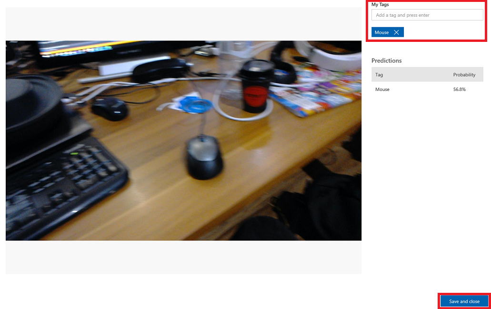

4. Once you are back to the grid of images, you will notice the images which you have added tags to (and saved), will be removed. If you find any images which you think do not have your tagged item within them, you can delete them, by clicking the tick on that image (can do this for several images) and then clicking *Delete* in the upper right corner of the grid page. On the popup that follows, you can click either *Yes, delete* or *No*, to confirm the deletion or cancel it, respectively. 

    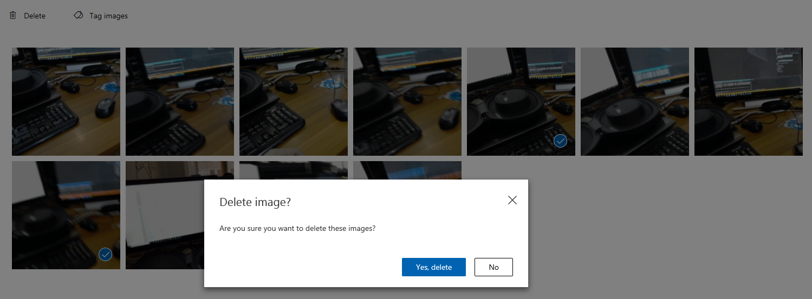

5. When you are ready to proceed, click the green *Train* button in the top right. Your Service model will be trained with all the images which you have now provided (which will make it more accurate). Once the training is complete, make sure to click the *Make default* button once more, so that your *Prediction URL* continues to use the most up-to-date iteration of your Service.

    
    

## Your finished Custom Vision API application

Congratulations, you built a mixed reality app that leverages the Azure Custom Vision API to recognize real world objects, train the Service model, and display confidence of what has been seen.


## Bonus exercises

### Exercise 1

Train your **Custom Vision Service** to recognize more objects.

### Exercise 2

As a way to expand on what you have learned, complete the following exercises:

Play a sound when an object is recognized.

### Exercise 3

Use the API to re-train your Service with the same images your app is analyzing, so to make the Service more accurate (do both prediction and training simultaneously).