# HoloLens (1st gen) and Azure 303: Natural language understanding (LUIS)

<br>

>[!NOTE]
>The Mixed Reality Academy tutorials were designed with HoloLens (1st gen) and Mixed Reality Immersive Headsets in mind.  As such, we feel it is important to leave these tutorials in place for developers who are still looking for guidance in developing for those devices.  These tutorials will **_not_** be updated with the latest toolsets or interactions being used for HoloLens 2.  They will be maintained to continue working on the supported devices. There will be a new series of tutorials that will be posted in the future that will demonstrate how to develop for HoloLens 2.  This notice will be updated with a link to those tutorials when they are posted.

<br>

In this course, you will learn how to integrate Language Understanding into a mixed reality application using Azure Cognitive Services, with the Language Understanding API.

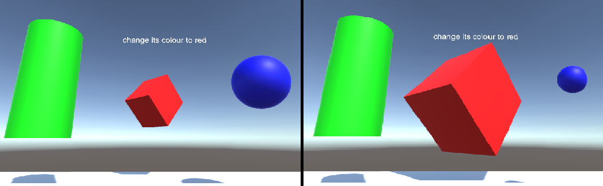

*Language Understanding (LUIS)* is a Microsoft Azure service, which provides applications with the ability to make meaning out of user input, such as through extracting what a person might want, in their own words. This is achieved through machine learning, which understands and learns the input information, and then can reply with detailed, relevant, information. For more information, visit the [Azure Language Understanding (LUIS) page](https://azure.microsoft.com/services/cognitive-services/language-understanding-intelligent-service/).

Having completed this course, you will have a mixed reality immersive headset application which will be able to do the following:

1.	Capture user input speech, using the Microphone attached to the immersive headset. 
2.	Send the captured dictation the *Azure Language Understanding Intelligent Service* (*LUIS*). 
3.	Have LUIS extract meaning from the send information, which will be analyzed, and attempt to determine the intent of the user’s request will be made.

Development will include the creation of an app where the user will be able to use voice and/or gaze to change the size and the color of the objects in the scene. The use of motion controllers will not be covered.

In your application, it is up to you as to how you will integrate the results with your design. This course is designed to teach you how to integrate an Azure Service with your Unity Project. It is your job to use the knowledge you gain from this course to enhance your mixed reality application.

Be prepared to Train LUIS several times, which is covered in [Chapter 12](#chapter-12--improving-your-luis-service). You will get better results the more times LUIS has been trained.

## Device support

<table>
<tr>
<th>Course</th><th> <a href="/hololens/hololens1-hardware">HoloLens</a></th><th> <a href="/windows/mixed-reality/enthusiast-guide/immersive-headset-hardware-details">Immersive headsets</a></th>
</tr><tr>
<td>MR and Azure 303: Natural language understanding (LUIS)</td><td> ✔️</td><td> ✔️</td>
</tr>
</table>

> [!NOTE]
> While this course primarily focuses on Windows Mixed Reality immersive (VR) headsets, you can also apply what you learn in this course to Microsoft HoloLens. As you follow along with the course, you will see notes on any changes you might need to employ to support HoloLens. When using HoloLens, you may notice some echo during voice capture.

## Prerequisites

> [!NOTE]
> This tutorial is designed for developers who have basic experience with Unity and C#. Please also be aware that the prerequisites and written instructions within this document represent what has been tested and verified at the time of writing (May 2018). You are free to use the latest software, as listed within the [install the tools](../../install-the-tools.md) article, though it should not be assumed that the information in this course will perfectly match what you'll find in newer software than what's listed below.

We recommend the following hardware and software for this course:

- A development PC, [compatible with Windows Mixed Reality](https://support.microsoft.com/help/4039260/windows-10-mixed-reality-pc-hardware-guidelines) for immersive (VR) headset development
- [Windows 10 Fall Creators Update (or later) with Developer mode enabled](../../install-the-tools.md)
- [The latest Windows 10 SDK](../../install-the-tools.md)
- [Unity 2017.4](../../install-the-tools.md)
- [Visual Studio 2017](../../install-the-tools.md)
- A [Windows Mixed Reality immersive (VR) headset](/windows/mixed-reality/enthusiast-guide/immersive-headset-hardware-details) or [Microsoft HoloLens](/hololens/hololens1-hardware) with Developer mode enabled
- A set of headphones with a built-in microphone (if the headset doesn't have a built-in mic and speakers)
- Internet access for Azure setup and LUIS retrieval

## Before you start

1.	To avoid encountering issues building this project, it is strongly suggested that you create the project mentioned in this tutorial in a root or near-root folder (long folder paths can cause issues at build-time). 
2.	To allow your machine to enable Dictation, go to **Windows Settings > Privacy > Speech, Inking & Typing** and press on the button **Turn On speech services and typing suggestions**.
3.	The code in this tutorial will allow you to record from the **Default Microphone Device** set on your machine. Make sure the Default Microphone Device is set as the one you wish to use to capture your voice.
4.	If your headset has a built-in microphone, make sure the option *“When I wear my headset, switch to headset mic”* is turned on in the *Mixed Reality Portal* settings.

    

## Chapter 1 – Setup Azure Portal

To use the *Language Understanding* service in Azure, you will need to configure an instance of the service to be made available to your application.

1.	Log in to the [Azure Portal](https://portal.azure.com).

    > [!NOTE]
    > If you do not already have an Azure account, you will need to create one. If you are following this tutorial in a classroom or lab situation, ask your instructor or one of the proctors for help setting up your new account.

2.	Once you are logged in, click on **New** in the top left corner, and search for *Language Understanding*, and click **Enter**. 

    

    > [!NOTE]
    > The word **New** may have been replaced with **Create a resource**, in newer portals.
 
3.	The new page to the right will provide a description of the Language Understanding service. At the bottom left of this page, select the **Create** button, to create an instance of this service.

    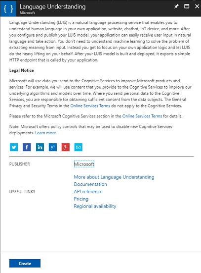
 
4.	Once you have clicked on Create:

    1. Insert your desired **Name** for this service instance.
    2. Select a **Subscription**.
    3. Select the **Pricing Tier** appropriate for you, if this is the first time creating a *LUIS Service*, a free tier (named F0) should be available to you. The free allocation should be more than sufficient for this course.
    4. Choose a **Resource Group** or create a new one. A resource group provides a way to monitor, control access, provision and manage billing for a collection of Azure assets. It is recommended to keep all the Azure services associated with a single project (e.g. such as these courses) under a common resource group). 

        > If you wish to read more about Azure Resource Groups, please [visit the resource group article](/azure/azure-resource-manager/resource-group-portal).

    5. Determine the **Location** for your resource group (if you are creating a new Resource Group). The location would ideally be in the region where the application would run. Some Azure assets are only available in certain regions.
    6. You will also need to confirm that you have understood the Terms and Conditions applied to this Service.
    7. Select **Create**.

        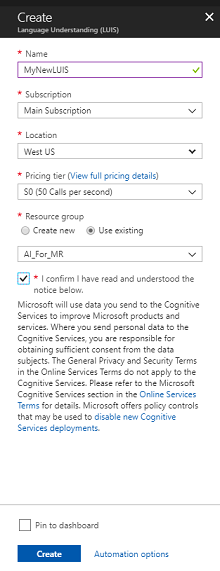
 
5.	Once you have clicked on **Create**, you will have to wait for the service to be created, this might take a minute.
6.	A notification will appear in the portal once the Service instance is created. 
 
    

7.	Click on the notification to explore your new Service instance.

    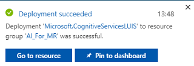
 
8.	Click the **Go to resource** button in the notification to explore your new Service instance. You will be taken to your new LUIS service instance. 
 
    

9.	Within this tutorial, your application will need to make calls to your service, which is done through using your service’s Subscription Key.
10.	From the *Quick start* page, of your *LUIS API* service, navigate to the first step, *Grab your keys*, and click **Keys** (you can also achieve this by clicking the blue hyperlink Keys, located in the services navigation menu, denoted by the key icon). This will reveal your service *Keys*.
11.	Take a copy of one of the displayed keys, as you will need this later in your project. 
12.	In the *Service* page, click on *Language Understanding Portal* to be redirected to the webpage which you will use to create your new Service, within the LUIS App. 

## Chapter 2 – The Language Understanding Portal

In this section you will learn how to make a LUIS App on the LUIS Portal. 

> [!IMPORTANT]
> Please be aware, that setting up the *Entities*, *Intents*, and *Utterances* within this chapter is only the first step in building your LUIS service: you will also need to retrain the service, several times, so to make it more accurate. Retraining your service is covered in the [last Chapter](#chapter-12--improving-your-luis-service) of this course, so ensure that you complete it.

1.	Upon reaching the *Language Understanding Portal*, you may need to login, if you are not already, with the same credentials as your Azure portal. 

    
 
2.	If this is your first time using LUIS, you will need to scroll down to the bottom of the welcome page, to find and click on the **Create LUIS app** button.

    
 
3.	Once logged in, click **My apps** (if you are not in that section currently). You can then click on **Create new app**.

    
 
4.	Give your app a *Name*.
5.	If your app is supposed to understand a language different from English, you should change the *Culture* to the appropriate language.
6.	Here you can also add a *Description* of your new LUIS app.

    

7.	Once you press **Done**, you will enter the *Build* page of your new *LUIS* application.
8.	There are a few important concepts to understand here:

    -	*Intent*, represents the method that will be called following a query from the user. An *INTENT* may have one or more *ENTITIES*.
    -	*Entity*, is a component of the query that describes information relevant to the *INTENT*.
    -	*Utterances*, are examples of queries provided by the developer, that LUIS will use to train itself.

If these concepts are not perfectly clear, do not worry, as this course will clarify them further in this chapter.

You will begin by creating the *Entities* needed to build this course.

9.	On the left side of the page, click on *Entities*, then click on **Create new entity**.

    

10.	Call the new Entity *color*, set its type to *Simple*, then press **Done**.

    
 
11.	Repeat this process to create three (3) more Simple Entities named:

    -	*upsize*
    -	*downsize*
    -	*target*

The result should look like the image below:


 
At this point you can begin creating *Intents*. 

> [!WARNING]
> Do not delete the **None** intent.

12.	On the left side of the page, click on **Intents**, then click on **Create new intent**.

    

13.	Call the new *Intent* **ChangeObjectColor**.

    > [!IMPORTANT]
    > This *Intent* name is used within the code later in this course, so for best results, use this name exactly as provided.

Once you confirm the name you will be directed to the Intents Page.


You will notice that there is a textbox asking you to type 5 or more different *Utterances*.

> [!NOTE]
> LUIS converts all Utterances to lower case.

14.	Insert the following *Utterance* in the top textbox (currently with the text *Type about 5 examples…* ), and press **Enter**:

```
The color of the cylinder must be red
```

You will notice that the new *Utterance* will appear in a list underneath.

Following the same process, insert the following six (6) Utterances:

```
make the cube black

make the cylinder color white

change the sphere to red

change it to green

make this yellow

change the color of this object to blue
```

For each Utterance you have created, you must identify which words should be used by LUIS as Entities. In this example you need to label all the colors as a *color* Entity, and all the possible reference to a target as a *target* Entity.

15.	To do so, try clicking on the word *cylinder* in the first Utterance and select *target*.

    
 
16.	Now click on the word *red* in the first Utterance and select *color*.

    
 
17.	Label the next line also, where *cube* should be a *target*, and *black* should be a *color*. Notice also the use of the words *‘this’*, *‘it’*, and *‘this object’*, which we are providing, so to have non-specific target types available also. 

18.	Repeat the process above until all the Utterances have the Entities labelled. See the below image if you need help.

    > [!TIP]
    > When selecting words to label them as entities:
    > -	For single words just click them.
    > -	For a set of two or more words, click at the beginning and then at the end of the set.

    > [!NOTE]
    > You can use the *Tokens View* toggle button to switch between **Entities / Tokens View**!

19. The results should be as seen in the images below, showing the **Entities / Tokens View**:

    
  
20.	At this point press the **Train** button at the top-right of the page and wait for the small round indicator on it to turn green. This indicates that LUIS has been successfully trained to recognize this Intent.

    
 
21.	As an exercise for you, create a new Intent called **ChangeObjectSize**, using the Entities *target*, *upsize*, and *downsize*.
22.	Following the same process as the previous Intent, insert the following eight (8) Utterances for *Size* change:

    ```
    increase the dimensions of that

    reduce the size of this

    i want the sphere smaller

    make the cylinder bigger

    size down the sphere

    size up the cube

    decrease the size of that object

    increase the size of this object
    ```

23. The result should be like the one in the image below:

     

24.	Once both Intents, **ChangeObjectColor** and **ChangeObjectSize**, have been created and trained, click on the **PUBLISH** button on top of the page.

    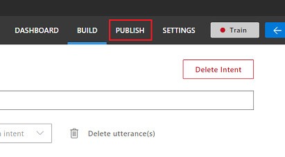

25.	On the *Publish* page you will finalize and publish your LUIS App so that it can be accessed by your code.

    1. Set the drop down *Publish To* as **Production**.
    2. Set the *Timezone* to your time zone.
    3. Check the box **Include all predicted intent scores**.
    4. Click on **Publish to Production Slot**.

        

26.	In the section *Resources and Keys*:

    1.	Select the region you set for service instance in the Azure Portal.
    2.	You will notice a **Starter_Key** element below, ignore it.
    3.	Click on **Add Key** and insert the *Key* that you obtained in the Azure Portal when you created your Service instance. If your Azure and the LUIS portal are logged into the same user, you will be provided drop-down menus for *Tenant name*, *Subscription Name*, and the *Key* you wish to use (will have the same name as you provided previously in the Azure Portal.

    > [!IMPORTANT] 
    > Underneath *Endpoint*, take a copy of the endpoint corresponding to the Key you have inserted, you will soon use it in your code.
 
## Chapter 3 – Set up the Unity project

The following is a typical set up for developing with the mixed reality, and as such, is a good template for other projects.

1.	Open *Unity* and click **New**. 

    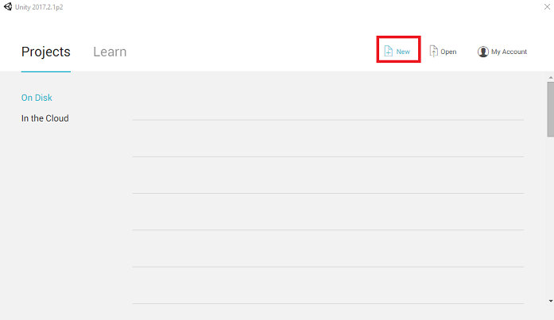

2.	You will now need to provide a Unity Project name, insert **MR_LUIS**. Make sure the project type is set to **3D**. Set the **Location** to somewhere appropriate for you (remember, closer to root directories is better). Then, click **Create project**.

    
 
3.	With Unity open, it is worth checking the default **Script Editor** is set to **Visual Studio**. Go to Edit > Preferences and then from the new window, navigate to **External Tools**. Change **External Script Editor** to **Visual Studio 2017**. Close the **Preferences** window.

    
 
4.	Next, go to **File > Build Settings** and switch the platform to **Universal Windows Platform**, by clicking on the **Switch Platform** button.

    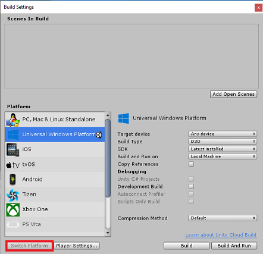
 
5.	Go to **File > Build Settings** and make sure that:

    1. **Target Device** is set to **Any Device**

        > For the Microsoft HoloLens, set **Target Device** to *HoloLens*.

    2. **Build Type** is set to **D3D**
    3. **SDK** is set to **Latest installed**
    4. **Visual Studio Version** is set to **Latest installed**
    5. **Build and Run** is set to **Local Machine**
    6. Save the scene and add it to the build.

        1. Do this by selecting **Add Open Scenes**. A save window will appear.
        
            

        2. Create a new folder for this, and any future, scene, then select the **New folder** button, to create a new folder, name it **Scenes**.

            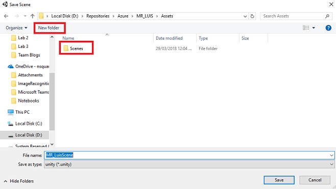

        3. Open your newly created **Scenes** folder, and then in the *File name*: text field, type **MR_LuisScene**, then press **Save**.

            

    7. The remaining settings, in *Build Settings*, should be left as default for now.

6. In the *Build Settings* window, click on the **Player Settings** button, this will open the related panel in the space where the *Inspector* is located. 

     
 
7. In this panel, a few settings need to be verified:

    1. In the **Other Settings** tab:

        1. **Scripting Runtime Version** should be **Stable** (.NET 3.5 Equivalent).
        2. **Scripting Backend** should be **.NET**
        3. **API Compatibility Level** should be **.NET 4.6**

            
      
    2. Within the **Publishing Settings** tab, under **Capabilities**, check:

        1. **InternetClient**
        2. **Microphone**

            

    3. Further down the panel, in **XR Settings** (found below **Publish Settings**), tick **Virtual Reality Supported**, make sure the **Windows Mixed Reality SDK** is added.

        

8.	Back in *Build Settings* _Unity C#_ Projects is no longer greyed out; tick the checkbox next to this. 
9.	Close the Build Settings window.
10.	Save your Scene and Project (**FILE > SAVE SCENE / FILE > SAVE PROJECT**).

## Chapter 4 – Create the scene

> [!IMPORTANT]
> If you wish to skip the *Unity Set up* component of this course, and continue straight into code, feel free to download this [.unitypackage](https://github.com/Microsoft/HolographicAcademy/raw/Azure-MixedReality-Labs/Azure%20Mixed%20Reality%20Labs/MR%20and%20Azure%20303%20-%20Natural%20language%20understanding/Azure-MR-303.unitypackage), import it into your project as a [Custom Package](https://docs.unity3d.com/Manual/AssetPackages.html), and then continue from [Chapter 5](#chapter-5--create-the-microphonemanager-class). 

1.	Right-click in an empty area of the *Hierarchy Panel*, under **3D Object**, add a **Plane**.

    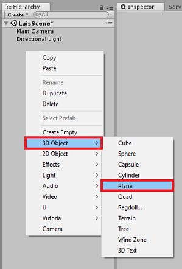

2.	Be aware that when you right-click within the *Hierarchy* again to create more objects, if you still have the last object selected, the selected object will be the parent of your new object. Avoid this left-clicking in an empty space within the Hierarchy, and then right-clicking.

3.	Repeat the above procedure to add the following objects:

    1. *Sphere*
    2. *Cylinder*
    3. *Cube*
    4. *3D Text*

4.	The resulting scene *Hierarchy* should be like the one in the image below:

    
 
5.	Left click on the **Main Camera** to select it, look at the *Inspector Panel* you will see the Camera object with all the its components.
6.	Click on the **Add Component** button located at the very bottom of the *Inspector Panel*.

    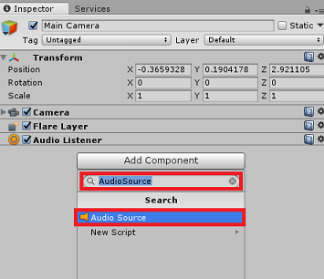
 
7.	Search for the component called *Audio Source*, as shown above.
8.	Also make sure that the *Transform* component of the Main Camera is set to (0,0,0), this can be done by pressing the **Gear** icon next to the Camera’s *Transform* component and selecting **Reset**. The *Transform* component should then look like:

    1.	*Position* is set to **0, 0, 0**.
    2.	*Rotation* is set to **0, 0, 0**.

    > [!NOTE] 
    > For the Microsoft HoloLens, you will need to also change the following, which are part of the **Camera** component, which is on your **Main Camera**:
    > - **Clear Flags:** Solid Color.
    > - **Background** ‘Black, Alpha 0’ – Hex color: #00000000.

9.	Left click on the **Plane** to select it. In the *Inspector Panel* set the *Transform* component with the following values:

    |   X Axis    | Y Axis |   Z Axis    |
    |:-----:|:----------------------:|:-----:|
    | 0     | -1                     | 0     |


10.	Left click on the **Sphere** to select it. In the *Inspector Panel* set the *Transform* component with the following values:

    |   X Axis    | Y Axis |   Z Axis    |
    |:-----:|:----------------------:|:-----:|
    | 2     | 1                      | 2     |

11.	Left click on the **Cylinder** to select it. In the *Inspector Panel* set the *Transform* component with the following values:

    |   X Axis    | Y Axis |   Z Axis    |
    |:-----:|:----------------------:|:-----:|
    | -2    | 1                      | 2     |

12.	Left click on the **Cube** to select it. In the *Inspector Panel* set the *Transform* component with the following values:

    |        | Transform - *Position* |       |  \| |       | Transform - *Rotation* |       |
    |:------:|:----------------------:|:-----:|:---:|:-----:|:----------------------:|:-----:|
    | **X** | **Y**                   | **Z** |  \| | **X** | **Y**                  | **Z** |
    | 0     | 1                       | 4     |  \| | 45    | 45                     | 0     | 

13.	Left click on the **New Text** object to select it. In the *Inspector Panel* set the *Transform* component with the following values:

    |       | Transform - *Position* |       |  \| |       | Transform - *Scale* |       |
    |:-----:|:----------------------:|:-----:|:---:|:-----:|:-------------------:|:-----:|
    | **X** | **Y**                  | **Z** |  \| | **X** | **Y**               | **Z** |
    | -2    | 6                      | 9     |  \| | 0.1   | 0.1                 | 0.1   | 

14.	Change **Font Size** in the **Text Mesh** component to **50**.
15.	Change the *name* of the **Text Mesh** object to **Dictation Text**.

    
 
16. Your Hierarchy Panel structure should now look like this:

    


17.	The final scene should look like the image below:

    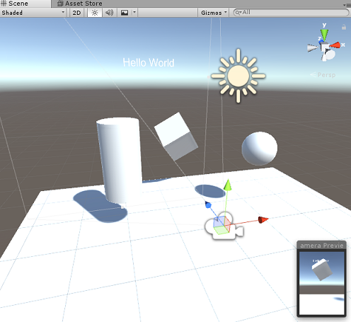
    
 
## Chapter 5 – Create the MicrophoneManager class

The first Script you are going to create is the *MicrophoneManager* class. Following this, you will create the *LuisManager*, the *Behaviours* class, and lastly the *Gaze* class (feel free to create all these now, though it will be covered as you reach each Chapter).

The *MicrophoneManager* class is responsible for:

-	Detecting the recording device attached to the headset or machine (whichever is the default one).
-	Capture the audio (voice) and use dictation to store it as a string.
-	Once the voice has paused, submit the dictation to the *LuisManager* class. 

To create this class: 

1.	Right-click in the *Project Panel*, **Create > Folder**. Call the folder **Scripts**. 

    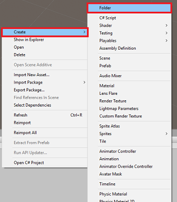
 
2.	With the **Scripts** folder created, double click it, to open. Then, within that folder, right-click, **Create > C# Script**. Name the script *MicrophoneManager*. 

3.	Double click on *MicrophoneManager* to open it with *Visual Studio*.
4.	Add the following namespaces to the top of the file:

    ```csharp
        using UnityEngine;
        using UnityEngine.Windows.Speech;
    ```

5.	Then add the following variables inside the *MicrophoneManager* class:

    ```csharp
        public static MicrophoneManager instance; //help to access instance of this object
        private DictationRecognizer dictationRecognizer;  //Component converting speech to text
        public TextMesh dictationText; //a UI object used to debug dictation result
    ``` 

6.	Code for *Awake()* and *Start()* methods now needs to be added. These will be called when the class initializes:

    ```csharp
        private void Awake()
        {
            // allows this class instance to behave like a singleton
            instance = this;
        }

        void Start()
        {
            if (Microphone.devices.Length > 0)
            {
                StartCapturingAudio();
                Debug.Log("Mic Detected");
            }
        }
    ```
 
7.	Now you need the method that the App uses to start and stop the voice capture, and pass it to the *LuisManager* class, that you will build soon. 

    ```csharp
        /// <summary>
        /// Start microphone capture, by providing the microphone as a continual audio source (looping),
        /// then initialise the DictationRecognizer, which will capture spoken words
        /// </summary>
        public void StartCapturingAudio()
        {
            if (dictationRecognizer == null)
            {
                dictationRecognizer = new DictationRecognizer
                {
                    InitialSilenceTimeoutSeconds = 60,
                    AutoSilenceTimeoutSeconds = 5
                };

                dictationRecognizer.DictationResult += DictationRecognizer_DictationResult;
                dictationRecognizer.DictationError += DictationRecognizer_DictationError;
            }
            dictationRecognizer.Start();
            Debug.Log("Capturing Audio...");
        }

        /// <summary>
        /// Stop microphone capture
        /// </summary>
        public void StopCapturingAudio()
        {
            dictationRecognizer.Stop();
            Debug.Log("Stop Capturing Audio...");
        }
    ```

8.	Add a *Dictation Handler* that will be invoked when the voice pauses. This method will pass the dictation text to the *LuisManager* class.

    ```csharp
        /// <summary>
        /// This handler is called every time the Dictation detects a pause in the speech. 
        /// This method will stop listening for audio, send a request to the LUIS service 
        /// and then start listening again.
        /// </summary>
        private void DictationRecognizer_DictationResult(string dictationCaptured, ConfidenceLevel confidence)
        {
            StopCapturingAudio();
            StartCoroutine(LuisManager.instance.SubmitRequestToLuis(dictationCaptured, StartCapturingAudio));
            Debug.Log("Dictation: " + dictationCaptured);
            dictationText.text = dictationCaptured;
        }

        private void DictationRecognizer_DictationError(string error, int hresult)
        {
            Debug.Log("Dictation exception: " + error);
        }
    ```
 
    > [!IMPORTANT]
    > Delete the *Update()* method since this class will not use it.

9.	Be sure to save your changes in *Visual Studio* before returning to *Unity*.

    > [!NOTE]
    > At this point you will notice an error appearing in the *Unity Editor Console Panel*. This is because the code references the *LuisManager* class which you will create in the next Chapter.

## Chapter 6 – Create the LUISManager class

It is time for you to create the *LuisManager* class, which will make the call to the Azure LUIS service. 

The purpose of this class is to receive the dictation text from the *MicrophoneManager* class and send it to the *Azure Language Understanding API* to be analyzed.

This class will deserialize the *JSON* response and call the appropriate methods of the *Behaviours* class to trigger an action.

To create this class: 

1.	Double click on the **Scripts** folder, to open it. 
2.	Right-click inside the **Scripts** folder, click **Create > C# Script**. Name the script *LuisManager*. 
3.	Double click on the script to open it with Visual Studio.
4.	Add the following namespaces to the top of the file:

    ```csharp
        using System;
        using System.Collections;
        using System.Collections.Generic;
        using System.IO;
        using UnityEngine;
        using UnityEngine.Networking;
    ```

5.	You will begin by creating three classes **inside** the *LuisManager* class (within the same script file, above the *Start()* method) that will represent the deserialized JSON response from Azure.

    ```csharp
        [Serializable] //this class represents the LUIS response
        public class AnalysedQuery
        {
            public TopScoringIntentData topScoringIntent;
            public EntityData[] entities;
            public string query;
        }

        // This class contains the Intent LUIS determines 
        // to be the most likely
        [Serializable]
        public class TopScoringIntentData
        {
            public string intent;
            public float score;
        }

        // This class contains data for an Entity
        [Serializable]
        public class EntityData
        {
            public string entity;
            public string type;
            public int startIndex;
            public int endIndex;
            public float score;
        }
    ```

6.	Next, add the following variables inside the *LuisManager* class:
 
    ```csharp
        public static LuisManager instance;

        //Substitute the value of luis Endpoint with your own End Point
        string luisEndpoint = "https://westus.api.cognitive... add your endpoint from the Luis Portal";
    ```

7.	Make sure to place your LUIS endpoint in now (which you will have from your LUIS portal).

8.	Code for the *Awake()* method now needs to be added. This method will be called when the class initializes:

    ```csharp
        private void Awake()
        {
            // allows this class instance to behave like a singleton
            instance = this;
        }
    ```

9.	Now you need the methods this application uses to send the dictation received from the *MicrophoneManager* class to *LUIS*, and then receive and deserialize the response. 
10.	Once the value of the Intent, and associated Entities, have been determined, they are passed to the instance of the *Behaviours* class to trigger the intended action.

    ```csharp
        /// <summary>
        /// Call LUIS to submit a dictation result.
        /// The done Action is called at the completion of the method.
        /// </summary>
        public IEnumerator SubmitRequestToLuis(string dictationResult, Action done)
        {
            string queryString = string.Concat(Uri.EscapeDataString(dictationResult));

            using (UnityWebRequest unityWebRequest = UnityWebRequest.Get(luisEndpoint + queryString))
            {
                yield return unityWebRequest.SendWebRequest();

                if (unityWebRequest.isNetworkError || unityWebRequest.isHttpError)
                {
                    Debug.Log(unityWebRequest.error);
                }
                else
                {
                    try
                    {
                        AnalysedQuery analysedQuery = JsonUtility.FromJson<AnalysedQuery>(unityWebRequest.downloadHandler.text);

                        //analyse the elements of the response 
                        AnalyseResponseElements(analysedQuery);
                    }
                    catch (Exception exception)
                    {
                        Debug.Log("Luis Request Exception Message: " + exception.Message);
                    }
                }

                done();
                yield return null;
            }
        }
    ```
 
11.	Create a new method called *AnalyseResponseElements()* that will read the resulting *AnalysedQuery* and determine the Entities. Once those Entities are determined, they will be passed to the instance of the *Behaviours* class to use in the actions.

    ```csharp
        private void AnalyseResponseElements(AnalysedQuery aQuery)
        {
            string topIntent = aQuery.topScoringIntent.intent;

            // Create a dictionary of entities associated with their type
            Dictionary<string, string> entityDic = new Dictionary<string, string>();

            foreach (EntityData ed in aQuery.entities)
            {
                entityDic.Add(ed.type, ed.entity);
            }

            // Depending on the topmost recognized intent, read the entities name
            switch (aQuery.topScoringIntent.intent)
            {
                case "ChangeObjectColor":
                    string targetForColor = null;
                    string color = null;

                    foreach (var pair in entityDic)
                    {
                        if (pair.Key == "target")
                        {
                            targetForColor = pair.Value;
                        }
                        else if (pair.Key == "color")
                        {
                            color = pair.Value;
                        }
                    }

                    Behaviours.instance.ChangeTargetColor(targetForColor, color);
                    break;

                case "ChangeObjectSize":
                    string targetForSize = null;
                    foreach (var pair in entityDic)
                    {
                        if (pair.Key == "target")
                        {
                            targetForSize = pair.Value;
                        }
                    }

                    if (entityDic.ContainsKey("upsize") == true)
                    {
                        Behaviours.instance.UpSizeTarget(targetForSize);
                    }
                    else if (entityDic.ContainsKey("downsize") == true)
                    {
                        Behaviours.instance.DownSizeTarget(targetForSize);
                    }
                    break;
            }
        }
    ```
 
    > [!IMPORTANT]
    > Delete the *Start()* and *Update()* methods since this class will not use them.

12.	Be sure to save your changes in *Visual Studio* before returning to *Unity*.

> [!NOTE]
> At this point you will notice several errors appearing in the *Unity Editor Console Panel*. This is because the code references the *Behaviours* class which you will create in the next Chapter.

## Chapter 7 – Create the Behaviours class

The *Behaviours* class will trigger the actions using the Entities provided by the *LuisManager* class.

To create this class: 

1.	Double click on the **Scripts** folder, to open it. 
2.	Right-click inside the **Scripts** folder, click **Create > C# Script**. Name the script *Behaviours*. 
3.	Double click on the script to open it with *Visual Studio*.
4.	Then add the following variables inside the *Behaviours* class:

    ```csharp
        public static Behaviours instance;

        // the following variables are references to possible targets
        public GameObject sphere;
        public GameObject cylinder;
        public GameObject cube;
        internal GameObject gazedTarget;
    ```
 
5.	Add the *Awake()* method code. This method will be called when the class initializes:

    ```csharp
        void Awake()
        {
            // allows this class instance to behave like a singleton
            instance = this;
        }
    ```
 
6.	The following methods are called by the *LuisManager* class (which you have created previously) to determine which object is the target of the query and then trigger the appropriate action.

    ```csharp
        /// <summary>
        /// Changes the color of the target GameObject by providing the name of the object
        /// and the name of the color
        /// </summary>
        public void ChangeTargetColor(string targetName, string colorName)
        {
            GameObject foundTarget = FindTarget(targetName);
            if (foundTarget != null)
            {
                Debug.Log("Changing color " + colorName + " to target: " + foundTarget.name);

                switch (colorName)
                {
                    case "blue":
                        foundTarget.GetComponent<Renderer>().material.color = Color.blue;
                        break;

                    case "red":
                        foundTarget.GetComponent<Renderer>().material.color = Color.red;
                        break;

                    case "yellow":
                        foundTarget.GetComponent<Renderer>().material.color = Color.yellow;
                        break;

                    case "green":
                        foundTarget.GetComponent<Renderer>().material.color = Color.green;
                        break;

                    case "white":
                        foundTarget.GetComponent<Renderer>().material.color = Color.white;
                        break;

                    case "black":
                        foundTarget.GetComponent<Renderer>().material.color = Color.black;
                        break;
                }          
            }
        }

        /// <summary>
        /// Reduces the size of the target GameObject by providing its name
        /// </summary>
        public void DownSizeTarget(string targetName)
        {
            GameObject foundTarget = FindTarget(targetName);
            foundTarget.transform.localScale -= new Vector3(0.5F, 0.5F, 0.5F);
        }

        /// <summary>
        /// Increases the size of the target GameObject by providing its name
        /// </summary>
        public void UpSizeTarget(string targetName)
        {
            GameObject foundTarget = FindTarget(targetName);
            foundTarget.transform.localScale += new Vector3(0.5F, 0.5F, 0.5F);
        }
    ```
 
7.	Add the *FindTarget()* method to determine which of the *GameObjects* is the target of the current Intent. This method defaults the target to the *GameObject* being “gazed” if no explicit target is defined in the Entities.

    ```csharp
        /// <summary>
        /// Determines which object reference is the target GameObject by providing its name
        /// </summary>
        private GameObject FindTarget(string name)
        {
            GameObject targetAsGO = null;

            switch (name)
            {
                case "sphere":
                    targetAsGO = sphere;
                    break;

                case "cylinder":
                    targetAsGO = cylinder;
                    break;

                case "cube":
                    targetAsGO = cube;
                    break;

                case "this": // as an example of target words that the user may use when looking at an object
                case "it":  // as this is the default, these are not actually needed in this example
                case "that":
                default: // if the target name is none of those above, check if the user is looking at something
                    if (gazedTarget != null) 
                    {
                        targetAsGO = gazedTarget;
                    }
                    break;
            }
            return targetAsGO;
        }
    ```
 
    > [!IMPORTANT]
    > Delete the *Start()* and *Update()* methods since this class will not use them.

8.	Be sure to save your changes in *Visual Studio* before returning to *Unity*.

## Chapter 8 – Create the Gaze Class

The last class that you will need to complete this app is the *Gaze* class. This class updates the reference to the *GameObject* currently in the user’s visual focus.

To create this Class: 

1.	Double click on the **Scripts** folder, to open it. 
2.	Right-click inside the **Scripts** folder, click **Create > C# Script**. Name the script *Gaze*. 
3.	Double click on the script to open it with *Visual Studio*.
4.	Insert the following code for this class:

    ```csharp
        using UnityEngine;

        public class Gaze : MonoBehaviour
        {        
            internal GameObject gazedObject;
            public float gazeMaxDistance = 300;

            void Update()
            {
                // Uses a raycast from the Main Camera to determine which object is gazed upon.
                Vector3 fwd = gameObject.transform.TransformDirection(Vector3.forward);
                Ray ray = new Ray(Camera.main.transform.position, fwd);
                RaycastHit hit;
                Debug.DrawRay(Camera.main.transform.position, fwd);

                if (Physics.Raycast(ray, out hit, gazeMaxDistance) && hit.collider != null)
                {
                    if (gazedObject == null)
                    {
                        gazedObject = hit.transform.gameObject;

                        // Set the gazedTarget in the Behaviours class
                        Behaviours.instance.gazedTarget = gazedObject;
                    }
                }
                else
                {
                    ResetGaze();
                }         
            }

            // Turn the gaze off, reset the gazeObject in the Behaviours class.
            public void ResetGaze()
            {
                if (gazedObject != null)
                {
                    Behaviours.instance.gazedTarget = null;
                    gazedObject = null;
                }
            }
        }
    ```
 
5.	Be sure to save your changes in *Visual Studio* before returning to *Unity*.

## Chapter 9 – Completing the scene setup

1.	To complete the setup of the scene, drag each script that you have created from the Scripts Folder to the **Main Camera** object in the *Hierarchy Panel*.
2.	Select the **Main Camera** and look at the *Inspector Panel*, you should be able to see each script that you have attached, and you will notice that there are parameters on each script that are yet to be set.

    

3.	To set these parameters correctly, follow these instructions:

    1. *MicrophoneManager*:

        - From the *Hierarchy Panel*, drag the **Dictation Text** object into the **Dictation Text** parameter value box.

    2. *Behaviours*, from the *Hierarchy Panel*:

        - Drag the **Sphere** object into the *Sphere* reference target box.
        - Drag the **Cylinder** into the *Cylinder* reference target box.
        - Drag the **Cube** into the *Cube* reference target box.

    3. *Gaze*:

        - Set the *Gaze Max Distance* to **300** (if it is not already). 

4.	The result should look like the image below:

    
 
## Chapter 10 – Test in the Unity Editor

Test that the Scene setup is properly implemented.

Ensure that:

-	All the scripts are attached to the **Main Camera** object. 
-	All the fields in the *Main Camera Inspector Panel* are assigned properly.

1.	Press the **Play** button in the *Unity Editor*. The App should be running within the attached immersive headset.

2.	Try a few utterances, such as:

    ```
    make the cylinder red

    change the cube to yellow

    I want the sphere blue

    make this to green

    change it to white
    ```

    > [!NOTE]
    > If you see an error in the Unity console about the default audio device changing, the scene may not function as expected. This is due to the way the mixed reality portal deals with built-in microphones for headsets that have them. If you see this error, simply stop the scene and start it again and things should work as expected.

## Chapter 11 – Build and sideload the UWP Solution

Once you have ensured that the application is working in the Unity Editor, you are ready to Build and Deploy.

To Build:

1.	Save the current scene by clicking on **File > Save**.
2.	Go to **File > Build Settings**.
3.  Tick the box called **Unity C# Projects** (useful for seeing and debugging your code once the UWP project is created.
4.  Click on **Add Open Scenes**, then click **Build**.

    

4.	You will be prompted to select the folder where you want to build the Solution. 

5.	Create a *BUILDS* folder and within that folder create another folder with an appropriate name of your choice. 
6.	Click **Select Folder** to begin the build at that location.
 
    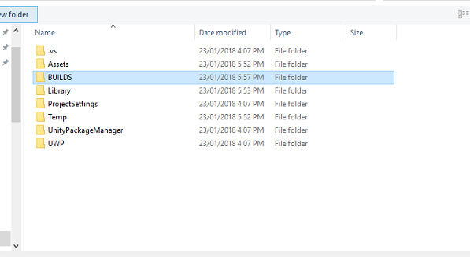
    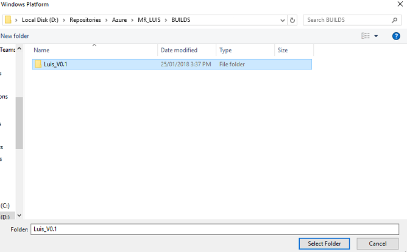
 
7.	Once Unity has finished building (it might take some time), it should open a **File Explorer** window at the location of your build.

To Deploy on Local Machine:

1.	In *Visual Studio*, open the solution file that has been created in the [previous Chapter](#chapter-10--test-in-the-unity-editor).
2.	In the **Solution Platform**, select **x86**, **Local Machine**.
3.	In the **Solution Configuration** select **Debug**.

    > For the Microsoft HoloLens, you may find it easier to set this to *Remote Machine*, so that you are not tethered to your computer. Though, you will need to also do the following:
    > - Know the **IP Address** of your HoloLens, which can be found within the *Settings > Network & Internet > Wi-Fi > Advanced Options*; the IPv4 is the address you should use. 
    > - Ensure **Developer Mode** is **On**; found in *Settings > Update & Security > For developers*.

    
 
4.	Go to the **Build menu** and click on **Deploy Solution** to sideload the application to your machine.
5.	Your App should now appear in the list of installed apps, ready to be launched!
6.	Once launched, the App will prompt you to authorize access to the _Microphone_. Use the *Motion Controllers*, or *Voice Input*, or the *Keyboard* to press the **YES** button. 

## Chapter 12 – Improving your LUIS service

>[!IMPORTANT] 
> This chapter is incredibly important, and may need to be iterated upon several times, as it will help improve the accuracy of your LUIS service: ensure you complete this.

To improve the level of understanding provided by LUIS you need to capture new utterances and use them to re-train your LUIS App.

For example, you might have trained LUIS to understand “Increase” and “Upsize”, but wouldn’t you want your app to also understand words like “Enlarge”?

Once you have used your application a few times, everything you have said will be collected by LUIS and available in the LUIS PORTAL.

1.	Go to your portal application following this [LINK](https://www.luis.ai/home), and Log In.
2.	Once you are logged in with your MS Credentials, click on your *App name*.
3.	Click the **Review endpoint utterances** button on the left of the page.

    
 
4.	You will be shown a list of the Utterances that have been sent to LUIS by your mixed reality Application.

    
 
You will notice some highlighted *Entities*. 

By hovering over each highlighted word, you can review each Utterance and determine which Entity has been recognized correctly, which Entities are wrong and which Entities are missed.

In the example above, it was found that the word “spear” had been highlighted as a target, so it necessary to correct the mistake, which is done by hovering over the word with the mouse and clicking **Remove Label**.

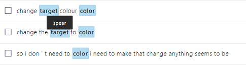

 
5.	If you find Utterances that are completely wrong, you can delete them using the **Delete** button on the right side of the screen.

    

6.	Or if you feel that LUIS has interpreted the Utterance correctly, you can validate its understanding by using the **Add To Aligned Intent** button.

    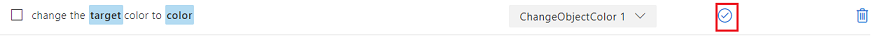

7.	Once you have sorted all the displayed Utterances, try and reload the page to see if more are available.
8.	It is very important to repeat this process as many times as possible to improve your application understanding. 

**Have fun!**

## Your finished LUIS Integrated application

Congratulations, you built a mixed reality app that leverages the Azure Language Understanding Intelligence Service, to understand what a user says, and act on that information.


## Bonus exercises

### Exercise 1

While using this application you might notice that if you gaze at the Floor object and ask to change its color, it will do so. Can you work out how to stop your application from changing the Floor color?

### Exercise 2

Try extending the LUIS and App capabilities, adding additional functionality for objects in scene; as an example, create new objects at the Gaze hit point, depending on what the user says, and then be able to use those objects alongside current scene objects, with the existing commands.