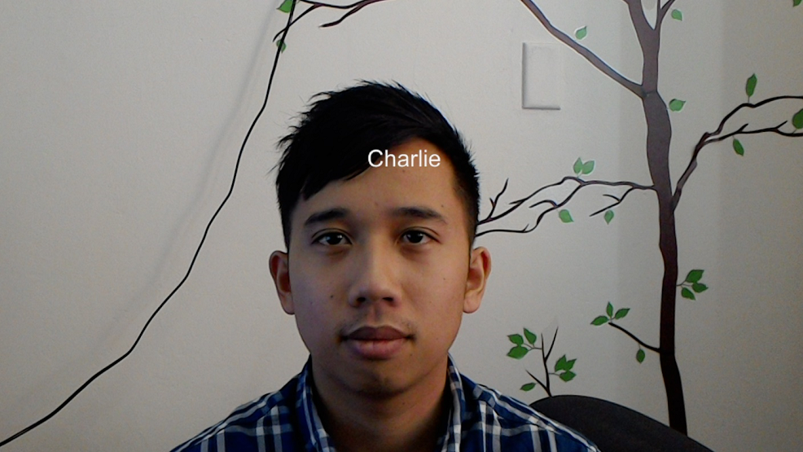
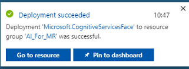
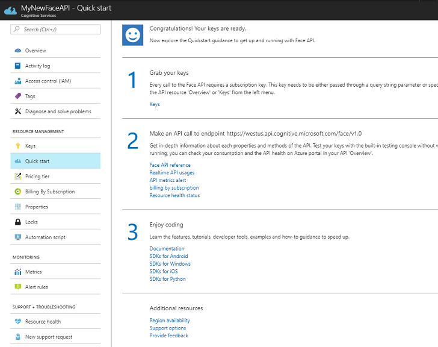
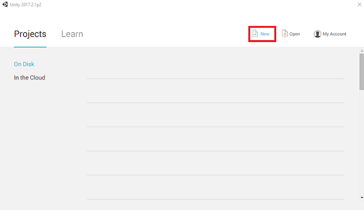
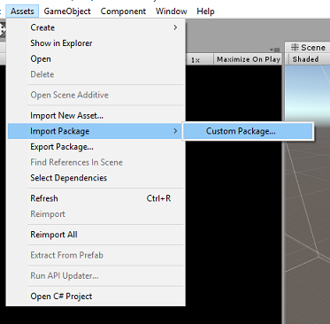

# HoloLens (1st gen) and Azure 304: Face recognition

<br>

>[!NOTE]
>The Mixed Reality Academy tutorials were designed with HoloLens (1st gen) and Mixed Reality Immersive Headsets in mind.  As such, we feel it is important to leave these tutorials in place for developers who are still looking for guidance in developing for those devices.  These tutorials will **_not_** be updated with the latest toolsets or interactions being used for HoloLens 2.  They will be maintained to continue working on the supported devices. There will be a new series of tutorials that will be posted in the future that will demonstrate how to develop for HoloLens 2.  This notice will be updated with a link to those tutorials when they are posted.

<br>



In this course you will learn how to add face recognition capabilities to a mixed reality application, using Azure Cognitive Services, with the Microsoft Face API.

*Azure Face API* is a Microsoft service, which provides developers with the most advanced face algorithms, all in the cloud. The *Face API* has two main functions: face detection with attributes, and face recognition. This allows developers to simply set a set of groups for faces, and then, send query images to the service later, to determine to whom a face belongs. For more information, visit the [Azure Face Recognition page](https://azure.microsoft.com/services/cognitive-services/face/).

Having completed this course, you will have a mixed reality HoloLens application, which will be able to do the following:

1. Use a **Tap Gesture** to initiate the capture of an image using the on-board HoloLens camera. 
2. Send the captured image to the *Azure Face API* service.
3. Receive the results of the *Face API* algorithm.
4. Use a simple User Interface, to display the name of matched people.

This will teach you how to get the results from the Face API Service into your Unity-based mixed reality application.

In your application, it is up to you as to how you will integrate the results with your design. This course is designed to teach you how to integrate an Azure Service with your Unity Project. It is your job to use the knowledge you gain from this course to enhance your mixed reality application.

## Device support

<table>
<tr>
<th>Course</th><th style="width:150px"> <a href="/hololens/hololens1-hardware">HoloLens</a></th><th style="width:150px"> <a href="../../../discover/immersive-headset-hardware-details.md">Immersive headsets</a></th>
</tr><tr>
<td> MR and Azure 304: Face recognition</td><td style="text-align: center;"> ✔️</td><td style="text-align: center;"> ✔️</td>
</tr>
</table>

> [!NOTE]
> While this course primarily focuses on HoloLens, you can also apply what you learn in this course to Windows Mixed Reality immersive (VR) headsets. Because immersive (VR) headsets do not have accessible cameras, you will need an external camera connected to your PC. As you follow along with the course, you will see notes on any changes you might need to employ to support immersive (VR) headsets.

## Prerequisites

> [!NOTE]
> This tutorial is designed for developers who have basic experience with Unity and C#. Please also be aware that the prerequisites and written instructions within this document represent what has been tested and verified at the time of writing (May 2018). You are free to use the latest software, as listed within the [install the tools](../../install-the-tools.md) article, though it should not be assumed that the information in this course will perfectly match what you'll find in newer software than what's listed below.

We recommend the following hardware and software for this course:

- A development PC, [compatible with Windows Mixed Reality](https://support.microsoft.com/help/4039260/windows-10-mixed-reality-pc-hardware-guidelines) for immersive (VR) headset development
- [Windows 10 Fall Creators Update (or later) with Developer mode enabled](../../install-the-tools.md)
- [The latest Windows 10 SDK](../../install-the-tools.md)
- [Unity 2017.4](../../install-the-tools.md)
- [Visual Studio 2017](../../install-the-tools.md)
- A [Windows Mixed Reality immersive (VR) headset](../../../discover/immersive-headset-hardware-details.md) or [Microsoft HoloLens](/hololens/hololens1-hardware) with Developer mode enabled
- A camera connected to your PC (for immersive headset development)
- Internet access for Azure setup and Face API retrieval

## Before you start

1.	To avoid encountering issues building this project, it is strongly suggested that you create the project mentioned in this tutorial in a root or near-root folder (long folder paths can cause issues at build-time).
2.	Set up and test your HoloLens. If you need support setting up your HoloLens, [make sure to visit the HoloLens setup article](/hololens/hololens-setup). 
3.	It is a good idea to perform Calibration and Sensor Tuning when beginning developing a new HoloLens App (sometimes it can help to perform those tasks for each user). 

For help on Calibration, please follow this [link to the HoloLens Calibration article](/hololens/hololens-calibration#hololens-2).

For help on Sensor Tuning, please follow this [link to the HoloLens Sensor Tuning article](/hololens/hololens-updates).

## Chapter 1 - The Azure Portal

To use the *Face API* service in Azure, you will need to configure an instance of the service to be made available to your application.

1.	First, log in to the [Azure Portal](https://portal.azure.com). 

    > [!NOTE]
    > If you do not already have an Azure account, you will need to create one. If you are following this tutorial in a classroom or lab situation, ask your instructor or one of the proctors for help setting up your new account.

2.  Once you are logged in, click on **New** in the top left corner, and search for *Face API*, press **Enter**.

    

    > [!NOTE]
    > The word **New** may have been replaced with **Create a resource**, in newer portals.

3.  The new page will provide a description of the *Face API* service. At the bottom left of this prompt, select the **Create** button, to create an association with this service.

    

4.  Once you have clicked on **Create**:

    1. Insert your desired name for this service instance.

    2. Select a subscription.

    3. Select the pricing tier appropriate for you, if this is the first time creating a *Face API Service*, a free tier (named F0) should be available to you.

    4. Choose a **Resource Group** or create a new one. A resource group provides a way to monitor, control access, provision and manage billing for a collection of Azure assets. It is recommended to keep all the Azure services associated with a single project (e.g. such as these labs) under a common resource group). 

        > If you wish to read more about Azure Resource Groups, please [visit the resource group article](/azure/azure-resource-manager/resource-group-portal).

    5. The UWP app, **Person Maker**, which you use later, requires the use of 'West US' for location.

    6. You will also need to confirm that you have understood the Terms and
    Conditions applied to this Service.

    7. Select **Create*.**

        

5.  Once you have clicked on **Create*,** you will have to wait for the service to be created, this might take a minute.

6.  A notification will appear in the portal once the Service instance is created.

    

7.  Click on the notifications to explore your new Service instance.

    

8.  When you are ready, click **Go to resource** button in the notification to explore your new Service instance.

    

9.  Within this tutorial, your application will need to make calls to your service, which is done through using your service's subscription 'key'. From the *Quick start* page, of your *Face API* service, the first point is number 1, to *Grab your keys.*

10. On the *Service* page select either the blue **Keys** hyperlink (if on the Quick start page), or the **Keys** link in the services navigation menu (to the left, denoted by the 'key' icon), to reveal your keys.

    > [!NOTE] 
    > Take note of either one of the keys and safeguard it, as you will need it later.

## Chapter 2 - Using the 'Person Maker' UWP application

Make sure to download the prebuilt UWP Application called [Person Maker](https://github.com/Microsoft/HolographicAcademy/raw/Azure-MixedReality-Labs/Azure%20Mixed%20Reality%20Labs/MR%20and%20Azure%20304%20-%20Face%20recognition/PersonMaker.zip). This app is not the end product for this course, just a tool to help you create your Azure entries, which the later project will rely upon.

**Person Maker** allows you to create Azure entries, which are associated with people, and groups of people. The application will place all the needed information in a format which can then later be used by the FaceAPI, in order to recognize the faces of people whom you have added. 

> [IMPORTANT]
> **Person Maker** uses some basic throttling, to help ensure that you do not exceed the number of service calls per minute for the **free subscription tier**. The green text at the top will change to red and update as 'ACTIVE' when throttling is happening; if this is the case, simply wait for the application (it will wait until it can next continue accessing the face service, updating as 'IN-ACTIVE' when you can use it again).

This application uses the *Microsoft.ProjectOxford.Face* libraries, which will allow you to make full use of the Face API. This library is available for free as a NuGet Package. For more information about this, and similar, APIs [make sure to visit the API reference article](/azure/cognitive-services/face/apireference).

> [!NOTE] 
> These are just the steps required, instructions for how to do these things is further down the document. The **Person Maker** app will allow you to:
>
> - Create a *Person Group*, which is a group composed of several people which you want to associate with it. With your Azure account you can host multiple Person Groups.
>
> - Create a *Person*, which is a member of a Person Group. Each person has a number of *Face* images associated with it.
>
> -  Assign *face images* to a *Person*, to allow your Azure Face API Service to recognize a *Person* by the corresponding *face*.
>
> -  *Train* your *Azure Face API Service*.

Be aware, so to train this app to recognize people, you will need ten (10) close-up photos of each person which you would like to add to your Person Group. The Windows 10 Cam App can help you to take these. You
must ensure that each photo is clear (avoid blurring, obscuring, or being too far, from the subject), have the photo in jpg or png file format, with the image file size being no larger **4 MB**, and no less than **1 KB**.

> [!NOTE]
> If you are following this tutorial, do not use your own face for training, as when you put the HoloLens on, you cannot look at yourself. Use the face of a colleague or fellow student.

Running **Person Maker**:

1.  Open the **PersonMaker** folder and double click on the *PersonMaker solution* to open it with *Visual Studio*.

2.  Once the *PersonMaker solution* is open, make sure that:

    1. The *Solution Configuration* is set to **Debug**.

    2. The *Solution Platform* is set to **x86**

    3. The *Target Platform* is **Local Machine**.

    4.  You also may need to *Restore NuGet Packages* (right-click the *Solution* and select **Restore NuGet Packages**).

3.  Click *Local Machine* and the application will start. Be aware, on smaller screens, all content may not be visible, though you can scroll further down to view it.

    

4.  Insert your **Azure Authentication Key**, which you should have, from your *Face API* service within Azure.

5.  Insert:

    1. The *ID* you want to assign to the *Person Group*. The ID must be lowercase, with no spaces. Make note of this ID, as it will be required later in your Unity project.
    2. The *Name* you want to assign to the *Person Group* (can have spaces).


6.  Press **Create Person Group** button. A confirmation message should appear underneath the button.

> [!NOTE]
> If you have an 'Access Denied' error, check the location you set for your Azure service. As stated above, this app is designed for 'West US'.

> [!IMPORTANT]
> You will notice that you can also click the **Fetch a Known Group** button: this is for if you have already created a person group, and wish to use that, rather than create a new one. Be aware, if you click *Create a Person Group* with a known group, this will also fetch a group.

7.  Insert the *Name* of the *Person* you want to create.

    1. Click the **Create Person** button.

    2. A confirmation message should appear underneath the button.

    3. If you wish to delete a person you have previously created, you can write the name into the textbox and press **Delete Person**

8.  Make sure you know the location of ten (10) photos of the person you would like to add to your group.

9.  Press **Create and Open Folder** to open Windows Explorer to the folder associated to the person. Add the ten (10) images in the folder. These must be of *JPG* or *PNG* file format.

10. Click on **Submit To Azure**. A counter will show you the state of the submission, followed by a message when it has completed.

11. Once the counter has finished and a confirmation message has been displayed click on **Train** to train your Service.

Once the process has completed, you are ready to move into Unity.

## Chapter 3 - Set up the Unity project

The following is a typical set up for developing with mixed reality, and as such, is a good template for other projects.

1.	Open *Unity* and click **New**. 

    

2.	You will now need to provide a Unity Project name. Insert **MR_FaceRecognition**. Make sure the project type is set to **3D**. Set the **Location** to somewhere appropriate for you (remember, closer to root directories is better). Then, click **Create project**.

    

3.	With Unity open, it is worth checking the default **Script Editor** is set to **Visual Studio**. Go to **Edit > Preferences** and then from the new window, navigate to **External Tools**. Change **External Script Editor** to **Visual Studio 2017**. Close the **Preferences** window.

    

4.	Next, go to **File > Build Settings** and switch the platform to **Universal Windows Platform**, by clicking on the **Switch Platform** button.

    

5.	Go to **File > Build Settings** and make sure that:

    1. **Target Device** is set to **HoloLens**

        > For the immersive headsets, set **Target Device** to *Any Device*.

    2. **Build Type** is set to **D3D**
    3. **SDK** is set to **Latest installed**
    4. **Visual Studio Version** is set to **Latest installed**
    5. **Build and Run** is set to **Local Machine**
    6. Save the scene and add it to the build. 

        1. Do this by selecting **Add Open Scenes**. A save window will appear.

            

        2. Select the **New folder** button, to create a new folder, name it **Scenes**.

            

        3. Open your newly created **Scenes** folder, and then in the **File name**: text field, type **FaceRecScene**, then press **Save**.

            

    7. The remaining settings, in *Build Settings*, should be left as default for now.

6. In the *Build Settings* window, click on the **Player Settings** button, this will open the related panel in the space where the *Inspector* is located. 

    

7. In this panel, a few settings need to be verified:

    1. In the **Other Settings** tab:

        1. **Scripting** **Runtime Version** should be **Experimental** (.NET 4.6 Equivalent). Changing this will trigger a need to restart the Editor.
        2. **Scripting Backend** should be **.NET**
        3. **API Compatibility Level** should be **.NET 4.6**

            
      
    2. Within the **Publishing Settings** tab, under **Capabilities**, check:

        - **InternetClient**
        - **Webcam**

            

    3. Further down the panel, in **XR Settings** (found below **Publish Settings**), tick **Virtual Reality Supported**, make sure the **Windows Mixed Reality SDK** is added.

        

8.	Back in *Build Settings*, **Unity C# Projects** is no longer greyed out; tick the checkbox next to this. 
9.	Close the Build Settings window.
10.	Save your Scene and Project (**FILE > SAVE SCENE / FILE > SAVE PROJECT**).

## Chapter 4 - Main Camera setup

> [!IMPORTANT]
> If you wish to skip the *Unity Set up* component of this course, and continue straight into code, feel free to [download this .unitypackage](https://github.com/Microsoft/HolographicAcademy/raw/Azure-MixedReality-Labs/Azure%20Mixed%20Reality%20Labs/MR%20and%20Azure%20304%20-%20Face%20recognition/Azure-MR-304.unitypackage), and import it into your project as a [Custom Package](https://docs.unity3d.com/Manual/AssetPackages.html). Be aware that this package also includes the import of the *Newtonsoft DLL*, covered in [Chapter 5](#chapter-5--import-the-newtonsoftjson-library). With this imported, you can continue from [Chapter 6](#chapter-6---create-the-faceanalysis-class).

1.  In the *Hierarchy* Panel, select the **Main Camera**.

2.  Once selected, you will be able to see all the components of the **Main Camera** in the *Inspector Panel*.

    1. The **Camera object** must be named **Main Camera** (note the spelling!)

    2. The Main Camera **Tag** must be set to **MainCamera** (note the spelling!)

    3. Make sure the **Transform Position** is set to **0, 0, 0**

    4. Set **Clear Flags** to **Solid Color**

    5. Set the **Background** Color of the Camera Component to **Black, Alpha 0 (Hex Code: #00000000)**

         

## Chapter 5 – Import the Newtonsoft.Json library

> [!IMPORTANT]
> If you imported the '.unitypackage' in the [last Chapter](#chapter-4---main-camera-setup), you can skip this Chapter.

To help you deserialize and serialize objects received and sent to the Bot Service you need to download the *Newtonsoft.Json* library. You will find a compatible version already organized with the correct Unity folder structure in this [Unity package file](https://github.com/Microsoft/HolographicAcademy/raw/Azure-MixedReality-Labs/Azure%20Mixed%20Reality%20Labs/MR%20and%20Azure%20304%20-%20Face%20recognition/newtonsoftDLL.unitypackage). 

To import the library:

1.  Download the Unity Package.
2.  Click on **Assets**, **Import Package**, **Custom Package**.

    

3.	Look for the Unity Package you have downloaded, and click Open.
4.  Make sure all the components of the package are ticked and click **Import**.

    

## Chapter 6 - Create the FaceAnalysis class

The purpose of the FaceAnalysis class is to host the methods necessary to communicate with your Azure Face Recognition Service. 

- After sending the service a capture image, it will analyse it and identify the faces within, and determine if any belong to a known person. 
- If a known person is found, this class will display its name as UI text in the scene.

To create the *FaceAnalysis* class:

 1.	Right-click in the *Assets Folder* located in the Project Panel, then click on **Create** > **Folder**. Call the folder **Scripts**. 

    

2.	Double click on the folder just created, to open it. 
3.	Right-click inside the folder, then click on **Create** > **C# Script**. Call the script *FaceAnalysis*. 
4.	Double click on the new *FaceAnalysis* script to open it with Visual Studio 2017.
5.	Enter the following namespaces above the *FaceAnalysis* class:

    ```csharp
        using Newtonsoft.Json;
        using System.Collections;
        using System.Collections.Generic;
        using System.IO;
        using System.Text;
        using UnityEngine;
        using UnityEngine.Networking;
    ```

6.	You now need to add all of the objects which are used for deserialising. These objects need to be added **outside** of the *FaceAnalysis* script (beneath the bottom curly bracket). 

    ```csharp
        /// <summary>
        /// The Person Group object
        /// </summary>
        public class Group_RootObject
        {
            public string personGroupId { get; set; }
            public string name { get; set; }
            public object userData { get; set; }
        }

        /// <summary>
        /// The Person Face object
        /// </summary>
        public class Face_RootObject
        {
            public string faceId { get; set; }
        }

        /// <summary>
        /// Collection of faces that needs to be identified
        /// </summary>
        public class FacesToIdentify_RootObject
        {
            public string personGroupId { get; set; }
            public List<string> faceIds { get; set; }
            public int maxNumOfCandidatesReturned { get; set; }
            public double confidenceThreshold { get; set; }
        }

        /// <summary>
        /// Collection of Candidates for the face
        /// </summary>
        public class Candidate_RootObject
        {
            public string faceId { get; set; }
            public List<Candidate> candidates { get; set; }
        }

        public class Candidate
        {
            public string personId { get; set; }
            public double confidence { get; set; }
        }

        /// <summary>
        /// Name and Id of the identified Person
        /// </summary>
        public class IdentifiedPerson_RootObject
        {
            public string personId { get; set; }
            public string name { get; set; }
        }
    ```
7. The *Start()* and *Update()* methods will not be used, so delete them now. 

8.	Inside the *FaceAnalysis* class, add the following variables:

    ```csharp
        /// <summary>
        /// Allows this class to behave like a singleton
        /// </summary>
        public static FaceAnalysis Instance;

        /// <summary>
        /// The analysis result text
        /// </summary>
        private TextMesh labelText;

        /// <summary>
        /// Bytes of the image captured with camera
        /// </summary>
        internal byte[] imageBytes;

        /// <summary>
        /// Path of the image captured with camera
        /// </summary>
        internal string imagePath;

        /// <summary>
        /// Base endpoint of Face Recognition Service
        /// </summary>
        const string baseEndpoint = "https://westus.api.cognitive.microsoft.com/face/v1.0/";

        /// <summary>
        /// Auth key of Face Recognition Service
        /// </summary>
        private const string key = "- Insert your key here -";

        /// <summary>
        /// Id (name) of the created person group 
        /// </summary>
        private const string personGroupId = "- Insert your group Id here -";
    ```

    > [!NOTE]
    > Replace the **key** and the **personGroupId** with your Service Key and the Id of the group that you created previously.

9.	Add the *Awake()* method, which initialises the class, adding the *ImageCapture* class to the Main Camera and calls the Label creation method:

    ```csharp
        /// <summary>
        /// Initialises this class
        /// </summary>
        private void Awake()
        {
            // Allows this instance to behave like a singleton
            Instance = this;

            // Add the ImageCapture Class to this Game Object
            gameObject.AddComponent<ImageCapture>();

            // Create the text label in the scene
            CreateLabel();
        }
    ```

10.	Add the *CreateLabel()* method, which creates the *Label* object to display the analysis result:

    ```csharp
        /// <summary>
        /// Spawns cursor for the Main Camera
        /// </summary>
        private void CreateLabel()
        {
            // Create a sphere as new cursor
            GameObject newLabel = new GameObject();

            // Attach the label to the Main Camera
            newLabel.transform.parent = gameObject.transform;
            
            // Resize and position the new cursor
            newLabel.transform.localScale = new Vector3(0.4f, 0.4f, 0.4f);
            newLabel.transform.position = new Vector3(0f, 3f, 60f);

            // Creating the text of the Label
            labelText = newLabel.AddComponent<TextMesh>();
            labelText.anchor = TextAnchor.MiddleCenter;
            labelText.alignment = TextAlignment.Center;
            labelText.tabSize = 4;
            labelText.fontSize = 50;
            labelText.text = ".";       
        }
    ```

11.	Add the *DetectFacesFromImage()* and *GetImageAsByteArray()* method. The former will request the Face Recognition Service to detect any possible face in the submitted image, while the latter is necessary to convert the captured image into a bytes array:

    ```csharp
        /// <summary>
        /// Detect faces from a submitted image
        /// </summary>
        internal IEnumerator DetectFacesFromImage()
        {
            WWWForm webForm = new WWWForm();
            string detectFacesEndpoint = $"{baseEndpoint}detect";

            // Change the image into a bytes array
            imageBytes = GetImageAsByteArray(imagePath);

            using (UnityWebRequest www = 
                UnityWebRequest.Post(detectFacesEndpoint, webForm))
            {
                www.SetRequestHeader("Ocp-Apim-Subscription-Key", key);
                www.SetRequestHeader("Content-Type", "application/octet-stream");
                www.uploadHandler.contentType = "application/octet-stream";
                www.uploadHandler = new UploadHandlerRaw(imageBytes);
                www.downloadHandler = new DownloadHandlerBuffer();

                yield return www.SendWebRequest();
                string jsonResponse = www.downloadHandler.text;
                Face_RootObject[] face_RootObject = 
                    JsonConvert.DeserializeObject<Face_RootObject[]>(jsonResponse);

                List<string> facesIdList = new List<string>();
                // Create a list with the face Ids of faces detected in image
                foreach (Face_RootObject faceRO in face_RootObject)
                {
                    facesIdList.Add(faceRO.faceId);
                    Debug.Log($"Detected face - Id: {faceRO.faceId}");
                }
                
                StartCoroutine(IdentifyFaces(facesIdList));
            }
        }

        /// <summary>
        /// Returns the contents of the specified file as a byte array.
        /// </summary>
        static byte[] GetImageAsByteArray(string imageFilePath)
        {
            FileStream fileStream = new FileStream(imageFilePath, FileMode.Open, FileAccess.Read);
            BinaryReader binaryReader = new BinaryReader(fileStream);
            return binaryReader.ReadBytes((int)fileStream.Length);
        }
    ```

12.	Add the *IdentifyFaces()* method, which requests the *Face Recognition Service* to identify any known face previously detected in the submitted image. The request will return an id of the identified person but not the name:

    ```csharp
        /// <summary>
        /// Identify the faces found in the image within the person group
        /// </summary>
        internal IEnumerator IdentifyFaces(List<string> listOfFacesIdToIdentify)
        {
            // Create the object hosting the faces to identify
            FacesToIdentify_RootObject facesToIdentify = new FacesToIdentify_RootObject();
            facesToIdentify.faceIds = new List<string>();
            facesToIdentify.personGroupId = personGroupId;
            foreach (string facesId in listOfFacesIdToIdentify)
            {
                facesToIdentify.faceIds.Add(facesId);
            }
            facesToIdentify.maxNumOfCandidatesReturned = 1;
            facesToIdentify.confidenceThreshold = 0.5;

            // Serialize to Json format
            string facesToIdentifyJson = JsonConvert.SerializeObject(facesToIdentify);
            // Change the object into a bytes array
            byte[] facesData = Encoding.UTF8.GetBytes(facesToIdentifyJson);

            WWWForm webForm = new WWWForm();
            string detectFacesEndpoint = $"{baseEndpoint}identify";

            using (UnityWebRequest www = UnityWebRequest.Post(detectFacesEndpoint, webForm))
            {
                www.SetRequestHeader("Ocp-Apim-Subscription-Key", key);
                www.SetRequestHeader("Content-Type", "application/json");
                www.uploadHandler.contentType = "application/json";
                www.uploadHandler = new UploadHandlerRaw(facesData);
                www.downloadHandler = new DownloadHandlerBuffer();

                yield return www.SendWebRequest();
                string jsonResponse = www.downloadHandler.text;
                Debug.Log($"Get Person - jsonResponse: {jsonResponse}");
                Candidate_RootObject [] candidate_RootObject = JsonConvert.DeserializeObject<Candidate_RootObject[]>(jsonResponse);

                // For each face to identify that ahs been submitted, display its candidate
                foreach (Candidate_RootObject candidateRO in candidate_RootObject)
                {
                    StartCoroutine(GetPerson(candidateRO.candidates[0].personId));
                    
                    // Delay the next "GetPerson" call, so all faces candidate are displayed properly
                    yield return new WaitForSeconds(3);
                }           
            }
        }
    ```

13.	Add the *GetPerson()* method. By providing the person id, this method then requests for the *Face Recognition Service* to return the name of the identified person:

    ```csharp
        /// <summary>
        /// Provided a personId, retrieve the person name associated with it
        /// </summary>
        internal IEnumerator GetPerson(string personId)
        {
            string getGroupEndpoint = $"{baseEndpoint}persongroups/{personGroupId}/persons/{personId}?";
            WWWForm webForm = new WWWForm();

            using (UnityWebRequest www = UnityWebRequest.Get(getGroupEndpoint))
            {
                www.SetRequestHeader("Ocp-Apim-Subscription-Key", key);
                www.downloadHandler = new DownloadHandlerBuffer();
                yield return www.SendWebRequest();
                string jsonResponse = www.downloadHandler.text;

                Debug.Log($"Get Person - jsonResponse: {jsonResponse}");
                IdentifiedPerson_RootObject identifiedPerson_RootObject = JsonConvert.DeserializeObject<IdentifiedPerson_RootObject>(jsonResponse);

                // Display the name of the person in the UI
                labelText.text = identifiedPerson_RootObject.name;
            }
        }
    ```

14.  Remember to **Save** the changes before going back to the Unity Editor.
15.  In the Unity Editor, drag the FaceAnalysis script from the Scripts folder in Project panel to the Main Camera object in the *Hierarchy panel*. The new script component will be so added to the Main Camera. 


## Chapter 7 - Create the ImageCapture class

The purpose of the *ImageCapture* class is to host the methods necessary to communicate with your *Azure Face Recognition Service* to analyse the image you will capture, identifying faces in it and determining if it belongs to a known person. If a known person is found, this class will display its name as UI text in the scene.

To create the *ImageCapture* class:
 
1.	Right-click inside the **Scripts** folder you have created previously, then click on **Create**, **C# Script**. Call the script *ImageCapture*. 
2.	Double click on the new *ImageCapture* script to open it with Visual Studio 2017.
3.	Enter the following namespaces above the ImageCapture class:

    ```csharp
        using System.IO;
        using System.Linq;
        using UnityEngine;
        using UnityEngine.XR.WSA.Input;
        using UnityEngine.XR.WSA.WebCam;
    ```

4.	Inside the *ImageCapture* class, add the following variables:

    ```csharp
        /// <summary>
        /// Allows this class to behave like a singleton
        /// </summary>
        public static ImageCapture instance;

        /// <summary>
        /// Keeps track of tapCounts to name the captured images 
        /// </summary>
        private int tapsCount;

        /// <summary>
        /// PhotoCapture object used to capture images on HoloLens 
        /// </summary>
        private PhotoCapture photoCaptureObject = null;

        /// <summary>
        /// HoloLens class to capture user gestures
        /// </summary>
        private GestureRecognizer recognizer;
    ```

5.	Add the *Awake()* and *Start()* methods necessary to initialise the class and allow the HoloLens to capture the user's gestures:

    ```csharp
        /// <summary>
        /// Initialises this class
        /// </summary>
        private void Awake()
        {
            instance = this;
        }

        /// <summary>
        /// Called right after Awake
        /// </summary>
        void Start()
        {
            // Initialises user gestures capture 
            recognizer = new GestureRecognizer();
            recognizer.SetRecognizableGestures(GestureSettings.Tap);
            recognizer.Tapped += TapHandler;
            recognizer.StartCapturingGestures();
        }
    ```

6.	Add the *TapHandler()* which is called when the user performs a *Tap* gesture:

    ```csharp
        /// <summary>
        /// Respond to Tap Input.
        /// </summary>
        private void TapHandler(TappedEventArgs obj)
        {
            tapsCount++;
            ExecuteImageCaptureAndAnalysis();
        }
    ```

7.	Add the *ExecuteImageCaptureAndAnalysis()* method, which will begin the process of Image Capturing:

    ```csharp
        /// <summary>
        /// Begin process of Image Capturing and send To Azure Computer Vision service.
        /// </summary>
        private void ExecuteImageCaptureAndAnalysis()
        {
            Resolution cameraResolution = PhotoCapture.SupportedResolutions.OrderByDescending
                ((res) => res.width * res.height).First();
            Texture2D targetTexture = new Texture2D(cameraResolution.width, cameraResolution.height);

            PhotoCapture.CreateAsync(false, delegate (PhotoCapture captureObject)
            {
                photoCaptureObject = captureObject;

                CameraParameters c = new CameraParameters();
                c.hologramOpacity = 0.0f;
                c.cameraResolutionWidth = targetTexture.width;
                c.cameraResolutionHeight = targetTexture.height;
                c.pixelFormat = CapturePixelFormat.BGRA32;

                captureObject.StartPhotoModeAsync(c, delegate (PhotoCapture.PhotoCaptureResult result)
                {
                    string filename = string.Format(@"CapturedImage{0}.jpg", tapsCount);
                    string filePath = Path.Combine(Application.persistentDataPath, filename);

                    // Set the image path on the FaceAnalysis class
                    FaceAnalysis.Instance.imagePath = filePath;

                    photoCaptureObject.TakePhotoAsync
                    (filePath, PhotoCaptureFileOutputFormat.JPG, OnCapturedPhotoToDisk);
                });
            });
        }
    ```

8.	Add the handlers that are called when the photo capture process has been completed:

    ```csharp
        /// <summary>
        /// Called right after the photo capture process has concluded
        /// </summary>
        void OnCapturedPhotoToDisk(PhotoCapture.PhotoCaptureResult result)
        {
            photoCaptureObject.StopPhotoModeAsync(OnStoppedPhotoMode);
        }

        /// <summary>
        /// Register the full execution of the Photo Capture. If successful, it will begin the Image Analysis process.
        /// </summary>
        void OnStoppedPhotoMode(PhotoCapture.PhotoCaptureResult result)
        {
            photoCaptureObject.Dispose();
            photoCaptureObject = null;

            // Request image caputer analysis
            StartCoroutine(FaceAnalysis.Instance.DetectFacesFromImage());
        }
    ```

9. Remember to **Save** the changes before going back to the Unity Editor.

## Chapter 8 - Building the solution

To perform a thorough test of your application you will need to sideload it onto your HoloLens.

Before you do, ensure that:

-	All the settings mentioned in the Chapter 3 are set correctly. 
-	The script *FaceAnalysis* is attached to the Main Camera object. 
-	Both the **Auth Key** and **Group Id** have been set within the *FaceAnalysis* script.

A this point you are ready to build the Solution. Once the Solution has been built, you will be ready to deploy your application.

To begin the Build process:

1.	Save the current scene by clicking on File, Save.
2.	Go to File, Build Settings, click on Add Open Scenes.
3.	Make sure to tick Unity C# Projects.

    

4.	Press Build. Upon doing so, Unity will launch a File Explorer window, where you need to create and then select a folder to build the app into. Create that folder now, within the Unity project, and call it App. Then with the App folder selected, press Select Folder. 
5.	Unity will begin building your project, out to the App folder. 
6.	Once Unity has finished building (it might take some time), it will open a File Explorer window at the location of your build.

    

7.	Open your App folder, and then open the new Project Solution (as seen above, MR_FaceRecognition.sln).


## Chapter 9 - Deploying your application

To deploy on HoloLens:

1.	You will need the IP Address of your HoloLens (for Remote Deploy), and to ensure your HoloLens is in **Developer Mode**. To do this:

    1. Whilst wearing your HoloLens, open the **Settings**.
    2. Go to **Network & Internet > Wi-Fi > Advanced Options**
    3. Note the **IPv4** address.
    4. Next, navigate back to **Settings**, and then to **Update & Security > For Developers** 
    5. Set Developer Mode On.

2.	Navigate to your new Unity build (the *App* folder) and open the solution file with *Visual Studio*.
3.	In the Solution Configuration select **Debug**.
4.	In the Solution Platform, select **x86**, **Remote Machine**. 

    
 
5.	Go to the **Build menu** and click on **Deploy Solution**, to sideload the application to your HoloLens.
6.	Your App should now appear in the list of installed apps on your HoloLens, ready to be launched!

> [!NOTE]
> To deploy to immersive headset, set the **Solution Platform** to *Local Machine*, and set the **Configuration** to *Debug*, with *x86* as the **Platform**. Then deploy to the local machine, using the **Build menu**, selecting *Deploy Solution*. 


## Chapter 10 - Using the application

1.  Wearing the HoloLens, launch the app.
2.  Look at the person that you have registered with the *Face API*. Make sure that:

    -  The person's face is not too distant and clearly visible
    -  The environment lighting is not too dark

3.  Use the tap gesture to capture the person's picture.
4.  Wait for the App to send the analysis request and receive a response.
5.  If the person has been successfully recognized, the person's name will appear as UI text.
6.  You can repeat the capture process using the tap gesture every few seconds.

## Your finished Azure Face API Application

Congratulations, you built a mixed reality app that leverages the Azure Face Recognition service to detect faces within an image, and identify any known faces.


## Bonus exercises

### Exercise 1

The **Azure Face API** is powerful enough to detect up to 64 faces in a single image. Extend the application, so that it could recognize two or three faces, amongst many other people.

### Exercise 2

The **Azure Face API** is also able to provide back all kinds of attribute information. Integrate this into the application. This could be even more interesting, when combined with the [Emotion API](https://azure.microsoft.com/services/cognitive-services/emotion/).