# HoloLens (1st gen) and Azure 305: Functions and storage

<br>

>[!NOTE]
>The Mixed Reality Academy tutorials were designed with HoloLens (1st gen) and Mixed Reality Immersive Headsets in mind.  As such, we feel it is important to leave these tutorials in place for developers who are still looking for guidance in developing for those devices.  These tutorials will **_not_** be updated with the latest toolsets or interactions being used for HoloLens 2.  They will be maintained to continue working on the supported devices. There will be a new series of tutorials that will be posted in the future that will demonstrate how to develop for HoloLens 2.  This notice will be updated with a link to those tutorials when they are posted.

<br> 


In this course, you will learn how to create and use Azure Functions and store data with an Azure Storage resource, within a mixed reality application.

*Azure Functions* is a Microsoft service, which allows developers to run small pieces of code, 'functions', in Azure. This provides a way to delegate work to the cloud, rather than your local application, which can have many benefits. *Azure Functions* supports several development languages, including C\#, F\#, Node.js, Java, and PHP. For more information, visit the [Azure Functions article](/azure/azure-functions/functions-overview).

*Azure Storage* is a Microsoft cloud service, which allows developers to store data, with the insurance that it will be highly available, secure, durable, scalable, and redundant. This means Microsoft will handle all maintenance, and critical problems for you. For more information, visit the [Azure Storage article](/azure/storage/common/storage-introduction).

Having completed this course, you will have a mixed reality immersive headset application which will be able to do the following:

1.  Allow the user to gaze around a scene.
2.  Trigger the spawning of objects when the user gazes at a 3D 'button'.
3.  The spawned objects will be chosen by an Azure Function.
4.  As each object is spawned, the application will store the object type in an *Azure File*, located in *Azure Storage*.
5.  Upon loading a second time, the *Azure File* data will be retrieved, and used to replay the spawning actions from the previous instance of the application.

In your application, it is up to you as to how you will integrate the results with your design. This course is designed to teach you how to integrate an Azure Service with your Unity Project. It is your job to use the knowledge you gain from this course to enhance your mixed reality Application.

## Device support

<table>
<tr>
<th>Course</th><th> <a href="/hololens/hololens1-hardware">HoloLens</a></th><th> <a href="/windows/mixed-reality/enthusiast-guide/immersive-headset-hardware-details">Immersive headsets</a></th>
</tr><tr>
<td>MR and Azure 305: Functions and storage</td><td> ✔️</td><td> ✔️</td>
</tr>
</table>

> [!NOTE]
> While this course primarily focuses on Windows Mixed Reality immersive (VR) headsets, you can also apply what you learn in this course to Microsoft HoloLens. As you follow along with the course, you will see notes on any changes you might need to employ to support HoloLens.

## Prerequisites

> [!NOTE]
> This tutorial is designed for developers who have basic experience with Unity and C#. Please also be aware that the prerequisites and written instructions within this document represent what has been tested and verified at the time of writing (May 2018). You are free to use the latest software, as listed within the [install the tools](../../install-the-tools.md) article, though it should not be assumed that the information in this course will perfectly match what you'll find in newer software than what's listed below.

We recommend the following hardware and software for this course:

- A development PC, [compatible with Windows Mixed Reality](https://support.microsoft.com/help/4039260/windows-10-mixed-reality-pc-hardware-guidelines) for immersive (VR) headset development
- [Windows 10 Fall Creators Update (or later) with Developer mode enabled](../../install-the-tools.md#installation-checklist)
- [The latest Windows 10 SDK](../../install-the-tools.md#installation-checklist)
- [Unity 2017.4](../../install-the-tools.md#installation-checklist)
- [Visual Studio 2017](../../install-the-tools.md#installation-checklist)
- A [Windows Mixed Reality immersive (VR) headset](/windows/mixed-reality/enthusiast-guide/immersive-headset-hardware-details) or [Microsoft HoloLens](/hololens/hololens1-hardware) with Developer mode enabled
- A subscription to an Azure account for creating Azure resources
- Internet access for Azure setup and data retrieval

## Before you start

To avoid encountering issues building this project, it is strongly suggested that you create the project mentioned in this tutorial in a root or near-root folder (long folder paths can cause issues at build-time).

## Chapter 1 - The Azure Portal

To use the **Azure Storage Service**, you will need to create and configure a **Storage Account** in the Azure portal.

1.	Log in to the  [Azure Portal](https://portal.azure.com).

    > [!NOTE]
    > If you do not already have an Azure account, you will need to create one. If you are following this tutorial in a classroom or lab situation, ask your instructor or one of the proctors for help setting up your new account.

2.  Once you are logged in, click on **New** in the top left corner, and search for *Storage account*, and click **Enter**.

    

    > [!NOTE]
    > The word **New** may have been replaced with **Create a resource**, in newer portals.

3.  The new page will provide a description of the *Azure Storage account* service. At the bottom left of this prompt, select the **Create** button, to create an association with this service.

    

4.  Once you have clicked on **Create**:

    1.  Insert a *Name* for your account, be aware this field only
        accepts numbers, and lowercase letters.

    2.  For *Deployment model*, select **Resource manager**.

    3.  For *Account kind*, select **Storage (general purpose v1)**.

    4.  Determine the *Location* for your resource group (if you are creating a new Resource Group). The location would ideally be in the region where the application would run. Some Azure assets are only available in certain regions.

    5.  For *Replication* select **Read-access-geo-redundant storage (RA-GRS)**.

    6.  For *Performance*, select **Standard**.

    7.  Leave *Secure transfer required* as **Disabled**.

    8.  Select a *Subscription*.

    9. Choose a *Resource Group* or create a new one. A resource group provides a way to monitor, control access, provision and manage billing for a collection of Azure assets. It is recommended to keep all the Azure services associated with a single project (e.g. such as these labs) under a common resource group). 

        > If you wish to read more about Azure Resource Groups, please [visit the resource group article](/azure/azure-resource-manager/resource-group-portal).

    10. You will also need to confirm that you have understood the Terms and Conditions applied to this Service.

    11. Select **Create**.

        

5.  Once you have clicked on **Create**, you will have to wait for the service to be created, this might take a minute.

6.  A notification will appear in the portal once the Service instance is created.

    

7.  Click on the notifications to explore your new Service instance.

    

8.  Click the **Go to resource** button in the notification to explore your new Service instance. You will be taken to your new *Storage account* service instance.

    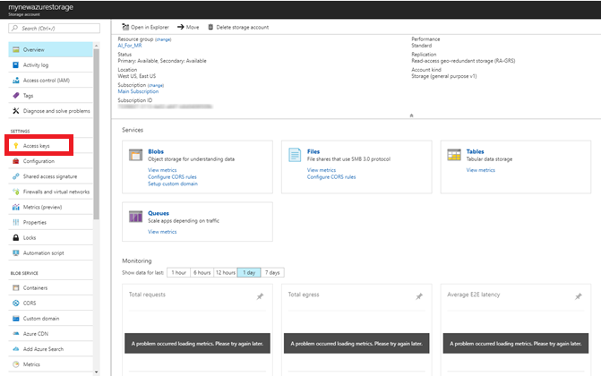

9.  Click *Access keys*, to reveal the endpoints for this cloud service. Use *Notepad* or similar, to copy one of your keys for use later. Also, note the *Connection string* value, as it will be used in the *AzureServices* class, which you will create later.

    

## Chapter 2 - Setting up an Azure Function

You will now write an **Azure** **Function** in the Azure Service.

You can use an **Azure Function** to do nearly anything that you would do with a classic function in your code, the difference being that this function can be accessed by any application that has credentials to
access your Azure Account.

To create an Azure Function:

1.  From your *Azure Portal*, click on **New** in the top left corner, and search for *Function App*, and click **Enter**.

    

    > [!NOTE]
    > The word **New** may have been replaced with **Create a resource**, in newer portals.

2.  The new page will provide a description of the *Azure Function App* service. At the bottom left of this prompt, select the **Create** button, to create an association with this service.

    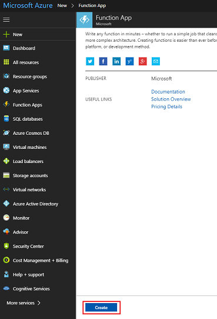

3.  Once you have clicked on **Create**:

    1.  Provide an *App name*. Only letters and numbers can be used here
    (either upper or lower case is allowed).

    2.  Select your preferred *Subscription*.

    3. Choose a *Resource Group* or create a new one. A resource group provides a way to monitor, control access, provision and manage billing for a collection of Azure assets. It is recommended to keep all the Azure services associated with a single project (e.g. such as these labs) under a common resource group). 

        > If you wish to read more about Azure Resource Groups, please [visit the resource group article](/azure/azure-resource-manager/resource-group-portal).

    4.  For this exercise, select *Windows* as the chosen **OS**.

    5.  Select *Consumption Plan* for the **Hosting Plan**.

    6.  Determine the *Location* for your resource group (if you are creating a new Resource Group). The location would ideally be in the region where the application would run. Some Azure assets are only
    available in certain regions. For optimal performance, select the same region as the storage account.

    7.  For *Storage*, select **Use existing**, and then using the
    dropdown menu, find your previously created storage.

    8.  Leave *Application Insights* off for this exercise.

        

4.  Click the **Create** button.

5.  Once you have clicked on **Create**, you will have to wait for the service to be created, this might take a minute.

6.  A notification will appear in the portal once the Service instance is created.

    

7.	Click on the notifications to explore your new Service instance. 

    

8.  Click the **Go to resource** button in the notification to explore your new Service instance. You will be taken to your new *Function App* service instance.

9.  On the *Function App* dashboard, hover your mouse over *Functions*, found within the panel on the left, and then click the **+ (plus)** symbol.

    

10. On the next page, ensure **Webhook + API** is selected, and for *Choose a language,* select **CSharp**, as this will be the language used for this tutorial. Lastly, click the **Create this function** button.

    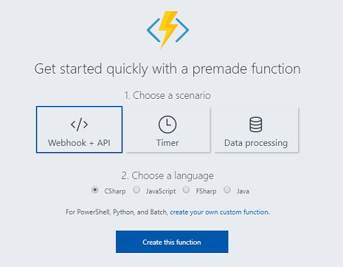

11. You should be taken to the code page (run.csx), if not though, click on the newly created Function in the Functions list within the panel on the left.

    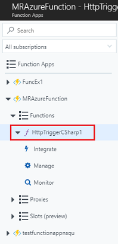

12. Copy the following code into your function. This function will simply return a random integer between 0 and 2 when called. Do not worry about the existing code, feel free to paste over the top of it.

    ```csharp
        using System.Net;
        using System.Threading.Tasks;

        public static int Run(CustomObject req, TraceWriter log)
        {
            Random rnd = new Random();
            int randomInt = rnd.Next(0, 3);
            return randomInt;
        }

        public class CustomObject
        {
            public String name {get; set;}
        }
    ```

13. Select **Save**.

14. The result should look like the image below.

15. Click on **Get function URL** and take note of the *endpoint* displayed. You will need to insert it into the *AzureServices* class that you will create later in this course.

    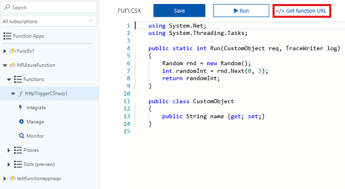

    

## Chapter 3 - Setting up the Unity project

The following is a typical set up for developing with Mixed Reality, and as such, is a good template for other projects.

Set up and test your mixed reality immersive headset.

> [!NOTE]
> You will **not** require Motion Controllers for this course. If you need support setting up the immersive headset, please [visit the mixed reality set up article](https://support.microsoft.com/help/4043101/windows-10-set-up-windows-mixed-reality).

1.  Open Unity and click **New**.

    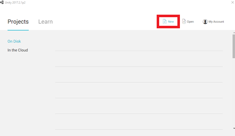

2.  You will now need to provide a Unity Project name. Insert **MR_Azure_Functions**. Make sure the project type is set to **3D**. Set the *Location* to somewhere appropriate for you (remember, closer to root directories is better). Then, click **Create project**.

    

3.  With Unity open, it is worth checking the default **Script Editor** is set to **Visual Studio**. Go to **Edit** > **Preferences** and then from the new window, navigate to **External Tools**. Change **External Script Editor** to **Visual Studio 2017**. Close the **Preferences** window.

    

4.  Next, go to **File** > **Build Settings** and switch the platform to **Universal Windows Platform**, by clicking on the **Switch Platform** button.

    

5.	Go to **File** > **Build Settings** and make sure that:

    1. **Target Device** is set to **Any Device**.

        > For Microsoft HoloLens, set **Target Device** to *HoloLens*.

    2. **Build Type** is set to **D3D**

    3. **SDK** is set to **Latest installed**

    4. **Visual Studio Version** is set to **Latest installed**

    5. **Build and Run** is set to **Local Machine**

    6. Save the scene and add it to the build.

        1.  Do this by selecting **Add Open Scenes**. A save window will appear.

            

        2.  Create a new folder for this, and any future, scene, then select the **New folder** button, to create a new folder, name it **Scenes**.

            

        3.  Open your newly created **Scenes** folder, and then in the **File name:** text field, type **FunctionsScene**, then press **Save**.

            

6.  The remaining settings, in **Build Settings**, should be left as default for now.

    

7.  In the *Build Settings* window, click on the **Player Settings** button, this will open the related panel in the space where the *Inspector* is located.

    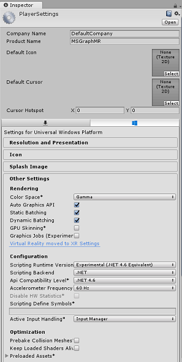

8.  In this panel, a few settings need to be verified:

    1.  In the **Other Settings** tab:

        1.  **Scripting Runtime Version** should be **Experimental** (.NET 4.6 Equivalent), which will trigger a need to restart the Editor.
        2.  **Scripting Backend** should be **.NET**
        3.  **API Compatibility Level** should be **.NET 4.6**

    2.  Within the **Publishing Settings** tab, under **Capabilities**, check:
        
        -  **InternetClient**

            

    3.  Further down the panel, in **XR Settings** (found below **Publishing Settings**), tick **Virtual Reality Supported**, make sure the **Windows Mixed Reality SDK** is added.

        

9.  Back in *Build Settings* *Unity C# Projects* is no longer greyed out; tick the checkbox next to this.

    

10.  Close the Build Settings window.

11. Save your Scene and Project (**FILE** > **SAVE SCENE / FILE** > **SAVE PROJECT**).

## Chapter 4 - Setup Main Camera

> [!IMPORTANT]
> If you wish to skip the *Unity Set up* components of this course, and continue straight into code, feel free to [download this .unitypackage](https://github.com/Microsoft/HolographicAcademy/raw/Azure-MixedReality-Labs/Azure%20Mixed%20Reality%20Labs/MR%20and%20Azure%20305%20-%20Functions%20and%20storage/Azure-MR-305.unitypackage), and import it into your project as a [Custom Package](https://docs.unity3d.com/Manual/AssetPackages.html). This will also contain the DLLs from the next Chapter. After import, continue from [Chapter 7](#chapter-7---create-the-azureservices-class). 

1.  In the *Hierarchy Panel*, you will find an object called **Main Camera**, this object represents your "head" point of view once you are "inside" your application.

2.  With the Unity Dashboard in front of you, select the **Main Camera GameObject**. You will notice that the *Inspector Panel* (generally found to the right, within the Dashboard) will show the various components of that *GameObject*, with *Transform* at the top, followed by *Camera*, and some other components. You will need to reset the Transform of the Main Camera, so it is positioned correctly.

3.  To do this, select the **Gear** icon next to the Camera's *Transform* component, and select **Reset**.

    

4.  Then update the **Transform** component to look like:

    |         |    TRANSFORM - POSITION   |       |
    | :-----: | :-----------------------: | :----:|
    | **X**   | **Y**                     | **Z** |
    | 0       | 1                         | 0     |    

    |       | TRANSFORM - ROTATION |       |
    | :---: | :------------------: | :----:|
    | **X** | **Y**                | **Z** |
    | 0     | 0                    | 0     |

    |       | TRANSFORM - SCALE |       |
    | :---: | :---------------: | :---: |
    | **X** | **Y**             | **Z** |
    | 1     | 1                 | 1     |

    

## Chapter 5 - Setting up the Unity scene

1.  Right-click in an empty area of the *Hierarchy Panel*, under **3D  Object**, add a **Plane**.

    

2.  With the **Plane** object selected, change the following parameters in the *Inspector Panel*:

    |       | TRANSFORM - POSITION |       |
    | :---: | :------------------: | :---: |
    | **X** | **Y**                | **Z** |
    | 0     | 0                    | 4     |

    |       | TRANSFORM - SCALE |       |
    | :---: | :---------------: | :---: |
    | **X** | **Y**             | **Z** |
    | 10    | 1                 | 10    |

    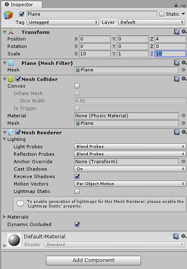

    

3.  Right-click in an empty area of the *Hierarchy Panel*, under **3D Object**, add a **Cube**.

    1.  Rename the Cube to **GazeButton** (with the Cube selected, press 'F2').

    2.  Change the following parameters in the *Inspector Panel*:

        |       | TRANSFORM - POSITION |       |
        | :---: | :------------------: |:-----:|
        | **X** | **Y**                | **Z** |
        | 0     | 3                    | 5     |


        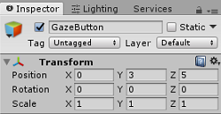

        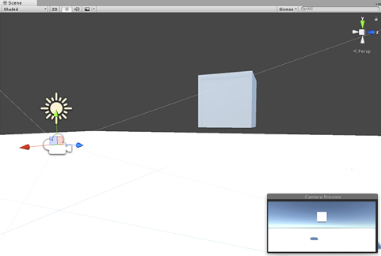

    3.  Click on the **Tag** drop-down button and click on **Add Tag** to open the *Tags & Layers Pane*.

        

        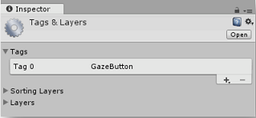

    4.  Select the **+ (plus)** button, and in the *New Tag Name* field, enter **GazeButton**, and press **Save**.

        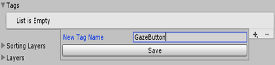

    5.  Click on the **GazeButton** object in the *Hierarchy Panel*, and in the *Inspector Panel*, assign the newly created **GazeButton** tag.

        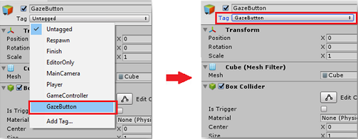

4.  Right-click on the **GazeButton** object, in the *Hierarchy Panel*, and add an **Empty GameObject** (which will be added as a *child* object).

5.  Select the new object and rename it **ShapeSpawnPoint**.

    1.  Change the following parameters in the *Inspector Panel*:

        |       | TRANSFORM - POSITION |       |
        | :---: | :------------------: |:----: |
        | **X** |**Y**                 | **Z** |
        | 0     | -1                   | 0     |

        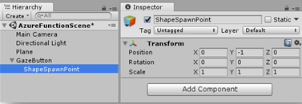

        

6.  Next you will create a **3D Text** object to provide feedback on the status of the Azure service.

    Right click on the **GazeButton** in the Hierarchy Panel again and add a **3D Object** > **3D Text** object as a *child*.

    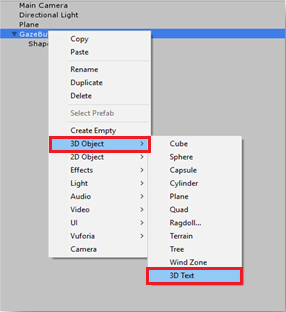

7.  Rename the **3D Text** object to **AzureStatusText**.

8.  Change the **AzureStatusText** object Transform as follows:

    |       | TRANSFORM - POSITION |       |
    | :---: | :------------------: | :---: |
    | **X** | **Y**                | **Z** |
    | 0     | 0                    | -0.6  |

    |       | TRANSFORM - SCALE |       |
    | :---: | :---------------: | :---: |
    | **X** | **Y**             | **Z** |
    | 0.1   | 0.1               | 0.1   |


    > [!NOTE]
    > Do not worry if it appears to be off-centre, as this will be fixed when the below Text Mesh component is updated.

9.  Change the **Text Mesh** component to match the below:

    

    > [!TIP]
    > The selected color here is Hex color: **000000FF**, though feel free to choose your own, just ensure it is readable.

10. Your Hierarchy Panel structure should now look like this:

    

10. Your scene should now look like this:

    


## Chapter 6 - Import Azure Storage for Unity

You will be using Azure Storage for Unity (which itself leverages the .Net SDK for Azure). You can read more about this at the [Azure Storage for Unity article](/sandbox/gamedev/unity/azure-storage-unity).

There is currently a known issue in Unity which requires plugins to be reconfigured after import. These steps (4 - 7 in this section) will no longer be required after the bug has been resolved.

To import the SDK into your own project, make sure you have downloaded the latest ['.unitypackage' from GitHub](https://aka.ms/azstorage-unitysdk). Then, do the following:

1.  Add the **.unitypackage** file to Unity by using the **Assets** > **Import Package** > **Custom Package** menu option.

2.  In the **Import Unity Package** box that pops up, you can select everything under **Plugin** > **Storage**. Uncheck everything else, as it is not needed for this course.

    

3.  Click the **Import** button to add the items to your project.

4.  Go to the *Storage* folder under *Plugins*, in the Project view, and select the following plugins *only*:

    -   Microsoft.Data.Edm
    -   Microsoft.Data.OData
    -   Microsoft.WindowsAzure.Storage
    -   Newtonsoft.Json
    -   System.Spatial

        

5.  With *these specific plugins* selected, **uncheck** *Any Platform* and **uncheck** *WSAPlayer* then click **Apply**.

    

    > [!NOTE]
    > We are marking these particular plugins to only be used in the Unity Editor. This is because there are different versions of the same plugins in the WSA folder that will be used after the project is exported from Unity.

6.  In the *Storage* plugin folder, select only:

    -   Microsoft.Data.Services.Client

        

7.  Check the **Don't Process** box under *Platform Settings* and click **Apply**.

    

    > [!NOTE]
    > We are marking this plugin "Don't process" because the Unity assembly patcher has difficulty processing this plugin. The plugin will still work even though it is not processed.

## Chapter 7 - Create the AzureServices class

The first class you are going to create is the *AzureServices* class.

The *AzureServices* class will be responsible for:

-   Storing Azure Account credentials.

-   Calling your Azure App Function.

-   The upload and download of the data file in your Azure Cloud Storage.

To create this Class:

1.  Right-click in the *Asset* Folder, located in the Project Panel, **Create** > **Folder**. Name the folder **Scripts**.

    

    

2.  Double click on the folder just created, to open it.

3.  Right-click inside the folder, **Create** > **C# Script**. Call the script *AzureServices*.

4.  Double click on the new *AzureServices* class to open it with *Visual Studio*.

5.  Add the following namespaces to the top of the *AzureServices*:

    ```csharp
        using System;
        using System.Threading.Tasks;
        using UnityEngine;
        using Microsoft.WindowsAzure.Storage;
        using Microsoft.WindowsAzure.Storage.File;
        using System.IO;
        using System.Net;
    ```

6.  Add the following Inspector Fields inside the *AzureServices* class:

    ```csharp
        /// <summary>
        /// Provides Singleton-like behavior to this class.
        /// </summary>
        public static AzureServices instance;

        /// <summary>
        /// Reference Target for AzureStatusText Text Mesh object
        /// </summary>
        public TextMesh azureStatusText;
    ```

7.  Then add the following member variables inside the *AzureServices* class:

    ```csharp
        /// <summary>
        /// Holds the Azure Function endpoint - Insert your Azure Function
        /// Connection String here.
        /// </summary>

        private readonly string azureFunctionEndpoint = "--Insert here you AzureFunction Endpoint--";

        /// <summary>
        /// Holds the Storage Connection String - Insert your Azure Storage
        /// Connection String here.
        /// </summary>
        private readonly string storageConnectionString = "--Insert here you AzureStorage Connection String--";

        /// <summary>
        /// Name of the Cloud Share - Hosts directories.
        /// </summary>
        private const string fileShare = "fileshare";

        /// <summary>
        /// Name of a Directory within the Share
        /// </summary>
        private const string storageDirectory = "storagedirectory";

        /// <summary>
        /// The Cloud File
        /// </summary>
        private CloudFile shapeIndexCloudFile;

        /// <summary>
        /// The Linked Storage Account
        /// </summary>
        private CloudStorageAccount storageAccount;

        /// <summary>
        /// The Cloud Client
        /// </summary>
        private CloudFileClient fileClient;

        /// <summary>
        /// The Cloud Share - Hosts Directories
        /// </summary>
        private CloudFileShare share;

        /// <summary>
        /// The Directory in the share that will host the Cloud file
        /// </summary>
        private CloudFileDirectory dir;
    ```

    > [!IMPORTANT]
    > Make sure you replace the *endpoint* and *connection string* values with the values from your Azure storage, found in the Azure Portal

8.  Code for *Awake()* and *Start()* methods now needs to be added. These methods will be called when the class initializes:

    ```csharp
        private void Awake()
        {
            instance = this;
        }

        // Use this for initialization
        private void Start()
        {
            // Set the Status text to loading, whilst attempting connection to Azure.
            azureStatusText.text = "Loading...";
        }

        /// <summary>
        /// Call to the Azure Function App to request a Shape.
        /// </summary>
        public async void CallAzureFunctionForNextShape()
        {

        }
    ```

    > [!IMPORTANT]
    > We will fill in the code for *CallAzureFunctionForNextShape()* in a [future Chapter](#chapter-10---completing-the-azureservices-class).

9.  Delete the *Update()* method since this class will not use it.

10. Save your changes in Visual Studio, and then return to Unity.

11. Click and drag the *AzureServices* class from the Scripts folder to the Main Camera object in the *Hierarchy Panel*.

12. Select the Main Camera, then grab the **AzureStatusText** child object from beneath the **GazeButton** object, and place it within the **AzureStatusText** reference target field, in the *Inspector*, to provide the reference to the *AzureServices* script.

    

## Chapter 8 - Create the ShapeFactory class

The next script to create, is the *ShapeFactory* class. The role of this class is to create a new shape, when requested, and keep a history of the shapes created in a *Shape History List*. Every time a shape is created, the *Shape History list* is updated in the *AzureService* class, and then stored in your *Azure Storage*. When the application starts, if a stored file is found in your *Azure Storage*, the *Shape History list* is retrieved and replayed, with the **3D Text** object providing whether the generated shape is from storage, or new.

To create this class:

1.  Go to the **Scripts** folder you created previously.

2.  Right-click inside the folder, **Create** > **C# Script**. Call the script *ShapeFactory*.

3.  Double click on the new *ShapeFactory* script to open it with *Visual Studio*.

4.  Ensure the *ShapeFactory* class includes the following namespaces:

    ```csharp
        using System.Collections.Generic;
        using UnityEngine;
    ```

5.  Add the variables shown below to the *ShapeFactory* class, and replace the *Start()* and *Awake()* functions with those below:

    ```csharp
        /// <summary>
        /// Provide this class Singleton-like behaviour
        /// </summary>
        [HideInInspector]
        public static ShapeFactory instance;

        /// <summary>
        /// Provides an Inspector exposed reference to ShapeSpawnPoint
        /// </summary>
        [SerializeField]
        public Transform spawnPoint;

        /// <summary>
        /// Shape History Index
        /// </summary>
        [HideInInspector]
        public List<int> shapeHistoryList;

        /// <summary>
        /// Shapes Enum for selecting required shape
        /// </summary>
        private enum Shapes { Cube, Sphere, Cylinder }

        private void Awake()
        {
            instance = this;
        }

        private void Start()
        {
            shapeHistoryList = new List<int>();
        }
    ```

6.  The *CreateShape()* method generates the primitive shapes, based upon the provided *integer* parameter. The Boolean parameter is used to specify whether the currently created shape is from storage, or new. Place the following code in your *ShapeFactory* class, below the previous methods:

    ```csharp
        /// <summary>
        /// Use the Shape Enum to spawn a new Primitive object in the scene
        /// </summary>
        /// <param name="shape">Enumerator Number for Shape</param>
        /// <param name="storageShape">Provides whether this is new or old</param>
        internal void CreateShape(int shape, bool storageSpace)
        {
            Shapes primitive = (Shapes)shape;
            GameObject newObject = null;
            string shapeText = storageSpace == true ? "Storage: " : "New: ";

            AzureServices.instance.azureStatusText.text = string.Format("{0}{1}", shapeText, primitive.ToString());

            switch (primitive)
            {
                case Shapes.Cube:
                newObject = GameObject.CreatePrimitive(PrimitiveType.Cube);
                break;

                case Shapes.Sphere:
                newObject = GameObject.CreatePrimitive(PrimitiveType.Sphere);
                break;

                case Shapes.Cylinder:
                newObject = GameObject.CreatePrimitive(PrimitiveType.Cylinder);
                break;
            }

            if (newObject != null)
            {
                newObject.transform.position = spawnPoint.position;

                newObject.transform.localScale = new Vector3(0.5f, 0.5f, 0.5f);

                newObject.AddComponent<Rigidbody>().useGravity = true;

                newObject.GetComponent<Renderer>().material.color = UnityEngine.Random.ColorHSV(0f, 1f, 1f, 1f, 0.5f, 1f);
            }
        }
    ```

7.  Be sure to save your changes in Visual Studio before returning to Unity.

8.  Back in the Unity Editor, click and drag the *ShapeFactory* class from the **Scripts** folder to the **Main Camera** object in the *Hierarchy Panel*.

9. With the Main Camera selected you will notice the *ShapeFactory* script component is missing the *Spawn Point* reference. To fix it, drag the **ShapeSpawnPoint** object from the *Hierarchy Panel* to the **Spawn Point** reference target.

    

## Chapter 9 - Create the Gaze class

The last script you need to create is the *Gaze* class.

This class is responsible for creating a **Raycast** that will be projected forward from the Main Camera, to detect which object the user is looking at. In this case, the Raycast will need to identify if the user is looking at the **GazeButton** object in the scene and trigger a behavior.

To create this Class:

1.  Go to the **Scripts** folder you created previously.

2.  Right-click in the Project Panel, **Create** > **C# Script**. Call the script *Gaze*.

3.  Double click on the new *Gaze* script to open it with *Visual Studio.*

4.  Ensure the following namespace is included at the top of the script:

    ```csharp
        using UnityEngine;
    ```

5.  Then add the following variables inside the *Gaze* class:

    ```csharp
        /// <summary>
        /// Provides Singleton-like behavior to this class.
        /// </summary>
        public static Gaze instance;

        /// <summary>
        /// The Tag which the Gaze will use to interact with objects. Can also be set in editor.
        /// </summary>
        public string InteractibleTag = "GazeButton";

        /// <summary>
        /// The layer which will be detected by the Gaze ('~0' equals everything).
        /// </summary>
        public LayerMask LayerMask = ~0;

        /// <summary>
        /// The Max Distance the gaze should travel, if it has not hit anything.
        /// </summary>
        public float GazeMaxDistance = 300;

        /// <summary>
        /// The size of the cursor, which will be created.
        /// </summary>
        public Vector3 CursorSize = new Vector3(0.05f, 0.05f, 0.05f);

        /// <summary>
        /// The color of the cursor - can be set in editor.
        /// </summary>
        public Color CursorColour = Color.HSVToRGB(0.0223f, 0.7922f, 1.000f);

        /// <summary>
        /// Provides when the gaze is ready to start working (based upon whether
        /// Azure connects successfully).
        /// </summary>
        internal bool GazeEnabled = false;

        /// <summary>
        /// The currently focused object.
        /// </summary>
        internal GameObject FocusedObject { get; private set; }

        /// <summary>
        /// The object which was last focused on.
        /// </summary>
        internal GameObject _oldFocusedObject { get; private set; }

        /// <summary>
        /// The info taken from the last hit.
        /// </summary>
        internal RaycastHit HitInfo { get; private set; }

        /// <summary>
        /// The cursor object.
        /// </summary>
        internal GameObject Cursor { get; private set; }

        /// <summary>
        /// Provides whether the raycast has hit something.
        /// </summary>
        internal bool Hit { get; private set; }

        /// <summary>
        /// This will store the position which the ray last hit.
        /// </summary>
        internal Vector3 Position { get; private set; }

        /// <summary>
        /// This will store the normal, of the ray from its last hit.
        /// </summary>
        internal Vector3 Normal { get; private set; }

        /// <summary>
        /// The start point of the gaze ray cast.
        /// </summary>
        private Vector3 _gazeOrigin;

        /// <summary>
        /// The direction in which the gaze should be.
        /// </summary>
        private Vector3 _gazeDirection;
    ```

> [!IMPORTANT]
> Some of these variables will be able to be edited in the *Editor*.

6.  Code for the *Awake()* and *Start()* methods now needs to be added.

    ```csharp
        /// <summary>
        /// The method used after initialization of the scene, though before Start().
        /// </summary>
        private void Awake()
        {
            // Set this class to behave similar to singleton
            instance = this;
        }

        /// <summary>
        /// Start method used upon initialization.
        /// </summary>
        private void Start()
        {
            FocusedObject = null;
            Cursor = CreateCursor();
        }
    ```

7.  Add the following code, which will create a cursor object at start, along with the *Update()* method, which will run the Raycast method, along with being where the GazeEnabled boolean is toggled:

    ```csharp
        /// <summary>
        /// Method to create a cursor object.
        /// </summary>
        /// <returns></returns>
        private GameObject CreateCursor()
        {
            GameObject newCursor = GameObject.CreatePrimitive(PrimitiveType.Sphere);
            newCursor.SetActive(false);

            // Remove the collider, so it doesn't block raycast.
            Destroy(newCursor.GetComponent<SphereCollider>());
            newCursor.transform.localScale = CursorSize;

            newCursor.GetComponent<MeshRenderer>().material = new Material(Shader.Find("Diffuse"))
            {
                color = CursorColour
            };

            newCursor.name = "Cursor";

            newCursor.SetActive(true);

            return newCursor;
        }

        /// <summary>
        /// Called every frame
        /// </summary>
        private void Update()
        {
            if(GazeEnabled == true)
            {
                _gazeOrigin = Camera.main.transform.position;

                _gazeDirection = Camera.main.transform.forward;

                UpdateRaycast();
            }
        }
    ```

8. Next add the *UpdateRaycast()* method, which will project a Raycast and detect the hit target.

    ```csharp
        private void UpdateRaycast()
        {
            // Set the old focused gameobject.
            _oldFocusedObject = FocusedObject;

            RaycastHit hitInfo;

            // Initialise Raycasting.
            Hit = Physics.Raycast(_gazeOrigin,
                _gazeDirection,
                out hitInfo,
                GazeMaxDistance, LayerMask);

            HitInfo = hitInfo;

            // Check whether raycast has hit.
            if (Hit == true)
            {
                Position = hitInfo.point;

                Normal = hitInfo.normal;

                // Check whether the hit has a collider.
                if (hitInfo.collider != null)
                {
                    // Set the focused object with what the user just looked at.
                    FocusedObject = hitInfo.collider.gameObject;
                }
                else
                {
                    // Object looked on is not valid, set focused gameobject to null.
                    FocusedObject = null;
                }
            }
            else
            {
                // No object looked upon, set focused gameobject to null.
                FocusedObject = null;

                // Provide default position for cursor.
                Position = _gazeOrigin + (_gazeDirection * GazeMaxDistance);

                // Provide a default normal.
                Normal = _gazeDirection;
            }

            // Lerp the cursor to the given position, which helps to stabilize the gaze.
            Cursor.transform.position = Vector3.Lerp(Cursor.transform.position, Position, 0.6f);

            // Check whether the previous focused object is this same 
            //    object. If so, reset the focused object.
            if (FocusedObject != _oldFocusedObject)
            {
                ResetFocusedObject();

                if (FocusedObject != null)
                {
                if (FocusedObject.CompareTag(InteractibleTag.ToString()))
                {
                        // Set the Focused object to green - success!
                        FocusedObject.GetComponent<Renderer>().material.color = Color.green;

                        // Start the Azure Function, to provide the next shape!
                        AzureServices.instance.CallAzureFunctionForNextShape();
                    }
                }
            }
        }
    ```

9. Lastly, add the *ResetFocusedObject()* method, which will toggle the GazeButton objects current color, indicating whether it is creating a new shape or not.

    ```csharp
        /// <summary>
        /// Reset the old focused object, stop the gaze timer, and send data if it
        /// is greater than one.
        /// </summary>
        private void ResetFocusedObject()
        {
            // Ensure the old focused object is not null.
            if (_oldFocusedObject != null)
            {
                if (_oldFocusedObject.CompareTag(InteractibleTag.ToString()))
                {
                    // Set the old focused object to red - its original state.
                    _oldFocusedObject.GetComponent<Renderer>().material.color = Color.red;
                }
            }
        }
    ```

10.  Save your changes in Visual Studio before returning to Unity.

11.  Click and drag the *Gaze* class from the Scripts folder to the **Main Camera** object in the *Hierarchy Panel*.

## Chapter 10 - Completing the AzureServices class

With the other scripts in place, it is now possible to *complete* the *AzureServices* class. This will be achieved through:

1.  Adding a new method named *CreateCloudIdentityAsync()*, to set up the authentication variables needed for communicating with Azure.

    > This method will also check for the existence of a previously stored File containing the Shape List.
    >
    > **If the file is found**, it will disable the user *Gaze*, and trigger Shape creation, according to the pattern of shapes, as stored in the **Azure Storage file**. The user can see this, as the **Text Mesh** will provide display 'Storage' or 'New', depending on the shapes origin.
    >
    > **If no file is found**, it will enable the *Gaze*, enabling the user to create shapes when looking at the **GazeButton** object in the scene.

    ```csharp
        /// <summary>
        /// Create the references necessary to log into Azure
        /// </summary>
        private async void CreateCloudIdentityAsync()
        {
            // Retrieve storage account information from connection string
            storageAccount = CloudStorageAccount.Parse(storageConnectionString);

            // Create a file client for interacting with the file service.
            fileClient = storageAccount.CreateCloudFileClient();

            // Create a share for organizing files and directories within the storage account.
            share = fileClient.GetShareReference(fileShare);

            await share.CreateIfNotExistsAsync();

            // Get a reference to the root directory of the share.
            CloudFileDirectory root = share.GetRootDirectoryReference();

            // Create a directory under the root directory
            dir = root.GetDirectoryReference(storageDirectory);

            await dir.CreateIfNotExistsAsync();

            //Check if the there is a stored text file containing the list
            shapeIndexCloudFile = dir.GetFileReference("TextShapeFile");

            if (!await shapeIndexCloudFile.ExistsAsync())
            {
                // File not found, enable gaze for shapes creation
                Gaze.instance.GazeEnabled = true;

                azureStatusText.text = "No Shape\nFile!";
            }
            else
            {
                // The file has been found, disable gaze and get the list from the file
                Gaze.instance.GazeEnabled = false;

                azureStatusText.text = "Shape File\nFound!";

                await ReplicateListFromAzureAsync();
            }
        }
    ```

2.  The next code snippet is from within the *Start()* method; wherein a call will be made to the *CreateCloudIdentityAsync()* method. Feel free to copy over your current *Start()* method, with the below:

    ```csharp
        private void Start()
        {
            // Disable TLS cert checks only while in Unity Editor (until Unity adds support for TLS)
    #if UNITY_EDITOR
            ServicePointManager.ServerCertificateValidationCallback = delegate { return true; };
    #endif

            // Set the Status text to loading, whilst attempting connection to Azure.
            azureStatusText.text = "Loading...";

            //Creating the references necessary to log into Azure and check if the Storage Directory is empty
            CreateCloudIdentityAsync();
        }
    ```

3.  Fill in the code for the method *CallAzureFunctionForNextShape()*. You will use the previously created *Azure Function App* to request a shape index. Once the new shape is received, this method will send the shape to the *ShapeFactory* class to create the new shape in the scene. Use the code below to complete the body of *CallAzureFunctionForNextShape()*.

    ```csharp
        /// <summary>
        /// Call to the Azure Function App to request a Shape.
        /// </summary>
        public async void CallAzureFunctionForNextShape()
        {
            int azureRandomInt = 0;

            // Call Azure function
            HttpWebRequest webRequest = WebRequest.CreateHttp(azureFunctionEndpoint);

            WebResponse response = await webRequest.GetResponseAsync();

            // Read response as string
            using (Stream stream = response.GetResponseStream())
            {
                StreamReader reader = new StreamReader(stream);

                String responseString = reader.ReadToEnd();

                //parse result as integer
                Int32.TryParse(responseString, out azureRandomInt);
            }

            //add random int from Azure to the ShapeIndexList
            ShapeFactory.instance.shapeHistoryList.Add(azureRandomInt);

            ShapeFactory.instance.CreateShape(azureRandomInt, false);

            //Save to Azure storage
            await UploadListToAzureAsync();
        }
    ```

4.  Add a method to create a string, by concatenating the integers stored in the shape history list, and saving it in your *Azure Storage File*.

    ```csharp
        /// <summary>
        /// Upload the locally stored List to Azure
        /// </summary>
        private async Task UploadListToAzureAsync()
        {
            // Uploading a local file to the directory created above
            string listToString = string.Join(",", ShapeFactory.instance.shapeHistoryList.ToArray());

            await shapeIndexCloudFile.UploadTextAsync(listToString);
        }
    ```

5.  Add a method to retrieve the text stored in the file located in your *Azure Storage File* and *deserialize* it into a list.

6.  Once this process is completed, the method re-enables the gaze so that the user can add more shapes to the scene.

    ```csharp
        ///<summary>
        /// Get the List stored in Azure and use the data retrieved to replicate 
        /// a Shape creation pattern
        ///</summary>
        private async Task ReplicateListFromAzureAsync()
        {
            string azureTextFileContent = await shapeIndexCloudFile.DownloadTextAsync();

            string[] shapes = azureTextFileContent.Split(new char[] { ',' });

            foreach (string shape in shapes)
            {
                int i;

                Int32.TryParse(shape.ToString(), out i);

                ShapeFactory.instance.shapeHistoryList.Add(i);

                ShapeFactory.instance.CreateShape(i, true);

                await Task.Delay(500);
            }

            Gaze.instance.GazeEnabled = true;

            azureStatusText.text = "Load Complete!";
        }
    ```

7.  Save your changes in Visual Studio before returning to Unity.

## Chapter 11 - Build the UWP Solution

To begin the Build process:

1.  Go to **File** > **Build Settings**.

    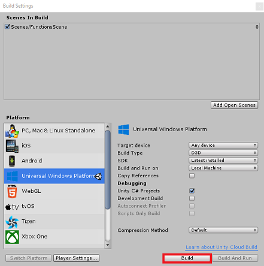

2.  Click **Build**. Unity will launch a *File Explorer* window, where you need to create and then select a folder to build the app into. Create that folder now, and name it *App*. Then with the *App* folder selected, press **Select Folder**.

3.  Unity will begin building your project to the *App* folder.

4.  Once Unity has finished building (it might take some time), it will open a *File Explorer* window at the location of your build (check your task bar, as it may not always appear above your windows, but will notify you of the addition of a new window).

## Chapter 12 - Deploying your application

To deploy your application:

1.  Navigate to the *App* folder which was created in the [last Chapter](#chapter-11---build-the-uwp-solution). You will see a file with your apps name, with the '.sln' extension, which you should double-click, so to open it within *Visual Studio*.

2.  In the **Solution Platform**, select **x86, Local Machine**.

3.  In the **Solution Configuration** select **Debug**.

    > For the Microsoft HoloLens, you may find it easier to set this to *Remote Machine*, so that you are not tethered to your computer. Though, you will need to also do the following:
    > - Know the **IP Address** of your HoloLens, which can be found within the **Settings** > **Network & Internet** > **Wi-Fi** > **Advanced Options**; the IPv4 is the address you should use. 
    > - Ensure **Developer Mode** is **On**; found in **Settings** > **Update & Security** > **For developers**.

    

4.  Go to the **Build** menu and click on **Deploy Solution** to
    sideload the application to your machine.

5.  Your App should now appear in the list of installed apps, ready to
    be launched and tested!

## Your finished Azure Functions and Storage Application

Congratulations, you built a mixed reality app that leverages both the Azure Functions and Azure Storage services. Your app will be able to draw on stored data, and provide an action based on that data.


## Bonus exercises

### Exercise 1

Create a second spawn point and record which spawn point an object was created from. When you load the data file, replay the shapes being spawned from the location they originally were created.

### Exercise 2

Create a way to restart the app, rather than having to re-open it each time. **Loading Scenes** is a good spot to start. After doing that, create a way to clear the stored list in *Azure Storage*, so that it can be easily reset from your app.