# HoloLens (1st gen) and Azure 307: Machine learning

<br>

>[!NOTE]
>The Mixed Reality Academy tutorials were designed with HoloLens (1st gen) and Mixed Reality Immersive Headsets in mind.  As such, we feel it is important to leave these tutorials in place for developers who are still looking for guidance in developing for those devices.  These tutorials will **_not_** be updated with the latest toolsets or interactions being used for HoloLens 2.  They will be maintained to continue working on the supported devices. There will be a new series of tutorials that will be posted in the future that will demonstrate how to develop for HoloLens 2.  This notice will be updated with a link to those tutorials when they are posted.

<br>

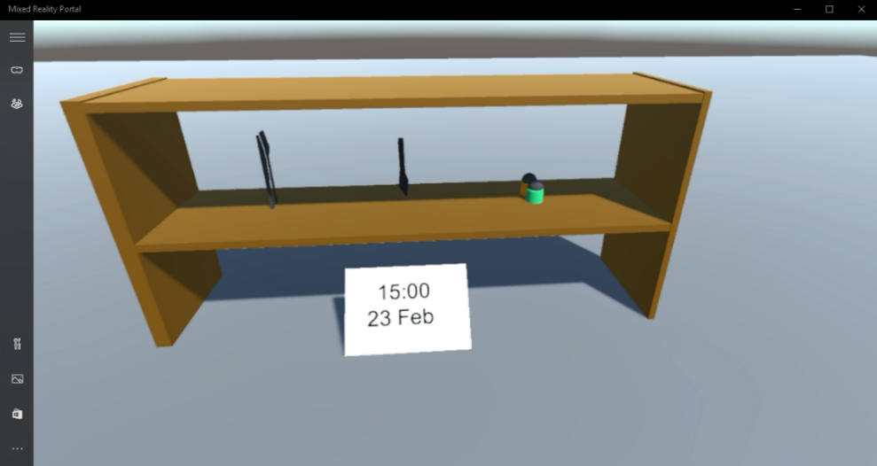

In this course, you will learn how to add Machine Learning (ML) capabilities to a mixed reality application using Azure Machine Learning Studio (classic).

*Azure Machine Learning Studio (classic)* is a Microsoft service, which provides developers with a large number of machine learning algorithms, which can help with data input, output, preparation, and visualization. From these components, it is then possible to develop a predictive analytics experiment, iterate on it, and use it to train your model. Following training, you can make your model operational within the Azure cloud, so that it can then score new data. For more information, visit the [Azure Machine Learning Studio (classic) page](https://azure.microsoft.com/services/machine-learning-studio/).

Having completed this course, you will have a mixed reality immersive headset application, and will have learned how do the following:

1.  Provide a table of sales data to the *Azure Machine Learning Studio (classic)* portal, and design an algorithm to predict future sales of popular items.
2.  Create a **Unity Project**, which can receive and interpret prediction data from the ML service.
3.  Display the predication data visually within the **Unity Project**, through providing the most popular sales items, on a shelf.

In your application, it is up to you as to how you will integrate the results with your design. This course is designed to teach you how to integrate an Azure Service with your Unity Project. It is your job to use the knowledge you gain from this course to enhance your mixed reality application.

This course is a self-contained tutorial, which does not directly involve any other Mixed Reality Labs.

## Device support

<table>
<tr>
<th>Course</th><th> <a href="/hololens/hololens1-hardware">HoloLens</a></th><th> <a href="/windows/mixed-reality/enthusiast-guide/immersive-headset-hardware-details">Immersive headsets</a></th>
</tr><tr>
<td> MR and Azure 307: Machine learning</td><td> ✔️</td><td> ✔️</td>
</tr>
</table>

> [!NOTE]
> While this course primarily focuses on Windows Mixed Reality immersive (VR) headsets, you can also apply what you learn in this course to Microsoft HoloLens. As you follow along with the course, you will see notes on any changes you might need to employ to support HoloLens. When using HoloLens, you may notice some echo during voice capture.

## Prerequisites

> [!NOTE]
> This tutorial is designed for developers who have basic experience with Unity and C#. Please also be aware that the prerequisites and written instructions within this document represent what has been tested and verified at the time of writing (May 2018). You are free to use the latest software, as listed within the [install the tools article](../../install-the-tools.md), though it should not be assumed that the information in this course will perfectly match what you'll find in newer software than what's listed below.

We recommend the following hardware and software for this course:

- A development PC, [compatible with Windows Mixed Reality](https://support.microsoft.com/help/4039260/windows-10-mixed-reality-pc-hardware-guidelines) for immersive (VR) headset development
- [Windows 10 Fall Creators Update (or later) with Developer mode enabled](../../install-the-tools.md#installation-checklist)
- [The latest Windows 10 SDK](../../install-the-tools.md#installation-checklist)
- [Unity 2017.4](../../install-the-tools.md#installation-checklist)
- [Visual Studio 2017](../../install-the-tools.md#installation-checklist)
- A [Windows Mixed Reality immersive (VR) headset](/windows/mixed-reality/enthusiast-guide/immersive-headset-hardware-details) or [Microsoft HoloLens](/hololens/hololens1-hardware) with Developer mode enabled
- Internet access for Azure setup and ML data retrieval

## Before you start

To avoid encountering issues building this project, it is strongly suggested that you create the project mentioned in this tutorial in a root or near-root folder (long folder paths can cause issues at build-time). 

## Chapter 1 - Azure Storage Account setup

To use the Azure Translator API, you will need to configure an instance of the service to be made available to your application.
1.	Log in to the  [Azure Portal](https://portal.azure.com).

    > [!NOTE]
    > If you do not already have an Azure account, you will need to create one. If you are following this tutorial in a classroom or lab situation, ask your instructor or one of the proctors for help setting up your new account.

2.  Once you are logged in, click on **Storage Accounts** in the left menu.

    

    > [!NOTE]
    > The word **New** may have been replaced with **Create a resource**, in newer portals.

3.  On the **Storage Accounts** tab, click on **Add**.

    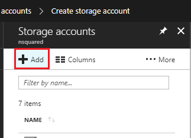

4.  In the **Create Storage Account** panel:

    1.  Insert a **Name** for your account, be aware this field only accepts numbers, and lowercase letters.
    2.  For **Deployment model,** select **Resource manager**.
    3.  For **Account kind**, select **Storage (general purpose v1)**.
    4.  For **Performance**, select **Standard**.
    5.  For **Replication** select **Read-access-geo-redundant storage (RA-GRS)**.
    6.  Leave **Secure transfer required** as **Disabled**.
    7.  Select a **Subscription**.
    4. Choose a **Resource Group** or create a new one. A resource group provides a way to monitor, control access, provision and manage billing for a collection of Azure assets. It is recommended to keep all the Azure services associated with a single project (e.g. such as these labs) under a common resource group).

        > If you wish to read more about Azure Resource Groups, please [visit the resource group article](/azure/azure-resource-manager/resource-group-portal).
    
    5.  Determine the **Location** for your resource group (if you are creating a new Resource Group). The location would ideally be in the region where the application would run. Some Azure assets are only available in certain regions.

5.  You will also need to confirm that you have understood the Terms and Conditions applied to this Service.

    

6.  Once you have clicked on **Create**, you will have to wait for the service to be created, this might take a minute.

7.  A notification will appear in the portal once the Service instance is created.

    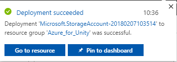

## Chapter 2 - The Azure Machine Learning Studio  (classic)

To use the *Azure Machine Learning*, you will need to configure an instance of the Machine Learning service to be made available to your application.

1.  In the Azure Portal, click on **New** in the top left corner, and search for **Machine Learning Studio Workspace**, press **Enter**.

    

2.  The new page will provide a description of the **Machine Learning Studio Workspace**  service. At the bottom left of this prompt, click the **Create** button, to create an association with this service.

3.  Once you have clicked on **Create**, a panel will appear where you need to provide some details about your new **Machine Learning Studio service**:

    1.  Insert your desired **Workspace name** for this service instance.

    2.  Select a **Subscription**.

    3. Choose a **Resource Group** or create a new one. A resource group provides a way to monitor, control access, provision and manage billing for a collection of Azure assets. It is recommended to keep all the Azure services associated with a single project (e.g. such as these labs) under a common resource group). 

        > If you wish to read more about Azure Resource Groups, please [visit the resource group article](/azure/azure-resource-manager/resource-group-portal).

    4.  Determine the **Location** for your resource group (if you are creating a new Resource Group). The location would ideally be in the region where the application would run. Some Azure assets are only available in certain regions. You should use the same resource group that you used for creating the Azure Storage in the previous Chapter.

    5.  For the **Storage account** section, click **Use existing**, then click the dropdown menu, and from there, click the **Storage Account** you created in the last Chapter.

    6.  Select the appropriate **Workspace pricing tier** for you, from the dropdown menu.

    7.  Within the **Web service plan** section, click **Create** **new,** then insert a name for it in the text field.

    8.  From the **Web service plan pricing tier** section, select the price tier of your choice. A development testing tier called **DEVTEST Standard** should be available to you at no charge.

    9.  You will also need to confirm that you have understood the Terms and Conditions applied to this Service.

    10. Click **Create**.

        

4.  Once you have clicked on **Create**, you will have to wait for the service to be created, this might take a minute.

5.  A notification will appear in the portal once the Service instance is created.

    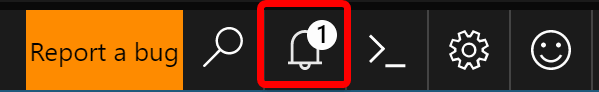

6.  Click on the notification to explore your new Service instance.

    

7.  Click the **Go to resource** button in the notification to explore your new Service instance.

8.  In the page displayed, under the **Additional Links** section, click **Launch Machine Learning Studio**, which will direct your browser to the **Machine Learning Studio** portal.

    

9.  Use the **Sign In** button, at the top right or in the center, to log into your Machine Learning Studio (classic).

    


## Chapter 3 - The Machine Learning Studio (classic): Dataset setup

One of the ways Machine Learning algorithms work is by analyzing existing data and then attempting to predict future results based on the existing data set. This generally means that the more existing data you have, the better the algorithm will be at predicting future results.

A sample table is provided to you, for this course, called [ProductsTableCSV and can be downloaded here](https://github.com/Microsoft/HolographicAcademy/raw/Azure-MixedReality-Labs/Azure%20Mixed%20Reality%20Labs/MR%20and%20Azure%20307%20-%20Machine%20learning/MR%20and%20Azure%20307%20-%20Machine%20learning.zip).

> [!IMPORTANT]
> The above .zip file contains both the **ProductsTableCSV** and the **.unitypackage**, which you will need in [Chapter 6](#chapter-6---importing-the-mlproducts-unity-package). This package is also provided within that Chapter, though separate to the csv file.

This sample data set contains a record of the best-selling objects at every hour of each day of the year 2017.
        


For example, on day 1 of 2017, at 1pm (hour 13), the best-selling item was salt and pepper.

This sample table contains 9998 entries.

1.  Head back to the **Machine Learning Studio (classic)** portal, and add this table as a **Dataset** for your ML. Do this by clicking the **+ New** button in the bottom left corner of the screen.

    

2.  A section will come up from the bottom, and within that there is navigation panel on the left. Click **Dataset**, then to the right of that, **From Local File**.

    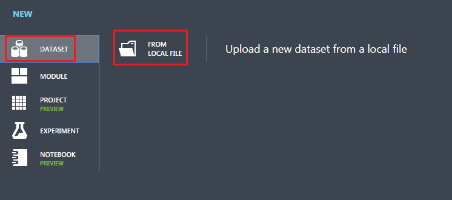

3.  Upload the new **Dataset** by following these steps:

    1. The upload window will appear, where you can **Browse** your hard drive for the new dataset.

        

    2.  Once selected, and back in the upload window, leave the checkbox unticked.

    3.  In the text field below, enter **ProductsTableCSV.csv** as the name for the dataset (though should automatically be added).

    4.  Using the dropdown menu for **Type**, select **Generic CSV File with a header (.csv)**.

    5.  Press the tick in the bottom right of the upload window, and your **Dataset** will be uploaded.

## Chapter 4 - The Machine Learning Studio (classic): The Experiment

Before you can build your machine learning system, you will need to build an experiment, to validate your theory about your data. With the results, you will know whether you need more data, or if there is no correlation between the data and a possible outcome.

To start creating an experiment:

1.  Click again on the **+ New** button on the bottom left of the page, then click on **Experiment** > **Blank Experiment**.

    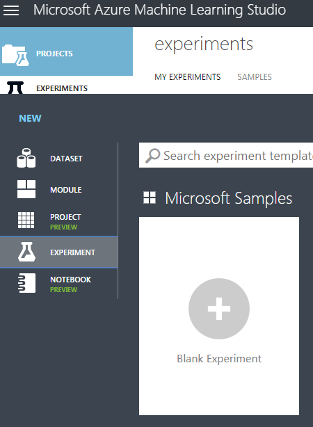

2.  A new page will be displayed with a blank Experiment:

3.  From the panel on the left expand **Saved Datasets** > **My Datasets** and drag the  **ProductsTableCSV** on to the **Experiment Canvas**.

    

4.  In the panel on the left, expand **Data Transformation** > **Sample and Split**. Then drag the **Split Data** item in to the **Experiment Canvas**. The Split Data item will split the data set into two parts. One part you will use for training the machine learning algorithm. The second part will be used to evaluate the accuracy of the algorithm generated.

    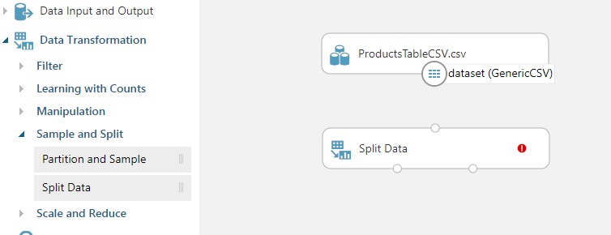

5.  In the right panel (while the Split Data item on the canvas is selected), edit the **Fraction of rows in the first output dataset** to **0.7**. This will split the data into two parts, the first part will be 70% of the data, and the second part will be the remaining 30%. To ensure that the data is split randomly, make sure the **Randomized split** checkbox remains checked.

    

6.  Drag a connection from the base of the **ProductsTableCSV** item on the canvas to the top of the Split Data item. This will connect the items and send the **ProductsTableCSV** dataset output (the data) to the Split Data input.  

    

7.  In the **Experiments** panel on the left side, expand **Machine Learning** > **Train**. Drag the **Train Model** item out in to the Experiment canvas. Your canvas should look the same as the below.

    

8.  From the ***bottom left*** of the **Split Data** item drag a connection to the **top right** of the **Train Model** item. The first 70% split from the dataset will be used by the Train Model to train the algorithm.

    

9.  Select the **Train Model** item on the canvas, and in the **Properties** panel (on the right-hand side of your browser window) click the **Launch column selector** button.

10. In the text box type **product** and then press **Enter**, *product* will be set as a column to train predictions. Following this, click on the **tick** in the bottom-right corner to close the selection dialog.

    

11. You are going to train a **Multiclass Logistic Regression** algorithm to predict the most sold **product** based on the hour of the day and the date. It is beyond the scope of this document to explain the details of the different algorithms provided by the Azure Machine Learning studio, though, you can find out more from the [Machine Learning Algorithm Cheat Sheet](/azure/machine-learning/studio/algorithm-cheat-sheet)

12. From the experiment items panel on the left, expand **Machine Learning** > **Initialize Model** > **Classification**, and drag the **Multiclass Logistic Regression** item on to the experiment canvas.

13. Connect the output, from the bottom of the **Multiclass Logistic Regression**, to the top-left input of the **Train Model** item.

    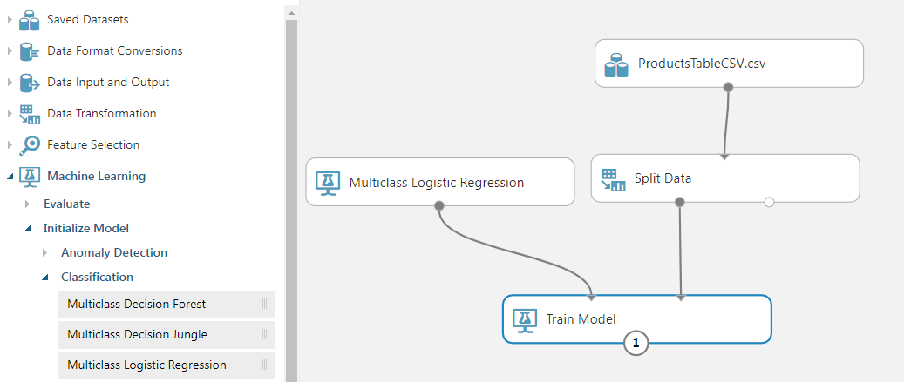

14. In list of experiment items in the panel on the left, expand **Machine Learning** > **Score**, and drag the **Score Model** item on to the canvas.

15. Connect the output, from the bottom of the **Train Model**, to the top-left input of the **Score Model**.

16. Connect the bottom-right output from **Split Data**, to the top-right input of the **Score Model** item.

    

17. In the list of **Experiment** items in the panel on the left, expand **Machine Learning** > **Evaluate**, and drag the **Evaluate Model** item onto the canvas.

18. Connect the output from the **Score Model** to the top-left input of the **Evaluate Model**.

    

19. You have built your first Machine Learning Experiment. You can now save and run the experiment. In the menu at the bottom of the page, click on the **Save** button to save your experiment and then click **Run** to the start the experiment.

    

20. You can see the **status** of the experiment in the top-right of the canvas. Wait a few moments for the experiment to finish.

    > If you have a big (real world) dataset it is likely that the experiment could take hours to run.

    

21. Right click on the **Evaluate Model** item in the canvas and from the context menu hover the mouse over **Evaluation Results**, then select **Visualize**.

    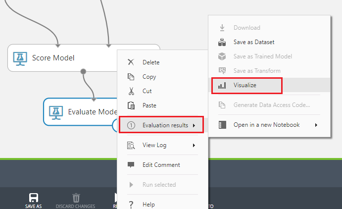

22. The evaluation results will be displayed showing the predicted outcomes versus the actual outcomes. This uses the 30% of the original dataset, that was split earlier, for evaluating the model. You can see the results are not great, ideally you would have the highest number in each row be the highlighted item in the columns.

    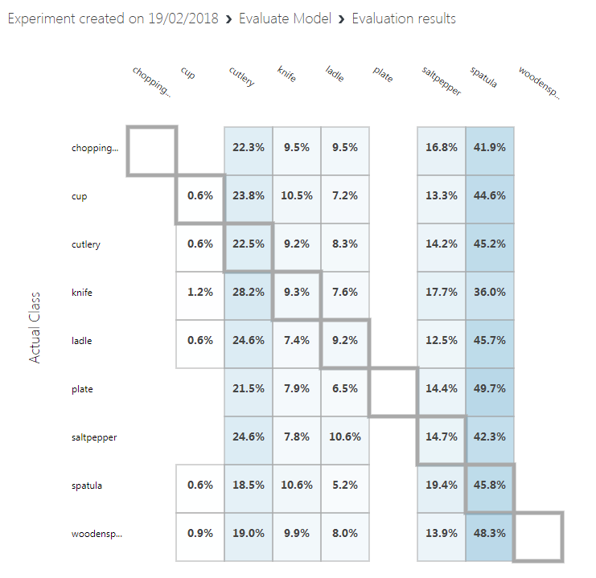

23. Close the **Results**.

24. To use your newly trained Machine Learning model you need to expose it as a **Web Service**. To do this, click on the **Set Up Web Service** menu item in the menu at the bottom of the page, and click on **Predictive Web Service**.

    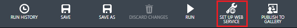

25. A new tab will be created, and the train model merged to create the new web service. 

26. In the menu at the bottom of the page click **Save**, then click **Run**. You will see the status updated in the top-right corner of the experiment canvas.

    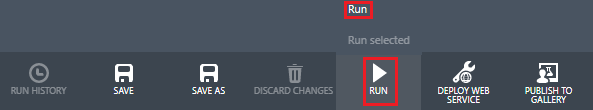

27. Once it has finished running, a **Deploy Web Service** button will appear at the bottom of the page. You are ready to deploy the web service. Click **Deploy Web Service** (Classic) in the menu at the bottom of the page.

    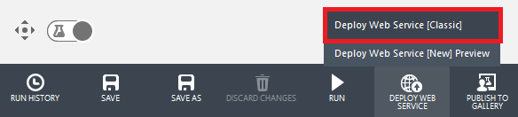

    > Your browser may prompt to allow a pop-up, which you should **allow**, though you may need to press **Deploy Web Service** again, if the deploy page does not show. 

28. Once the Experiment has been created you will be redirected to a **Dashboard** page where you will have your **API Key** displayed. Copy it into a notepad for the moment, you will need it in your code very soon. Once you have noted your API Key, click on the **REQUEST/RESPONSE** button in the **Default Endpoint** section underneath the Key.

    

    > [!NOTE] 
    > If you click Test in this page, you will be able to enter input data and view the output. Enter the **day** and **hour**. Leave the **product** entry blank. Then click the **Confirm** button. The output on the bottom of the page will show the JSON representing the likelihood of each product being the choice.

29. A new web page will open up, displaying the instructions and some examples about the Request structure required by the Machine Learning Studio (classic). Copy the **Request URI** displayed in this page, into your notepad.

    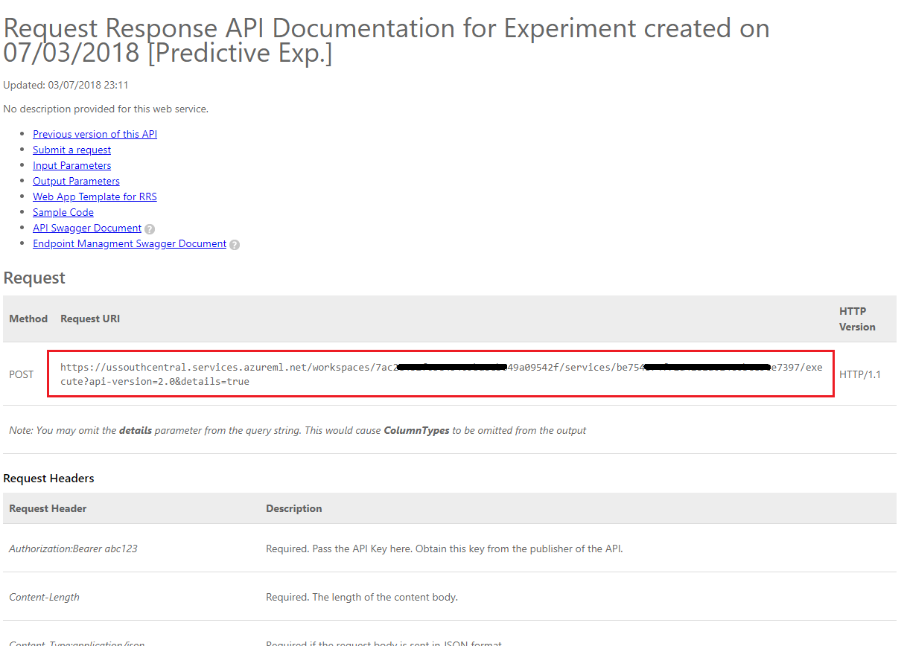

You have now built a machine learning system that provides the most likely product to be sold based on historical purchasing data, correlated with the time of the day and day of the year.

To call the web service, you will need the URL for the service endpoint and an API Key for the service. Click on the **Consume** tab, from the top menu.

The **Consumption** Info page will display the information you will need to call the web service from your code. Take a copy of the **Primary Key** and the **Request-Response** URL. You will need these in the next Chapter.

## Chapter 5 - Setting up the Unity Project

Set up and test your Mixed Reality Immersive Headset.

> [!NOTE]
>  You will **not** require Motion Controllers for this course. If you need support setting up the Immersive Headset, please click [HERE](https://support.microsoft.com/help/4043101/windows-10-set-up-windows-mixed-reality).

1.  Open **Unity** and create a new Unity Project called **MR\_MachineLearning.** Make sure the project type is set to **3D**.

2.  With Unity open, it is worth checking the default **Script Editor** is set to **Visual Studio**. Go to **Edit** > **Preferences** and then from the new window, navigate to **External Tools**. Change **External Script Editor** to **Visual Studio 2017**. Close the **Preferences** window.

3.  Next, go to **File** > **Build Settings** and switch the platform to **Universal Windows Platform**, by clicking on the ***Switch Platform*** button.

4.  Also make sure that:

    1.  **Target Device** is set to **Any Device**.

        > For the Microsoft HoloLens, set **Target Device** to *HoloLens*.

    2.  **Build Type** is set to **D3D**.

    3.  **SDK** is set to **Latest installed**.

    4.  **Visual Studio Version** is set to **Latest installed**.

    5.  **Build and Run** is set to **Local Machine**.

    6.  Do not worry about setting up **Scenes** right now, as these are provided later.

    7.  The remaining settings should be left as default for now.

        

5.  In the **Build Settings** window, click on the **Player Settings** button, this will open the related panel in the space where the **Inspector** is located. 

6. In this panel, a few settings need to be verified:

    1.  In the **Other Settings** tab:

        1.  **Scripting** **Runtime Version** should be **Experimental** (.NET 4.6 Equivalent)

        2. **Scripting Backend** should be ***.NET***

        3. **API Compatibility Level** should be **.NET 4.6**

            

    2.  Within the **Publishing Settings** tab, under **Capabilities**, check:

        - **InternetClient**

            

    3.  Further down the panel, in **XR Settings** (found below **Publish Settings**), tick **Virtual Reality Supported**, make sure the **Windows Mixed Reality SDK** is added

        

    

6.	Back in **Build Settings** *Unity C#* Projects is no longer greyed out; tick the checkbox next to this. 

7.	Close the Build Settings window.

8.	Save your Project (**FILE > SAVE PROJECT**).

## Chapter 6 - Importing the MLProducts Unity Package

For this course, you will need to download a Unity Asset Package called [**Azure-MR-307.unitypackage**](https://github.com/Microsoft/HolographicAcademy/raw/Azure-MixedReality-Labs/Azure%20Mixed%20Reality%20Labs/MR%20and%20Azure%20307%20-%20Machine%20learning/307-Scene-Setup.unitypackage). This package comes complete with a scene, with all objects in that prebuilt, so you can focus on getting it all working. The **ShelfKeeper** script is provided, though only holds the public variables, for the purpose of scene setup structure. You will need to do all other sections. 

To import this package:

1.  With the Unity dashboard in front of you, click on **Assets** in the menu at the top of the screen, then click on **Import Package, Custom Package**.

    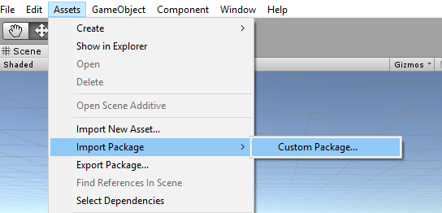

2.  Use the file picker to select the **Azure-MR-307.unitypackage** package and click **Open**.

3.  A list of components for this asset will be displayed to you. Confirm the import by clicking **Import**.

    

4.  Once it has finished importing, you will notice that some new folders have appeared in your Unity **Project Panel**. Those are the 3D models and the respective materials that are part of the pre-made scene you will work on. You will write the majority of the code in this course.

    

5.  Within the **Project Panel** folder, click on the **Scenes** folder and double click on the scene inside (called **MR_MachineLearningScene**). The scene will open (see image below). If the red diamonds are missing, simply click the **Gizmos** button, at the top right of the **Game Panel**.

    

## Chapter 7 - Checking the DLLs in Unity

To leverage the use of JSON libraries (used for serializing and deserializing), a Newtonsoft DLL has been implemented with the package you brought in. The library should have the correct configuration, though it is worth checking (particularly if you are having issues with code not working). 

To do so:

-  Left-click on the Newtonsoft file inside the Plugins folder and look at the **Inspector panel**. Make sure **Any Platform** is ticked. Go to the **UWP tab** and also ensure **Don't process** is ticked.

    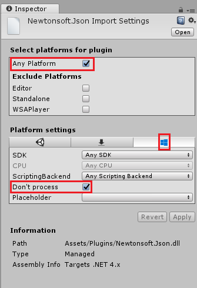

## Chapter 8 - Create the ShelfKeeper class

The **ShelfKeeper** class hosts methods that control the UI and products spawned in the scene.

As part of the imported package, you will have been given this class, though it is incomplete. It is now time to complete that class:

1.  Double click on the **ShelfKeeper** script, within the **Scripts** folder, to open it with **Visual Studio 2017**.

2.  Replace all the code existing in the script with the following code, which sets the time and date and has a method to show a product.

    ```csharp
    using UnityEngine;

    public class ShelfKeeper : MonoBehaviour
    {
        /// <summary>
        /// Provides this class Singleton-like behavior
        /// </summary>
        public static ShelfKeeper instance;

        /// <summary>
        /// Unity Inspector accessible Reference to the Text Mesh object needed for data
        /// </summary>
        public TextMesh dateText;

        /// <summary>
        /// Unity Inspector accessible Reference to the Text Mesh object needed for time
        /// </summary>
        public TextMesh timeText;

        /// <summary>
        /// Provides references to the spawn locations for the products prefabs
        /// </summary>
        public Transform[] spawnPoint;

        private void Awake()
        {
            instance = this;
        }

        /// <summary>
        /// Set the text of the date in the scene
        /// </summary>
        public void SetDate(string day, string month)
        {
            dateText.text = day + " " + month;
        }

        /// <summary>
        /// Set the text of the time in the scene
        /// </summary>
        public void SetTime(string hour)
        {
            timeText.text = hour + ":00";
        }

        /// <summary>
        /// Spawn a product on the shelf by providing the name and selling grade
        /// </summary>
        /// <param name="name"></param>
        /// <param name="sellingGrade">0 being the best seller</param>
        public void SpawnProduct(string name, int sellingGrade)
        {
            Instantiate(Resources.Load(name),
                spawnPoint[sellingGrade].transform.position, spawnPoint[sellingGrade].transform.rotation);
        }
    }
    ```

3.  Be sure to save your changes in **Visual Studio** before returning to **Unity**.

4.  Back in the Unity Editor, check that the **ShelfKeeper** class looks like the below:

    

    > [!IMPORTANT]
    > If your script does not have the reference targets (i.e. *Date (Text Mesh)*), simply drag the corresponding objects from the **Hierarchy Panel**, into the target fields. See below for explanation, if needed:
    > 
    > 1.  Open the **Spawn Point** array within the **ShelfKeeper** component script by left-clicking it. A sub-section will appear called **Size**, which indicates the size of the array. Type **3** into the textbox next to **Size** and press **Enter**, and three slots will be created beneath.
    > 2. Within the **Hierarchy** expand the **Time Display** object (by left-clicking the arrow beside it). Next click the ***Main Camera*** from within the **Hierarchy**, so that the **Inspector** shows its information.
    > 3. Select the **Main Camera** in the **Hierarchy Panel**. Drag the **Date** and **Time** objects from the **Hierarchy Panel** to the **Date Text** and **Time Text** slots within the **Inspector** of the **Main Camera** in the **ShelfKeeper** component.
    > 4. Drag the **Spawn Points** from the **Hierarchy Panel** (beneath the *Shelf* object) to the **3** **Element** reference targets beneath the **Spawn Point** array, as shown in the image.
    > 
    >     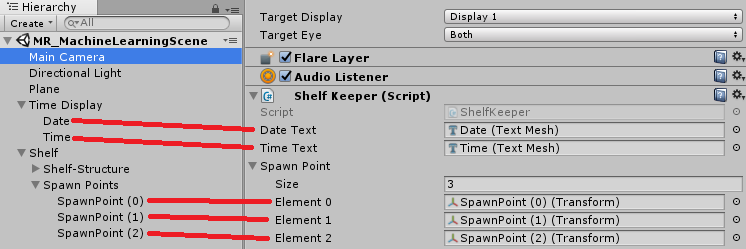

## Chapter 9 - Create the ProductPrediction class

The next class you are going to create is the **ProductPrediction** class.

This class is responsible for:

-   Querying the **Machine Learning Service** instance, providing the current date and time.

-   Deserializing the JSON response into usable data.

-   Interpreting the data, retrieving the 3 recommended products.

-   Calling the **ShelfKeeper** class methods to display the data in the Scene.

To create this class:

1.  Go to the **Scripts** folder, in the **Project Panel**.

2.  Right-click inside the folder, **Create** > **C# Script**. Call the script **ProductPrediction**.

3.  Double click on the new **ProductPrediction** script to open it with **Visual Studio 2017**.

4.  If the **File Modification Detected** dialog pops up, click ***Reload Solution**.

5.  Add the following namespaces to the top of the ProductPrediction class:

    ```csharp
    using System;
    using System.Collections.Generic;
    using UnityEngine;
    using System.Linq;
    using Newtonsoft.Json;
    using UnityEngine.Networking;
    using System.Runtime.Serialization;
    using System.Collections;
    ```

6.  Inside the **ProductPrediction** class insert the following two objects which are composed of a number of nested classes. These classes are used to serialize and deserialize the JSON for the Machine Learning Service.

    ```csharp
        /// <summary>
        /// This object represents the Prediction request
        /// It host the day of the year and hour of the day
        /// The product must be left blank when serialising
        /// </summary>
        public class RootObject
        {
            public Inputs Inputs { get; set; }
        }

        public class Inputs
        {
            public Input1 input1 { get; set; }
        }

        public class Input1
        {
            public List<string> ColumnNames { get; set; }
            public List<List<string>> Values { get; set; }
        }
    ```

    ```csharp
        /// <summary>
        /// This object containing the deserialised Prediction result
        /// It host the list of the products
        /// and the likelihood of them being sold at current date and time
        /// </summary>
        public class Prediction
        {
            public Results Results { get; set; }
        }

        public class Results
        {
            public Output1 output1;
        }

        public class Output1
        {
            public string type;
            public Value value;
        }

        public class Value
        {
            public List<string> ColumnNames { get; set; }
            public List<List<string>> Values { get; set; }
        }
    ```

7.  Then add the following variables above the previous code (so that the JSON related code is at the bottom of the script, below all other code, and out of the way):

    ```csharp
        /// <summary>
        /// The 'Primary Key' from your Machine Learning Portal
        /// </summary>
        private string authKey = "-- Insert your service authentication key here --";

        /// <summary>
        /// The 'Request-Response' Service Endpoint from your Machine Learning Portal
        /// </summary>
        private string serviceEndpoint = "-- Insert your service endpoint here --";

        /// <summary>
        /// The Hour as set in Windows
        /// </summary>
        private string thisHour;

        /// <summary>
        /// The Day, as set in Windows
        /// </summary>
        private string thisDay;

        /// <summary>
        /// The Month, as set in Windows
        /// </summary>
        private string thisMonth;

        /// <summary>
        /// The Numeric Day from current Date Conversion
        /// </summary>
        private string dayOfTheYear;

        /// <summary>
        /// Dictionary for holding the first (or default) provided prediction 
        /// from the Machine Learning Experiment
        /// </summary>    
        private Dictionary<string, string> predictionDictionary;

        /// <summary>
        /// List for holding product prediction with name and scores
        /// </summary>
        private List<KeyValuePair<string, double>> keyValueList;
    ```

    > [!IMPORTANT]
    > Make sure to insert the **primary key** and **request-response endpoint**, from the Machine Learning Portal, into the variables here. The below images show where you would have taken the key and endpoint from. 
    >  
    > 
    >
    > 

8.  Insert this code within the **Start()** method. The **Start()** method is called when the class initializes:

    ```csharp
        void Start()
        {
            // Call to get the current date and time as set in Windows
            GetTodayDateAndTime();

            // Call to set the HOUR in the UI
            ShelfKeeper.instance.SetTime(thisHour);

            // Call to set the DATE in the UI
            ShelfKeeper.instance.SetDate(thisDay, thisMonth);

            // Run the method to Get Predication from Azure Machine Learning
            StartCoroutine(GetPrediction(thisHour, dayOfTheYear));
        }
    ```

9.  The following is the method that collects the date and time from Windows and converts it into a format that our Machine Learning Experiment can use to compare with the data stored in the table.

    ```csharp
        /// <summary>
        /// Get current date and hour
        /// </summary>
        private void GetTodayDateAndTime()
        {
            // Get today date and time
            DateTime todayDate = DateTime.Now;

            // Extrapolate the HOUR
            thisHour = todayDate.Hour.ToString();

            // Extrapolate the DATE
            thisDay = todayDate.Day.ToString();
            thisMonth = todayDate.ToString("MMM");

            // Extrapolate the day of the year
            dayOfTheYear = todayDate.DayOfYear.ToString();
        }
    ```

10. You can **delete** the **Update()** method since this class will not use it.

11. Add the following method which will communicate the current date and time to the Machine Learning endpoint and receive a response in JSON format.

    ```csharp
        private IEnumerator GetPrediction(string timeOfDay, string dayOfYear)
        {
            // Populate the request object 
            // Using current day of the year and hour of the day
            RootObject ro = new RootObject
            {
                Inputs = new Inputs
                {
                    input1 = new Input1
                    {
                        ColumnNames = new List<string>
                        {
                            "day",
                            "hour",
                        "product"
                        },
                        Values = new List<List<string>>()
                    }
                }
            };

            List<string> l = new List<string>
            {
                dayOfYear,
                timeOfDay,
                ""
            };

            ro.Inputs.input1.Values.Add(l);

            Debug.LogFormat("Score request built");

            // Serialize the request
            string json = JsonConvert.SerializeObject(ro);

            using (UnityWebRequest www = UnityWebRequest.Post(serviceEndpoint, "POST"))
            {
                byte[] jsonToSend = new System.Text.UTF8Encoding().GetBytes(json);
                www.uploadHandler = new UploadHandlerRaw(jsonToSend);

                www.downloadHandler = new DownloadHandlerBuffer();
                www.SetRequestHeader("Authorization", "Bearer " + authKey);
                www.SetRequestHeader("Content-Type", "application/json");
                www.SetRequestHeader("Accept", "application/json");

                yield return www.SendWebRequest();
                string response = www.downloadHandler.text;

                // Deserialize the response
                DataContractSerializer serializer;
                serializer = new DataContractSerializer(typeof(string));
                DeserialiseJsonResponse(response);
            }
        }
    ```

12. Add the following method, which is responsible for deserializing the JSON response, and communicating the result of the deserialization to the **ShelfKeeper** class. This result will be the names of the three items predicted to sell the most at current date and time. Insert the code below into the **ProductPrediction** class, below the previous method.

    ```csharp
        /// <summary>
        /// Deserialize the response received from the Machine Learning portal
        /// </summary>
        public void DeserialiseJsonResponse(string jsonResponse)
        {
            // Deserialize JSON
            Prediction prediction = JsonConvert.DeserializeObject<Prediction>(jsonResponse);
            predictionDictionary = new Dictionary<string, string>();

            for (int i = 0; i < prediction.Results.output1.value.ColumnNames.Count; i++)
            {
                if (prediction.Results.output1.value.Values[0][i] != null)
                {
                    predictionDictionary.Add(prediction.Results.output1.value.ColumnNames[i], prediction.Results.output1.value.Values[0][i]);
                }
            }

            keyValueList = new List<KeyValuePair<string, double>>();

            // Strip all non-results, by adding only items of interest to the scoreList
            for (int i = 0; i < predictionDictionary.Count; i++)
            {
                KeyValuePair<string, string> pair = predictionDictionary.ElementAt(i);
                if (pair.Key.StartsWith("Scored Probabilities"))
                {
                    // Parse string as double then simplify the string key so to only have the item name
                    double scorefloat = 0f;
                    double.TryParse(pair.Value, out scorefloat);
                    string simplifiedName =
                        pair.Key.Replace("\"", "").Replace("Scored Probabilities for Class", "").Trim();
                    keyValueList.Add(new KeyValuePair<string, double>(simplifiedName, scorefloat));
                }
            }

            // Sort Predictions (results will be lowest to highest)
            keyValueList.Sort((x, y) => y.Value.CompareTo(x.Value));

            // Spawn the top three items, from the keyValueList, which we have sorted
            for (int i = 0; i < 3; i++)
            {
                ShelfKeeper.instance.SpawnProduct(keyValueList[i].Key, i);
            }

            // Clear lists in case of reuse
            keyValueList.Clear();
            predictionDictionary.Clear();
        }
    ```

13. Save **Visual Studio** and head back to **Unity**.

14. Drag the **ProductPrediction** class script from the **Script** folder, onto the **Main Camera** object.

15. Save your scene and project **File** > **Save Scene/File** > **Save Project**.

## Chapter 10 - Build the UWP Solution

It is now time to build your project as a UWP solution, so that it can run as a standalone application.

To Build:

1.  Save the current scene by clicking on **File** > **Save Scenes**.

2.  Go to **File** > **Build Settings**

3.  Check the box called **Unity C# Projects** (this is important because it will allow you to edit the classes after build is completed).

4.  Click on **Add Open Scenes**,

5.  Click **Build**.

    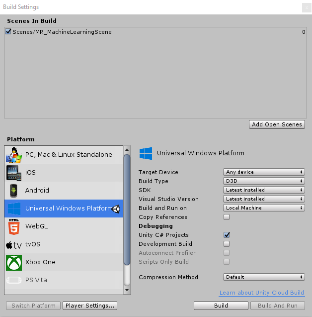

6.  You will be prompted to select the folder where you want to build the Solution.

7.  Create a **BUILDS** folder and within that folder create another folder with an appropriate name of your choice.

8.  Click your new folder and then click **Select Folder**, to begin the build at that location.

    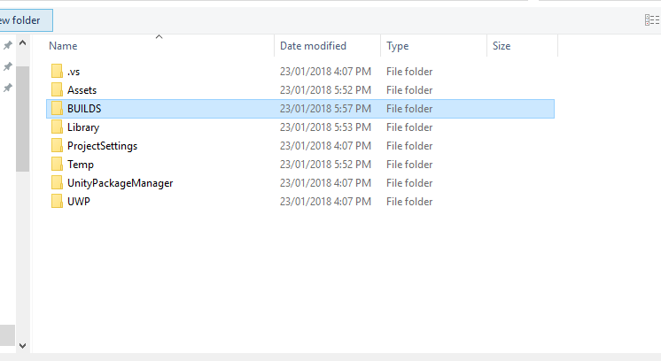

    

9.  Once Unity has finished building (it might take some time), it will open a **File Explorer** window at the location of your build (check your task bar, as it may not always appear above your windows, but will notify you of the addition of a new window).

## Chapter 11 - Deploy your Application

To deploy your application:

1.	Navigate to your new Unity build (the **App** folder) and open the solution file with **Visual Studio**.

2.  With Visual Studio open, you need to Restore NuGet Packages, which can be done through right-clicking your MachineLearningLab_Build solution, from the Solution Explorer (found to the right of Visual Studio), and then clicking Restore NuGet Packages:

    

3.	In the Solution Configuration select **Debug**.

4.	In the Solution Platform, select **x86**, **Local Machine**. 

    > For the Microsoft HoloLens, you may find it easier to set this to *Remote Machine*, so that you are not tethered to your computer. Though, you will need to also do the following:
    > - Know the **IP Address** of your HoloLens, which can be found within the *Settings > Network & Internet > Wi-Fi > Advanced Options*; the IPv4 is the address you should use. 
    > - Ensure **Developer Mode** is **On**; found in *Settings > Update & Security > For developers*.

    

5.	Go to **Build menu** and click on **Deploy Solution** to sideload the application to your PC.

6.	Your App should now appear in the list of installed apps, ready to be launched.

When you run the Mixed Reality application, you will see the bench that was set up in your Unity scene, and from initialization, the data you set up within Azure will be fetched. The data will be deserialized within your application, and the three top results for your current date and time will be provided visually, as three models on the bench.


## Your finished Machine Learning application
 
Congratulations, you built a mixed reality app that leverages the Azure Machine Learning to make data predictions and display it on your scene.


## Exercise

**Exercise 1**

Experiment with the sort order of your application and have the three bottom predictions appear on the shelf, as this data would potentially be useful also.

**Exercise 2**

Using **Azure Tables** populate a new table with weather information and create a new experiment using the data.