# HoloLens (1st gen) and Azure 308: Cross-device notifications

<br>

>[!NOTE]
>The Mixed Reality Academy tutorials were designed with HoloLens (1st gen) and Mixed Reality Immersive Headsets in mind.  As such, we feel it is important to leave these tutorials in place for developers who are still looking for guidance in developing for those devices.  These tutorials will **_not_** be updated with the latest toolsets or interactions being used for HoloLens 2.  They will be maintained to continue working on the supported devices. There will be a new series of tutorials that will be posted in the future that will demonstrate how to develop for HoloLens 2.  This notice will be updated with a link to those tutorials when they are posted.

<br>


In this course, you will learn how to add Notification Hubs capabilities to a mixed reality application using Azure Notification Hubs, Azure Tables, and Azure Functions.

**Azure Notification Hubs** is a Microsoft service, which allows developers to send targeted and personalized push notifications to any platform, all powered within the cloud. This can effectively allow developers to communicate with end users, or even communicate between various applications, depending on the scenario. For more information, visit the **Azure Notification Hubs** [page](/azure/notification-hubs/notification-hubs-push-notification-overview).

**Azure Functions** is a Microsoft service, which allows developers to run small pieces of code, 'functions', in Azure. This provides a way to delegate work to the cloud, rather than your local application, which can have many benefits. **Azure Functions** supports several development languages, including C\#, F\#, Node.js, Java, and PHP. For more information, visit the **Azure Functions** [page](/azure/azure-functions/functions-overview).

**Azure Tables** is a Microsoft cloud service, which allows developers to store structured non-SQL data in the cloud, making it easily accessible anywhere. The service boasts a schemaless design, allowing for the evolution of tables as needed, and thus is very flexible. For more information, visit the **Azure Tables** [page](/azure/cosmos-db/table-storage-overview)

Having completed this course, you will have a mixed reality immersive headset application, and a Desktop PC application, which will be able to do the following:

1. The Desktop PC app will allow the user to move an object in 2D space (X and Y), using the mouse.

2. The movement of objects within the PC app will be sent to the cloud using JSON, which will be in the form of a string, containing an object ID, type, and transform information (X and Y coordinates). 

3. The mixed reality app, which has an identical scene to the desktop app, will receive notifications regarding object movement, from the Notification Hubs service (which has just been updated by the Desktop PC app). 

4. Upon receiving a notification, which will contain the object ID, type, and transform information, the mixed reality app will apply the received information to its own scene.

In your application, it is up to you as to how you will integrate the results with your design. This course is designed to teach you how to integrate an Azure Service with your Unity Project. It is your job to use the knowledge you gain from this course to enhance your mixed reality application. This course is a self-contained tutorial, which does not directly involve any other Mixed Reality Labs.

## Device support

<table>
<tr>
<th>Course</th><th style="width:150px"> <a href="/hololens/hololens1-hardware">HoloLens</a></th><th style="width:150px"> <a href="/windows/mixed-reality/enthusiast-guide/immersive-headset-hardware-details">Immersive headsets</a></th>
</tr><tr>
<td> MR and Azure 308: Cross-device notifications</td><td style="text-align: center;"> ✔️</td><td style="text-align: center;"> ✔️</td>
</tr>
</table>

> [!NOTE]
> While this course primarily focuses on Windows Mixed Reality immersive (VR) headsets, you can also apply what you learn in this course to Microsoft HoloLens. As you follow along with the course, you will see notes on any changes you might need to employ to support HoloLens. When using HoloLens, you may notice some echo during voice capture.

## Prerequisites

> [!NOTE]
> This tutorial is designed for developers who have basic experience with Unity and C#. Please also be aware that the prerequisites and written instructions within this document represent what has been tested and verified at the time of writing (May 2018). You are free to use the latest software, as listed within the [install the tools](../../install-the-tools.md) article, though it should not be assumed that the information in this course will perfectly match what you'll find in newer software than what's listed below.

We recommend the following hardware and software for this course:

- A development PC, [compatible with Windows Mixed Reality](https://support.microsoft.com/help/4039260/windows-10-mixed-reality-pc-hardware-guidelines) for immersive (VR) headset development
- [Windows 10 Fall Creators Update (or later) with Developer mode enabled](../../install-the-tools.md#installation-checklist)
- [The latest Windows 10 SDK](../../install-the-tools.md#installation-checklist)
- [Unity 2017.4](../../install-the-tools.md#installation-checklist)
- [Visual Studio 2017](../../install-the-tools.md#installation-checklist)
- A [Windows Mixed Reality immersive (VR) headset](/windows/mixed-reality/enthusiast-guide/immersive-headset-hardware-details) or [Microsoft HoloLens](/hololens/hololens1-hardware) with Developer mode enabled
- Internet access for Azure setup and to access Notification Hubs

## Before you start

- To avoid encountering issues building this project, it is strongly suggested that you create the project mentioned in this tutorial in a root or near-root folder (long folder paths can cause issues at build-time).
- You must be the owner of your Microsoft Developer Portal and your Application Registration Portal, otherwise you will not have permission to access the app in [Chapter 2](#chapter-2---retrieve-your-new-apps-credentials).

## Chapter 1 - Create an application on the Microsoft Developer Portal

To use the **Azure Notification Hubs** Service, you will need to create an Application on the Microsoft Developer Portal, as your application will need to be registered, so that it can send and receive notifications.

1.  Log in to the [Microsoft Developer Portal](https://developer.microsoft.com/dashboard).

    > You will need to log in to your Microsoft Account.

2.  From the Dashboard, click **Create a new app**.

    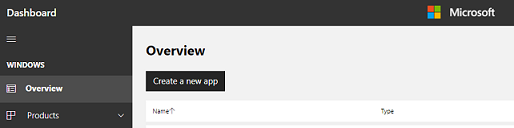

3.  A popup will appear, wherein you need to reserve a name for your new app. In the textbox, insert an appropriate name; if the chosen name is available, a tick will appear to the right of the textbox. Once you have an available name inserted, click the **Reserve product name** button to the bottom left of the popup.

    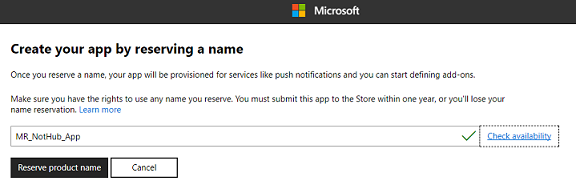

4.  With the app now created, you are ready to move to the next Chapter.

## Chapter 2 - Retrieve your new apps credentials

Log into the Application Registration Portal, where your new app will be listed, and retrieve the credentials which will be used to setup the **Notification Hubs Service** within the **Azure Portal**.

1.  Navigate to the [Application Registration Portal](https://apps.dev.microsoft.com).

    

    > [!WARNING] 
    > You will need to use your Microsoft Account to Login.  
    > This **must** be the Microsoft Account which you used in the previous [Chapter](#chapter-1---create-an-application-on-the-microsoft-developer-portal), with the Windows Store Developer portal.

2.  You will find your app under the **My applications** section. Once you have found it, click on it and you will be taken to a new page which has the app name plus **Registration**.

    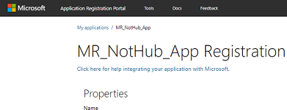

3.  Scroll down the registration page to find your **Application Secrets** section and the **Package SID** for your app. Copy both for use with setting up the **Azure Notification Hubs Service** in the next Chapter.

    

## Chapter 3 - Setup Azure Portal: create Notification Hubs Service

With your apps credentials retrieved, you will need to go to the Azure Portal, where you will create an Azure Notification Hubs Service.

1.  Log into the [Azure Portal](https://portal.azure.com).

    > [!NOTE] 
    > If you do not already have an Azure account, you will need to create one. If you are following this tutorial in a classroom or lab situation, ask your instructor or one of the proctors for help setting up your new account.

2.  Once you are logged in, click on **New** in the top left corner, and search for **Notification Hub**, and click ***Enter***.

    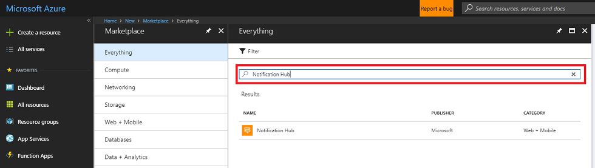

    > [!NOTE] 
    > The word ***New*** may have been replaced with **Create a resource**, in newer portals.

3.  The new page will provide a description of the *Notification Hubs* service. At the bottom left of this prompt, select the **Create** button, to create an association with this service.

    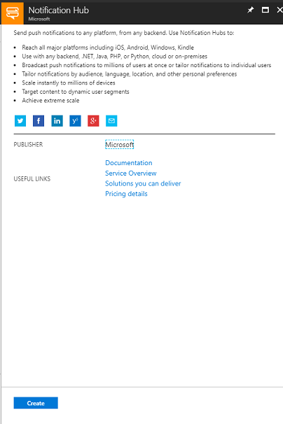

4.  Once you have clicked on ***Create***:

    1.  Insert your desired name for this service instance.

    2.  Provide a **namespace** which you will be able to associate with this app.

    3.  Select a **Location.**

    4.  Choose a **Resource Group** or create a new one. A resource group provides a way to monitor, control access, provision and manage billing for a collection of Azure assets. It is recommended to keep all the Azure services associated with a single project (e.g. such as these labs) under a common resource group).

        > If you wish to read more about Azure Resource Groups, please follow this [link on how to manage a Resource Group](/azure/azure-resource-manager/resource-group-portal). 

    5.  Select an appropriate **Subscription**.

    6.  You will also need to confirm that you have understood the Terms and Conditions applied to this Service.

    7. Select **Create**.

        

5.  Once you have clicked on **Create**, you will have to wait for the service to be created, this might take a minute.

6.  A notification will appear in the portal once the Service instance is created.

    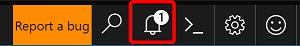

7.  Click the **Go to resource** button in the notification to explore your new Service instance. You will be taken to your new **Notification Hub** service instance.

    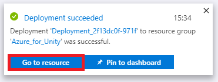
    
8.  From the overview page, halfway down the page, click **Windows (WNS).** The panel on the right will change to show two text fields, which require your **Package SID** and **Security Key**, from the app you set up previously.

    

9. Once you have copied the details into the correct fields, click **Save**, and you will receive a notification when the Notification Hub has been successfully updated.

    

## Chapter 4 - Setup Azure Portal: create Table Service

After creating your Notification Hubs Service instance, navigate back to your Azure Portal, where you will create an Azure Tables Service by creating a Storage Resource.

1.  If not already signed in, log into the [Azure Portal](https://portal.azure.com).

2.  Once logged in, click on **New** in the top left corner, and search for **Storage account**, and click **Enter**.

    > [!NOTE] 
    > The word ***New*** may have been replaced with **Create a resource**, in newer portals.

3.  Select **Storage account - blob, file, table, queue** from the list.

    

4.  The new page will provide a description of the **Storage account** service. At the bottom left of this prompt, select the **Create** button, to create an instance of this service.

    

5.  Once you have clicked on **Create**, a panel will appear:

    1. Insert your desired **Name** for this service instance (must be all lowercase).

    2. For **Deployment model**, click **Resource manager**.

    3.  For **Account kind**, using the dropdown menu, select **Storage (general purpose v1)**.

    4. Select an appropriate **Location**.
    
    5.  For the **Replication** dropdown menu, select **Read-access-geo-redundant storage (RA-GRS)**.

    6.  For **Performance**, click **Standard**.

    7.  Within the **Secure transfer required** section, select **Disabled**.

    8.  From the **Subscription** dropdown menu, select an appropriate subscription.

    9.  Choose a **Resource Group** or create a new one. A resource group provides a way to monitor, control access, provision and manage billing for a collection of Azure assets. It is recommended to keep all the Azure services associated with a single project (e.g. such as these labs) under a common resource group).

        > If you wish to read more about Azure Resource Groups, please follow this [link on how to manage a Resource Group](/azure/azure-resource-manager/resource-group-portal).

    10. Leave **Virtual networks** as **Disabled** if this is an option for you.

    11. Click **Create**.

        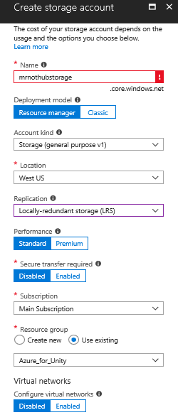

6.  Once you have clicked on **Create**, you will have to wait for the service to be created, this might take a minute.

7.  A notification will appear in the portal once the Service instance is created. Click on the notifications to explore your new Service instance.

    

8.  Click the **Go to resource** button in the notification to explore your new Service instance. You will be taken to your new Storage Service instance overview page.

    

9. From the overview page, to the right-hand side, click **Tables**.
    
    

10. The panel on the right will change to show the **Table service** information, wherein you need to add a new table. Do this by clicking the **+** **Table** button to the top-left corner.

    

11. A new page will be shown, wherein you need to enter a **Table name**. This is the name you will use to refer to the data in your application in later Chapters. Insert an appropriate name and click **OK**.

        

12. Once the new table has been created, you will be able to see it within the **Table service** page (at the bottom).

    
    

## Chapter 5 - Completing the Azure Table in Visual Studio

Now that your **Table service** storage account has been setup, it is time to add data to it, which will be used to store and retrieve information. The editing of your Tables can be done through **Visual Studio**.

1.  Open **Visual Studio**.

2.  From the menu, click **View** > **Cloud Explorer**.

    

3.  The **Cloud Explorer** will open as a docked item (be patient, as loading may take time).

    > [!NOTE] 
    > If the Subscription you used to create your *Storage Accounts* is not visible, ensure that you have: 
    > - Logged in to the same account as the one you used for the Azure Portal.
    > - Selected your Subscription from the Account Management Page (you may need to apply a filter from your account settings):  
    >
    >   

4.  Your Azure cloud services will be shown. Find **Storage Accounts** and click the arrow to the left of that to expand your accounts.

    

5.  Once expanded, your newly created **Storage account** should be available. Click the arrow to the left of your storage, and then once that is expanded, find **Tables** and click the arrow next to that, to reveal the **Table** you created in the last Chapter. Double click your **Table**.

    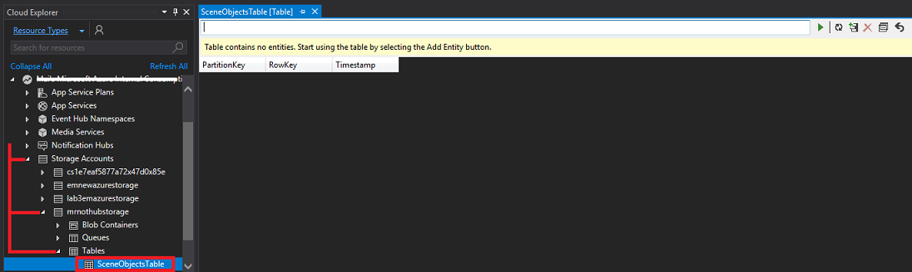

6.  Your table will be opened in the center of your Visual Studio window. Click the table icon with the **+** (plus) on it.

    

7.  A window will appear prompting for you to *Add Entity*. You will create three entities in total, each with several properties. You will notice that *PartitionKey* and *RowKey* are already provided, as these are used by the table to find your data. 

    

8. Update the *Value* of the **PartitionKey** and **RowKey** as follows (remember to do this for each row property you add, though increment the RowKey each time):

    

9.  Click **Add property** to add extra rows of data. Make your first empty table match the below table.

10. Click **OK** when you are finished.

    

    > [!WARNING] 
    > Ensure that you have changed the **Type** of the **X**, **Y**, and **Z**, entries to **Double**. 

11. You will notice your table now has a row of data. Click the **+** (plus) icon again to add another entity.

    

12. Create an additional property, and then set the values of the new entity to match those shown below.

    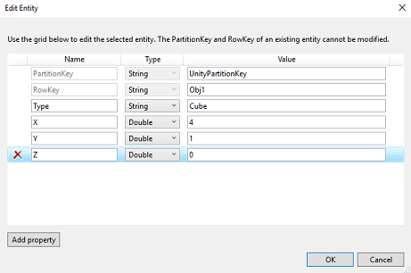

13. Repeat the last step to add another entity. Set the values for this entity to those shown below.

    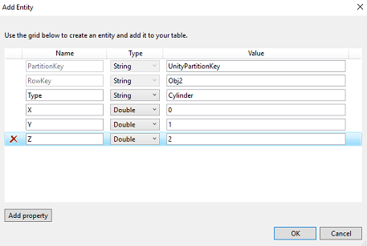

14. Your table should now look like the one below.

    

15. You have completed this Chapter. Make sure to save.

## Chapter 6 - Create an Azure Function App

Create an Azure Function App, which will be called by the Desktop application to update the **Table** service and send a notification through the **Notification Hub**.

First, you need to create a file that will allow your Azure Function to load the libraries you need.

1.  Open **Notepad** (press Windows Key and type notepad).

    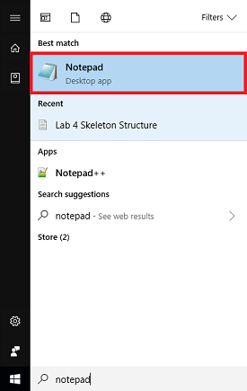

2.  With Notepad open, insert the JSON structure below into it. Once you
    have done that, save it on your desktop as **project.json**. It is
    important that the naming is correct: ensure it does **NOT have a
    .txt** file extension. This file defines the libraries your function
    will use, if you have used NuGet it will look familiar.

    ```json
    {
    "frameworks": {
        "net46":{
        "dependencies": {
            "WindowsAzure.Storage": "7.0.0",
            "Microsoft.Azure.NotificationHubs" : "1.0.9",
            "Microsoft.Azure.WebJobs.Extensions.NotificationHubs" :"1.1.0"
        }
        }
    }
    }
    ```

3.  Log in to the [Azure Portal](https://portal.azure.com).

4.  Once you are logged in, click on **New** in the top left corner, and search for **Function App**, press **Enter**.

    

    > [!NOTE] 
    > The word **New** may have been replaced with **Create a resource**, in newer portals.

5.  The new page will provide a description of the **Function App** service. At the bottom left of this prompt, select the **Create** button, to create an association with this service.

    

6.  Once you have clicked on **Create**, fill in the following:

    1. For **App name**, insert your desired name for this service instance.

    2. Select a **Subscription**.

    3. Select the pricing tier appropriate for you, if this is the first time creating a **Function App Service**, a free tier should be available to you.

    4. Choose a **Resource Group** or create a new one. A resource group provides a way to monitor, control access, provision and manage billing for a collection of Azure assets. It is recommended to keep all the Azure services associated with a single project (e.g. such as these labs) under a common resource group).

        > If you wish to read more about Azure Resource Groups, please follow this [link on how to manage a Resource Group](/azure/azure-resource-manager/resource-group-portal).

    5. For **OS**, click Windows, as that is the intended platform.

    6. Select a **Hosting Plan** (this tutorial is using a **Consumption Plan**.

    7. Select a **Location** **(choose the same location as the storage you have built in the previous step)**

    8. For the **Storage** section, **you must select the Storage Service you created in the previous step**.

    9. You will not need *Application Insights* in this app, so feel free to leave it **Off**.

    10. Click **Create**.

        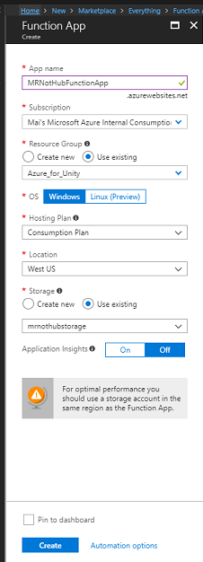

7.  Once you have clicked on **Create** you will have to wait for the service to be created, this might take a minute.

8.  A notification will appear in the portal once the Service instance is created.

    

9.  Click on the notifications to explore your new Service instance.

10. Click the **Go to resource** button in the notification to explore your new Service instance. 

    

11. Click the **+** (plus) icon next to *Functions*, to *Create new*.

    

12. Within the central panel, the **Function** creation window will appear. Ignore the information in the upper half of the panel, and click **Custom function**, which is located near the bottom (in the blue area, as below).

    

13. The new page within the window will show various function types. Scroll down to view the purple types, and click **HTTP PUT** element.

    

    > [!IMPORTANT]
    > You may have to scroll further the down the page (and this image may not look exactly the same, if Azure Portal updates have taken place), however, you are looking for an element called *HTTP PUT*.

14. The **HTTP PUT** window will appear, where you need to configure the function (see below for image).

    1.  For **Language,** using the dropdown menu, select C\#.

    2.  For **Name,** input an appropriate name.

    3.  In the **Authentication level** dropdown menu, select **Function**.

    4.  For the **Table name** section, you need to use the exact name you used to create your **Table** service previously (including the same letter case).

    5.  Within the **Storage account connection** section, use the dropdown menu, and select your storage account from there. If it is not there, click the **New** hyperlink alongside the section title, to show another panel, where your storage account should be listed.

        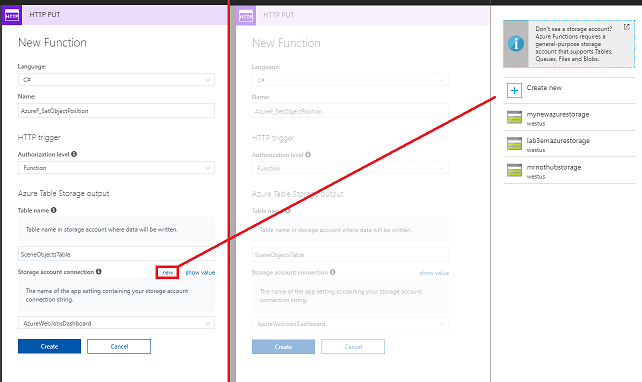

15. Click **Create** and you will receive a notification that your settings have been updated successfully.

    

16. After clicking **Create**, you will be redirected to the function editor.

    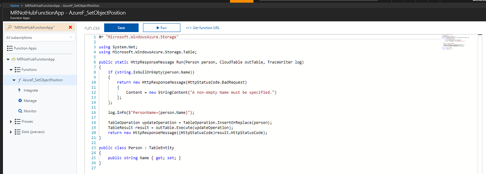

17. Insert the following code into the function editor (replacing the code in the function):

    ```csharp
    #r "Microsoft.WindowsAzure.Storage"

    using System;
    using Microsoft.WindowsAzure.Storage;
    using Microsoft.WindowsAzure.Storage.Table;
    using Microsoft.Azure.NotificationHubs;
    using Newtonsoft.Json;

    public static async Task Run(UnityGameObject gameObj, CloudTable table, IAsyncCollector<Notification> notification, TraceWriter log)
    {
        //RowKey of the table object to be changed
        string rowKey = gameObj.RowKey;

        //Retrieve the table object by its RowKey
        TableOperation operation = TableOperation.Retrieve<UnityGameObject>("UnityPartitionKey", rowKey); 

        TableResult result = table.Execute(operation);

        //Create a UnityGameObject so to set its parameters
        UnityGameObject existingGameObj = (UnityGameObject)result.Result; 

        existingGameObj.RowKey = rowKey;
        existingGameObj.X = gameObj.X;
        existingGameObj.Y = gameObj.Y;
        existingGameObj.Z = gameObj.Z;

        //Replace the table appropriate table Entity with the value of the UnityGameObject
        operation = TableOperation.Replace(existingGameObj); 

        table.Execute(operation);

        log.Verbose($"Updated object position");

        //Serialize the UnityGameObject
        string wnsNotificationPayload = JsonConvert.SerializeObject(existingGameObj);
        
        log.Info($"{wnsNotificationPayload}");

        var headers = new Dictionary<string, string>();

        headers["X-WNS-Type"] = @"wns/raw";

        //Send the raw notification to subscribed devices
        await notification.AddAsync(new WindowsNotification(wnsNotificationPayload, headers)); 

        log.Verbose($"Sent notification");
    }

    // This UnityGameObject represent a Table Entity
    public class UnityGameObject : TableEntity
    {
        public string Type { get; set; }
        public double X { get; set; }
        public double Y { get; set; }
        public double Z { get; set; }
        public string RowKey { get; set; }
    }
    ```

    > [!NOTE]
    > Using the included libraries, the function receives the name and location of the object which was moved in the Unity scene (as a C# object, called **UnityGameObject**). This object is then used to update the object parameters within the created table. Following this, the function makes a call to your created Notification Hub service, which notifies all subscribed applications.

18. With the code in place, click **Save**.

19. Next, click the **\<** (arrow) icon, on the right-hand side of the page.

    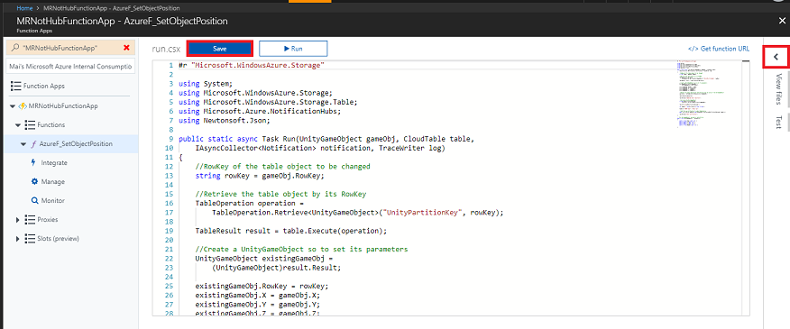

20. A panel will slide in from the right. In that panel, click **Upload**, and a File Browser will appear.

21. Navigate to, and click, the **project.json** file, which you created in **Notepad** previously, and then click the **Open** button. This file defines the libraries that your function will use.

    

22. When the file has uploaded, it will appear in the panel on the right. Clicking it will open it within the **Function** editor. It must look **exactly** the same as the next image (below step 23).

23. Then, in the panel on the left, beneath **Functions**, click the **Integrate** link.

    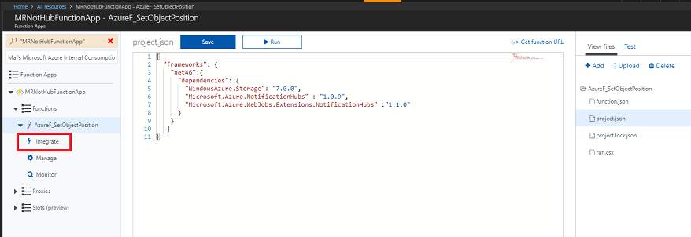

24. On the next page, in the top right corner, click **Advanced editor** (as below).

    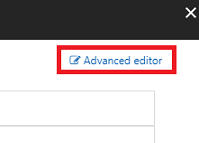

25. A **function.json** file will be opened in the center panel, which needs to be replaced with the following code snippet. This defines the function you are building and the parameters passed into the function.

    ```json
    {
    "bindings": [
        {
        "authLevel": "function",
        "type": "httpTrigger",
        "methods": [
            "get",
            "post"
        ],
        "name": "gameObj",
        "direction": "in"
        },
        {
        "type": "table",
        "name": "table",
        "tableName": "SceneObjectsTable",
        "connection": "mrnothubstorage_STORAGE",
        "direction": "in"
        },
        {
        "type": "notificationHub",
        "direction": "out",
        "name": "notification",
        "hubName": "MR_NotHub_ServiceInstance",
        "connection": "MRNotHubNS_DefaultFullSharedAccessSignature_NH",
        "platform": "wns"
        }
    ]
    }
    ```

26. Your editor should now look like the image below:

    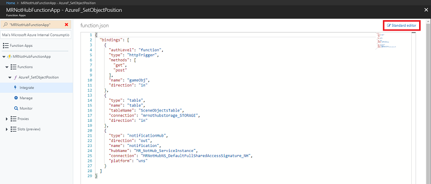

27. You may notice the input parameters that you have just inserted might not match your table and storage details and therefore will need to be updated with your information. **Do not do this here**, as it is covered next. Simply click the **Standard editor** link, in the top-right corner of the page, to go back.

28. Back in the **Standard editor**, click **Azure Table Storage (table)**, under **Inputs**. 
    
    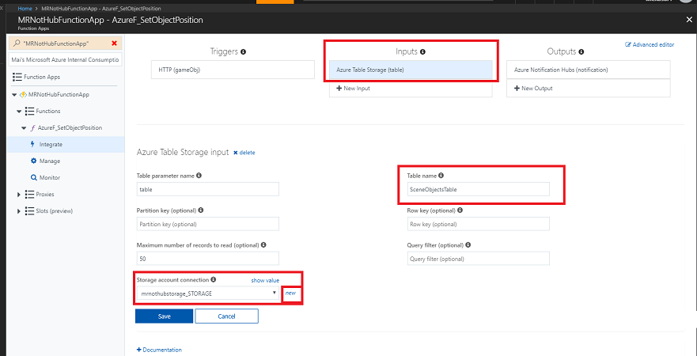

29. Ensure the following match to **your** information, as they may be different (there is an image below the following steps):

    1.  **Table name**: the name of the table you created within your Azure Storage, Tables service.

    2.  **Storage account connection:** click **new**, which appears alongside the dropdown menu, and a panel will appear to the right of the window.

        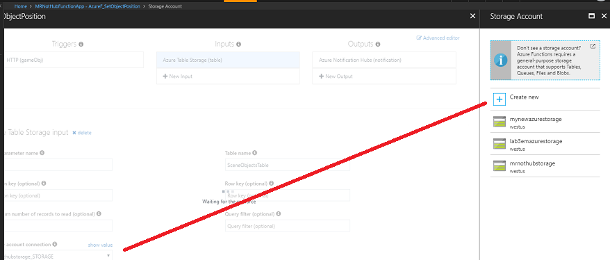

        1.  Select your **Storage Account**, which you created previously to host the **Function Apps.**

        2. You will notice that the **Storage Account** connection value has been created.

        3. Make sure to press **Save** once you are done.

    3.  The **Inputs** page should now match the below, showing **your** information.

        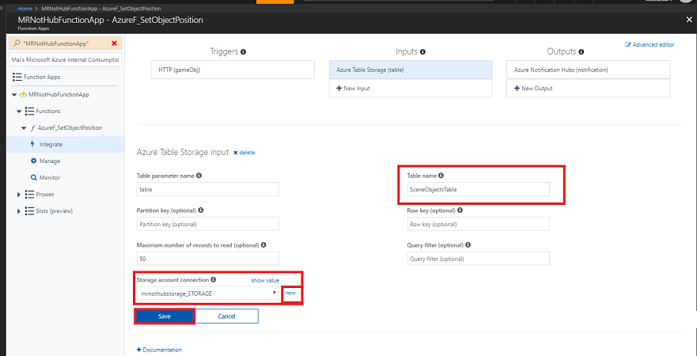

30. Next, click **Azure Notification Hub (notification)** - under **Outputs**. Ensure the following are matched to **your** information, as they may be different (there is an image below the following steps):

    1.  **Notification Hub Name**: this is the name of your **Notification Hub** service instance, which you created previously.

    2.  **Notification Hubs namespace connection**: click **new**, which appears alongside the dropdown menu.

        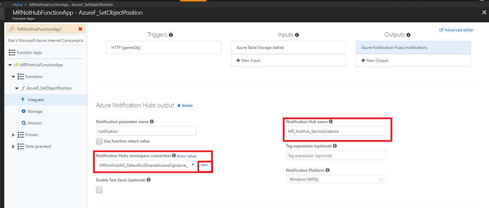

    3. The **Connection** popup will appear (see image below), where you need to select the **Namespace** of the **Notification Hub**, which you set up previously.

    4. Select your **Notification Hub** name from the middle dropdown menu.

    5.  Set the **Policy** dropdown menu to **DefaultFullSharedAccessSignature**.

    6. Click the **Select** button to go back.

        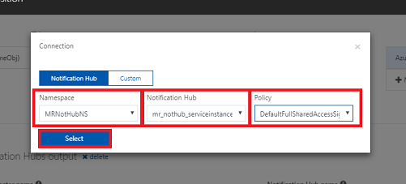

31.  The **Outputs** page should now match the below, but with **your** information instead. Make sure to press **Save**.

> [!WARNING]
> *Do not edit the Notification Hub name directly* (this should all be done using the **Advanced Editor**, provided you followed the previous steps correctly.


32. At this point, you should test the function, to ensure it is working. To do this: 

    1. Navigate to the function page once more:

        

    2. Back on the function page, click the **Test** tab on the far right side of the page, to open the *Test* blade:

        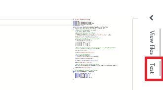

    3. Within the **Request body** textbox of the blade, paste the below code:

        ```
        {  
            "Type":null,
            "X":3,
            "Y":0,
            "Z":1,
            "PartitionKey":null,
            "RowKey":"Obj2",
            "Timestamp":"0001-01-01T00:00:00+00:00",
            "ETag":null
        }
        ```

    4. With the test code in place, click the **Run** button at the bottom right, and the test will be run. The output logs of the test will appear in the console area, below your function code.

        

    > [!WARNING]
    > If the above test fails, you will need to double check that you have followed the above steps exactly, particularly the settings within the **integrate panel**. 

## Chapter 7 - Set up Desktop Unity Project

> [!IMPORTANT]
> The Desktop application which you are now creating, **will not** work in the Unity Editor. It needs to be run outside of the Editor, following the Building of the application, using Visual Studio (or the deployed application). 

The following is a typical set up for developing with Unity and mixed reality, and as such, is a good template for other projects.

Set up and test your mixed reality immersive headset.

> [!NOTE] 
> You will **not** require Motion Controllers for this course. If you need support setting up the immersive headset, please follow this [link on how to set up Windows Mixed Reality](https://support.microsoft.com/help/4043101/windows-10-set-up-windows-mixed-reality).

1.  Open **Unity** and click **New**.

    

2.  You need to provide a Unity Project name, insert **UnityDesktopNotifHub**. Make sure the project type is set to **3D**. Set the **Location** to somewhere appropriate for you (remember, closer to root directories is better). Then, click **Create project**.

    

3.  With Unity open, it is worth checking the default **Script Editor** is set to **Visual Studio**. Go to **Edit** > **Preferences** and then from the new window, navigate to **External Tools**. Change **External Script Editor** to **Visual Studio 2017**. Close the **Preferences** window.

    

4.  Next, go to **File** > **Build Settings** and select **Universal Windows Platform**, then click on the **Switch Platform** button to apply your selection.

    

5.  While still in **File** > **Build Settings**, make sure that:

    1.  **Target Device** is set to **Any Device**

        > This Application will be for your desktop, so must be **Any Device**

    2.  **Build Type** is set to **D3D**

    3.  **SDK** is set to **Latest installed**

    4.  **Visual Studio Version** is set to **Latest installed**

    5.  **Build and Run** is set to **Local Machine**

    6.  While here, it is worth saving the scene, and adding it to the build.

        1. Do this by selecting **Add Open Scenes**. A save window will appear.

            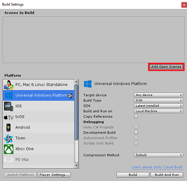

        2. Create a new folder for this, and any future, scene, then select the **New folder** button, to create a new folder, name it **Scenes**.

            

        3. Open your newly created **Scenes** folder, and then in the **File name:** text field, type **NH\_Desktop\_Scene**, then press **Save**.

            

    7.  The remaining settings, in **Build Settings**, should be left as default for now.

6.  In the same window click on the **Player Settings** button, this will open the related panel in the space where the **Inspector** is located.

7.  In this panel, a few settings need to be verified:

    1.  In the **Other Settings** tab:

        1.  **Scripting Runtime Version** should be **Experimental (.NET 4.6 Equivalent)**

        2. **Scripting Backend** should be **.NET**

        3. **API Compatibility Level** should be **.NET 4.6**

            

    2.  Within the **Publishing Settings** tab, under **Capabilities**, check:

        - **InternetClient**

            

8.  Back in **Build Settings** *Unity C\# Projects* is no longer greyed out; tick the checkbox next to this.

9.  Close the **Build Settings** window.

10. Save your Scene and Project **File** > **Save Scene / File** > **Save Project**.

    > [!IMPORTANT]
    > If you wish to skip the *Unity Set up* component for this project (Desktop App), and continue straight into code, feel free to [download this .unitypackage](https://github.com/Microsoft/HolographicAcademy/raw/Azure-MixedReality-Labs/Azure%20Mixed%20Reality%20Labs/MR%20and%20Azure%20308%20-%20Cross-device%20notifications/Azure-MR-308-Desktop.unitypackage), import it into your project as a [**Custom Package**](https://docs.unity3d.com/Manual/AssetPackages.html), and then continue from [Chapter 9](#chapter-9---create-the-tabletoscene-class-in-the-desktop-unity-project).  You will still need to add the script components.

## Chapter 8 - Importing the DLLs in Unity

You will be using Azure Storage for Unity (which itself leverages the .Net SDK for Azure). For more information follow this [link about Azure Storage for Unity](/sandbox/gamedev/unity/azure-storage-unity).

There is currently a known issue in Unity which requires plugins to be reconfigured after import. These steps (4 - 7 in this section) will no longer be required after the bug has been resolved.

To import the SDK into your own project, make sure you have downloaded the latest [**.unitypackage**](https://aka.ms/azstorage-unitysdk) from GitHub. Then, do the following:

1.  Add the **.unitypackage** to Unity by using the **Assets \> Import Package \> Custom Package** menu option.

2.  In the **Import Unity Package** box that pops up, you can select everything under ***Plugin* \> *Storage***.  Uncheck everything else, as it is not needed for this course.

    

3.  Click the ***Import*** button to add the items to your project.

4.  Go to the **Storage** folder under **Plugins** in the Project view and select the following plugins *only*:

    -   Microsoft.Data.Edm
    -   Microsoft.Data.OData
    -   Microsoft.WindowsAzure.Storage
    -   Newtonsoft.Json
    -   System.Spatial

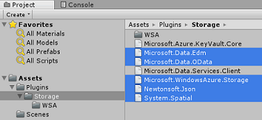

5.  With *these specific plugins* selected, **uncheck** **Any Platform** and **uncheck** **WSAPlayer** then click **Apply**.

    

    > [!NOTE] 
    > We are marking these particular plugins to only be used in the Unity Editor. This is because there are different versions of the same plugins in the WSA folder that will be used after the project is exported from Unity.

6.  In the **Storage** plugin folder, select only:

    -   Microsoft.Data.Services.Client

        

7.  Check the **Don't Process** box under **Platform Settings** and click ***Apply***.

    

    > [!NOTE] 
    > We are marking this plugin "Don't process", because the Unity assembly patcher has difficulty processing this plugin. The plugin will still work even though it is not processed.

## Chapter 9 - Create the TableToScene class in the Desktop Unity project

You now need to create the scripts containing the code to run this application.

The first script you need to create is **TableToScene**, which is responsible for:

-   Reading entities within the Azure Table.
-   Using the Table data, determine which objects to spawn, and in which position.

The second script you need to create is **CloudScene**, which is responsible for:

-   Registering the left-click event, to allow the user to drag objects around the scene.
-   Serializing the object data from this Unity scene, and sending it to the Azure Function App.

To create this class:

1.  Right-click in the **Asset** Folder located in the Project Panel, **Create** > **Folder**. Name the folder **Scripts**.

    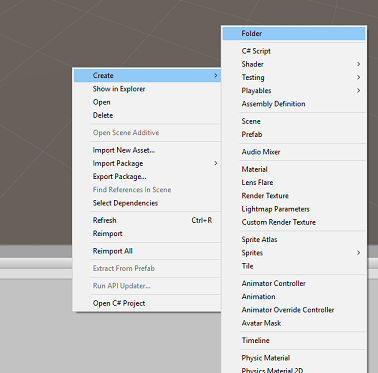

    

2.  Double click on the folder just created, to open it.

3.  Right-click inside the **Scripts** folder, click **Create** > **C# Script**. Name the script **TableToScene**.

    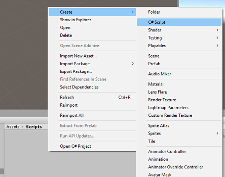
    

4.  Double-click on the script to open it in Visual Studio 2017.

5.  Add the following namespaces:

    ```csharp
    using Microsoft.WindowsAzure.Storage;
    using Microsoft.WindowsAzure.Storage.Auth;
    using Microsoft.WindowsAzure.Storage.Table;
    using UnityEngine;
    ```

6.  Within the class, insert the following variables:

    ```csharp
        /// <summary>    
        /// allows this class to behave like a singleton
        /// </summary>    
        public static TableToScene instance;

        /// <summary>    
        /// Insert here you Azure Storage name     
        /// </summary>    
        private string accountName = " -- Insert your Azure Storage name -- ";

        /// <summary>    
        /// Insert here you Azure Storage key    
        /// </summary>    
        private string accountKey = " -- Insert your Azure Storage key -- ";
    ```
    
    > [!NOTE] 
    > Substitute the **accountName** value with your Azure Storage Service name and **accountKey** value with the key value found in the Azure Storage Service, in the Azure Portal (See Image below). 
    >
    > 

7.  Now add the **Start()** and **Awake()** methods to initialize the
    class.

    ```csharp
        /// <summary>
        /// Triggers before initialization
        /// </summary>
        void Awake()
        {
            // static instance of this class
            instance = this;
        }

        /// <summary>
        /// Use this for initialization
        /// </summary>
        void Start()
        {  
            // Call method to populate the scene with new objects as 
            // pecified in the Azure Table
            PopulateSceneFromTableAsync();
        }
    ```

8.  Within the **TableToScene** class, add the method that will retrieve the values from the Azure Table and use them to spawn the appropriate primitives in the scene.

    ```csharp
        /// <summary>    
        /// Populate the scene with new objects as specified in the Azure Table    
        /// </summary>    
        private async void PopulateSceneFromTableAsync()
        {
            // Obtain credentials for the Azure Storage
            StorageCredentials creds = new StorageCredentials(accountName, accountKey);

            // Storage account
            CloudStorageAccount account = new CloudStorageAccount(creds, useHttps: true);
            
            // Storage client
            CloudTableClient client = account.CreateCloudTableClient(); 
            
            // Table reference
            CloudTable table = client.GetTableReference("SceneObjectsTable");

            TableContinuationToken token = null;

            // Query the table for every existing Entity
            do
            {
                // Queries the whole table by breaking it into segments
                // (would happen only if the table had huge number of Entities)
                TableQuerySegment<AzureTableEntity> queryResult = await table.ExecuteQuerySegmentedAsync(new TableQuery<AzureTableEntity>(), token); 

                foreach (AzureTableEntity entity in queryResult.Results)
                {
                    GameObject newSceneGameObject = null;
                    Color newColor;

                    // check for the Entity Type and spawn in the scene the appropriate Primitive
                    switch (entity.Type)
                    {
                        case "Cube":
                            // Create a Cube in the scene
                            newSceneGameObject = GameObject.CreatePrimitive(PrimitiveType.Cube);
                            newColor = Color.blue;
                            break;

                        case "Sphere":
                            // Create a Sphere in the scene
                            newSceneGameObject = GameObject.CreatePrimitive(PrimitiveType.Sphere);
                            newColor = Color.red;
                            break;

                        case "Cylinder":
                            // Create a Cylinder in the scene
                            newSceneGameObject = GameObject.CreatePrimitive(PrimitiveType.Cylinder);
                            newColor = Color.yellow;
                            break;
                        default:
                            newColor = Color.white;
                            break;
                    }

                    newSceneGameObject.name = entity.RowKey;

                    newSceneGameObject.GetComponent<MeshRenderer>().material = new Material(Shader.Find("Diffuse"))
                    {
                        color = newColor
                    };

                    //check for the Entity X,Y,Z and move the Primitive at those coordinates
                    newSceneGameObject.transform.position = new Vector3((float)entity.X, (float)entity.Y, (float)entity.Z);
                }

                // if the token is null, it means there are no more segments left to query
                token = queryResult.ContinuationToken;
            }

            while (token != null);
        }
    ```

9.  Outside the **TableToScene** class, you need to define the class used by the application to serialize and deserialize the **Table Entities**.

    ```csharp
        /// <summary>
        /// This objects is used to serialize and deserialize the Azure Table Entity
        /// </summary>
        [System.Serializable]
        public class AzureTableEntity : TableEntity
        {
            public AzureTableEntity(string partitionKey, string rowKey)
                : base(partitionKey, rowKey) { }

            public AzureTableEntity() { }
            public string Type { get; set; }
            public double X { get; set; }
            public double Y { get; set; }
            public double Z { get; set; }
        }
    ```

10. Make sure you **Save** before going back to the Unity Editor.

11. Click the **Main Camera** from the **Hierarchy** panel, so that its properties appear in the **Inspector**.

12. With the **Scripts** folder open, select the script **TableToScene file** and drag it onto the **Main Camera**. The result should be as below:

    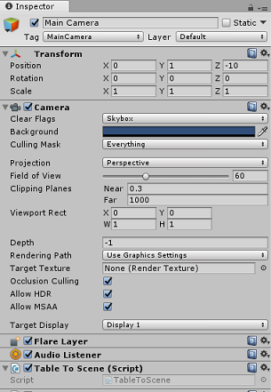

## Chapter 10 - Create the CloudScene class in the Desktop Unity Project

The second script you need to create is **CloudScene**, which is responsible for:

-   Registering the left-click event, to allow the user to drag objects around the scene.

-   Serializing the object data from this Unity scene, and sending it to the Azure Function App.

To create the second script:

1.  Right-click inside the **Scripts** folder, click **Create**, **C\# Script**. Name the script **CloudScene**
    
    
    

2.  Add the following namespaces:

    ```csharp
    using Newtonsoft.Json;
    using System.Collections;
    using System.Text;
    using System.Threading.Tasks;
    using UnityEngine;
    using UnityEngine.Networking;
    ```

3.  Insert the following variables:

    ```csharp
        /// <summary>
        /// Allows this class to behave like a singleton
        /// </summary>
        public static CloudScene instance;

        /// <summary>
        /// Insert here you Azure Function Url
        /// </summary>
        private string azureFunctionEndpoint = "--Insert here you Azure Function Endpoint--";

        /// <summary>
        /// Flag for object being moved
        /// </summary>
        private bool gameObjHasMoved;

        /// <summary>
        /// Transform of the object being dragged by the mouse
        /// </summary>
        private Transform gameObjHeld;

        /// <summary>
        /// Class hosted in the TableToScene script
        /// </summary>
        private AzureTableEntity azureTableEntity;
    ```

4.  Substitute the **azureFunctionEndpoint** value with your Azure Function App URL found in the Azure Function App Service, in the Azure Portal, as shown in the image below:

    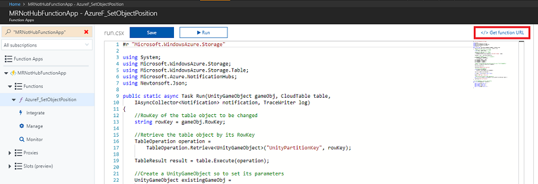

5.  Now add the **Start()** and **Awake()** methods to initialize the class.

    ```csharp
        /// <summary>
        /// Triggers before initialization
        /// </summary>
        void Awake()
        {
            // static instance of this class
            instance = this;
        }

        /// <summary>
        /// Use this for initialization
        /// </summary>
        void Start()
        {
            // initialise an AzureTableEntity
            azureTableEntity = new AzureTableEntity();
        }
    ```

6.  Within the **Update()** method, add the following code that will detect the mouse input and drag, which will in turn move GameObjects in the scene. If the user has dragged and dropped an object, it will pass the name and coordinates of the object to the method **UpdateCloudScene()**, which will call the Azure Function App service, which will update the Azure table and trigger the notification.

    ```csharp
        /// <summary>
        /// Update is called once per frame
        /// </summary>
        void Update()
        {
            //Enable Drag if button is held down
            if (Input.GetMouseButton(0))
            {
                // Get the mouse position
                Vector3 mousePosition = new Vector3(Input.mousePosition.x, Input.mousePosition.y, 10);

                Vector3 objPos = Camera.main.ScreenToWorldPoint(mousePosition);

                Ray ray = Camera.main.ScreenPointToRay(Input.mousePosition);

                RaycastHit hit;

                // Raycast from the current mouse position to the object overlapped by the mouse
                if (Physics.Raycast(ray, out hit))
                {
                    // update the position of the object "hit" by the mouse
                    hit.transform.position = objPos;

                    gameObjHasMoved = true;

                    gameObjHeld = hit.transform;
                }
            }

            // check if the left button mouse is released while holding an object
            if (Input.GetMouseButtonUp(0) && gameObjHasMoved)
            {
                gameObjHasMoved = false;

                // Call the Azure Function that will update the appropriate Entity in the Azure Table
                // and send a Notification to all subscribed Apps
                Debug.Log("Calling Azure Function");

                StartCoroutine(UpdateCloudScene(gameObjHeld.name, gameObjHeld.position.x, gameObjHeld.position.y, gameObjHeld.position.z));
            }
        }
    ```

7.  Now add the **UpdateCloudScene()** method, as below:

    ```csharp
        private IEnumerator UpdateCloudScene(string objName, double xPos, double yPos, double zPos)
        {
            WWWForm form = new WWWForm();

            // set the properties of the AzureTableEntity
            azureTableEntity.RowKey = objName;

            azureTableEntity.X = xPos;

            azureTableEntity.Y = yPos;

            azureTableEntity.Z = zPos;

            // Serialize the AzureTableEntity object to be sent to Azure
            string jsonObject = JsonConvert.SerializeObject(azureTableEntity);

            using (UnityWebRequest www = UnityWebRequest.Post(azureFunctionEndpoint, jsonObject))
            {
                byte[] jsonToSend = new System.Text.UTF8Encoding().GetBytes(jsonObject);

                www.uploadHandler = new UploadHandlerRaw(jsonToSend);

                www.uploadHandler.contentType = "application/json";

                www.downloadHandler = new DownloadHandlerBuffer();

                www.SetRequestHeader("Content-Type", "application/json");

                yield return www.SendWebRequest();

                string response = www.responseCode.ToString();
            }
        }
    ```

8.  Save the code and return to Unity

9.  Drag the **CloudScene** script onto the **Main Camera**. 

    1. Click the **Main Camera** from the **Hierarchy** panel, so that its properties appear in the **Inspector**. 

    2. With the **Scripts** folder open, select the **CloudScene** script and drag it onto the **Main Camera**. The result should be as below:

        > 

## Chapter 11 - Build the Desktop Project to UWP

Everything needed for the Unity section of this project has now been completed.

1.  Navigate to **Build Settings** (**File** > **Build Settings**).

2.  From the **Build Settings** window, click **Build**.

    

3.  A **File Explorer** window will popup, prompting you for a location to Build. Create a new folder (by clicking **New Folder** in the top-left corner), and name it **BUILDS**.

    

    1.  Open the new **BUILDS** folder, and create another folder (using **New Folder** once more), and name it **NH\_Desktop\_App**.

        

    2.  With the **NH\_Desktop\_App** selected. click **Select Folder**. The project will take a minute or so to build.

4.  Following build, **File Explorer** will appear showing you the location of your new project. No need to open it, though, as you need to create the other Unity project first, in the next few Chapters.


## Chapter 12 - Set up Mixed Reality Unity Project

The following is a typical set up for developing with the mixed reality, and as such, is a good template for other projects.

1.  Open **Unity** and click **New**.

    

2.  You will now need to provide a Unity Project name, insert **UnityMRNotifHub**. Make sure the project type is set to **3D**. Set the **Location** to somewhere appropriate for you (remember, closer to root directories is better). Then, click **Create project**.

    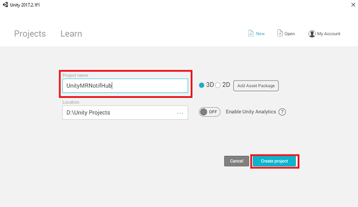

3.  With Unity open, it is worth checking the default **Script Editor** is set to **Visual Studio**. Go to **Edit** > **Preferences** and then from the new window, navigate to **External Tools**. Change **External Script Editor** to **Visual Studio 2017**. Close the **Preferences** window.

    

4.  Next, go to **File** > **Build Settings** and switch the platform to **Universal Windows Platform**, by clicking on the **Switch Platform** button.

    

5.  Go to **File** > **Build Settings** and make sure that:

    1.  **Target Device** is set to **Any Device**

        > For the Microsoft HoloLens, set **Target Device** to *HoloLens*.

    2.  **Build Type** is set to **D3D**

    3.  **SDK** is set to **Latest installed**

    4.  **Visual Studio Version** is set to **Latest installed**

    5.  **Build and Run** is set to **Local Machine**

    6.  While here, it is worth saving the scene, and adding it to the build.

        1. Do this by selecting **Add Open Scenes**. A save window will appear.

            

        2. Create a new folder for this, and any future, scene, then select the **New folder** button, to create a new folder, name it **Scenes**.

            

        3. Open your newly created **Scenes** folder, and then in the **File name:** text field, type **NH\_MR\_Scene**, then press **Save**.

            

    7.  The remaining settings, in **Build Settings**, should be left as default for now.

6.  In the same window click on the **Player Settings** button, this will open the related panel in the space where the **Inspector** is located.    

    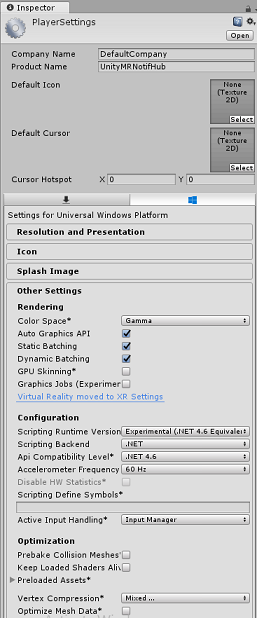

7.  In this panel, a few settings need to be verified:

    1.  In the **Other Settings** tab:

        1.  **Scripting Runtime Version** should be **Experimental** (.NET 4.6 Equivalent)
        2.  **Scripting Backend** should be ***.NET***
        3.  **API Compatibility Level** should be **.NET 4.6**

            

    2.  Further down the panel, in **XR Settings** (found below **Publish Settings**), tick **Virtual Reality Supported**, make sure the **Windows Mixed Reality SDK** is added

        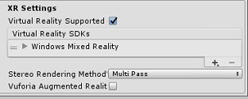        

    3.  Within the **Publishing Settings** tab, under **Capabilities**, heck:

        - **InternetClient**           

            

8.  Back in **Build Settings**, **Unity C# Projects** is no longer greyed out: tick the checkbox next to this.

9.  With these changes done, close the Build Settings window.

10. Save your Scene and Project **File** > **Save Scene / File** > **Save Project**.

    > [!IMPORTANT]
    > If you wish to skip the *Unity Set up* component for this project (mixed reality App), and continue straight into code, feel free to [download this .unitypackage](https://github.com/Microsoft/HolographicAcademy/raw/Azure-MixedReality-Labs/Azure%20Mixed%20Reality%20Labs/MR%20and%20Azure%20308%20-%20Cross-device%20notifications/Azure-MR-308-MR.unitypackage), import it into your project as a [**Custom Package**](https://docs.unity3d.com/Manual/AssetPackages.html), and then continue from [Chapter 14](#chapter-14---creating-the-tabletoscene-class-in-the-mixed-reality-unity-project). You will still need to add the script components.

### Chapter 13 - Importing the DLLs in the Mixed Reality Unity Project

You will be using Azure Storage for Unity library (which uses the .Net SDK for Azure). Please follow this [link on how to use Azure Storage with Unity](/sandbox/gamedev/unity/azure-storage-unity).
There is currently a known issue in Unity which requires plugins to be reconfigured after import. These steps (4 - 7 in this section) will no longer be required after the bug has been resolved.

To import the SDK into your own project, make sure you have downloaded the latest [.unitypackage](https://aka.ms/azstorage-unitysdk). Then, do the following:

1.  Add the .unitypackage you downloaded from the above, to Unity by using the **Assets** > **Import Package** > **Custom Package** menu option.

2.  In the **Import Unity Package** box that pops up, you can select everything under **Plugin** > **Storage**.

    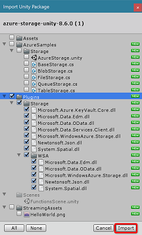

3.  Click the **Import** button to add the items to your project.

4.  Go to the **Storage** folder under **Plugins** in the Project view and select the following plugins *only*:

    -   Microsoft.Data.Edm
    -   Microsoft.Data.OData
    -   Microsoft.WindowsAzure.Storage
    -   Newtonsoft.Json
    -   System.Spatial

    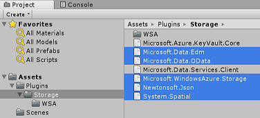

5.  With *these specific plugins* selected, **uncheck** **Any Platform** and **uncheck** **WSAPlayer** then click **Apply**.

    

    > [!NOTE] 
    > You are marking these particular plugins to only be used in the Unity Editor. This is because there are different versions of the same plugins in the WSA folder that will be used after the project is exported from Unity.

6.  In the **Storage** plugin folder, select only:

    -   Microsoft.Data.Services.Client

        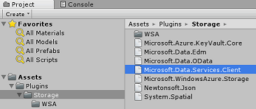

7.  Check the **Don't Process** box under **Platform Settings** and click **Apply**.

    

    > [!NOTE] 
    > You are marking this plugin "Don't process" because the Unity assembly patcher has difficulty processing this plugin. The plugin will still work even though it isn't processed.

## Chapter 14 - Creating the TableToScene class in the mixed reality Unity project

The **TableToScene** class is identical to the one explained in [Chapter 9](#chapter-9---create-the-tabletoscene-class-in-the-desktop-unity-project). Create the same class in the mixed reality Unity Project following the same procedure explained in [Chapter 9](#chapter-9---create-the-tabletoscene-class-in-the-desktop-unity-project).

Once you have completed this Chapter, both of your **Unity Projects** will have this class set up on the Main Camera.

## Chapter 15 - Creating the NotificationReceiver class in the Mixed Reality Unity Project

The second script you need to create is **NotificationReceiver**,
which is responsible for:

-   Registering the app with the Notification Hub at initialization.
-   Listening to notifications coming from the Notification Hub.
-   Deserializing the object data from received notifications.
-   Move the GameObjects in the scene, based on the deserialized data.

To create the **NotificationReceiver** script:

1.  Right-click inside the **Scripts** folder, click **Create**, **C\# Script**. Name the script **NotificationReceiver**.

    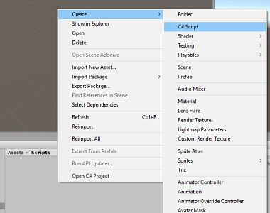
    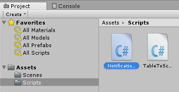

2.  Double click on the script to open it.

3.  Add the following namespaces:

    ```csharp
    //using Microsoft.WindowsAzure.Messaging;
    using Newtonsoft.Json;
    using System;
    using System.Collections;
    using UnityEngine;

    #if UNITY_WSA_10_0 && !UNITY_EDITOR
    using Windows.Networking.PushNotifications;
    #endif
    ```

4.  Insert the following variables:

    ```csharp
        /// <summary>
        /// allows this class to behave like a singleton
        /// </summary>
        public static NotificationReceiver instance;

        /// <summary>
        /// Value set by the notification, new object position
        /// </summary>
        Vector3 newObjPosition;

        /// <summary>
        /// Value set by the notification, object name
        /// </summary>
        string gameObjectName;

        /// <summary>
        /// Value set by the notification, new object position
        /// </summary>
        bool notifReceived;

        /// <summary>
        /// Insert here your Notification Hub Service name 
        /// </summary>
        private string hubName = " -- Insert the name of your service -- ";

        /// <summary>
        /// Insert here your Notification Hub Service "Listen endpoint"
        /// </summary>
        private string hubListenEndpoint = "-Insert your Notification Hub Service Listen endpoint-";
    ```

5.  Substitute the **hubName** value with your Notification Hub Service name, and **hubListenEndpoint** value with the endpoint value found in the Access Policies tab, Azure Notification Hub Service, in the Azure Portal (see image below).

    

6.  Now add the **Start()** and **Awake()** methods to initialize the class.

    ```csharp
        /// <summary>
        /// Triggers before initialization
        /// </summary>
        void Awake()
        {
            // static instance of this class
            instance = this;
        }

        /// <summary>
        /// Use this for initialization
        /// </summary>
        void Start()
        {
            // Register the App at launch
            InitNotificationsAsync();

            // Begin listening for notifications
            StartCoroutine(WaitForNotification());
        }
    ```

7.  Add the **WaitForNotification** method to allow the app to receive notifications from the Notification Hub Library without clashing with the Main Thread:

    ```csharp
        /// <summary>
        /// This notification listener is necessary to avoid clashes 
        /// between the notification hub and the main thread   
        /// </summary>
        private IEnumerator WaitForNotification()
        {
            while (true)
            {
                // Checks for notifications each second
                yield return new WaitForSeconds(1f);

                if (notifReceived)
                {
                    // If a notification is arrived, moved the appropriate object to the new position
                    GameObject.Find(gameObjectName).transform.position = newObjPosition;

                    // Reset the flag
                    notifReceived = false;
                }
            }
        }
    ```

8.  The following method, **InitNotificationAsync()**, will register the application with the notification Hub Service at initialization. The code is commented out as Unity will not be able to Build the project. You will remove the comments when you import the Azure Messaging Nuget package in Visual Studio.

    ```csharp
        /// <summary>
        /// Register this application to the Notification Hub Service
        /// </summary>
        private async void InitNotificationsAsync()
        {
            // PushNotificationChannel channel = await PushNotificationChannelManager.CreatePushNotificationChannelForApplicationAsync();

            // NotificationHub hub = new NotificationHub(hubName, hubListenEndpoint);

            // Registration result = await hub.RegisterNativeAsync(channel.Uri);

            // If registration was successful, subscribe to Push Notifications
            // if (result.RegistrationId != null)
            // {
            //     Debug.Log($"Registration Successful: {result.RegistrationId}");
            //     channel.PushNotificationReceived += Channel_PushNotificationReceived;
            // }
        }
    ```

9.  The following handler, **Channel\_PushNotificationReceived()**, will be triggered every time a notification is received. It will deserialize the notification, which will be the Azure Table Entity that has been moved on the Desktop Application, and then move the corresponding GameObject in the MR scene to the same position. 
    
    > [!IMPORTANT]
    > The code is commented out because the code references the Azure Messaging library, which you will add after building the Unity project using the Nuget Package Manager, within Visual Studio. As such, the Unity project will not be able to build, unless it is commented out. Be aware, that should you build your project, and then wish to return to Unity, you will need to **re-comment** that code.

    ```csharp
        ///// <summary>
        ///// Handler called when a Push Notification is received
        ///// </summary>
        //private void Channel_PushNotificationReceived(PushNotificationChannel sender, PushNotificationReceivedEventArgs args)    
        //{
        //    Debug.Log("New Push Notification Received");
        //
        //    if (args.NotificationType == PushNotificationType.Raw)
        //    {
        //        //  Raw content of the Notification
        //        string jsonContent = args.RawNotification.Content;
        //
        //        // Deserialise the Raw content into an AzureTableEntity object
        //        AzureTableEntity ate = JsonConvert.DeserializeObject<AzureTableEntity>(jsonContent);
        //
        //        // The name of the Game Object to be moved
        //        gameObjectName = ate.RowKey;          
        //
        //        // The position where the Game Object has to be moved
        //        newObjPosition = new Vector3((float)ate.X, (float)ate.Y, (float)ate.Z);
        //
        //        // Flag thats a notification has been received
        //        notifReceived = true;
        //    }
        //}
    ```

10. Remember to save your changes before going back to the Unity Editor.

11. Click the **Main Camera** from the **Hierarchy** panel, so that its properties appear in the **Inspector**.

12. With the **Scripts** folder open, select the **NotificationReceiver** script and drag it onto the **Main Camera**. The result should be as below:

    

    > [!NOTE]
    > If you are developing this for the Microsoft HoloLens, you will need to update the **Main Camera**'s *Camera* component, so that:
    > - Clear Flags: Solid Color
    > - Background: Black

## Chapter 16 - Build the Mixed Reality Project to UWP

This Chapter is identical to build process for the previous project. Everything needed for the Unity section of this project has now been completed, so it is time to build it from Unity.

1.  Navigate to **Build Settings** ( **File** > **Build Settings** ).

2.  From the **Build Settings** menu, ensure **Unity C# Projects*** is ticked (which will allow you to edit the scripts in this project, after build).

3.  After this is done, click **Build**.

    

4.  A **File Explorer** window will popup, prompting you for a location to Build. Create a new folder (by clicking **New Folder** in the top-left corner), and name it **BUILDS**.

    

    1.  Open the new **BUILDS** folder, and create another folder (using **New Folder** once more), and name it **NH\_MR\_App**.

        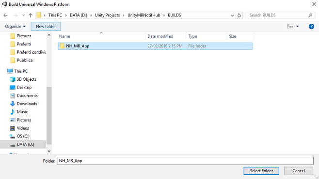

    2.  With the **NH\_MR\_App** selected. click **Select Folder**. The project will take a minute or so to build.

5.  Following the build, a **File Explorer** window will open at the location of your new project.


## Chapter 17 - Add NuGet packages to the UnityMRNotifHub Solution

> [!WARNING] 
> Please remember that, once you add the following NuGet Packages (and uncomment the code in the next [Chapter](#chapter-18---edit-unitymrnotifhub-application-notificationreceiver-class)), the Code, when reopened within the Unity Project, will present errors. If you wish to go back and continue editing in the Unity Editor, you will need comment that errosome code, and then uncomment again later, once you are back in Visual Studio. 

Once the mixed reality build has been completed, navigate to the mixed reality project, which you built, and double click on the solution (.sln) file within that folder, to open your solution with Visual Studio 2017.
You will now need to add the **WindowsAzure.Messaging.managed** NuGet package; this is a library that is used to receive Notifications from the Notification Hub.

To import the NuGet package:

1.  In the **Solution Explorer**, right click on your Solution

2.  Click on **Manage NuGet Packages**.

    

3.  Select the ***Browse*** tab and search for **WindowsAzure.Messaging.managed**.

    

4.  Select the result (as shown below), and in the window to the right, select the checkbox next to **Project**. This will place a tick in the checkbox next to **Project**, along with the checkbox next to the **Assembly-CSharp** and **UnityMRNotifHub** project.

    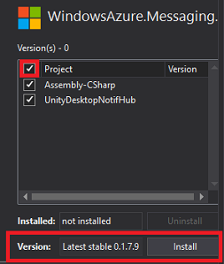

5.  The version initially provided **may not** be compatible with this project. Therefore, click on the dropdown menu next to **Version**, and click **Version 0.1.7.9**, then click **Install**.

6.  You have now finished installing the NuGet package. Find the commented code you entered in the **NotificationReceiver** class and remove the comments..


## Chapter 18 - Edit UnityMRNotifHub application, NotificationReceiver class

Following having added the **NuGet Packages**, you will need to *uncomment* some of the code within the **NotificationReceiver** class.

This includes:

1. The namespace at the top:

    ```csharp
    using Microsoft.WindowsAzure.Messaging;
    ```

2. All the code within the **InitNotificationsAsync()** method:

    ```csharp
        /// <summary>
        /// Register this application to the Notification Hub Service
        /// </summary>
        private async void InitNotificationsAsync()
        {
            PushNotificationChannel channel = await PushNotificationChannelManager.CreatePushNotificationChannelForApplicationAsync();

            NotificationHub hub = new NotificationHub(hubName, hubListenEndpoint);

            Registration result = await hub.RegisterNativeAsync(channel.Uri);

            // If registration was successful, subscribe to Push Notifications
            if (result.RegistrationId != null)
            {
                Debug.Log($"Registration Successful: {result.RegistrationId}");
                channel.PushNotificationReceived += Channel_PushNotificationReceived;
            }
        }
    ```

> [!WARNING]
> The code above has a comment in it: ensure that you have not accidentally *uncommented* that comment (as the code will not compile if you have!).

3. And, lastly, the **Channel_PushNotificationReceived** event:

    ```csharp
        /// <summary>
        /// Handler called when a Push Notification is received
        /// </summary>
        private void Channel_PushNotificationReceived(PushNotificationChannel sender, PushNotificationReceivedEventArgs args)
        {
            Debug.Log("New Push Notification Received");

            if (args.NotificationType == PushNotificationType.Raw)
            {
                //  Raw content of the Notification
                string jsonContent = args.RawNotification.Content;

                // Deserialize the Raw content into an AzureTableEntity object
                AzureTableEntity ate = JsonConvert.DeserializeObject<AzureTableEntity>(jsonContent);

                // The name of the Game Object to be moved
                gameObjectName = ate.RowKey;

                // The position where the Game Object has to be moved
                newObjPosition = new Vector3((float)ate.X, (float)ate.Y, (float)ate.Z);

                // Flag thats a notification has been received
                notifReceived = true;
            }
        }
    ```

With these uncommented, ensure that you save, and then proceed to the next Chapter.

## Chapter 19 - Associate the mixed reality project to the Store app

You now need to associate the **mixed reality** project to the Store App you created in at the start of the lab.

1.  Open the solution.

2.  Right click on the UWP app Project in the Solution Explorer panel, the go to **Store**, and **Associate App with the Store...**.

    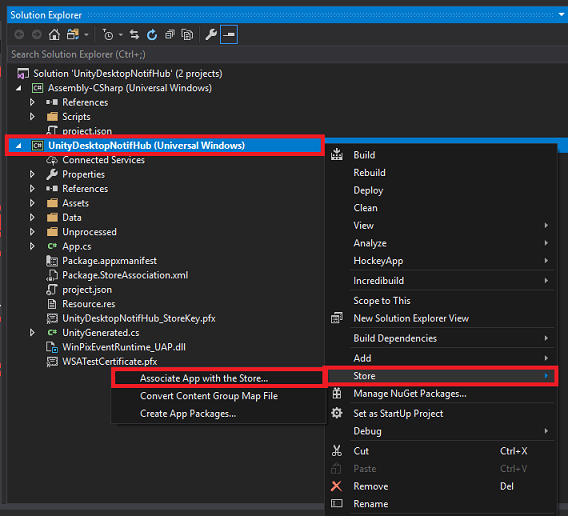

3.  A new window will appear called **Associate Your App with the Windows Store**. Click **Next**.

    

4.  It will load up all the Applications associated with the Account which you have logged in. If you are not logged in to your account, you can **Log In** on this page.

5.  Find the **Store App name** that you created at the start of this tutorial and select it. Then click **Next**.

    

6.  Click **Associate**.

    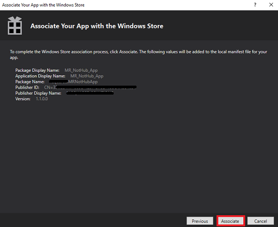

7.  Your App is now **Associated** with the Store App. This is necessary for enabling Notifications.

## Chapter 20 - Deploy UnityMRNotifHub and UnityDesktopNotifHub applications

This Chapter may be easier with two people, as the result will include both apps running, one running on your computer Desktop, and the other within your immersive headset.

The immersive headset app is waiting to receive changes to the scene (position changes of the local GameObjects), and the Desktop app will be making changes to their local scene (position changes), which will be shared to the MR app. It makes sense to deploy the MR app first, followed by the Desktop app, so that the receiver can begin listening.

To deploy the **UnityMRNotifHub** app on your Local Machine:

1.  Open the solution file of your **UnityMRNotifHub** app in **Visual Studio 2017**.

2.  In the **Solution Platform**, select **x86, Local Machine**.

3.  In the **Solution Configuration** select **Debug**.

    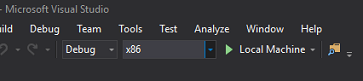

4.  Go to **Build menu** and click on **Deploy Solution** to sideload the application to your machine.

5.  Your App should now appear in the list of installed apps, ready to be launched.

To deploy the **UnityDesktopNotifHub** app on Local Machine:

1.  Open the solution file of your **UnityDesktopNotifHub** app in **Visual Studio 2017**.

2.  In the **Solution Platform**, select **x86, Local Machine**.

3.  In the **Solution Configuration** select **Debug**.

    

4.  Go to **Build menu** and click on **Deploy Solution** to sideload the application to your machine.

5.  Your App should now appear in the list of installed apps, ready to be launched.

6.  Launch the mixed reality application, followed by the Desktop application.

With both applications running, move an object in the desktop scene (using the Left Mouse Button). These positional changes will be made locally, serialized, and sent to the Function App service. The Function App service will then update the Table along with the Notification Hub. Having received an update, the Notification Hub will send the updated data directly to all the registered applications (in this case the immersive headset app), which will then deserialize the incoming data, and apply the new positional data to the local objects, moving them in scene.


## Your finished your Azure Notification Hubs application
 
Congratulations, you built a mixed reality app that leverages the Azure Notification Hubs Service and allow communication between apps.
 

 
## Bonus exercises

### Exercise 1

Can you work out how to change the color of the GameObjects and send that notification to other apps viewing the scene?

### Exercise 2

Can you add movement of the GameObjects to your MR app and see the updated scene in your desktop app?