---
title: HoloLens (1st gen) and Azure 309 - Application insights
description: Complete this course to learn how to collect analytics regarding user behavior within a mixed reality application, using the Azure Application Insights Service.
author: drneil
ms.author: jemccull
ms.date: 07/04/2018
ms.topic: article
keywords: azure, mixed reality, academy, unity, tutorial, api, application insights, hololens, immersive, vr, Windows 10, Visual Studio
--- 

# HoloLens (1st gen) and Azure 309: Application insights

<br>

>[!NOTE]
>The Mixed Reality Academy tutorials were designed with HoloLens (1st gen) and Mixed Reality Immersive Headsets in mind.  As such, we feel it is important to leave these tutorials in place for developers who are still looking for guidance in developing for those devices.  These tutorials will **_not_** be updated with the latest toolsets or interactions being used for HoloLens 2.  They will be maintained to continue working on the supported devices. There will be a new series of tutorials that will be posted in the future that will demonstrate how to develop for HoloLens 2.  This notice will be updated with a link to those tutorials when they are posted.

<br>


In this course, you will learn how to add Application Insights capabilities to a mixed reality application, using the Azure Application Insights API to collect analytics regarding user behavior.

Application Insights is a Microsoft service, allowing developers to collect analytics from their applications and manage it from an easy-to-use portal. The analytics can be anything from performance to custom information you would like to collect. For more information, visit the [Application Insights page](https://azure.microsoft.com/services/application-insights/).

Having completed this course, you will have a mixed reality immersive headset application which will be able to do the following:

1.  Allow the user to gaze and move around a scene.
2.  Trigger the sending of analytics to the *Application Insights Service*, through the use of Gaze and Proximity to in-scene objects.
3.  The app will also call upon the Service, fetching information about which object has been approached the most by the user, within the last 24 hours. That object will change its color to green.

This course will teach you how to get the results from the Application Insights Service, into a Unity-based sample application. It will be up to you to apply these concepts to a custom application you might be building.

## Device support

<table>
<tr>
<th>Course</th><th style="width:150px"> <a href="/hololens/hololens1-hardware">HoloLens</a></th><th style="width:150px"> <a href="/windows/mixed-reality/enthusiast-guide/immersive-headset-hardware-details">Immersive headsets</a></th>
</tr><tr>
<td> MR and Azure 309: Application insights</td><td style="text-align: center;"> ✔️</td><td style="text-align: center;"> ✔️</td>
</tr>
</table>

> [!NOTE]
> While this course primarily focuses on Windows Mixed Reality immersive (VR) headsets, you can also apply what you learn in this course to Microsoft HoloLens. As you follow along with the course, you will see notes on any changes you might need to employ to support HoloLens. When using HoloLens, you may notice some echo during voice capture.

## Prerequisites

> [!NOTE]
> This tutorial is designed for developers who have basic experience with Unity and C#. Please also be aware that the prerequisites and written instructions within this document represent what has been tested and verified at the time of writing (July 2018). You are free to use the latest software, as listed within the [install the tools](../../install-the-tools.md) article, though it should not be assumed that the information in this course will perfectly match what you will find in newer software than what is listed below.

We recommend the following hardware and software for this course:

- A development PC, [compatible with Windows Mixed Reality](https://support.microsoft.com/help/4039260/windows-10-mixed-reality-pc-hardware-guidelines) for immersive (VR) headset development
- [Windows 10 Fall Creators Update (or later) with Developer mode enabled](../../install-the-tools.md#installation-checklist)
- [The latest Windows 10 SDK](../../install-the-tools.md#installation-checklist)
- [Unity 2017.4](../../install-the-tools.md#installation-checklist)
- [Visual Studio 2017](../../install-the-tools.md#installation-checklist)
- A [Windows Mixed Reality immersive (VR) headset](/windows/mixed-reality/enthusiast-guide/immersive-headset-hardware-details) or [Microsoft HoloLens](/hololens/hololens1-hardware) with Developer mode enabled
- A set of headphones with a built-in microphone (if the headset does not have a built-in mic and speakers)
- Internet access for Azure setup and Application Insights data retrieval

## Before you start

To avoid encountering issues building this project, it is strongly suggested that you create the project mentioned in this tutorial in a root or near-root folder (long folder paths can cause issues at build-time).

> [!WARNING] 
> Be aware, data going to *Application Insights* takes time, so be patient. If you want to check if the Service has received your data, check out [Chapter 14](#chapter-14---the-application-insights-service-portal), which will show you how to navigate the portal.

## Chapter 1 - The Azure Portal

To use *Application Insights*, you will need to create and configure an *Application Insights Service* in the Azure portal.

1.	Log in to the [Azure Portal](https://portal.azure.com).

    > [!NOTE]
    > If you do not already have an Azure account, you will need to create one. If you are following this tutorial in a classroom or lab situation, ask your instructor or one of the proctors for help setting up your new account.

2.  Once you are logged in, click on **New** in the top left corner, and search for *Application Insights*, and click **Enter**.

    > [!NOTE]
    > The word **New** may have been replaced with **Create a resource**, in newer portals.

    

3.  The new page to the right will provide a description of the *Azure Application Insights* Service. At the bottom left of this page, select the **Create** button, to create an association with this Service.

    

4.  Once you have clicked on **Create**:

    1.  Insert your desired **Name** for this Service instance.

    2.  As **Application Type**, select **General**.

    3.  Select an appropriate **Subscription**.

    4.  Choose a **Resource Group** or create a new one. A resource group provides a way to monitor, control access, provision and manage billing for a collection of Azure assets. It is recommended to keep all the Azure Services associated with a single project (e.g. such as these courses) under a common resource group).

        > If you wish to read more about Azure Resource Groups, please [visit the resource group article](/azure/azure-resource-manager/resource-group-portal).

    5.  Select a **Location**.

    6.  You will also need to confirm that you have understood the Terms and Conditions applied to this Service.

    7.  Select **Create**.

        

5.  Once you have clicked on **Create**, you will have to wait for the Service to be created, this might take a minute.

6.  A notification will appear in the portal once the Service instance is created.

    

7.  Click on the notifications to explore your new Service instance.

    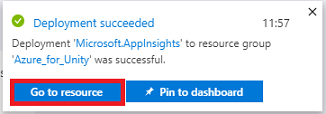

8.  Click the **Go to resource** button in the notification to explore your new Service instance. You will be taken to your new *Application Insights Service* instance.

    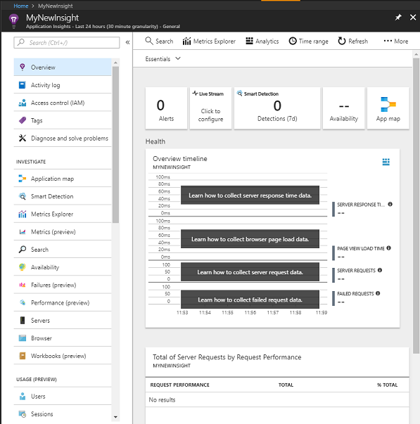

    > [!NOTE]
    >  Keep this web page open and easy to access, you will come back here often to see the data collected.

    > [!IMPORTANT]
    > To implement Application Insights, you will need to use three (3) specific values: **Instrumentation Key**, **Application ID**, and **API Key**. Below you will see how to retrieve these values from your Service. Make sure to note these values on a blank *Notepad* page, because you will use them soon in your code.

9.  To find the **Instrumentation Key**, you will need to scroll down the list of Service functions, and click on **Properties**, the tab displayed will reveal the **Service Key**.

    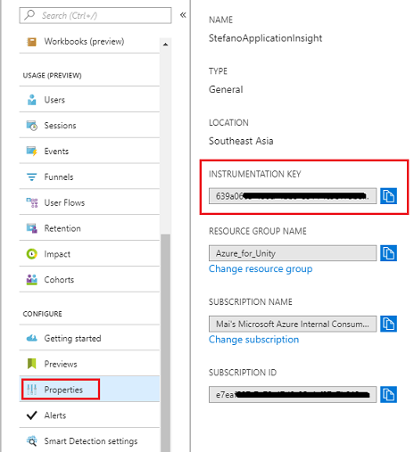

10. A little below **Properties**, you will find **API Access**, which you need to click. The panel to the right will provide the **Application ID** of your app.

    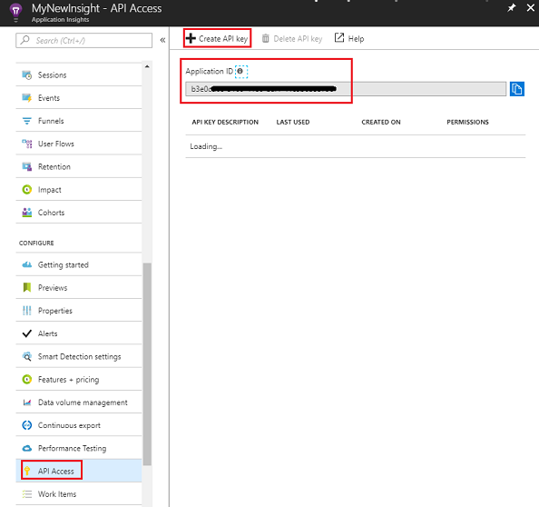

11. With the **Application ID** panel still open, click **Create API Key**, which will open the *Create API key* panel.

    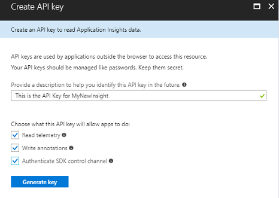

12. Within the now open *Create API key* panel, type a description, and **tick the three boxes**.

13. Click **Generate Key**. Your **API Key** will be created and displayed. 

    
        
    > [!WARNING]
    > This is the only time your **Service Key** will be displayed, so ensure you make a copy of it now.

## Chapter 2 - Set up the Unity project

The following is a typical set up for developing with the mixed reality, and as such, is a good template for other projects.

1.  Open *Unity* and click **New**.

    

2.  You will now need to provide a Unity Project name, insert **MR\_Azure\_Application\_Insights**. Make sure the *Template* is set to **3D**. Set the *Location* to somewhere appropriate for you (remember, closer to root directories is better). Then, click **Create project**.

    

3.  With Unity open, it is worth checking the default **Script Editor** is set to **Visual Studio**. Go to **Edit \> Preferences** and then from the new window, navigate to **External Tools**. Change **External Script Editor** to **Visual Studio 2017**. Close the **Preferences** window.

    

4.  Next, go to **File \> Build Settings** and switch the platform to **Universal Windows Platform**, by clicking on the **Switch Platform** button.

    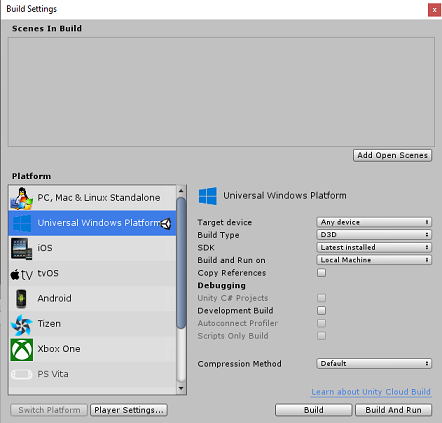

5.  Go to **File \> Build Settings** and make sure that:

    1.  **Target Device** is set to **Any device**

        > For the Microsoft HoloLens, set **Target Device** to *HoloLens*.

    2.  **Build Type** is set to **D3D**

    3.  **SDK** is set to **Latest installed**

    4.  **Build and Run** is set to **Local Machine**

    5.  Save the scene and add it to the build.

        1.  Do this by selecting **Add Open Scenes**. A save window will appear.

            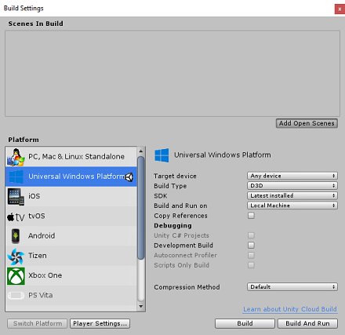

        2. Create a new folder for this, and any future scene, then click the **New folder** button, to create a new folder, name it **Scenes**.

            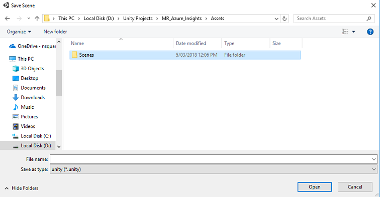

        3. Open your newly created **Scenes** folder, and then in the *File name:* text field, type **ApplicationInsightsScene**, then click **Save**.

            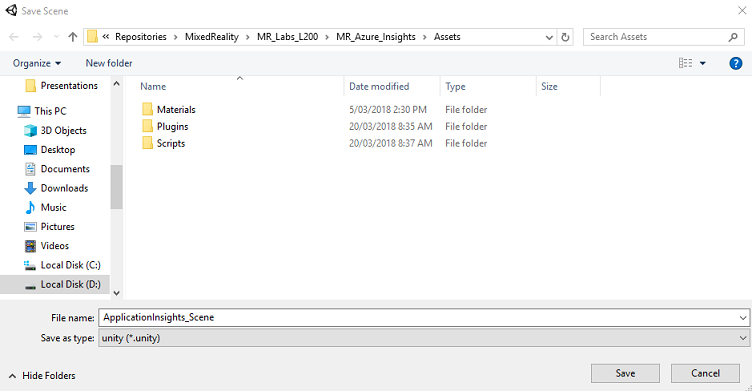

6.  The remaining settings, in **Build Settings**, should be left as default for now.

7.  In the **Build Settings** window, click on the **Player Settings** button, this will open the related panel in the space where the **Inspector** is located.

    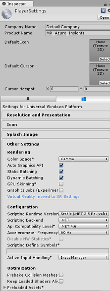

8. In this panel, a few settings need to be verified:

    1.  In the **Other Settings** tab:

        1.  **Scripting** **Runtime Version** should be **Experimental (.NET 4.6 Equivalent)**, which will trigger a need to restart the Editor.

        2.  **Scripting Backend** should be **.NET**

        3.  **API Compatibility Level** should be **.NET 4.6**

        

    2.  Within the **Publishing Settings** tab, under **Capabilities**, check:

        - **InternetClient**     

            

    3.  Further down the panel, in **XR Settings** (found below **Publishing Settings**), tick **Virtual Reality Supported**, make sure the **Windows Mixed Reality SDK** is added.

        

9.  Back in **Build Settings**, **Unity C# Projects** is no longer greyed out; tick the checkbox next to this.

10.  Close the Build Settings window.

11.  Save your Scene and Project (**FILE** > **SAVE SCENE / FILE** > **SAVE PROJECT**).


## Chapter 3 - Import the Unity package

> [!IMPORTANT]
> If you wish to skip the *Unity Set up* components of this course, and continue straight into code, feel free to download this [Azure-MR-309.unitypackage](https://github.com/Microsoft/HolographicAcademy/raw/Azure-MixedReality-Labs/Azure%20Mixed%20Reality%20Labs/MR%20and%20Azure%20309%20-%20Application%20insights/Azure-MR-309.unitypackage), import it into your project as a [**Custom Package**](https://docs.unity3d.com/Manual/AssetPackages.html). This will also contain the DLLs from the next Chapter. After import, continue from [**Chapter 6**](#chapter-6---create-the-applicationinsightstracker-class).

> [!IMPORTANT]
> To use Application Insights within Unity, you need to import the DLL for it, along with the Newtonsoft DLL. There is currently a known issue in Unity which requires plugins to be  reconfigured after import. These steps (4 - 7 in this section) will no longer be required after the bug has been resolved.

To import Application Insights into your own project, make sure you have [downloaded the '.unitypackage', containing the plugins](https://github.com/Microsoft/HolographicAcademy/raw/Azure-MixedReality-Labs/Azure%20Mixed%20Reality%20Labs/MR%20and%20Azure%20309%20-%20Application%20insights/AppInsights_LabPlugins.unitypackage). Then, do the following:

1.  Add the **.unitypackage** to Unity by using the **Assets \> Import Package \> Custom Package** menu option.

2.  In the **Import Unity Package** box that pops up, ensure everything under (and including) **Plugins** is selected.

    

3.  Click the **Import** button, to add the items to your project.

4.  Go to the **Insights** folder under **Plugins** in the Project view and select the following plugins *only*:

    -   Microsoft.ApplicationInsights

    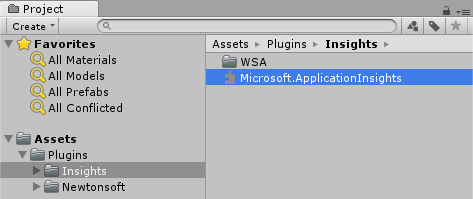

5.  With this *plugin* selected, ensure that **Any Platform** is **unchecked**, then ensure that **WSAPlayer** is also **unchecked**, then click **Apply**. Doing this is just to confirm that the files are configured correctly.

    

    > [!NOTE]
    > Marking the plugins like this, configures them to only be used in the Unity Editor. There are a different set of DLLs in the WSA folder which will be used after the project is exported from Unity.

6.  Next, you need to open the **WSA** folder, within the **Insights** folder. You will see a copy of the same file you just configured. Select this file, and then in the inspector, ensure that **Any Platform** is **unchecked**, then ensure that **only** **WSAPlayer** is **checked**. Click **Apply**.

    

7. You will now need to follow **steps 4-6**, but for the *Newtonsoft* plugins instead. See the below screenshot for what the outcome should look like.

    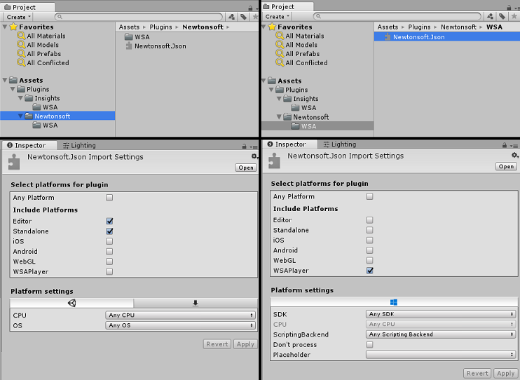    

## Chapter 4 - Set up the camera and user controls

In this Chapter you will set up the camera and the controls to allow the user to see and move in the scene.

1.  Right-click in an empty area in the Hierarchy Panel, then on **Create** > **Empty**.

    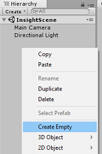

2.  Rename the new empty GameObject to **Camera Parent**.

    

3.  Right-click in an empty area in the Hierarchy Panel, then on **3D Object**, then on **Sphere**.

4.  Rename the Sphere to **Right Hand**.

5.  Set the **Transform Scale** of the Right Hand to **0.1, 0.1, 0.1**

    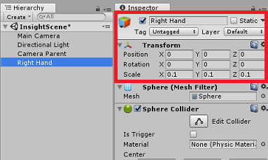

6.  Remove the **Sphere Collider** component from the Right Hand by clicking on the **Gear** in the *Sphere Collider* component, and then **Remove Component**.

    

7.  In the Hierarchy Panel drag the **Main Camera** and the **Right Hand** objects onto the **Camera Parent** object.

    

8.  Set the **Transform Position** of both the **Main Camera** and the **Right Hand** object to **0, 0, 0**.

    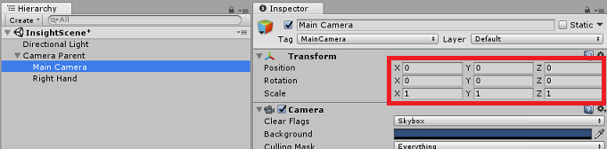

    

## Chapter 5 - Set up the objects in the Unity scene

You will now create some basic shapes for your scene, with which the user can interact.

1.  Right-click in an empty area in the *Hierarchy Panel*, then on **3D Object**, then select **Plane**.

2.  Set the Plane **Transform Position** to **0, -1, 0**.

3.  Set the Plane **Transform Scale** to **5, 1, 5**.

    

4.  Create a basic material to use with your **Plane** object, so that the other shapes are easier to see. Navigate to your *Project Panel*, right-click, then **Create**, followed by **Folder**, to create a new folder. Name it **Materials**.

    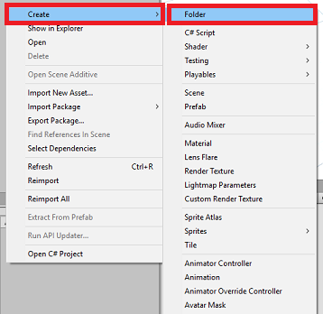 

5.  Open the **Materials** folder, then right-click, click **Create**, then **Material**, to create a new material. Name it **Blue**.

     

6.  With the new **Blue** material selected, look at the *Inspector*, and click the rectangular window alongside **Albedo**. Select a blue color (the one picture below is **Hex Color: \#3592FFFF**). Click the close button once you have chosen.

    

7.  Drag your new material from the **Materials** folder, onto your newly created **Plane**, within your scene (or drop it on the **Plane** object within the *Hierarchy*).

    

8.  Right-click in an empty area in the *Hierarchy Panel*, then on **3D Object, Capsule**.

    -  With the **Capsule** selected, change its **Transform** *Position* to: **-10, 1, 0**.

9.  Right-click in an empty area in the *Hierarchy Panel*, then on **3D Object, Cube**.

    -  With the **Cube** selected, change its **Transform** *Position* to: **0, 0, 10**.

10. Right-click in an empty area in the *Hierarchy Panel*, then on **3D Object, Sphere**.

    -  With the **Sphere** selected, change its **Transform** *Position* to: **10, 0, 0**.

    

    > [!NOTE]
    > These *Position* values are *suggestions*. You are free to set the positions of the objects to whatever you would like, though it is easier for the user of the application if the objects distances are not too far from the camera.

11. When your application is running, it needs to be able to identify the objects within the scene, to achieve this, they need to be tagged. Select one of the objects, and in the *Inspector* panel, click **Add Tag...**, which will swap the *Inspector* with the **Tags & Layers** panel.

    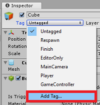 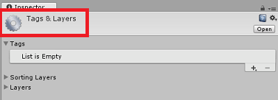

12. Click the **+ (plus)** symbol, then type the tag name as **ObjectInScene**.

    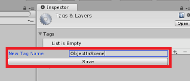

    > [!WARNING]
    > If you use a different name for your tag, you will need to ensure this change is also made the *DataFromAnalytics*, *ObjectTrigger*, and *Gaze*, scripts later, so that your objects are found, and detected, within your scene.

13. With the tag created, you now need to apply it to all three of your objects. From the *Hierarchy*, hold the **Shift** key, then click the **Capsule**, **Cube**, and **Sphere**, objects, then in the *Inspector*, click the dropdown menu alongside **Tag**, then click the *ObjectInScene* tag you created.

    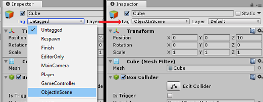 

## Chapter 6 - Create the ApplicationInsightsTracker class

The first script you need to create is **ApplicationInsightsTracker**, which is responsible for:

1.  Creating events based on user interactions to submit to Azure Application Insights.

2. Creating appropriate Event names, depending on user interaction.

3. Submitting events to the Application Insights Service instance.

To create this class:

1.  Right-click in the *Project Panel*, then **Create** > **Folder**. Name the folder **Scripts**.

      

2.  With the **Scripts** folder created, double-click it, to open. Then, within that folder, right-click, **Create** > **C# Script**. Name the script **ApplicationInsightsTracker**.

3.  Double-click on the new **ApplicationInsightsTracker** script to open it with **Visual Studio**.

4.  Update namespaces at the top of the script to be as below:

    ```csharp
        using Microsoft.ApplicationInsights;
        using Microsoft.ApplicationInsights.DataContracts;
        using Microsoft.ApplicationInsights.Extensibility;
        using UnityEngine;
    ```

5.  Inside the class insert the following variables:

    ```csharp
        /// <summary>
        /// Allows this class to behavior like a singleton
        /// </summary>
        public static ApplicationInsightsTracker Instance;
        
        /// <summary>
        /// Insert your Instrumentation Key here
        /// </summary>
        internal string instrumentationKey = "Insert Instrumentation Key here";

        /// <summary>
        /// Insert your Application Id here
        /// </summary>
        internal string applicationId = "Insert Application Id here";

        /// <summary>
        /// Insert your API Key here
        /// </summary>
        internal string API_Key = "Insert API Key here";

        /// <summary>
        /// Represent the Analytic Custom Event object
        /// </summary>
        private TelemetryClient telemetryClient;

        /// <summary>
        /// Represent the Analytic object able to host gaze duration
        /// </summary>
        private MetricTelemetry metric;
    ```

    > [!NOTE] 
    > Set the **instrumentationKey, applicationId and API_Key** values appropriately, using the *Service Keys* from the Azure Portal as mentioned in [Chapter 1](#chapter-1---the-azure-portal), step 9 onwards.

6.  Then add the **Start()** and **Awake()** methods, which will be called when the class initializes:

    ```csharp
        /// <summary>
        /// Sets this class instance as a singleton
        /// </summary>
        void Awake()
        {
            Instance = this;
        }

        /// <summary>
        /// Use this for initialization
        /// </summary>
        void Start()
        {
            // Instantiate telemetry and metric
            telemetryClient = new TelemetryClient();

            metric = new MetricTelemetry();

            // Assign the Instrumentation Key to the Event and Metric objects
            TelemetryConfiguration.Active.InstrumentationKey = instrumentationKey;

            telemetryClient.InstrumentationKey = instrumentationKey;
        }
    ```

7.  Add the methods responsible for sending the events and metrics registered by your application:

    ```csharp
        /// <summary>
        /// Submit the Event to Azure Analytics using the event trigger object
        /// </summary>
        public void RecordProximityEvent(string objectName)
        {
            telemetryClient.TrackEvent(CreateEventName(objectName));
        }

        /// <summary>
        /// Uses the name of the object involved in the event to create 
        /// and return an Event Name convention
        /// </summary>
        public string CreateEventName(string name)
        {
            string eventName = $"User near {name}";
            return eventName;
        }

        /// <summary>
        /// Submit a Metric to Azure Analytics using the metric gazed object
        /// and the time count of the gaze
        /// </summary>
        public void RecordGazeMetrics(string objectName, int time)
        {
            // Output Console information about gaze.
            Debug.Log($"Finished gazing at {objectName}, which went for <b>{time}</b> second{(time != 1 ? "s" : "")}");

            metric.Name = $"Gazed {objectName}";

            metric.Value = time;

            telemetryClient.TrackMetric(metric);
        }
    ```

8.  Be sure to save your changes in *Visual Studio* before returning to *Unity*.

## Chapter 7 - Create the Gaze script

The next script to create is the **Gaze** script. This script is responsible for creating a *Raycast* that will be projected forward from the *Main Camera*, to detect which object the user is looking at. In this case, the *Raycast* will need to identify if the user is looking at an object with the **ObjectInScene** tag, and then count how long the user *gazes* at that object.

1.  Double-click on the **Scripts** folder, to open it.

2.  Right-click inside the **Scripts** folder, click **Create** > **C# Script**. Name the script **Gaze**.

3.  Double-click on the script to open it with Visual Studio.

4.  Replace the existing code with the following:

    ```csharp
        using UnityEngine;

        public class Gaze : MonoBehaviour
        {
            /// <summary>
            /// Provides Singleton-like behavior to this class.
            /// </summary>
            public static Gaze Instance;

            /// <summary>
            /// Provides a reference to the object the user is currently looking at.
            /// </summary>
            public GameObject FocusedGameObject { get; private set; }

            /// <summary>
            /// Provides whether an object has been successfully hit by the raycast.
            /// </summary>
            public bool Hit { get; private set; }

            /// <summary>
            /// Provides a reference to compare whether the user is still looking at 
            /// the same object (and has not looked away).
            /// </summary>
            private GameObject _oldFocusedObject = null;

            /// <summary>
            /// Max Ray Distance
            /// </summary>
            private float _gazeMaxDistance = 300;

            /// <summary>
            /// Max Ray Distance
            /// </summary>
            private float _gazeTimeCounter = 0;

            /// <summary>
            /// The cursor object will be created when the app is running,
            /// this will store its values. 
            /// </summary>
            private GameObject _cursor;
        }
    ```

5.  Code for the **Awake()** and **Start()** methods now needs to be added.

    ```csharp
        private void Awake()
        {
            // Set this class to behave similar to singleton
            Instance = this;
            _cursor = CreateCursor();
        }

        void Start()
        {
            FocusedGameObject = null;
        }

        /// <summary>
        /// Create a cursor object, to provide what the user
        /// is looking at.
        /// </summary>
        /// <returns></returns>
        private GameObject CreateCursor()    
        {
            GameObject newCursor = GameObject.CreatePrimitive(PrimitiveType.Sphere);

            // Remove the collider, so it does not block raycast.
            Destroy(newCursor.GetComponent<SphereCollider>());

            newCursor.transform.localScale = new Vector3(0.1f, 0.1f, 0.1f);

            newCursor.GetComponent<MeshRenderer>().material.color = 
            Color.HSVToRGB(0.0223f, 0.7922f, 1.000f);

            newCursor.SetActive(false);
            return newCursor;
        }
    ```

6.  Inside the **Gaze** class, add the following code in the **Update()** method to project a *Raycast* and detect the target hit:

    ```csharp
        /// <summary>
        /// Called every frame
        /// </summary>
        void Update()
        {
            // Set the old focused gameobject.
            _oldFocusedObject = FocusedGameObject;

            RaycastHit hitInfo;

            // Initialize Raycasting.
            Hit = Physics.Raycast(Camera.main.transform.position, Camera.main.transform.forward, out hitInfo, _gazeMaxDistance);

            // Check whether raycast has hit.
            if (Hit == true)
            {
                // Check whether the hit has a collider.
                if (hitInfo.collider != null)
                {
                    // Set the focused object with what the user just looked at.
                    FocusedGameObject = hitInfo.collider.gameObject;

                    // Lerp the cursor to the hit point, which helps to stabilize the gaze.
                    _cursor.transform.position = Vector3.Lerp(_cursor.transform.position, hitInfo.point, 0.6f);

                    _cursor.SetActive(true);
                }
                else
                {
                    // Object looked on is not valid, set focused gameobject to null.
                    FocusedGameObject = null;

                    _cursor.SetActive(false);
                }
            }
            else
            {
                // No object looked upon, set focused gameobject to null.
                FocusedGameObject = null;

                _cursor.SetActive(false);
            }

            // Check whether the previous focused object is this same object. If so, reset the focused object.
            if (FocusedGameObject != _oldFocusedObject)
            {
                ResetFocusedObject();
            }
            // If they are the same, but are null, reset the counter. 
            else if (FocusedGameObject == null && _oldFocusedObject == null)
            {
                _gazeTimeCounter = 0;
            }
            // Count whilst the user continues looking at the same object.
            else
            {
                _gazeTimeCounter += Time.deltaTime;
            }
        }
    ```

7.  Add the **ResetFocusedObject()** method, to send data to **Application Insights** when the user has looked at an object.

    ```csharp
        /// <summary>
        /// Reset the old focused object, stop the gaze timer, and send data if it
        /// is greater than one.
        /// </summary>
        public void ResetFocusedObject()
        {
            // Ensure the old focused object is not null.
            if (_oldFocusedObject != null)
            {
                // Only looking for objects with the correct tag.
                if (_oldFocusedObject.CompareTag("ObjectInScene"))
                {
                    // Turn the timer into an int, and ensure that more than zero time has passed.
                    int gazeAsInt = (int)_gazeTimeCounter;

                    if (gazeAsInt > 0)
                    {
                        //Record the object gazed and duration of gaze for Analytics
                        ApplicationInsightsTracker.Instance.RecordGazeMetrics(_oldFocusedObject.name, gazeAsInt);
                    }
                    //Reset timer
                    _gazeTimeCounter = 0;
                }
            }
        }
    ```

8.  You have now completed the **Gaze** script. Save your changes in *Visual Studio* before returning to *Unity*.

## Chapter 8 - Create the ObjectTrigger class

The next script you need to create is **ObjectTrigger**, which is responsible for:

- Adding components needed for collision to the Main Camera.
- Detecting if the camera is near an object tagged as **ObjectInScene**.

To create the script:

1.  Double-click on the **Scripts** folder, to open it.

2.  Right-click inside the **Scripts** folder, click **Create** > **C# Script**. Name the script **ObjectTrigger**.

3.  Double-click on the script to open it with Visual Studio. Replace the existing code with the following:

    ```csharp
        using UnityEngine;

        public class ObjectTrigger : MonoBehaviour
        {
            private void Start()
            {
                // Add the Collider and Rigidbody components, 
                // and set their respective settings. This allows for collision.
                gameObject.AddComponent<SphereCollider>().radius = 1.5f;

                gameObject.AddComponent<Rigidbody>().useGravity = false;
            }

            /// <summary>
            /// Triggered when an object with a collider enters this objects trigger collider.
            /// </summary>
            /// <param name="collision">Collided object</param>
            private void OnCollisionEnter(Collision collision)
            {
                CompareTriggerEvent(collision, true);
            }

            /// <summary>
            /// Triggered when an object with a collider exits this objects trigger collider.
            /// </summary>
            /// <param name="collision">Collided object</param>
            private void OnCollisionExit(Collision collision)
            {
                CompareTriggerEvent(collision, false);
            }

            /// <summary>
            /// Method for providing debug message, and sending event information to InsightsTracker.
            /// </summary>
            /// <param name="other">Collided object</param>
            /// <param name="enter">Enter = true, Exit = False</param>
            private void CompareTriggerEvent(Collision other, bool enter)
            {
                if (other.collider.CompareTag("ObjectInScene"))
                {
                    string message = $"User is{(enter == true ? " " : " no longer ")}near <b>{other.gameObject.name}</b>";

                    if (enter == true)
                    {
                        ApplicationInsightsTracker.Instance.RecordProximityEvent(other.gameObject.name);
                    }
                    Debug.Log(message);
                }
            }
        }
    ```

4.  Be sure to save your changes in *Visual Studio* before returning to *Unity*.

## Chapter 9 - Create the DataFromAnalytics class

You will now need to create the **DataFromAnalytics** script, which is responsible for:

- Fetching analytics data about which object has been approached by the camera the most.
- Using the *Service Keys*, that allow communication with your Azure Application Insights Service instance.
- Sorting the objects in scene, according to which has the highest event count.
- Changing the material color, of the most approached object, to *green*.

To create the script:

1.  Double-click on the **Scripts** folder, to open it.

2.  Right-click inside the **Scripts** folder, click **Create** > **C# Script**. Name the script **DataFromAnalytics**.

3.  Double-click on the script to open it with Visual Studio.

4.  Insert the following namespaces:

    ```csharp
        using Newtonsoft.Json;
        using System;
        using System.Collections;
        using System.Collections.Generic;
        using System.Linq;
        using UnityEngine;
        using UnityEngine.Networking;
    ```

5.  Inside the script, insert the following:

    ```csharp
        /// <summary>
        /// Number of most recent events to be queried
        /// </summary>
        private int _quantityOfEventsQueried = 10;

        /// <summary>
        /// The timespan with which to query. Needs to be in hours.
        /// </summary>
        private int _timepspanAsHours = 24;

        /// <summary>
        /// A list of the objects in the scene
        /// </summary>
        private List<GameObject> _listOfGameObjectsInScene;

        /// <summary>
        /// Number of queries which have returned, after being sent.
        /// </summary>
        private int _queriesReturned = 0;

        /// <summary>
        /// List of GameObjects, as the Key, with their event count, as the Value.
        /// </summary>
        private List<KeyValuePair<GameObject, int>> _pairedObjectsWithEventCount = new List<KeyValuePair<GameObject, int>>();

        // Use this for initialization
        void Start()
        {
            // Find all objects in scene which have the ObjectInScene tag (as there may be other GameObjects in the scene which you do not want).
            _listOfGameObjectsInScene = GameObject.FindGameObjectsWithTag("ObjectInScene").ToList();

            FetchAnalytics();
        }
    ```

6.  Within the **DataFromAnalytics** class, right after the **Start()** method, add the following method called **FetchAnalytics()**. This method is responsible for populating the list of key value pairs, with a *GameObject* and a placeholder event count number. It then initializes the **GetWebRequest()** coroutine. The query structure of the call to *Application Insights* can be found within this method also, as the *Query URL* endpoint.

    ```csharp
        private void FetchAnalytics()
        {
            // Iterate through the objects in the list
            for (int i = 0; i < _listOfGameObjectsInScene.Count; i++)
            {
                // The current event number is not known, so set it to zero.
                int eventCount = 0;

                // Add new pair to list, as placeholder, until eventCount is known.
                _pairedObjectsWithEventCount.Add(new KeyValuePair<GameObject, int>(_listOfGameObjectsInScene[i], eventCount));

                // Set the renderer of the object to the default color, white
                _listOfGameObjectsInScene[i].GetComponent<Renderer>().material.color = Color.white;

                // Create the appropriate object name using Insights structure
                string objectName = _listOfGameObjectsInScene[i].name;
 
			    // Build the queryUrl for this object.
			    string queryUrl = Uri.EscapeUriString(string.Format(
                    "https://api.applicationinsights.io/v1/apps/{0}/events/$all?timespan=PT{1}H&$search={2}&$select=customMetric/name&$top={3}&$count=true",
				    ApplicationInsightsTracker.Instance.applicationId, _timepspanAsHours, "Gazed " + objectName, _quantityOfEventsQueried));


                // Send this object away within the WebRequest Coroutine, to determine it is event count.
                StartCoroutine("GetWebRequest", new KeyValuePair<string, int>(queryUrl, i));
            }
        }
    ```

7.  Right below the **FetchAnalytics()** method, add a method called **GetWebRequest()**, which returns an *IEnumerator*. This method is responsible for requesting the number of times an event, corresponding with a specific *GameObject*, has been called within *Application Insights*. When all the sent queries have returned, the **DetermineWinner()** method is called.

    ```csharp
        /// <summary>
        /// Requests the data count for number of events, according to the
        /// input query URL.
        /// </summary>
        /// <param name="webQueryPair">Query URL and the list number count.</param>
        /// <returns></returns>
        private IEnumerator GetWebRequest(KeyValuePair<string, int> webQueryPair)
        {
            // Set the URL and count as their own variables (for readability).
            string url = webQueryPair.Key;
            int currentCount = webQueryPair.Value;

            using (UnityWebRequest unityWebRequest = UnityWebRequest.Get(url))
            {
                DownloadHandlerBuffer handlerBuffer = new DownloadHandlerBuffer();

                unityWebRequest.downloadHandler = handlerBuffer;

                unityWebRequest.SetRequestHeader("host", "api.applicationinsights.io");

                unityWebRequest.SetRequestHeader("x-api-key", ApplicationInsightsTracker.Instance.API_Key);

                yield return unityWebRequest.SendWebRequest();

                if (unityWebRequest.isNetworkError)
                {
                    // Failure with web request.
                    Debug.Log("<color=red>Error Sending:</color> " + unityWebRequest.error);
                }
                else
                {
                    // This query has returned, so add to the current count.
                    _queriesReturned++;

                    // Initialize event count integer.
                    int eventCount = 0;

                    // Deserialize the response with the custom Analytics class.
                    Analytics welcome = JsonConvert.DeserializeObject<Analytics>(unityWebRequest.downloadHandler.text);

                    // Get and return the count for the Event
                    if (int.TryParse(welcome.OdataCount, out eventCount) == false)
                    {
                        // Parsing failed. Can sometimes mean that the Query URL was incorrect.
                        Debug.Log("<color=red>Failure to Parse Data Results. Check Query URL for issues.</color>");
                    }
                    else
                    {
                        // Overwrite the current pair, with its actual values, now that the event count is known.
                        _pairedObjectsWithEventCount[currentCount] = new KeyValuePair<GameObject, int>(_pairedObjectsWithEventCount[currentCount].Key, eventCount);
                    }

                    // If all queries (compared with the number which was sent away) have 
                    // returned, then run the determine winner method. 
                    if (_queriesReturned == _pairedObjectsWithEventCount.Count)
                    {
                        DetermineWinner();
                    }
                }
            }
        }
    ```

8.  The next method is **DetermineWinner()**, which sorts the list of *GameObject* and *Int* pairs, according to the highest event count. It then changes the material color of that *GameObject* to *green* (as feedback for it having the highest count). This displays a message with the analytics results.

    ```csharp
        /// <summary>
        /// Call to determine the keyValue pair, within the objects list, 
        /// with the highest event count.
        /// </summary>
        private void DetermineWinner()
        {
            // Sort the values within the list of pairs.
            _pairedObjectsWithEventCount.Sort((x, y) => y.Value.CompareTo(x.Value));

            // Change its colour to green
            _pairedObjectsWithEventCount.First().Key.GetComponent<Renderer>().material.color = Color.green;

            // Provide the winner, and other results, within the console window. 
            string message = $"<b>Analytics Results:</b>\n " +
                $"<i>{_pairedObjectsWithEventCount.First().Key.name}</i> has the highest event count, " +
                $"with <i>{_pairedObjectsWithEventCount.First().Value.ToString()}</i>.\nFollowed by: ";

            for (int i = 1; i < _pairedObjectsWithEventCount.Count; i++)
            {
                message += $"{_pairedObjectsWithEventCount[i].Key.name}, " +
                    $"with {_pairedObjectsWithEventCount[i].Value.ToString()} events.\n";
            }

            Debug.Log(message);
        }
    ```

9.  Add the class structure which will be used to deserialize the JSON object, received from *Application Insights*. Add these classes at the very bottom of your **DataFromAnalytics** class file, **outside** of the class definition.

    ```csharp
        /// <summary>
        /// These classes represent the structure of the JSON response from Azure Insight
        /// </summary>
        [Serializable]
        public class Analytics
        {
            [JsonProperty("@odata.context")]
            public string OdataContext { get; set; }

            [JsonProperty("@odata.count")]
            public string OdataCount { get; set; }

            [JsonProperty("value")]
            public Value[] Value { get; set; }
        }

        [Serializable]
        public class Value
        {
            [JsonProperty("customMetric")]
            public CustomMetric CustomMetric { get; set; }
        }

        [Serializable]
        public class CustomMetric
        {
            [JsonProperty("name")]
            public string Name { get; set; }
        }
    ```

10. Be sure to save your changes in *Visual Studio* before returning to *Unity*.

## Chapter 10 - Create the Movement class

The **Movement** script is the next script you will need to create. It is responsible for:

- Moving the Main Camera according to the direction the camera is looking towards.
- Adding all other scripts to scene objects.

To create the script:

1.  Double-click on the **Scripts** folder, to open it.

2.  Right-click inside the **Scripts** folder, click **Create** > **C# Script**. Name the script **Movement**.

3.  Double-click on the script to open it with *Visual Studio*.

4.  Replace the existing code with the following:

    ```csharp
        using UnityEngine;
        using UnityEngine.XR.WSA.Input;

        public class Movement : MonoBehaviour
        {
            /// <summary>
            /// The rendered object representing the right controller.
            /// </summary>
            public GameObject Controller;

            /// <summary>
            /// The movement speed of the user.
            /// </summary>
            public float UserSpeed;

            /// <summary>
            /// Provides whether source updates have been registered.
            /// </summary>
            private bool _isAttached = false;

            /// <summary>
            /// The chosen controller hand to use. 
            /// </summary>
            private InteractionSourceHandedness _handness = InteractionSourceHandedness.Right;

            /// <summary>
            /// Used to calculate and proposes movement translation.
            /// </summary>
            private Vector3 _playerMovementTranslation;

            private void Start()
            {
                // You are now adding components dynamically 
                // to ensure they are existing on the correct object  

                // Add all camera related scripts to the camera. 
                Camera.main.gameObject.AddComponent<Gaze>();
                Camera.main.gameObject.AddComponent<ObjectTrigger>();
        
                // Add all other scripts to this object.
                gameObject.AddComponent<ApplicationInsightsTracker>();
                gameObject.AddComponent<DataFromAnalytics>();
            }

            // Update is called once per frame
            void Update()
            {
            
            }
        }
    ```

5.  Within the **Movement** class, *below* the empty **Update()** method, insert the following methods that allow the user to use the hand controller to move in the virtual space:

    ```csharp
        /// <summary>
        /// Used for tracking the current position and rotation of the controller.
        /// </summary>
        private void UpdateControllerState()
        {
    #if UNITY_WSA && UNITY_2017_2_OR_NEWER
            // Check for current connected controllers, only if WSA.
            string message = string.Empty;

            if (InteractionManager.GetCurrentReading().Length > 0)
            {
                foreach (var sourceState in InteractionManager.GetCurrentReading())
                {
                    if (sourceState.source.kind == InteractionSourceKind.Controller && sourceState.source.handedness == _handness)
                    {
                        // If a controller source is found, which matches the selected handness, 
                        // check whether interaction source updated events have been registered. 
                        if (_isAttached == false)
                        {
                            // Register events, as not yet registered.
                            message = "<color=green>Source Found: Registering Controller Source Events</color>";
                            _isAttached = true;

                            InteractionManager.InteractionSourceUpdated += InteractionManager_InteractionSourceUpdated;
                        }

                        // Update the position and rotation information for the controller.
                        Vector3 newPosition;
                        if (sourceState.sourcePose.TryGetPosition(out newPosition, InteractionSourceNode.Pointer) && ValidPosition(newPosition))
                        {
                            Controller.transform.localPosition = newPosition;
                        }

                        Quaternion newRotation;

                        if (sourceState.sourcePose.TryGetRotation(out newRotation, InteractionSourceNode.Pointer) && ValidRotation(newRotation))
                        {
                            Controller.transform.localRotation = newRotation;
                        }
                    }
                }
            }
            else
            {
                // Controller source not detected. 
                message = "<color=blue>Trying to detect controller source</color>";

                if (_isAttached == true)
                {
                    // A source was previously connected, however, has been lost. Disconnected
                    // all registered events. 

                    _isAttached = false;

                    InteractionManager.InteractionSourceUpdated -= InteractionManager_InteractionSourceUpdated;

                    message = "<color=red>Source Lost: Detaching Controller Source Events</color>";
                }
            }

            if(message != string.Empty)
            {
                Debug.Log(message);
            }
    #endif
        }
    ```

    ```csharp
        /// <summary>
        /// This registered event is triggered when a source state has been updated.
        /// </summary>
        /// <param name="obj"></param>
        private void InteractionManager_InteractionSourceUpdated(InteractionSourceUpdatedEventArgs obj)
        {
            if (obj.state.source.handedness == _handness)
            {
                if(obj.state.thumbstickPosition.magnitude > 0.2f)
                {
                    float thumbstickY = obj.state.thumbstickPosition.y;

                    // Vertical Input.
                    if (thumbstickY > 0.3f || thumbstickY < -0.3f)
                    {
                        _playerMovementTranslation = Camera.main.transform.forward;
                        _playerMovementTranslation.y = 0;
                        transform.Translate(_playerMovementTranslation * UserSpeed * Time.deltaTime * thumbstickY, Space.World);
                    }
                }
            }
        }
    ```

    ```csharp
        /// <summary>
        /// Check that controller position is valid. 
        /// </summary>
        /// <param name="inputVector3">The Vector3 to check</param>
        /// <returns>The position is valid</returns>
        private bool ValidPosition(Vector3 inputVector3)
        {
            return !float.IsNaN(inputVector3.x) && !float.IsNaN(inputVector3.y) && !float.IsNaN(inputVector3.z) && !float.IsInfinity(inputVector3.x) && !float.IsInfinity(inputVector3.y) && !float.IsInfinity(inputVector3.z);
        }

        /// <summary>
        /// Check that controller rotation is valid. 
        /// </summary>
        /// <param name="inputQuaternion">The Quaternion to check</param>
        /// <returns>The rotation is valid</returns>
        private bool ValidRotation(Quaternion inputQuaternion)
        {
            return !float.IsNaN(inputQuaternion.x) && !float.IsNaN(inputQuaternion.y) && !float.IsNaN(inputQuaternion.z) && !float.IsNaN(inputQuaternion.w) && !float.IsInfinity(inputQuaternion.x) && !float.IsInfinity(inputQuaternion.y) && !float.IsInfinity(inputQuaternion.z) && !float.IsInfinity(inputQuaternion.w);
        }   
    ```

6.  Lastly add the method call within the **Update()** method.

    ```csharp
        // Update is called once per frame
        void Update()
        {
            UpdateControllerState();
        }
    ```

7.  Be sure to save your changes in *Visual Studio* before returning to *Unity*.

## Chapter 11 - Setting up the scripts references

In this Chapter you need to place the **Movement** script onto the **Camera Parent** and set its reference targets. That script will then handle placing the other scripts where they need to be.

1.  From the **Scripts** folder in the *Project Panel*, drag the **Movement** script to the **Camera Parent** object, located in the *Hierarchy Panel*.

    

2.  Click on the **Camera Parent**. In the *Hierarchy Panel*, drag the **Right Hand** object from the *Hierarchy Panel* to the reference target, **Controller**, in the *Inspector Panel*. Set the **User Speed** to **5**, as shown in the image below.

    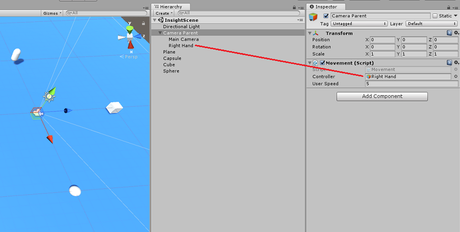

## Chapter 12 - Build the Unity project

Everything needed for the Unity section of this project has now been completed, so it is time to build it from Unity.

1.  Navigate to **Build Settings**, (**File** > **Build Settings**).

2.  From the **Build Settings** window, click **Build**.

    

3.  A **File Explorer** window will pop-up, prompting you for a location for the build. Create a new folder (by clicking **New Folder** in the top-left corner), and name it **BUILDS**.

    

    1.  Open the new **BUILDS** folder, and create another folder (using **New Folder** once more), and name it **MR\_Azure\_Application\_Insights**.

        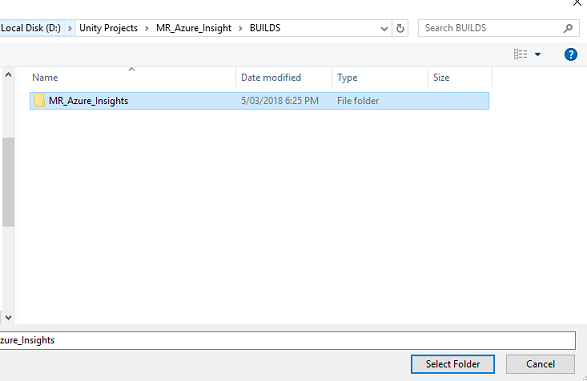

    2.  With the **MR\_Azure\_Application\_Insights** folder selected, click **Select Folder**. The project will take a minute or so to build.

4.  Following *Build*, **File Explorer** will appear showing you the location of your new project.

## Chapter 13 - Deploy MR_Azure_Application_Insights app to your machine

To deploy the **MR\_Azure\_Application\_Insights** app on your Local Machine:

1.  Open the solution file of your **MR\_Azure\_Application\_Insights** app in **Visual Studio**.

2.  In the **Solution Platform**, select **x86, Local Machine**.

3.  In the **Solution Configuration** select **Debug**.

    

4.  Go to **Build menu** and click on **Deploy Solution** to sideload the application to your machine.

5.  Your app should now appear in the list of installed apps, ready to be launched.

6. Launch the mixed reality application.

7. Move around the scene, approaching objects and looking at them, when the *Azure Insight Service* has collected enough event data, it will set the object that has been approached the most to green.

> [!IMPORTANT] 
> While the average waiting time for the *Events and Metrics* to be collected by the Service takes around 15 min, in some occasions it might take up to 1 hour.

## Chapter 14 - The Application Insights Service portal

Once you have roamed around the scene and gazed at several objects you can see the data collected in the *Application Insights Service* portal.

1.  Go back to your Application Insights Service portal.

2.  Click on *Metrics Explorer*.

    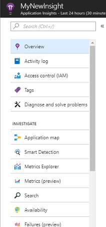

3.  It will open in a tab containing the graph which represent the *Events and Metrics* related to your application. As mentioned above, it might take some time (up to 1 hour) for the data to be displayed in the graph

    

4.  Click on the *Events bar* in the *Total of Events* by Application Version, to see a detailed breakdown of the events with their names.

    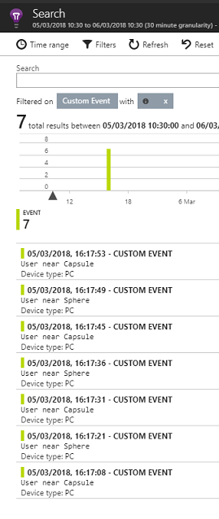

## Your finished your Application Insights Service application

Congratulations, you built a mixed reality app that leverages the Application Insights Service to monitor user's activity within your app.


## Bonus Exercises

**Exercise 1**

Try spawning, rather than manually creating, the ObjectInScene objects and set their coordinates on the plane within your scripts. In this way, you could ask Azure what the most popular object was (either from gaze or proximity results) and spawn an *extra* one of those objects.

**Exercise 2**

Sort your Application Insights results by time, so that you get the most relevant data, and implement that time sensitive data in your application.