# HoloLens (1st gen) and Azure 310: Object detection

>[!NOTE]
>The Mixed Reality Academy tutorials were designed with HoloLens (1st gen) and Mixed Reality Immersive Headsets in mind.  As such, we feel it is important to leave these tutorials in place for developers who are still looking for guidance in developing for those devices.  These tutorials will **_not_** be updated with the latest toolsets or interactions being used for HoloLens 2.  They will be maintained to continue working on the supported devices. There will be a new series of tutorials that will be posted in the future that will demonstrate how to develop for HoloLens 2.  This notice will be updated with a link to those tutorials when they are posted.

<br>

In this course, you will learn how to recognize custom visual content and its spatial position within a provided image, using Azure Custom Vision "Object Detection" capabilities in a mixed reality application.

This service will allow you to train a machine learning model using object images. You will then use the trained model to recognize similar objects and approximate their location in the real world, as provided by the camera capture of Microsoft HoloLens or a camera connect to a PC for immersive (VR) headsets.


**Azure Custom Vision, Object Detection** is a Microsoft Service which allows developers to build custom image classifiers. These classifiers can then be used with new images to detect objects within that new image, by providing **Box Boundaries** within the image itself. The Service provides a simple, easy to use, online portal to streamline this process. For more information, visit the following links:

* [Azure Custom Vision page](/azure/cognitive-services/custom-vision-service/home)
* [Limits and Quotas](/azure/cognitive-services/custom-vision-service/limits-and-quotas)

Upon completion of this course, you will have a mixed reality application which will be able to do the following:

1. The user will be able to *gaze* at an object, which they have trained using the Azure Custom Vision Service, Object Detection.
2. The user will use the *Tap* gesture to capture an image of what they are looking at.
3. The app will send the image to the Azure Custom Vision Service.
4. There will be a reply from the Service which will display the result of the recognition as world-space text. This will be accomplished through utilizing the Microsoft HoloLens' Spatial Tracking, as a way of understanding the world position of the recognized object, and then using the *Tag* associated with what is detected in the image, to provide the label text.

The course will also cover manually uploading images, creating tags, and training the Service to recognize different objects (in the provided example, a cup) by setting the *Boundary Box* within the image you submit.

> [!IMPORTANT]
> Following the creation and use of the app, the developer should navigate back to the Azure Custom Vision Service, and identify the predictions made by the Service, and determine whether they were correct or not (through tagging anything the Service missed, and adjusting the *Bounding Boxes*). The Service can then be re-trained, which will increase the likelihood of it recognizing real world objects.

This course will teach you how to get the results from the Azure Custom Vision Service, Object Detection, into a Unity-based sample application. It will be up to you to apply these concepts to a custom application you might be building.

## Device support

<table>
<tr>
<th>Course</th><th> <a href="/hololens/hololens1-hardware">HoloLens</a></th><th> <a href="/windows/mixed-reality/enthusiast-guide/immersive-headset-hardware-details">Immersive headsets</a></th>
</tr><tr>
<td> MR and Azure 310: Object detection</td><td> ✔️</td><td> </td>
</tr>
</table>

## Prerequisites

> [!NOTE]
> This tutorial is designed for developers who have basic experience with Unity and C#. Please also be aware that the prerequisites and written instructions within this document represent what has been tested and verified at the time of writing (July 2018). You are free to use the latest software, as listed within the [install the tools](../../install-the-tools.md) article, though it should not be assumed that the information in this course will perfectly match what you will find in newer software than what is listed below.

We recommend the following hardware and software for this course:

- A development PC
- [Windows 10 Fall Creators Update (or later) with Developer mode enabled](../../install-the-tools.md#installation-checklist)
- [The latest Windows 10 SDK](../../install-the-tools.md#installation-checklist)
- [Unity 2017.4 LTS](../../install-the-tools.md#installation-checklist)
- [Visual Studio 2017](../../install-the-tools.md#installation-checklist)
- A [Microsoft HoloLens](/windows/mixed-reality/hololens-hardware-details) with Developer mode enabled
- Internet access for Azure setup and Custom Vision Service retrieval
-  A series of at least fifteen (15) images are required) for each object that you would like the Custom Vision to recognize. If you wish, you can use the images already provided with this course, [a series of cups](https://github.com/Microsoft/HolographicAcademy/raw/Azure-MixedReality-Labs/Azure%20Mixed%20Reality%20Labs/MR%20and%20Azure%20310%20-%20Object%20detection/Cup%20Images.zip)).

## Before you start

1.	To avoid encountering issues building this project, it is strongly suggested that you create the project mentioned in this tutorial in a root or near-root folder (long folder paths can cause issues at build-time).
2.	Set up and test your HoloLens. If you need support for this, [visit the HoloLens setup article](/hololens/hololens-setup).
3.	It is a good idea to perform Calibration and Sensor Tuning when beginning developing a new HoloLens App (sometimes it can help to perform those tasks for each user).

For help on Calibration, please follow this [link to the HoloLens Calibration article](/hololens/hololens-calibration#hololens-2).

For help on Sensor Tuning, please follow this [link to the HoloLens Sensor Tuning article](/hololens/hololens-updates).

## Chapter 1 - The Custom Vision Portal

To use the **Azure Custom Vision Service**, you will need to configure an instance of it to be made available to your application.

1.  Navigate [to the **Custom Vision Service** main page](https://azure.microsoft.com/services/cognitive-services/custom-vision-service/).

2.  Click on **Getting Started**.

    

3.  Sign in to the Custom Vision Portal.

    

4.  If you do not already have an Azure account, you will need to create one. If you are following this tutorial in a classroom or lab situation, ask your instructor or one of the proctors for help setting up your new account.

5.  Once you are logged in for the first time, you will be prompted with the *Terms of Service* panel. Click the checkbox to *agree to the terms*. Then click **I agree**.

    

6.  Having agreed to the terms, you are now in the *My Projects* section. Click on **New Project**.

    

7.  A tab will appear on the right-hand side, which will prompt you to specify some fields for the project.

    1.  Insert a name for your project

    2.  Insert a description for your project (**Optional**)

    3.  Choose a **Resource Group** or create a new one. A resource group provides a way to monitor, control access, provision and manage billing for a collection of Azure assets. It is recommended to keep all the Azure services associated with a single project (e.g. such as these courses) under a common resource group).

        

        > [!NOTE]
        > If you wish to [read more about Azure Resource Groups, navigate to the associated Docs](/azure/azure-resource-manager/resource-group-portal)

    4.  Set the **Project Types** as **Object Detection (preview)**.

8.  Once you are finished, click on **Create project**, and you will be redirected to the Custom Vision Service project page.


## Chapter 2 - Training your Custom Vision project

Once in the Custom Vision Portal, your primary objective is to train your project to recognize specific objects in images.

You need at least fifteen (15) images for each object that you would like your application to recognize. You can use the images provided with this course ([a series of cups](https://github.com/Microsoft/HolographicAcademy/raw/Azure-MixedReality-Labs/Azure%20Mixed%20Reality%20Labs/MR%20and%20Azure%20310%20-%20Object%20detection/Cup%20Images.zip)).

To train your Custom Vision project:

1.  Click on the **+** button next to **Tags**.

    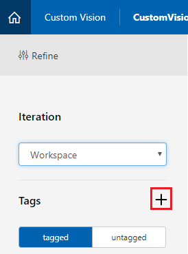

2.  Add a **name** for the tag that will be used to associate your images with. In this example we are using images of cups for recognition, so have named the tag for this, **Cup**. Click **Save** once finished.

    

3.  You will notice your **Tag** has been added (you may need to reload your page for it to appear). 

    

4.  Click on **Add images** in the center of the page.

    

5.  Click on **Browse local files**, and browse to the images you would like to upload for one object, with the minimum being fifteen (15).

    > [!TIP]
    >  You can select several images at a time, to upload.

    

6.  Press **Upload files** once you have selected all the images you would like to train the project with. The files will begin uploading. Once you have confirmation of the upload, click **Done**.

    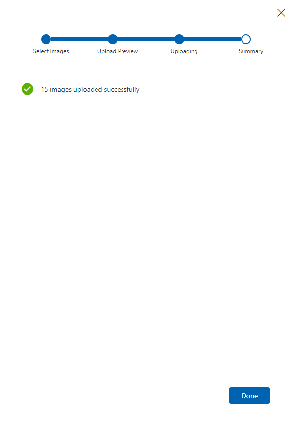

7.  At this point your images are uploaded, but not tagged.

    

8.  To tag your images, use your mouse. As you hover over your image, a selection highlight will aid you by automatically drawing a selection around your object. If it is not accurate, you can draw your own. This is accomplished by holding left-click on the mouse, and dragging the selection region to encompass your object. 

    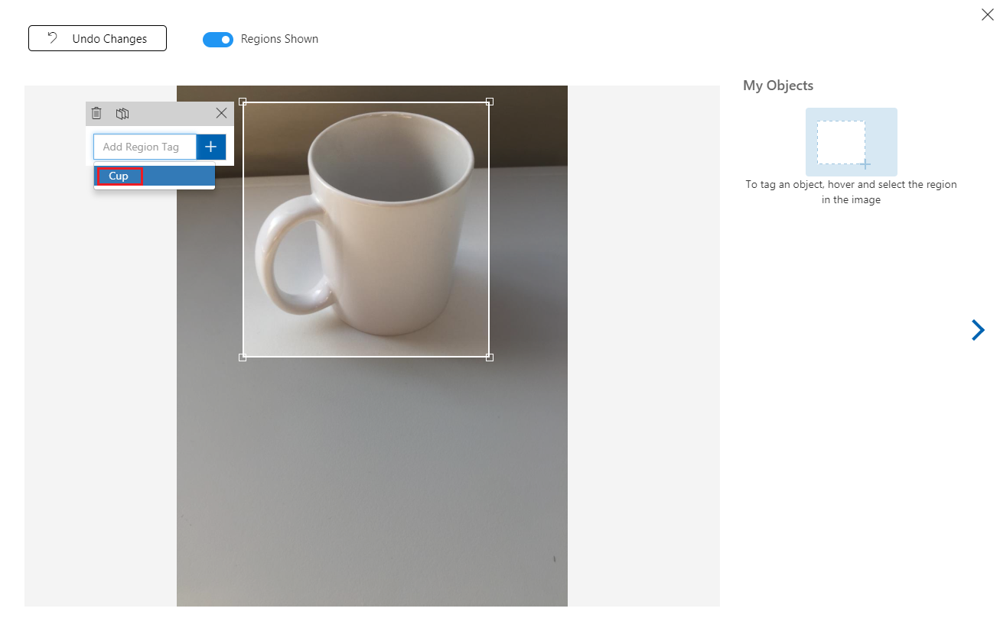 

9. Following the selection of your object within the image, a small prompt will ask for you to *Add Region Tag*. Select your previously created tag ('Cup', in the above example), or if you are adding more tags, type that in and click the **+ (plus)** button.

     

10. To tag the next image, you can click the arrow to the right of the blade, or close the tag blade (by clicking the **X** in the top-right corner of the blade) and then click the next image. Once you have the next image ready, repeat the same procedure. Do this for all the images you have uploaded, until they are all tagged. 

    > [!NOTE]
    >  You can select several objects in the same image, like the image below: 
    > 
    > 

11. Once you have tagged them all, click on the **tagged** button, on the left of the screen, to reveal the tagged images. 

    

12. You are now ready to train your Service. Click the **Train** button, and the first training iteration will begin.

    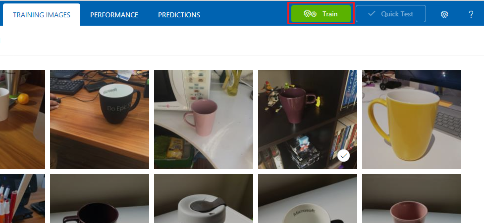

    

13. Once it is built, you will be able to see two buttons called **Make default** and **Prediction URL**. Click on **Make default** first, then click on **Prediction URL**.

    

    > [!NOTE] 
    > The endpoint which is provided from this, is set to whichever *Iteration* has been marked as default. As such, if you later make a new *Iteration* and update it as default, you will not need to change your code.

14. Once you have clicked on **Prediction URL**, open *Notepad*, and copy and paste the **URL** (also called your **Prediction-Endpoint**) and the **Service Prediction-Key**, so that you can retrieve it when you need it later in the code.

    

## Chapter 3 - Set up the Unity project

The following is a typical set up for developing with mixed reality, and as such, is a good template for other projects.

1.  Open **Unity** and click **New**.

    

2.  You will now need to provide a Unity project name. Insert **CustomVisionObjDetection**. Make sure the project type is set to **3D**, and set the **Location** to somewhere appropriate for you (remember, closer to root directories is better). Then, click **Create project**.

    

3.  With Unity open, it is worth checking the default **Script Editor** is set to **Visual Studio**. Go to **Edit* > *Preferences** and then from the new window, navigate to **External Tools**. Change **External Script Editor** to **Visual Studio**. Close the **Preferences** window.

    

4.  Next, go to **File > Build Settings** and switch the **Platform** to *Universal Windows Platform*, and then clicking on the **Switch Platform** button.

    

5.  In the same **Build Settings** window, ensure the following are set:

    1.  **Target Device** is set to **HoloLens**        
    2.  **Build Type** is set to **D3D**
    3.  **SDK** is set to **Latest installed**
    4.  **Visual Studio Version** is set to **Latest installed**
    5.  **Build and Run** is set to **Local Machine**            
    6.  The remaining settings, in **Build Settings**, should be left as default for now.

        

6.  In the same **Build Settings** window, click on the **Player Settings** button, this will open the related panel in the space where the **Inspector** is located.

7. In this panel, a few settings need to be verified:

    1.  In the **Other Settings** tab:

        1.  **Scripting Runtime Version** should be **Experimental** (.NET 4.6 Equivalent), which will trigger a need to restart the Editor.

        2. **Scripting Backend** should be **.NET**.

        3. **API Compatibility Level** should be **.NET 4.6**.

            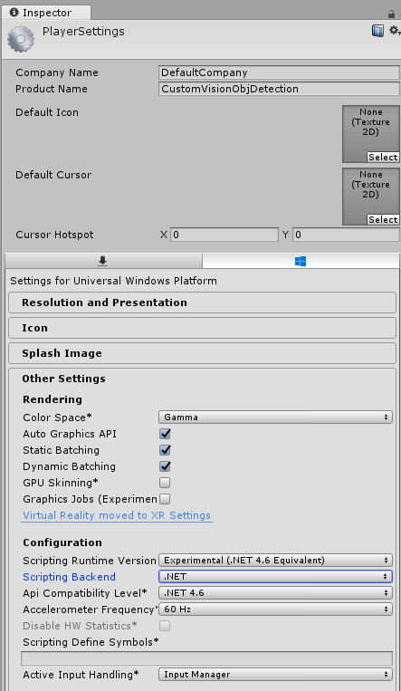

    2.  Within the **Publishing Settings** tab, under **Capabilities**, check:

        1. **InternetClient**

        2.  **Webcam**

        3. **SpatialPerception**

            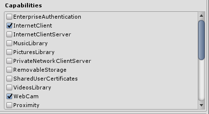
            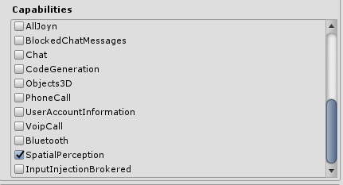

    3.  Further down the panel, in **XR Settings** (found below **Publish Settings**), tick **Virtual Reality Supported**, then make sure the **Windows Mixed Reality SDK** is added.

        

8.  Back in **Build Settings**, *Unity C\# Projects* is no longer greyed out: tick the checkbox next to this.

9.  Close the **Build Settings** window.

10. In the **Editor**, click on **Edit** > **Project Settings** > **Graphics**.

    

11. In the **Inspector Panel** the *Graphics Settings* will be open. Scroll down until you see an array called **Always Include Shaders**. Add a slot by increasing the **Size** variable by one (in this example, it was 8 so we made it 9). A new slot will appear, in the last position of the array, as shown below:

    

12. In the slot, click on the small target circle next to the slot to open a list of shaders. Look for the **Legacy Shaders/Transparent/Diffuse** shader and double-click it. 

    

## Chapter 4 - Importing the CustomVisionObjDetection Unity package

For this course you are provided with a Unity Asset Package called **Azure-MR-310.unitypackage**. 

> [TIP]
> Any objects supported by Unity, including entire scenes, can be packaged into a **.unitypackage** file, and exported / imported in other projects. It is the safest, and most efficient, way to move assets between different **Unity projects**.

You can find the [Azure-MR-310 package that you need to download here](https://github.com/Microsoft/HolographicAcademy/raw/Azure-MixedReality-Labs/Azure%20Mixed%20Reality%20Labs/MR%20and%20Azure%20310%20-%20Object%20detection/Azure-MR-310.unitypackage).

1.  With the Unity dashboard in front of you, click on **Assets** in the menu at the top of the screen, then click on **Import Package > Custom Package**.

    

2.  Use the file picker to select the **Azure-MR-310.unitypackage** package and click **Open**. A list of components for this asset will be displayed to you. Confirm the import by clicking the **Import** button.

    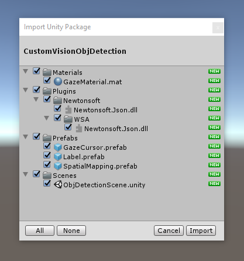

3.  Once it has finished importing, you will notice that folders from the package have now been added to your **Assets** folder. This kind of folder structure is typical for a Unity project.

    

    1.  The **Materials** folder contains the material used by the **Gaze Cursor**. 

    2.  The **Plugins** folder contains the Newtonsoft DLL used by the code to deserialize the Service web response. The two (2) different versions contained in the folder, and sub-folder, are necessary to allow the library to be used and built by both the Unity Editor and the UWP build. 

    3.  The **Prefabs** folder contains the prefabs contained in the scene. Those are:

        1.  The **GazeCursor**, the cursor used in the application. Will work together with the SpatialMapping prefab to be able to be placed in the scene on top of physical objects.
        2.  The **Label**, which is the UI object used to display the object tag in the scene when required.
        3.  The **SpatialMapping**, which is the object that enables the application to use create a virtual map, using the Microsoft HoloLens' spatial tracking.

    4.  The **Scenes** folder which currently contains the pre-built scene for this course.

4.  Open the **Scenes** folder, in the **Project Panel**, and double-click on the **ObjDetectionScene**, to load the scene that you will use for this course.

    

    > [!NOTE] 
    >  **No code is included**, you will write the code by following this course.

## Chapter 5 - Create the CustomVisionAnalyser class.

At this point you are ready to write some code. You will begin with the **CustomVisionAnalyser** class.

> [!NOTE]
> The calls to the **Custom Vision Service**, made in the code shown below, are made using the **Custom Vision REST API**. Through using this, you will see how to implement and make use of this API (useful for understanding how to implement something similar on your own). Be aware, that Microsoft offers a **Custom Vision SDK** that can also be used to make calls to the Service. For more information visit the [Custom Vision SDK article](https://github.com/Microsoft/Cognitive-CustomVision-Windows/).

This class is responsible for:

- Loading the latest image captured as an array of bytes.

- Sending the byte array to your Azure **Custom Vision Service** instance for analysis.

- Receiving the response as a JSON string.

- Deserializing the response and passing the resulting **Prediction** to the **SceneOrganiser** class, which will take care of how the response should be displayed.

To create this class:

1.  Right-click in the **Asset Folder**, located in the **Project Panel**, then click **Create** > **Folder**. Call the folder **Scripts**.

    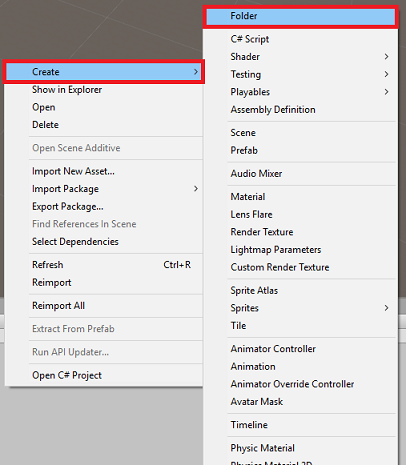

2.  Double-click on the newly created folder, to open it.

3.  Right-click inside the folder, then click **Create** > **C\# Script**. Name the script **CustomVisionAnalyser.**

4.  Double-click on the new **CustomVisionAnalyser** script to open it with **Visual Studio.**

5.  Make sure you have the following namespaces referenced at the top of the file:

    ```csharp
    using Newtonsoft.Json;
    using System.Collections;
    using System.IO;
    using UnityEngine;
    using UnityEngine.Networking;
    ```

6.  In the **CustomVisionAnalyser** class, add the following variables:

    ```csharp
        /// <summary>
        /// Unique instance of this class
        /// </summary>
        public static CustomVisionAnalyser Instance;

        /// <summary>
        /// Insert your prediction key here
        /// </summary>
        private string predictionKey = "- Insert your key here -";

        /// <summary>
        /// Insert your prediction endpoint here
        /// </summary>
        private string predictionEndpoint = "Insert your prediction endpoint here";

        /// <summary>
        /// Bite array of the image to submit for analysis
        /// </summary>
        [HideInInspector] public byte[] imageBytes;
    ```

    > [!NOTE]
    > Make sure you insert your **Service Prediction-Key** into the **predictionKey** variable and your **Prediction-Endpoint** into the **predictionEndpoint** variable. You copied these to [Notepad earlier, in Chapter 2, Step 14](#chapter-2---training-your-custom-vision-project).

7.  Code for **Awake()** now needs to be added to initialize the Instance variable:

    ```csharp
        /// <summary>
        /// Initializes this class
        /// </summary>
        private void Awake()
        {
            // Allows this instance to behave like a singleton
            Instance = this;
        }
    ```

8.  Add the coroutine (with the static **GetImageAsByteArray()** method below it), which will obtain the results of the analysis of the image, captured by the **ImageCapture** class.

    > [!NOTE]
    > In the **AnalyseImageCapture** coroutine, there is a call to the **SceneOrganiser** class that you are yet to create. Therefore, **leave those lines commented for now**.

    ```csharp    
        /// <summary>
        /// Call the Computer Vision Service to submit the image.
        /// </summary>
        public IEnumerator AnalyseLastImageCaptured(string imagePath)
        {
            Debug.Log("Analyzing...");

            WWWForm webForm = new WWWForm();

            using (UnityWebRequest unityWebRequest = UnityWebRequest.Post(predictionEndpoint, webForm))
            {
                // Gets a byte array out of the saved image
                imageBytes = GetImageAsByteArray(imagePath);

                unityWebRequest.SetRequestHeader("Content-Type", "application/octet-stream");
                unityWebRequest.SetRequestHeader("Prediction-Key", predictionKey);

                // The upload handler will help uploading the byte array with the request
                unityWebRequest.uploadHandler = new UploadHandlerRaw(imageBytes);
                unityWebRequest.uploadHandler.contentType = "application/octet-stream";

                // The download handler will help receiving the analysis from Azure
                unityWebRequest.downloadHandler = new DownloadHandlerBuffer();

                // Send the request
                yield return unityWebRequest.SendWebRequest();

                string jsonResponse = unityWebRequest.downloadHandler.text;

                Debug.Log("response: " + jsonResponse);

                // Create a texture. Texture size does not matter, since
                // LoadImage will replace with the incoming image size.
                //Texture2D tex = new Texture2D(1, 1);
                //tex.LoadImage(imageBytes);
                //SceneOrganiser.Instance.quadRenderer.material.SetTexture("_MainTex", tex);

                // The response will be in JSON format, therefore it needs to be deserialized
                //AnalysisRootObject analysisRootObject = new AnalysisRootObject();
                //analysisRootObject = JsonConvert.DeserializeObject<AnalysisRootObject>(jsonResponse);

                //SceneOrganiser.Instance.FinaliseLabel(analysisRootObject);
            }
        }

        /// <summary>
        /// Returns the contents of the specified image file as a byte array.
        /// </summary>
        static byte[] GetImageAsByteArray(string imageFilePath)
        {
            FileStream fileStream = new FileStream(imageFilePath, FileMode.Open, FileAccess.Read);

            BinaryReader binaryReader = new BinaryReader(fileStream);

            return binaryReader.ReadBytes((int)fileStream.Length);
        }
    ```

9. Delete the **Start()** and **Update()** methods, as they will not be used. 

10.  Be sure to save your changes in **Visual Studio**, before returning to **Unity**.

> [!IMPORTANT]
> As mentioned earlier, do not worry about code which might appear to have an error, as you will provide further classes soon, which will fix these.

## Chapter 6 - Create the CustomVisionObjects class

The class you will create now is the **CustomVisionObjects** class.

This script contains a number of objects used by other classes to serialize and deserialize the calls made to the Custom Vision Service.

To create this class:

1.  Right-click inside the **Scripts** folder, then click **Create** > **C\# Script**. Call the script **CustomVisionObjects.**

2.  Double-click on the new **CustomVisionObjects** script to open it with **Visual Studio.**

3.  Make sure you have the following namespaces referenced at the top of the file:

    ```csharp
    using System;
    using System.Collections.Generic;
    using UnityEngine;
    using UnityEngine.Networking;
    ```

4.  Delete the **Start()** and **Update()** methods inside the **CustomVisionObjects** class, this class should now be empty.

    > [!WARNING]
    > It is important you follow the next instruction carefully. If you put the new class declarations inside the **CustomVisionObjects** class, you will get compile errors in [chapter 10](#chapter-10---create-the-imagecapture-class), stating that **AnalysisRootObject** and **BoundingBox** are not found.

5.  Add the following classes *outside* the **CustomVisionObjects** class. These objects are used by the **Newtonsoft** library to serialize and deserialize the response data:

    ```csharp
    // The objects contained in this script represent the deserialized version
    // of the objects used by this application 

    /// <summary>
    /// Web request object for image data
    /// </summary>
    class MultipartObject : IMultipartFormSection
    {
        public string sectionName { get; set; }

        public byte[] sectionData { get; set; }

        public string fileName { get; set; }

        public string contentType { get; set; }
    }

    /// <summary>
    /// JSON of all Tags existing within the project
    /// contains the list of Tags
    /// </summary> 
    public class Tags_RootObject
    {
        public List<TagOfProject> Tags { get; set; }
        public int TotalTaggedImages { get; set; }
        public int TotalUntaggedImages { get; set; }
    }

    public class TagOfProject
    {
        public string Id { get; set; }
        public string Name { get; set; }
        public string Description { get; set; }
        public int ImageCount { get; set; }
    }

    /// <summary>
    /// JSON of Tag to associate to an image
    /// Contains a list of hosting the tags,
    /// since multiple tags can be associated with one image
    /// </summary> 
    public class Tag_RootObject
    {
        public List<Tag> Tags { get; set; }
    }

    public class Tag
    {
        public string ImageId { get; set; }
        public string TagId { get; set; }
    }

    /// <summary>
    /// JSON of images submitted
    /// Contains objects that host detailed information about one or more images
    /// </summary> 
    public class ImageRootObject
    {
        public bool IsBatchSuccessful { get; set; }
        public List<SubmittedImage> Images { get; set; }
    }

    public class SubmittedImage
    {
        public string SourceUrl { get; set; }
        public string Status { get; set; }
        public ImageObject Image { get; set; }
    }

    public class ImageObject
    {
        public string Id { get; set; }
        public DateTime Created { get; set; }
        public int Width { get; set; }
        public int Height { get; set; }
        public string ImageUri { get; set; }
        public string ThumbnailUri { get; set; }
    }

    /// <summary>
    /// JSON of Service Iteration
    /// </summary> 
    public class Iteration
    {
        public string Id { get; set; }
        public string Name { get; set; }
        public bool IsDefault { get; set; }
        public string Status { get; set; }
        public string Created { get; set; }
        public string LastModified { get; set; }
        public string TrainedAt { get; set; }
        public string ProjectId { get; set; }
        public bool Exportable { get; set; }
        public string DomainId { get; set; }
    }

    /// <summary>
    /// Predictions received by the Service
    /// after submitting an image for analysis
    /// Includes Bounding Box
    /// </summary>
    public class AnalysisRootObject
    {
        public string id { get; set; }
        public string project { get; set; }
        public string iteration { get; set; }
        public DateTime created { get; set; }
        public List<Prediction> predictions { get; set; }
    }

    public class BoundingBox
    {
        public double left { get; set; }
        public double top { get; set; }
        public double width { get; set; }
        public double height { get; set; }
    }

    public class Prediction
    {
        public double probability { get; set; }
        public string tagId { get; set; }
        public string tagName { get; set; }
        public BoundingBox boundingBox { get; set; }
    }
    ```

6.  Be sure to save your changes in **Visual Studio**, before returning to **Unity**.

## Chapter 7 - Create the SpatialMapping class

This class will set the **Spatial Mapping Collider** in the scene so to be able to detect collisions between virtual objects and real objects.

To create this class:

1.  Right-click inside the **Scripts** folder, then click **Create** > **C\# Script**. Call the script **SpatialMapping.**

2.  Double-click on the new **SpatialMapping** script to open it with **Visual Studio.**

3.  Make sure you have the following namespaces referenced above the **SpatialMapping** class:

    ```csharp
    using UnityEngine;
    using UnityEngine.XR.WSA;
    ```

4.  Then, add the following variables inside the **SpatialMapping** class, above the **Start()** method:

    ```csharp
        /// <summary>
        /// Allows this class to behave like a singleton
        /// </summary>
        public static SpatialMapping Instance;

        /// <summary>
        /// Used by the GazeCursor as a property with the Raycast call
        /// </summary>
        internal static int PhysicsRaycastMask;

        /// <summary>
        /// The layer to use for spatial mapping collisions
        /// </summary>
        internal int physicsLayer = 31;

        /// <summary>
        /// Creates environment colliders to work with physics
        /// </summary>
        private SpatialMappingCollider spatialMappingCollider;
    ```

5.  Add the **Awake()** and **Start()**:

    ```csharp
        /// <summary>
        /// Initializes this class
        /// </summary>
        private void Awake()
        {
            // Allows this instance to behave like a singleton
            Instance = this;
        }

        /// <summary>
        /// Runs at initialization right after Awake method
        /// </summary>
        void Start()
        {
            // Initialize and configure the collider
            spatialMappingCollider = gameObject.GetComponent<SpatialMappingCollider>();
            spatialMappingCollider.surfaceParent = this.gameObject;
            spatialMappingCollider.freezeUpdates = false;
            spatialMappingCollider.layer = physicsLayer;

            // define the mask
            PhysicsRaycastMask = 1 << physicsLayer;

            // set the object as active one
            gameObject.SetActive(true);
        }
    ```

6.  Delete the **Update()** method.

7.  Be sure to save your changes in **Visual Studio**, before returning to **Unity**.


## Chapter 8 - Create the GazeCursor class

This class is responsible for setting up the cursor in the correct location in real space, by making use of the **SpatialMappingCollider**, created in the previous chapter.

To create this class:

1.  Right-click inside the **Scripts** folder, then click **Create** > **C\# Script**. Call the script **GazeCursor**

2.  Double-click on the new **GazeCursor** script to open it with **Visual Studio.**

3.  Make sure you have the following namespace referenced above the **GazeCursor** class:

    ```csharp
    using UnityEngine;
    ```

4.  Then add the following variable inside the **GazeCursor** class, above the **Start()** method. 

    ```csharp
        /// <summary>
        /// The cursor (this object) mesh renderer
        /// </summary>
        private MeshRenderer meshRenderer;
    ```

5.  Update the **Start()** method with the following code:

    ```csharp
        /// <summary>
        /// Runs at initialization right after the Awake method
        /// </summary>
        void Start()
        {
            // Grab the mesh renderer that is on the same object as this script.
            meshRenderer = gameObject.GetComponent<MeshRenderer>();

            // Set the cursor reference
            SceneOrganiser.Instance.cursor = gameObject;
            gameObject.GetComponent<Renderer>().material.color = Color.green;

            // If you wish to change the size of the cursor you can do so here
            gameObject.transform.localScale = new Vector3(0.01f, 0.01f, 0.01f);
        }
    ```

6.  Update the **Update()** method with the following code:

    ```csharp
        /// <summary>
        /// Update is called once per frame
        /// </summary>
        void Update()
        {
            // Do a raycast into the world based on the user's head position and orientation.
            Vector3 headPosition = Camera.main.transform.position;
            Vector3 gazeDirection = Camera.main.transform.forward;

            RaycastHit gazeHitInfo;
            if (Physics.Raycast(headPosition, gazeDirection, out gazeHitInfo, 30.0f, SpatialMapping.PhysicsRaycastMask))
            {
                // If the raycast hit a hologram, display the cursor mesh.
                meshRenderer.enabled = true;
                // Move the cursor to the point where the raycast hit.
                transform.position = gazeHitInfo.point;
                // Rotate the cursor to hug the surface of the hologram.
                transform.rotation = Quaternion.FromToRotation(Vector3.up, gazeHitInfo.normal);
            }
            else
            {
                // If the raycast did not hit a hologram, hide the cursor mesh.
                meshRenderer.enabled = false;
            }
        }
    ```

    > [!NOTE]
    > Do not worry about the error for the **SceneOrganiser** class not being found, you will create it in the next chapter.

7. Be sure to save your changes in **Visual Studio**, before returning to **Unity**.

## Chapter 9 - Create the SceneOrganiser class

This class will:

-   Set up the *Main Camera* by attaching the appropriate components to it.

-   When an object is detected, it will be responsible for calculating its position in the real world and place a **Tag Label** near it with the appropriate **Tag Name**.    

To create this class:

1.  Right-click inside the **Scripts** folder, then click **Create** > **C\# Script**. Name the script **SceneOrganiser**.

2.  Double-click on the new **SceneOrganiser** script to open it with **Visual Studio.**

3.  Make sure you have the following namespaces referenced above the **SceneOrganiser** class:

    ```csharp
    using System.Collections.Generic;
    using System.Linq;
    using UnityEngine;
    ```

4.  Then add the following variables inside the **SceneOrganiser** class, above the **Start()** method:

    ```csharp
        /// <summary>
        /// Allows this class to behave like a singleton
        /// </summary>
        public static SceneOrganiser Instance;

        /// <summary>
        /// The cursor object attached to the Main Camera
        /// </summary>
        internal GameObject cursor;

        /// <summary>
        /// The label used to display the analysis on the objects in the real world
        /// </summary>
        public GameObject label;

        /// <summary>
        /// Reference to the last Label positioned
        /// </summary>
        internal Transform lastLabelPlaced;

        /// <summary>
        /// Reference to the last Label positioned
        /// </summary>
        internal TextMesh lastLabelPlacedText;

        /// <summary>
        /// Current threshold accepted for displaying the label
        /// Reduce this value to display the recognition more often
        /// </summary>
        internal float probabilityThreshold = 0.8f;

        /// <summary>
        /// The quad object hosting the imposed image captured
        /// </summary>
        private GameObject quad;

        /// <summary>
        /// Renderer of the quad object
        /// </summary>
        internal Renderer quadRenderer;
    ```

5.  Delete the **Start()** and **Update()** methods.

6.  Underneath the variables, add the **Awake()** method, which will initialize the class and set up the scene.

    ```csharp
        /// <summary>
        /// Called on initialization
        /// </summary>
        private void Awake()
        {
            // Use this class instance as singleton
            Instance = this;

            // Add the ImageCapture class to this Gameobject
            gameObject.AddComponent<ImageCapture>();

            // Add the CustomVisionAnalyser class to this Gameobject
            gameObject.AddComponent<CustomVisionAnalyser>();

            // Add the CustomVisionObjects class to this Gameobject
            gameObject.AddComponent<CustomVisionObjects>();
        }
    ```

7.  Add the **PlaceAnalysisLabel()** method, which will *Instantiate* the label in the scene (which at this point is invisible to the user). It also places the quad (also invisible) where the image is placed, and overlaps with the real world. This is important because the box coordinates retrieved from the Service after analysis are traced back into this quad to determined the approximate location of the object in the real world. 

    ```csharp
        /// <summary>
        /// Instantiate a Label in the appropriate location relative to the Main Camera.
        /// </summary>
        public void PlaceAnalysisLabel()
        {
            lastLabelPlaced = Instantiate(label.transform, cursor.transform.position, transform.rotation);
            lastLabelPlacedText = lastLabelPlaced.GetComponent<TextMesh>();
            lastLabelPlacedText.text = "";
            lastLabelPlaced.transform.localScale = new Vector3(0.005f,0.005f,0.005f);

            // Create a GameObject to which the texture can be applied
            quad = GameObject.CreatePrimitive(PrimitiveType.Quad);
            quadRenderer = quad.GetComponent<Renderer>() as Renderer;
            Material m = new Material(Shader.Find("Legacy Shaders/Transparent/Diffuse"));
            quadRenderer.material = m;

            // Here you can set the transparency of the quad. Useful for debugging
            float transparency = 0f;
            quadRenderer.material.color = new Color(1, 1, 1, transparency);

            // Set the position and scale of the quad depending on user position
            quad.transform.parent = transform;
            quad.transform.rotation = transform.rotation;

            // The quad is positioned slightly forward in font of the user
            quad.transform.localPosition = new Vector3(0.0f, 0.0f, 3.0f);

            // The quad scale as been set with the following value following experimentation,  
            // to allow the image on the quad to be as precisely imposed to the real world as possible
            quad.transform.localScale = new Vector3(3f, 1.65f, 1f);
            quad.transform.parent = null;
        }
    ```

8.  Add the **FinaliseLabel()** method. It is responsible for:

    *   Setting the *Label* text with the *Tag* of the Prediction with the highest confidence.
    *   Calling the calculation of the *Bounding Box* on the quad object, positioned previously, and placing the label in the scene.
    *   Adjusting the label depth by using a Raycast towards the *Bounding Box*, which should collide against the object in the real world.
    * Resetting the capture process to allow the user to capture another image.

    ```csharp
        /// <summary>
        /// Set the Tags as Text of the last label created. 
        /// </summary>
        public void FinaliseLabel(AnalysisRootObject analysisObject)
        {
            if (analysisObject.predictions != null)
            {
                lastLabelPlacedText = lastLabelPlaced.GetComponent<TextMesh>();
                // Sort the predictions to locate the highest one
                List<Prediction> sortedPredictions = new List<Prediction>();
                sortedPredictions = analysisObject.predictions.OrderBy(p => p.probability).ToList();
                Prediction bestPrediction = new Prediction();
                bestPrediction = sortedPredictions[sortedPredictions.Count - 1];

                if (bestPrediction.probability > probabilityThreshold)
                {
                    quadRenderer = quad.GetComponent<Renderer>() as Renderer;
                    Bounds quadBounds = quadRenderer.bounds;

                    // Position the label as close as possible to the Bounding Box of the prediction 
                    // At this point it will not consider depth
                    lastLabelPlaced.transform.parent = quad.transform;
                    lastLabelPlaced.transform.localPosition = CalculateBoundingBoxPosition(quadBounds, bestPrediction.boundingBox);

                    // Set the tag text
                    lastLabelPlacedText.text = bestPrediction.tagName;

                    // Cast a ray from the user's head to the currently placed label, it should hit the object detected by the Service.
                    // At that point it will reposition the label where the ray HL sensor collides with the object,
                    // (using the HL spatial tracking)
                    Debug.Log("Repositioning Label");
                    Vector3 headPosition = Camera.main.transform.position;
                    RaycastHit objHitInfo;
                    Vector3 objDirection = lastLabelPlaced.position;
                    if (Physics.Raycast(headPosition, objDirection, out objHitInfo, 30.0f,   SpatialMapping.PhysicsRaycastMask))
                    {
                        lastLabelPlaced.position = objHitInfo.point;
                    }
                }
            }
            // Reset the color of the cursor
            cursor.GetComponent<Renderer>().material.color = Color.green;

            // Stop the analysis process
            ImageCapture.Instance.ResetImageCapture();        
        }
    ```

9.  Add the **CalculateBoundingBoxPosition()** method, which hosts a number of calculations necessary to translate the *Bounding Box* coordinates retrieved from the Service and recreate them proportionally on the quad.

    ```csharp
        /// <summary>
        /// This method hosts a series of calculations to determine the position 
        /// of the Bounding Box on the quad created in the real world
        /// by using the Bounding Box received back alongside the Best Prediction
        /// </summary>
        public Vector3 CalculateBoundingBoxPosition(Bounds b, BoundingBox boundingBox)
        {
            Debug.Log($"BB: left {boundingBox.left}, top {boundingBox.top}, width {boundingBox.width}, height {boundingBox.height}");

            double centerFromLeft = boundingBox.left + (boundingBox.width / 2);
            double centerFromTop = boundingBox.top + (boundingBox.height / 2);
            Debug.Log($"BB CenterFromLeft {centerFromLeft}, CenterFromTop {centerFromTop}");

            double quadWidth = b.size.normalized.x;
            double quadHeight = b.size.normalized.y;
            Debug.Log($"Quad Width {b.size.normalized.x}, Quad Height {b.size.normalized.y}");

            double normalisedPos_X = (quadWidth * centerFromLeft) - (quadWidth/2);
            double normalisedPos_Y = (quadHeight * centerFromTop) - (quadHeight/2);

            return new Vector3((float)normalisedPos_X, (float)normalisedPos_Y, 0);
        }
    ```

10. Be sure to save your changes in **Visual Studio**, before returning to **Unity**.

    > [!IMPORTANT]
    > Before you continue, open the **CustomVisionAnalyser** class, and within the **AnalyseLastImageCaptured()** method, *uncomment* the following lines:
    >
    >   ```csharp
    >   // Create a texture. Texture size does not matter, since 
    >   // LoadImage will replace with the incoming image size.
    >   Texture2D tex = new Texture2D(1, 1);
    >   tex.LoadImage(imageBytes);
    >   SceneOrganiser.Instance.quadRenderer.material.SetTexture("_MainTex", tex);
    >
    >   // The response will be in JSON format, therefore it needs to be deserialized
    >   AnalysisRootObject analysisRootObject = new AnalysisRootObject();
    >   analysisRootObject = JsonConvert.DeserializeObject<AnalysisRootObject>(jsonResponse);
    >
    >   SceneOrganiser.Instance.FinaliseLabel(analysisRootObject);
    >   ```

> [!NOTE]
> Do not worry about the **ImageCapture** class 'could not be found' message, you will create it in the next chapter.


## Chapter 10 - Create the ImageCapture class

The next class you are going to create is the **ImageCapture** class.

This class is responsible for:

*   Capturing an image using the HoloLens camera and storing it in the *App* folder.
*   Handling *Tap* gestures from the user.

To create this class:

1.  Go to the **Scripts** folder you created previously.

2.  Right-click inside the folder, then click **Create** > **C\# Script**. Name the script **ImageCapture**.

3.  Double-click on the new **ImageCapture** script to open it with **Visual Studio.**

4.  Replace the namespaces at the top of the file with the following:

    ```csharp
    using System;
    using System.IO;
    using System.Linq;
    using UnityEngine;
    using UnityEngine.XR.WSA.Input;
    using UnityEngine.XR.WSA.WebCam;
    ```

5.  Then add the following variables inside the **ImageCapture** class, above the **Start()** method:

    ```csharp
        /// <summary>
        /// Allows this class to behave like a singleton
        /// </summary>
        public static ImageCapture Instance;

        /// <summary>
        /// Keep counts of the taps for image renaming
        /// </summary>
        private int captureCount = 0;

        /// <summary>
        /// Photo Capture object
        /// </summary>
        private PhotoCapture photoCaptureObject = null;

        /// <summary>
        /// Allows gestures recognition in HoloLens
        /// </summary>
        private GestureRecognizer recognizer;

        /// <summary>
        /// Flagging if the capture loop is running
        /// </summary>
        internal bool captureIsActive;
        
        /// <summary>
        /// File path of current analysed photo
        /// </summary>
        internal string filePath = string.Empty;
    ```

6.  Code for **Awake()** and **Start()** methods now needs to be added:

    ```csharp
        /// <summary>
        /// Called on initialization
        /// </summary>
        private void Awake()
        {
            Instance = this;
        }

        /// <summary>
        /// Runs at initialization right after Awake method
        /// </summary>
        void Start()
        {
            // Clean up the LocalState folder of this application from all photos stored
            DirectoryInfo info = new DirectoryInfo(Application.persistentDataPath);
            var fileInfo = info.GetFiles();
            foreach (var file in fileInfo)
            {
                try
                {
                    file.Delete();
                }
                catch (Exception)
                {
                    Debug.LogFormat("Cannot delete file: ", file.Name);
                }
            } 

            // Subscribing to the Microsoft HoloLens API gesture recognizer to track user gestures
            recognizer = new GestureRecognizer();
            recognizer.SetRecognizableGestures(GestureSettings.Tap);
            recognizer.Tapped += TapHandler;
            recognizer.StartCapturingGestures();
        }
    ```

7.  Implement a handler that will be called when a Tap gesture occurs:

    ```csharp
        /// <summary>
        /// Respond to Tap Input.
        /// </summary>
        private void TapHandler(TappedEventArgs obj)
        {
            if (!captureIsActive)
            {
                captureIsActive = true;

                // Set the cursor color to red
                SceneOrganiser.Instance.cursor.GetComponent<Renderer>().material.color = Color.red;

                // Begin the capture loop
                Invoke("ExecuteImageCaptureAndAnalysis", 0);
            }
        }
    ```

    > [!IMPORTANT]
    > When the cursor is **green**, it means the camera is available to take the image. When the cursor is **red**, it means the camera is busy.

8.  Add the method that the application uses to start the image capture process and store the image:

    ```csharp
        /// <summary>
        /// Begin process of image capturing and send to Azure Custom Vision Service.
        /// </summary>
        private void ExecuteImageCaptureAndAnalysis()
        {
            // Create a label in world space using the ResultsLabel class 
            // Invisible at this point but correctly positioned where the image was taken
            SceneOrganiser.Instance.PlaceAnalysisLabel();

            // Set the camera resolution to be the highest possible
            Resolution cameraResolution = PhotoCapture.SupportedResolutions.OrderByDescending
                ((res) => res.width * res.height).First();
            Texture2D targetTexture = new Texture2D(cameraResolution.width, cameraResolution.height);

            // Begin capture process, set the image format
            PhotoCapture.CreateAsync(true, delegate (PhotoCapture captureObject)
            {
                photoCaptureObject = captureObject;

                CameraParameters camParameters = new CameraParameters
                {
                    hologramOpacity = 1.0f,
                    cameraResolutionWidth = targetTexture.width,
                    cameraResolutionHeight = targetTexture.height,
                    pixelFormat = CapturePixelFormat.BGRA32
                };

                // Capture the image from the camera and save it in the App internal folder
                captureObject.StartPhotoModeAsync(camParameters, delegate (PhotoCapture.PhotoCaptureResult result)
                {
                    string filename = string.Format(@"CapturedImage{0}.jpg", captureCount);
                    filePath = Path.Combine(Application.persistentDataPath, filename);          
                    captureCount++;              
                    photoCaptureObject.TakePhotoAsync(filePath, PhotoCaptureFileOutputFormat.JPG, OnCapturedPhotoToDisk);              
                });
            });
        }
    ```

9.  Add the handlers that will be called when the photo has been captured and for when it is ready to be analyzed. The result is then passed to the **CustomVisionAnalyser** for analysis.

    ```csharp
        /// <summary>
        /// Register the full execution of the Photo Capture. 
        /// </summary>
        void OnCapturedPhotoToDisk(PhotoCapture.PhotoCaptureResult result)
        {
            try
            {
                // Call StopPhotoMode once the image has successfully captured
                photoCaptureObject.StopPhotoModeAsync(OnStoppedPhotoMode);
            }
            catch (Exception e)
            {
                Debug.LogFormat("Exception capturing photo to disk: {0}", e.Message);
            }
        }

        /// <summary>
        /// The camera photo mode has stopped after the capture.
        /// Begin the image analysis process.
        /// </summary>
        void OnStoppedPhotoMode(PhotoCapture.PhotoCaptureResult result)
        {
            Debug.LogFormat("Stopped Photo Mode");
        
            // Dispose from the object in memory and request the image analysis 
            photoCaptureObject.Dispose();
            photoCaptureObject = null;

            // Call the image analysis
            StartCoroutine(CustomVisionAnalyser.Instance.AnalyseLastImageCaptured(filePath)); 
        }

        /// <summary>
        /// Stops all capture pending actions
        /// </summary>
        internal void ResetImageCapture()
        {
            captureIsActive = false;

            // Set the cursor color to green
            SceneOrganiser.Instance.cursor.GetComponent<Renderer>().material.color = Color.green;

            // Stop the capture loop if active
            CancelInvoke();
        }
    ```

10. Be sure to save your changes in **Visual Studio**, before returning to **Unity**.

## Chapter 11 - Setting up the scripts in the scene

Now that you have written all of the code necessary for this project, is time to set up the scripts in the scene, and on the prefabs, for them to behave correctly.

1.  Within the **Unity Editor**, in the **Hierarchy Panel**, select the **Main Camera**.
2.  In the **Inspector Panel**, with the **Main Camera** selected, click on **Add Component**, then search for **SceneOrganiser** script and double-click, to add it.

    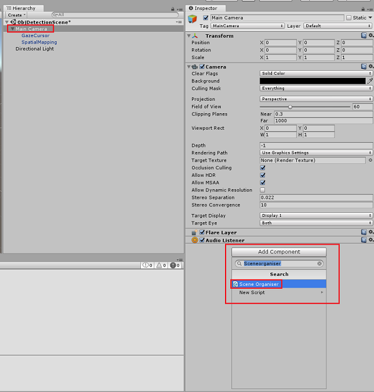

3.  In the **Project Panel**, open the **Prefabs folder**, drag the **Label** prefab into the *Label* empty reference target input area, in the **SceneOrganiser** script that you have just added to the *Main Camera*, as shown in the image below:

    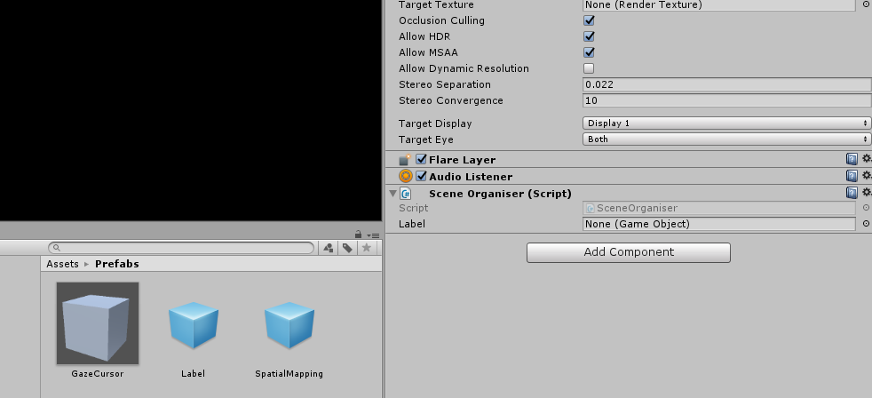

4.  In the **Hierarchy Panel**, select the **GazeCursor** child of the **Main Camera**.
5.  In the **Inspector Panel**, with the **GazeCursor** selected, click on **Add Component**, then search for **GazeCursor** script and double-click, to add it.

    

6.  Again, in the **Hierarchy Panel**, select the **SpatialMapping** child of the **Main Camera**.
7.  In the **Inspector Panel**, with the **SpatialMapping** selected, click on **Add Component**, then search for **SpatialMapping** script and double-click, to add it.

    

The remaining scripts thats you have not set will be added by the code in the **SceneOrganiser** script, during runtime.

## Chapter 12 - Before building

To perform a thorough test of your application you will need to sideload it onto your Microsoft HoloLens.

Before you do, ensure that:

-  All the settings mentioned in the [Chapter 3](#chapter-3---set-up-the-unity-project) are set correctly.
- The script **SceneOrganiser** is attached to the **Main Camera** object.
- The script **GazeCursor** is attached to the **GazeCursor** object.
- The script **SpatialMapping** is attached to the **SpatialMapping** object.
- In [Chapter 5](#chapter-5---create-the-customvisionanalyser-class), Step 6:

    - Make sure you insert your **Service Prediction Key** into the **predictionKey** variable.
    - You have inserted your **Prediction Endpoint** into the **predictionEndpoint** class.

## Chapter 13 - Build the UWP solution and sideload your application

You are now ready to build you application as a UWP Solution that you will be able to deploy on to the Microsoft HoloLens. To begin the build process:

1.  Go to **File > Build Settings**.

2.  Tick **Unity C\# Projects**.

3.  Click on **Add Open Scenes**. This will add the currently open scene to the build.

    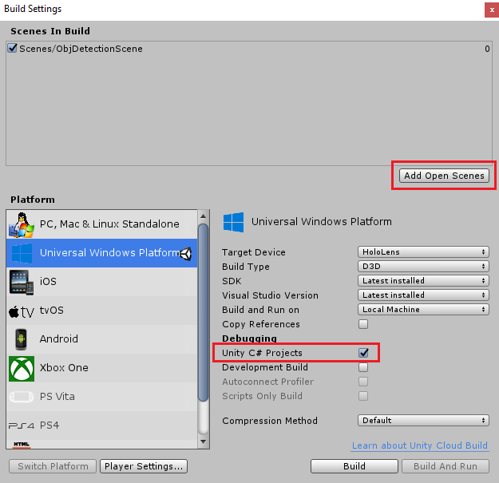

4.  Click **Build**. Unity will launch a *File Explorer* window, where you need to create and then select a folder to build the app into. Create that folder now, and name it **App**. Then with the **App** folder selected, click **Select Folder**.

5.  Unity will begin building your project to the **App** folder.

6.  Once Unity has finished building (it might take some time), it will open a **File Explorer** window at the location of your build (check your task bar, as it may not always appear above your windows, but will notify you of the addition of a new window).

7.  To deploy on to Microsoft HoloLens, you will need the IP Address of that device (for Remote Deploy), and to ensure that it also has **Developer Mode** set. To do this:

    1.  Whilst wearing your HoloLens, open the **Settings**.

    2.  Go to **Network & Internet** > **Wi-Fi** > **Advanced Options**

    3.  Note the **IPv4** address.

    4.  Next, navigate back to **Settings**, and then to **Update & Security** > **For Developers**

    5.  Set **Developer Mode** *On*.

8.  Navigate to your new Unity build (the **App** folder) and open the solution file with **Visual Studio**.

9.  In the Solution Configuration select **Debug**.

10. In the Solution Platform, select **x86, Remote Machine**. You will be prompted to insert the **IP address** of a remote device (the Microsoft HoloLens, in this case, which you noted).

    

11. Go to the **Build** menu and click on **Deploy Solution** to sideload the application to your HoloLens.

12. Your app should now appear in the list of installed apps on your Microsoft HoloLens, ready to be launched!

### To use the application:

* Look at an object, which you have trained with your **Azure Custom Vision Service, Object Detection**, and use the **Tap gesture**.
* If the object is successfully detected, a world-space *Label Text* will appear with the tag name.

> [!IMPORTANT]
> Every time you capture a photo and send it to the Service, you can go back to the Service page and retrain the Service with the newly captured images. At the beginning, you will probably also have to correct the *Bounding Boxes* to be more accurate and retrain the Service.

> [!NOTE]
> The Label Text placed might not appear near the object when the Microsoft HoloLens sensors and/or the SpatialTrackingComponent in Unity fails to place the appropriate colliders, relative to the real world objects. Try to use the application on a different surface if that is the case.

## Your Custom Vision, Object Detection application

Congratulations, you built a mixed reality app that leverages the Azure Custom Vision, Object Detection API, which can recognize an object from an image, and then provide an approximate position for that object in 3D space.


## Bonus exercises

### Exercise 1

Adding to the Text Label, use a semi-transparent cube to wrap the real object in a 3D *Bounding Box*.

### Exercise 2

Train your Custom Vision Service to recognize more objects.

### Exercise 3

Play a sound when an object is recognized.

### Exercise 4

Use the API to re-train your Service with the same images your app is analyzing, so to make the Service more accurate (do both prediction and training simultaneously).