# HoloLens (1st gen) and Azure 312: Bot integration

>[!NOTE]
>The Mixed Reality Academy tutorials were designed with HoloLens (1st gen) and Mixed Reality Immersive Headsets in mind.  As such, we feel it is important to leave these tutorials in place for developers who are still looking for guidance in developing for those devices.  These tutorials will **_not_** be updated with the latest toolsets or interactions being used for HoloLens 2.  They will be maintained to continue working on the supported devices. There will be a new series of tutorials that will be posted in the future that will demonstrate how to develop for HoloLens 2.  This notice will be updated with a link to those tutorials when they are posted.

In this course, you will learn how to create and deploy a bot using the Microsoft Bot Framework V4 and communicate with it through a Windows Mixed Reality application. 


The **Microsoft Bot Framework V4** is a set of APIs designed to provide developers with the tools to build an extensible and scalable bot application. For more information, visit the [Microsoft Bot Framework page](https://dev.botframework.com/) or the [V4 Git Repository](https://github.com/Microsoft/botbuilder-dotnet/wiki).

After completing this course, you will have built a Windows Mixed Reality application, which will be able to do the following:

1. Use a **Tap Gesture** to start the bot listening for the users voice.
2. When the user has said something, the bot will attempt to provide a response.
3. Display the bots reply as text, positioned near the bot, in the Unity Scene.

In your application, it is up to you as to how you will integrate the results with your design. This course is designed to teach you how to integrate an Azure Service with your Unity project. It is your job to use the knowledge you gain from this course to enhance your mixed reality application.

## Device support

<table>
<tr>
<th>Course</th><th style="width:150px"> <a href="/hololens/hololens1-hardware">HoloLens</a></th><th style="width:150px"> <a href="/windows/mixed-reality/enthusiast-guide/immersive-headset-hardware-details">Immersive headsets</a></th>
</tr><tr>
<td> MR and Azure 312: Bot integration</td><td style="text-align: center;"> ✔️</td><td style="text-align: center;"> ✔️</td>
</tr>
</table>

> [!NOTE]
> While this course primarily focuses on HoloLens, you can also apply what you learn in this course to Windows Mixed Reality immersive (VR) headsets. Because immersive (VR) headsets do not have accessible cameras, you will need an external camera connected to your PC. As you follow along with the course, you will see notes on any changes you might need to employ to support immersive (VR) headsets.

## Prerequisites

> [!NOTE]
> This tutorial is designed for developers who have basic experience with Unity and C#. Please also be aware that the prerequisites and written instructions within this document represent what has been tested and verified at the time of writing (July 2018). You are free to use the latest software, as listed within the [install the tools](../../install-the-tools.md) article, though it should not be assumed that the information in this course will perfectly match what you will find in newer software than what is listed below.

We recommend the following hardware and software for this course:

- A development PC, [compatible with Windows Mixed Reality](https://support.microsoft.com/help/4039260/windows-10-mixed-reality-pc-hardware-guidelines) for immersive (VR) headset development
- [Windows 10 Fall Creators Update (or later) with Developer mode enabled](../../install-the-tools.md#installation-checklist)
- [The latest Windows 10 SDK](../../install-the-tools.md#installation-checklist)
- [Unity 2017.4](../../install-the-tools.md#installation-checklist)
- [Visual Studio 2017](../../install-the-tools.md#installation-checklist)
- A [Windows Mixed Reality immersive (VR) headset](/windows/mixed-reality/enthusiast-guide/immersive-headset-hardware-details) or [Microsoft HoloLens](/hololens/hololens1-hardware) with Developer mode enabled
- Internet access for Azure, and for Azure Bot retrieval. For more information, [please follow this link](https://dev.botframework.com/).

### Before you start

1.	To avoid encountering issues building this project, it is strongly suggested that you create the project mentioned in this tutorial in a root or near-root folder (long folder paths can cause issues at build-time).
2.	Set up and test your HoloLens. If you need support setting up your HoloLens, [make sure to visit the HoloLens setup article](/hololens/hololens-setup). 
3.	It is a good idea to perform Calibration and Sensor Tuning when beginning developing a new HoloLens app (sometimes it can help to perform those tasks for each user). 

For help on Calibration, please follow this [link to the HoloLens Calibration article](/hololens/hololens-calibration#hololens-2).

For help on Sensor Tuning, please follow this [link to the HoloLens Sensor Tuning article](/hololens/hololens-updates).

## Chapter 1 – Create the Bot application

The first step is to create your bot as a local ASP.Net Core Web application. Once you have finished and tested it, you will publish it to the Azure Portal.

1.	Open Visual Studio. Create a new project, select **ASP NET Core Web Application** as the project type (you will find it under the subsection .NET Core) and call it **MyBot**. Click **OK**.

2.	In the Window that will appear select **Empty**. Also make sure the target is set to **ASP NET Core 2.0** and the Authentication is set to **No Authentication**. Click **OK**.  

    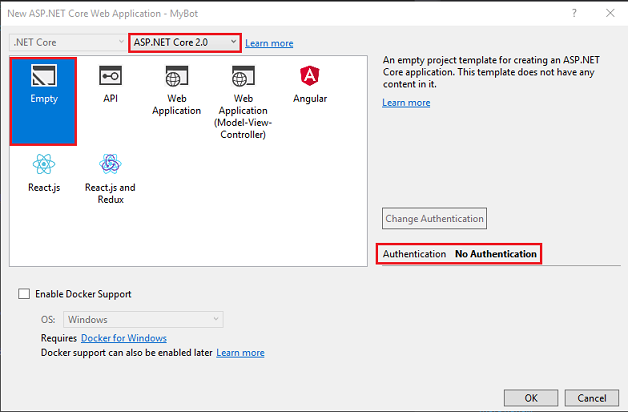

3.	The solution will now open. Right-click on Solution **Mybot** in the **Solution Explorer** and click on **Manage NuGet Packages for Solution**. 

    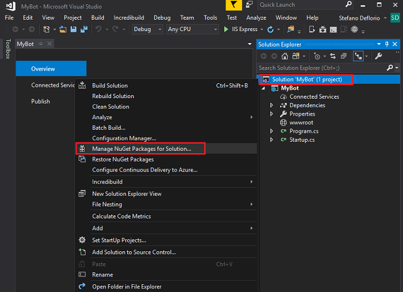

4.	In the **Browse** tab, search for **Microsoft.Bot.Builder.Integration.AspNet.Core** (make sure you have **Include pre-release** checked). Select the package version **4.0.1-preview**, and tick the project boxes. Then click on **Install**. You have now installed the libraries needed for the **Bot Framework v4**. Close the NuGet page.

    

5.	Right-click on your *Project*, **MyBot**, in the **Solution Explorer** and click on **Add** **|** **Class**.

    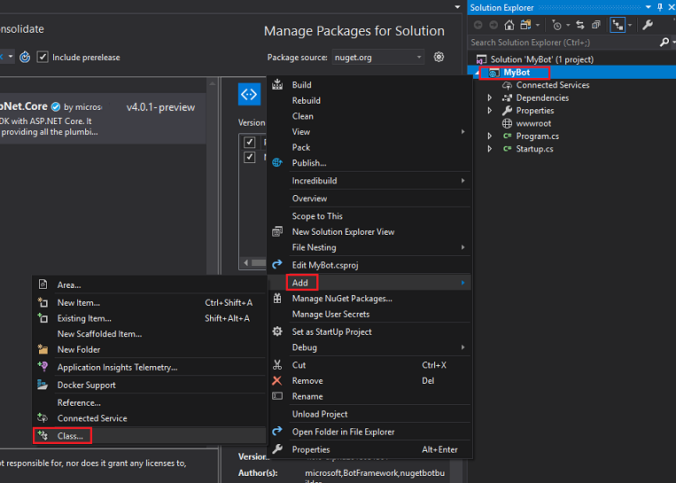

6.	Name the class **MyBot** and click on **Add**.

    

7.	Repeat the previous point, to create another class named **ConversationContext**. 

8.	Right-click on **wwwroot** in the **Solution Explorer** and click on **Add** **|** **New Item**. Select  **HTML Page** (you will find it under the subsection Web). Name the file **default.html**. Click **Add**.

    

9.	The list of classes / objects in the **Solution Explorer** should look like the image below.

    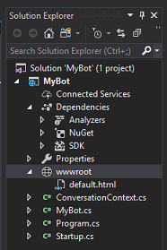

10.	Double-click on the **ConversationContext** class. This class is responsible for holding the variables used by the bot to maintain the context of the conversation. These conversation context values are maintained in an instance of this class, because any instance of the **MyBot** class will refresh each time an activity is received. Add the following code to the class:

    ```csharp
    namespace MyBot
    {
        public static class ConversationContext
        {
            internal static string userName;

            internal static string userMsg;
        }
    }
    ```

11.	Double-click on the **MyBot** class. This class will host the handlers called by any incoming activity from the customer. In this class you will add the code used to build the conversation between the bot and the customer. As mentioned earlier, an instance of this class is initialized each time an activity is received. Add the following code to this class:

    ```csharp
    using Microsoft.Bot;
    using Microsoft.Bot.Builder;
    using Microsoft.Bot.Schema;
    using System.Threading.Tasks;

    namespace MyBot
    {
        public class MyBot : IBot
        {       
            public async Task OnTurn(ITurnContext context)
            {
                ConversationContext.userMsg = context.Activity.Text;

                if (context.Activity.Type is ActivityTypes.Message)
                {
                    if (string.IsNullOrEmpty(ConversationContext.userName))
                    {
                        ConversationContext.userName = ConversationContext.userMsg;
                        await context.SendActivity($"Hello {ConversationContext.userName}. Looks like today it is going to rain. \nLuckily I have umbrellas and waterproof jackets to sell!");
                    }
                    else
                    {
                        if (ConversationContext.userMsg.Contains("how much"))
                        {
                            if (ConversationContext.userMsg.Contains("umbrella")) await context.SendActivity($"Umbrellas are $13.");
                            else if (ConversationContext.userMsg.Contains("jacket")) await context.SendActivity($"Waterproof jackets are $30.");
                            else await context.SendActivity($"Umbrellas are $13. \nWaterproof jackets are $30.");
                        }
                        else if (ConversationContext.userMsg.Contains("color") || ConversationContext.userMsg.Contains("colour"))
                        {
                            await context.SendActivity($"Umbrellas are black. \nWaterproof jackets are yellow.");
                        }
                        else
                        {
                            await context.SendActivity($"Sorry {ConversationContext.userName}. I did not understand the question");
                        }
                    }
                }
                else
                {

                    ConversationContext.userMsg = string.Empty;
                    ConversationContext.userName = string.Empty;
                    await context.SendActivity($"Welcome! \nI am the Weather Shop Bot \nWhat is your name?");
                }

            }
        }
    }
    ```

12.	Double-click on the **Startup** class. This class will initialize the bot. Add the following code to the class:

    ```csharp
    using Microsoft.AspNetCore.Builder;
    using Microsoft.AspNetCore.Hosting;
    using Microsoft.Bot.Builder.BotFramework;
    using Microsoft.Bot.Builder.Integration.AspNet.Core;
    using Microsoft.Extensions.Configuration;
    using Microsoft.Extensions.DependencyInjection;

    namespace MyBot
    {
    public class Startup
        {
            public IConfiguration Configuration { get; }

            public Startup(IHostingEnvironment env)
            {
                var builder = new ConfigurationBuilder()
                    .SetBasePath(env.ContentRootPath)
                    .AddJsonFile("appsettings.json", optional: true, reloadOnChange: true)
                    .AddJsonFile($"appsettings.{env.EnvironmentName}.json", optional: true)
                    .AddEnvironmentVariables();
                Configuration = builder.Build();
            }

            // This method gets called by the runtime. Use this method to add services to the container.
            public void ConfigureServices(IServiceCollection services)
            {
                services.AddSingleton(_ => Configuration);
                services.AddBot<MyBot>(options =>
                {
                    options.CredentialProvider = new ConfigurationCredentialProvider(Configuration);
                });
            }

            // This method gets called by the runtime. Use this method to configure the HTTP request pipeline.
            public void Configure(IApplicationBuilder app, IHostingEnvironment env)
            {
                if (env.IsDevelopment())
                {
                    app.UseDeveloperExceptionPage();
                }

                app.UseDefaultFiles();
                app.UseStaticFiles();
                app.UseBotFramework();
            }
        }
    }
    ```

13. Open the **Program** class file and verify the code in it is the same as the following:

    ```csharp
    using Microsoft.AspNetCore;
    using Microsoft.AspNetCore.Hosting;

    namespace MyBot
    {
        public class Program
        {
            public static void Main(string[] args)
            {
                BuildWebHost(args).Run();
            }

            public static IWebHost BuildWebHost(string[] args) =>
                WebHost.CreateDefaultBuilder(args)
                    .UseStartup<Startup>()
                    .Build();
        }
    }
    ```

14. Remember to save your changes, to do so, go to **File** > **Save All**, from the toolbar at the top of Visual Studio.

## Chapter 2 - Create the Azure Bot Service

Now that you have built the code for your bot, you have to publish it to an instance of the *Web App Bot* Service, on the Azure Portal. This Chapter will show you how to create and configure the Bot Service on Azure and then publish your code to it.

1.	First, log in to the Azure Portal (https://portal.azure.com). 

    1. If you do not already have an Azure account, you will need to create one. If you are following this tutorial in a classroom or lab situation, ask your instructor or one of the proctors for help setting up your new account.

2.	Once you are logged in, click on **Create a resource** in the top left corner, and search for *Web App bot*, and click **Enter**.

    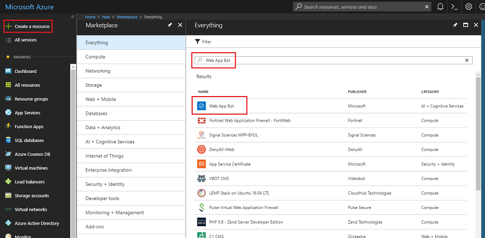
 
3.	The new page will provide a description of the *Web App Bot* Service. At the bottom left of this page, select the **Create** button, to create an association with this Service.

    
 
4.	Once you have clicked on **Create**:

    1. Insert your desired **Name** for this Service instance.
    2. Select a **Subscription**.
    3. Choose a **Resource Group** or create a new one. A resource group provides a way to monitor, control access, provision and manage billing for a collection of Azure assets. It is recommended to keep all the Azure Services associated with a single project (e.g. such as these courses) under a common resource group).

        > If you wish to read more about Azure Resource Groups, [please follow this link](/azure/azure-resource-manager/resource-group-portal)

    4. Determine the Location for your resource group (if you are creating a new Resource Group). The location would ideally be in the region where the application would run. Some Azure assets are only available in certain regions.
    5. Select the **Pricing Tier** appropriate for you, if this is the first time creating a *Web App Bot* Service, a free tier (named F0) should be available to you
    6. **App name** can just be left the same as the *Bot name*. 
    7. Leave the *Bot template* as **Basic (C#)**.
    8. *App service plan/Location* should have been auto-filled for your account.
    9. Set the **Azure Storage** that you wish to use to host your Bot. If you dont have one already, you can create it here.
    10. You will also need to confirm that you have understood the Terms and Conditions applied to this Service.
    11. Click Create.
 
        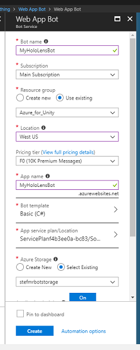

5.	Once you have clicked on **Create**, you will have to wait for the Service to be created, this might take a minute.

6.	A notification will appear in the Portal once the Service instance is created.

     
 
7.	Click on the notification to explore your new Service instance. 

    
 
8. Click the **Go to resource** button in the notification to explore your new Service instance. You will be taken to your new Azure Service instance. 

    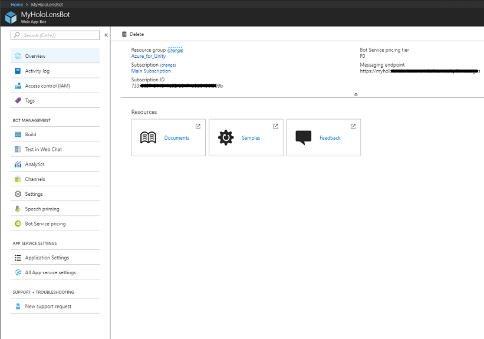
 
9.	At this point you need to setup a feature called **Direct Line** to allow your client application to communicate with this Bot Service. Click on **Channels**, then in the **Add a featured channel** section, click on **Configure Direct Line channel**.

    

10.	In this page you will find the **Secret keys** that will allow your client app to authenticate with the bot. Click on the **Show** button and take a copy of one of the displayed Keys, as you will need this later in your project. 

    

## Chapter 3 – Publish the Bot to the Azure Web App Bot Service

Now that your Service is ready, you need to publish your Bot code, that you built previously, to your newly created Web App Bot Service.

> [!NOTE] 
> You will have to publish your Bot to the Azure Service every time you make changes to the Bot solution / code.

1.  Go back to your Visual Studio Solution that you created previously. 
2.  Right-click on your **MyBot** project, in the **Solution Explorer**, then click on **Publish**.

    

3.  On the *Pick a publish target* page, click **App Service**, then **Select Existing**, lastly click on **Create Profile** (you may need to click on the dropdown arrow alongside the *Publish* button, if this is not visible).

    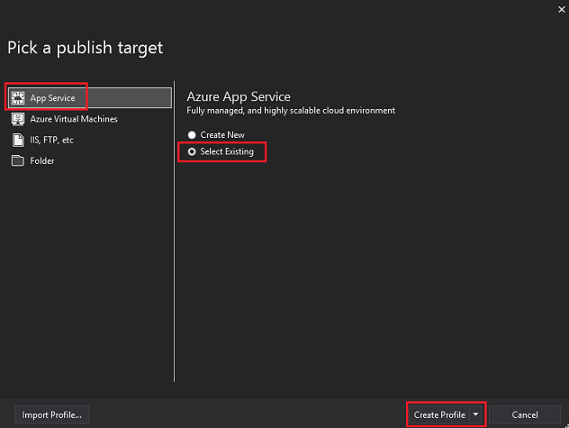

4. If you are not yet logged in into your Microsoft Account, you have to do it here.
5. On the **Publish** page you will find you have to set the same **Subscription** that you used for the *Web App Bot* Service creation. Then set the **View** as **Resource Group** and, in the drop down folder structure, select the **Resource Group** you have created previously. Click **OK**. 

    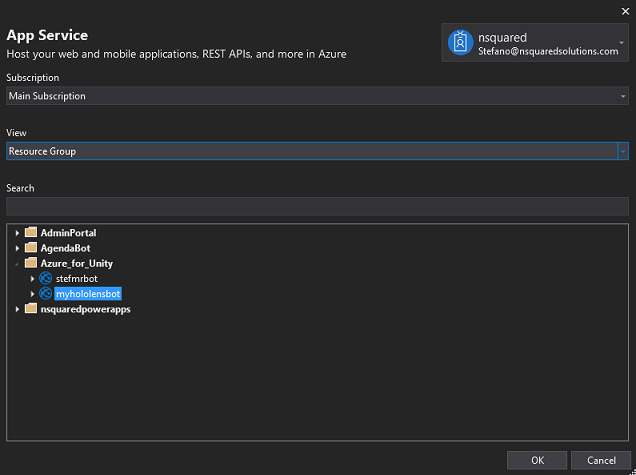

6.  Now click on the **Publish** button, and wait for the Bot to be published (it might take a few minutes).

    


## Chapter 4 – Set up the Unity project

The following is a typical set up for developing with mixed reality, and as such, is a good template for other projects.

1.	Open *Unity* and click **New**. 

    

2.	You will now need to provide a Unity project name. Insert **HoloLens Bot**. Make sure the project template is set to **3D**. Set the **Location** to somewhere appropriate for you (remember, closer to root directories is better). Then, click **Create project**.

    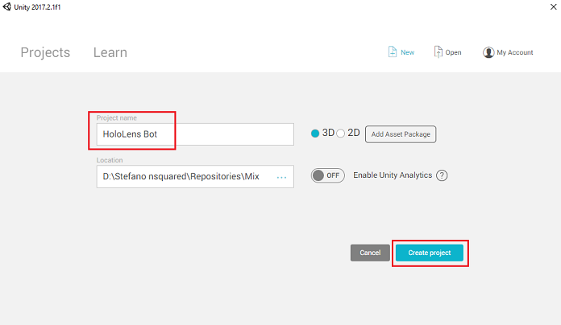

3.	With Unity open, it is worth checking the default **Script Editor** is set to **Visual Studio**. Go to **Edit > Preferences** and then from the new window, navigate to **External Tools**. Change **External Script Editor** to **Visual Studio 2017**. Close the **Preferences** window.

    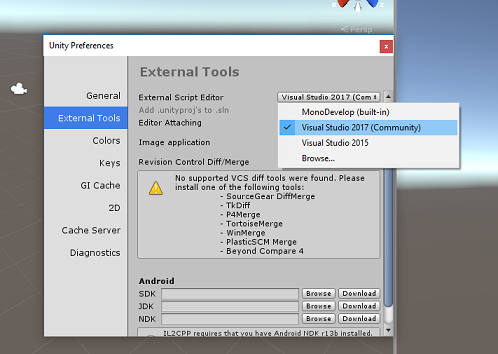

4.	Next, go to **File > Build Settings** and select **Universal Windows Platform**, then click on the **Switch Platform** button to apply your selection.

    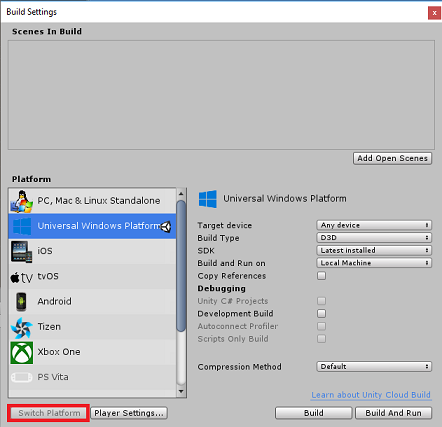

5.	While still in **File > Build Settings** and make sure that:

    1.  **Target Device** is set to **HoloLens**

        > For the immersive headsets, set **Target Device** to *Any Device*.

    2.  **Build Type** is set to **D3D**

    3.  **SDK** is set to **Latest installed**

    4.  **Visual Studio Version** is set to **Latest installed**

    5.  **Build and Run** is set to **Local Machine**

    6.  Save the scene and add it to the build. 

        1. Do this by selecting **Add Open Scenes**. A save window will appear.
        
            

        2. Create a new folder for this, and any future, scene, then select the **New folder** button, to create a new folder, name it **Scenes**.

             

        3. Open your newly created **Scenes** folder, and then in the *File name*: text field, type **BotScene**, then click on **Save**.

            

    7. The remaining settings, in **Build Settings**, should be left as default for now.

6. In the *Build Settings* window, click on the **Player Settings** button, this will open the related panel in the space where the *Inspector* is located. 

    

7. In this panel, a few settings need to be verified:

    1. In the **Other Settings** tab:

        1. **Scripting Runtime Version** should be **Experimental (NET 4.6 Equivalent)**; changing this will require a restart of the Editor.
        2. **Scripting Backend** should be **.NET**
        3. **API Compatibility Level** should be **.NET 4.6**

            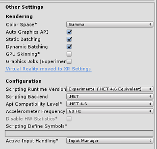
      
    2. Within the **Publishing Settings** tab, under **Capabilities**, check:

        - **InternetClient**
        - **Microphone**

            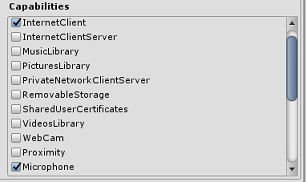

    3. Further down the panel, in **XR Settings** (found below **Publish Settings**), tick **Virtual Reality Supported**, make sure the **Windows Mixed Reality SDK** is added.

        

8.	Back in *Build Settings* _Unity C#_ Projects is no longer greyed out; tick the checkbox next to this. 
9.	Close the Build Settings window.
10.	Save your scene and project (**FILE > SAVE SCENE / FILE > SAVE PROJECT**).


## Chapter 5 – Camera setup

> [!IMPORTANT]
> If you wish to skip the *Unity Set up* component of this course, and continue straight into code, feel free to download this [Azure-MR-312-Package.unitypackage](https://github.com/Microsoft/HolographicAcademy/raw/Azure-MixedReality-Labs/Azure%20Mixed%20Reality%20Labs/MR%20and%20Azure%20312%20-%20Bot%20integration/Azure-MR-312.unitypackage), import it into your project as a [**Custom Package**](https://docs.unity3d.com/Manual/AssetPackages.html), and then continue from [Chapter 7](#chapter-8--create-the-botobjects-class).

1.	In the *Hierarchy panel*, select the **Main Camera**. 
2.	Once selected, you will be able to see all the components of the **Main Camera** in the *Inspector panel*.

    1. The **Camera object** must be named **Main Camera** (note the spelling)
    2. The Main Camera **Tag** must be set to **MainCamera** (note the spelling)
    3. Make sure the **Transform Position** is set to **0, 0, 0**
    4. Set **Clear Flags** to **Solid Color**.
    5. Set the **Background** Color of the Camera component to **Black, Alpha 0 (Hex Code: #00000000)**

    
 

## Chapter 6 – Import the Newtonsoft library

To help you deserialize and serialize objects received and sent to the Bot Service you need to download the **Newtonsoft** library. You will find a [compatible version already organized with the correct Unity folder structure here](https://github.com/Microsoft/HolographicAcademy/raw/Azure-MixedReality-Labs/Azure%20Mixed%20Reality%20Labs/MR%20and%20Azure%20312%20-%20Bot%20integration/NewtonsoftDLL.unitypackage). 

To import the Newtonsoft library into your project, use the Unity Package which came with this course.

1.  Add the *.unitypackage* to Unity by using the **Assets** > **Import Package** > **Custom Package** menu option.

    

2.  In the **Import Unity Package** box that pops up, ensure everything under (and including) **Plugins** is selected.

    

3.  Click the **Import** button to add the items to your project.

4.  Go to the **Newtonsoft** folder under **Plugins** in the project view and select the Newtonsoft plugin.

    

5.  With the Newtonsoft plugin selected, ensure that **Any Platform** is **unchecked**, then ensure that **WSAPlayer** is also **unchecked**, then click **Apply**. This is just to confirm that the files are configured correctly.

    

    > [!NOTE]
    > Marking these plugins configures them to only be used in the Unity Editor. There are a different set of them in the WSA folder which will be used after the project is exported from Unity.

6.  Next, you need to open the **WSA** folder, within the **Newtonsoft** folder. You will see a copy of the same file you just configured. Select the file, and then in the inspector, ensure that
    -   **Any Platform** is **unchecked** 
    -   **only** **WSAPlayer** is **checked**
    -   **Dont process** is **checked**

    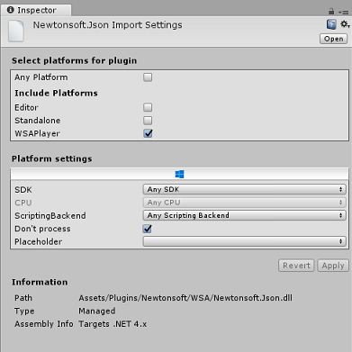

## Chapter 7 – Create the BotTag

1.	Create a new **Tag** object called **BotTag**. Select the Main Camera in the scene. Click on the Tag drop down menu in the Inspector panel. Click on **Add Tag**.

    
 
2.	Click on the **+** symbol. Name the new **Tag** as **BotTag**, *Save*.

    

> [!WARNING] 
> **Do not** apply the **BotTag** to the Main Camera. If you have accidentally done this, make sure to change the Main Camera tag back to *MainCamera*.

## Chapter 8 – Create the BotObjects class

The first script you need to create is the **BotObjects** class, which is an empty class created so that a series of other class objects can be stored within the same script and accessed by other scripts in the scene.

The creation of this class is purely an architectural choice, these objects could instead be hosted in the Bot script that you will create later in this course.

To create this class: 

1.	Right-click in the *Project panel*, then **Create > Folder**. Name the folder **Scripts**. 

    

2.	Double-click on the **Scripts** folder to open it. Then within that folder, right-click, and select **Create > C# Script**. Name the script **BotObjects**. 

3.	Double-click on the new **BotObjects** script to open it with **Visual Studio**.

4.	Delete the content of the script and replace it with the following code:

    ```csharp
    using System;
    using System.Collections;
    using System.Collections.Generic;
    using UnityEngine;

    public class BotObjects : MonoBehaviour{}

    /// <summary>
    /// Object received when first opening a conversation
    /// </summary>
    [Serializable]
    public class ConversationObject
    {
        public string ConversationId;
        public string token;
        public string expires_in;
        public string streamUrl;
        public string referenceGrammarId;
    }

    /// <summary>
    /// Object including all Activities
    /// </summary>
    [Serializable]
    public class ActivitiesRootObject
    {
        public List<Activity> activities { get; set; }
        public string watermark { get; set; }
    }
    [Serializable]
    public class Conversation
    {
        public string id { get; set; }
    }
    [Serializable]
    public class From
    {
        public string id { get; set; }
        public string name { get; set; }
    }
    [Serializable]
    public class Activity
    {
        public string type { get; set; }
        public string channelId { get; set; }
        public Conversation conversation { get; set; }
        public string id { get; set; }
        public From from { get; set; }
        public string text { get; set; }
        public string textFormat { get; set; }
        public DateTime timestamp { get; set; }
        public string serviceUrl { get; set; }
    }
    ```

6.	Be sure to save your changes in *Visual Studio* before returning to *Unity*.

## Chapter 9 – Create the GazeInput class

The next class you are going to create is the **GazeInput** class. This class is responsible for:

- Creating a cursor that will represent the *gaze* of the player.
- Detecting objects hit by the gaze of the player, and holding a reference to detected objects.

To create this class: 

1.	Go to the **Scripts** folder you created previously. 
2.	Right-click inside the folder, **Create > C# Script**. Call the script **GazeInput**. 
3.	Double-click on the new **GazeInput** script to open it with **Visual Studio**.
4.	Insert the following line right on top of the class name:

    ```csharp
    /// <summary>
    /// Class responsible for the User's gaze interactions
    /// </summary>
    [System.Serializable]
    public class GazeInput : MonoBehaviour
    ```

5.	Then add the following variables inside the **GazeInput** class, above the **Start()** method:

    ```csharp
        [Tooltip("Used to compare whether an object is to be interacted with.")]
        internal string InteractibleTag = "BotTag";

        /// <summary>
        /// Length of the gaze
        /// </summary>
        internal float GazeMaxDistance = 300;

        /// <summary>
        /// Object currently gazed
        /// </summary>
        internal GameObject FocusedObject { get; private set; }

        internal GameObject _oldFocusedObject { get; private set; }

        internal RaycastHit HitInfo { get; private set; }

        /// <summary>
        /// Cursor object visible in the scene
        /// </summary>
        internal GameObject Cursor { get; private set; }

        internal bool Hit { get; private set; }

        internal Vector3 Position { get; private set; }

        internal Vector3 Normal { get; private set; }

        private Vector3 _gazeOrigin;

        private Vector3 _gazeDirection;
    ```

6.	Code for **Start()** method should be added. This will be called when the class initializes:

    ```csharp
        /// <summary>
        /// Start method used upon initialization.
        /// </summary>
        internal virtual void Start()
        {
            FocusedObject = null;
            Cursor = CreateCursor();
        }
    ```

7.	Implement a method that will instantiate and setup the gaze cursor: 

    ```csharp
        /// <summary>
        /// Method to create a cursor object.
        /// </summary>
        internal GameObject CreateCursor()
        {
            GameObject newCursor = GameObject.CreatePrimitive(PrimitiveType.Sphere);
            newCursor.SetActive(false);
            // Remove the collider, so it does not block Raycast.
            Destroy(newCursor.GetComponent<SphereCollider>());
            newCursor.transform.localScale = new Vector3(0.05f, 0.05f, 0.05f);
            Material mat = new Material(Shader.Find("Diffuse"));
            newCursor.GetComponent<MeshRenderer>().material = mat;
            mat.color = Color.HSVToRGB(0.0223f, 0.7922f, 1.000f);
            newCursor.SetActive(true);

            return newCursor;
        }
    ```

8.	Implement the methods that will setup the Raycast from the Main Camera and will keep track of the current focused object.

    ```csharp
        /// <summary>
        /// Called every frame
        /// </summary>
        internal virtual void Update()
        {
            _gazeOrigin = Camera.main.transform.position;

            _gazeDirection = Camera.main.transform.forward;

            UpdateRaycast();
        }


        /// <summary>
        /// Reset the old focused object, stop the gaze timer, and send data if it
        /// is greater than one.
        /// </summary>
        private void ResetFocusedObject()
        {
            // Ensure the old focused object is not null.
            if (_oldFocusedObject != null)
            {
                if (_oldFocusedObject.CompareTag(InteractibleTag))
                {
                    // Provide the OnGazeExited event.
                    _oldFocusedObject.SendMessage("OnGazeExited", 
                        SendMessageOptions.DontRequireReceiver);
                }
            }
        }


        private void UpdateRaycast()
        {
            // Set the old focused gameobject.
            _oldFocusedObject = FocusedObject;
            RaycastHit hitInfo;

            // Initialize Raycasting.
            Hit = Physics.Raycast(_gazeOrigin,
                _gazeDirection,
                out hitInfo,
                GazeMaxDistance);
            HitInfo = hitInfo;

            // Check whether raycast has hit.
            if (Hit == true)
            {
                Position = hitInfo.point;
                Normal = hitInfo.normal;

                // Check whether the hit has a collider.
                if (hitInfo.collider != null)
                {
                    // Set the focused object with what the user just looked at.
                    FocusedObject = hitInfo.collider.gameObject;
                }
                else
                {
                    // Object looked on is not valid, set focused gameobject to null.
                    FocusedObject = null;
                }
            }
            else
            {
                // No object looked upon, set focused gameobject to null.
                FocusedObject = null;

                // Provide default position for cursor.
                Position = _gazeOrigin + (_gazeDirection * GazeMaxDistance);

                // Provide a default normal.
                Normal = _gazeDirection;
            }

            // Lerp the cursor to the given position, which helps to stabilize the gaze.
            Cursor.transform.position = Vector3.Lerp(Cursor.transform.position, Position, 0.6f);

            // Check whether the previous focused object is this same. If so, reset the focused object.
            if (FocusedObject != _oldFocusedObject)
            {
                ResetFocusedObject();
                if (FocusedObject != null)
                {
                    if (FocusedObject.CompareTag(InteractibleTag))
                    {
                        // Provide the OnGazeEntered event.
                        FocusedObject.SendMessage("OnGazeEntered",
                            SendMessageOptions.DontRequireReceiver);
                    }
                }
            }
        }
    ```
 
9.	Be sure to save your changes in *Visual Studio* before returning to *Unity*.

## Chapter 10 – Create the Bot class

The script you are going to create now is called **Bot**. This is the core class of your application, it stores: 

- Your Web App Bot credentials
- The method that collects the user voice commands
- The method necessary to initiate conversations with your Web App Bot 
- The method necessary to send messages to your Web App Bot 

To send messages to the Bot Service, the **SendMessageToBot()** coroutine will build an activity, which is an object recognized by the Bot Framework as data sent by the user. 
 
To create this class: 

1. Double-click on the **Scripts** folder, to open it. 
2. Right-click inside the **Scripts** folder, click **Create > C# Script**. Name the script **Bot**. 
3. Double-click on the new script to open it with Visual Studio.
4. Update the namespaces to be the same as the following, at the top of the **Bot** class:

    ```csharp
    using Newtonsoft.Json;
    using System.Collections;
    using System.Text;
    using UnityEngine;
    using UnityEngine.Networking;
    using UnityEngine.Windows.Speech;
    ```
 
5. Inside the **Bot** class add the following variables:

    ```csharp
        /// <summary>
        /// Static instance of this class
        /// </summary>
        public static Bot Instance;

        /// <summary>
        /// Material of the sphere representing the Bot in the scene
        /// </summary>
        internal Material botMaterial;

        /// <summary>
        /// Speech recognizer class reference, which will convert speech to text.
        /// </summary>
        private DictationRecognizer dictationRecognizer;

        /// <summary>
        /// Use this variable to identify the Bot Id
        /// Can be any value
        /// </summary>
        private string botId = "MRBotId";

        /// <summary>
        /// Use this variable to identify the Bot Name
        /// Can be any value
        /// </summary>
        private string botName = "MRBotName";

        /// <summary>
        /// The Bot Secret key found on the Web App Bot Service on the Azure Portal
        /// </summary>
        private string botSecret = "-- Add your Secret Key here --"; 

        /// <summary>
        /// Bot Endpoint, v4 Framework uses v3 endpoint at this point in time
        /// </summary>
        private string botEndpoint = "https://directline.botframework.com/v3/directline";

        /// <summary>
        /// The conversation object reference
        /// </summary>
        private ConversationObject conversation;

        /// <summary>
        /// Bot states to regulate the application flow
        /// </summary>
        internal enum BotState {ReadyToListen, Listening, Processing}

        /// <summary>
        /// Flag for the Bot state
        /// </summary>
        internal BotState botState;

        /// <summary>
        /// Flag for the conversation status
        /// </summary>
        internal bool conversationStarted = false;
    ```

    > [!NOTE] 
    > Make sure you insert your **Bot Secret Key** into the **botSecret** variable. You will have noted your **Bot Secret Key** at the beginning of this course, in **[Chapter 2](#chapter-2---create-the-azure-bot-service), step 10**.

7. Code for **Awake()** and **Start()** now needs to be added. 

    ```csharp
        /// <summary>
        /// Called on Initialization
        /// </summary>
        void Awake()
        {
            Instance = this;
        }

        /// <summary>
        /// Called immediately after Awake method
        /// </summary>
        void Start()
        {
            botState = BotState.ReadyToListen;
        }
    ```

8. Add the two handlers that are called by the speech libraries when voice capture begins and ends. The *DictationRecognizer* will automatically stop capturing the user voice when the user stops speaking.

    ```csharp
        /// <summary>
        /// Start microphone capture.
        /// </summary>
        public void StartCapturingAudio()
        {
            botState = BotState.Listening;
            botMaterial.color = Color.red;

            // Start dictation
            dictationRecognizer = new DictationRecognizer();
            dictationRecognizer.DictationResult += DictationRecognizer_DictationResult;
            dictationRecognizer.Start();
        }
        

        /// <summary>
        /// Stop microphone capture.
        /// </summary>
        public void StopCapturingAudio()
        {
            botState = BotState.Processing;
            dictationRecognizer.Stop();
        }
        
    ```

1. The following handler collects the result of the user voice input and calls the coroutine responsible for sending the message to the Web App Bot Service.

    ```csharp
        /// <summary>
        /// This handler is called every time the Dictation detects a pause in the speech. 
        /// </summary>
        private void DictationRecognizer_DictationResult(string text, ConfidenceLevel confidence)
        {
            // Update UI with dictation captured
            Debug.Log($"User just said: {text}");      

            // Send dictation to Bot
            StartCoroutine(SendMessageToBot(text, botId, botName, "message"));
            StopCapturingAudio();
        }     
    ```

10. The following coroutine is called to begin a conversation with the Bot. You will notice that once the conversation call is complete, it will call the **SendMessageToCoroutine()** by passing a series of parameters that will set the activity to be sent to the Bot Service as an empty message. This is done to prompt the Bot Service to initiate the dialogue.

    ```csharp
        /// <summary>
        /// Request a conversation with the Bot Service
        /// </summary>
        internal IEnumerator StartConversation()
        {
            string conversationEndpoint = string.Format("{0}/conversations", botEndpoint);

            WWWForm webForm = new WWWForm();

            using (UnityWebRequest unityWebRequest = UnityWebRequest.Post(conversationEndpoint, webForm))
            {
                unityWebRequest.SetRequestHeader("Authorization", "Bearer " + botSecret);
                unityWebRequest.downloadHandler = new DownloadHandlerBuffer();

                yield return unityWebRequest.SendWebRequest();
                string jsonResponse = unityWebRequest.downloadHandler.text;
            
                conversation = new ConversationObject();
                conversation = JsonConvert.DeserializeObject<ConversationObject>(jsonResponse);
                Debug.Log($"Start Conversation - Id: {conversation.ConversationId}");
                conversationStarted = true; 
            }

            // The following call is necessary to create and inject an activity of type //"conversationUpdate" to request a first "introduction" from the Bot Service.
            StartCoroutine(SendMessageToBot("", botId, botName, "conversationUpdate"));
        }    
    ```

11. The following coroutine is called to build the activity to be sent to the Bot Service. 

    ```csharp
        /// <summary>
        /// Send the user message to the Bot Service in form of activity
        /// and call for a response
        /// </summary>
        private IEnumerator SendMessageToBot(string message, string fromId, string fromName, string activityType)
        {
            Debug.Log($"SendMessageCoroutine: {conversation.ConversationId}, message: {message} from Id: {fromId} from name: {fromName}");

            // Create a new activity here
            Activity activity = new Activity();
            activity.from = new From();
            activity.conversation = new Conversation();
            activity.from.id = fromId;
            activity.from.name = fromName;
            activity.text = message;
            activity.type = activityType;
            activity.channelId = "DirectLineChannelId";
            activity.conversation.id = conversation.ConversationId;     

            // Serialize the activity
            string json = JsonConvert.SerializeObject(activity);

            string sendActivityEndpoint = string.Format("{0}/conversations/{1}/activities", botEndpoint, conversation.ConversationId);
            
            // Send the activity to the Bot
            using (UnityWebRequest www = new UnityWebRequest(sendActivityEndpoint, "POST"))
            {
                www.uploadHandler = new UploadHandlerRaw(Encoding.UTF8.GetBytes(json));

                www.downloadHandler = new DownloadHandlerBuffer();
                www.SetRequestHeader("Authorization", "Bearer " + botSecret);
                www.SetRequestHeader("Content-Type", "application/json");

                yield return www.SendWebRequest();

                // extrapolate the response Id used to keep track of the conversation
                string jsonResponse = www.downloadHandler.text;
                string cleanedJsonResponse = jsonResponse.Replace("\r\n", string.Empty);
                string responseConvId = cleanedJsonResponse.Substring(10, 30);

                // Request a response from the Bot Service
                StartCoroutine(GetResponseFromBot(activity));
            }
        }
    ```

12. The following coroutine is called to request a response after sending an activity to the Bot Service. 

    ```csharp
        /// <summary>
        /// Request a response from the Bot by using a previously sent activity
        /// </summary>
        private IEnumerator GetResponseFromBot(Activity activity)
        {
            string getActivityEndpoint = string.Format("{0}/conversations/{1}/activities", botEndpoint, conversation.ConversationId);

            using (UnityWebRequest unityWebRequest1 = UnityWebRequest.Get(getActivityEndpoint))
            {
                unityWebRequest1.downloadHandler = new DownloadHandlerBuffer();
                unityWebRequest1.SetRequestHeader("Authorization", "Bearer " + botSecret);

                yield return unityWebRequest1.SendWebRequest();

                string jsonResponse = unityWebRequest1.downloadHandler.text;

                ActivitiesRootObject root = new ActivitiesRootObject();
                root = JsonConvert.DeserializeObject<ActivitiesRootObject>(jsonResponse);

                foreach (var act in root.activities)
                {
                    Debug.Log($"Bot Response: {act.text}");
                    SetBotResponseText(act.text);
                }

                botState = BotState.ReadyToListen;
                botMaterial.color = Color.blue;
            }
        } 
    ```

13. The last method to be added to this class, is required to display the message in the scene:

    ```csharp
        /// <summary>
        /// Set the UI Response Text of the bot
        /// </summary>
        internal void SetBotResponseText(string responseString)
        {        
            SceneOrganiser.Instance.botResponseText.text =  responseString;
        }
    ```

    > [!NOTE] 
    > You may see an error within the Unity Editor Console, about missing the **SceneOrganiser** class. Disregard this message, as you will create this class later in the tutorial.

14.	 Be sure to save your changes in *Visual Studio* before returning to *Unity*.

## Chapter 11 – Create the Interactions class

The class you are going to create now is called **Interactions**. This class is used to detect the HoloLens Tap Input from the user. 

If the user taps while looking at the *Bot* object in the scene, and the Bot is ready to listen for voice inputs, the Bot object will change color to **red** and begin listening for voice inputs. 

This class inherits from the **GazeInput** class, and so is able to reference the **Start()** method and variables from that class, denoted by the use of **base**. 
 
To create this class:

1.	Double-click on the **Scripts** folder, to open it. 
2.	Right-click inside the **Scripts** folder, click **Create > C# Script**. Name the script **Interactions**. 
3.	Double-click on the new script to open it with Visual Studio.
4.	Update the namespaces and the class inheritance to be the same as the following, at the top of the **Interactions** class:

    ```csharp
    using UnityEngine.XR.WSA.Input;

    public class Interactions : GazeInput
    {
    ```

5.  Inside the **Interactions** class add the following variable:

    ```csharp
        /// <summary>
        /// Allows input recognition with the HoloLens
        /// </summary>
        private GestureRecognizer _gestureRecognizer;
    ```
6.  Then add the **Start()** method:

    ```csharp
        /// <summary>
        /// Called on initialization, after Awake
        /// </summary>
        internal override void Start()
        {
            base.Start();

            //Register the application to recognize HoloLens user inputs
            _gestureRecognizer = new GestureRecognizer();
            _gestureRecognizer.SetRecognizableGestures(GestureSettings.Tap);
            _gestureRecognizer.Tapped += GestureRecognizer_Tapped;
            _gestureRecognizer.StartCapturingGestures();
        }
    ```

7.  Add the handler that will be triggered when the user performs the tap gesture in front of the HoloLens camera

    ```csharp
        /// <summary>
        /// Detects the User Tap Input
        /// </summary>
        private void GestureRecognizer_Tapped(TappedEventArgs obj)
        {
            // Ensure the bot is being gazed upon.
            if(base.FocusedObject != null)
            {
                // If the user is tapping on Bot and the Bot is ready to listen
                if (base.FocusedObject.name == "Bot" && Bot.Instance.botState == Bot.BotState.ReadyToListen)
                {
                    // If a conversation has not started yet, request one
                    if(Bot.Instance.conversationStarted)
                    {
                        Bot.Instance.SetBotResponseText("Listening...");
                        Bot.Instance.StartCapturingAudio();
                    }
                    else
                    {
                        Bot.Instance.SetBotResponseText("Requesting Conversation...");
                        StartCoroutine(Bot.Instance.StartConversation());
                    }                                  
                }
            }
        }
    ```

8. Be sure to save your changes in *Visual Studio* before returning to *Unity*.

## Chapter 12 – Create the SceneOrganiser class

The last class required in this Lab is called **SceneOrganiser**. This class will setup the scene programmatically, by adding components and scripts to the Main Camera, and creating the appropriate objects in the scene.
 
To create this class:

1.	Double-click on the **Scripts** folder, to open it. 
2.	Right-click inside the **Scripts** folder, click **Create > C# Script**. Name the script **SceneOrganiser**. 
3.	Double-click on the new script to open it with Visual Studio.
4.  Inside the **SceneOrganiser** class add the following variables:

    ```csharp
        /// <summary>
        /// Static instance of this class
        /// </summary>
        public static SceneOrganiser Instance;

        /// <summary>
        /// The 3D text representing the Bot response
        /// </summary>
        internal TextMesh botResponseText;
    ```

6.  Then add the **Awake()** and **Start()** methods:

    ```csharp
        /// <summary>
        /// Called on Initialization
        /// </summary>
        private void Awake()
        {
            Instance = this;
        }

        /// <summary>
        /// Called immediately after Awake method
        /// </summary>
        void Start ()
        {
            // Add the GazeInput class to this object
            gameObject.AddComponent<GazeInput>();

            // Add the Interactions class to this object
            gameObject.AddComponent<Interactions>();

            // Create the Bot in the scene
            CreateBotInScene();
        }
    ```

7.  Add the following method, responsible for creating the Bot object in the scene and setting up the parameters and components:

    ```csharp
        /// <summary>
        /// Create the Sign In button object in the scene
        /// and sets its properties
        /// </summary>
        private void CreateBotInScene()
        {
            GameObject botObjInScene = GameObject.CreatePrimitive(PrimitiveType.Sphere);
            botObjInScene.name = "Bot";
            
            // Add the Bot class to the Bot GameObject
            botObjInScene.AddComponent<Bot>();

            // Create the Bot UI
            botResponseText = CreateBotResponseText();

            // Set properties of Bot GameObject
            Bot.Instance.botMaterial = new Material(Shader.Find("Diffuse"));
            botObjInScene.GetComponent<Renderer>().material = Bot.Instance.botMaterial;
            Bot.Instance.botMaterial.color = Color.blue;
            botObjInScene.transform.position = new Vector3(0f, 2f, 10f);
            botObjInScene.tag = "BotTag";
        }
    ```

7.  Add the following method, responsible for creating the UI object in the scene, representing the responses from the Bot:

    ```csharp
        /// <summary>
        /// Spawns cursor for the Main Camera
        /// </summary>
        private TextMesh CreateBotResponseText()
        {
            // Create a sphere as new cursor
            GameObject textObject = new GameObject();
            textObject.transform.parent = Bot.Instance.transform;
            textObject.transform.localPosition = new Vector3(0,1,0);

            // Resize the new cursor
            textObject.transform.localScale = new Vector3(0.1f, 0.1f, 0.1f);

            // Creating the text of the Label
            TextMesh textMesh = textObject.AddComponent<TextMesh>();
            textMesh.anchor = TextAnchor.MiddleCenter;
            textMesh.alignment = TextAlignment.Center;
            textMesh.fontSize = 50;
            textMesh.text = "Hi there, tap on me and I will start listening.";
            
            return textMesh;
        }
    ```

8.	Be sure to save your changes in *Visual Studio* before returning to *Unity*.
9.  In the Unity Editor, drag the **SceneOrganiser** script from the Scripts folder to the Main Camera. The Scene Organiser component should now appear on the Main Camera object, as shown in the image below.

    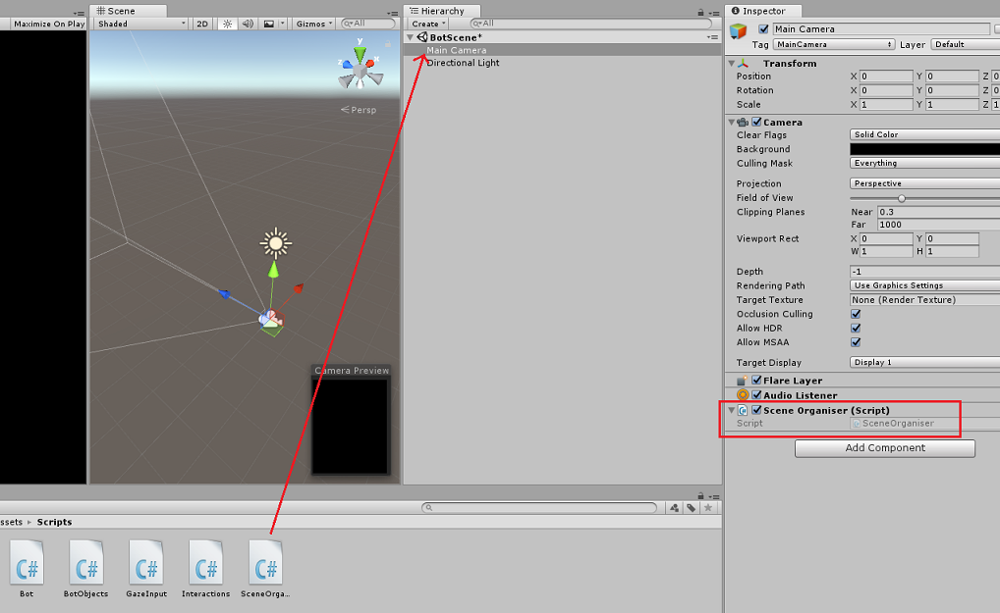

## Chapter 13 – Before building

To perform a thorough test of your application you will need to sideload it onto your HoloLens.
Before you do, ensure that:

-	All the settings mentioned in the [**Chapter 4**](#chapter-4--set-up-the-unity-project) are set correctly. 
-	The script **SceneOrganiser** is attached to the **Main Camera** object. 
-	In the **Bot** class, make sure you have inserted your **Bot Secret Key** into the **botSecret** variable.

## Chapter 14 – Build and Sideload to the HoloLens

Everything needed for the Unity section of this project has now been completed, so it is time to build it from Unity.

1.	Navigate to **Build Settings**, **File > Build Settings…**.
2.	From the **Build Settings** window, click **Build**.

    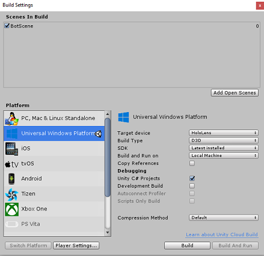

3.	If not already, tick **Unity C# Projects**.
4.	Click **Build**. Unity will launch a **File Explorer** window, where you need to create and then select a folder to build the app into. Create that folder now, and name it **App**. Then with the **App** folder selected, click **Select Folder**. 
5.	Unity will begin building your project to the **App** folder. 
6.	Once Unity has finished building (it might take some time), it will open a **File Explorer** window at the location of your build (check your task bar, as it may not always appear above your windows, but will notify you of the addition of a new window).

## Chapter 15 – Deploy to HoloLens

To deploy on HoloLens:

1.	You will need the IP Address of your HoloLens (for Remote Deploy), and to ensure your HoloLens is in **Developer Mode**. To do this:

    1. Whilst wearing your HoloLens, open the **Settings**.
    2. Go to **Network & Internet > Wi-Fi > Advanced Options**
    3. Note the **IPv4** address.
    4. Next, navigate back to **Settings**, and then to **Update & Security > For Developers** 
    5. Set Developer Mode On.

2.	Navigate to your new Unity build (the **App** folder) and open the solution file with **Visual Studio**.
3.	In the **Solution Configuration** select **Debug**.
4.	In the **Solution Platform**, select **x86**, **Remote Machine**. 

    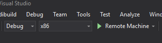
 
5.	Go to the **Build menu** and click on **Deploy Solution**, to sideload the application to your HoloLens.
6.	Your app should now appear in the list of installed apps on your HoloLens, ready to be launched!

    > [!NOTE]
    > To deploy to immersive headset, set the **Solution Platform** to *Local Machine*, and set the **Configuration** to *Debug*, with *x86* as the **Platform**. Then deploy to the local machine, using the **Build menu**, selecting *Deploy Solution*. 

## Chapter 16 – Using the application on the HoloLens

- Once you have launched the application, you will see the Bot as a blue sphere in front of you.

- Use the **Tap Gesture** while you are gazing at the sphere to initiate a conversation. 
 
- Wait for the conversation to start (The UI will display a message when it happens). Once you receive the introductory message from the Bot, tap again on the Bot so it will turn red and begin to listen to your voice. 

- Once you stop talking, your application will send your message to the Bot and you will promptly receive a response that will be displayed in the UI. 

- Repeat the process to send more messages to your Bot (you have to tap each time you want to sen a message).

This conversation demonstrates how the Bot can retain information (your name), whilst also providing known information (such as the items that are stocked).

#### Some questions to ask the Bot:

```
what do you sell? 

how much are umbrellas?

how much are raincoats?
```

## Your finished Web App Bot (v4) application

Congratulations, you built a mixed reality app that leverages the Azure Web App Bot, Microsoft Bot Framework v4.


## Bonus exercises

### Exercise 1

The conversation structure in this Lab is very basic. Use Microsoft LUIS to give your bot natural language understanding capabilities.

### Exercise 2

This example does not include terminating a conversation and restarting a new one. To make the Bot feature complete, try to implement closure to the conversation.