# HoloLens (1st gen) and Azure 313: IoT Hub Service

>[!NOTE]
>The Mixed Reality Academy tutorials were designed with HoloLens (1st gen) and Mixed Reality Immersive Headsets in mind.  As such, we feel it is important to leave these tutorials in place for developers who are still looking for guidance in developing for those devices.  These tutorials will **_not_** be updated with the latest toolsets or interactions being used for HoloLens 2.  They will be maintained to continue working on the supported devices. There will be a new series of tutorials that will be posted in the future that will demonstrate how to develop for HoloLens 2.  This notice will be updated with a link to those tutorials when they are posted.

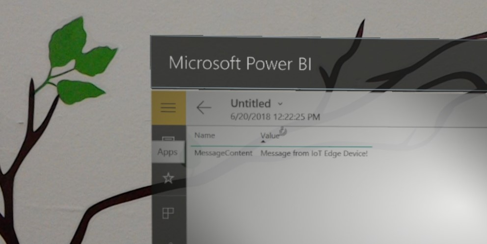

In this course, you will learn how to implement an **Azure IoT Hub Service** on a virtual machine running the Ubuntu 16.4 operating system. An **Azure Function App** will then be used to receive messages from your Ubuntu VM, and store the result within an **Azure Table Service**. You will then be able to view this data using **Power BI** on Microsoft HoloLens or immersive (VR) headset.

The content of this course *is applicable* to IoT Edge devices, though for the purpose of this course, the focus will be on a virtual machine environment, so that access to a physical Edge device is not necessary.

By completing this course, you will learn to:

- Deploy an **IoT Edge module** to a Virtual Machine (Ubuntu 16 OS), which will represent your IoT device.
- Add an **Azure Custom Vision Tensorflow Model** to the Edge module, with code that will analyze images stored in the container.
- Set up the module to send the analysis result message back to your **IoT Hub Service**.
- Use an **Azure Function App** to store the message within an **Azure Table**.
- Set up **Power BI** to collect the stored message and create a report.
- Visualize your IoT message data within **Power BI**.

The Services you will use include:

- **Azure IoT Hub** is a Microsoft Azure Service which allows developers to connect, monitor, and manage, IoT assets. For more information, visit the [**Azure IoT Hub Service** page](https://azure.microsoft.com/services/iot-hub/).

- **Azure Container Registry** is a Microsoft Azure Service which allows developers to store container images, for various types of containers. For more information, visit the [**Azure Container Registry Service** page](https://azure.microsoft.com/services/container-registry/).

- **Azure Function App** is a Microsoft Azure Service, which allows developers to run small pieces of code, 'functions', in Azure. This provides a way to delegate work to the cloud, rather than your local application, which can have many benefits. **Azure Functions** supports several development languages, including C\#, F\#, Node.js, Java, and PHP. For more information, visit the [**Azure Functions** page](/azure/azure-functions/functions-overview).

- **Azure Storage: Tables** is a Microsoft Azure Service, which allows developers to store structured, non-SQL, data in the cloud, making it easily accessible anywhere. The Service boasts a schema-less design, allowing for the evolution of tables as needed, and thus is very flexible. For more information, visit the [**Azure Tables** page](/azure/cosmos-db/table-storage-overview)

This course will teach you how to setup and use the IoT Hub Service, and then visualize a response provided by a device. It will be up to you to apply these concepts to a custom IoT Hub Service setup, which you might be building.

## Device support

<table>
<tr>
<th>Course</th><th> <a href="/hololens/hololens1-hardware">HoloLens</a></th><th> <a href="/windows/mixed-reality/enthusiast-guide/immersive-headset-hardware-details">Immersive headsets</a></th>
</tr><tr>
<td> MR and Azure 313: IoT Hub Service</td><td> ✔️</td><td> ✔️</td>
</tr>
</table>

## Prerequisites

For the most up-to-date prerequisites for developing with Mixed Reality, including with the Microsoft HoloLens, visit the [Install the tools](../../install-the-tools.md) article.

> [!NOTE]
> This tutorial is designed for developers who have basic experience with Python. Please also be aware that the prerequisites and written instructions within this document represent what has been tested and verified at the time of writing (July 2018). You are free to use the latest software, as listed within the [install the tools](../../install-the-tools.md) article, though it should not be assumed that the information in this course will perfectly match what you will find in newer software than that listed below.

The following hardware and software is required:

- Windows 10 Fall Creators Update (or later), **Developer Mode enabled**

    > [!WARNING]
    > You cannot run a Virtual Machine using Hyper-V on Windows 10 Home Edition.

- Windows 10 SDK (latest version)
- A HoloLens, **Developer Mode enabled**
- Visual Studio 2017.15.4 (Only used to access the Azure Cloud Explorer)
- Internet Access for Azure, and for IoT Hub Service. For more information, please follow this [link to IoT Hub Service page](https://azure.microsoft.com/services/iot-hub/)
- A machine learning model. If you do not have your own ready to use model, [you can use the model provided with this course](https://github.com/Microsoft/HolographicAcademy/raw/Azure-MixedReality-Labs/Azure%20Mixed%20Reality%20Labs/MR%20and%20Azure%20313%20-%20IoT%20Hub%20Service/Custom%20Vision%20Model.zip).
- **Hyper-V** software enabled on your Windows 10 development machine.
- A Virtual Machine running Ubuntu (16.4 or 18.4), running on your development machine or alternatively you can use a separate computer running Linux (Ubuntu 16.4 or 18.4). You can find more information on how to create a VM on Windows using Hyper-V in the ["Before you Start" chapter](#before-you-start).(https://docs.microsoft.com/virtualization/hyper-v-on-windows/quick-start/quick-create-virtual-machine).  


### Before you start

1. Set up and test your HoloLens. If you need support setting up your HoloLens, [make sure to visit the HoloLens setup article](/hololens/hololens-setup).
2. It is a good idea to perform **Calibration** and **Sensor Tuning** when beginning developing a new HoloLens app (sometimes it can help to perform those tasks for each user).

For help on Calibration, please follow this [link to the HoloLens Calibration article](/hololens/hololens-calibration#hololens-2).

For help on Sensor Tuning, please follow this [link to the HoloLens Sensor Tuning article](/hololens/hololens-updates).

3. Set up your **Ubuntu Virtual Machine** using **Hyper-V**. The following resources will help you with the process.
    1.  First, follow this link to [download the Ubuntu 16.04.4 LTS (Xenial Xerus) ISO](https://au.releases.ubuntu.com/16.04/). Select the **64-bit PC (AMD64) desktop image**.
    2.  Make sure **Hyper-V** is enabled on your Windows 10 machine. You can follow this link for guidance on [installing and enabling Hyper-V on Windows 10](/virtualization/hyper-v-on-windows/quick-start/enable-hyper-v).
    3.  Start Hyper-V and create a new Ubuntu VM. You can follow this link for a [step by step guide on how to create a VM with Hyper-V](/virtualization/hyper-v-on-windows/quick-start/create-virtual-machine). When requested to **"Install an operating system from a bootable image file"**, select the **Ubuntu ISO** you have download earlier.

    > [!NOTE]
    > Using **Hyper-V Quick Create** is not suggested.  

## Chapter 1 - Retrieve the Custom Vision model

With this course you will have access to a [pre-built Custom Vision model](https://github.com/Microsoft/HolographicAcademy/raw/Azure-MixedReality-Labs/Azure%20Mixed%20Reality%20Labs/MR%20and%20Azure%20313%20-%20IoT%20Hub%20Service/Custom%20Vision%20Model.zip) that detects keyboards and mice from images. If you use this, proceed to [Chapter 2](#chapter-2---the-container-registry-service).

However, you can follow these steps if you wish to use your own Custom Vision model:

1. In your **Custom Vision Project** go to the **Performance** tab.

    > [!WARNING]
    > Your model must use a *compact* domain, to export the model. You can change your models domain in the settings for your project.

    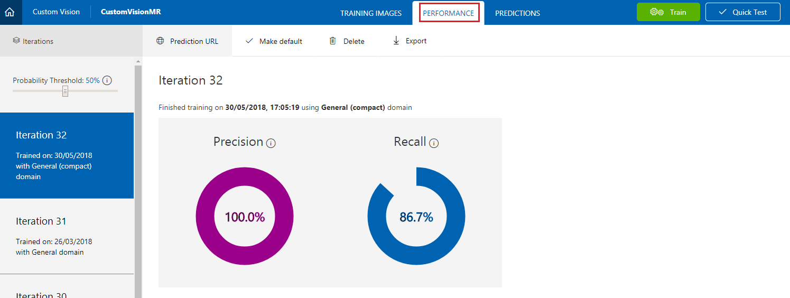

2. Select the **Iteration** you want to export and click on **Export**. A blade will appear.

    

3. In the blade click **Docker File**.

    

4. Click **Linux** in the drop-down menu and then click on **Download**.

    

5. Unzip the content. You will use it later in this course.

## Chapter 2 - The Container Registry Service

The **Container Registry Service** is the repository used to host your containers.

The **IoT Hub Service** that you will build and use in this course, refers to **Container Registry Service** to obtain the containers to deploy in your Edge Device.

1. First, follow this [link to the Azure Portal](https://portal.azure.com/), and login with your credentials.

2. Go to **Create a resource** and look for **Container Registry**.

    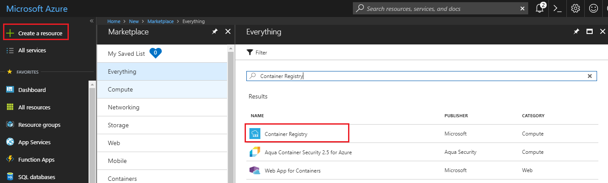

3. Click on **Create**.

    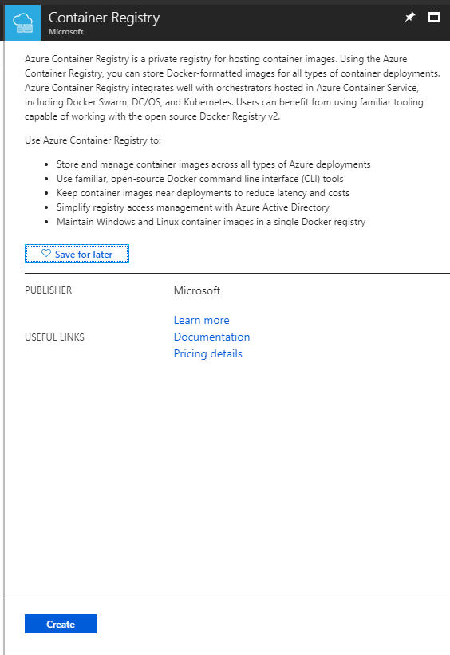

4. Set the Service setup parameters:

    1. Insert a name for your project, In this example its called **IoTCRegistry**.

    2. Choose a **Resource Group** or create a new one. A resource group provides a way to monitor, control access, provision, and manage, billing for a collection of Azure assets. It is recommended to keep all the Azure Services associated with a single project (e.g. such as these courses) under a common resource group).

    3. Set the location of the Service.

    4. Set **Admin user** to **Enable**.

    5. Set **SKU** to **Basic**. 

    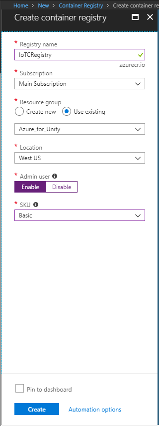

5. Click **Create** and wait for the Services to be created. 

6. Once the notification pops up informing you of the successful creation of the *Container Registry*, click on **Go to resource** to be redirected to your Service page.

    

7. In the *Container Registry* Service page, click on **Access keys**.

8. Take note (you could use your Notepad) of the following parameters:
    1. **Login Server**
    2. **Username**
    3. **Password**

    

## Chapter 3 - The IoT Hub Service

Now you will begin the creation and setup of your **IoT Hub Service**.

1. If not already signed in, log into the [Azure Portal](https://portal.azure.com).

2.  Once logged in, click on **Create a resource** in the top left corner, and search for **IoT Hub**, and click **Enter**.

 

3.  The new page will provide a description of the **Storage account** Service. At the bottom left of this prompt, click the **Create** button, to create an instance of this Service.

    

4.  Once you have clicked on **Create**, a panel will appear:

    1. Choose a **Resource Group** or create a new one. A resource group provides a way to monitor, control access, provision and manage billing for a collection of Azure assets. It is recommended to keep all the Azure Services associated with a single project (e.g. such as these courses) under a common resource group).

        > If you wish to read more about Azure Resource Groups, please follow this [link on how to manage a Resource Group](/azure/azure-resource-manager/resource-group-portal).


    2. Select an appropriate **Location** (Use the same location across all the Services you create in this course).

    3. Insert your desired **Name** for this Service instance.    

5.  On the bottom of the page click on **Next: Size and scale**.

    

6.  In this page, select your **Pricing and scale tier** (if this is your first IoT Hub Service instance, a free tier should be available to you).  

7.  Click on **Review + Create**.

    

8.  Review your settings and click on **Create**.

    

9. Once the notification pops up informing you of the successful creation of the *IoT Hub* Service, click on **Go to resource** to be redirected to your Service page.

    

10. Scroll the side panel on the left until you see *Automatic Device Management*, the click on **IoT Edge**.

    

11. In the window that appears to the right, click on **Add IoT Edge Device**. A blade will appear to the right.

12. In the blade, provide your new device a **Device ID** (a name of your choice). Then, click **Save**. The *Primary* and *Secondary Keys* will auto generate, if you have **Auto Generate** ticked.

    

13. You will navigate back to the *IoT Edge Devices* section, where your new device will be listed. Click on your new device (outlined in red in the below image). 

    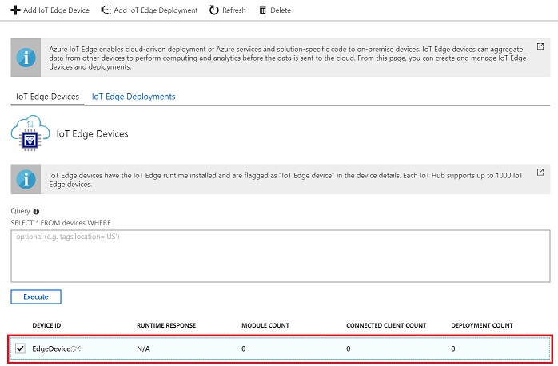

14. On the *Device Details* page that appears, take a copy of the **Connection String** (primary key).

    

15. Go back to the panel on the left, and click *Shared access policies*, to open it. 

16. On the page that appears, click **iothubowner**, and a blade will appear to the right of the screen. 

17. Take note (on your Notepad) of the **Connection string** (primary key), for later use when setting the *Connection String* to your device.

    

## Chapter 4 - Setting up the development environment

In order to create and deploy modules for *IoT Hub Edge*, you will require the following components installed on your development machine running Windows 10:

1.  [Docker for Windows](https://store.docker.com/editions/community/docker-ce-desktop-windows), it will ask you to create an account to be able to download. 

    [](https://store.docker.com/editions/community/docker-ce-desktop-windows)

    > [!IMPORTANT]
    > Docker requires *Windows 10 PRO*, *Enterprise 14393*, or *Windows Server 2016 RTM*, to run. If you are running other versions of Windows 10, you can try installing Docker using the [Docker Toolbox](https://docs.docker.com/toolbox/toolbox_install_windows/).

2.  [Python 3.6](https://www.python.org/downloads/).

    [](https://www.python.org/downloads/)

3.  [Visual Studio Code (also known as VS Code)](https://code.visualstudio.com/download).

    [](https://code.visualstudio.com/download)

After installing the software mentioned above, you will need to restart your machine.

## Chapter 5 - Setting up the Ubuntu environment

Now you can move on to setting up your device **running Ubuntu OS**. Follow the steps below, to install the necessary software, to deploy your containers on your board:

> [!IMPORTANT]
> You should always precede the terminal commands with **sudo** to run as admin user. i.e:
> 
>   ```bash
>   sudo docker \<option> \<command> \<argument>
>   ```

1.  Open the **Ubuntu Terminal**, and use the following command to install **pip**:

    > [!HINT]
    > You can open *Terminal* very easily through using the keyboard shortcut: **Ctrl + Alt + T**.

    ```bash
        sudo apt-get install python-pip
    ```

2.  Throughout this Chapter, you may be prompted, by *Terminal*, for permission to use your device storage, and for you to input **y/n** (yes or no), type **'y'**, and then press the **Enter** key, to accept.

3.  Once that command has completed, use the following command to install **curl**:

    ```bash
        sudo apt install curl
    ```

4.  Once **pip** and **curl** are installed, use the following command to install the **IoT Edge runtime**, this is necessary to deploy and control the modules on your board:

    ```bash
        curl https://packages.microsoft.com/config/ubuntu/16.04/prod.list > ./microsoft-prod.list

        sudo cp ./microsoft-prod.list /etc/apt/sources.list.d/

        curl https://packages.microsoft.com/keys/microsoft.asc | gpg --dearmor > microsoft.gpg

        sudo cp ./microsoft.gpg /etc/apt/trusted.gpg.d/

        sudo apt-get update

        sudo apt-get install moby-engine

        sudo apt-get install moby-cli

        sudo apt-get update

        sudo apt-get install iotedge
    ```

5. At this point you will be prompted to open up the *runtime config file*, to insert the **Device Connection String**, that you noted down (in your Notepad), when creating the **IoT Hub Service** ([at step 14, of Chapter 3](#chapter-3---the-iot-hub-service)). Run the following line on the terminal to open that file:

    ```bash
        sudo nano /etc/iotedge/config.yaml
    ```

6. The **config.yaml** file will be displayed, ready for you to edit:

    > [!WARNING]
    > When this file opens, it may be somewhat confusing. You will be text editing this file, within the *Terminal* itself. 

    1.  Use the arrow keys on your keyboard to scroll down (you will need to scroll down a little way), to reach the line containing":

        "**\<ADD DEVICE CONNECTION STRING HERE>**".

    2. Substitute line, **including the brackets**, with the **Device Connection String** you have noted earlier.

7. With your Connection String in place, on your keyboard, press the **Ctrl-X** keys to save the file. It will ask you to confirm by typing **Y**. Then, press the **Enter** key, to confirm. You will go back to the regular *Terminal*. 

8. Once these commands have all run successfully, you will have installed the **IoT Edge Runtime**. Once initialized, the runtime will start on its own every time the device is powered up, and will sit in the background, waiting for modules to be deployed from the **IoT Hub Service**.

9.  Run the following command line to initialize the *IoT Edge Runtime*:

    ```bash
        sudo systemctl restart iotedge
    ```

    > [!IMPORTANT]
    > If you make changes to your .yaml file, or the above setup, you will need to run the above restart line again, within *Terminal*.

10. Check the *IoT Edge Runtime* status by running the following command line. The runtime should appear with the status **active (running)** in green text.

    ```bash
        sudo systemctl status iotedge
    ```

11. Press the **Ctrl-C** keys, to exit the status page. You can verify that the *IoT Edge Runtime* is pulling the containers correctly by typing the following command:

    ```bash
        sudo docker ps
    ```

12. A list with two (2) containers should appear. These are the default modules that are automatically created by the IoT Hub Service (edgeAgent and edgeHub). Once you create and deploy your own modules, they will appear in this list, underneath the default ones.

## Chapter 6 - Install the extensions

> [!IMPORTANT]
> The next few Chapters (6-9) are to be performed on your Windows 10 machine.

1. Open **VS Code**.

2. Click on the **Extensions** (square) button on the left bar of VS Code, to open the **Extensions panel**.

3. Search for, and install, the following extensions (as shown in the image below):

    1. Azure IoT Edge
    2. Azure IoT Toolkit
    3. Docker   

    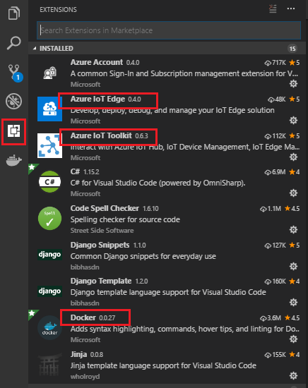

4. Once the extensions are installed, close and re-open VS Code.

5. With VS Code open once more, navigate to **View** > **Integrated terminal**.

6. You will now install **Cookiecutter**. In the terminal run the following bash command:

    ```bash
        pip install --upgrade --user cookiecutter
    ```

    > [!HINT]
    > If you have trouble with this command: 
    >1. Restart VS Code, and/ or your computer.
    >2. It might be necessary to switch the **VS Code Terminal** to the one you have been using to install Python, i.e. **Powershell** (especially in case the Python environment was already installed on your machine). With the Terminal open, you will find the drop down menu on the right side of the Terminal.
      
    >3. Make sure the **Python** installation path is added as **Environment Variable** on your machine. Cookiecutter should be part of the same location path. Please follow this [link for more information on Environment Variables](/windows/win32/procthread/environment-variables), 

7. Once **Cookiecutter** has finished installing, you should restart your machine, so that **Cookiecutter** is recognized as a command, within your System's environment.

## Chapter 7 - Create your container solution

At this point, you need to create the container, with the module, to be pushed into the *Container Registry*. Once you have pushed your container, you will use the *IoT Hub Edge* Service to deploy it to your device, which is running the *IoT Edge runtime*.

1. From VS Code, click **View** > **Command palette**.

2. In the palette, search and run **Azure IoT Edge: New Iot Edge Solution**.

3. Browse into a location where you want to create your solution. Press the **Enter** key, to accept the location.

4. Give a name to your solution. Press the **Enter** key, to confirm your provided name.

5. Now you will be prompted to choose the template framework for your solution. Click **Python Module**. Press the **Enter** key, to confirm this choice.

6. Give a name to your module. Press the **Enter** key, to confirm the name of your module. Make sure to take a note (with your Notepad) of the module name, as it is used later.

7. You will notice a pre-built *Docker Image Repository* address will appear on the palette. It will look like:

    **localhost:5000/-THE NAME OF YOUR MODULE-**. 

8. Delete **localhost:5000**, and in its place insert the *Container Registry* **Login Server** address, which you noted when creating the **Container Registry Service** ([in step 8, of Chapter 2](#chapter-2---the-container-registry-service)). Press the **Enter** key, to confirm the address.

9. At this point, the solution containing the template for your Python module will be created and its structure will be displayed in the **Explore Tab**, of VS Code, on the left side of the screen. If the **Explore Tab** is not open, you can open it by clicking the top-most button, in the bar on the left.

    

10. The last step for this Chapter, is to click and open the **.env file**, from within the **Explore Tab**, and add your *Container Registry* **username** and **password**. This file is ignored by git, but on building the container, will set the credentials to access the **Container Registry Service**.

    

## Chapter 8 - Editing your container solution

You will now complete the container solution, by updating the following files:

- *main<span></span>.py* python script.
- *requirements.txt*.
- *deployment.template.json*.
- *Dockerfile.amd64*

You will then create the *images* folder, used by the python script to check for images to match against your *Custom Vision model*. Lastly, you will add the *labels.txt* file, to help read your model, and the *model.pb* file, which is your model.

1. With VS Code open, navigate to your module folder, and look for the script called **main<span></span>.py**. Double-click to open it.

2. Delete the content of the file and insert the following code:

    ```python
    # Copyright (c) Microsoft. All rights reserved.
    # Licensed under the MIT license. See LICENSE file in the project root for
    # full license information.

    import random
    import sched, time
    import sys
    import iothub_client
    from iothub_client import IoTHubModuleClient, IoTHubClientError, IoTHubTransportProvider
    from iothub_client import IoTHubMessage, IoTHubMessageDispositionResult, IoTHubError
    import json
    import os
    import tensorflow as tf
    import os
    from PIL import Image
    import numpy as np
    import cv2

    # messageTimeout - the maximum time in milliseconds until a message times out.
    # The timeout period starts at IoTHubModuleClient.send_event_async.
    # By default, messages do not expire.
    MESSAGE_TIMEOUT = 10000

    # global counters
    RECEIVE_CALLBACKS = 0
    SEND_CALLBACKS = 0

    TEMPERATURE_THRESHOLD = 25
    TWIN_CALLBACKS = 0

    # Choose HTTP, AMQP or MQTT as transport protocol.  Currently only MQTT is supported.
    PROTOCOL = IoTHubTransportProvider.MQTT


    # Callback received when the message that we're forwarding is processed.
    def send_confirmation_callback(message, result, user_context):
        global SEND_CALLBACKS
        print ( "Confirmation[%d] received for message with result = %s" % (user_context, result) )
        map_properties = message.properties()
        key_value_pair = map_properties.get_internals()
        print ( "    Properties: %s" % key_value_pair )
        SEND_CALLBACKS += 1
        print ( "    Total calls confirmed: %d" % SEND_CALLBACKS )


    def convert_to_opencv(image):
        # RGB -> BGR conversion is performed as well.
        r,g,b = np.array(image).T
        opencv_image = np.array([b,g,r]).transpose()
        return opencv_image

    def crop_center(img,cropx,cropy):
        h, w = img.shape[:2]
        startx = w//2-(cropx//2)
        starty = h//2-(cropy//2)
        return img[starty:starty+cropy, startx:startx+cropx]

    def resize_down_to_1600_max_dim(image):
        h, w = image.shape[:2]
        if (h < 1600 and w < 1600):
            return image

        new_size = (1600 * w // h, 1600) if (h > w) else (1600, 1600 * h // w)
        return cv2.resize(image, new_size, interpolation = cv2.INTER_LINEAR)

    def resize_to_256_square(image):
        h, w = image.shape[:2]
        return cv2.resize(image, (256, 256), interpolation = cv2.INTER_LINEAR)

    def update_orientation(image):
        exif_orientation_tag = 0x0112
        if hasattr(image, '_getexif'):
            exif = image._getexif()
            if (exif != None and exif_orientation_tag in exif):
                orientation = exif.get(exif_orientation_tag, 1)
                # orientation is 1 based, shift to zero based and flip/transpose based on 0-based values
                orientation -= 1
                if orientation >= 4:
                    image = image.transpose(Image.TRANSPOSE)
                if orientation == 2 or orientation == 3 or orientation == 6 or orientation == 7:
                    image = image.transpose(Image.FLIP_TOP_BOTTOM)
                if orientation == 1 or orientation == 2 or orientation == 5 or orientation == 6:
                    image = image.transpose(Image.FLIP_LEFT_RIGHT)
        return image


    def analyse(hubManager):

        messages_sent = 0;

        while True:
            #def send_message():
            print ("Load the model into the project")
            # These names are part of the model and cannot be changed.
            output_layer = 'loss:0'
            input_node = 'Placeholder:0'

            graph_def = tf.GraphDef()
            labels = []

            labels_filename = "labels.txt"
            filename = "model.pb"

            # Import the TF graph
            with tf.gfile.FastGFile(filename, 'rb') as f:
                graph_def.ParseFromString(f.read())
                tf.import_graph_def(graph_def, name='')

            # Create a list of labels
            with open(labels_filename, 'rt') as lf:
                for l in lf:
                    labels.append(l.strip())
            print ("Model loaded into the project")

            results_dic = dict()

            # create the JSON to be sent as a message
            json_message = ''

            # Iterate through images 
            print ("List of images to analyse:")
            for file in os.listdir('images'):
                print(file)

                image = Image.open("images/" + file)

                # Update orientation based on EXIF tags, if the file has orientation info.
                image = update_orientation(image)

                # Convert to OpenCV format
                image = convert_to_opencv(image)

                # If the image has either w or h greater than 1600 we resize it down respecting
                # aspect ratio such that the largest dimension is 1600
                image = resize_down_to_1600_max_dim(image)

                # We next get the largest center square
                h, w = image.shape[:2]
                min_dim = min(w,h)
                max_square_image = crop_center(image, min_dim, min_dim)

                # Resize that square down to 256x256
                augmented_image = resize_to_256_square(max_square_image)

                # The compact models have a network size of 227x227, the model requires this size.
                network_input_size = 227

                # Crop the center for the specified network_input_Size
                augmented_image = crop_center(augmented_image, network_input_size, network_input_size)

                try:
                    with tf.Session() as sess:     
                        prob_tensor = sess.graph.get_tensor_by_name(output_layer)
                        predictions, = sess.run(prob_tensor, {input_node: [augmented_image] })
                except Exception as identifier:
                    print ("Identifier error: ", identifier)

                print ("Print the highest probability label")
                highest_probability_index = np.argmax(predictions)
                print('FINAL RESULT! Classified as: ' + labels[highest_probability_index])

                l = labels[highest_probability_index]

                results_dic[file] = l

                # Or you can print out all of the results mapping labels to probabilities.
                label_index = 0
                for p in predictions:
                    truncated_probablity = np.float64(round(p,8))
                    print (labels[label_index], truncated_probablity)
                    label_index += 1

            print("Results dictionary")
            print(results_dic)

            json_message = json.dumps(results_dic)
            print("Json result")
            print(json_message)

            # Initialize a new message
            message = IoTHubMessage(bytearray(json_message, 'utf8'))
        
            hubManager.send_event_to_output("output1", message, 0)

            messages_sent += 1
            print("Message sent! - Total: " + str(messages_sent))      
            print('----------------------------')
            
            # This is the wait time before repeating the analysis
            # Currently set to 10 seconds
            time.sleep(10)


    class HubManager(object):
        
        def __init__(
                self,
                protocol=IoTHubTransportProvider.MQTT):
            self.client_protocol = protocol
            self.client = IoTHubModuleClient()
            self.client.create_from_environment(protocol)

            # set the time until a message times out
            self.client.set_option("messageTimeout", MESSAGE_TIMEOUT)

        # Forwards the message received onto the next stage in the process.
        def forward_event_to_output(self, outputQueueName, event, send_context):
            self.client.send_event_async(
                outputQueueName, event, send_confirmation_callback, send_context)

        def send_event_to_output(self, outputQueueName, event, send_context):
            self.client.send_event_async(outputQueueName, event, send_confirmation_callback, send_context)

    def main(protocol):
        try:
            hub_manager = HubManager(protocol)
            analyse(hub_manager)
            while True:
                time.sleep(1)

        except IoTHubError as iothub_error:
            print ( "Unexpected error %s from IoTHub" % iothub_error )
            return
        except KeyboardInterrupt:
            print ( "IoTHubModuleClient sample stopped" )

    if __name__ == '__main__':
        main(PROTOCOL)
    ```

3.  Open the file called **requirements.txt**, and substitute its content with the following:

    ```
    azure-iothub-device-client==1.4.0.0b3
    opencv-python==3.3.1.11
    tensorflow==1.8.0
    pillow==5.1.0
    ```

4.  Open the file called **deployment.template.json**, and substitute its content following the below guideline:

    1. Because you will have your own, unique, JSON structure, you will need to edit it by hand (rather than copying an example). To make this easy, use the below image as a guide.
    2. Areas which will look different to yours, but which you **should NOT change are highlighted yellow**.
    3. **Sections which you need to delete, are a highlighted red.**
    4. Be careful to delete the correct brackets, and also remove the commas.

        

    5. The completed JSON should look like the following image (though, with your unique differences: *username/password/module name/module references*):

        

5.  Open the file called **Dockerfile.amd64**, and substitute its content with the following:

    ```
    FROM ubuntu:xenial

    WORKDIR /app

    RUN apt-get update && \
        apt-get install -y --no-install-recommends libcurl4-openssl-dev python-pip libboost-python-dev && \
        rm -rf /var/lib/apt/lists/* 
    RUN pip install --upgrade pip
    RUN pip install setuptools

    COPY requirements.txt ./
    RUN pip install -r requirements.txt

    RUN pip install pillow
    RUN pip install numpy

    RUN apt-get update && apt-get install -y \ 
        pkg-config \
        python-dev \ 
        python-opencv \ 
        libopencv-dev \ 
        libav-tools  \ 
        libjpeg-dev \ 
        libpng-dev \ 
        libtiff-dev \ 
        libjasper-dev \ 
        python-numpy \ 
        python-pycurl \ 
        python-opencv


    RUN pip install opencv-python
    RUN pip install tensorflow
    RUN pip install --upgrade tensorflow

    COPY . .

    RUN useradd -ms /bin/bash moduleuser
    USER moduleuser

    CMD [ "python", "-u", "./main.py" ]

    ```

6.  Right-click on the folder beneath **modules** (it will have the name you provided previously; in the example further down, it is called *pythonmodule*), and click on **New Folder**. Name the folder **images**.

7.  Inside the folder, add some images containing mouse or keyboard. Those will be the images that will be analyzed by the Tensorflow model.

    > [!WARNING]
    > If you are using your own model, you will need to change this to reflect your own models data.

8.  You will now need to retrieve the **labels.txt** and **model.pb** files from the model folder, which you previously downloaded (or created from your own **Custom Vision Service**), in [Chapter 1](#chapter-1---retrieve-the-custom-vision-model). Once you have the files, place them within your solution, alongside the other files. The final result should look like the image below:

    

## Chapter 9 - Package the solution as a container

1.  You are now ready to "package" your files as a container and push it to your **Azure Container Registry**. Within VS Code, open the *Integrated Terminal* (**View** > **Integrated Terminal** or **Ctrl**+**\`**), and use the following line to login to **Docker** (substitute the values of the command with the credentials of your **Azure Container Registry (ACR)**):

    ```bash
        docker login -u <ACR username> -p <ACR password> <ACR login server>
    ```

2. Right-click on the file **deployment.template.json**, and click **Build IoT Edge Solution**. This build process takes quite some time (depending on your device), so be prepared to wait. After the build process finishes, a **deployment.json** file will have been created inside a new folder called **config**.

    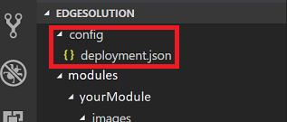

3. Open the **Command Palette** again, and search for **Azure: Sign In**. Follow the prompts using your Azure Account credentials; VS Code will provide you with an option to *Copy and Open*, which will copy the device code you will soon need, and open your default web browser. When asked, paste the device code, to authenticate your machine.

    

4. Once signed in you will notice, on the bottom side of the *Explore* panel, a new section called **Azure IoT Hub Devices**. Click this section to expand it.

    

5. If your device is not here, you will need to right-click *Azure IoT Hub Devices*, and then click **Set IoT Hub Connection String**. You will then see that the **Command Palette** (at the top of VS Code), will prompt you to input your *Connection String*. This is the *Connection String* you noted down at the end of [Chapter 3](#chapter-3---the-iot-hub-service). Press the **Enter** key, once you have copied the string in.    

6. Your device should load, and appear. Right-click on the device name, and then click, **Create Deployment for Single Device**.

    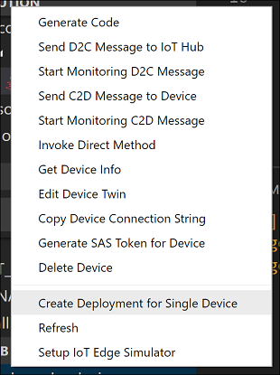

7. You will get a *File Explorer* prompt, where you can navigate to the **config** folder, and then select the **deployment.json** file. With that file selected, click the **Select Edge Deployment Manifest** button.

    

8. At this point you have provided your **IoT Hub Service** with the manifest for it to deploy your container, as a module, from your **Azure Container Registry**, effectively deploying it to your device.

9. To view the messages sent from your device to the IoT Hub, right-click again on your device name in the **Azure IoT Hub Devices** section, in the **Explorer** panel, and click on **Start Monitoring D2C Message**. The messages sent from your device should appear in the VS Terminal. Be patient, as this may take some time. See the next Chapter for debugging, and checking if deployment was successful.

This module will now iterate between the images in the **images** folder and analyze them, with each iteration. This is obviously just a demonstration of how to get the basic machine learning model to work in an IoT Edge device environment. 

To expand the functionality of this example, you could proceed in several ways. One way could be including some code in the container, that captures photos from a webcam that is connected to the device, and saves the images in the images folder. 

Another way could be copying the images from the IoT device into the container. A practical way to do that is to run the following command in the IoT device Terminal (perhaps a small app could do the job, if you wished to automate the process). You can test this command by running it manually from the folder location where your files are stored:

```bash
    sudo docker cp <filename> <modulename>:/app/images/<a name of your choice>
```

## Chapter 10 - Debugging the IoT Edge Runtime

The following are a list of command lines, and tips, to help you monitor and debug the messaging activity of the *IoT Edge Runtime*, from your **Ubuntu device**. 

- Check the *IoT Edge Runtime* status by running the following command line:

    ```bash
        sudo systemctl status iotedge
    ```

    > [!NOTE]
    > Remember to press **Ctrl + C**, to finish viewing the status.

- List the containers that are currently deployed. If the *IoT Hub Service* has deployed the containers successfully, they will be displayed by running the following command line:

    ```bash
        sudo iotedge list
    ```

    Or

    ```bash
        sudo docker ps
    ```

    > [!NOTE]
    > The above is a good way to check whether your module has been deployed successfully, as it will appear in the list; you will otherwise **only** see the *edgeHub* and *edgeAgent*.

- To display the code logs of a container, run the following command line:

    ```bash
        journalctl -u iotedge
    ```

**Useful commands to manage the IoT Edge Runtime:**

-  To delete all containers in the host:

    ```bash
        sudo docker rm -f $(sudo docker ps -aq)
    ```

-  To stop the *IoT Edge Runtime*:

    ```bash
        sudo systemctl stop iotedge
    ```

## Chapter 11 - Create Table Service 

Navigate back to your Azure Portal, where you will create an Azure Tables Service, by creating a Storage resource.

1. If not already signed in, log into the [Azure Portal](https://portal.azure.com).

2. Once logged in, click on **Create a resource**, in the top left corner, and search for **Storage account**, and press the **Enter** key, to start the search.

3. Once it has appeared, click **Storage account - blob, file, table, queue** from the list.

    

4. The new page will provide a description of the **Storage account** Service. At the bottom left of this prompt, click the **Create** button, to create an instance of this Service.

    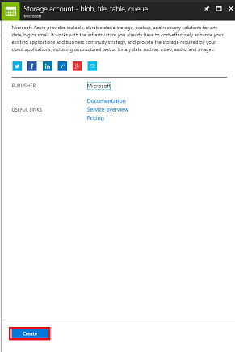

5. Once you have clicked on **Create**, a panel will appear:

    1. Insert your desired **Name** for this Service instance (*must be all lowercase*).

    2. For **Deployment model**, click **Resource manager**.

    3. For **Account kind**, using the dropdown menu, click **Storage (general purpose v1)**.

    4. Click an appropriate **Location**.
    
    5. For the **Replication** dropdown menu, click **Read-access-geo-redundant storage (RA-GRS)**.

    6. For **Performance**, click **Standard**.

    7. Within the **Secure transfer required** section, click **Disabled**.

    8. From the **Subscription** dropdown menu, click an appropriate subscription.

    9. Choose a **Resource Group** or create a new one. A resource group provides a way to monitor, control access, provision, and manage, billing for a collection of Azure assets. It is recommended to keep all the Azure Services associated with a single project (e.g. such as these courses) under a common resource group).

        > If you wish to read more about Azure Resource Groups, please follow this [link on how to manage a Resource Group](/azure/azure-resource-manager/resource-group-portal).

    10. Leave **Virtual networks** as **Disabled**, if this is an option for you.

    11. Click **Create**.

        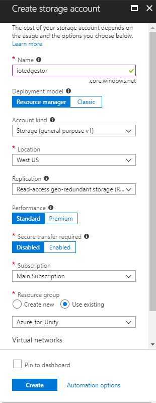

6. Once you have clicked on **Create**, you will have to wait for the Service to be created, this might take a minute.

7. A notification will appear in the Portal once the Service instance is created. Click on the notifications to explore your new Service instance.

    

8. Click the **Go to resource** button in the notification, and you will be taken to your new Storage Service instance overview page.

    

9. From the overview page, to the right-hand side, click **Tables**.
    
    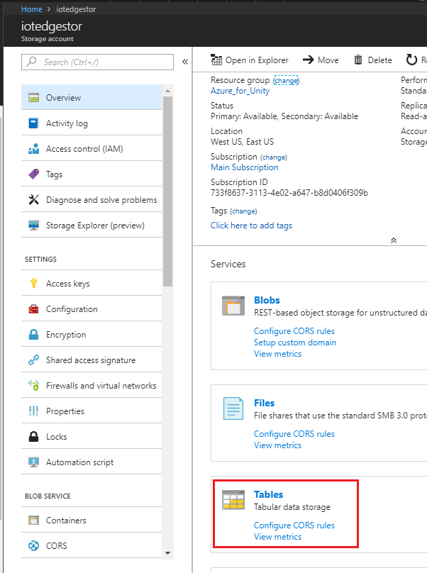

10. The panel on the right will change to show the **Table Service** information, wherein you need to add a new table. Do this by clicking the **+ Table** button to the top-left corner.

    

11. A new page will be shown, wherein you need to enter a **Table name**. This is the name you will use to refer to the data in your application in later Chapters (creating Function App, and Power BI). Insert **IoTMessages** as the name (you can choose your own, just remember it when used later in this document) and click **OK**. 

12. Once the new table has been created, you will be able to see it within the **Table Service** page (at the bottom).

    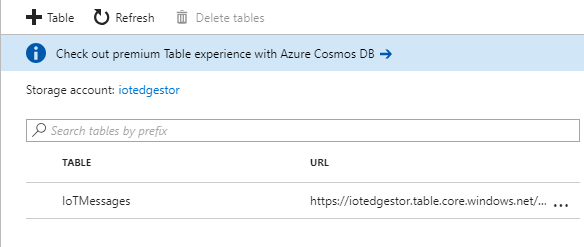  

13. Now click on **Access keys** and take a copy of the **Storage account name** and **Key** (using your Notepad), you will use these values later in this course, when creating the **Azure Function App**.

     

14. Using the panel on the left again, scroll to the *Table Service* section, and click **Tables** (or **Browse Tables**, in newer Portals) and take a copy of the **Table URL** (using your Notepad). You will use this value later in this course, when linking your table to your **Power BI** application.

    

## Chapter 12 - Completing the Azure Table

Now that your **Table Service** storage account has been setup, it is time to add data to it, which will be used to store and retrieve information. The editing of your Tables can be done through **Visual Studio**.

1. Open **Visual Studio** (**not** Visual Studio Code).

2. From the menu, click **View** > **Cloud Explorer**.

    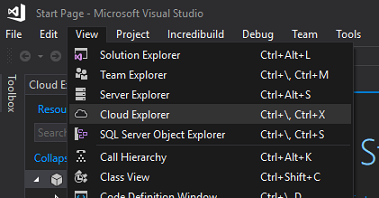

3. The **Cloud Explorer** will open as a docked item (be patient, as loading may take time).

    > [!WARNING] 
    > If the subscription you used to create your *Storage Accounts* is not visible, ensure that you have: 
    > - Logged in to the same account as the one you used for the Azure Portal.
    > - Selected your subscription from the Account Management page (you may need to apply a filter from your account settings):  
    >
    >   

4. Your Azure cloud Services will be shown. Find **Storage Accounts** and click the arrow to the left of that to expand your accounts.

    

5. Once expanded, your newly created **Storage account** should be available. Click the arrow to the left of your storage, and then once that is expanded, find **Tables** and click the arrow next to that, to reveal the **Table** you created in the last Chapter. Double-click your **Table**.

6. Your table will be opened in the center of your Visual Studio window. Click the table icon with the **+** (plus) on it.

    

7. A window will appear prompting for you to *Add Entity*. You will create only one entity, though it will have three properties. You will notice that *PartitionKey* and *RowKey* are already provided, as these are used by the table to find your data. 

    

8. Update the following values:

    - Name: **PartitionKey**, Value: **PK_IoTMessages** 

    - Name: **RowKey**, Value: **RK_1_IoTMessages** 

9. Then, click **Add property** (to the lower left of the *Add Entity* window) and add the following property:

    - **MessageContent**, as a *string*, leave the Value empty.

10. Your table should match the one in the image below:

    

    > [!NOTE] 
    > The reason why the entity has the number 1 in the row key, is because you might want to add more messages, should you desire to experiment further with this course.

11. Click **OK** when you are finished. Your table is now ready to be used.

## Chapter 13 - Create an Azure Function App 

It is now time to create an *Azure Function App*, which will be called by the *IoT Hub Service* to store the *IoT Edge* device messages in the **Table** Service, which you created in the previous Chapter.

First, you need to create a file that will allow your Azure Function to load the libraries you need.

1.  Open **Notepad** (press the *Windows Key*, and type *notepad*).

    

2.  With Notepad open, insert the JSON structure below into it. Once you
    have done that, save it on your desktop as **project.json**. This file defines the libraries your function will use. If you have used NuGet, it will look familiar.
    
    > [!WARNING]
    > It is important that the naming is correct; ensure it does **NOT have a .txt** file extension. See below for reference:
    >
    > 

    ```json
    {
    "frameworks": {
        "net46":{
        "dependencies": {
            "WindowsAzure.Storage": "9.2.0"
        }
        }
    }
    }
    ```

3.  Log in to the [Azure Portal](https://portal.azure.com).

4.  Once you are logged in, click on **Create a resource** in the top left corner, and search for **Function App**, and press the **Enter** key, to search. Click *Function App* from the results, to open a new panel.

    

5.  The new panel will provide a description of the **Function App** Service. At the bottom left of this panel, click the **Create** button, to create an association with this Service.

    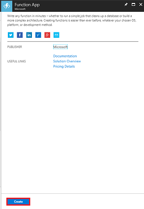

6.  Once you have clicked on **Create**, fill in the following:

    1. For **App name**, insert your desired name for this Service instance.

    2. Select a **Subscription**.

    3. Select the pricing tier appropriate for you, if this is the first time creating a **Function App Service**, a free tier should be available to you.

    4. Choose a **Resource Group** or create a new one. A resource group provides a way to monitor, control access, provision, and manage, billing for a collection of Azure assets. It is recommended to keep all the Azure Services associated with a single project (e.g. such as these courses) under a common resource group).

        > If you wish to read more about Azure Resource Groups, please follow this [link on how to manage a Resource Group](/azure/azure-resource-manager/resource-group-portal).

    5. For **OS**, click Windows, as that is the intended platform.

    6. Select a **Hosting Plan** (this tutorial is using a **Consumption Plan**.

    7. Select a **Location** (choose the same location as the storage you have built in the previous step)

    8. For the **Storage** section, **you must select the Storage Service you created in the previous step**.

    9. You will not need *Application Insights* in this app, so feel free to leave it **Off**.

    10. Click **Create**.

        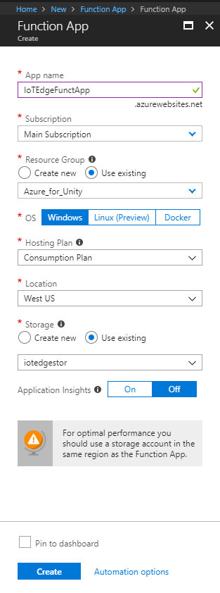

7.  Once you have clicked on **Create**, you will have to wait for the Service to be created, this might take a minute.

8.  A notification will appear in the Portal once the Service instance is created.

    

9.  Click on the notification, once deployment is successful (has finished).

10. Click the **Go to resource** button in the notification to explore your new Service instance.

    

11. In the left side of the new panel, click the **+** (plus) icon next to *Functions*, to create a new function.

    

12. Within the central panel, the **Function** creation window will appear. Scroll down further, and click on **Custom function**.

    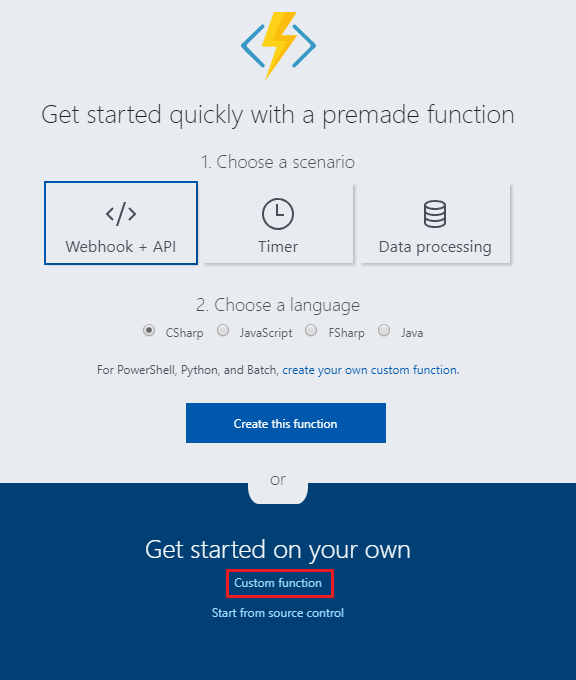

13. Scroll down the next page, until you find **IoT Hub (Event Hub)**, then click on it.

    

14. In the **IoT Hub (Event Hub)** blade, set the **Language** to **C#** and then click on **new**.

    

15. In the window that will appear, make sure that **IoT Hub** is selected and the name of the *IoT Hub* field corresponds with the name of your *IoT Hub Service* that you have created previously ([in step 8, of Chapter 3](#chapter-3---the-iot-hub-service)). Then click the **Select** button.

    

16. Back on the **IoT Hub (Event Hub)** blade, click on **Create**.

    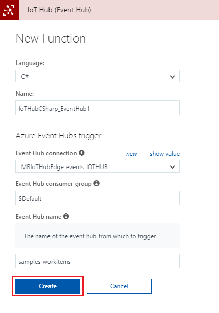

17. You will be redirected to the function editor.

    

18. Delete all the code in it and replace it with the following:

    ```csharp
    #r "Microsoft.WindowsAzure.Storage"
    #r "NewtonSoft.Json"

    using System;
    using Microsoft.WindowsAzure.Storage;
    using Microsoft.WindowsAzure.Storage.Table;
    using Newtonsoft.Json;
    using System.Threading.Tasks;

    public static async Task Run(string myIoTHubMessage, TraceWriter log)
    {
        log.Info($"C# IoT Hub trigger function processed a message: {myIoTHubMessage}");
        
        //RowKey of the table object to be changed
        string tableName = "IoTMessages";
        string tableURL = "https://iothubmrstorage.table.core.windows.net/IoTMessages";

        // If you did not name your Storage Service as suggested in the course, change the name here with the one you chose.
        string storageAccountName = "iotedgestor"; 

        string storageAccountKey = "<Insert your Storage Key here>";   

        string partitionKey = "PK_IoTMessages";
        string rowKey = "RK_1_IoTMessages";

        Microsoft.WindowsAzure.Storage.Auth.StorageCredentials storageCredentials =
            new Microsoft.WindowsAzure.Storage.Auth.StorageCredentials(storageAccountName, storageAccountKey);

        CloudStorageAccount storageAccount = new CloudStorageAccount(storageCredentials, true);

        // Create the table client.
        CloudTableClient tableClient = storageAccount.CreateCloudTableClient();

        // Get a reference to a table named "IoTMessages"
        CloudTable messageTable = tableClient.GetTableReference(tableName);

        //Retrieve the table object by its RowKey
        TableOperation operation = TableOperation.Retrieve<MessageEntity>(partitionKey, rowKey);
        TableResult result = await messageTable.ExecuteAsync(operation);

        //Create a MessageEntity so to set its parameters
        MessageEntity messageEntity = (MessageEntity)result.Result;

        messageEntity.MessageContent = myIoTHubMessage;
        messageEntity.PartitionKey = partitionKey;
        messageEntity.RowKey = rowKey;

        //Replace the table appropriate table Entity with the value of the MessageEntity Ccass structure.
        operation = TableOperation.Replace(messageEntity);

        // Execute the insert operation.
        await messageTable.ExecuteAsync(operation);
    }

    // This MessageEntity structure which will represent a Table Entity
    public class MessageEntity : TableEntity
    {
        public string Type { get; set; }
        public string MessageContent { get; set; }   
    }
    ```

19. Change the following variables, so that they correspond to the appropriate values (**Table** and **Storage** values, from [step 11 and 13, respectively, of Chapter 11](#chapter-11---create-table-service)), that you will find in your **Storage Account**:

    - **tableName**, with the name of your **Table** located in your **Storage Account**.
    - **tableURL**, with the URL of your **Table** located in your **Storage Account**.
    - **storageAccountName**, with the name of the value corresponding with the name of your **Storage Account** name.
    - **storageAccountKey**, with the Key you have obtained in the Storage Service you have created previously.

    

20. With the code in place, click **Save**.

21. Next, click the **\<** (arrow) icon, on the right-hand side of the page.

    

22. A panel will slide in from the right. In that panel, click **Upload**, and a *File Browser* will appear.

23. Navigate to, and click, the **project.json** file, which you created in **Notepad** previously, and then click the **Open** button. This file defines the libraries that your function will use.

    

24. When the file has uploaded, it will appear in the panel on the right. Clicking it will open it within the **Function** editor. It must look **exactly** the same as the next image.

    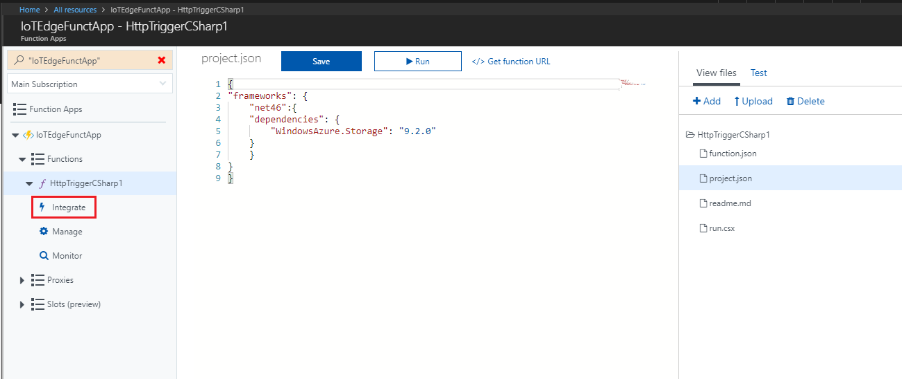

25. At this point it would be good to test the capability of your Function to store the message on your *Table*. On the top right side of the window, click on **Test**.

    

26. Insert a message on the **Request body**, as shown in the image above, and click on **Run**. 

27. The function will run, displaying the result status (you will notice the green **Status 202 Accepted**, above the *Output* window, which means it was a successful call):

    

## Chapter 14 - View active messages

If you now open Visual Studio (**not** Visual Studio Code), you can visualize your test message result, as it will be stored in the *MessageContent* string area.


With the Table Service and Function App in place, your Ubuntu device messages will appear in your *IoTMessages* Table. If not already running, start your device again, and you will be able to see the result messages from your device, and module, within your Table, through using Visual Studio *Cloud Explorer*.


## Chapter 15 - Power BI Setup

To visualize the data from your IOT device you will setup **Power BI** (desktop version), to collect the data from the *Table* Service, which you just created. The *HoloLens* version of Power BI will then use that data to visualize the result.

1.  Open the Microsoft Store on Windows 10 and search for **Power BI Desktop**.

    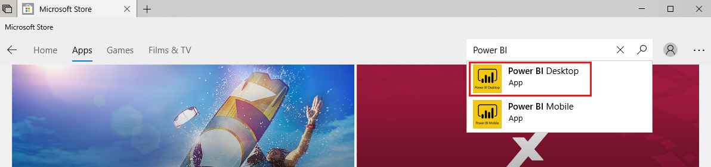

2.  Download the application. Once it has finished downloading, open it.

3.  Log into *Power BI* with your **Microsoft 365 account**. You may be redirected to a browser, to sign up. Once you are signed up, go back to the Power BI app, and sign in again.

4.  Click on **Get Data** and then click on **More...**.

    

5.  Click **Azure**, **Azure Table Storage**, then click on **Connect**.

    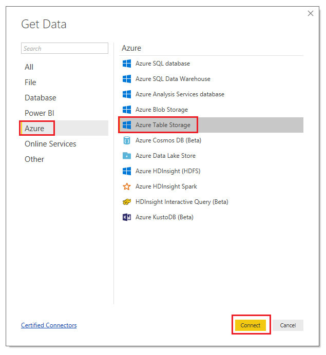

6.  You will be prompted to insert the **Table URL** that you collected earlier ([in step 13 of Chapter 11](#chapter-11---create-table-service)), while creating your Table Service. After inserting the URL, delete the portion of the path referring to the Table "sub-folder" (which was IoTMessages, in this course). The final result should be as displayed in the image below. Then click on **OK**.

    

7.  You will be prompted to insert the **Storage Key** that you noted ([in step 11 of Chapter 11](#chapter-11---create-table-service)) earlier while creating your Table Storage. Then click on **Connect**.

      

8. A **Navigator Panel** will be displayed, tick the box next to your Table and click on **Load**.

      

9. Your table has now been loaded on Power BI, but it requires a query to display the values in it. To do so, right-click on the table name located in the **FIELDS panel** at the right side of the screen. Then click on **Edit Query**.

    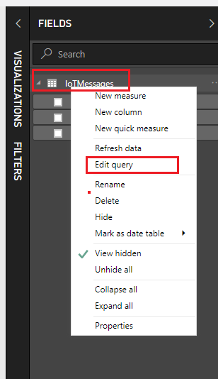 

10. A **Power Query Editor**  will open up as a new window, displaying your table. Click on the word **Record** within the *Content* column of the table, to visualize your stored content.

        

11. Click on **Into Table**, at the top-left of the window. 

    

12. Click on **Close & Apply**.

    

13. Once it has finished loading the query, within the **FIELDS panel**, on the right side of the screen, tick the boxes corresponding to the parameters **Name** and **Value**, to visualize the **MessageContent** column content.

    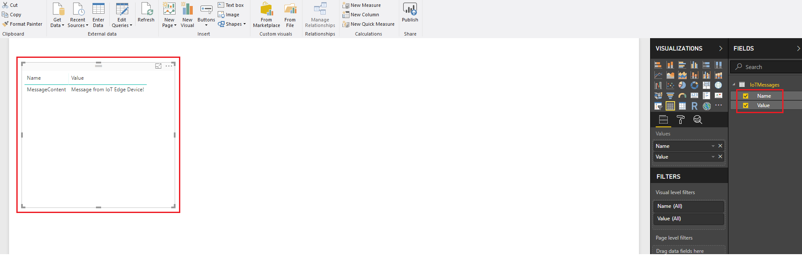

14. Click on the **blue disk icon** at the top left of the window to save your work in a folder of your choice.

    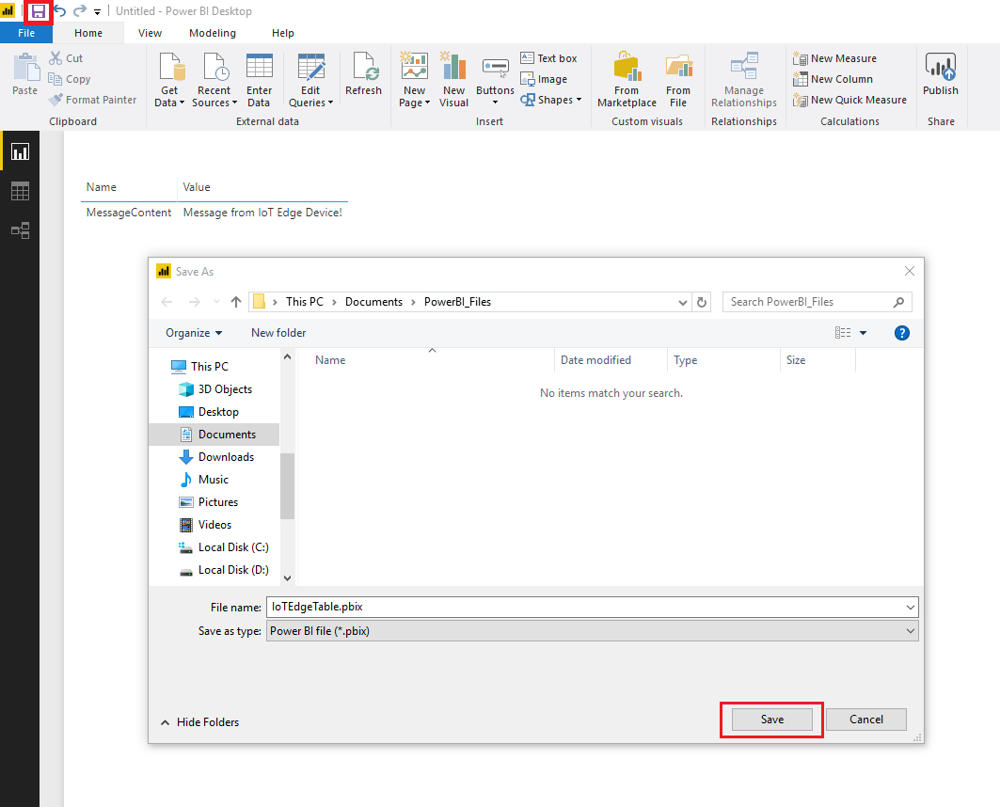

15. You can now click on the Publish button to upload your table to your Workspace. When prompted, click **My workspace** and click *Select*. Wait for it to display the successful result of the submission.

    

    

> [!WARNING]
> The following Chapter is HoloLens specific. Power BI is not currently available as an immersive application, however you can run the desktop version in the Windows Mixed Reality Portal (aka Cliff House), through the Desktop app.

## Chapter 16 - Display Power BI data on HoloLens

1. On your HoloLens, log in to the **Microsoft Store**, by tapping on its icon in the applications list.

    

2. Search and then download the **Power BI** application.

    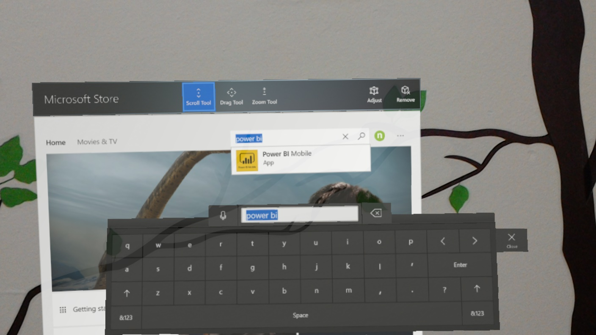

3. Start **Power BI** from your applications list. 

4. **Power BI** might ask you to login to your **Microsoft 365 account**.

5. Once inside the app, the workspace should display by default as shown in the image below. If that does not happen, simply click on the workspace icon on the left side of the window.

    

## Your finished your IoT Hub application

Congratulations, you have successfully created an IoT Hub Service, with a simulated Virtual Machine Edge device. Your device can  communicate the results of a machine learning model to an Azure Table Service, facilitated by an Azure Function App, which is read into Power BI, and visualized within a Microsoft HoloLens.
 


## Bonus exercises

### Exercise 1

Expand the messaging structure stored in the table and display it as a graph. You might want to collect more data and store it in the same table, to be later displayed.

### Exercise 2

Create an additional "camera capture" module to be deployed on the IoT board, so that it can capture images through the camera to be analyzed.