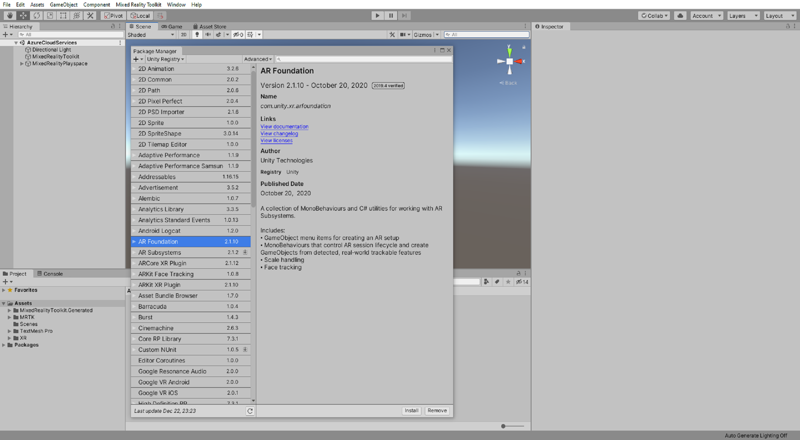
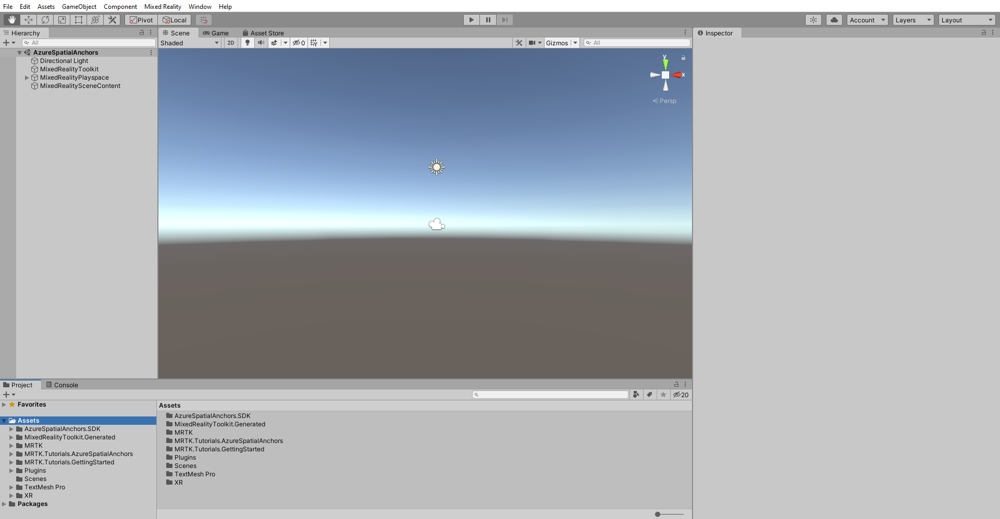
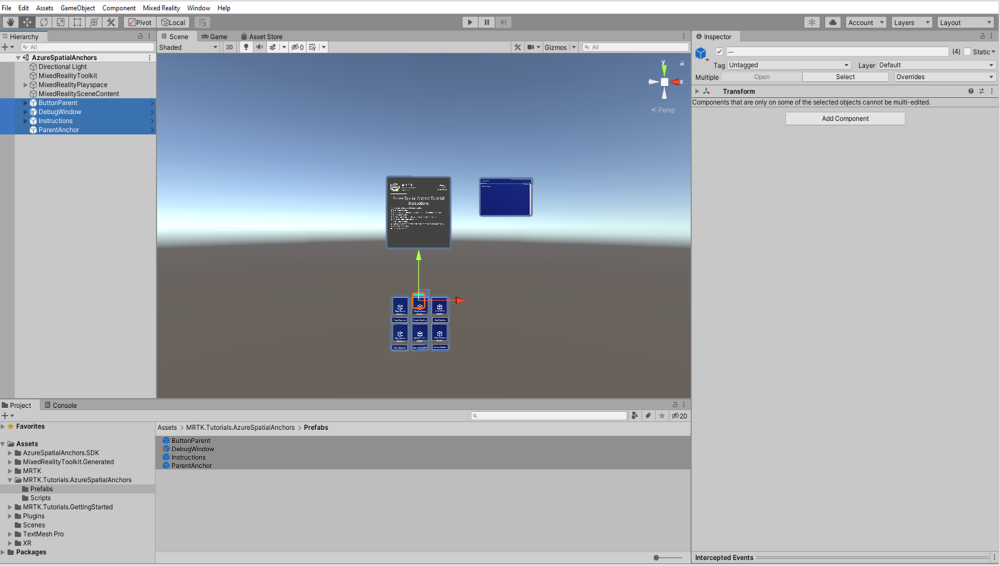
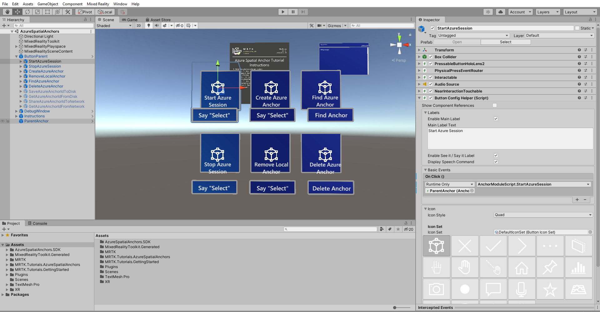
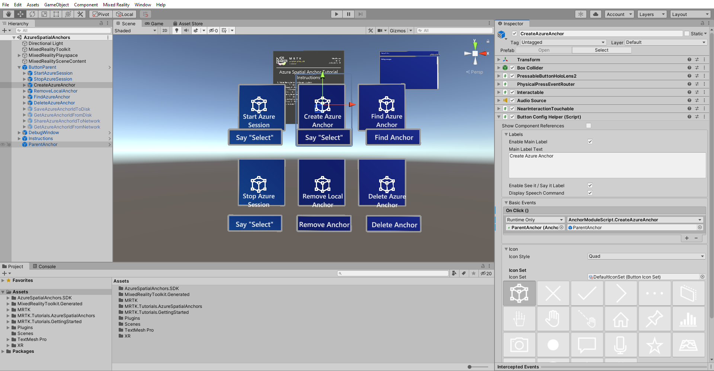
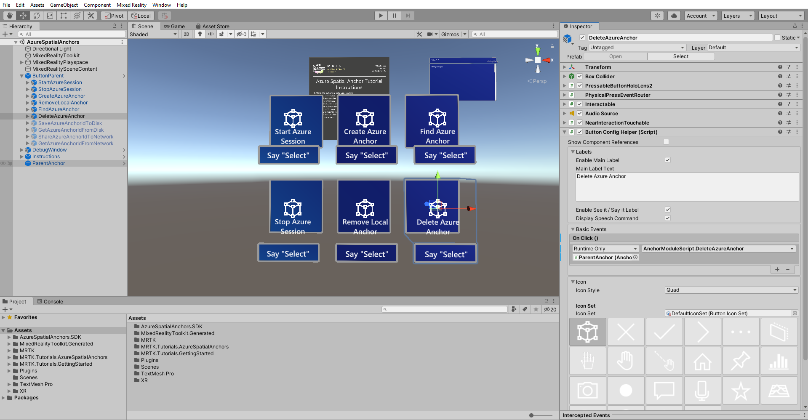
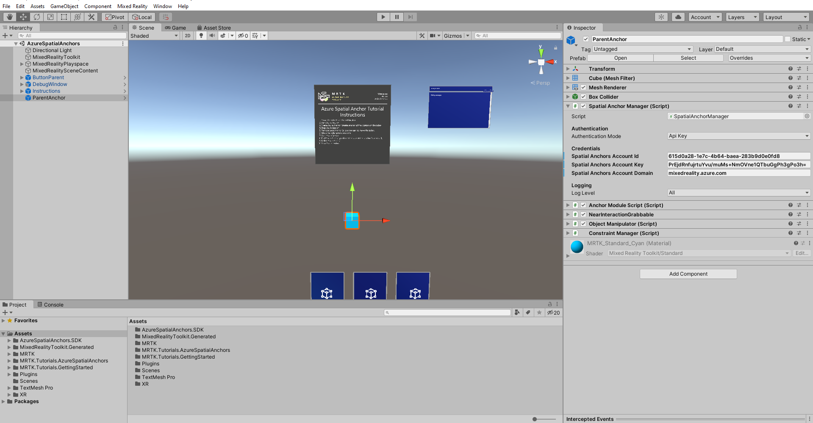
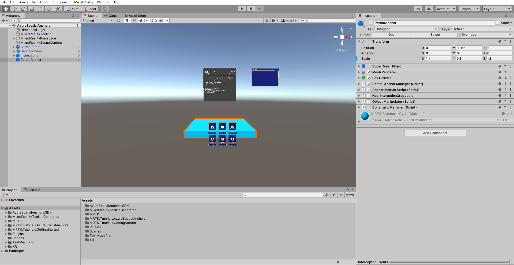
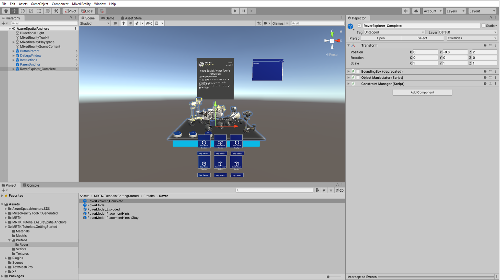
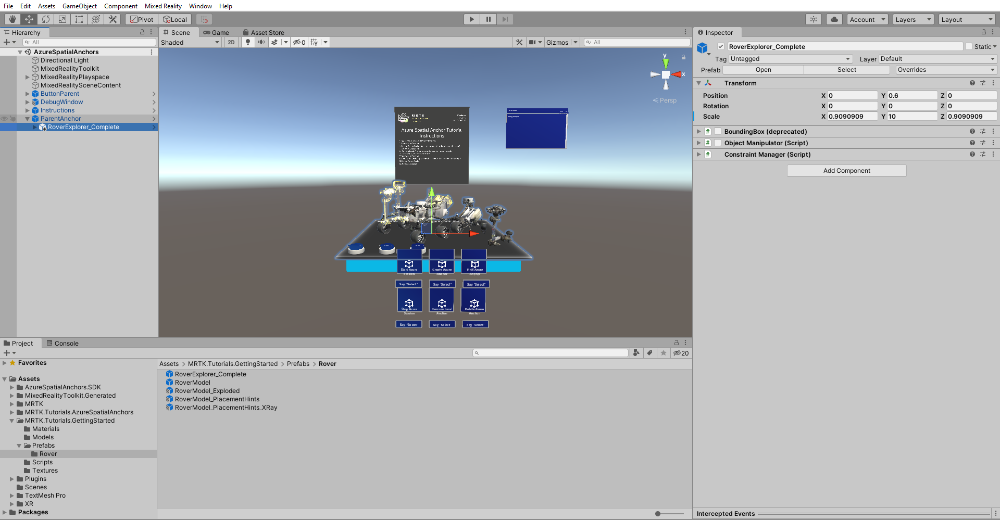

# 2. Getting started with Azure Spatial Anchors

In this tutorial, you will explore the various steps required to start and stop an Azure Spatial Anchors session and to create, upload, and download Azure Spatial Anchors on a single device.

## Objectives

* Learn the fundamentals of developing with Azure Spatial Anchors for HoloLens 2
* Learn how to create spatial anchors and fetch them from Azure

## Creating and preparing the Unity project

In this section, you will create a new Unity project and get it ready for MRTK development.

First, follow the [Initializing your project and deploying your first application](mr-learning-base-02.md), excluding the [Build your application to your device](mr-learning-base-02.md#building-your-application-to-your-hololens-2) instructions, which includes the following steps:

1. [Creating the Unity project](mr-learning-base-02.md#creating-the-unity-project) and give it a suitable name, for example, *MRTK Tutorials*
2. [Switching the build platform](mr-learning-base-02.md#switching-the-build-platform)
3. [Importing the TextMeshPro Essential Resources](mr-learning-base-02.md#importing-the-textmeshpro-essential-resources)
4. [Importing the Mixed Reality Toolkit](mr-learning-base-02.md#importing-the-mixed-reality-toolkit)
5. [Configuring the Unity project](mr-learning-base-02.md#configuring-the-unity-project)
6. [Creating and configuring the scene](mr-learning-base-02.md#creating-and-configuring-the-scene) and give the scene a suitable name, for example, *AzureSpatialAnchors*

Then follow the [Changing the Spatial Awareness Display Option](mr-learning-base-03.md#changing-the-spatial-awareness-display-option) instructions to:

1. Change the **MRTK configuration profile** for to the **DefaultHoloLens2ConfigurationProfile**
1. Change the **spatial awareness mesh display options** to **Occlusion**.

## Installing inbuilt Unity packages

In the Unity menu, select **Window** > **Package Manager** to open the Package Manager window, then select **AR Foundation** and click the **Install** button to install the package:

> [!NOTE]
> You are installing the AR Foundation package because the Azure Spatial Anchors SDK requires it, which you will import in the next section.

## Importing the tutorial assets

Add AzurespatialAnchors SDK V2.7.1 into your unity project, to add the packages please follow this [tutorial](https://docs.microsoft.com/en-us/azure/spatial-anchors/how-tos/setup-unity-project?tabs=UPMPackage)

Download and **import** the following Unity custom packages **in the order they are listed**:

* [MRTK.HoloLens2.Unity.Tutorials.Assets.GettingStarted.2.4.0.unitypackage](https://github.com/microsoft/MixedRealityLearning/releases/download/getting-started-v2.4.0/MRTK.HoloLens2.Unity.Tutorials.Assets.GettingStarted.2.4.0.unitypackage)
* [MRTK.HoloLens2.Unity.Tutorials.Assets.AzureSpatialAnchors.2.4.0.unitypackage](https://github.com/microsoft/MixedRealityLearning/releases/download/azure-spatial-anchors-v2.5.3/MRTK.HoloLens2.Unity.Tutorials.Assets.AzureSpatialAnchors.2.5.3.unitypackage)

After you have imported the tutorial assets your Project window should look similar to this:

> [!NOTE]
> If you see any CS0618 warnings regarding 'WorldAnchor.SetNativeSpatialAnchorPtr(IntPtr)' is obsolete, you can ignore these warnings.

> [!TIP]
> For a reminder on how to import a Unity custom package, you can refer to the [Importing the tutorial assets](mr-learning-base-02.md#importing-the-tutorial-assets) instructions.

## Preparing the scene

In this section, you will prepare the scene by adding some of the tutorial prefabs.

In the Project window, navigate to the **Assets** > **MRTK.Tutorials.AzureSpatialAnchors** > **Prefabs** folder, then click-and-drag the following prefabs into the Hierarchy window to add them to your scene:

* **ButtonParent** prefabs
* **DebugWindow** prefabs
* **Instructions** prefabs
* **ParentAnchor** prefabs

> [!TIP]
> If you find the large icons in your scene, for example, the large framed 'T' icons distracting, you can hide these by <a href="https://docs.unity3d.com/2019.1/Documentation/Manual/GizmosMenu.html" target="_blank">toggling the Gizmos</a> to the off position, as shown in the image above.

## Configuring the buttons to operate the scene

In this section, you will add scripts to the scene to create a series of button events that demonstrate the fundamentals of how both local anchors and Azure Spatial Anchors behave in an app.

In the Hierarchy window, expand the **ButtonParent** object and select the first child object named **StartAzureSession**, in the Inspector window, configure the **Button Config Helper (Script)** component's **On Click ()** event as follows:

* Assign the **ParentAnchor** object to the **None (Object)** field
* From the **No Function** dropdown, select **AnchorModuleScript** > **StartAzureSession ()** to set this function as the action to be executed when the event is triggered

In the Hierarchy window, select the next button named **StopAzureSession**, then in the Inspector window, configure the **Button Config Helper (Script)** component's **On Click ()** event as follows:

* Assign the **ParentAnchor** object to the **None (Object)** field
* From the **No Function** dropdown, select **AnchorModuleScript** > **StopAzureSession ()** to set this function as the action to be executed when the event is triggered

In the Hierarchy window, select the next button named **CreateAzureAnchor**, then in the Inspector window, configure the **Button Config Helper (Script)** component's **On Click ()** event as follows:

* Assign the **ParentAnchor** object to the **None (Object)** field
* From the **No Function** dropdown, select **AnchorModuleScript** > **CreateAzureAnchor ()** to set this function as the action to be executed when the event is triggered
* Assign the **ParentAnchor** object to the empty **None (Game Object)** field to make it the argument for the CreateAzureAnchor () function

In the Hierarchy window, select the next button named **RemoveLocalAnchor**,then in the Inspector window, configure the **Button Config Helper (Script)** component's **On Click ()** event as follows:

* Assign the **ParentAnchor** object to the **None (Object)** field
* From the **No Function** dropdown, select **AnchorModuleScript** > **RemoveLocalAnchor ()** to set this function as the action to be executed when the event is triggered
* Assign the **ParentAnchor** object to the empty **None (Game Object)** field to make it the argument for the RemoveLocalAnchor () function

In the Hierarchy window, select the next button named **FindAzureAnchor**,then in the Inspector window, configure the **Button Config Helper (Script)** component's **On Click ()** event as follows:

* Assign the **ParentAnchor** object to the **None (Object)** field
* From the **No Function** dropdown, select **AnchorModuleScript** > **FindAzureAnchor ()** to set this function as the action to be executed when the event is triggered

In the Hierarchy window, select the next button named **DeleteAzureAnchor**, then in the Inspector window, configure the **Button Config Helper (Script)** component's **On Click ()** event as follows:

* Assign the **DeleteAzureAnchor** object to the **None (Object)** field
* From the **No Function** dropdown, select **AnchorModuleScript** > **DeleteAzureAnchor ()** to set this function as the action to be executed when the event is triggered

## Connecting the scene to the Azure resource

In the Hierarchy window, select the **ParentAnchor** object, then in the Inspector window, locate the **Spatial Anchor Manager (Script)** component. Configure the **Credentials** section with the credentials from the Azure Spatial Anchors account created as part of the [Prerequisites](mr-learning-asa-01.md#prerequisites) for this tutorial series:

* In the **Spatial Anchors Account ID** field, paste the **Account ID** from your Azure Spatial Anchors account
* In the **Spatial Anchors Account Key** field, paste the primary or secondary **Access Key** from your Azure Spatial Anchors account
* In the **Spatial Anchors Account Domain** field, paste the **Account Domain** from your Azure Spatial Anchors account

## Trying the basic behaviors of Azure Spatial Anchors

Azure Spatial Anchors can not run in Unity, so to test the Azure Spatial Anchors functionality, you need to build the project and deploy the app to your device.

> [!TIP]
> For a reminder on how to build and deploy your Unity project to HoloLens 2, you can refer to the [Building your application to your HoloLens 2]((mr-learning-base-02.md#building-your-application-to-your-hololens-2) instructions.

When the app runs on your device, follow the on-screen instructions displayed on the Azure Spatial Anchor Tutorial Instructions panel:

1. Move the cube to a different location
1. Start Azure Session
1. Create Azure Anchor (creates an anchor at the location of the cube).
1. Stop Azure Session
1. Remove Local Anchor (allows the user to move the cube)
1. Move the cube somewhere else
1. Start Azure Session
1. Find Azure Anchor (positions the cube at the location from step 3)
1. Delete Azure Anchor
1. Stop Azure session

> [!CAUTION]
> Azure Spatial Anchors uses the internet to save and load the anchor data, so make sure your device is connected to the internet.

## Anchoring an experience

In the previous sections, you learned the fundamentals of Azure Spatial Anchors. We used a cube to represent and visualize the parent game object with the attached anchor. In this section, you will learn how to anchor an entire experience by placing it as a child of the ParentAnchor object.

In the Hierarchy window, select the **ParentAnchor** object, then in the Inspector window, configure the **Transform** components as follows:

* Change **Scale X** to 1.1
* Change **Scale Z** to 1.1

In the Project window, navigate to the **Assets** > **MRTK.Tutorials.GettingStarted** > **Prefabs** > **Rover** folder, then click-and-drag the **RoverExplorer_Complete** prefab into the Hierarchy window to add it to the scene:

With the newly added RoverModule_Complete object still selected in the Hierarchy window, drag it onto the **ParentAnchor** object to make it a child of the ParentAnchor object:

If you now rebuild the project and deploy the app to your device, you can now reposition the entire Rover Explorer experience by moving the resized cube.

> [!TIP]
> A variety of user experience flows for repositioning experiences, including the use of a repositioning object (such as the cube used in this tutorial), the use of a button to toggle a bounds control that surrounds the experience, the use of position and rotation gizmos, and more.

## Congratulations

In this tutorial, you learned the fundamentals of Azure Spatial Anchors. This tutorial provided you with several buttons to let you explore the various steps required to start and stop an Azure Spatial Anchors session. Also, to create, upload, and download Azure Spatial Anchors on a single device.

In the next tutorial, you will learn how to save Azure anchor IDs to your HoloLens 2 for retrieval, even after the app is restarted, and how to transfer anchor IDs between multiple devices to achieve spatial alignment.

> [!div class="nextstepaction"]
> [Next Tutorial: 3. Saving, retrieving and sharing Azure Spatial Anchors](mr-learning-asa-03.md)
