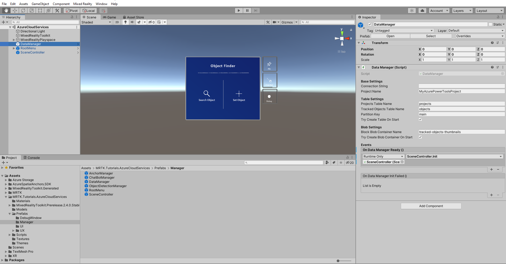

# 2. Integrating Azure storage

In this tutorial, you will learn how to save entity data to Azure Table storage and thumbnail images to Azure Blob storage. This feature will allow us to store and retrieve *Tracked Objects* with data like ID, Name, Thumbnail Image, etc. across sessions and devices to the cloud.

## Objectives

* Learn the basics about Azure storage
* Learn how to store, modify and retrieve data from Table storage
* Learn how to store and delete images from Blob storage

## Understanding Azure storage

**Azure storage** is a Microsoft storage solution on the cloud that can cover many scenarios and requirements. It can scale massively and is easily approachable by developers. All services can be consumed under the umbrella of an **Azure storage Account**. For our use case we will use *Table storage* and *Blob storage*.

Learn more about [Azure storage services](/azure/storage/blobs/storage-blobs-overview).

### Azure Table storage

This services allows us to store data in a NoSQL fashion, in this project we will use it to store information about the *Tracked Object* such as: name, description, spatial anchor id, and more.

In context of the demo application, you need two Tables, one to store information about the project with information about the state of trained models more about that in the ([Integrating Azure Custom Vision](mr-learning-azure-03.md)) tutorial and a second table to store information about *Tracked Objects*.

Learn more about [Azure Table storage](/azure/storage/tables/table-storage-overview).

### Azure Blob storage

This service allows to store large binary files, you will use this to store photos taken for *Tracked Objects* as thumbnail.
For of the demo application you need one Blob Container to store the images.

Learn more about [Azure Blob storage](/azure/storage/blobs/storage-blobs-introduction).

## Preparing Azure Storage

To consume the Azure storage services you will need an Azure storage account. To create a storage account, see [Create a storage account](/azure/storage/common/storage-account-create?tabs=azure-portal). To learn more about storage accounts, see [Azure storage account overview](/azure/storage/common/storage-account-overview).

Once you have a storage account, you can retrieve the connection string from the **Azure Portal** which will be needed in the next section of this lesson.

### Optional Azure Storage Explorer

While you can see and verify all data changes from the UI inside the application, we recommend to install [Azure Storage Explorer](https://azure.microsoft.com/features/storage-explorer/). This tool allows you to visually see the data in the Azure storage and is of great help when debugging and learning.

> [!TIP]
> For testing from inside the Unity editor you can use a local emulator:
>
> * on Windows 10 you can use [Azure Storage Emulator](/azure/storage/common/storage-use-emulator)
> * on MacOS/Linux you can use [Azurite Docker Image](https://hub.docker.com/_/microsoft-azure-storage-azurite) for Docker

## Preparing the scene

In the Hierarchy window, locate the **DataManager** object and select it.

From the Inspector window you will see that the **DataManager (script)** component is where all **Azure storage** related settings are kept. All relevant settings are already set, you just need to replace the *Connection String* field with the one you can retrieve from the Azure Portal. If you are using a local Azure storage emulator solution, then you can keep the already provided *Connection String*.

The **DataManager (script)** is responsible for talking to the **Table storage** and **Blob storage** which is consumed by other controller scripts on the UI components.

## Writing and reading data from Azure Table storage

With everything prepared it's time to create a *Tracked Object*.

Open the application on your HoloLens, click on the **Set Object** and you will see how the *EnterObjectName* object will become active in the hierarchy. In this menu click on the *search bar* and type in the name you want to give the *Tracked Object*. After providing a name click on the **Set object** button. This will create the *Tracked Object* on the Azure Table storage and you will see now the **Object Card**.

This **Object Card** is a UI representation of the *Tracked Object* and will have an important role several times in this tutorial series.

Now click on the description *text box* and type in "Car", after that click on the **Save** button to save the changes. Stop the application and rerun it.

Now this time click on **Search Object** and type in the *search bar* the name you have used before when creating the *Tracked Object*. You will see that the **Object Card** with all the data is retrieved from the **Azure Table storage**.

Feel free to close the **Object Card** and create new *Tracked Objects* and edit their data.

> [!TIP]
> If you have installed the [Azure Storage Explorer](https://azure.microsoft.com/features/storage-explorer/) then look into the *objects* table and you will see there the created *Tracked Object*.

## Uploading and Download image from Azure Blob storage

In this section you will use the Azure Blob storage to upload and download images that will be used as thumbnails for *Tracked Objects*.

> [!NOTE]
> In this tutorial the application will take photos to upload images to the Blob storage. If you are running this locally from the Unity editor, then make sure that you have a webcam connected to your computer.

Open the application on your HoloLens, click on **Set Object** and type in the *search bar* the name "Car". Now you should see the **Object Card**, click on the **Camera** button and you will be instructed to do an AirTap to take a photo. After taking a photo you will see a message that informs you about the active upload and after a while the image should appear where the placeholder was before.

Now rerun the application and search for the *Tracked Object* and the previously uploaded image should appear as thumbnail.

## Deleting image from Azure Blob storage

In the previous section you uploaded new images to Azure Blob storage, in this section you will delete an image thumbnail for *Tracked Objects*.

Open the application on your HoloLens, click on **Set Object** and type in the *search bar* the name "Car". Now you should see the **Object Card** with the thumbnail image, click on the **Delete** button. You will notice that the thumbnail image is replaced by the placeholder image.

Now rerun the application and search for the *Tracked Object* of the previously deleted thumbnail, you should only see the placeholder image.

## Congratulations

In this tutorial you learned how Azure storage services can be used to persist unstructured data, like in our case **Tracked Objects** and binaries in form of thumbnail images for the **HoloLens 2** demo application on the cloud.

In the next tutorial you will learn how to use Azure Custom Vision to detect images associated with a *Tracked Object*.

> [!div class="nextstepaction"]
> [Next tutorial: 3. Integrating Azure Custom Vision](mr-learning-azure-03.md)