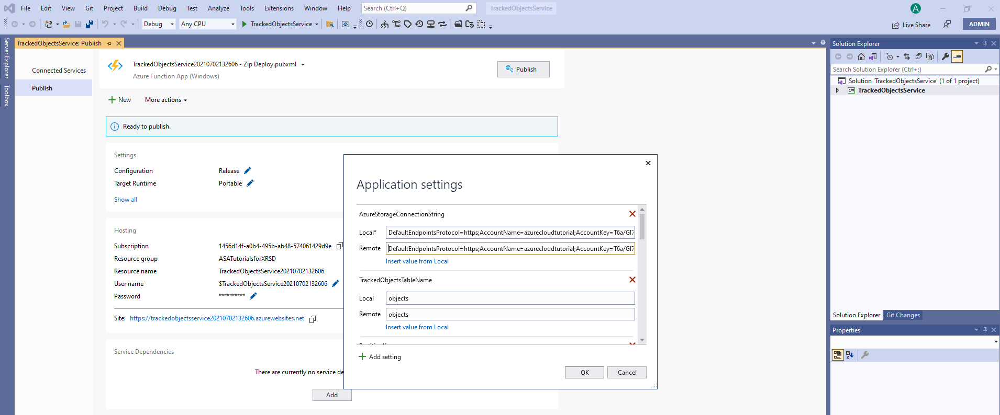
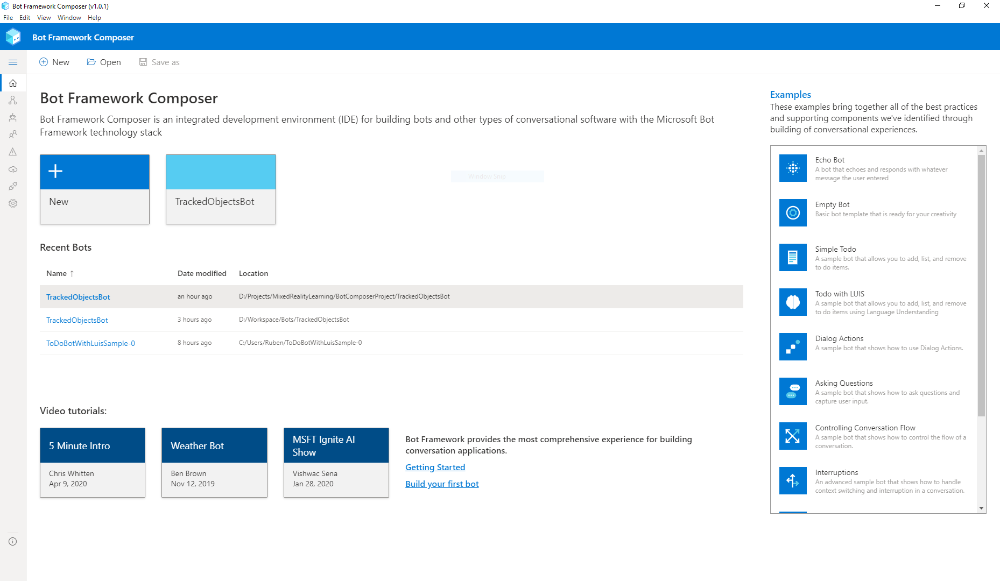
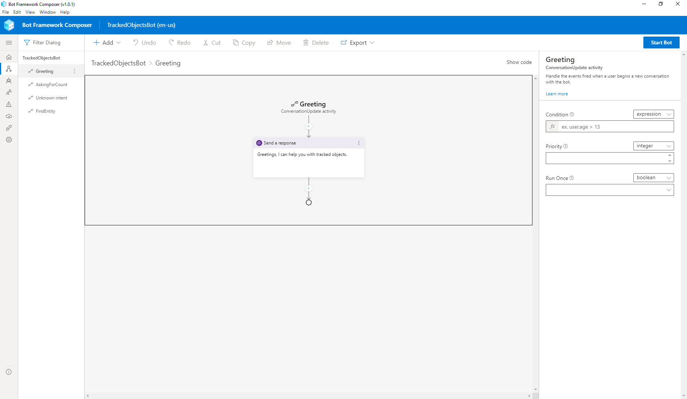
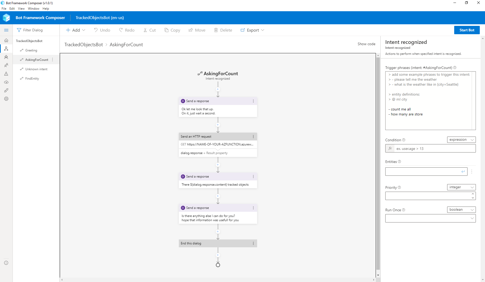
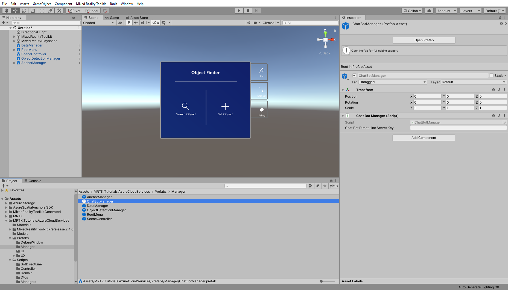
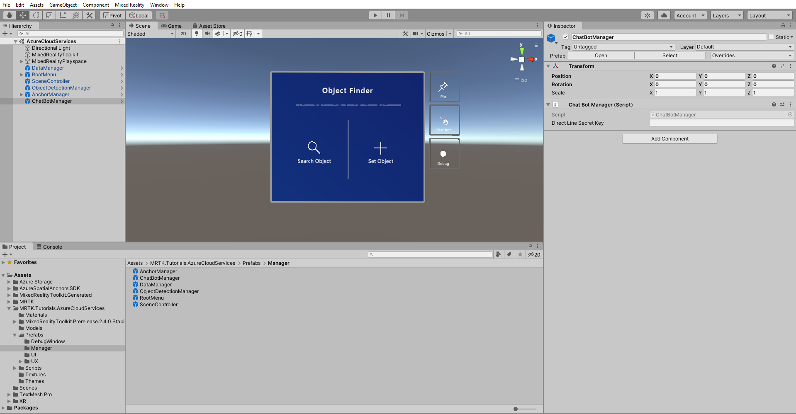
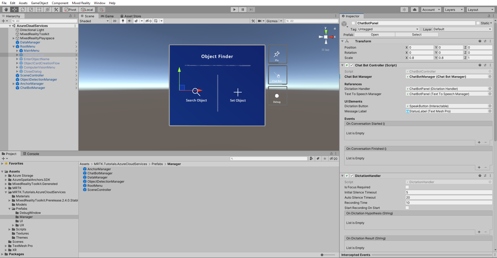
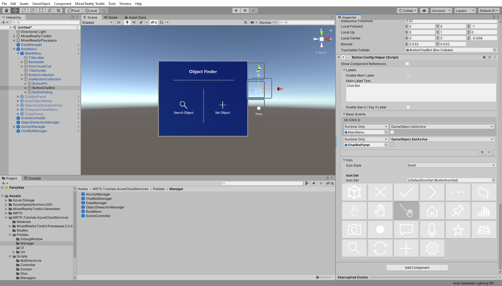

# 5. Integrating Azure Bot Service

In this tutorial, you will learn how to use **Azure Bot Service** in the **HoloLens 2** demo application to add Language Understanding (LUIS) and letting the Bot assist the user when searching for **Tracked Objects**. This is a two part tutorial where in the first part you create the Bot with the [Bot Composer](/composer/introduction) as a code free solution and take a quick look in the Azure Function that feeds the Bot with the needed data. In the second part you use the **BotManager (script)** in the Unity project to consume the hosted Bot Service.

## Objectives

## Part 1

* Learn the basics about Azure Bot Service
* Learn how to use the Bot Composer to create a Bot
* Learn how to use an Azure Function to provide data from the Azure Storage

## Part 2

* Learn how to setup the scene to use Azure Bot Service in this project
* Learn how to set and find objects via conversing with the Bot

## Understanding Azure Bot Service

The **Azure Bot Service** empowers developers to create intelligent bots that can maintain natural conversation with users thanks to **LUIS**. A conversational Bot is a great way to expand the ways a user can interact with your application. A Bot can act as a knowledge base with a [QnA Maker](/azure/bot-service/bot-builder-howto-qna?preserve-view=true&tabs=cs&view=azure-bot-service-4.0) to maintaining sophisticated conversation with the power of [Language Understanding (LUIS)](/azure/bot-service/bot-builder-howto-v4-luis?preserve-view=true&tabs=csharp&view=azure-bot-service-4.0).

Learn more about [Azure Bot Service](/azure/bot-service/bot-service-overview-introduction?preserve-view=true&view=azure-bot-service-4.0).

## Part 1 - Creating the Bot

Before you can use the bot in the Unity application, you need to develope it, provide it with data and host it on **Azure**.
The goal of the bot is to have the abilities to tell how many *Tracked Objects* are stored in the database, find a *Tracked Object* by its name, and tell the user some basic information about it.

### A quick look into Tracked Objects Azure Function

You are about to start creating the Bot, but to make it useful you need to give it a resource from which it can pull data. Since the *Bot* will be able to count the amount of **Tracked Objects**, find specific ones by name and tell details, you will use a simple Azure Function that has access to the **Azure Table storage**.

Download the Tracked Objects Azure Function project: [AzureFunction_TrackedObjectsService.zip](https://github.com/microsoft/MixedRealityLearning/releases/download/azure-cloud-services-v2.4.0/AzureFunction_TrackedObjectsService.zip) and extract it to your hard drive.

This Azure Function has two actions, **Count** and **Find** which can be invoked via basic *HTTP* *GET* calls. You can inspect the code in **Visual Studio**.

Learn more about [Azure Functions](/azure/azure-functions/functions-overview).

The **Count** function queries from the **Table storage** all **TrackedObjects** from the table, very simple. On the other hand the **Find** function takes a *name* query parameter from the *GET* request and queries the **Table storage** for a matching **TrackedObject** and returns a DTO as JSON.

To deploy this **Azure Function** directly from **Visual Studio**, open the downloaded AzureFunction_TrackedObjectsService folder and open the present **.sln** file with visual studio

Once file loaded in visual studio, Right click over **Tracked object sevice** in solution explorer and select publish

The publish pop up will be displayed and ask for target flatform
Select azure and click on **Next** button

In specific target select **Azure Function App(Windows)** and click on **Next** button

If you are not logged in to azure please login through visual studio and the window look like

Click on pulse button to create new Function App in azure account

* For **Name**, enter a suitable name for the service, for example, *TrackedObjectsService*
* For **Plan Type**, choose consumption
* For **Location**, choose a location close to your app users' physical location, for example, *(US) West US*
* For **Resource Group** and **Storage**, choose respective azure group and storage account have been created in pervious chapters.

Once Function App created click on **Finish** button.

To update the connection string click on **3 dots** on **hosting** tab and select **Manage Azure App Service settings**

this opens the **Application Settings** window hear replace your AzureStorageConnectionString for both **Local** and **Remote** with your AzureStorageConnectionString. once replaced click on ok.

Now lick on **Publish** button to publish the function and wait for publish.

Once completion of publish click on **Manage in Azure portal** under Actions section it is take you to specific function in azure portal and click on **Configuration** which is under the *Settings* section. There on **Application Settings** you need to provide the *Connection string* to the **Azure Storage** where the **Tracked Objects** are stored. Click on **New Application setting** and use for name: **AzureStorageConnectionString** and for value provide the correct *Connection string*. After that click on **Save** and the **Azure Function** is ready to server the *Bot* which you will create next.

To get URL of count and Find , select **Functions** which is under the *Functions* section. here you can find both Count and Find function, select Count function on top side you can find the *Get Function Url* button.
Follow the same procedure to get Find function Url.

### Creating a conversation Bot

There are several ways to develop a Bot Framework based conversational bot. In this lesson you will use the [Bot Framework Composer](/composer/) desktop application which is a visual designer that is perfect for rapid development.

You can download the latest releases from the [Github repository](https://github.com/microsoft/BotFramework-Composer/releases). It is available for Windows, Mac, and Linux.

Once the **Bot Framework Composer** is installed, start the application and you should see this interface:

We have prepared a bot composer project which provides the needed dialogues and triggers for this tutorial. Download the Bot Framework Composer project: [BotComposerProject_TrackedObjectsBot.zip](https://github.com/microsoft/MixedRealityLearning/releases/download/azure-cloud-services-v2.4.0/BotComposerProject_TrackedObjectsBot.zip) and extract it to your hard drive.

On the top bar click on **Open** and select the Bot Framework project you have downloaded which is named **TrackedObjectsBot**. After the project is fully loaded, you should see the project ready.

Let's focus on the left side where you can see the **Dialogs Panel**. There you have one dialog named **TrackedObjectsBot** under which you can see several **Triggers**.

Learn more about [Bot Framework concepts](/composer/concept-dialog).

These triggers do the following:

#### Greeting

This is the entry point of the chat *bot* when ever a *user* initiates a conversation.

#### AskingForCount

This dialog is triggered when the *user* asks for counting all **Tracked Objects**.
These are the trigger phrases:

>* count me all
>* how many are stored

Thanks to [LUIS](/composer/how-to-use-luis) the *user* does not have to ask the phrases in that exact way which allows a natural conversation for the *user*.

In this dialog the *bot* will also talk to the **Count** Azure Function, more about that later.

#### Unknown Intent

This dialogue is triggered if the input from the *user* does not fit any other trigger condition and responses the user with trying his question again.

#### FindEntity

The last dialogue is more complex with branching and storing data in the *bots* memory.
It asks the user for the *name* of the **Tracked Object** it want's to know more information about, performs a query to the **Find** Azure Function, and uses the response to proceed with the conversation.

If the **Tracked Object** is not found, the user is informed and the conversation ends. When the **Tracked Object** in question is found, the boot will check what properties are available and report on them.

### Adapting the Bot

The **AskingForCount** and **FindEntity** trigger need to talk to the backend, this means you have to add the correct URL of the **Azure Function** you deployed previously.

On the dialog panel click on **AskingForCount** and locate the *Send an HTTP request* action, here you can see the field **URL** which you need to change the correct URL for the **Count** function endpoint.

Finally, look for the **FindEntity** trigger and locate the *Send an HTTP request* action, in the **URL** field change the URL to the **Find** function endpoint.

With everything set you are now ready to deploy the Bot. Since you have Bot Framework composer installed, you can publish it directly from there.

Learn more about [Publish a bot from Bot Composer](/composer/how-to-publish-bot).

> [!TIP]
> Feel free playing around with Bot by adding more trigger phrases, new responses or conversation branching.

## Part 2 - Putting everything together in Unity

### Preparing the scene

In the Project window, navigate to **Assets** > **MRTK.Tutorials.AzureCloudServices** > **Prefabs** > **Manager** folder.

From there move the prefab **ChatBotManager** into the scene Hierarchy.

Once you add the ChatBotManager to the scene, click on the **Chat Bot Manager** component.
In the Inspector you will see that there is an empty **Direct Line Secret Key** field which you need to fill out.

> [!TIP]
> You can retrieve the *secret key* from the Azure portal by looking for the resource of type **Bot Channels Registration** you have created in the first part of this tutorial.

Now you will connect the **ChatBotManager** object with the **ChatBotController** component that is attached to the **ChatBotPanel** object. In the Hierarchy select the **ChatBotPanel** and you will see an empty **Chat Bot Manager** field, drag from the Hierarchy the **ChatBotManager** object into the empty **Chat Bot Manager** field.

Next you need a way to open the **ChatBotPanel** so that the user can interact with it. From the Scene window you may have noticed that there is a *Chat Bot* side button on the **MainMenu** object, you will use it to solve this problem.

In the Hierarchy locate **RootMenu** > **MainMenu** > **SideButtonCollection** > **ButtonChatBot** and locate in the Inspector the *ButtonConfigHelper* script. There you will see an empty slot on the **OnClick()** event callback. Drag and drop the **ChatBotPanel** to the event slot, from the dropdown list navigate *GameObject*, then select in the sub menu *SetActive (bool)* and enable the checkbox.

Now the chat bot can be stared from the main menu and with that the scene is ready for use.

### Putting the bot to a test

#### Asking about the quantity of tracked objects

First you test asking the bot how many **Tracked Objects** are stored in the database.

> [!NOTE]
> This time you must run the application from the HoloLens 2 because services like *text-to-speech* may not be available on your system.

Run the application on your HoloLens 2 and click on the *Chat Bot* button next to the main menu.
The bot will be greeting you, now ask **how many objects do we have?**
It should tell you the quantity and end the conversation.

#### Asking about a tracked object

Now run the application again and this time ask **find me a tracked object**, the bot will be asking you the name to which you should respond with the "car" or the name of an other *Tracked Object* you know exists in the database. The bot will tell you details like description and if it has a spatial anchor assigned.

> [!TIP]
> Try out asking for an **Tracked Objects** that does not exist and hear how the bot responds.

## Congratulations

In this tutorial you learned how Azure Bot Framework can be used to interact with the application via conversation with natural language. You learned how to develop your own bot and what all the moving pieces are to get it running,

## Conclusion

Through the course of this tutorial series you experienced how **Azure Cloud services** brought new and exciting features to your application.
You can now store data and images in the cloud with **Azure Storage**, use **Azure Custom Vision** to associate images and train a model, bring objects to a local context with **Azure Spatial Anchors**, and implement **Azure Bot Framework powered by LUIS** to add a conversational bot for a new and natural interaction pattern.