# 2. Initializing your project and deploying your first application

In this tutorial, you'll learn how to create a new Unity project, configure it for <a href="https://docs.microsoft.com/windows/mixed-reality/mrtk-unity/" target="_blank">Mixed Reality Toolkit (MRTK)</a> development, and import MRTK. You'll also walk through configuring, building, and deploying a basic Unity scene from Visual Studio to your HoloLens 2. Once you have deployed it to your HoloLens 2, you should see a spatial mapping mesh covering the surfaces that are perceived by the HoloLens. Additionally, you should see indicators on your hands and fingers for hand tracking and a frame rate counter for keeping an eye on app performance.

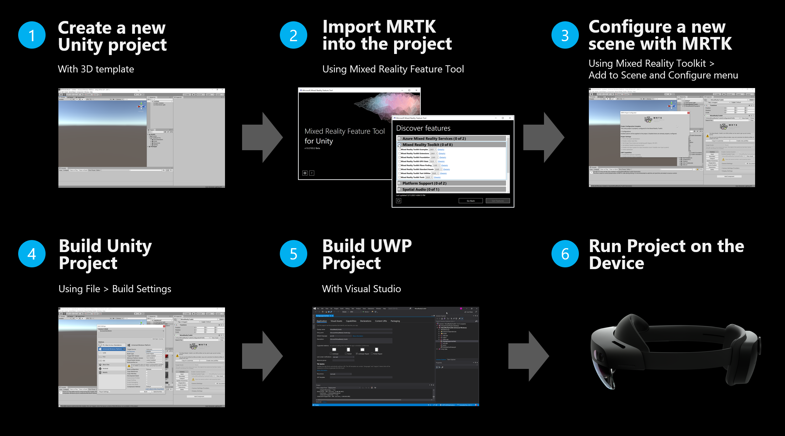

## Objectives

* Learn how to configure Unity for HoloLens development
* Learn how to build and deploy your app to HoloLens
* Experience the spatial mapping mesh, hand meshes, and the framerate counter on HoloLens 2 device

## Creating the Unity project

Launch **Unity Hub**, select the **Projects** tab, and click the **down arrow** next to the **New** button:

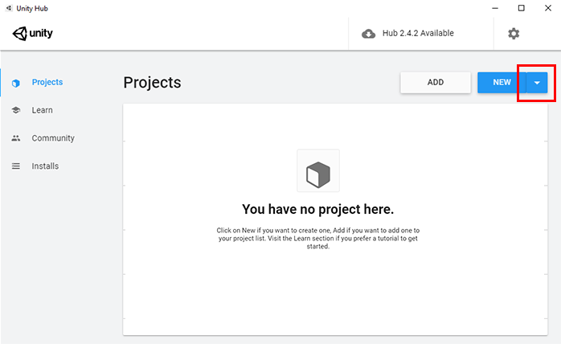

In the dropdown, select the Unity **version** specified in the [Prerequisites](mr-learning-base-01.md#prerequisites):

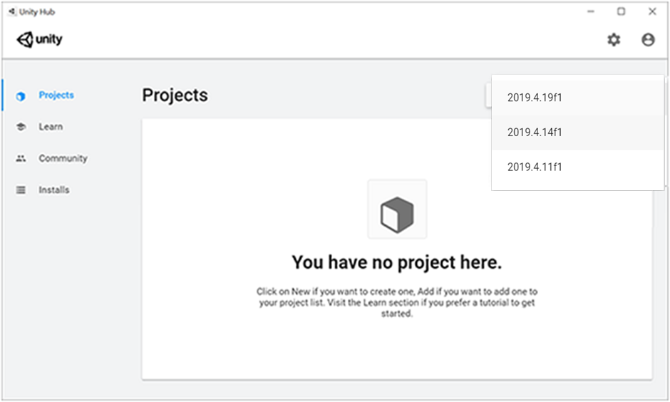

> [!TIP]
> If the particular Unity version is not available in Unity Hub, you can initiate the installation from Unity's <a href="https://unity3d.com/get-unity/download/archive" target="_blank">Download Archive</a>.

In the Create a new project window:

* Ensure **Templates** is set to **3D**
* Enter a suitable **Project Name**, for example, _MRTK Tutorials_
* Choose a suitable **Location** to store your project, for example, _D:\MixedRealityLearning_
* Click the **Create** button to create and launch your new Unity project

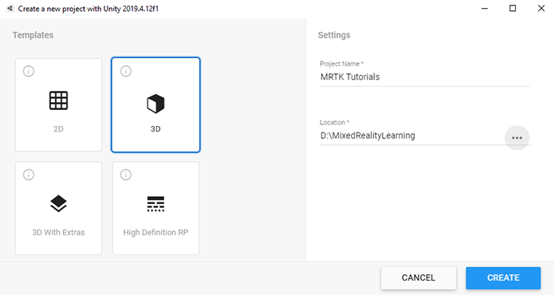

> [!CAUTION]
> When working on Windows, there is a MAX_PATH limit of 255 characters. Consequently, you should save the Unity project close to the root of the drive.

Wait for Unity to create the project:

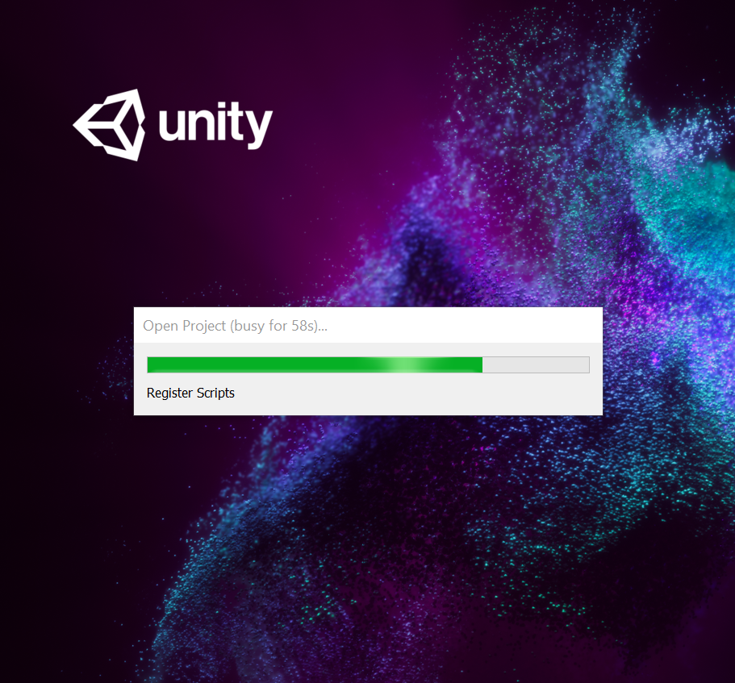

## Switching the build platform

In the Unity menu, select **File** > **Build Settings...** to open the Build Settings window:

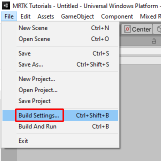

In the Build Settings window, select **Universal Windows Platform** and click the **Switch Platform** button:

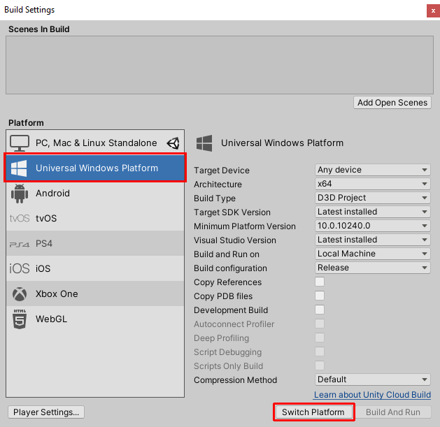

Wait for Unity to finish switching the platform:

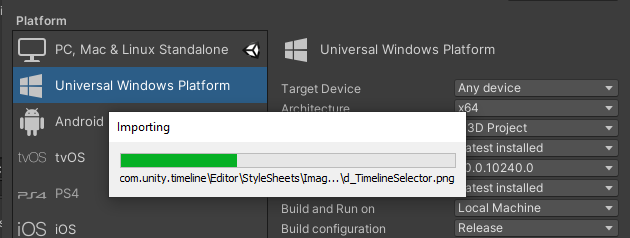

When Unity has finished switching the platform, click the red **x** icon to close the Build Settings window:

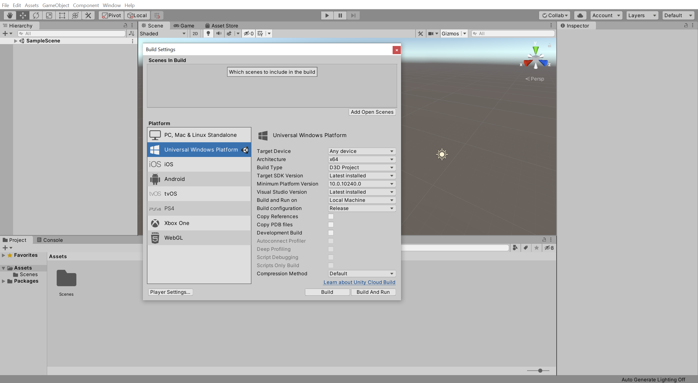

## Importing the TextMeshPro Essential Resources

In the Unity menu, select **Window** > **TextMeshPro** > **Import TMP Essential Resources** to open the Import Unity Package window:

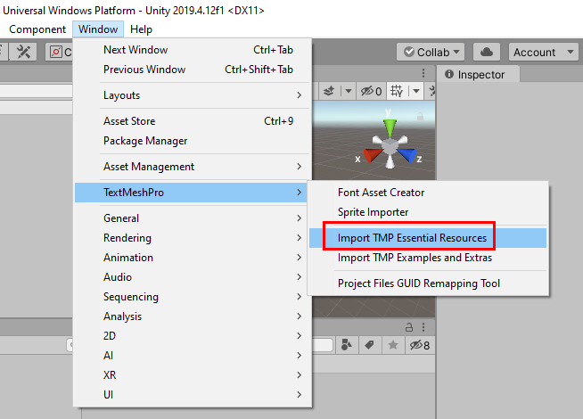

In the Import Unity Package window, click the **All** button to ensure all the assets are selected, then click the **Import** button to import the assets:

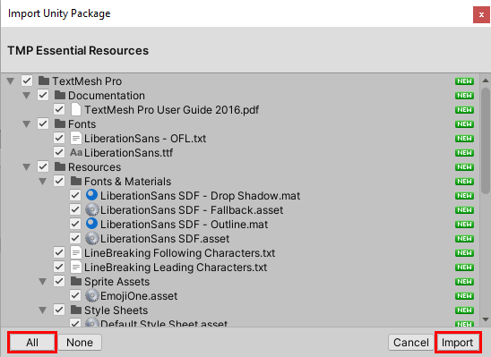

> [!TIP]
> The TextMeshPro Essential Resources are required by MRTK's UI elements. You can skip this step if you are not planning to use MRTK's UI elements in your project.

## Importing the Mixed Reality Toolkit

To Import Mixed Reality Toolkit into the Unity Project you will have to use [Mixed Reality Feature Tool](../welcome-to-mr-feature-tool.md) which allows  developers to discover, update, and add Mixed Reality feature packages into Unity projects. You can search packages by name or category, see their dependencies, and even view proposed changes to your projects manifest file before importing.

Download the latest version of the Mixed Reality Feature Tool from the [Microsoft Download Center](https://aka.ms/MRFeatureTool), When the download is complete, unzip the file and save it to your desktop.

> [!NOTE]
> Before you can run the Mixed Reality Feature Tool please install [.NET 5.0 runtime](https://dotnet.microsoft.com/download/dotnet/5.0)

> [!NOTE]
> The Mixed Reality Feature Tool currently only runs on Windows, For MacOS please follow this [procedure](https://microsoft.github.io/MixedRealityToolkit-Unity/Documentation/Installation.html#1-get-the-latest-mrtk-unity-packages) to download and import the Mixed Reality Toolkit into the unity project.

Open the executable file **MixedRealityFeatureTool** from the downloaded folder to launch the Mixed Reality Feature Tool.  

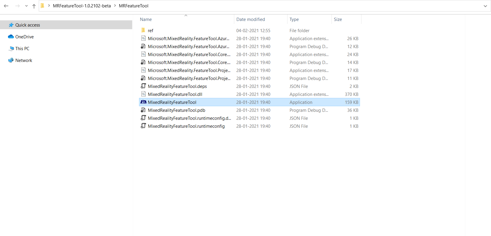

Once **MixedRealityFeatureTool** is opened click on start to get started with Mixed Reality Feature Tool.

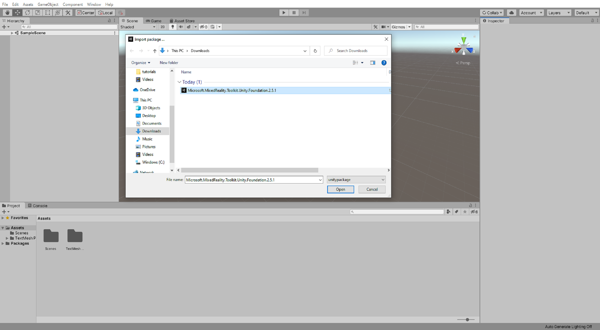

Features are grouped by category to make things easier to find, click on **Mixed Reality Toolkit** dropdown to find packages relating to the Mixed Reality Toolkit.

check the **Mixed Reality Toolkit Foundation**, and click on the dropdown next to it to select the required MRTK version, for this tutorial series please select **2.5.3**. then click on **Get features** button to download the selected packages.

Selected package **Mixed Reality Toolkit Foundation 2.5.3** is presented, along with its dependence package **Mixed Reality Toolkit Standard Assets 2.5.3** in the **Import Features** window.

You also need to set the location of the target unity project to provide the **Project path**, click on the **Three dots** next to the Project path and browse to your project folder in the explorer for example _D:\MixedRealityLearning\MRTK Tutorials_.

> [!NOTE]
> The dialog that's displayed when browsing for the Unity project folder contains '_' as the file name. There must be a value for the file name to enable the folder to be selected.

Next click on the **Validate** button to validate the selected package, you will get a popup with message **No validation issues were detected** click on **OK** to close the popup and click on **Import** button.

Click on **Approve** Button to add the **Mixed Reality Toolkit** into the project.

## Configuring the Unity project

### 1. Apply the MRTK Project Configurator settings

After Unity has finished importing the package from the previous section, the MRTK Project Configurator window should appear. If it doesn't, you can manually open it by going to **Mixed Reality Toolkit** > **Utilities** > **Configure Unity Project**:

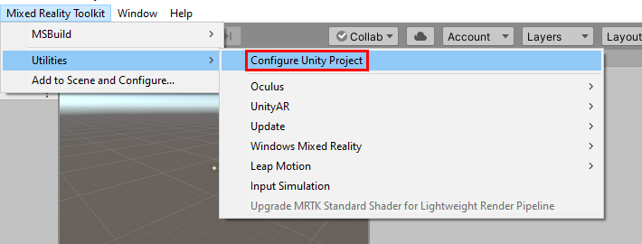

In the MRTK Project Configurator window, expand the **Modify Configurations** section, ensure all options are checked, and click the **Apply** button to apply the settings:

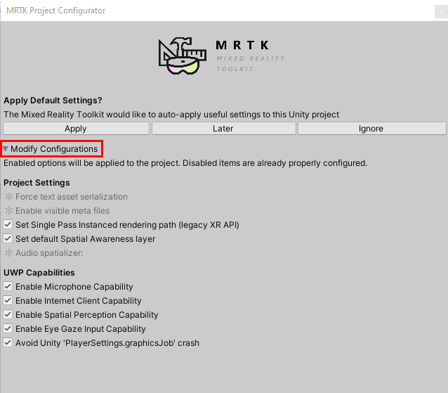

> [!TIP]
> Applying the MRTK Default Settings is optional but strongly recommended as it will help configure some recommended Unity settings:

> * Set Single Pass Instanced rendering path: Improves graphics performance by executing the render pipeline for both eyes in the same draw call. To learn more about this topic, you can refer to the [Single-Pass Instanced rendering](https://docs.microsoft.com/windows/mixed-reality/mrtk-unity/performance/perf-getting-started#single-pass-instanced-rendering) section of MRTK's [Performance](https://docs.microsoft.com/windows/mixed-reality/mrtk-unity/performance/perf-getting-started#single-pass-instanced-rendering) documentation.
> * Set default Spatial Awareness layer: Creates a Unity Layer named Spatial Awareness and configures MRTK to use this layer for the spatial awareness mesh. To learn more about Unity Layers, you can refer to Unity's <a href="https://docs.unity3d.com/Manual/Layers.html" target="_blank">Customizing Your Workspace</a> documentation.

### 2. Configure additional project settings

[!INCLUDE]

## Creating the scene and configuring MRTK

In the Unity menu, select **File** > **New Scene** to create a new scene:

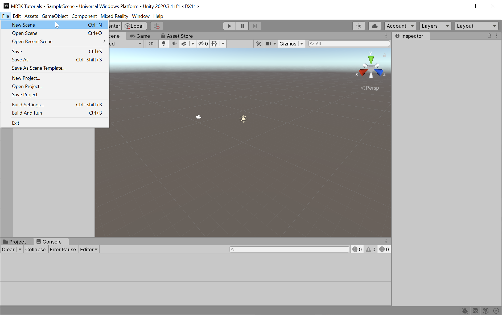

In the Unity menu, select **Mixed Reality Toolkit** > **Add to Scene and Configure...** to add the MRTK to your current scene:

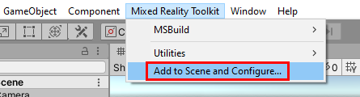

[!INCLUDE]

In the Unity menu, select **File** > **Save As...** to open the Save Scene window:

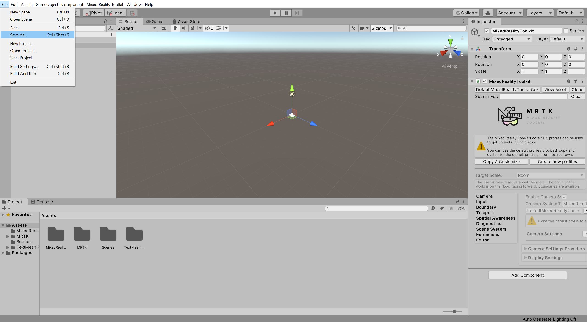

> [!TIP]
> Reducing the Depth Format to 16-bit is optional but my help improve graphics performance in your project. To learn more about this topic, you can refer to the   <a href="/windows/mixed-reality/mrtk-unity/performance/perf-getting-started.md#single-pass-instanced-rendering" target="_blank">  Depth buffer sharing (HoloLens) </a> section of MRTK's  <a href="/windows/mixed-reality/mrtk-unity/performance/perf-getting-started.md#single-pass-instanced-rendering" target="_blank"> Performance </a> documentation.

## Importing the tutorial assets

Download the following Unity custom package:

* [MRTK.HoloLens2.Unity.Tutorials.Assets.GettingStarted.2.5.0.1.unitypackage](https://github.com/microsoft/MixedRealityLearning/releases/download/getting-started-v2.5.0/MRTK.HoloLens2.Unity.Tutorials.Assets.GettingStarted.2.5.0.1.unitypackage)

To Import a Unity custom package, In the Unity menu, select **Assets** > **Import Package** > **Custom Package...** to open the Import package... window:

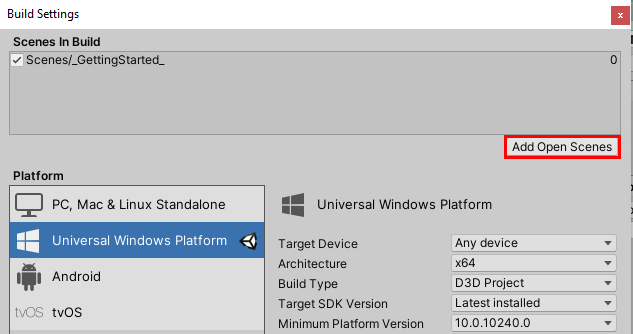

In the Import package... window, select the **MRTK.HoloLens2.Unity.Tutorials.Assets.GettingStarted.2.5.0.1.unitypackage** you downloaded and click the Open button:

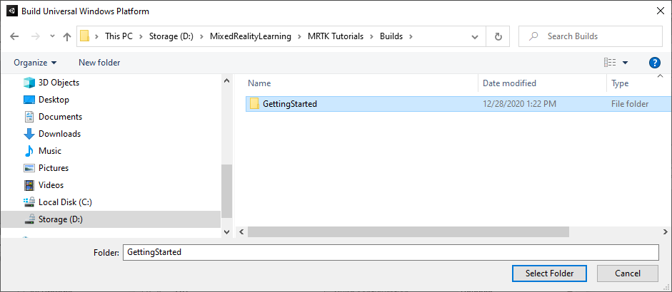

In the Import Unity Package window, click the All button to ensure all the assets are selected, then click the Import button to import the assets:

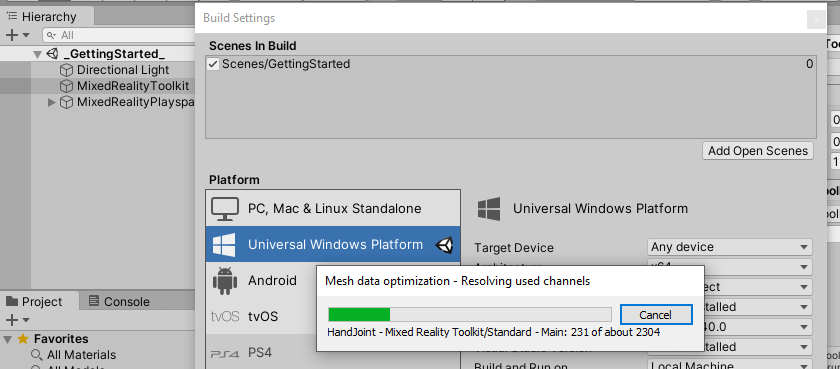

After you have imported the tutorial assets your Project window should look similar to this:

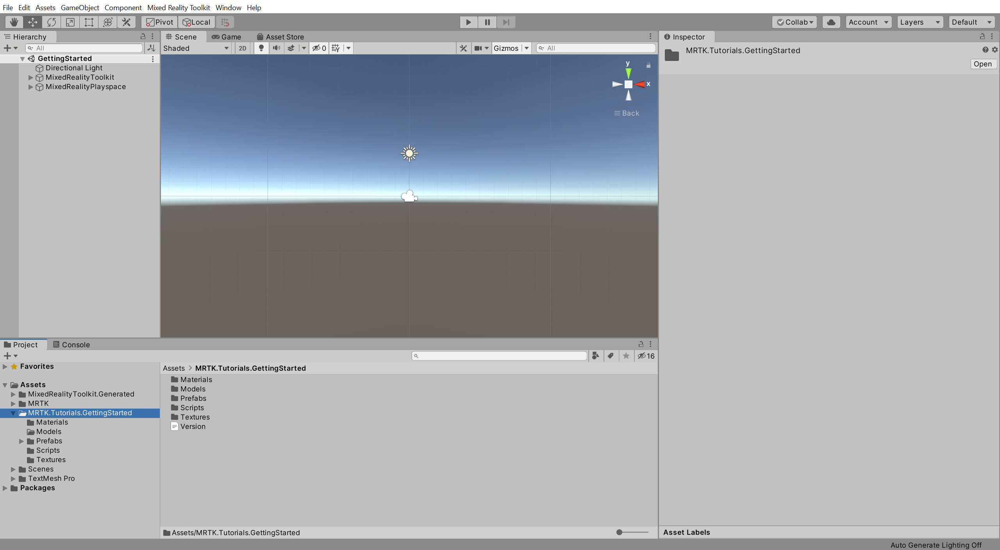

## Configuring the Scene

In the Project window, navigate to the Assets > MRTK.Tutorials.GettingStarted > Prefabs folder:

From the Project window, click-and-drag the **Cube** prefab on to the Hierarchy window, then in the Inspector window configure its **Transform** component as follows

* **Position**: X = 0, Y = 0, Z = 0.5
* **Rotation**: X = 0, Y = 0, Z = 0
* **Scale**: X = 1, Y = 1, Z = 1

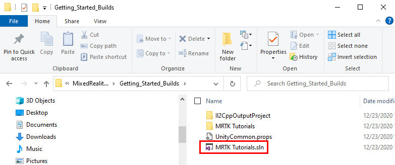

To focus in on the objects in the scene, you can double-click on the **Cube** object, and then zoom slightly in again:

To interact and grab an object with tracked hands, the object must have Collider component for example a **Box Collider**,  **Object Manipulator (Script)** component and **NearInteractionGrabbable(Script)** component.

With the **Cube** still selected in the Hierarchy window, in the Inspector window ,click on **Add Component** button, then search and select **Object Manipulator** script to add the Object Manipulator script to the cube object.

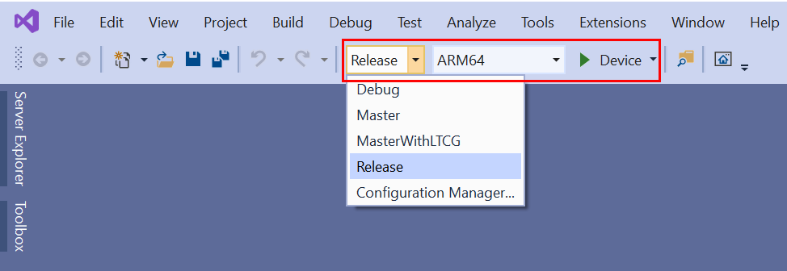

Repeat the same to add **Near Interaction Grabbable script** to the cube

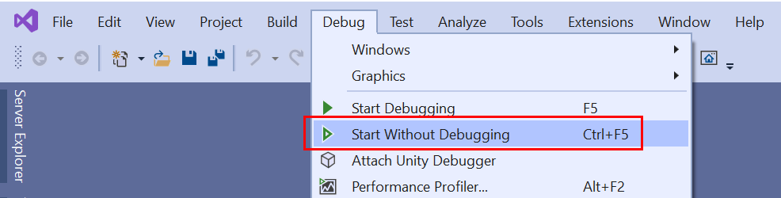

> [!NOTE]
> When you add a Object Manipulator (Script), in this case, the Constraint Manager (Script) is automatically added because Object Manipulator (Script) depends on it.

> [!NOTE]
> For the purpose of this tutorial, colliders have already been added to the Cube Object. To learn more about colliders, you can visit Unity's <a href="https://docs.unity3d.com/Manual/CollidersOverview.html" target="_blank">Collider</a> documentation.

To test this in the Unity editor, you can enter the play mode and hold the **LeftShift** or **Space** key to enable the controller, Mouse movement will move the controller and also it can be moved further or closer to the camera using the mouse wheel. Once the pointer is on the Cube  press and hold **Right Mouse Button** to move the the Cube object.

## Building your application to your HoloLens 2

### 1. Build the Unity project

In the Unity menu, select **File** > **Build Settings...** to open the Build Settings window.

In the Build Settings window, click the **Add Open Scenes** button to add your current scene to the **Scenes In Build** list, then click the **Build** button to open the Build Universal Windows Platform window:

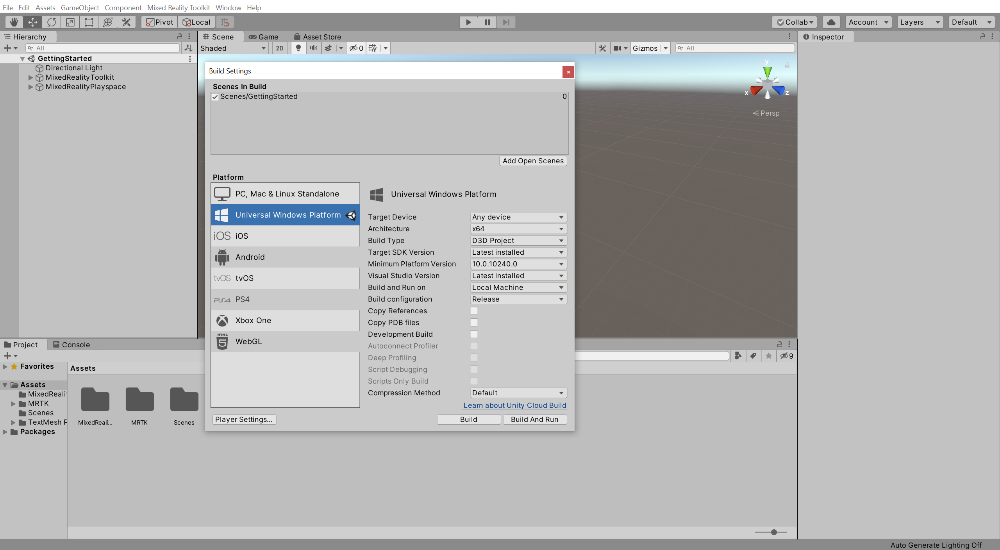

In the Build Universal Windows Platform window, choose a suitable location to store your build, for example, _D:\MixedRealityLearning\Builds_, create a new folder and give it a suitable name, for example, _GettingStarted_, and then click the **Select Folder** button to start the build process:

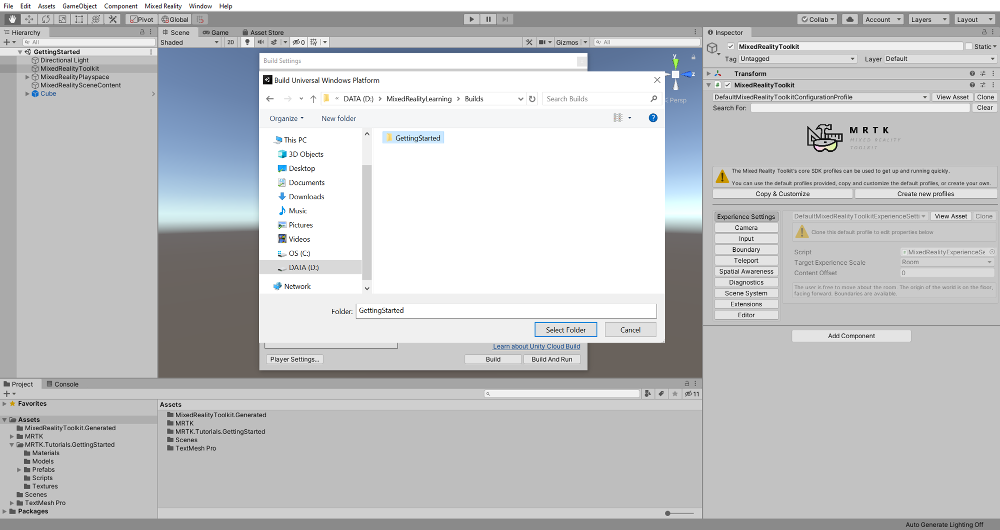

Wait for Unity to finish the build process:

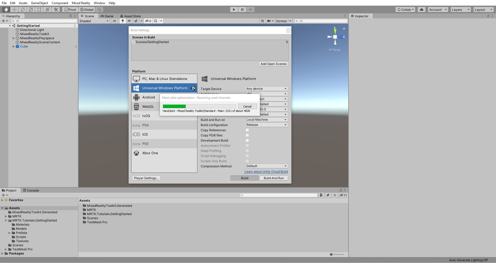

### 2. Build and deploy the application

When the build process has completed, Unity will prompt Windows File Explorer to open the location you stored the build. Navigate inside the folder, and double-click the solution file to open it in Visual Studio:

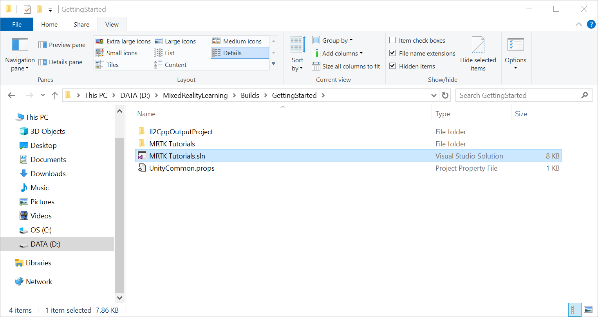

> [!NOTE]
> If Visual Studio asks you to install new components, take a moment to check that you have all the prerequisite components in the **[Install the Tools](../../install-the-tools.md)** documentation.

Configure Visual Studio for HoloLens by selecting the **Master** or **Release** configuration, the **ARM64** architecture, and **Device** as target:

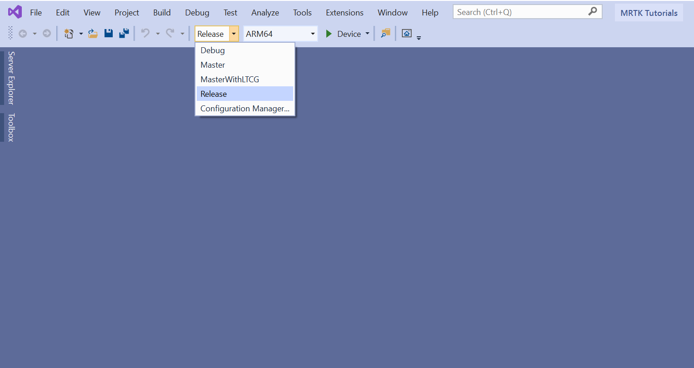

> [!TIP]
> If you're deploying to HoloLens (1st generation), select the **x86** architecture.

> [!NOTE]
> For HoloLens, you will typically build for the ARM architecture. However, there is a  <a href="https://github.com/microsoft/MixedRealityToolkit-Unity" target="_blank"><strong>known issue</strong></a> in Unity 2019.3 that causes errors when selecting ARM as the build architecture in Visual Studio. The recommended workaround is to build for ARM64. If that is not an option, go to **Edit > Project Settings > Player > Other Settings** and disable **Graphics Jobs**.

> [!NOTE]
> If you don't see Device as a target option, you may need to change the startup project for the Visual Studio solution from the IL2CPP project to the UWP project. To do this, in the Solution Explorer, right-click on YourProjectName (Universal Windows) and select **Set as StartUp Project**.

Connect your HoloLens to your computer, then select **Debug** > **Start Without Debugging** to build and deploy to your device:

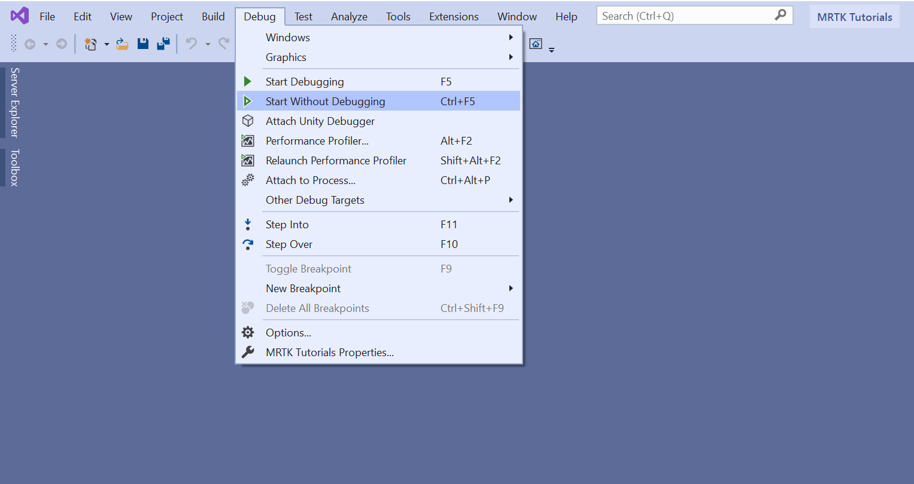

> [!IMPORTANT]
> Before building to your device, the device must be in Developer Mode and paired with your development computer. Both of these steps can be completed by following [these instructions](../../platform-capabilities-and-apis/using-visual-studio.md).

> [!TIP]
> You can also deploy to the [HoloLens Emulator](../../platform-capabilities-and-apis/using-the-hololens-emulator.md) or create an [App Package](/windows/uwp/packaging/packaging-uwp-apps) for sideloading.

Using Start Without Debugging automatically starts the app on your device without the Visual Studio debugger attached.

Select **Build > Deploy Solution** to deploy to your device without having the app start automatically.

> [!NOTE]
>You may notice the Diagnostics profiler in the app, which you can toggle on or off by using the speech command **Toggle Diagnostics**. It's recommended that you keep the profiler visible most of the time during development to understand when changes to the app may impact performance. For example, HoloLens apps should [continuously run at 60 FPS](../../platform-capabilities-and-apis/understanding-performance-for-mixed-reality.md).

## Congratulations

You've now deployed your first HoloLens app. Once the app is opened you should see a Cube object in front of you and should be able to interact with the cube by moving it and also as you walk around, you should see a spatial mapping mesh covering the surfaces that are perceived by the HoloLens. Additionally, you should see indicators on your hands and fingers for hand tracking and a frame rate counter for keeping an eye on app performance. These features are just a few foundational pieces included with MRTK. In the upcoming tutorials, you'll add content to your scene to explore the capabilities of HoloLens and the MRTK.

> [!div class="nextstepaction"]
> [Next Tutorial: 3. Configuring the MRTK profiles](mr-learning-base-03.md)