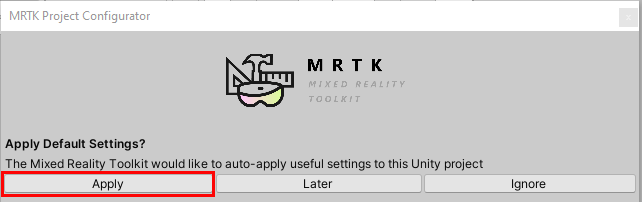
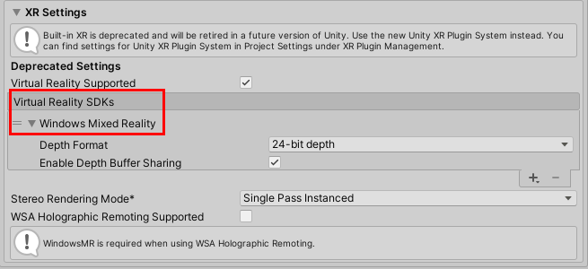
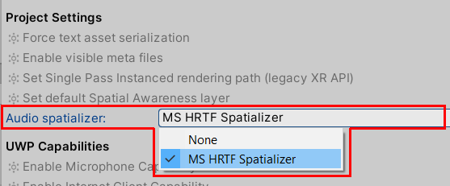
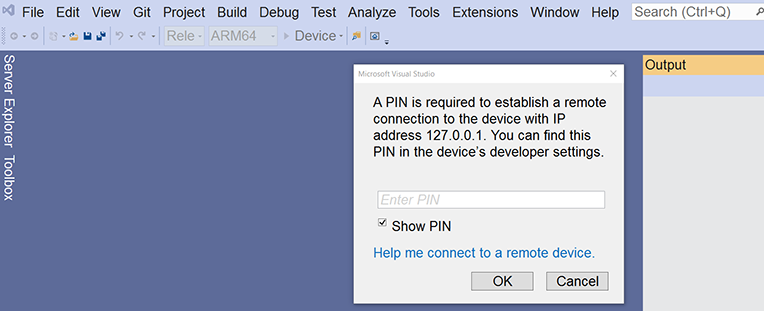

# 2. Initializing your project and deploying your first application

In this tutorial, you'll learn how to create a new Unity project, configure it for <a href="https://github.com/microsoft/MixedRealityToolkit-Unity" target="_blank">Mixed Reality Toolkit (MRTK)</a> development, and import MRTK. You'll also walk through configuring, building, and deploying a basic Unity scene from Visual Studio to your HoloLens 2. Once you have deployed it to your HoloLens 2, you should see a spatial mapping mesh covering the surfaces that are perceived by the HoloLens. Additionally, you should see indicators on your hands and fingers for hand tracking and a frame rate counter for keeping an eye on app performance.

## Objectives

* Learn how to configure Unity for HoloLens development.
* Learn how to build and deploy your app to HoloLens.
* Experience the spatial mapping mesh, hand meshes, and  framerate counter on your HoloLens 2 device.

## Creating the Unity project

1. Launch **Unity Hub**, select the **Projects** tab, and then click the **down arrow** next to the **New** button:

2. In the dropdown menu, select the Unity version specified in the [Prerequisites](mr-learning-base-01.md#prerequisites):

> [!TIP]
> If the particular Unity version is not available in Unity Hub, you can initiate the installation from Unity's <a href="https://unity3d.com/get-unity/download/archive" target="_blank">Download Archive</a>.

3. In the **Create a new project** window, do the following:

    * Ensure **Templates** is set to **3D**.
    * In the **Project Name** box, enter a suitable name for your project (for example, "MRTK Tutorials").
    * Click the three-dot button next to **Location**, and then navigate to the folder where you want to save your project.

> [!CAUTION]
> When working on Windows, there is a MAX_PATH limit of 255 characters. Because of this, you should save the Unity project close to the root of the drive.

    * Click the **Create** button. This creates and launches your new Unity project.

The status bar keeps you updated on your progress.

## Switching the build platform

1. On the menu bar, select **File** > **Build Settings...**

2. In the **Build Settings** window, select **Universal Windows Platform** and then click the **Switch Platform** button:

3. Wait for Unity to finish switching the platform, and then close the **Build Settings** window.

## Importing the TextMeshPro Essential Resources

The TextMeshPro Essential Resources are required by MRTK's UI elements. If you are not planning to use MRTK's UI elements in your project, you can skip this step.

1. On the menu bar, select **Window** > **TextMeshPro** > **Import TMP Essential Resources**.

2. In the **Import Unity Package** window, click the **All** button to ensure that all the assets are selected, and then click the **Import** button to import the assets:

## Importing the Mixed Reality Toolkit

1. Download the Unity custom package:

    [Microsoft.MixedReality.Toolkit.Unity.Foundation.2.4.0.unitypackage](https://github.com/microsoft/MixedRealityToolkit-Unity/releases/download/v2.4.0/Microsoft.MixedReality.Toolkit.Unity.Foundation.2.4.0.unitypackage)

2. On the menu bar, select **Assets** > **Import Package** > **Custom Package...**.
3. In the **Import package...** dialog, navigate to the location of the package you just downloaded, then select it, and then click the **Open** button.
4. In the **Import Unity Package** window, click the **All** button to ensure that all the assets are selected, and then click the **Import** button to import the assets.

## Selecting MRTK and project settings

After Unity has finished importing the package from the previous section, the **MRTK Project Configurator** window should appear. If it doesn't, you can manually open it by going to **Mixed Reality Toolkit** > **Utilities** > **Configure Unity Project**:

1. In the **MRTK Project Configurator** window, expand the **Modify Configurations** section, if necessary, and then ensure that all options are selected.

2. To apply the settings, click the **Apply** button.

> [!NOTE]
> You are using Unity's built-in legacy XR instead of the new XR Plugin System because the new system is not fully compatible with the [recommended Unity and MRTK versions](mr-learning-base-01.md#prerequisites) for this tutorial series. If you see any warnings about built-in XR being deprecated, you can ignore them.

> [!TIP]
> Applying the MRTK Default Settings is optional but strongly recommended as it will help configure some recommended Unity settings:
>
> * Enable legacy XR: Enables VR for the project.
> * Set Single Pass Instanced rendering path: Improves graphics performance by executing the render pipeline for both eyes in the same draw call. To learn more about this topic, you can refer to the [Single-Pass Instanced rendering](https://microsoft.github.io/MixedRealityToolkit-Unity/Documentation/Performance/PerfGettingStarted.html#single-pass-instanced-rendering) section of MRTK's [Performance](https://microsoft.github.io/MixedRealityToolkit-Unity/Documentation/Performance/PerfGettingStarted.html) documentation.
> * Set default Spatial Awareness layer: Creates a Unity Layer named Spatial Awareness and configures MRTK to use this layer for the spatial awareness mesh. To learn more about Unity Layers, you can refer to Unity's <a href="https://docs.unity3d.com/Manual/Layers.html" target="_blank">Customizing Your Workspace</a> documentation.

3. On the menu bar, select **Edit** > **Project Settings...** .

4. In the **Project Settings** window, select **Player**, then click the **XR Settings** dropdown, and then select the box next to **Virtual Reality Supported**:

This imports the Windows Mixed Reality SDK:

After Unity has finished importing the Windows Mixed Reality SDK, the **MRTK Project Configurator** window should appear again. If it doesn't, select **Mixed Reality Toolkit** > **Utilities** > **Configure Unity Project** to open it.

5. In the **MRTK Project Configurator** window, click the **Audio spatializer** dropdown, and then select **MS HRTF Spatializer**.

6. Click the **Apply** button. This closes the **MRTK Project Configurator** window.

    > [!TIP]
    > Setting the Audio spatializer property is optional but may improve the audio experience in your project. If you set it to MS HRTF Spatializer, this spatializer plugin will be used when Unity's AudioSource.spatialize property is enabled. To learn more about this topic, you can refer to the Spatial audio tutorials.

7. In the **Project Settings** window, click the **Depth Format** dropdown, and then select **16-bit depth**:

    :::image type="content" source="images/mr-learning-base/base-02-section5-step2-4.png" alt-text="Unity XR Settings with 16-bit depth selected.":::

    > [!TIP]
    > Reducing the Depth Format to 16-bit is optional but may help improve graphics performance in your project. To learn more about this topic, you can refer to the [Depth buffer sharing (HoloLens)](https://microsoft.github.io/MixedRealityToolkit-Unity/Documentation/Performance/PerfGettingStarted.html#depth-buffer-sharing-hololens) section of MRTK's [Performance](https://microsoft.github.io/MixedRealityToolkit-Unity/Documentation/Performance/PerfGettingStarted.html) documentation.

8. Click the **Publishing Settings** drop-down, and then in the **Package name** box, enter a suitable name (for example, "MRTK-Tutorials-Getting-Started").

    :::image type="content" source="images/mr-learning-base/base-02-section5-step2-5.png" alt-text="Unity Publishing Settings with Package name configured.":::

    **Package Name and Product Name**

    - The 'Package name' is the unique identifier for the app. You should create this identifier before deploying the app to avoid overwriting previously installed apps.
    - The 'Product Name' is the name displayed in the HoloLens Start menu. To make the app easier to locate during development, you can add an underscore in front of the name to sort it to the top.

    :::image type="content" source="images/mr-learning-base/product-name.png" alt-text="Unity Project Settings with Product name configured.":::

9. Close the **Project Settings** window.

## Creating and configuring the scene

1. On the menu bar, select **File** > **New Scene**.
2. To add the MRTK to the scene, on the menu bar, select **Mixed Reality Toolkit** > **Add to Scene and Configure...**.

    :::image type="content" source="images/mr-learning-base/base-02-section6-step1-2.png" alt-text="Unity Add to Scene and Configure... menu path.":::

3. In the **Hierarchy** window, ensure that **MixedRealityToolkit** is selected.

    :::image type="content" source="images/mr-learning-base/select-mixed-reality-toolkit.png" alt-text="Ensure that MixedRealityTookit is selected.":::

4. In the **Inspector** window's **MixedRealityToolkit** section, verify that the configuration profile is set to **DefaultMixedRealityToolkitConfigurationProfile**:

    :::image type="content" source="images/mr-learning-base/base-02-section6-step1-3.png" alt-text="Unity MixedRealityToolkit component with DefaultMixedRealityTookitConfigurationProfile selected.":::

    > [!IMPORTANT]
    > Typically, you will use the DefaultHoloLens2ConfigurationProfile when developing for HoloLens. However, for this tutorial, you will use the DefaultMixedRealityToolkitConfigurationProfile. In the next tutorial, [Configuring the MRTK profiles](mr-learning-base-03.md), you will change to the DefaultHoloLens2ConfigurationProfile.

5. On the menu bar, select **File** > **Save As...**
6. In the **Save Scene** dialog, navigate to your project's **Scenes** folder. In the **File name** box, give your scene a suitable name (for example, "\_GettingStarted\_"), and then click the **Save** button.

    :::image type="content" source="images/mr-learning-base/base-02-section6-step1-5.png" alt-text="Unity save scene Save prompt window.":::

## Building and deploying to your HoloLens 2

> Before building to your device, confirm the following:
- Your device is in Developer Mode.
- Your device is paired with your development computer. If it's not, you will see the following dialog box in Visual Studio during the build process:

 To learn more about both of these steps, see [Using Visual Studio to deploy and debug](../../platform-capabilities-and-apis/using-visual-studio.md).

1. On the menu bar, select **File** > **Build Settings...**.
2. In the **Build Settings** window, click the **Add Open Scenes** button to add your current scene to the **Scenes In Build** list.

3. Click the **Build** button.

    :::image type="content" source="images/mr-learning-base/build-button.png" alt-text="Click the Build button.":::

4. In the **Build Universal Windows Platform** dialog, choose a suitable location to store your build (for example, you may want to create a "Builds" folder in your "MRTK Tutorials" folder). Create a new folder and give it a suitable name (for example, "GettingStarted"), then select the folder, and then click the **Select Folder** button to start the build process.

    :::image type="content" source="images/mr-learning-base/base-02-section7-step1-2.png" alt-text="Unity Build window with your build folder displayed.":::

    A status bar appears and keeps you updated on your build progress.

    :::image type="content" source="images/mr-learning-base/base-02-section7-step1-3.png" alt-text="Unity build process in progress.":::

    > [!TIP]
    > You can also deploy to the [HoloLens Emulator](../../platform-capabilities-and-apis/using-the-hololens-emulator.md) or create an [App Package](https://docs.microsoft.com/windows/uwp/packaging/packaging-uwp-apps) for sideloading.

5. When the build process has completed, in File Explorer, navigate to the location where you stored the build, and then double-click the solution file to open it in Visual Studio:

    :::image type="content" source="images/mr-learning-base/base-02-section8-step1-1.png" alt-text="Windows Explorer with newly created Visual Studio solution file selected.":::

    > [!NOTE]
    > If Visual Studio asks you to install new components, take a moment to check that you have all the prerequisite components in the **[Install the Tools](../../install-the-tools.md)** documentation.

6. Configure Visual Studio for HoloLens by selecting the **Master** or **Release** configuration, the **ARM64** architecture, and **Device** as the target.

    > [!TIP]
    > If you're deploying to HoloLens (1st generation), select the **x86** architecture.

    :::image type="content" source="images/mr-learning-base/base-02-section8-step1-2.png" alt-text="Visual Studio configured for deployment to HoloLens 2.":::

    > [!NOTE]
    > For HoloLens, you will typically build for the ARM architecture. However, there is a  <a href="https://github.com/microsoft/MixedRealityToolkit-Unity" target="_blank"><strong>known issue</strong></a> in Unity 2019.3 that causes errors when selecting ARM as the build architecture in Visual Studio. The recommended workaround is to build for ARM64. If that is not an option, go to **Edit > Project Settings > Player > Other Settings** and disable **Graphics Jobs**.

    > [!NOTE]
    > If you don't see Device as a target option, you may need to change the startup project for the Visual Studio solution from the IL2CPP project to the UWP project. To do this, in the Solution Explorer, right-click on YourProjectName (Universal Windows), and then select **Set as StartUp Project**.

7. Connect your HoloLens to your computer, and then do one of the following:
- To build the app, deploy it to your HoloLens, and start it automatically without the Visual Studio debugger attached, on the menu bar, select **Debug** > **Start Without Debugging**.

    :::image type="content" source="images/mr-learning-base/base-02-section8-step1-3.png" alt-text="Visual Studio Start Without Debugging menu path.":::

- To build and deploy the app to your HoloLens but not have it start automatically, on the menu bar, select **Build > Deploy Solution**.

    > [!NOTE]
    >You may notice the Diagnostics profiler in the app, which you can toggle on or off by using the speech command **Toggle Diagnostics**. It's recommended that you keep the profiler visible most of the time during development to understand when changes to the app may impact performance. For example, HoloLens apps should [continuously run at 60 FPS](../../platform-capabilities-and-apis/understanding-performance-for-mixed-reality.md).

## Congratulations

You've now deployed your first HoloLens app. As you walk around, you should see a spatial mapping mesh covering the surfaces that are perceived by the HoloLens. Additionally, you should see indicators on your hands and fingers for hand tracking and a frame rate counter for keeping an eye on app performance. These features are just a few foundational pieces included with MRTK. In the upcoming tutorials, you'll add content to your scene to explore the capabilities of HoloLens and the MRTK.

> [!div class="nextstepaction"]
> [Next Tutorial: 3. Configuring the MRTK profiles](mr-learning-base-03.md)
