# 3. Configuring the MRTK profiles

## Overview

In this tutorial, you will learn how to customize and configure the MRTK profiles.

The <a href="/windows/mixed-reality/mrtk-docs/features/profiles/profiles.md" target="_blank">MRTK profiles</a> is a tree of nested profiles that make up the configuration information for how the MRTK systems and features should be initialized. The top-level profile, the Configuration Profile, contains nested profiles for each of the primary core systems. Each nested profile is designed to configure the behavior of their corresponding system.

This particular example will show you how to hide the spatial awareness mesh by changing the settings of the Spatial Mesh Observer. However, you may follow these same principles to customize any setting or value in the MRTK profiles.

As you experienced when you deployed your project to your HoloLens 2 during the [previous tutorial](mr-learning-base-02.md#congratulations), the <a href="/windows/mixed-reality/mrtk-docs/features/spatial-awareness/spatial-awareness-getting-started.md" target="_blank">Spatial Awareness</a> mesh is a collection of meshes representing the geometry of the environment. It's a helpful visualization to see initially but it's typically turned off to avoid the visual distraction and the additional performance hit of having it on.

## Objectives

* Learn how to customize and configure MRTK profiles
* Hide the spatial awareness mesh

## Changing the Spatial Awareness Display Option

The main steps you will take to hide the spatial awareness mesh are:

1. Clone the default Configuration Profile
2. Enable the Spatial Awareness System
3. Clone the default Spatial Awareness System Profile
4. Clone the default Spatial Awareness Mesh Observer Profile
5. Change the visibility of the spatial awareness mesh

> [!NOTE]
> By default, the MRTK profiles are not editable. These are default profile templates that you have to clone before they can be edited. There are several nested layers of profiles. Therefore, it is common to clone and edit several profiles when configuring one or more settings.

### 1. Clone the default Configuration Profile

> [!NOTE]
> The Configuration Profile is the top-level profile. Consequently, to be able to edit any other profiles, you first have to clone the Configuration Profile.

In the Hierarchy window, select the **MixedRealityToolkit** object, then in the Inspector window, change the **MixedRealityToolkit** Configuration Profile to the **DefaultHoloLens2ConfigurationProfile**:

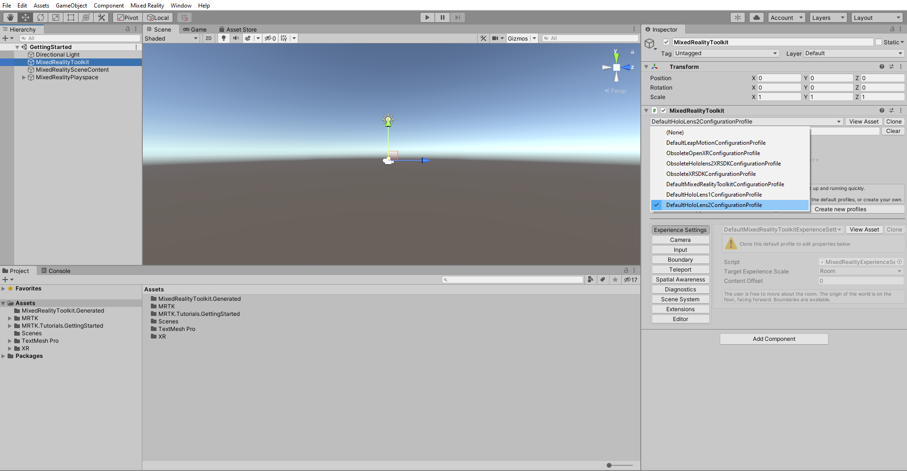

With the **MixedRealityToolkit** object still selected, in the Inspector window, click the **Copy & Customize** button to open the Clone Profile window:

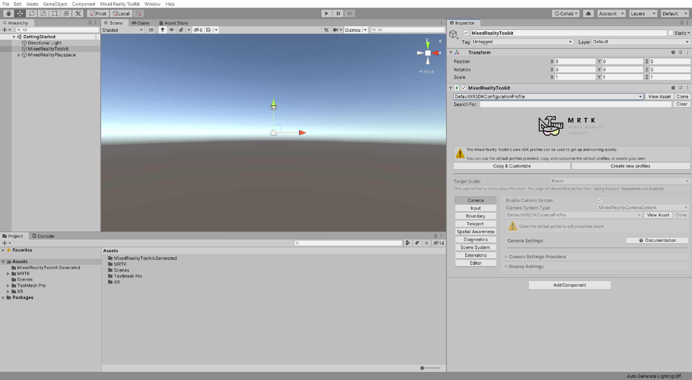

In the Clone Profile window, enter a suitable **Profile Name**, for example, _GettingStarted_HoloLens2ConfigurationProfile_, then click the **Clone** button to create an editable copy of the **DefaultHololens2ConfigurationProfile**:

The newly created Configuration Profile is now assigned as the Configuration Profile for your scene:

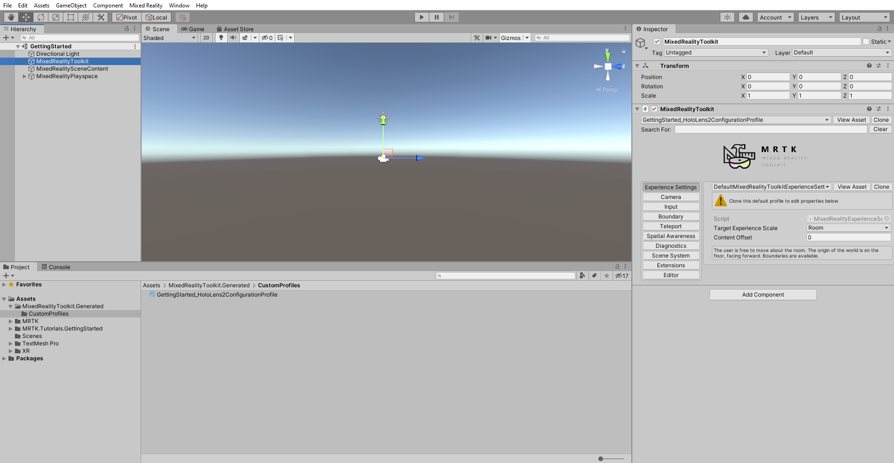

In the Unity menu, select **File** > **Save** to save your scene.

> [!TIP]
> Remember to save your work throughout the tutorials.

### 2. Enable the Spatial Awareness System

In the Hierarchy window, select the **MixedRealityToolkit** object, then in the Inspector window, select the **Spatial Awareness** tab, and then check the **Enable Spatial Awareness System** checkbox:

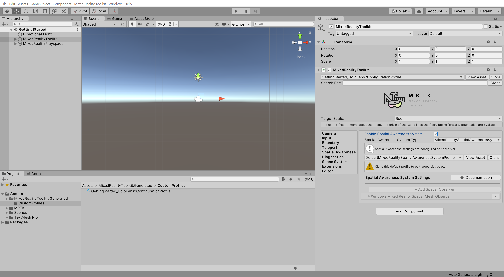

> [!NOTE]
> For future projects, if your app doesn't need to respond to or interact with the environment, it's recommended to keep the spatial awareness turned off to reduce performance cost.

### 3. Clone the default Spatial Awareness System Profile

In the **Spatial Awareness** tab, click the **Clone** button to open the Clone Profile window:

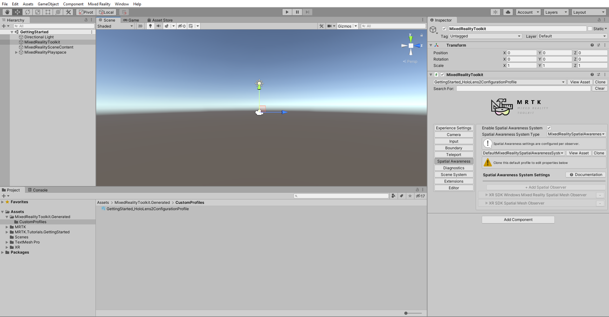

In the Clone Profile window, enter a suitable **Profile Name**, for example, _GettingStarted_MixedRealitySpatialAwarenessSystemProfile_, then click the **Clone** button to create an editable copy of the **DefaultMixedRealitySpatialAwarenessSystemProfile**:

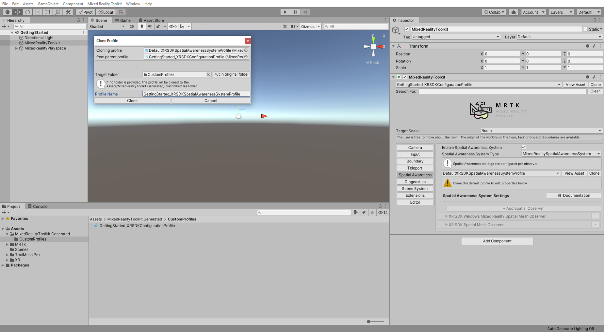

The newly created Spatial Awareness System Profile is now automatically assigned to your Configuration Profile:

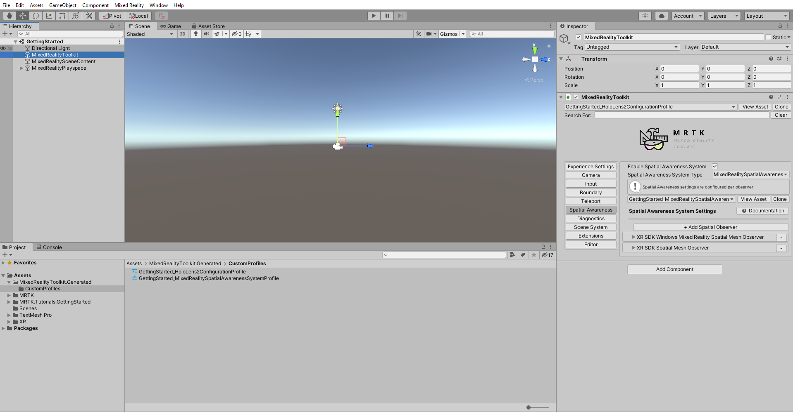

### 4. Clone the default Spatial Awareness Mesh Observer Profile

With the **Spatial Awareness** tab still selected, expand the **Windows Mixed Reality Spatial Mesh Observer** section, then click the **Clone** button to open the Clone Profile window:

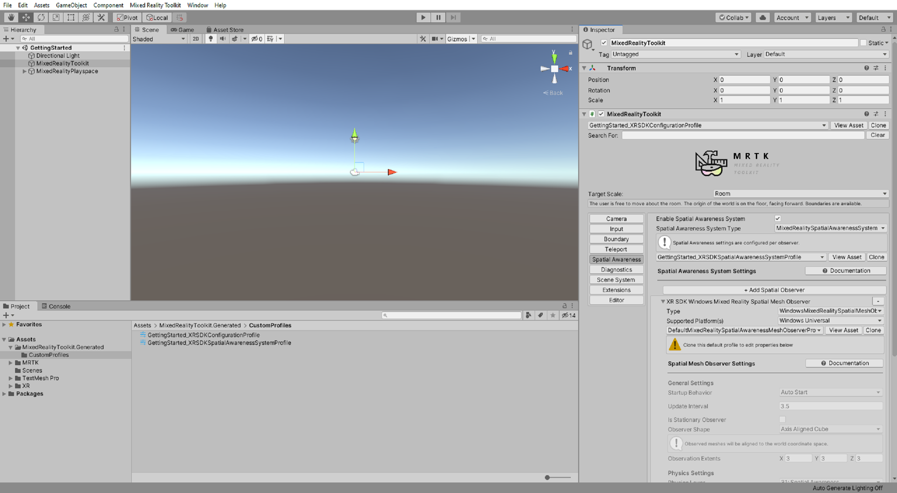

In the Clone Profile window, enter a suitable **Profile Name**, for example, _GettingStarted_MixedRealitySpatialAwarenessMeshObserverProfile_, then click the **Clone** button to create an editable copy of the **DefaultMixedRealitySpatialAwarenessMeshObserverProfile**:

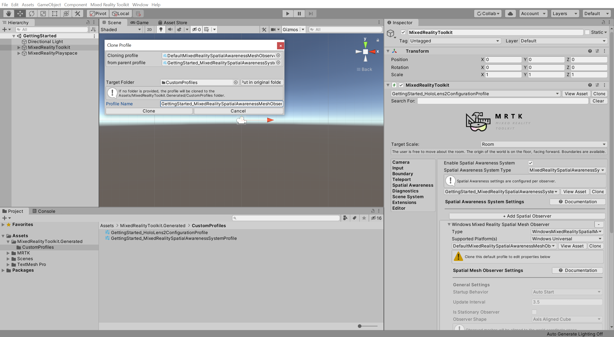

The newly created Spatial Awareness Mesh Observer Profile is now automatically assigned to your Spatial Awareness System Profile:

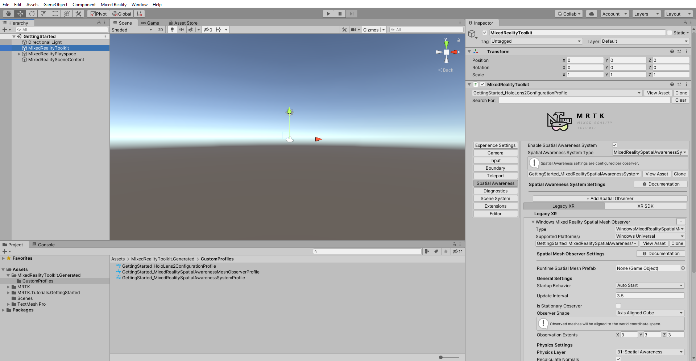

### 5. Change the visibility of the spatial awareness mesh

In the **Spatial Mesh Observer Settings**, change the **Display Option** to **Occlusion** to make the spatial mapping mesh invisible while still functional:

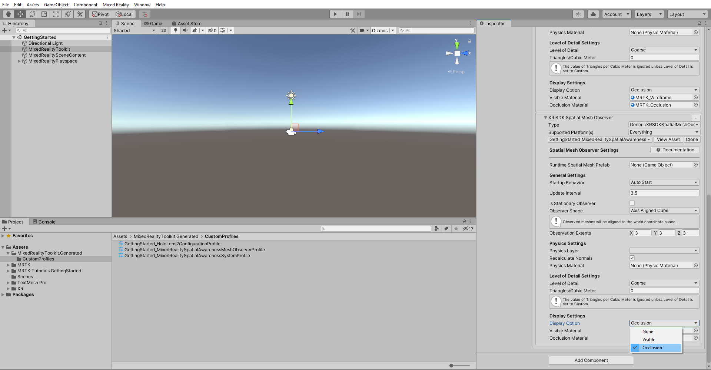

> [!NOTE]
> Although the spatial mapping mesh is not visible, it is still present and functional. For example, any holograms behind the spatial mapping mesh, such as a hologram behind a physical wall, will not be visible.

You just learned how to modify a setting in the MRTK profile. As you can see, to customize the MRTK settings, you first need to create copies of the default profiles. Because the default profiles are not editable, you will always have them as references if you want to revert to the default settings. To learn more about MRTK profiles and their architecture, you can refer to the [MRTK profile configuration guide](https://docs.microsoft.com/windows/mixed-reality/mrtk-docs/configuration/mixed-reality-configuration-guide.md) in the [MRTK Documentation Portal](https://docs.microsoft.com/windows/mixed-reality/mrtk-docs).

## Congratulations

In this tutorial, you learned how to clone, customize, and configure MRTK profiles and settings.

> [!div class="nextstepaction"]
> [Next Tutorial: 4. Positioning objects in the scene](mr-learning-base-04.md)