# 5. Creating dynamic content using Solvers

In this tutorial, you will explore ways to dynamically place holograms using the MRTK's available placement tools, known as Solvers, to solve complex spatial placement scenarios. In the MRTK, Solvers are a system of scripts and behaviors used to allow objects to follow you, the user, or other game objects in the scene. They can also be used to snap to certain positions, making your app more intuitive.

## Objectives

* Introduce the MRTK's Solvers
* Learn how to use Solvers to direct the user to objects
* Learn how to use Solvers to reposition objects

## Location of Solvers in the MRTK

 The MRTK's Solvers are located in the MRTK SDK folder. To see the available Solvers in your project, in the Project window, navigate to **Packages** > **Mixed Reality Toolkit Foundation** > **SDK** > **Features** > **Utilities** > **Solvers**:

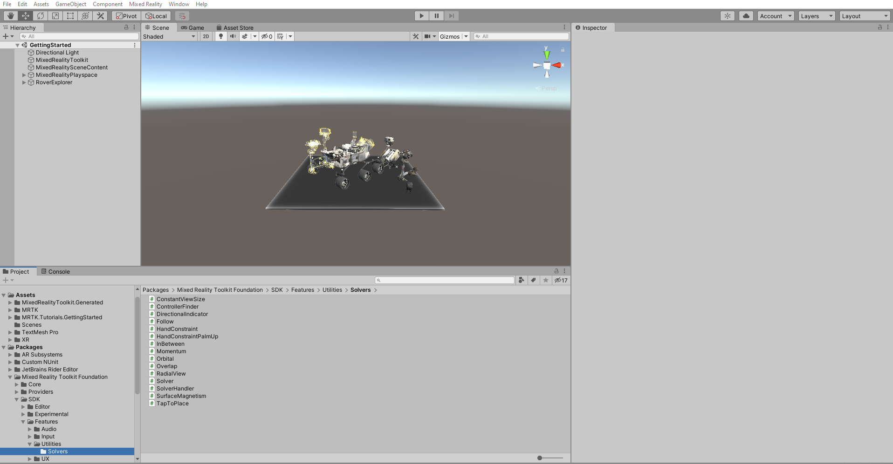

In this tutorial, we will review the implementation of the Directional Indicator Solver and the Tap To Place Solver. To learn more about the full range of Solvers available in the MRTK, you can refer to the [Solvers](/windows/mixed-reality/mrtk-unity/features/ux-building-blocks/solvers/solver) guide in the [MRTK Documentation Portal](/windows/mixed-reality/mrtk-unity).

> [!NOTE]
> The Directional Indicator Solver is not located in the Solvers folders referenced above, but in the Packages > Mixed Reality Toolkit Foundation > SDK > Experimental > Features > Utilities folders, because it is an experimental feature.

## Using the Directional Indicator Solver to direct the user to objects

In the Project window, navigate to the **Assets** > **MRTK.Tutorials.GettingStarted** > **Prefabs** folder, click-and-drag the **Chevron** prefab into the Hierarchy window, and set it's Transform **Position** to X = 0, Y = 0, Z = 2 to position it near the RoverExplorer object:

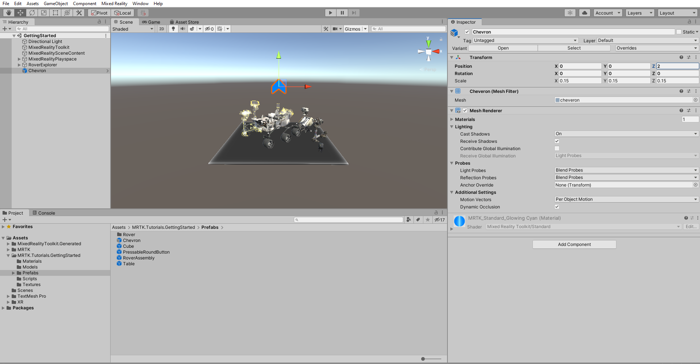

> [!TIP]
> If you find that the camera or any other icons in your scene are hiding the objects or are distracting, you can hide these by <a href="https://docs.unity3d.com/2019.1/Documentation/Manual/GizmosMenu.html" target="_blank">toggling the Gizmos</a> to the off position, as shown in the image above. To learn more about the Gizmos menu and how you can use it to optimize your scene view, you can refer to Unity's <a href="https://docs.unity3d.com/Manual/GizmosMenu.html" target="_blank">Gizmos menu</a> documentation.

Rename the newly added Chevron object to **Indicator**, then in the Inspector window, use the **Add Component** button to add the **DirectionalIndicator**:

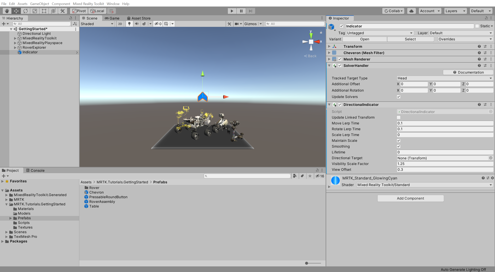

> [!NOTE]
> When you add a Solver, in this case, the DirectionalIndicator component, the SolverHandler component is automatically added because Solvers require it.

Configure the DirectionalIndicator and SolverHandler components as follows:

* Verify that the **SolverHandler** component's **Tracked Target Type** is set to **Head**
* Assign the **RoverExplorer** to the **DirectionalIndicator** component's **Directional Target** by dragging it from the Hierarchy window into the **None (Transform)** field
* Change the **View Offset** to 0.2

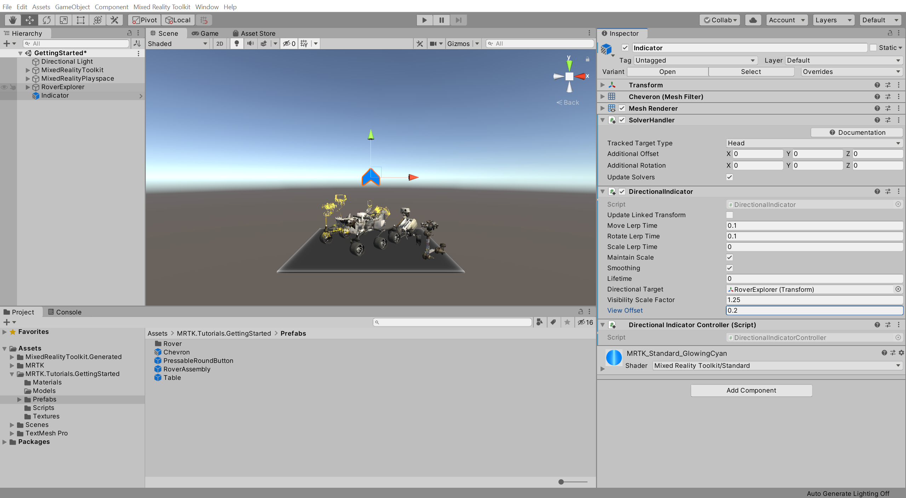

Press the Play button to enter Game mode, press-and-hold the right mouse button while moving your mouse to the left or right to rotate your gaze direction, and notice the following:

* When you look away from the RoverExplorer object, the Indicator object will appear and point towards the RoverExplorer object

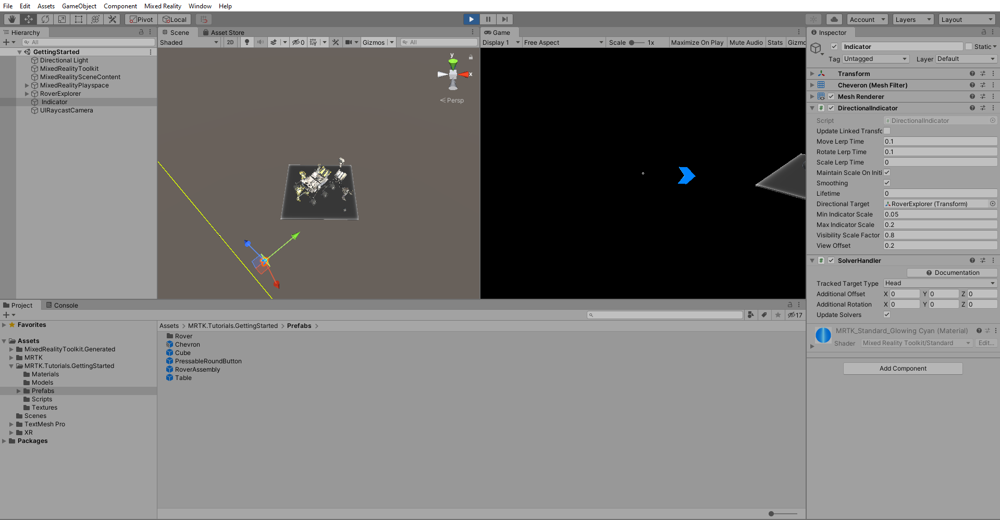

> [!NOTE]
> If you don't see the camera ray in your Scene window, make sure your Gizmos menu is enabled, as shown in the image above.

> [!TIP]
> To learn how to use the in-editor input simulation, you can refer to the [Using the In-Editor Hand Input Simulation to test a scene](https://microsoft.github.io/MixedRealityToolkit-Unity/Documentation/GettingStartedWithTheMRTK.html#using-the-in-editor-hand-input-simulation-to-test-a-scene) guide in the [MRTK Documentation Portal](/windows/mixed-reality/mrtk-unity).

> [!TIP]
> If your computer has a microphone, you can easily toggle the active state of the Diagnostics panel that appears in the Game window by using the speech command "toggle diagnostics." Alternatively, you can disable it in the MRTK Configuration Profile > Diagnostics > Enable Diagnostics System. However, it is generally recommended to keep the Diagnostics System active during development.

## Using the Tap to Place Solver to reposition objects

In the Hierarchy window, select the RoverExplorer > **RoverAssembly** object, then in the Inspector window, use the **Add Component** button to add the **Tap To Place (Script)** component, and configure it as follows:

* Verify that the **SolverHandler** component's **Tracked Target Type** is set to **Head**
* Uncheck the **Use Default Surface Normal Offset** and ensure **Surface Normal Offset** is set to 0
* Check the **Keep Orientation Vertical** checkbox
* From the **Magnetic Surfaces** > **Element 0** dropdown, uncheck all options expect **Spatial Awareness**

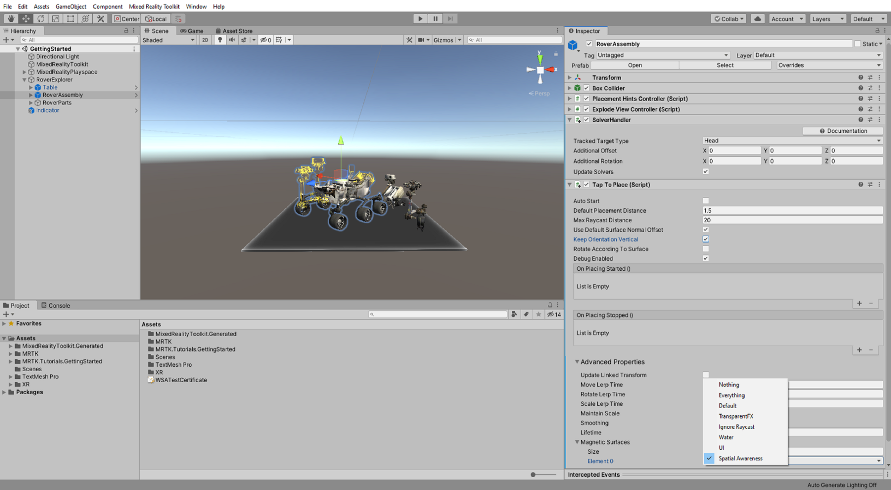

> [!NOTE]
> The Magnetic Surfaces setting determines which objects the Tap To Place (Script) component can detect when placing an object. By changing the setting to only Spatial Awareness, the Tap To Place (Script) component will only be able to place the Rover on objects on the Unity Layer named Spatial Awareness, which by default is the Spatial Awareness Mesh generated by the HoloLens.
>
> To learn more about Layers, you can refer to Unity's <a href="https://docs.unity3d.com/Manual/Layers.html" target="_blank">Layers</a> documentation.

> [!TIP]
> If you want to see the Spatial Awareness Mesh when testing the Tap To Place functionality on your HoloLens, you can temporarily set the Spatial Mesh Observer's Display Option to Visible. For a reminder on how to change the Display Option, you can refer to the [Changing the Spatial Awareness Display Option](mr-learning-base-03.md#changing-the-spatial-awareness-display-option) instructions.

With the RoverAssembly object still selected in the Hierarchy window, in the Inspector window, locate the **On Placing Started ()** event and click the **+** icon to add a new event:

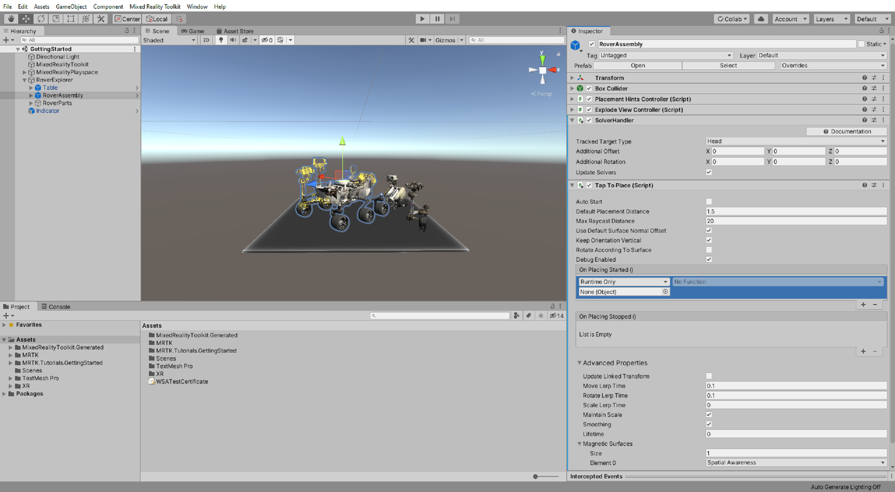

Configure the event as follows:

* Assign the **RoverAssembly** object as a listener for the On Placing Started () event by dragging it from the Hierarchy window into the **None (Object)** field
* From the **No Function** dropdown, select **TapToPlace** > **float SurfaceNormalOffset** to update the SurfaceNormalOffset property value when the event is triggered
* Verify that the argument is set to **0**

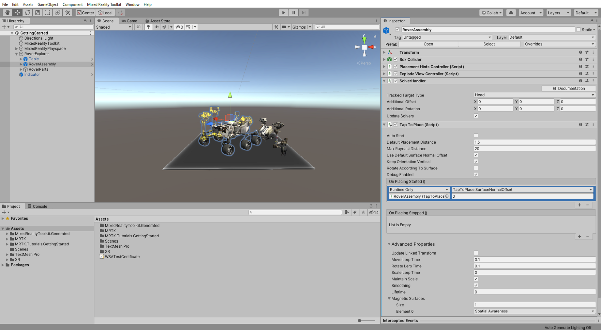

In the Hierarchy window, right-click on an empty spot and select **3D Object** > **Cube**, to create a temporary object representing the ground, and configure the **Transform** component as follows:

* **Position**: X = 0, Y = -1.65, Z = 6
* **Rotation**: X = 0, Y = 0, Z = 0
* **Scale**: X = 10, Y = 0.2, Z = 10

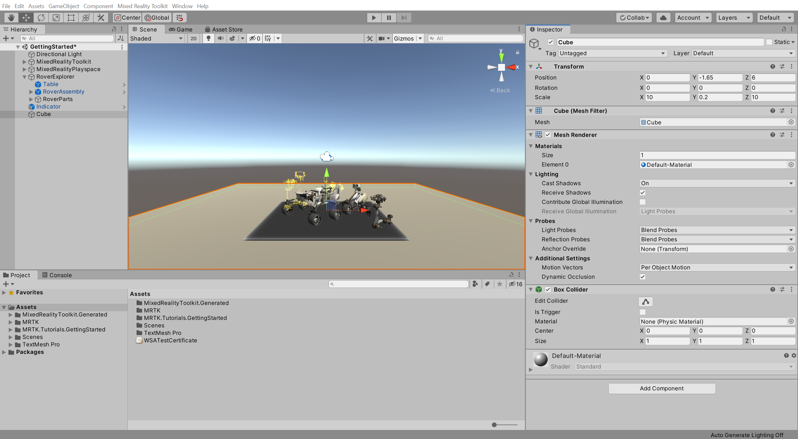

With the temporary Cube still selected in the Hierarchy window, in the Inspector window, use the **Layers** dropdown to change the Cube's Layer setting only to include the **Spatial Awareness** layer:

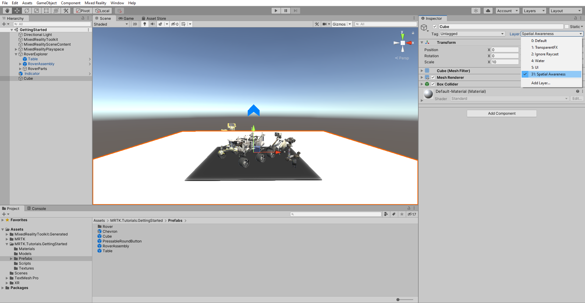

Press the Play button to enter Game mode, then press-and-hold the right mouse button while moving your mouse down until the gaze hit's the RoverAssembly object:

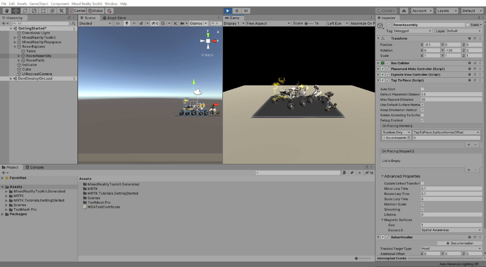

Click the left mouse button to start the tap-to-place process:

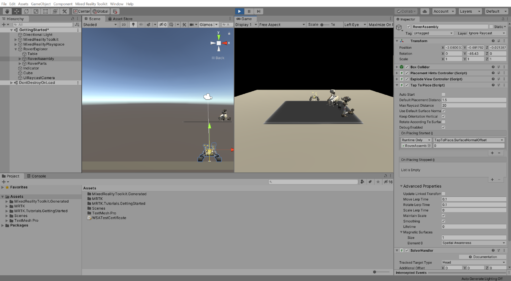

Press-and-hold the right mouse button while moving your mouse to the left or right to rotate your gaze direction, when you are happy with the placement, click the left mouse button:

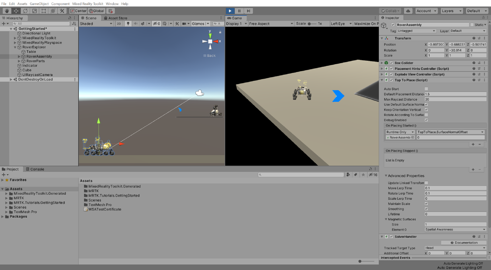

Once you are done testing the feature in the Game mode, right-click on the Cube object and select **Delete** to remove it from the scene:

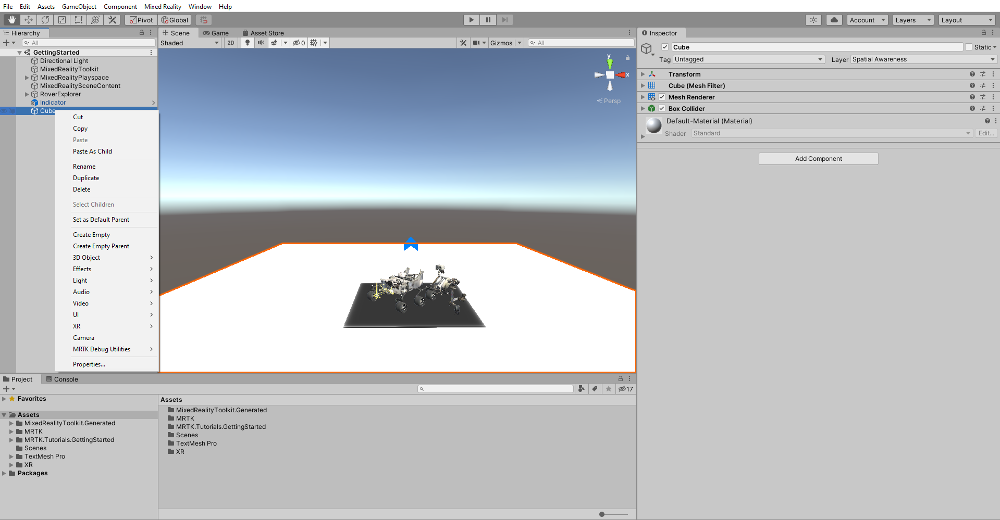

## Congratulations

In this tutorial, you learned how to use the MRTK's Directional Indicator Solver to have a UI element intuitively direct the user to objects. You also learned how to use the Tap To Place Solver to reposition objects easily.

To learn more about these and other solvers included with the MRTK,  you can refer to the [Solvers](/windows/mixed-reality/mrtk-unity/features/ux-building-blocks/solvers/solver) guide in the [MRTK Documentation Portal](/windows/mixed-reality/mrtk-unity/).

> [!div class="nextstepaction"]
> [Next Tutorial: 6. Creating user interfaces](mr-learning-base-06.md)
