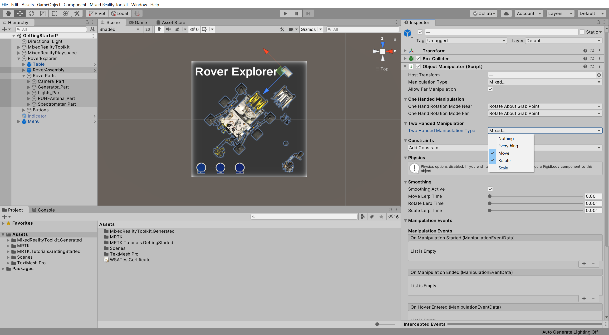
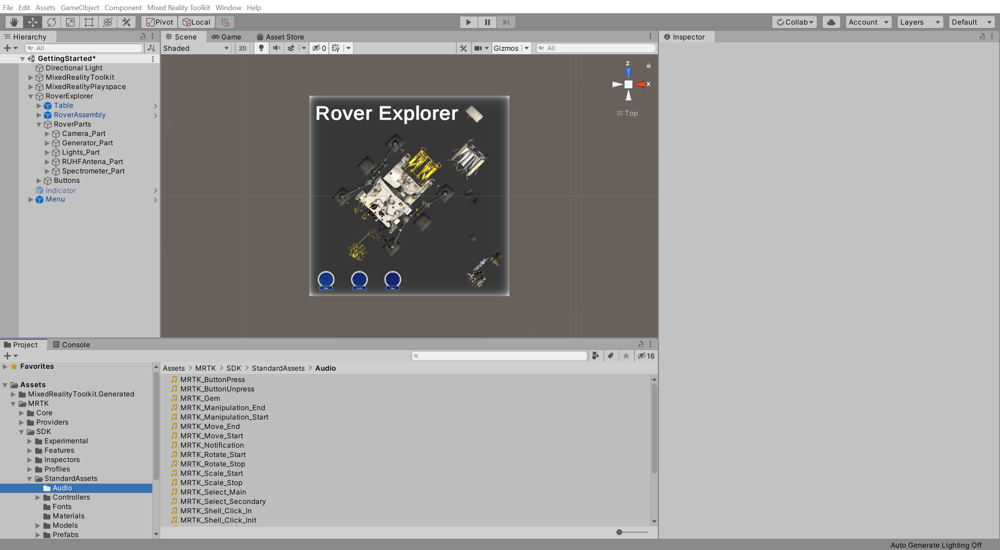
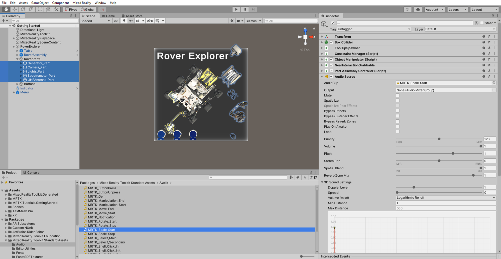
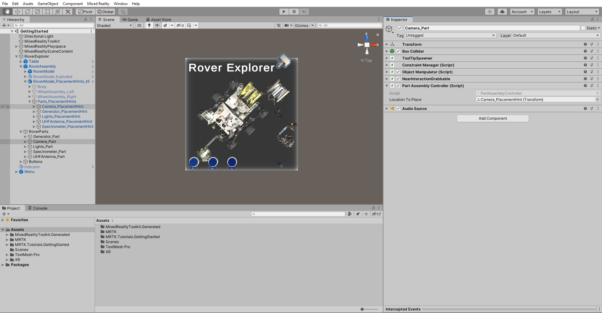
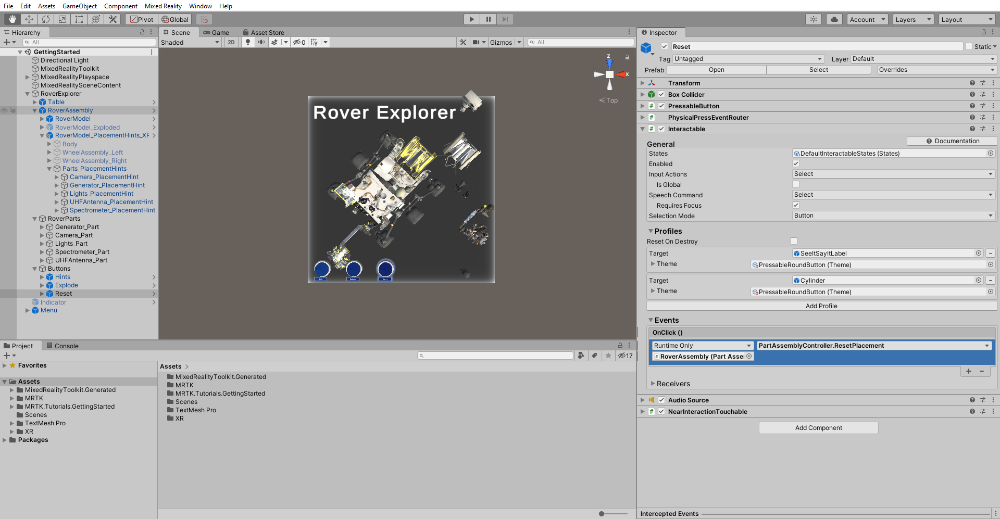
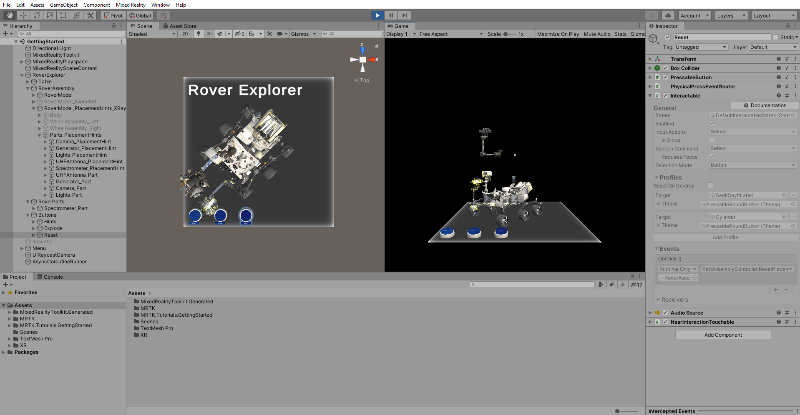
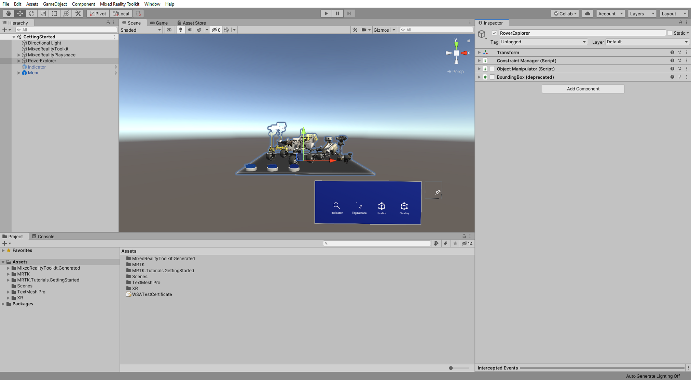
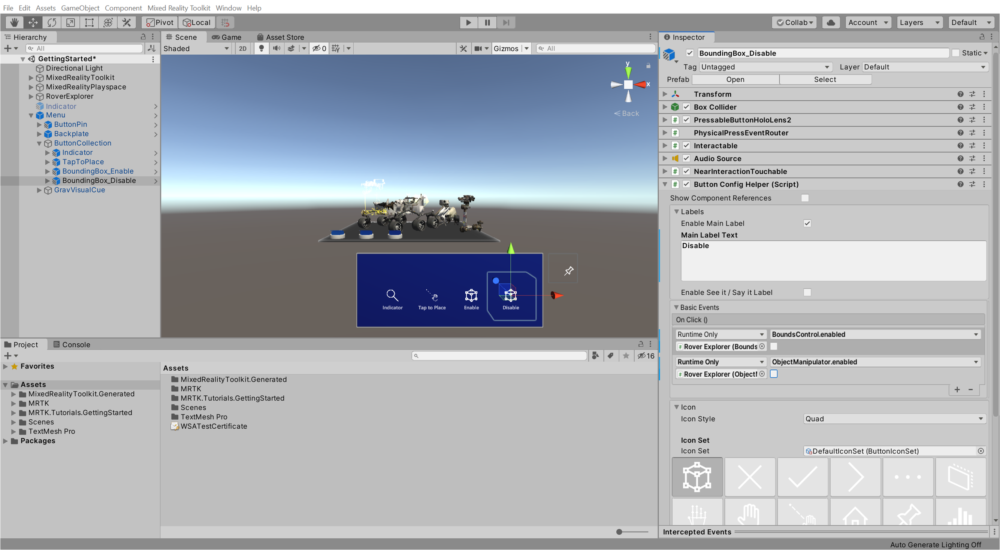
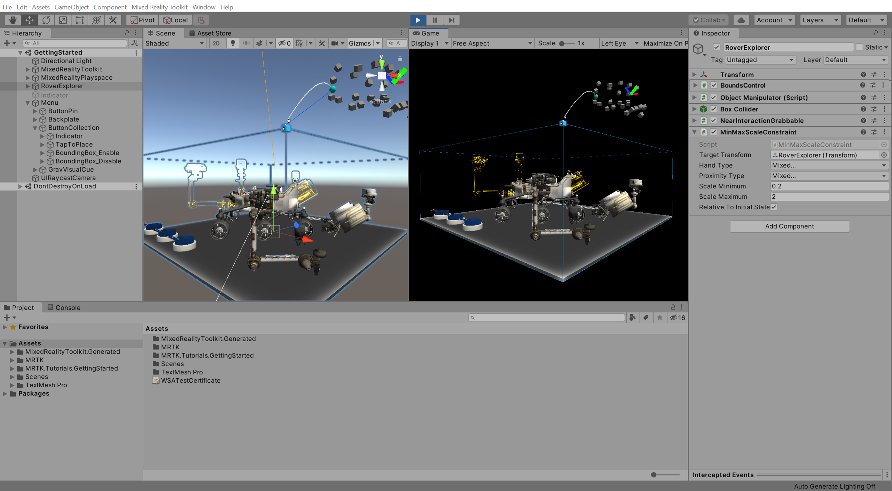

# 7. Interacting with 3D objects

In this tutorial, you will learn how to enable near and far manipulation of 3D objects and limit the allowed types of manipulation. You will also learn how to add bounds control around 3D objects to make it easier to control the object manipulation.

## Objectives

* Learn how to configure 3D objects so they can be interacted with
* Learn how to add bounds control to 3D objects

## Manipulating 3D objects

In this section, you will add the ability to manipulate all the Rover parts you organized on the table during the [Positioning objects in the scene](mr-learning-base-04.md) tutorial.

The main steps you will take to achieve this are:

1. Add the Object Manipulator (Script) component to all the part objects
2. Add the NearInteractionGrabbable component to all the part objects
3. Configure the Object Manipulator (Script) component

> [!NOTE]
> To be able to **manipulate an object**, the object must have the following components:
>
> * **Collider** component, for example, a Box Collider
> * **Object Manipulator (Script)** component
>
> To be able to **manipulate** and **grab an object with tracked hands**, the object must have the following components:
>
> * **Collider** component, for example, a Box Collider
> * **Object Manipulator (Script)** component
> * **NearInteractionGrabbable** component

Additionally, you will configure the Rover Explorer so that you can place the rover parts on to the Rover to make it a complete rover assembly.

In the Hierarchy window, expand the RoverExplorer > **RoverParts** object and select all its child rover part objects and the **RoverAssembly** object, then in the Inspector window, use the **Add Component** button to add the following components to all the selected objects:

* **Object Manipulator (Script)** component
* **NearInteractionGrabbable** component
* **Part Assembly Controller (Script)** component

> [!TIP]
> To select multiple objects that are not next to each other, press-and-hold the CTRL key while using the mouse to select any object.

> [!NOTE]
> When you add a Object Manipulator (Script), in this case, the Constraint Manager (Script) is automatically added because Object Manipulator (Script) depends on it.

> [!NOTE]
> For the purpose of this tutorial, colliders have already been added to the rover parts. To learn more about colliders, you can visit Unity's <a href="https://docs.unity3d.com/Manual/CollidersOverview.html" target="_blank">Collider</a> documentation.

> [!NOTE]
> The Part Assembly Controller (Script) is not part of the MRTK but was included with the tutorial assets.

With all the rover part objects and the RoverAssembly object still selected, in the Inspector window, configure the **Object Manipulator (Script)** component as follows:

* From the **Two Handed Manipulation Type** dropdown, uncheck the Scale, so only **Move** and **Rotate** is enabled

> [!NOTE]
> At this point, you have enabled object manipulation for all the rover part objects and the RoverAssembly object.

In the Project window, navigate to **Packages** > **Mixed Reality Toolkit Standard Assets** > **Audio** folder to locate the audio clips:

In the Hierarchy window, reselect all the **rover part objects**, then in the Inspector window, use the **Add Component** button to add the **Audio Sources** component and configure it as follows:

* Assign the **MRTK_Scale_Start** audio clip to the **AudioClip** field
* Uncheck the **Play On Awake** checkbox
* Change **Spatial Blend** to 1

In the Hierarchy window, expand the RoverAssembly > RoverModel_PlacementHints_XRay > **Parts_PlacementHints** object to reveal all of the placement hint objects, then select the first rover part, RoverParts > **Camera_Part**, and configure the **Part Assembly Controller (Script)** component as follows:

* Assign the **Camera_PlacementHint** object to the **Location To Place** field

**Repeat** this step for each of the remaining rover part objects and the RoverAssembly object to configure the **Part Assembly Controller (Script)** component as follows:

* For the **Generator_Part**, assign the **Generator_PlacementHint** object to the **Location To Place** field
* For the **Lights_Part**, assign the **Lights_PlacementHint** object to the **Location To Place** field
* For the **UHFAntenna_Part**, assign the **UHFAntenna_PlacementHint** object to the **Location To Place** field
* For the **Spectrometer_Part**, assign the **Spectrometer_PlacementHint** object to the **Location To Place** field
* For the **RoverAssembly**, assign the object itself, i.e. the same **RoverAssembly** object, to the **Location To Place** field

In the Hierarchy window, select the RoverExplorer > Buttons > **Reset** button object, then in the Inspector window, configure the Interactable **OnClick ()** event as follows:

* Assign the **RoverAssembly** object to the **None (Object)** field
* From the **No Function** dropdown, select **PartAssemblyController** > **ResetPlacement ()** to set this function as the action to be executed when the event is triggered

If you now enter Game mode, you can use near or far interaction to place the rover parts on to the Rover. Once the part is close to the corresponding placement hint, it will snap into place and become part of the Rover. To reset the placements, you can press the Reset button:

To learn more about the Object Manipulator component and its associated properties, you can visit the [Object Manipulator](https://microsoft.github.io/MixedRealityToolkit-Unity/Documentation/README_ObjectManipulator.html) guide in the [MRTK Documentation Portal](https://microsoft.github.io/MixedRealityToolkit-Unity/README.html).

## Adding Bounds Control

Bounds Control makes it easier and more intuitive to manipulate objects with one hand for both near and far interaction by providing handles that can be used for scaling and rotating.

In this example, you will add a BoundsControl to the RoverExplorer object so the whole experience can easily be moved, rotated, and scaled. Additionally, you will configure the Menu so you can turn the Bounds Control on and off.

In the Hierarchy window, select the **RoverExplorer** object, then in the Inspector window, use the **Add Component** button to add the following components:

* **BoundsControl** component
* **Object Manipulator (Script)** component

Then **uncheck** the checkbox next to all the components to make them **disabled** by default:

> [!NOTE]
> The Bounds Control visualization is created at runtime and, therefore, not visible before you enter Game mode.

> [!NOTE]
>The Object Manipulator (Script) automatically adds Constraint Manager (Script)

In the Hierarchy window, expand the Menu > **ButtonCollection** object to reveal the four buttons and rename the third button to **BoundsControl_Enable**, then in the Inspector window, configure the **Button Config Helper (Script)** component as follows:

* Change the **Main Label Text** to **Enable**
* Assign the **RoverExplorer** object to the **None (Object)** field
* From the **No Function** dropdown, select **BoundsControl** > **bool Enabled** to update this property value when the event is triggered
* Verify that the argument checkbox is **checked**
* Click the small **+** icon to add another event
* Assign the **RoverExplorer** object to the **None (Object)** field
* From the **No Function** dropdown, select **ObjectManipulator** > **bool Enabled** to update this property value when the event is triggered
* Verify that the argument checkbox is **checked**
* Leave the **Icon** as the 'cube with bounds control' icon

Rename the forth and last button to **BoundsControl_Disable**, then in the Inspector window, configure the **Button Config Helper (Script)** component as follows:

* Change the **Main Label Text** to **Disable**
* Assign the **RoverExplorer** object to the **None (Object)** field
* From the **No Function** dropdown, select **BoundsControl** > **bool Enabled** to update this property value when the event is triggered
* Verify that the argument checkbox is **unchecked**
* Click the small **+** icon to add another event
* Assign the **RoverExplorer** object to the **None (Object)** field
* From the **No Function** dropdown, select **ObjectManipulator** > **bool Enabled** to update this property value when the event is triggered
* Verify that the argument checkbox is **unchecked**
* Change the **Icon** to the 'cube with bounds control" icon

If you now enter Game mode and enable the Bounds Control by clicking the Enable button, you can use near or far interaction to move, rotate, and scale the Bounds Control, and use the Disable button to disable the Bounds Control again:

To learn more about the Bounds Control component and its associated properties, you can visit the [Bounds Control](https://microsoft.github.io/MixedRealityToolkit-Unity/Documentation/README_BoundsControl.html) guide in the [MRTK Documentation Portal](https://microsoft.github.io/MixedRealityToolkit-Unity/README.html).

## Congratulations

In this tutorial, you learned how to enable near and far manipulation for 3D objects and how to limit the allowed types of manipulation. You also learned how to add Bounds Control around 3D objects to make it easier to control the object manipulation.

> [!div class="nextstepaction"]
> [Next Tutorial: 8. Using eye-tracking](mr-learning-base-08.md)
