# 9. Using speech commands

In this tutorial, you will learn how to create speech commands and how to control them globally. You will also learn how to control local speech commands that require the user to look at the object that controls the speech command.

## Objectives

* Learn how to create speech commands
* Learn how to control speech commands globally and locally

## Ensuring the Microphone capability is enabled

In the Unity menu, select Mixed Reality Toolkit > Utilities > **Configure Unity Project** to open the **MRTK Project Configurator** window, then in the **UWP Capabilities** section, verify that **Enable Microphone Capability** is greyed out:

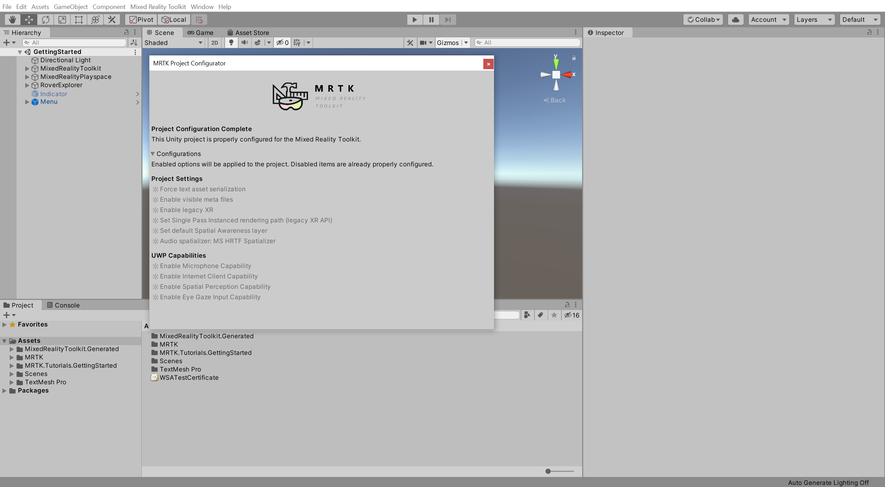

> [!NOTE]
> The Microphone capability should have been enabled during the [Apply the MRTK Project Configurator settings](mr-learning-base-02.md#creating-and-configuring-the-scene) instructions when you configured the Unity project at the beginning of this tutorial series. However, if it is not enabled, make sure you enable it now.

## Creating speech commands

In the Hierarchy window, select the **MixedRealityToolkit** object, then in the Inspector window, select the MixedRealityToolkit > **Input** tab and take the following steps:

* Expand the **Speech** section
* Clone the **DefaultMixedRealitySpeechCommandsProfile** and give it a suitable name, for example, _GettingStarted_MixedRealitySpeechCommandsProfile_
* Verify that **Start Behaviour** is set to **Auto Start**

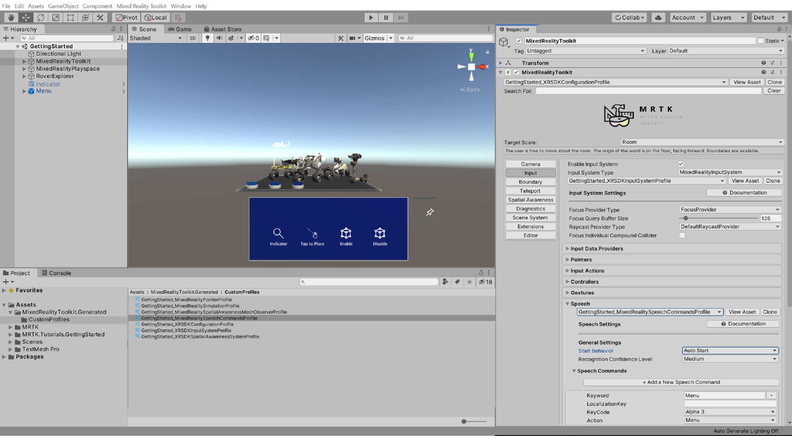

> [!TIP]
> For a reminder on how to clone MRTK profiles, you can refer to the [Configuring the MRTK profiles](mr-learning-base-03.md) instructions.

In the Speech > **Speech Commands** section, click the **+ Add a New Speech Command** button four times to add four new speech commands to the list of the existing speech commands, then in the **Keyword** fields enter the following phrases:

* Enable Indicator
* Enable Tap to Place
* Enable Bounds Control
* Disable Bounds Control

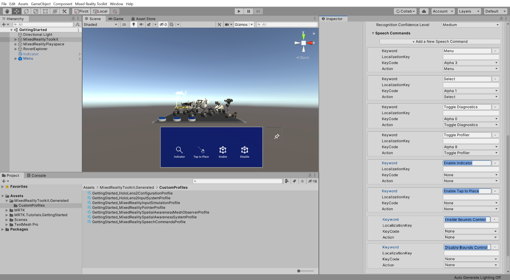

> [!TIP]
> If your computer does not have a microphone you can assign a KeyCode to the speech commands, which will let you trigger them when the corresponding key is pressed.

## Controlling speech commands

In the Project window, navigate to the **Package** > **Mixed Reality Toolkit Foundation** > **SDK** > **Features** > **UX** > **Prefabs** > **ToolTip** folder to locate the tooltip prefabs:

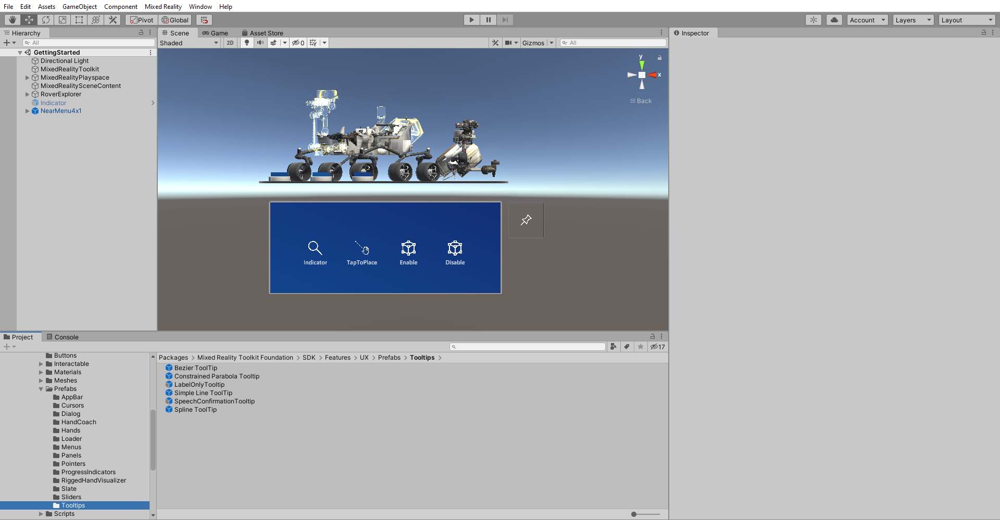

In the Hierarchy window, right-click on an empty spot and select **Create Empty** to add an empty object to your scene.

Name the object **SpeechInputHandler_Global**, then in the Inspector window, use the **Add Component** button to add the **SpeechInputHandler** component and configure it as follows:

* **Uncheck** the **Is Focus Required** checkbox, so the user is not required to look at the object with the SpeechInputHandler component to trigger the speech command
* From the Project window, assign the **SpeechConfirmation Tooltip** prefab to the **Speech Confirmation Tooltip Prefab** field, to have this prefab appear when a speech command is recognized

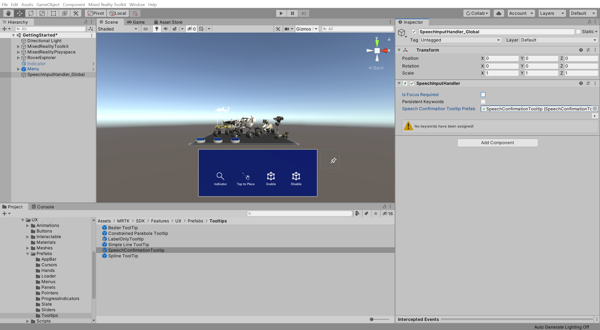

On the SpeechInputHandler component, click the small **+** icon three times to add three keyword elements:

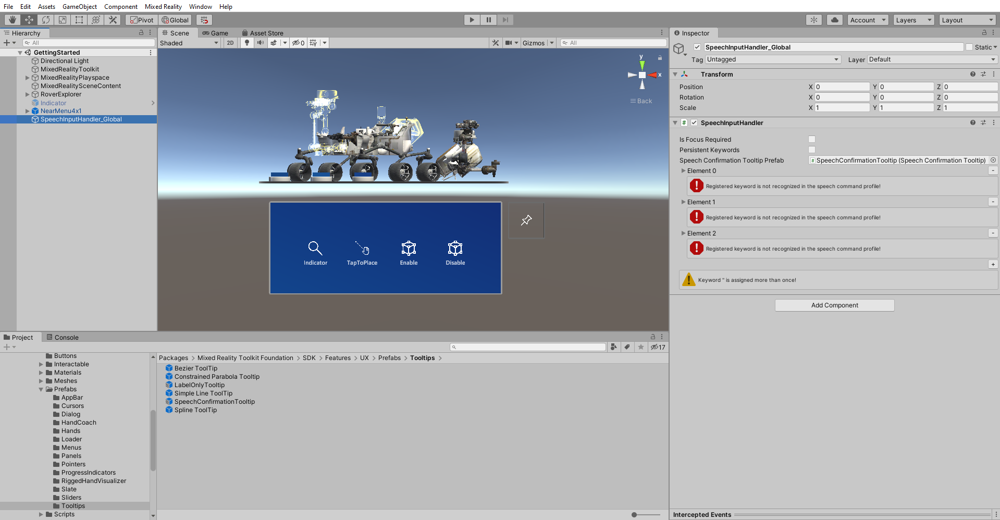

Expand **Element 0** and configure it as follows:

* In the **Keyword** field, enter **Enable Indicator**, to reference the Enable Indicator speech command you created in the previous section
* Click the small **+** icon to add an event
* From the Hierarchy window, assign the **Indicator** object to the **None (Object)** field
* From the **No Function** dropdown, select **GameObject** > **SetActive (bool)** to set this function as the action to be executed when the event is triggered
* Check the argument checkbox, so it is **checked**

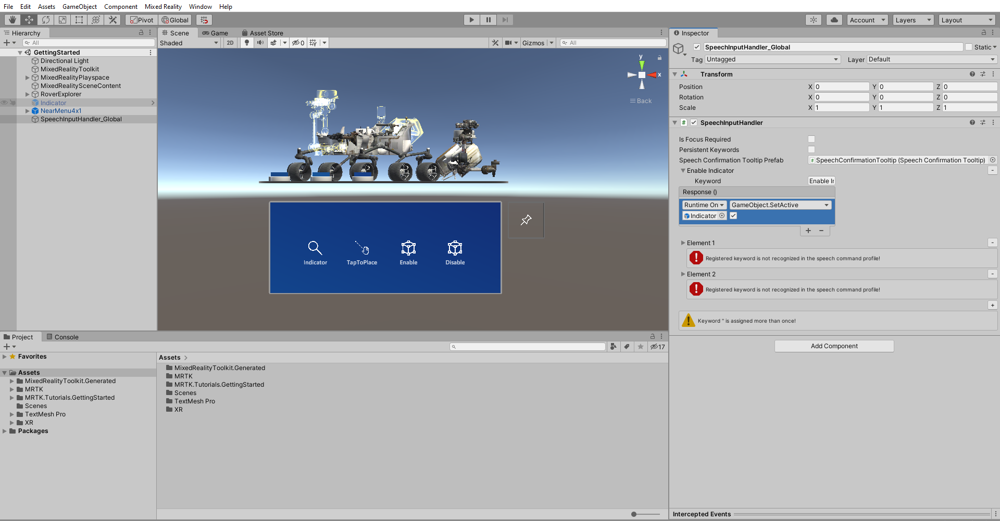

Expand **Element 1** and configure it as follows:

* In the **Keyword** field, enter **Enable Bounds Control**, to reference the Enable Bounds Control command you created in the previous section
* Click the small **+** icon to add an event
* From the Hierarchy window, assign the **RoverExplorer** object to the **None (Object)** field
* From the **No Function** dropdown, select **BoundsControl** > **bool enabled** to update this property value when the event is triggered
* Check the argument checkbox, so it is **checked**
* Click the small **+** icon to add another event
* From the Hierarchy window, assign the **RoverExplorer** object to the **None (Object)** field
* From the **No Function** dropdown, select **ObjectManipulator** > **bool enabled** to update this property value when the event is triggered
* Check the argument checkbox, so it is **checked**

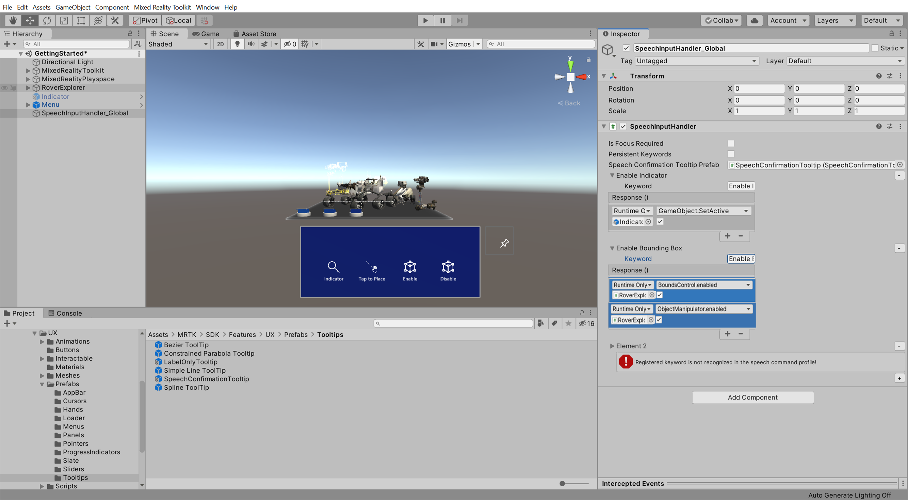

Expand **Element 2** and configure it as follows:

* In the **Keyword** field, enter **Disable Bounds Control**, to reference the Disable Bounds Control command you created in the previous section
* Click the small **+** icon to add an event
* From the Hierarchy window, assign the **RoverExplorer** object to the **None (Object)** field
* From the **No Function** dropdown, select **BoundsControl** > **bool enabled** to update this property value when the event is triggered
* Verify that the argument checkbox is **unchecked**
* Click the small **+** icon to add another event
* From the Hierarchy window, assign the **RoverExplorer** object to the **None (Object)** field
* From the **No Function** dropdown, select **ObjectManipulator** > **bool enabled** to update this property value when the event is triggered
* Verify that the argument checkbox is **unchecked**

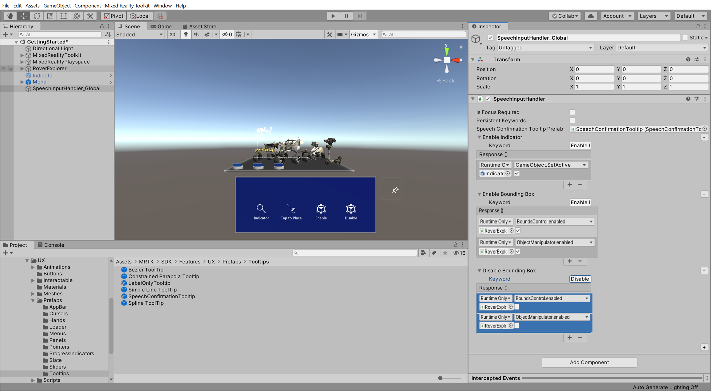

In the Hierarchy window, select the RoverExplorer > **RoverAssembly** object, then in the Inspector window, use the **Add Component** button to add the **SpeechInputHandler** component and configure it as follows:

* Verify that the **Is Focus Required** checkbox is **check**, so the user is required to look at the object with the SpeechInputHandler component, i.e., the RoverAssembly, to trigger the speech command
* From the Project window, assign the **SpeechConfirmation Tooltip** prefab to the **Speech Confirmation Tooltip Prefab** field, to have this prefab appear when a speech command is recognized

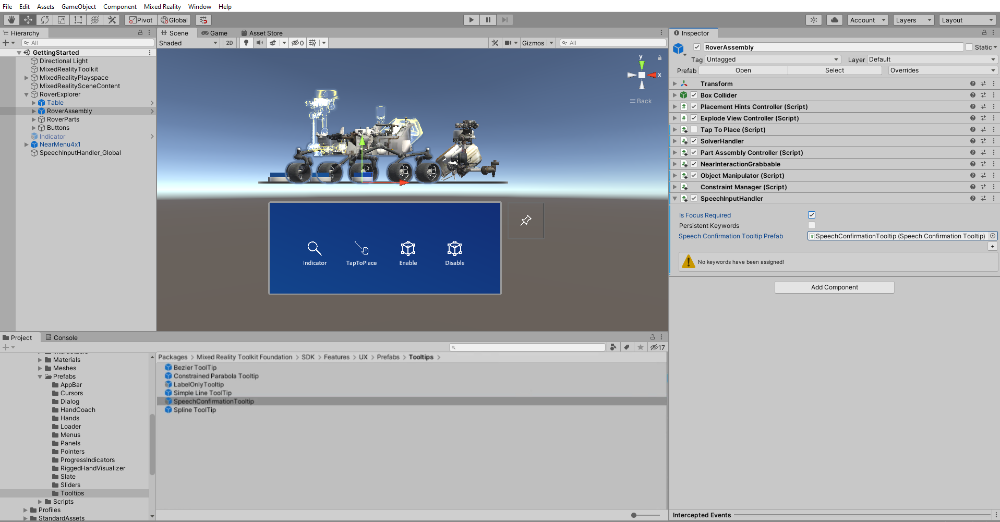

On the SpeechInputHandler component, click the small **+** icon to add a keyword element, expand the newly created element, then configure it as follows:

* In the **Keyword** field, enter **Enable Tap to Place**, to reference the Enable Tap to Place command you created in the previous section
* Click the small **+** icon to add an event
* From the Hierarchy window, assign the object itself, i.e., the same **RoverAssembly** object, to the **None (Object)** field
* From the **No Function** dropdown, select **TapToPlace** > **bool enabled** to update this property value when the event is triggered
* Check the argument checkbox, so it is **checked**

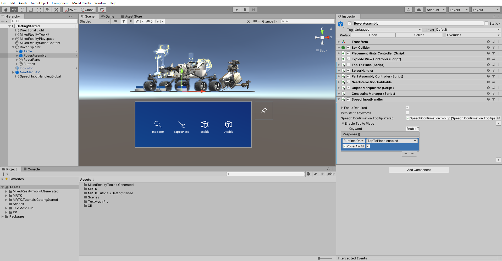

## Congratulations

In this tutorial, you learned how to create speech commands and how to control them globally. You also learned how to control local speech commands that require the user to look at the object that controls the speech command.

This also concludes the [Getting started tutorials](mr-learning-base-01.md) series. Through these tutorials, you have successfully built a complete mixed reality experience from scratch using the MRTK.

In the next two tutorial series, [Azure Spatial Anchors tutorials](mr-learning-asa-01.md) and [Multi-user capabilities tutorials](mr-learning-sharing-01.md), you will first learn how to integrate Azure Spatial Anchors into your project to anchor the Rover Explorer experience you created in the real world. Then, you will learn how to add multi-user capabilities to your project to share user and object movements in real-time.

## Next Development Checkpoint

If you're following the Unity development checkpoint journey we've laid out, your next task is to familiarize yourself with core building blocks of Mixed Reality apps.

> [!div class="nextstepaction"]
> [Basic interactions](../mrtk-101.md)

You can always go back to the [Unity development checkpoints](../unity-development-overview.md#1-getting-started) at any time.
