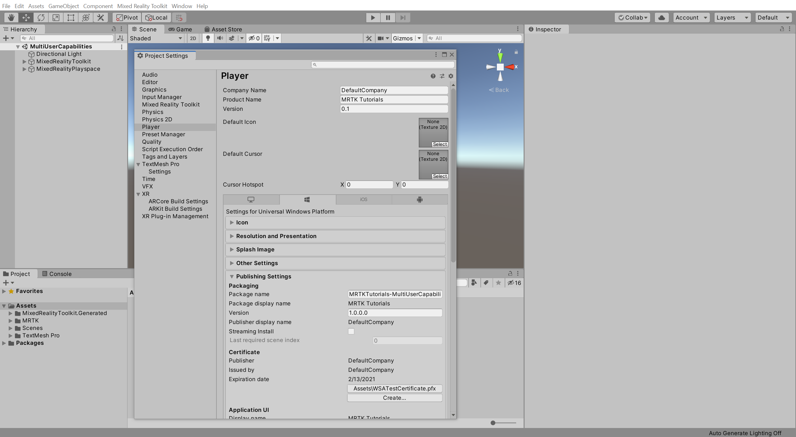
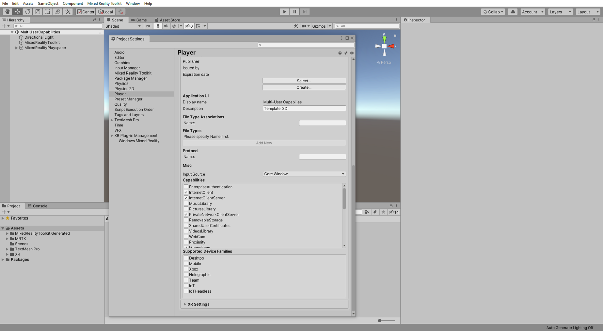
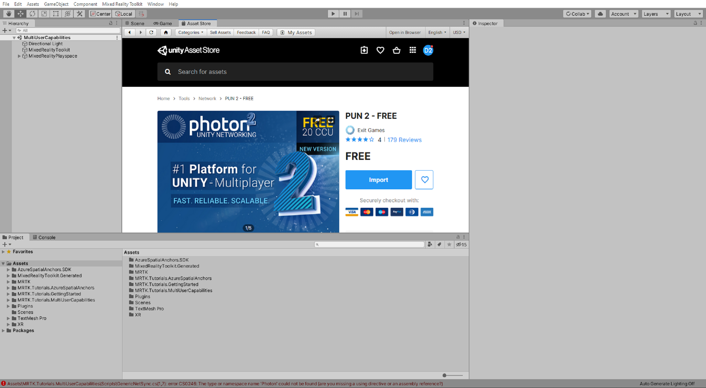
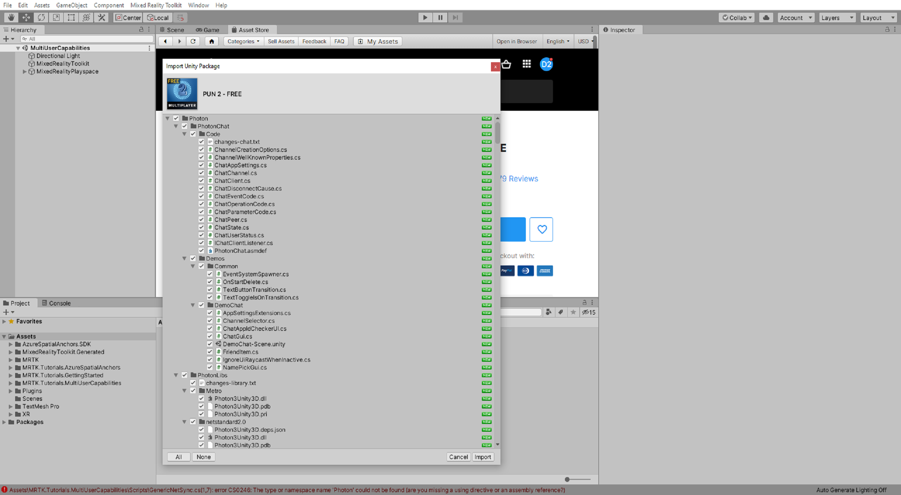
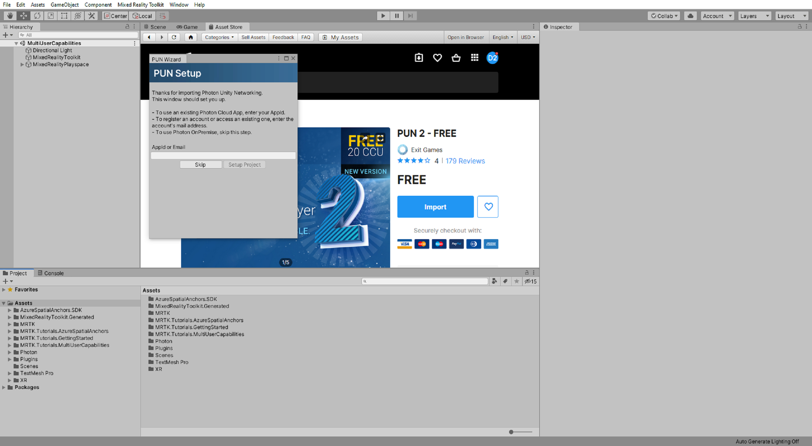
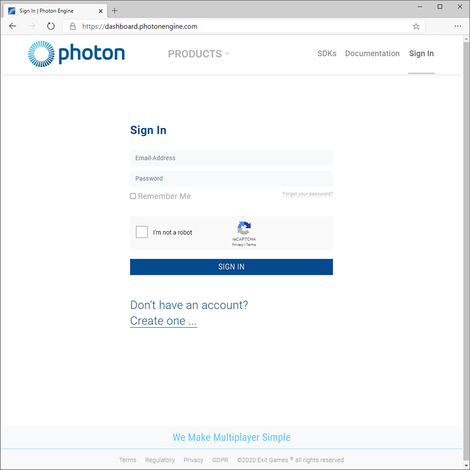
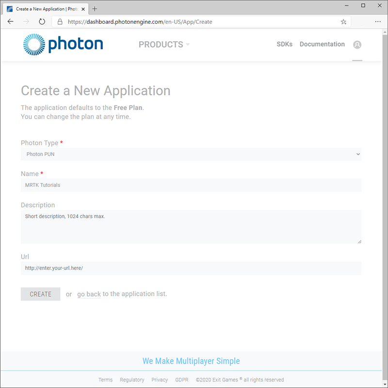
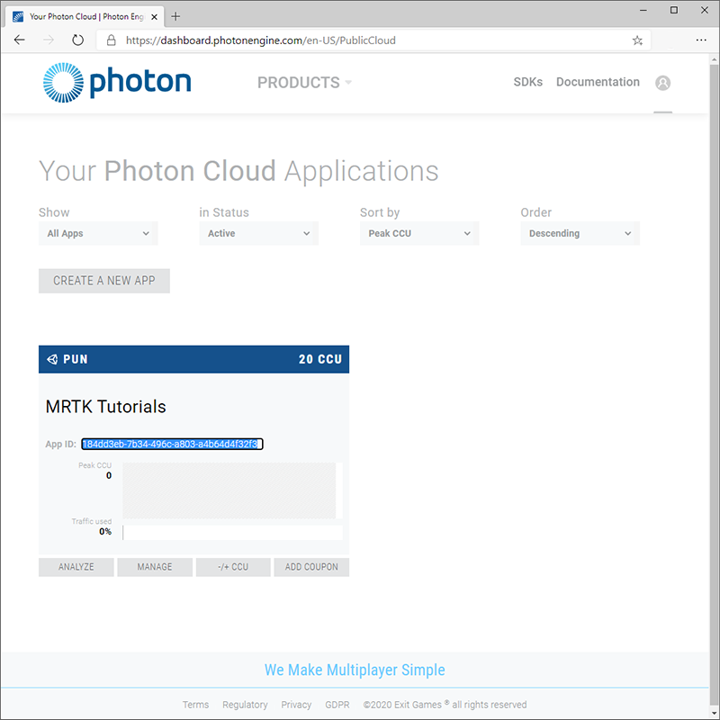
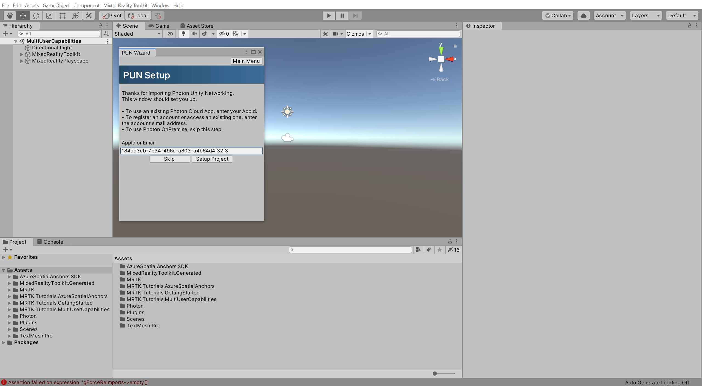
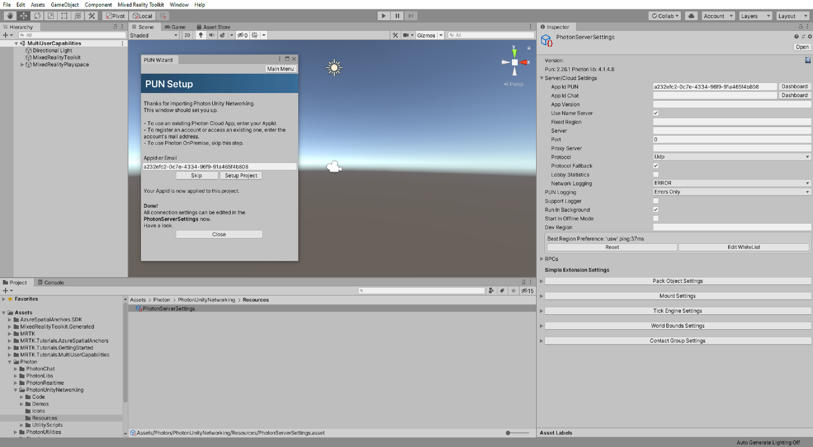

# 2. Setting up Photon Unity Networking

In this tutorial, you will prepare for creating a shared experience using Photon Unity Networking (PUN). You will learn how to create a PUN app, import PUN assets into your Unity project, and connect your Unity project to the PUN app.

## Objectives

* Learn how to create a PUN app
* Learn how to find and import the PUN assets
* Learn how to connect your Unity project to the PUN app

## Creating and preparing the Unity project

In this section, you will create a new Unity project and get it ready for MRTK development.

First, follow the [Initializing your project and deploying your first application](/training/paths/beginner-hololens-2-tutorials/), excluding the [Adding hand interaction to an object](/training/paths/beginner-hololens-2-tutorials/#adding-hand-interaction-to-an-object) and [Build your application to your device](/training/paths/beginner-hololens-2-tutorials/#building-your-application-to-your-hololens-2) instructions, which includes the following steps:

1. [Creating the Unity project](/training/paths/beginner-hololens-2-tutorials/#creating-the-unity-project) and give it a suitable name, for example, *MRTK Tutorials*
2. [Switching the build platform](/training/paths/beginner-hololens-2-tutorials/#switching-the-build-platform)
3. [Importing the TextMeshPro Essential Resources](/training/paths/beginner-hololens-2-tutorials/#importing-the-textmeshpro-essential-resources)
4. [Importing the Mixed Reality Toolkit and Configuring the Unity project](/training/paths/beginner-hololens-2-tutorials/#importing-the-mixed-reality-toolkit-and-configuring-the-unity-project)
5. [Creating the scene and configuring MRTK](/training/paths/beginner-hololens-2-tutorials/#creating-the-scene-and-configuring-mrtk) and give the scene a suitable name, for example, *MultiUserCapabilities*

Then follow the [Changing the Spatial Awareness Display Option](/training/paths/beginner-hololens-2-tutorials/#changing-the-spatial-awareness-display-option) instructions to:

1. Change the **MRTK configuration profile** for to the **DefaultHoloLens2ConfigurationProfile**
1. Change the **spatial awareness mesh display options** to **Occlusion**.

## Enabling additional capabilities

In the Unity menu, select **Edit** > **Project Settings...** to open the Player Settings window, then locate the **Player** >  **Publishing Settings** section:

In the  **Publishing Settings**, scroll down to the **Capabilities** section and double-check that the **InternetClient**, **Microphone**, **SpatialPerception**, and **GazeInput** capabilities, which you enabled during the [Configuring the Unity project](/training/paths/beginner-hololens-2-tutorials/#configuring-the-unity-project) step above, are enabled.

Then enable the following additional capabilities:

* **InternetClientServer** capability
* **PrivateNetworkClientServer** capability

## Importing the tutorial assets

Download and **import** the following Unity custom packages **in the order they are listed**:
 
* [MRTK.HoloLens2.Unity.Tutorials.Assets.GettingStarted.2.7.2.unitypackage](https://github.com/microsoft/MixedRealityLearning/releases/download/getting-started-v2.7.2/MRTK.HoloLens2.Unity.Tutorials.Assets.GettingStarted.2.7.2.unitypackage)
* [MRTK.HoloLens2.Unity.Tutorials.Assets.MultiUserCapabilities.2.7.2.unitypackage](https://github.com/microsoft/MixedRealityLearning/releases/download/multi-user-capabilities-v2.7.2/MRTK.HoloLens2.Unity.Tutorials.Assets.MultiUserCapabilities.2.7.2.unitypackage)

> [!TIP]
> For a reminder on how to import a Unity custom package, you can refer to the [Importing the tutorial assets](/training/paths/beginner-hololens-2-tutorials/#importing-the-tutorial-assets) instructions.

> [!NOTE]
> After importing the MultiUserCapabilities tutorial assets package, you will see several [CS0246](/dotnet/csharp/language-reference/compiler-messages/cs0246) errors in the Console window stating that the type or namespace is missing. This is expected and will be resolved in the next section when you import the PUN assets.

## Importing the PUN assets

In the Unity menu, select **Window** > **Asset Store** to open the Asset Store window, search for and select **PUN 2 - FREE** from Exit Games, click the **Download** button to download the asset package to your Unity account.

When the download is complete, click the **Import** button to open the Import Unity Package window:

In the Import Unity Package window, click the **All** button to ensure all the assets are selected, then click the **Import** button to import the assets:

Once Unity has completed the import process, the Pun Wizard window will appear with the PUN Setup menu loaded, you can ignore or close this window for now:

## Creating the PUN application

In this section, you will create a Photon account, if you don't already have one, and create a new PUN app.

Navigate to the Photon <a href="https://dashboard.photonengine.com/account/signin" target="_blank">dashboard</a> and sign in if you already have an account you want to use, otherwise, click the **Create One** link and follow the instructions to register a new account:

Once signed in, click the **Create a New App** button:

On the Create a New Application page, enter the following values:

* For Photon Type, select PUN
* For Name, enter a suitable name, for example, _MRTK Tutorials_
* For Description, optionally enter a suitable description
* For Url, leave the field empty

Then click the **Create** button to create the new app:

Once Photon has finished the creation process, the new PUN app will appear on your dashboard:

## Connecting the Unity project to the PUN application

In this section, you will connect your Unity project to the PUN app you created in the previous section.

On the Photon dashboard, click the **App ID** field to reveal the app ID, then copy it to your clipboard:

In the Unity menu, select **Window** > **Photon Unity Networking** > **PUN Wizard** to open the Pun Wizard window, click the **Setup Project** button to open the PUN Setup menu, and configure it as follows:

* In the **AppId or Email** field, paste the PUN app ID you copied in the previous step

Then click the **Setup Project** button to apply the app ID:

Once Unity has finished the PUN setup process, the PUN Setup menu will display the message **Done!** and automatically select the **PhotonServerSettings** asset in the Project window, so its properties are displayed in the Inspector window:

## Congratulations

You have successfully created a PUN app and connected it to your Unity project. Your next step is to allow connections with other users so that multiple users can see each other.

> [!div class="nextstepaction"]
> [Next Tutorial: 3. Connecting multiple users](mr-learning-sharing-03.md)
