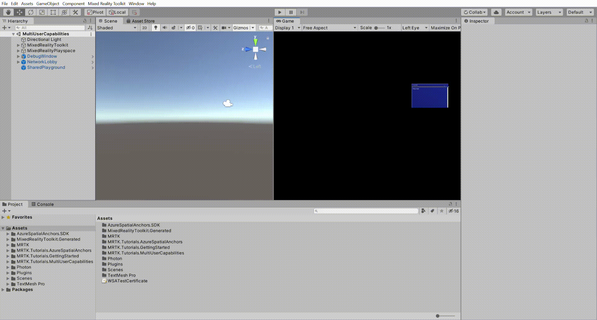

# 3. Connecting multiple users

In this tutorial, you will learn how to connect multiple users as part of a live shared experience. By the end of the tutorial, you will be able to run the app on multiple devices and have each user see the avatar of other users move in real-time.

## Objectives

* Learn how to connect multiple users in a shared experience

## Preparing the scene

In this section, you will prepare the scene by adding some of the tutorial prefabs.

In the Project window, navigate to the **Assets** > **MRTK.Tutorials.MultiUserCapabilities** > **Prefabs** folder, then click-and-drag the following prefabs into the Hierarchy window to add them to your scene:

* **NetworkLobby** prefab
* **SharedPlayground** prefab

## Configuring PUN to instantiate the user prefab

In this section, you will configure the project to use the PhotonUser prefab.

In the Project window, navigate to the **Assets** > **MRTK.Tutorials.MultiUserCapabilities** > **Resources** folder.

In the Hierarchy window, expand the **NetworkLobby** object and select the **NetworkRoom** child object, then in the Inspector window, locate the **Photon Room (Script)** component and configure it as follows:

* To the **Photon User Prefab** field, assign the **PhotonUser** prefab from the Resources folder

## Trying the experience with multiple users

If you now build and deploy the Unity project to your HoloLens, then, back in Unity, enter Game mode while the app is running on your HoloLens, you will see the HoloLens user avatar move when you move your head (HoloLens) around:

> [!TIP]
> For a reminder on how to build and deploy your Unity project to HoloLens 2, you can refer to the [Building your app to your HoloLens 2](/learn/paths/beginner-hololens-2-tutorials/#building-your-application-to-your-hololens-2) instructions.

> [!CAUTION]
> The app needs to connect to Photon, so make sure your computer/device is connected to the internet.

## Congratulations

You have successfully configured your project to allow multiple users to connect to the same experience and see each other's movements. In the next tutorial, you will implement functionality so that the movements of objects are also shared across multiple devices.

> [!div class="nextstepaction"]
> [Next Tutorial: 4. Sharing object movements with multiple users](mr-learning-sharing-04.md)