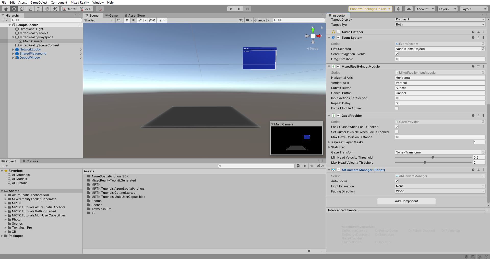
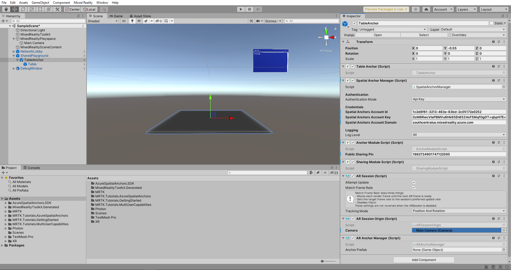
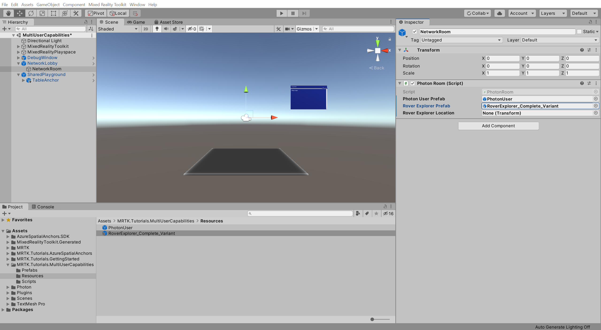
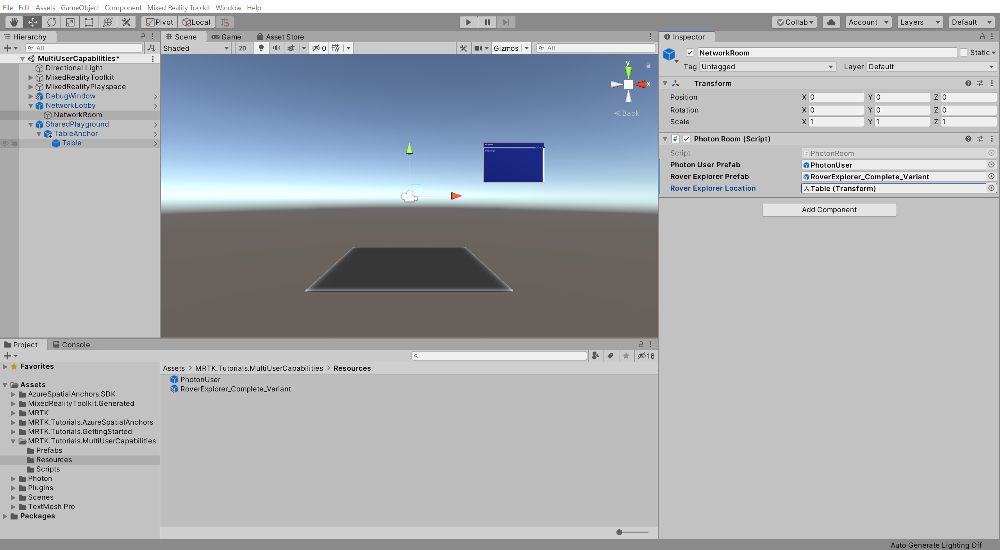

# 4. Sharing object movements with multiple users

In this tutorial, you will learn how to share the movements of objects so that all participants of a shared experience can collaborate and view each other's interactions.

## Objectives

* Configure your project to share the movements of objects
* Learn how to build a basic multi-user collaborative app

## Preparing the scene

In this section, you will prepare the scene by adding the tutorial prefab.

In the Hierarchy window, expand the **MixedRealityPlayspace** object and select the **Main Camera** child object, then in the Inspector window, use the **Add Component** button to add the **AR Camera Manager (Script)** component to the **Main Camera** object:

In the Project window, navigate to the **Assets** > **MRTK.Tutorials.MultiUserCapabilities** > **Prefabs** folder and drag the **TableAnchor** prefab onto the **SharedPlayground** object in the Hierarchy window to add it to your scene as a child of the SharedPlayground object:

In the Hierarchy window, ensure the **MixedRealityPlayspace** object is expanded and the **TableAnchor** object is selected. Drag the **Main Camera** component into the **Camera** field of the **TableAnchor**'s **AR Session Origin** component:

## Configuring PUN to instantiate the objects

In this section, you will configure the project to use the Rover Explorer experience created during the [Getting started tutorials](/learn/paths/beginner-hololens-2-tutorials/) and define where it will be instantiated.

In the Project window, navigate to the **Assets** > **MRTK.Tutorials.MultiUserCapabilities** > **Resources** folder.

In the Hierarchy window, expand the **NetworkLobby** object and select the **NetworkRoom** child object, then in the Inspector window, locate the **Photon Room (Script)** component and configure it as follows:

* To the **Rover Explorer Prefab** field, assign the **RoverExplorer_Complete_Variant** prefab from the Resources folder

With the **NetworkRoom** child object still selected, in the Hierarchy window, expand the **TableAnchor** object, then in the Inspector window, locate the **Photon Room (Script)** component and configure it as follows:

* To the **Rover Explorer Location** field, assign the TableAnchor > **Table** child object from the Hierarchy window

## Trying the experience with shared object movement

If you now build and deploy the Unity project to your HoloLens, and then, back in Unity, press the Play button to enter Game mode while the app is running on your HoloLens, you will see the object move in Unity when you move the object in HoloLens:

## Congratulations

You have successfully configured your project to synchronize object movements so users can see the objects move when other users move them. This will ensure that the users see each other in their actual physical locations. It will also ensure that objects appear in the same physical position and rotation for all users. If you want to learn how to physically align the now-synchronized movements, see our ["Create a new HoloLens Unity app using Azure Spatial Anchors"](/azure/spatial-anchors/tutorials/tutorial-new-unity-hololens-app) tutorial.

In this multi-user capabilities tutorial series you learned how to set up a Photon account, create a PUN app, integrate PUN into the Unity project, and configure user avatars and shared objects. This tutorial concludes the series.