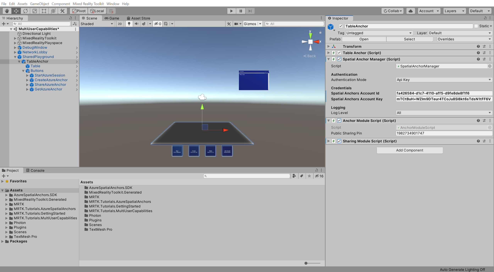

# 5. Integrating Azure Spatial Anchors into a shared experience

In this tutorial, you will learn how to integrate Azure Spatial Anchors (ASA) into the shared experience. ASA allows multiple devices to have a common reference to the physical world so that the users see each other in their actual physical location and see the shared experience in the same place.

## Objectives

* Integrate ASA into a shared experience for multi-device alignment
* Learn the fundamentals of how ASA works in the context of a local shared experience

## Preparing the scene

In the Hierarchy window, expand the **SharedPlayground** object, then expand the **TableAnchor** object to expose its child objects:

In the Project window, navigate to the **Assets** > **MRTK.Tutorials.MultiUserCapabilities** > **Prefabs** folder and drag the **Buttons** prefab onto the **TableAnchor** child object to add it to your scene as a child of the TableAnchor object:

## Configuring the buttons to operate the scene

In this section, you will configure a series of button events demonstrating the fundamentals of how Azure Spatial Anchors can be used to achieve spatial alignment in a shared experience.

In the Hierarchy window, expand the **Button** object and select the first child button object named **StartAzureSession**:

In the Inspector window, locate the **Interactable (Script)** component and configure the **OnClick ()** event as follows:

* To the **None (Object)** field, assign the **TableAnchor** object
* From the **No Function** dropdown, select the **AnchorModuleScript** > **StartAzureSession ()** function

In the Hierarchy window, select the second child button object named **CreateAzureAnchor**, then in the Inspector window, locate the **Interactable (Script)** component and configure the **OnClick ()** event as follows:

* To the **None (Object)** field, assign the **TableAnchor** object
* From the **No Function** dropdown, select the **AnchorModuleScript** > **CreateAzureAnchor ()** function
* To the new **None (Game Object)** field that appears, assign the **TableAnchor** object

In the Hierarchy window, select the third child button object named **ShareAzureAnchor**, then in the Inspector window, locate the **Interactable (Script)** component and configure the **OnClick ()** event as follows:

* To the **None (Object)** field, assign the **TableAnchor** object
* From the **No Function** dropdown, select the **SharingModuleScript** > **ShareAzureAnchor ()** function

In the Hierarchy window, select the fourth child button object named **GetAzureAnchor**, then in the Inspector window, locate the **Interactable (Script)** component and configure the **OnClick ()** event as follows:

* To the **None (Object)** field, assign the **TableAnchor** object
* From the **No Function** dropdown, select the **SharingModuleScript** > **GetAzureAnchor ()** function

## Connecting the scene to the Azure resource

In the Hierarchy window, expand the **SharedPlayground** object and select the **TableAnchor** object.

In the Inspector window, locate the **Spatial Anchor Manager (Script)** component and configure the **Credentials** section with the credentials from the Azure Spatial Anchors account created as part of the [Prerequisites](mr-learning-sharing-01.md#prerequisites) for this tutorial series:

* In the **Spatial Anchors Account ID** field, paste the **Account ID** from your Azure Spatial Anchors account
* In the **Spatial Anchors Account Key** field, paste the primary or secondary **Access Key** from your Azure Spatial Anchors account

> [!TIP]
> Instead of setting the Spatial Anchors Account ID and Key in the scene, you can set it for your entire project, this can be advantageous if you have multiple scenes using ASA. To do this, in the Project window, navigate to the Assets > AzureSpatialAnchors.SDK > Resources > **SpatialAnchorConfig** asset, then set the values in the Inspector window.

In the Hierarchy window, select the **TableAnchor** object, then in the Inspector window, locate the **Anchor Module (Script)** component and configure it as follows:

* In the **Public Sharing Pin** field, change a few digits, so the pin becomes unique to your project

With the **TableAnchor** object still selected, in the Inspector window, make sure all the script components are **enabled**:

* Check the checkbox next to the **Spatial Anchor Manager (Script)** components to enable it
* Check the checkbox next to the **Anchor Module Script (Script)** components to enable it
* Check the checkbox next to the **Sharing Module Script (Script)** components to enable it

## Trying the experience with spatial alignment

> [!NOTE]
> Azure Spatial Anchors can not run in Unity. Consequently, to test the Azure Spatial Anchors functionality, you need to deploy the project to a minimum of two devices.

If you now build and deploy the Unity project to two devices, you can achieve spatial alignment between the devices by sharing the Azure Anchor ID. To test it out, you can follow these steps:

1. On device 1: **Start the app** (the Rover Explorer is instantiated and placed on the table)
2. On device 2: **Start the app** (both users see the table with the Rover Explorer, but the table does not appear in the same place, and the user avatars do not appear where the users are)
3. On device 1: Press the **Start Azure Session** button
4. On device 1: Press the **Create Azure Anchor** button (creates anchor at the location of the TableAnchor object and stores the anchor information in the Azure resource).
5. On device 1: Press the **Share Azure Anchor** button (shares the anchor ID with other users in real-time)
6. On device 2: Press the **Start Azure Session** button
7. On device 2: Press the **Get Azure Anchor** button (connects to the Azure resource to retrieve the anchor information for the shared anchor ID, then moves the TableAnchor object to the location where the anchor was created with the device 1)

> [!TIP]
> If you don't have access to two HoloLens devices, you may follow the [Building Azure Spatial Anchors for mobile devices](mr-learning-asa-05.md) to deploy the project to your mobile device.

## Congratulations

In this tutorial, you learned how to integrate Azure's powerful Spatial Anchors to align devices in a shared experience.

This also concludes this tutorial series where you learned how to set up a Photon account, create a PUN app, integrate PUN into the Unity project, configure user avatars and shared objects, and finally align multiple participants using Azure Spatial Anchors.
