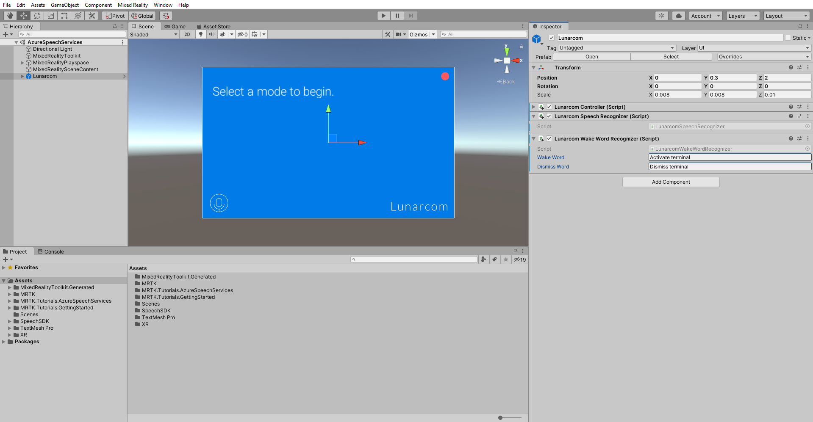
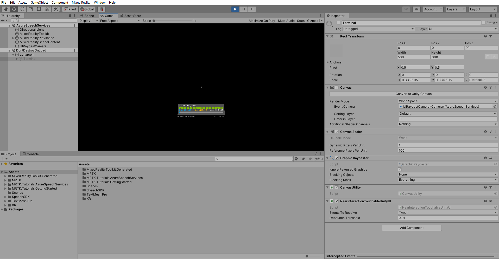
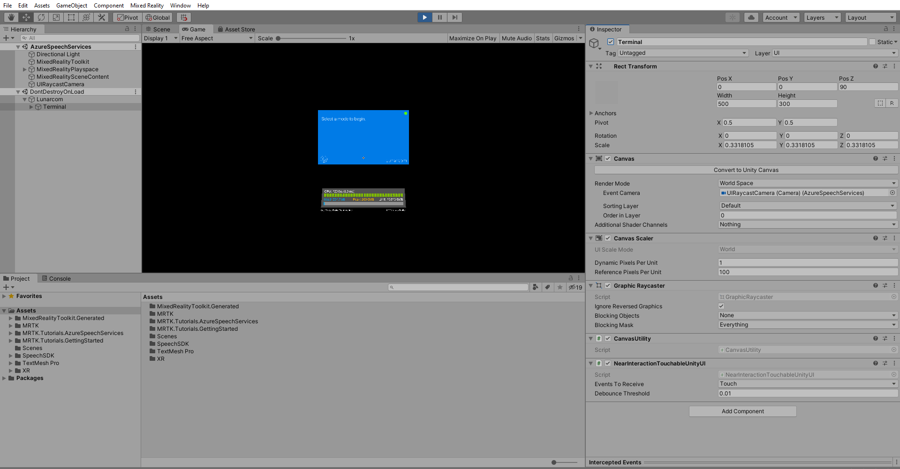

# 2. Execute commands using Azure speech recognition

In this tutorial, you will add the ability to execute commands using Azure speech recognition which will allow you to make something happen based on the word or phrase you define.

## Objectives

* Learn how Azure speech recognition can be used to execute commands

## Instructions

In the Hierarchy window, select the **Lunarcom** object, then in the Inspector window, use the **Add Component** button to add the **Lunarcom Wake Word Recognizer (Script)** component to the Lunarcom object and configure it as follows:

* In the **Wake Word** field, enter a suitable phrase, for example, _Activate terminal_.
* In the **Dismiss Word** field, enter a suitable phrase, for example, _Dismiss terminal_.

> [!NOTE]
> The Lunarcom Wake Word Recognizer (Script) component is not part of MRTK. It was provided with this tutorial's assets.

If you now enter Game mode, as in the previous tutorial, the terminal panel is enabled by default, but you can now disable it by saying the Dismiss Word, **Dismiss terminal**:

And enable it again by saying the Wake Word, **Activate terminal**:

> [!CAUTION]
> The application needs to connect to Azure, so make sure your computer/device is connected to the internet.

> [!TIP]
> If you anticipate frequently not being able to connect to Azure, you can also implement speech commands using MRTK by following the [Using speech commands](mr-learning-base-09.md) instructions.

## Congratulations

You have implemented speech commands powered by Azure. Run the application on your device to ensure the feature is working properly.

In the next tutorial, you will learn how to translate speech using Azure speech translation.

> [!div class="nextstepaction"]
> [Next Tutorial: 3. Adding the Azure Cognitive Services speech translation component](mrlearning-speechSDK-ch3.md)
