# 4. Setting up intent and natural language understanding

In this tutorial, you will explore the Azure Speech Service's intent recognition. The intent recognition allows you to equip our application with AI-powered speech commands, where users can say non-specific speech commands and still have their intent understood by the system.

## Objectives

* Learn how to set up intent, entities, and utterances in the LUIS portal
* Learn how to implement intent and natural language understanding in our application

## Preparing the scene

In the Hierarchy window, select the **Lunarcom** object, then in the Inspector window, use the **Add Component** button to add the **Lunarcom Intent Recognizer (Script)** component to the Lunarcom object:

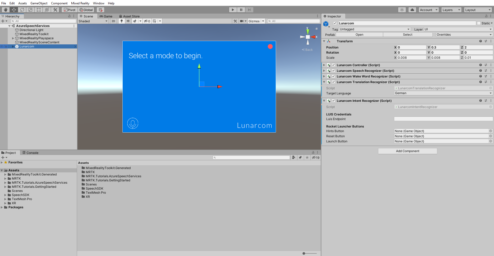

In the Project window, navigate to the **Assets** > **MRTK.Tutorials.GettingStarted** > **Prefabs** > **RocketLauncher** folder, drag the **RocketLauncher_Complete** prefab into your Hierarchy window, and place it at a suitable location in front of the camera, for example:

* Transform **Position** X = 0, Y = -0.4, Z = 1
* Transform **Rotation** X = 0, Y = 90, Z = 0

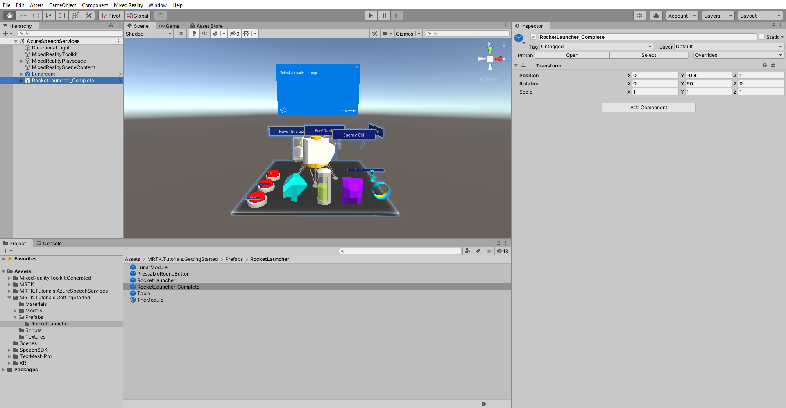

In the Hierarchy window, select the **Lunarcom** object again, then expand the **RocketLauncher_Complete** > **Button** object and assign each of the **Buttons** object's child objects to the corresponding **Lunar Launcher Buttons** field:

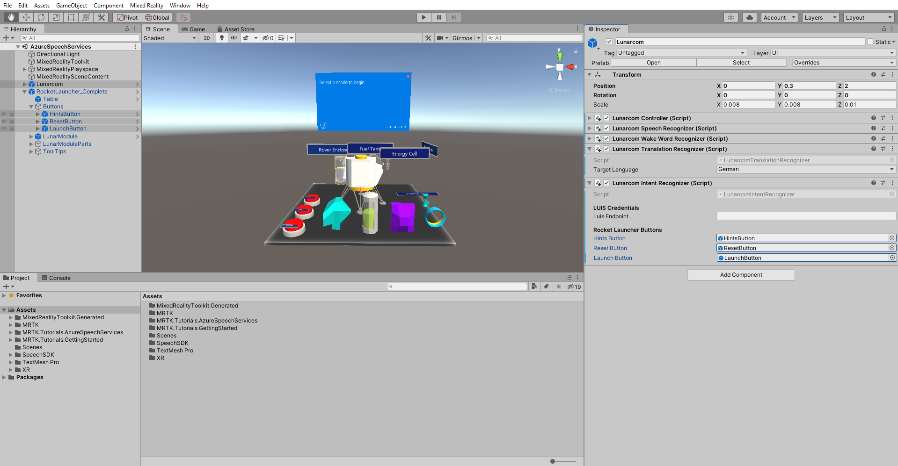

## Creating the Azure Language Understanding resource

In this section, you will create an Azure prediction resource for the Language Understanding Intelligent Service (LUIS) app you will create in the next section.

Sign in to <a href="https://portal.azure.com" target="_blank">Azure</a> and click **Create a resource**. Then search for and select **Language Understanding**:

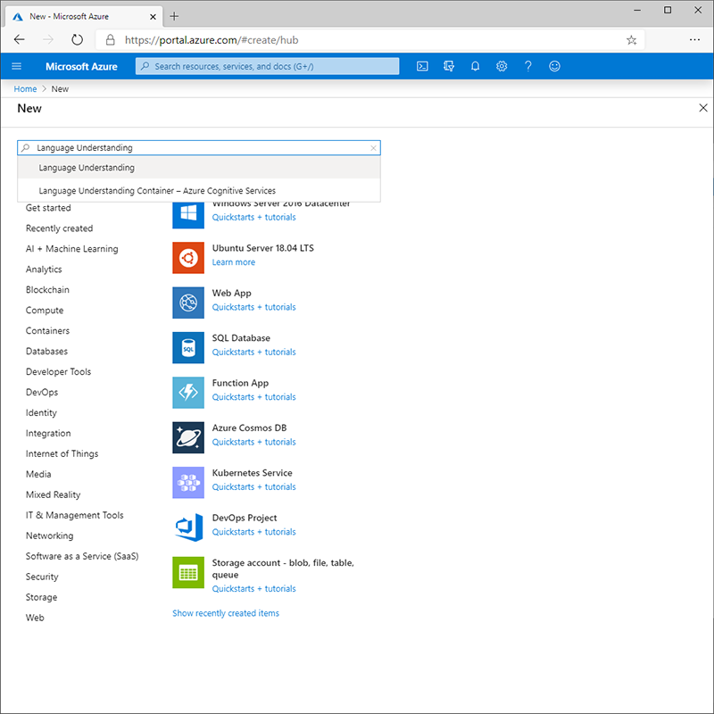

Click the **Create** button to create an instance of this service:

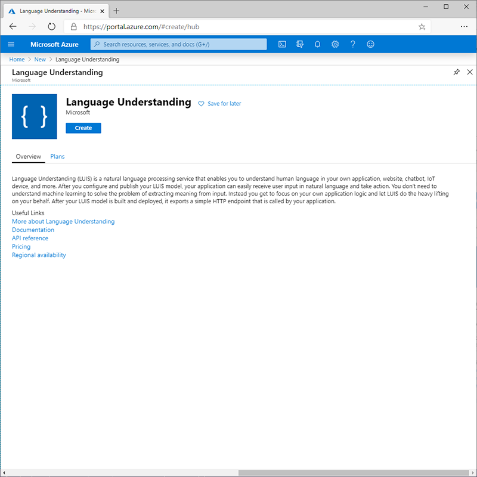

On the Create page, click the **Prediction** option and enter the following values:

* For **Subscription**, select **Free Trail** if you have a trial subscription, otherwise, select one of your other subscriptions
* For the **Resource group**, click the **Create new** link, enter a suitable name, for example, *MRKT-Tutorials*, and then click on **OK**

> [!NOTE]
> As of the time of this writing, you do not need to create an authoring resource because an authoring trial key will automatically be generated within LUIS when you create the Language Understanding Intelligent Service (LUIS) in the next section.

> [!TIP]
> If you already have another suitable resource group in your Azure account, for example, if you completed the [Azure Spatial Anchors](mr-learning-asa-01.md) tutorial, you may use this resource group instead of creating a new one.

While still on the Create page, enter the following values:

* For **Name**, enter a suitable name for the service, for example, *MRTK-Tutorials-AzureSpeechServices*
* For **Prediction location**, choose a location close to your app users' physical location, for example, *(US) West US*
* For **Prediction pricing tier**, for the purpose of this tutorial, select **F0 (5 Calls per second, 10K Calls per month)**

Next, click on **Review + create** tab, review the details, and then click the **Create** button, located at the bottom of the page, to create the resource, as well as, the new resource group if you configured one to be created:

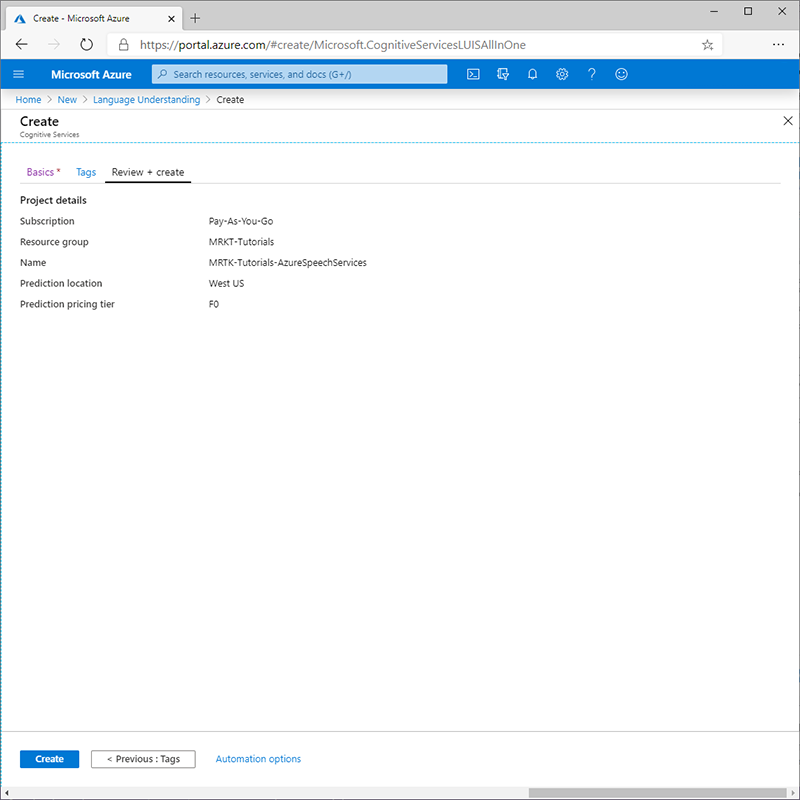

> [!NOTE]
> After you click the Create button, you will have to wait for the service to be created, which might take a few minutes.

Once the resource creation process is completed, you will see the message **Your deployment is complete**:

## Creating the Language Understanding Intelligent Service (LUIS)

In this section, you will create a LUIS app, configure and train its prediction model, and connect it to the Azure prediction resource you created in the previous step.

Specifically, you will create an intent that if the user says an action should be taken, the app will trigger the Interactable.OnClick() event on one of the three red buttons in the scene, depending on which button the user references.

For example, if the user says **go ahead and launch the rocket**, the app will predict that **go ahead** means some **action** should be taken, and that the Interactable.OnClick() event to **target** is on the **launch** button.

The main steps you will take to achieve this are:

1. Create a LUIS app
2. Create intents
3. Create example utterances
4. Create entities
5. Assign entities to the example utterances
6. Train, test, and publish the app
7. Assign an Azure prediction resource to the app

### 1. Create a LUIS app

Using the same user account you used when creating the Azure resource in the previous section, sign in to <a href="https://www.luis.ai" target="_blank">LUIS</a>, select your country, and agree to the terms of use. In the next step, when asked to **Link your Azure account**, choose **Continue using your trial key**, to use an Azure authoring resource instead.

> [!NOTE]
> If you have already signed up for LUIS and your authoring trial key has expired, you can refer to the [Migrate to an Azure resource authoring key](/azure/cognitive-services/luis/luis-migration-authoring) documentation to switch your LUIS authoring resource to Azure.

Once signed in, click **New app** and enter the following values in the **Create new app** popup window:

* For **Name**, enter a suitable name, for example, *MRTK Tutorials - AzureSpeechServices*
* For **Culture**, select **English**
* For **Description**, optionally enter a suitable description
* For **Prediction resource**, select the prediction resource by dropdown list that had been created azure portal.

Then click the **Done** button to create the new app:

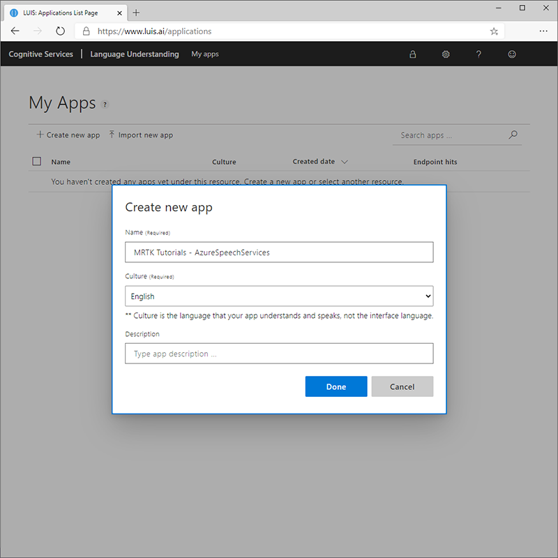

When the new app has been created, you will be taken to that app's **Dashboard** page:

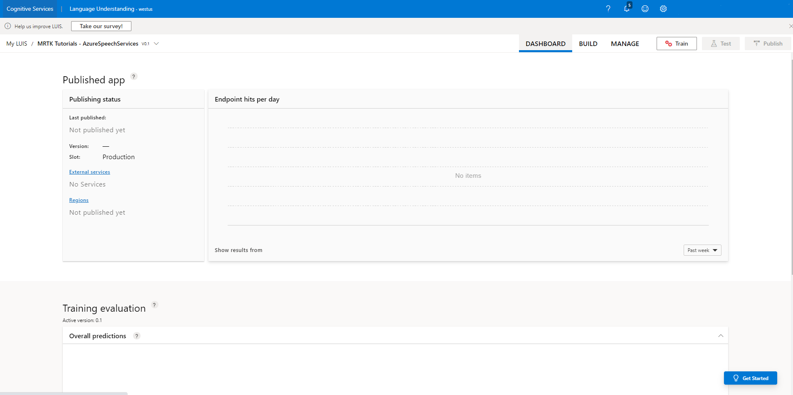

### 2. Create intents

From the Dashboard page, navigate to the Build > App Assets > **Intents** page, then click **Create** and enter the following value in the **Create new intent** popup window:

* For **Intent name**, enter **PressButton**

Then click the **Done** button to create the new intent:

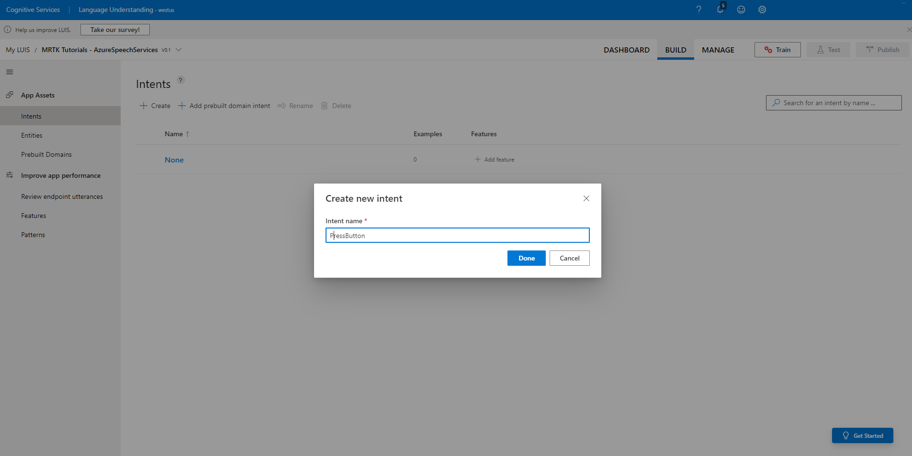

> [!CAUTION]
> For the purpose of this tutorial, your Unity project will reference this intent by its name, i.e. 'PressButton'. Consequently, it is extremely important that you name your intent exactly the same.

When the new intent has been created, you will be taken to that intent's page:

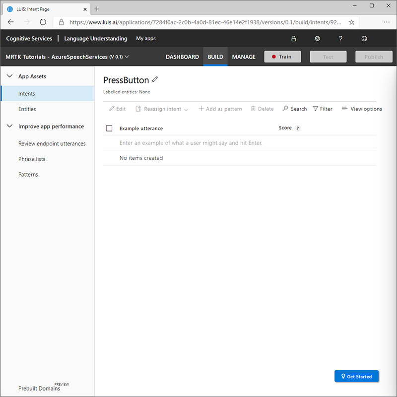

### 3. Create example utterances

To the **PressButton** intent's **Example utterance** list, add the following example utterances:

* activate launch sequence
* show me a placement hint
* initiate the launch sequence
* press placement hints button
* give me a hint
* push the launch button
* i need a hint
* press the reset button
* time to reset the experience
* go ahead and launch the rocket

When all the example utterances have been added, your PressButton intent page should look similar to this:

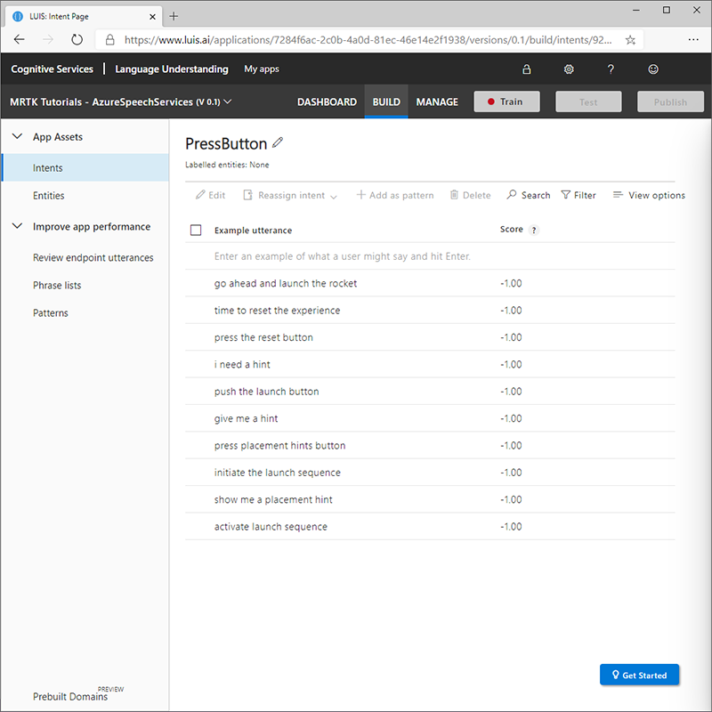

> [!CAUTION]
> For the purpose of this tutorial, your Unity project will reference the words 'hint', 'hints', 'reset', and 'launch'. Consequently, it is extremely important that you spell these words in the exact same way.

### 4. Create entities

From the PressButton intent page, navigate to the Build > App Assets > **Entities** page, then click **Create** and enter the following values in the **Create new entity** popup window:

* For **Entity name**, enter **Action**
* For **Entity type**, select **Machine learned**

Then click the **Create** button to create the new entity:

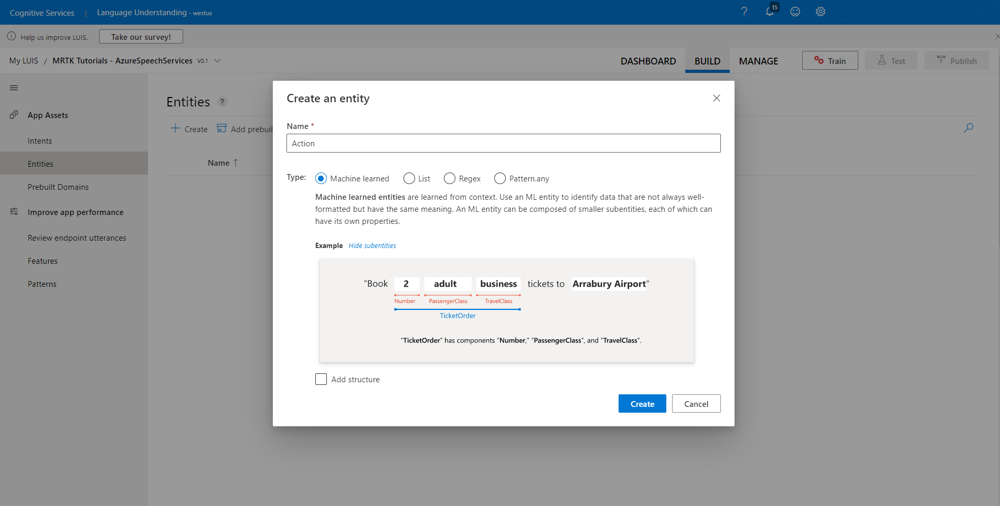

**Repeat** the previous step to create another entity named **Target**, so you have two entities named Action and Target:

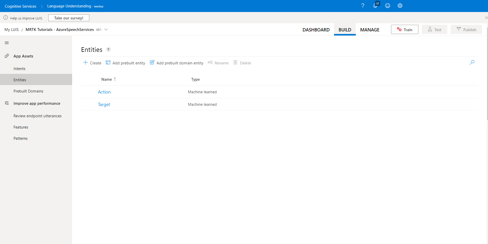

> [!CAUTION]
> For the purpose of this tutorial, your Unity project will reference these entities by their names, i.e. 'Action' and 'Target'. Consequently, it is extremely important that you name your entities exactly the same.

### 5. Assign entities to the example utterances

From the Entities page, navigate back to the **PressButton** intent page.

Once back on the the PressButton intent page, click on the word **go** and then on the word **ahead**, and then select **Action (Simple)** from the contextual popup menu to label **go ahead** as an **Action** entity value:

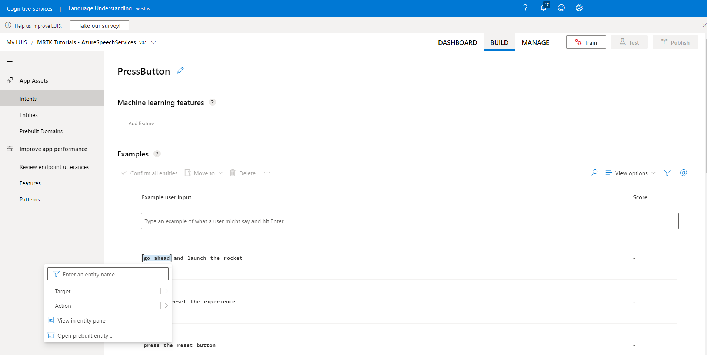

The **go ahead** phrase is now defined as an **Action** entity value. Now you can notice the action entity value under the word go ahead:

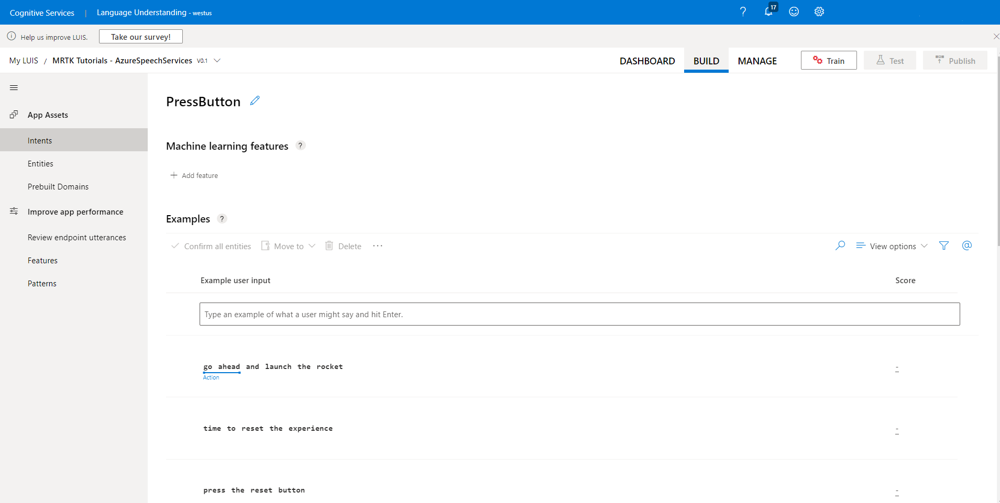

> [!NOTE]
> The red line you see under the label in the image above indicates that the entity value has not been predicted, this will be resolved when you train the model in the next section.

Next, click on the word **launch**, and then select **Target (Simple)** from the contextual popup menu to label **launch** as a **Target** entity value:

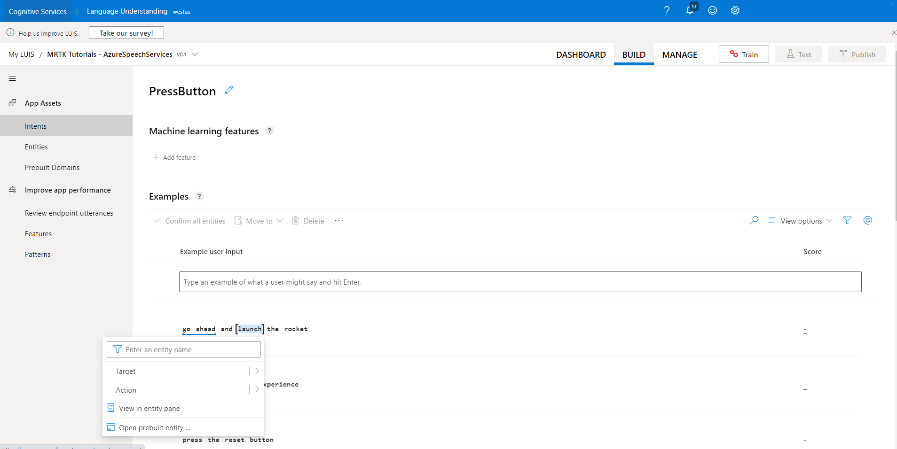

The **launch** word is now defined as a **Target** entity value.Now you can notice the Target entity value under the word launch :

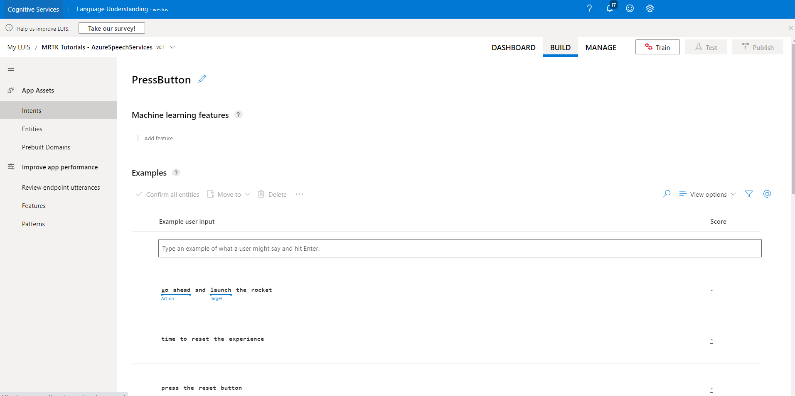

The PressButton intent example utterance 'go ahead and launch the rocket' is now configured to be predicted as follows:

* Intent: PressButton
* Action entity: go ahead
* Target entity: launch

**Repeat** the previous two-step process to assign an Action and a Target entity label to each of the example utterances, keeping in mind that the following words should be labeled as **Target** entities:

* **hint** (targets the HintsButton in the Unity project)
* **hints** (targets HintsButton in the Unity project)
* **reset** (targets the ResetButton in the Unity project)
* **launch** (targets the LaunchButton in the Unity project)

When all the example utterances have been labeled, your PressButton intent page should look similar to this:

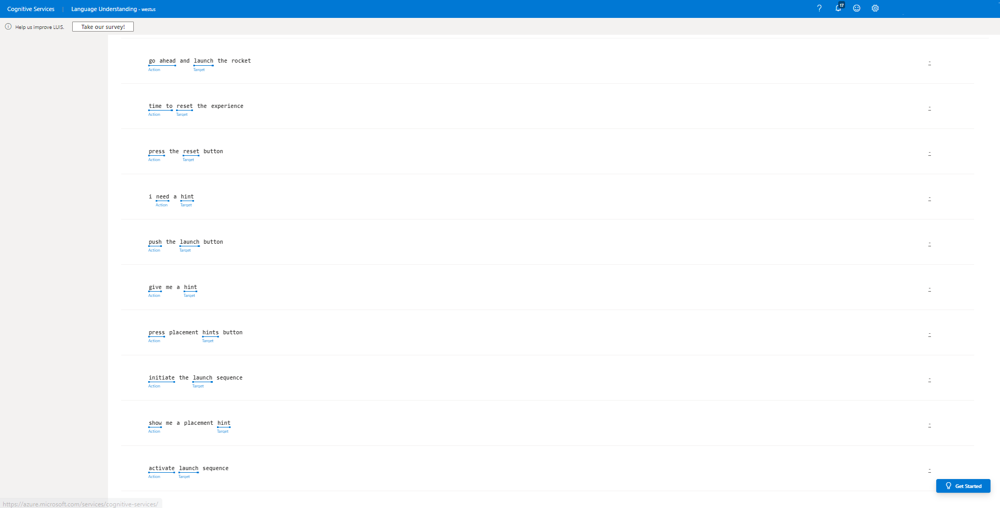

### 6. Train, test, and publish the app

To train the app, click the **Train** button and wait for the training process to complete:

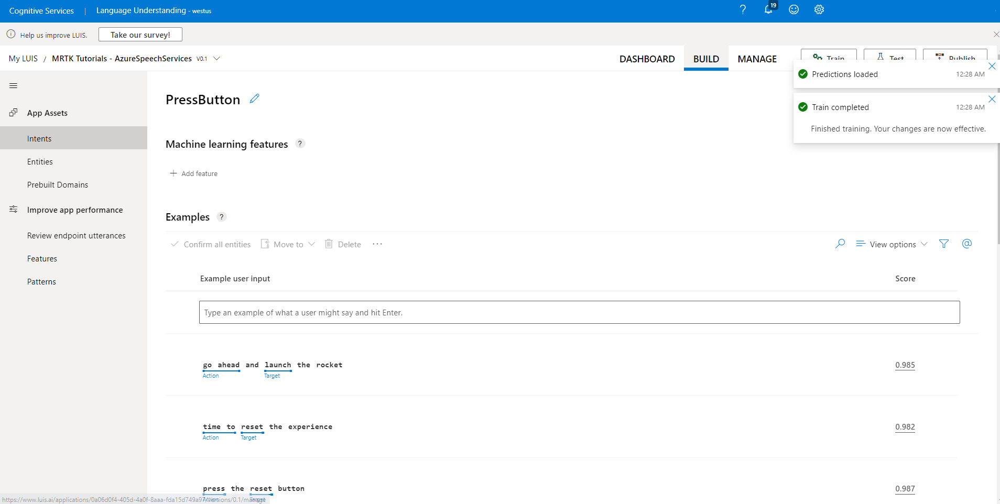

> [!NOTE]
> As you can see in the image above, the red lines under all the labels have been removed, indicating that all the entity values have been predicted. Also notice that the status icon to the left of the Train button has changed color from red to green.

When the training is finished processing, click the **Test** button, then type in **go ahead and launch the rocket** and press the Enter key:

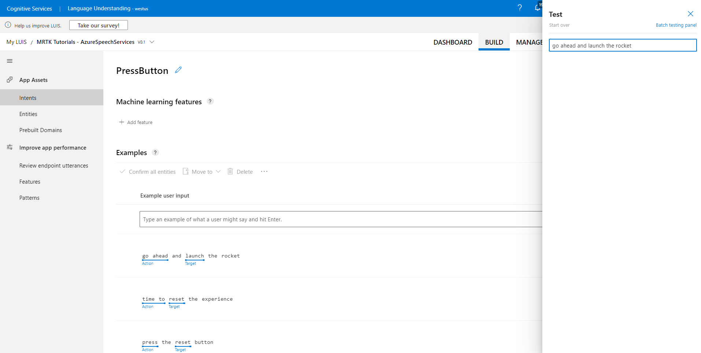

When the test utterance has been processed, click **Inspect** to see the test result:

* Intent: PressButton (with a 98.5% certainty)
* Action entity: go ahead
* Target entity: launch

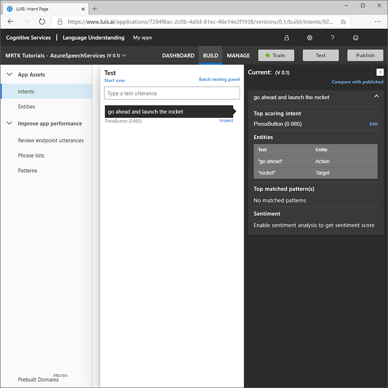

To publish the app, click the **Publish** button in the top right, then in the **Choose your publishing slot and settings** popup window, select **Production** and click the **Done** button:

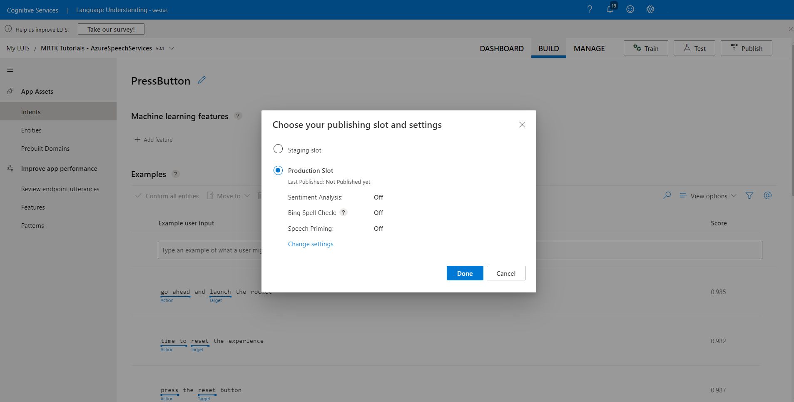

Wait for the publishing process to complete:

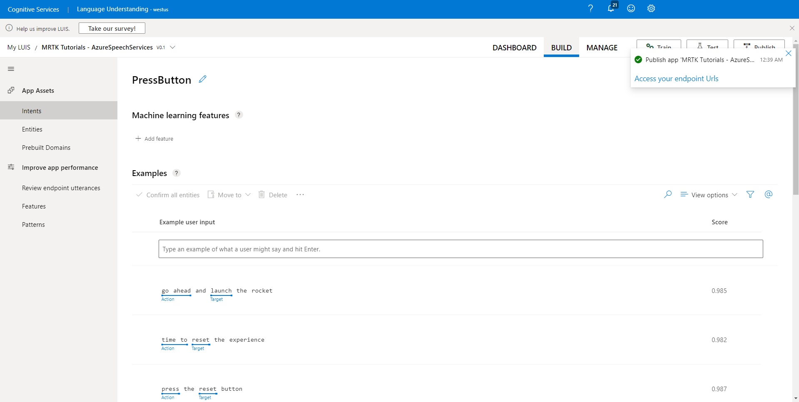

Navigate to the Manage > Application Settings > **Azure Resources** page, your Azure Resources page should look similar to this:

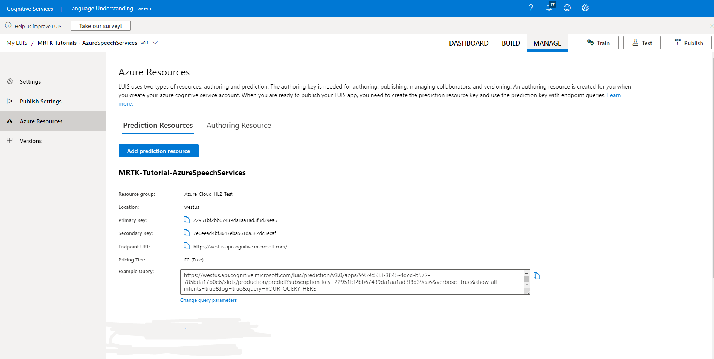

## Connecting the Unity project to the LUIS app

On the Manage > Application Settings > **Azure Resources** page, click the **copy** icon to copy the **Example Query**:

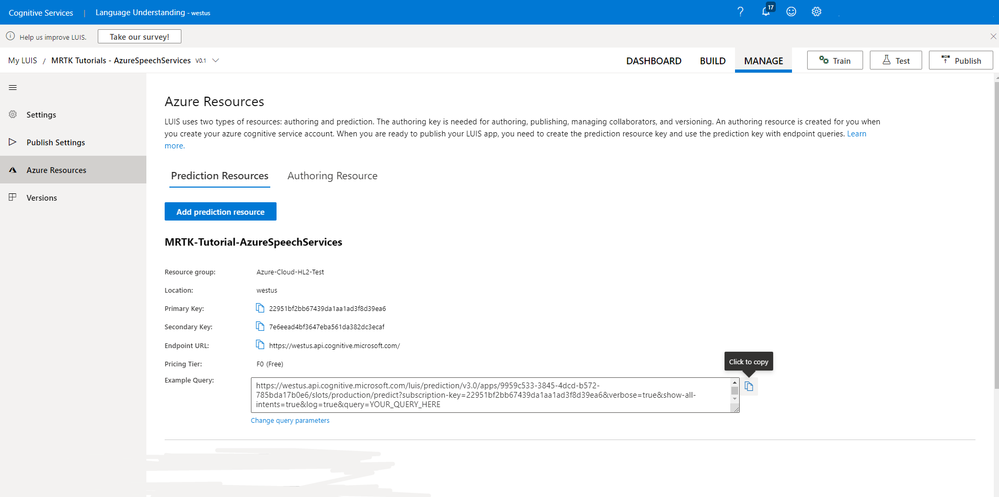

Back in your Unity project, in the Hierarchy window, select the **Lunarcom** object, then in the Inspector window, locate the **Lunarcom Intent Recognizer (Script)** component and configure it as follows:

* In the **LUIS Endpoint** field, past the **Example Query** you copied in the previous step:

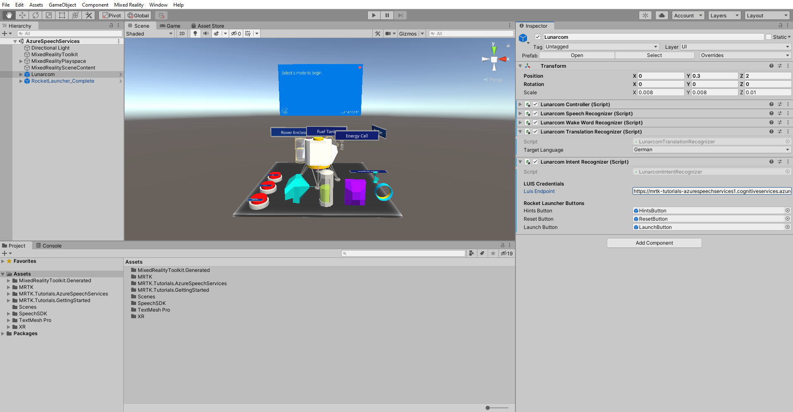

## Testing and improving the intent recognition

To use intent recognition directly in the Unity editor, you must allow your development computer to use dictation. To verify this setting, open Windows **Settings** then choose **Privacy** > **Speech** and ensure **Online speech recognition** is turned on:

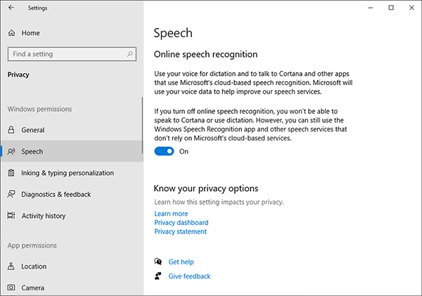

If you now enter Game mode, you can test the intent recognition by first pressing the rocket button. Then, assuming your computer has a microphone, when you say the first example utterance, **go ahead and launch the rocket**, you will see the LunarModule launch into space:

Try all the **example utterances**, then some **variation of the example utterances**, as well as, a few **random utterances**.

Next, return to <a href="https://www.luis.ai" target="_blank">LUIS</a> and navigate to Build > Improve app performance > **Review endpoint utterances** page, use the **toggle** button to switch from the default Entities View to **Tokens View**, and then review the utterances:

* In the **Utterance** column, change and remove the assigned labels as needed so they align with your intent
* In the **Aligned intent** column, verify that the intent is correct
* In the **Add/Delete** column, click the green check mark button to add the utterance or the red x button to delete it

When you have reviewed as many utterances as you like, click the **Train** button to retrain the model, then the **Publish** button to republish the updated app:

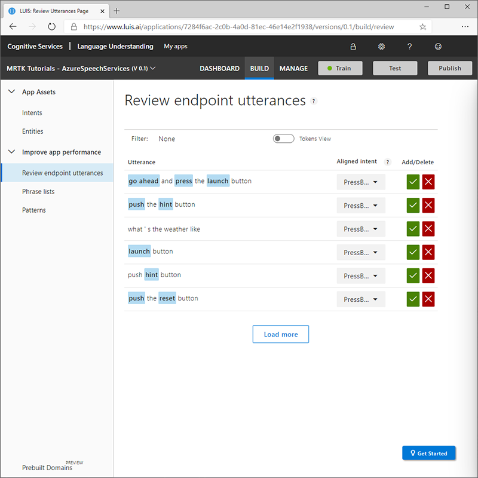

> [!NOTE]
> If an endpoint utterance does not align with the PressButton intent, but you would like your model to know that the utterance has no intent, you can change the Aligned intent to None.

**Repeat** this process as many times as you like to improve your app model.

## Congratulations

Your project now have AI-powered speech commands, allowing your application to recognize the users' intent even if they do not utter precise commands. Run the application on your device to ensure the feature is working properly.
