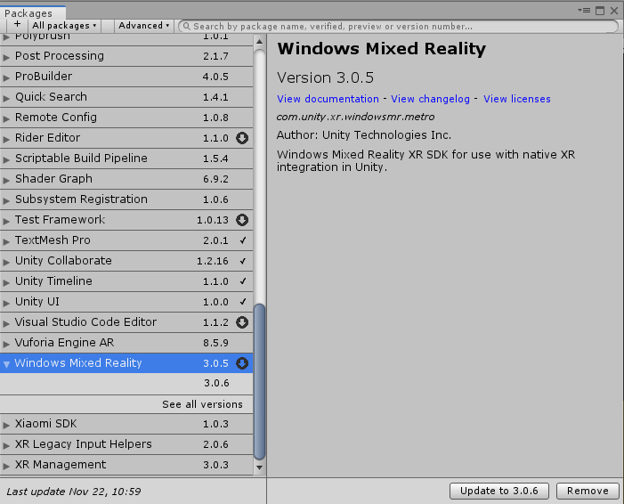
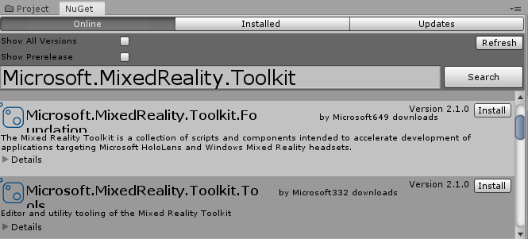
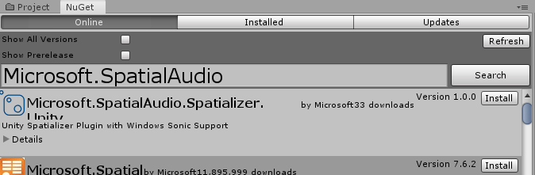

# Adding spatial audio to your Unity project

Welcome to the spatial audio tutorial for Unity on HoloLens2. This tutorial sequence shows:
* How to use head-related transfer function (HRTF) offload on HoloLens 2 in Unity
* How to enable reverb when using HRTF offload

The [Microsoft Spatializer GitHub repository](https://github.com/microsoft/spatialaudio-unity) has a completed Unity project of this tutorial sequence. 

For an understanding about what it means to spatialize sounds using HRTF-based spatialization technologies and recommendations for when it can be helpful, see [spatial sound design](https://docs.microsoft.com/windows/mixed-reality/spatial-sound-design).

## What is HRTF offload?

Processing audio using HRTF-based algorithms requires a large amount of specialized computation. HoloLens 2 includes dedicated hardware that can be utilized to avoid burdening the application processor, thus "offloading" the processing of HRTF-based algorithms.  The Microsoft spatializer plugin provides an easy way for your application to take advantage of the dedicated HRTF hardware so your application can use more of the application processor for operations other than spatial audio.

## Objectives

In this first chapter, you'll:
* Create a Unity project and import MRTK
* Import the Microsoft spatializer plugin
* Enable the Microsoft spatializer plugin
* Enable spatial audio on your developer workstation

## Create a project and add NuGet for Unity

Start with an empty Unity project, then add and configure NuGet for Unity:
1. Download the latest [NuGetForUnity .unitypackage](https://github.com/GlitchEnzo/NuGetForUnity/releases/latest)
2. In the Unity menu bar, click **Assets -> Import Package -> Custom Package...** and install the NuGetForUnity package:

## Add the Windows Mixed Reality package

Windows Mixed Reality support in Unity 2019 and later is contained in an optional package. To add it to your project, open **Window -> Package Manager** from the Unity menu bar:

Then find and install the **Windows Mixed Reality** package:

## Install MRTK and Microsoft Spatializer

Using NuGet for Unity, install the MRTK and Microsoft Spatializer plugins:
1. In the Unity menu bar, click on **NuGet -> Manage NuGet Packages**.

2. In the **Search** box, enter "Microsoft.MixedReality.Toolkit" and install the MRTK core package: **Microsoft.MixedReality.Toolkit.Foundation**

[MRTK NuGet Package](https://microsoft.github.io/MixedRealityToolkit-Unity/Documentation/MRTKNuGetPackage.html) has additional context and details.

4. In the **Search** box, enter "Microsoft.SpatialAudio" and install the Microsoft Spatializer package: **Microsoft.SpatialAudio.Spatializer.Unity**

## Set up MRTK in your project

1. Open the Build Settings window by going to **File -> Build Settings**.

2. Select the _Universal Windows Platform_ and click **Switch Platform**.

3. Click **Player Settings** in the **Build Window** to open the **Player Settings** properties in the **Inspector** pane.
    * Under **XR Settings**, check the **Virtual Reality Supported** checkbox
    * Under **XR Settings**, change the **Stereo Rendering Mode** to **Single Pass Instanced**.
    * Under **Publishing Settings**, check the **Spatial Perception** checkbox in the **Capabilities** section

4. On the menu bar, click **Mixed Reality Toolkit -> Add to Scene and Configure..** to add MRTK to your scene.

For additional guidance, including how to build your app and deploy to a HoloLens 2, see [Chapter 1 of the MR Learning Base Module](../../../mrlearning-base-ch1.md).

## Enable the Microsoft Spatializer plugin

Enable the **Microsoft Spatializer** plugin. Open **Edit -> Project Settings -> Audio**, and change **Spatializer Plugin** to "Microsoft Spatializer". The **Audio** section of the **Project Settings** will now look like this:

## Enable spatial audio on your workstation

On desktop versions of Windows, spatial audio is disabled by default. Enable it by right-clicking on the volume icon in the task bar. To get the best representation of what you'll hear on HoloLens 2, choose **Spatial sound -> Windows Sonic for Headphones**.

> [!NOTE]
> This setting is only required if you plan to test your project in the Unity editor.

## Next steps

> [!div class="nextstepaction"]
> [Unity spatial audio chapter 2](unity-spatial-audio-ch2.md)

