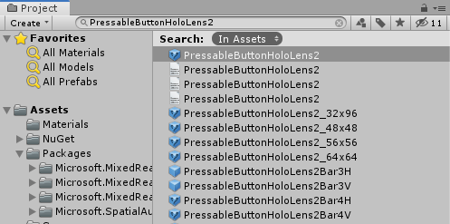
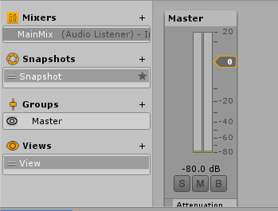
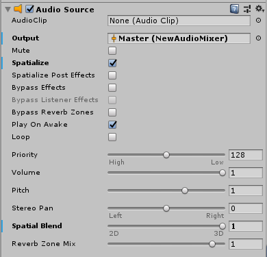

# Spatializing button interaction sounds

## Objectives

In this second chapter of the spatial audio module of the HoloLens 2 tutorials, you'll:
* Add a button
* Spatialize the button click sounds

## Add a button

In the **Project** pane, select **Assets** and type "PressableButtonHoloLens2" in the search bar:

The button prefab is the entry represented by a blue icon, rather than a white icon. Drag the prefab named **PressableButtonHoloLens2** into the **Hierarchy** pane. In the **Inspector** pane for your new button, set the **Position** property to (0, -0.4, 2) so that it will appear in front of the user when the application starts. The **Transform** component of the button will look like this:

## Spatialize button feedback

In this step, you'll spatialize the audio feedback for the button. For related design suggestions, see [spatial sound design](../../../design/spatial-sound-design.md). 

The **Audio Mixer** pane is where you'll define destinations, called **Mixer Groups**, for audio playback from **Audio Source** components. 
* Open the **Audio Mixer** pane from the menu bar using **Window -> Audio -> Audio Mixer**
* Create a **Mixer** by clicking the '+' next to **Mixers**. The new mixer will include a default **Group** called **Master**.

Your **Mixer** pane will now look like this:

> [!NOTE]
> Until reverb is enabled in [Chapter 5](unity-spatial-audio-ch5.md), the mixer's volume meter doesn't show activity for sounds played through the Microsoft Spatializer

Click the **PressableButtonHoloLens2** in the **Hierarchy** pane. In the **Inspector** pane:
1. Find the **Audio Source** component
2. For the **Output** property, click the selector and choose your mixer
3. Check the **Spatialize** checkbox
4. Move the **Spatial Blend** slider to 3D (1).

> [!NOTE]
> In versions of Unity prior to 2019, the 'Spatialize' checkbox is at the bottom of the **Inspector** pane for the **Audio Source**.

After these changes, the **Audio Source** component of your **PressableButtonHoloLens2** will look like this:

> [!NOTE]
> If you move **Spatial Blend** to 1 (3D) without checking the **Spatialize** checkbox, Unity will use its panning spatializer, instead of the **Microsoft Spatializer** with HRTFs.

## Adjust the Volume curve

By default, Unity will attenuate spatialized sounds as they get farther from the listener. When this attenuation is applied to interaction feedback sounds, the interface can become more difficult to use.

To disable this attenuation, adjust the **Volume** curve. In the **Audio Source** component of the **Inspector** pane for the **PressableButtonHoloLens2**, there is a section called **3D Sound Settings**. In that section:
1. Set the **Volume Rolloff** property to Linear
2. Drag the endpoint on the **Volume** curve (the red curve) from '0' on the y axis up to '1'
3. To adjust the shape of the **Volume** curve to be flat, drag the white curve shape control to be parallel to the X axis

After these changes, the **3D Sound Settings** section of the **Audio Source** properties of the **PressableButtonHoloLens2** will look like this:

## Testing the spatialize audio

Feel free to test out the new spatialized button interaction sounds:

* Enter game mode in the Unity editor, ideally with a looped audio sample in the scene
* Move the object with the audio source from left to right and compare with and without spatial audio enabled. You can change the Audio Source settings for testing by:
    * Moving the Spatial Blend property between 0 - 1 (2D non-spatialized and 3D spatialized sound)
    * Checking and unchecking the Spatialize property

## Next steps

Try out your app on a HoloLens 2, or in the Unity editor. In the app, you can touch the button and hear the spatialized button interaction sounds.

When testing in the Unity editor, press the space bar and scroll with the scroll wheel to activate hand simulation. For more info, see the [MRTK documentation](https://microsoft.github.io/MixedRealityToolkit-Unity/Documentation/GettingStartedWithTheMRTK.html#using-the-in-editor-hand-input-simulation-to-test-a-scene).

> [!div class="nextstepaction"]
> [Chapter 3](unity-spatial-audio-ch3.md)

