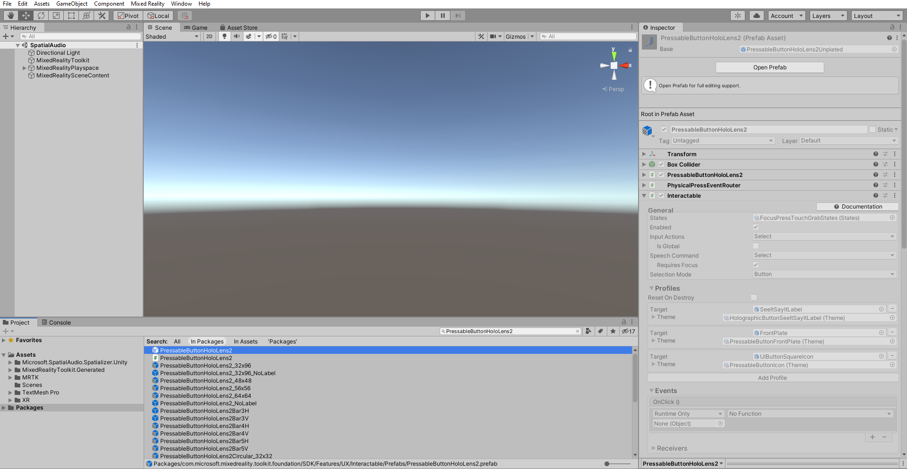
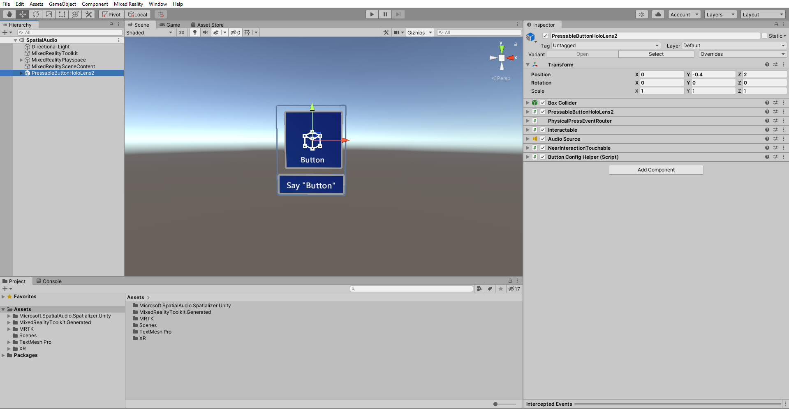
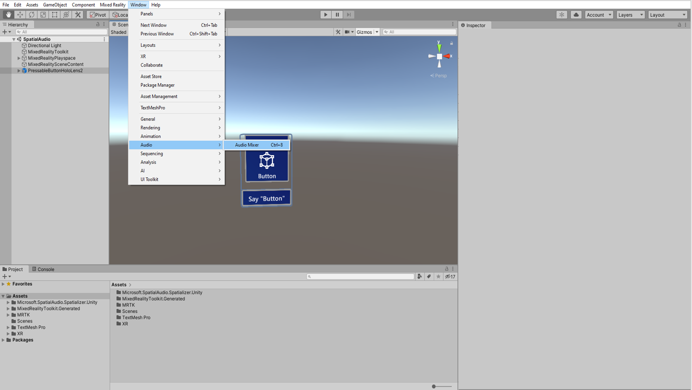
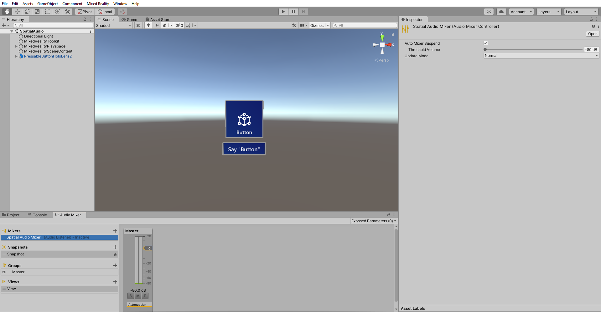
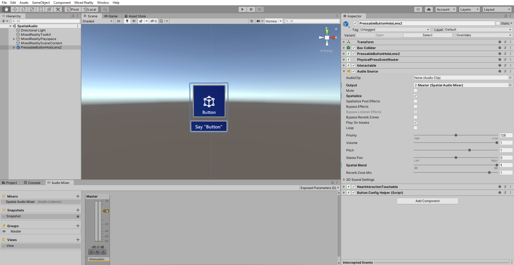
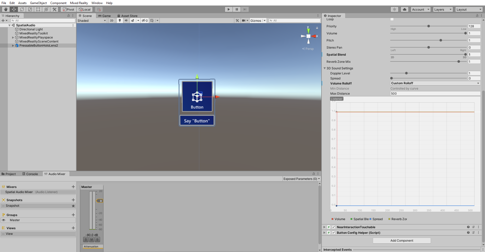

# 2. Spatializing button interaction sounds

## Overview

In this tutorial, you will learn how to spatialize the button interaction sounds and also learn how to use an audio clip to test spatialized button interaction.  

## Objectives

* Add and Spatialize the button click sounds

## Add a button

To add the Button prefab, in the **Project** window, select **Packages** and type "PressableButtonHoloLens2" in the search bar.

The button prefab is the entry represented by a blue icon. Click and drag the **PressableButtonHoloLens2** prefab into the Hierarchy. With the **PressableButtonHoloLens2** object still selected, in the Inspector window, configure the **Transform** component as follows:

* **Position**: X = 0, Y = -0.4, Z = 2
* **Rotation**: X = 0, Y = 0, Z = 0
* **Scale**: X = 1, Y = 1, Z = 1

To focus in on the objects in the scene, you can double-click on the **PressableButtonHoloLens2** object, and then zoom slightly in again:

## Spatialize button feedback

In this step, you'll spatialize the audio feedback for the button. For related design suggestions, see [spatial sound design](../../../design/spatial-sound-design.md).

In the **Audio Mixer** window you will define destinations called **Mixer Groups**, for audio playback from **Audio Source** components.

To open the **Audio Mixer** window, In the Unity menu, select **Window** > **Audio** > **Audio Mixer**:

 Create a **Mixer** by clicking the '+' next to **Mixers** and enter a suitable name to the Mixer for example, _Spatial Audio Mixer_. The new mixer will include a default **Group** called **Master**.

> [!NOTE]
> Until reverb is enabled in [5th Chapter: Using reverb to add distance to spatial audio](unity-spatial-audio-ch5.md), the mixer's volume meter doesn't show activity for sounds played through the Microsoft Spatializer

In the Hierarchy window, select the **PressableButtonHoloLens2** then in the Inspector window
find the **Audio Source** component and Configure the Audio Source component as follows:

1. For the **Output** property, click the selector and choose the **Mixer** that you created.
2. Check the **Spatialize** checkbox.
3. Move the **Spatial Blend** slider to 3D (1).

> [!NOTE]
> If you move **Spatial Blend** to 1 (3D) without checking the **Spatialize** checkbox, Unity will use its panning spatializer, instead of the **Microsoft Spatializer** with HRTFs.

## Adjust the Volume curve

By default, Unity will attenuate spatialized sounds as they get farther from the listener. When this attenuation is applied to interaction feedback sounds, the interface can become more difficult to use.

To disable this attenuation, you need to adjust the **Volume** curve In the **Audio Source** component.

In the Hierarchy window, select the **PressableButtonHoloLens2** then in the Inspector window
navigate to  **Audio Source** > **3D Sound Settings** and Configure as follows:

1. Set the **Volume Rolloff** property to Linear Rolloff
2. Drag the endpoint on the **Volume** curve (the red curve) from '0' on the y axis up to '1'
3. To adjust the shape of the **Volume** curve to be flat, drag the white curve shape control to be parallel to the X axis

## Testing the spatialize audio

To test the spatialize audio in the unity editor you have to add an audio clip in the **Audio Source** component with **Loop** option checked in on **PressableButtonHoloLens2** object.

In the play mode move the **PressableButtonHoloLens2** object from left to right and compare with and without spatial audio enabled on your workstation. You can also change the Audio Source settings for testing by:

* Moving the **Spatial Blend** property between 0 - 1 (2D non-spatialized and 3D spatialized sound)
* Checking and unchecking the **Spatialize** property

Try out the app on HoloLens 2. In the app, you can click the button and hear the spatialized button interaction sounds.

> [!TIP]
> For a reminder on how to build and deploy your Unity project to HoloLens 2, you can refer to the [Building your app to your HoloLens 2](mr-learning-base-02.md#building-your-application-to-your-hololens-2) instructions.

## Congratulations

In this tutorial you have learnt to spatialize the button interaction sounds and to use an audio clip to test spatialized button interaction. In the next tutorial you will learn how to spatialize audio from an video source.

> [!div class="nextstepaction"]
> [Next Tutorial: 3. Spatializing audio from a video](unity-spatial-audio-ch3.md)
