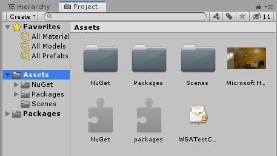
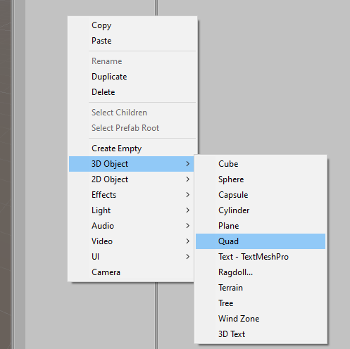
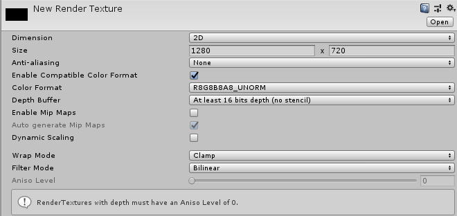
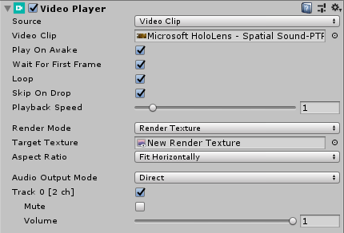
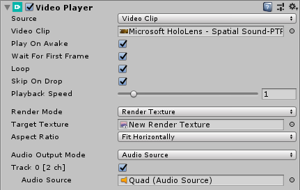

# Spatializing audio from a video

In this 3rd chapter of the spatial audio module of the HoloLens 2 Unity tutorials, you'll:
* Import a video and add a Video Player
* Play the video onto a quadrangle
* Route audio from the video to the quadrangle, and spatialize the audio

## Import a video and add a Video Player

Drag a video file into the **Project** pane in your Unity project. You can use [this video](https://github.com/microsoft/spatialaudio-unity/blob/develop/Samples/MicrosoftSpatializerSample/Assets/Microsoft%20HoloLens%20-%20Spatial%20Sound-PTPvx7mDon4.mp4?raw=true) from the spatial audio sample project.

Adjusting the quality settings on the video clip can ensure smooth playback on HoloLens 2. Click on the video file in the **Project** pane. Then in the **Inspector** pane for the video file, override the settings for Windows Store Apps, and:
* Enable **Transcode**
* Set **Codec** to H264
* Set **Bitrate Mode** to Low
* Set **Spatial Quality** to Medium Spatial Quality

After these adjustments, the **Inspector** pane for the video file will look like this:

Next, add a **Video Player** object to the **Hierarchy** by right-clicking on the **Hierarchy** pane and choosing **Video -> Video Player**:

## Play video onto a quadrangle

The **Video Player** object needs a textured game object on which to render the video. First, add a **Quad** to your **Hierarchy** by right-clicking on the **Hierarchy** pane and choosing **3D Object -> Quad**:

To ensure the **Quad** appears in front of the user when the application starts, set the **Position** property of the **Quad** to (0, 0, 2), and the **Scale** property to (1.28, 0.72, 1). After these changes, the **Transform** component on the **Inspector** pane for the **Quad** will look like this:

To texture the **Quad** with video, create a new **Render Texture**. In the **Project** pane, right-click and choose **Create -> Render Texture**:

On the **Inspector** pane of the **Render Texture**, set the **Size** property to match the video's native resolution of 1280x720. Then, to ensure good rendering performance on HoloLens 2, set the **Depth Buffer** property to **At least 16 bits depth**. After these settings, the **Inspector** pane for the **Render Texture** will look like this:

Next, use your new **Render Texture** as the texture for the **Quad**:
1. Drag the **Render Texture** from the **Project** pane onto the **Quad** in the **Hierarchy**
2. To ensure good performance on HoloLens 2, on the **Inspector** pane for the **Quad**, select the **Mixed Reality Toolkit Standard Shader**.

With these settings, the **Texture** component on the **Inspector** pane for the **Quad** will look like this:

To set your new **Video Player** and **Render Texture** to play your video clip, open the **Inspector** pane for the **Video Player** and:
* Set the **Video Clip** property to your video file
* Check the **Loop** checkbox
* Set **Target Texture** to your new render texture

The **Inspector** pane for the **Video Player** will now look like this:

## Spatialize the audio from the video

In the **Inspector** pane for the **Quad**, create an **Audio Source** to which you'll route the audio from the video:
* Click **Add Component** at the bottom of the pane
* Add an **Audio Source**

Then, on the **Audio Source**:
* Set **Output** to your mixer
* Check the **Spatialize** box
* Move the **Spatial Blend** slider to 1 (3D)

After these changes, the **Audio Source** component on the **Inspector** pane for the **Quad** will look like this:

To set the **Video Player** to route its audio to the **Audio Source** on the **Quad**, open the **Inspector** pane for the **Video Player** and:
* Set the **Audio Output Mode** to 'Audio Source'
* Set the **Audio Source** property to your Quad

After these changes, the **Inspector** pane for the **Video Player** will look like this:

## Next steps

Try out your app on a HoloLens 2 or in the Unity editor. You'll see and hear the video, and the audio from the video will be spatialized.

> [!div class="nextstepaction"]
> [Chapter 4](unity-spatial-audio-ch4.md) 

