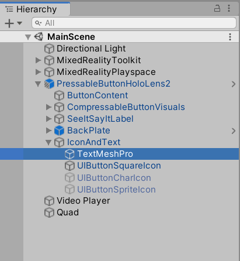

# Enabling and disabling spatialization at run time

## Objectives

In this 4th chapter, you'll:
* Add a new script to control spatialization on a game object
* Drive the spatialization control script from button actions

## Add spatialization control script

Right-click in the **Project** pane and create a new C# script by choosing **Create -> C# Script**. Name your script "SpatializeOnOff".


Double-click the script in the **Project** pane to open it in Visual Studio. Replace the default script contents with the following:

> [!NOTE]
> Several lines of the script are commented out. These lines will be uncommented in [Chapter 5](unity-spatial-audio-ch5.md).

```c#
using System.Collections;
using System.Collections.Generic;
using UnityEngine;
using UnityEngine.Audio;

[RequireComponent(typeof(AudioSource))]
public class SpatializeOnOff : MonoBehaviour
{
    public GameObject ButtonTextObject;
    //public AudioMixerGroup RoomEffectGroup;
    //public AudioMixerGroup MasterGroup;

    private AudioSource m_SourceObject;
    private bool m_IsSpatialized;
    private TMPro.TextMeshPro m_TextMeshPro;

    public void Start()
    {
        m_SourceObject = gameObject.GetComponent<AudioSource>();
        m_TextMeshPro = ButtonTextObject.GetComponent<TMPro.TextMeshPro>();
        SetSpatialized();
    }

    public void SwapSpatialization()
    {
        if (m_IsSpatialized)
        {
            SetStereo();
        }
        else
        {
            SetSpatialized();
        }
    }

    private void SetSpatialized()
    {
        m_IsSpatialized = true;
        m_SourceObject.spatialBlend = 1;
        m_TextMeshPro.SetText("Set Stereo");
        //m_SourceObject.outputAudioMixerGroup = RoomEffectGroup;
    }

    private void SetStereo()
    {
        m_IsSpatialized = false;
        m_SourceObject.spatialBlend = 0;
        m_TextMeshPro.SetText("Set Spatialized");
        //m_SourceObject.outputAudioMixerGroup = MasterGroup;
    }

}
```

> [!NOTE]
> To enable or disable spatialization, the script only adjusts the **spatialBlend** property, leaving the **spatialization** property enabled. In this mode, Unity still applies the **Volume** curve. Otherwise, if the user were to disable spatialization when far from the source, they would hear the volume increase abruptly. <br> <br>
> If you prefer to fully disable spatialization, modify the script to also adjust the **spatialization** boolean property of the **SourceObject** variable.

## Attach your script and drive it from the button

On the **Inspector** pane of the **Quad**, click **Add Component** and add the **Spatialize On Off** script:


On the **Spatialize On Off** component of the **Quad**:
1. Find the **PressableButtonHoloLens2 -> IconAndText -> TextMeshPro** subject in the **Hierarchy**:



2. Drag the **TextMeshPro** subject onto the **ButtonTextObject** field of the **Spatialize On Off** component

After these changes, the **Spatialize On Off** component of the **Quad** will look like this:


To set the button to call the **Spatialize On Off** script when the button is released, open the **Inspector** pane of the **PressableButtonHoloLens2** object, find the **Interactable** component, and:
1. Find the **OnClick ()** region of the **Events** subsection
2. Drag the **Quad** from the **Hierarchy** into the target object slot.
3. Select **SpatializeOnOff.SwapSpatialization** from the action drop-down box.

After these changes, the **Interactable** component will look like this:


## Next steps

Try out your app on a HoloLens 2 or in the Unity editor. In the app, you can now touch the button to activate and deactivate spatialization on the video. When testing in the Unity editor, press the space bar and scroll with the scroll wheel to activate hand simulation. 

> [!div class="nextstepaction"]
> [Chapter 5](unity-spatial-audio-ch5.md) 

